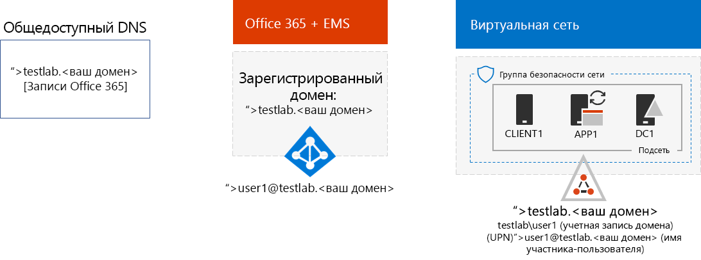
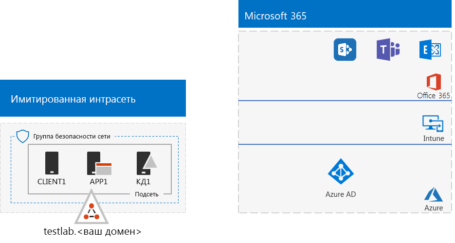
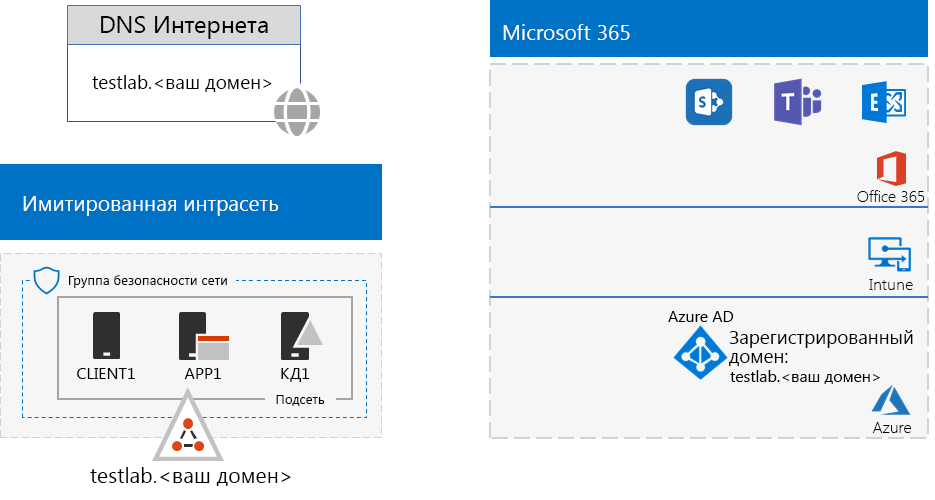

# <a name="password-hash-synchronization-for-your-microsoft-365-test-environment"></a><span data-ttu-id="a9541-103">Синхронизация хэшей паролей для тестовой среды Microsoft 365</span><span class="sxs-lookup"><span data-stu-id="a9541-103">Password hash synchronization for your Microsoft 365 test environment</span></span>

<span data-ttu-id="a9541-p101">Многие организации используют Azure AD Connect и синхронизацию хэшей паролей, чтобы синхронизировать набор учетных записей в локальном лесу Windows Server Active Directory (AD) с набором учетных записей в клиенте Azure AD, связанном с подписками на Office 365 и EMS E5. В этой статье описано, как добавить синхронизацию хэшей паролей в тестовую среду Microsoft 365, чтобы получить указанную ниже конфигурацию.</span><span class="sxs-lookup"><span data-stu-id="a9541-p101">Many organizations use Azure AD Connect and password hash synchronization to synchronize the set of accounts in their on-premises Windows Server Active Directory (AD) forest to the set of accounts in the Azure AD tenant of their Office 365 and EMS E5 subscriptions. This article describes how you can add password hash synchronization to your Microsoft 365 test environment, resulting in the following configuration:</span></span>
  

  
<span data-ttu-id="a9541-107">Настройка этой тестовой среды состоит из двух следующих этапов:</span><span class="sxs-lookup"><span data-stu-id="a9541-107">There are two phases to setting up this test environment:</span></span>
  
1. <span data-ttu-id="a9541-108">Создание тестовой среды "имитация предприятия Microsoft 365".</span><span class="sxs-lookup"><span data-stu-id="a9541-108">Create the Microsoft 365 simulated enterprise test environment.</span></span>
2. <span data-ttu-id="a9541-109">Установка и настройка Azure AD Connect на виртуальной машине APP1.</span><span class="sxs-lookup"><span data-stu-id="a9541-109">Install and configure Azure AD Connect on APP1.</span></span>
    
> [!TIP]
> <span data-ttu-id="a9541-110">Щелкните [здесь](https://aka.ms/m365etlgstack), чтобы просмотреть схему всех статей, относящихся к руководствам по лаборатории тестирования Microsoft 365 корпоративный.</span><span class="sxs-lookup"><span data-stu-id="a9541-110">Click [here](https://aka.ms/m365etlgstack) for a visual map to all the articles in the Microsoft 365 Enterprise Test Lab Guide stack.</span></span>
  
## <a name="phase-1-create-the-microsoft-365-simulated-enterprise-test-environment"></a><span data-ttu-id="a9541-111">Этап 1. Создание тестовой среды "имитация предприятия" для Microsoft 365.</span><span class="sxs-lookup"><span data-stu-id="a9541-111">Phase 1: Create the Microsoft 365 simulated enterprise test environment</span></span>

<span data-ttu-id="a9541-p102">Следуйте инструкциям в статье о [базовой конфигурации "имитация предприятия" для Microsoft 365](simulated-ent-base-configuration-microsoft-365-enterprise.md). Вот получившаяся конфигурация.</span><span class="sxs-lookup"><span data-stu-id="a9541-p102">Follow the instructions in [simulated enterprise base configuration for Microsoft 365](simulated-ent-base-configuration-microsoft-365-enterprise.md). Here is your resulting configuration.</span></span>
  

  
<span data-ttu-id="a9541-115">Конфигурация состоит из следующих компонентов:</span><span class="sxs-lookup"><span data-stu-id="a9541-115">This configuration consists of:</span></span> 
  
- <span data-ttu-id="a9541-116">пробные или постоянные подписки на Office 365 E5 и EMS E5;</span><span class="sxs-lookup"><span data-stu-id="a9541-116">Office 365 E5 and EMS E5 trial or permanent subscriptions.</span></span>
- <span data-ttu-id="a9541-p103">упрощенная интрасеть организации, подключенная к Интернету и состоящая из трех виртуальных машин в виртуальной сети Azure (DC1, APP1 и CLIENT1). DC1 — это контроллер Windows Server AD testlab.\<имя публичного домена>.</span><span class="sxs-lookup"><span data-stu-id="a9541-p103">A simplified organization intranet connected to the Internet, consisting of the DC1, APP1, and CLIENT1 virtual machines in an Azure virtual network. DC1 is a domain controller for the testlab.\<your public domain name> Windows Server AD domain.</span></span>

## <a name="phase-2-create-and-register-the-testlab-domain"></a><span data-ttu-id="a9541-119">Этап 2. Создание и регистрация домена testlab</span><span class="sxs-lookup"><span data-stu-id="a9541-119">Phase 2: Create and register the testlab domain</span></span>

<span data-ttu-id="a9541-120">На этом этапе создается и добавляется в подписку публичный домен DNS.</span><span class="sxs-lookup"><span data-stu-id="a9541-120">In this phase you add a public DNS domain and add it to your subscription.</span></span>

<span data-ttu-id="a9541-p104">Сначала под руководством регистратора создайте новое имя публичного домена DNS на основе текущего имени домена и добавьте его в подписку на Office 365. Рекомендуем использовать имя **testlab.**\<ваш публичный домен>. Например, если имя вашего публичного домена — <span>**contoso</span>.com**, добавьте имя **<span>testlab</span>.contoso.com**.</span><span class="sxs-lookup"><span data-stu-id="a9541-p104">First, work with your public DNS registration provider to create a new public DNS domain name based on your current domain name and add it to your Office 365 subscription. We recommend using the name **testlab.**\<your public domain>. For example, if your public domain name is <span>**contoso</span>.com**, add the public domain name **<span>testlab</span>.contoso.com**.</span></span>
  
<span data-ttu-id="a9541-p105">Затем добавьте домен **testlab.**\<ваш публичный домен> в свою пробную или постоянную подписку на Office 365, пройдя процесс регистрации домена, который состоит из добавления дополнительных записей DNS в домен **testlab.**\<ваш публичный домен>. Дополнительные сведения см. в статье [Добавление пользователей и домена в Office 365](https://support.office.com/article/Add-users-and-domain-to-Office-365-6383f56d-3d09-4dcb-9b41-b5f5a5efd611).</span><span class="sxs-lookup"><span data-stu-id="a9541-p105">Next, you add the **testlab.**\<your public domain> domain to your Office 365 trial or permanent subscription by going through the domain registration process. This consists of adding additional DNS records to the **testlab.**\<your public domain> domain. For more information, see [Add users and domain to Office 365](https://support.office.com/article/Add-users-and-domain-to-Office-365-6383f56d-3d09-4dcb-9b41-b5f5a5efd611).</span></span> 

<span data-ttu-id="a9541-127">Ниже показана итоговая конфигурация.</span><span class="sxs-lookup"><span data-stu-id="a9541-127">Here is your resulting configuration.</span></span>
  

  
<span data-ttu-id="a9541-129">Конфигурация состоит из следующих компонентов:</span><span class="sxs-lookup"><span data-stu-id="a9541-129">This configuration consists of:</span></span>

- <span data-ttu-id="a9541-130">пробные или постоянные подписки на Office 365 E5 и EMS E5 с зарегистрированным доменом DNS testlab.\<имя вашего публичного домена>;</span><span class="sxs-lookup"><span data-stu-id="a9541-130">Office 365 E5 and EMS E5 trial or permanent subscriptions with the DNS domain testlab.\<your public domain name> registered.</span></span>
- <span data-ttu-id="a9541-131">Упрощенная интрасеть организации, подключенная к Интернету и состоящая из виртуальных машин DC1, APP1 и CLIENT1 в подсети, входящей в виртуальную сеть Azure.</span><span class="sxs-lookup"><span data-stu-id="a9541-131">A simplified organization intranet connected to the Internet, consisting of the DC1, APP1, and CLIENT1 virtual machines on a subnet of an Azure virtual network.</span></span>

<span data-ttu-id="a9541-132">Обратите внимание, что testlab.\<имя вашего публичного домена> теперь:</span><span class="sxs-lookup"><span data-stu-id="a9541-132">Notice how the testlab.\<your public domain name> is now:</span></span>

- <span data-ttu-id="a9541-133">поддерживается общедоступными DNS-записями;</span><span class="sxs-lookup"><span data-stu-id="a9541-133">Supported by public DNS records.</span></span>
- <span data-ttu-id="a9541-134">зарегистрирован в подписках на Office 365 и EMS;</span><span class="sxs-lookup"><span data-stu-id="a9541-134">Registered in your Office 365 and EMS subscriptions.</span></span>
- <span data-ttu-id="a9541-135">является доменом Windows Server AD в имитации интрасети.</span><span class="sxs-lookup"><span data-stu-id="a9541-135">The Windows Server AD domain on your simulated intranet.</span></span>
     
## <a name="phase-3-install-azure-ad-connect-on-app1"></a><span data-ttu-id="a9541-136">Этап 3. Установка Azure AD Connect на APP1</span><span class="sxs-lookup"><span data-stu-id="a9541-136">Phase 3: Install Azure AD Connect on APP1</span></span>

<span data-ttu-id="a9541-137">На этом этапе устанавливается и настраивается инструмент Azure AD Connect на APP1, а затем проверяется его работа.</span><span class="sxs-lookup"><span data-stu-id="a9541-137">In this phase, you install and configure the Azure AD Connect tool on APP1, and then verify that it works.</span></span>
  
<span data-ttu-id="a9541-138">Сначала выполняется установка и настройка Azure AD Connect на APP1.</span><span class="sxs-lookup"><span data-stu-id="a9541-138">First, you install and configure Azure AD Connect on APP1.</span></span>

1. <span data-ttu-id="a9541-139">На [портале Azure](https://portal.azure.com) выполните вход с помощью учетной записи глобального администратора и подключитесь к виртуальной машине APP1 с помощью учетной записи TESTLAB\\User1.</span><span class="sxs-lookup"><span data-stu-id="a9541-139">From the [Azure portal](https://portal.azure.com), sign in with your global administrator account, and then connect to APP1 with the TESTLAB\\User1 account.</span></span>
    
2. <span data-ttu-id="a9541-140">На рабочем столе APP1 откройте командную строку Windows PowerShell с правами администратора и выполните указанные ниже команды.</span><span class="sxs-lookup"><span data-stu-id="a9541-140">From the desktop of APP1, open an administrator-level Windows PowerShell command prompt, and then run these commands:</span></span>
    
   ```
   Set-ItemProperty -Path "HKLM:\SOFTWARE\Microsoft\Active Setup\Installed Components\{A509B1A7-37EF-4b3f-8CFC-4F3A74704073}" -Name "IsInstalled" -Value 0
   Set-ItemProperty -Path "HKLM:\SOFTWARE\Microsoft\Active Setup\Installed Components\{A509B1A8-37EF-4b3f-8CFC-4F3A74704073}" -Name "IsInstalled" -Value 0
   Stop-Process -Name Explorer -Force
   ```

3. <span data-ttu-id="a9541-141">На панели задач выберите **Internet Explorer** и перейдите по адресу [https://aka.ms/aadconnect](https://aka.ms/aadconnect).</span><span class="sxs-lookup"><span data-stu-id="a9541-141">From the task bar, click **Internet Explorer** and go to [https://aka.ms/aadconnect](https://aka.ms/aadconnect).</span></span>
    
4. <span data-ttu-id="a9541-142">На странице Microsoft Azure Active Directory Connect нажмите **Скачать**, а затем **Запустить**.</span><span class="sxs-lookup"><span data-stu-id="a9541-142">On the Microsoft Azure Active Directory Connect page, click **Download**, and then click **Run**.</span></span>
    
5. <span data-ttu-id="a9541-143">На странице **Добро пожаловать в Azure AD Connect** установите флажок **Принимаю** и нажмите кнопку **Продолжить**.</span><span class="sxs-lookup"><span data-stu-id="a9541-143">On the **Welcome to Azure AD Connect** page, click **I agree**, and then click **Continue**.</span></span>
    
6. <span data-ttu-id="a9541-144">На странице **Стандартные параметры** выберите **Использовать стандартные параметры**.</span><span class="sxs-lookup"><span data-stu-id="a9541-144">On the **Express Settings** page, click **Use express settings**.</span></span>
    
7. <span data-ttu-id="a9541-145">На странице **Подключение к Azure AD** введите имя своей учетной записи глобального администратора Office 365 в поле **Имя пользователя**, введите пароль в поле **Пароль** и нажмите кнопку **Далее**.</span><span class="sxs-lookup"><span data-stu-id="a9541-145">On the **Connect to Azure AD** page, type your Office 365 global administrator account name in **Username,** type its password in **Password**, and then click **Next**.</span></span>
    
8. <span data-ttu-id="a9541-146">На странице **Подключение к AD DS** введите **TESTLAB\\User1** в поле **Имя пользователя** и пароль в поле **Пароль**, а затем нажмите кнопку **Далее**.</span><span class="sxs-lookup"><span data-stu-id="a9541-146">On the **Connect to AD DS** page, type **TESTLAB\\User1** in **Username,** type its password in **Password**, and then click **Next**.</span></span>
    
9. <span data-ttu-id="a9541-147">На странице **Готово к настройке** нажмите **Установить**.</span><span class="sxs-lookup"><span data-stu-id="a9541-147">On the **Ready to configure** page, click **Install**.</span></span>
    
10. <span data-ttu-id="a9541-148">На странице **Настройка завершена** нажмите **Выход**.</span><span class="sxs-lookup"><span data-stu-id="a9541-148">On the **Configuration complete** page, click **Exit**.</span></span>
    
11. <span data-ttu-id="a9541-149">В Internet Explorer откройте портал Office 365 ([https://portal.office.com](https://portal.office.com)).</span><span class="sxs-lookup"><span data-stu-id="a9541-149">In Internet Explorer, go to the Office 365 portal ([https://portal.office.com](https://portal.office.com)).</span></span>
    
12. <span data-ttu-id="a9541-150">На главной странице портала нажмите **Администратор**.</span><span class="sxs-lookup"><span data-stu-id="a9541-150">From the main portal page, click **Admin**.</span></span>
    
13. <span data-ttu-id="a9541-151">На панели навигации слева выберите **Пользователи > Активные пользователи**.</span><span class="sxs-lookup"><span data-stu-id="a9541-151">In the left navigation, click **Users > Active users**.</span></span>
    
    <span data-ttu-id="a9541-p106">Обратите внимание на учетную запись **User1**. Эта учетная запись из домена Windows Server AD TESTLAB является доказательством того, что синхронизация каталогов сработала.</span><span class="sxs-lookup"><span data-stu-id="a9541-p106">Note the account named **User1**. This account is from the TESTLAB Windows Server AD domain and is proof that directory synchronization has worked.</span></span>
    
14. <span data-ttu-id="a9541-p107">Выберите учетную запись **User1**. Нажмите кнопку **Изменить** для лицензий на продукты.</span><span class="sxs-lookup"><span data-stu-id="a9541-p107">Click the **User1** account. For product licenses, click **Edit**.</span></span>
    
15. <span data-ttu-id="a9541-p108">На панели **Лицензии на продукты** выберите страну и переведите переключатель **Office 365 корпоративный E5** в положение **Вкл.** Выполните те же действия для лицензии **Enterprise Mobility + Security E5**.</span><span class="sxs-lookup"><span data-stu-id="a9541-p108">In **Product licenses**, select your scountry, and then click the **Off** control for **Office 365 Enterprise E5** (switching it to **On**). Do the same for the **Enterprise Mobility + Security E5** license.</span></span> 

16. <span data-ttu-id="a9541-158">Нажмите **Сохранить** в нижней части страницы, а затем нажмите кнопку **Закрыть**.</span><span class="sxs-lookup"><span data-stu-id="a9541-158">Click **Save** at the bottom of the page, and then click **Close**.</span></span>
    
<span data-ttu-id="a9541-159">Затем проверьте возможность входа в вашу подписку на Office 365 с использованием учетной записи <strong>user1@testlab.</strong>\<имя вашего домена> на имя пользователя User1.</span><span class="sxs-lookup"><span data-stu-id="a9541-159">Next, you test the ability to sign in to your Office 365 subscription with the <strong>user1@testlab.</strong>\<your domain name> user name of the User1 account.</span></span>

1. <span data-ttu-id="a9541-160">Выйдите из Office 365 на APP1 и повторно войдите, используя другую учетную запись.</span><span class="sxs-lookup"><span data-stu-id="a9541-160">From APP1, sign out of Office 365, and then sign in again, this time specifying a different account.</span></span>

2. <span data-ttu-id="a9541-p109">При появлении запроса имени пользователя и пароля, укажите <strong>user1@testlab.</strong>\<имя вашего домена> и пароль пользователя User1. Должен произойти успешный вход в качестве пользователя User1.</span><span class="sxs-lookup"><span data-stu-id="a9541-p109">When prompted for a user name and password, specify <strong>user1@testlab.</strong>\<your domain name> and the User1 password. You should successfully sign in as User1.</span></span> 
 
<span data-ttu-id="a9541-p110">Обратите внимание, что хотя у пользователя User1 есть разрешения администратора для домена TESTLAB Windows Server AD, он не является глобальным администратором Office 365. Поэтому значок **Администрирования** не будет отображаться в параметрах.</span><span class="sxs-lookup"><span data-stu-id="a9541-p110">Notice that although User1 has domain administrator permissions for the TESTLAB Windows Server AD domain, it is not an Office 365 global administrator. Therefore, you will not see the **Admin** icon as an option.</span></span> 

<span data-ttu-id="a9541-165">Ниже показана итоговая конфигурация.</span><span class="sxs-lookup"><span data-stu-id="a9541-165">Here is your resulting configuration.</span></span>


<span data-ttu-id="a9541-167">Конфигурация состоит из следующих компонентов:</span><span class="sxs-lookup"><span data-stu-id="a9541-167">This configuration consists of:</span></span> 
  
- <span data-ttu-id="a9541-168">Пробные или постоянные подписки на Office 365 E5 и EMS E5 с зарегистрированным доменом DNS TESTLAB.\<доменное имя>.</span><span class="sxs-lookup"><span data-stu-id="a9541-168">Office 365 E5 and EMS E5 trial or permanent subscriptions with the DNS domain TESTLAB.\<your domain name> registered.</span></span>
- <span data-ttu-id="a9541-p111">Упрощенная интрасеть организации, подключенная к Интернету и состоящая из виртуальных машин DC1, APP1 и CLIENT1 в подсети виртуальной сети Azure. Azure AD Connect работает на APP1 для периодической синхронизации домена Windows Server AD TESTLAB с клиентом Azure AD, связанным с подписками на Office 365 и EMS E5.</span><span class="sxs-lookup"><span data-stu-id="a9541-p111">A simplified organization intranet connected to the Internet, consisting of the DC1, APP1, and CLIENT1 virtual machines on a subnet of an Azure virtual network. Azure AD Connect runs on APP1 to synchronize the TESTLAB Windows Server AD domain to the Azure AD tenant of your Office 365 and EMS E5 subscriptions periodically.</span></span>
- <span data-ttu-id="a9541-171">Учетная запись User1 в домене Windows Server AD TESTLAB синхронизирована с клиентом Azure AD.</span><span class="sxs-lookup"><span data-stu-id="a9541-171">The User1 account in the TESTLAB  Windows Server AD domain has been synchronized with the Azure AD tenant.</span></span>

## <a name="next-step"></a><span data-ttu-id="a9541-172">Следующее действие</span><span class="sxs-lookup"><span data-stu-id="a9541-172">Next step</span></span>

<span data-ttu-id="a9541-173">Ознакомьтесь с дополнительными функциями и возможностями [идентификации](m365-enterprise-test-lab-guides.md#identity) в тестовой среде.</span><span class="sxs-lookup"><span data-stu-id="a9541-173">Explore additional [identity](m365-enterprise-test-lab-guides.md#identity) features and capabilities in your test environment.</span></span>

## <a name="see-also"></a><span data-ttu-id="a9541-174">См. также</span><span class="sxs-lookup"><span data-stu-id="a9541-174">See also</span></span>

[<span data-ttu-id="a9541-175">Руководства по лаборатории тестирования для Microsoft 365 корпоративный</span><span class="sxs-lookup"><span data-stu-id="a9541-175">Microsoft 365 Enterprise Test Lab Guides</span></span>](m365-enterprise-test-lab-guides.md)

[<span data-ttu-id="a9541-176">Развертывание Microsoft 365 корпоративный</span><span class="sxs-lookup"><span data-stu-id="a9541-176">Deploy Microsoft 365 Enterprise</span></span>](deploy-microsoft-365-enterprise.md)

[<span data-ttu-id="a9541-177">Документация по Microsoft 365 корпоративный</span><span class="sxs-lookup"><span data-stu-id="a9541-177">Microsoft 365 Enterprise documentation</span></span>](https://docs.microsoft.com/microsoft-365-enterprise/)


