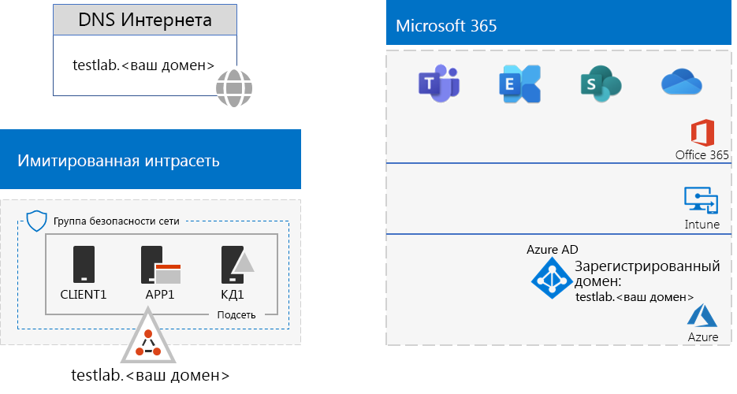

# <a name="password-hash-synchronization-for-your-microsoft-365-test-environment"></a><span data-ttu-id="af70e-103">Синхронизация хэшей паролей для тестовой среды Microsoft 365</span><span class="sxs-lookup"><span data-stu-id="af70e-103">Password hash synchronization for your Microsoft 365 test environment</span></span>

<span data-ttu-id="af70e-104">*Это руководство по лаборатории тестирования можно использовать для тестовых сред Microsoft 365 корпоративный и Office 365 корпоративный.*</span><span class="sxs-lookup"><span data-stu-id="af70e-104">*This Test Lab Guide can be used for both Microsoft 365 Enterprise and Office 365 Enterprise test environments.*</span></span>

<span data-ttu-id="af70e-105">Во многих организациях используются Azure AD Connect и синхронизация хэша паролей в целях синхронизации набора учетных записей в своем локальном лесу доменных служб Active Directory (AD DS) с набором учетных записей в клиенте Azure AD для подписки на Microsoft 365 или Office 365.</span><span class="sxs-lookup"><span data-stu-id="af70e-105">Many organizations use Azure AD Connect and password hash synchronization to synchronize the set of accounts in their on-premises Active Directory Domain Services (AD DS) forest to the set of accounts in the Azure AD tenant of their Microsoft 365 or Office 365 subscription.</span></span> <span data-ttu-id="af70e-106">В этой статье описывается добавление синхронизации хэша паролей в тестовую среду Microsoft 365, в результате чего получается следующая конфигурация:</span><span class="sxs-lookup"><span data-stu-id="af70e-106">This article describes how you can add password hash synchronization to your Microsoft 365 test environment, resulting in the following configuration:</span></span>
  

  
<span data-ttu-id="af70e-108">Настройка этой тестовой среды состоит из двух следующих этапов:</span><span class="sxs-lookup"><span data-stu-id="af70e-108">There are two phases to setting up this test environment:</span></span>
  
1. <span data-ttu-id="af70e-109">Создание тестовой среды "имитация предприятия Microsoft 365".</span><span class="sxs-lookup"><span data-stu-id="af70e-109">Create the Microsoft 365 simulated enterprise test environment.</span></span>
2. <span data-ttu-id="af70e-110">Установка и настройка Azure AD Connect на виртуальной машине APP1.</span><span class="sxs-lookup"><span data-stu-id="af70e-110">Install and configure Azure AD Connect on APP1.</span></span>
    
> [!TIP]
> <span data-ttu-id="af70e-111">Щелкните [здесь](../media/m365-enterprise-test-lab-guides/Microsoft365EnterpriseTLGStack.pdf), чтобы просмотреть схему всех статей, относящихся к руководствам по лаборатории тестирования Microsoft 365 корпоративный.</span><span class="sxs-lookup"><span data-stu-id="af70e-111">Click [here](../media/m365-enterprise-test-lab-guides/Microsoft365EnterpriseTLGStack.pdf) for a visual map to all the articles in the Microsoft 365 Enterprise Test Lab Guide stack.</span></span>
  
## <a name="phase-1-create-the-microsoft-365-simulated-enterprise-test-environment"></a><span data-ttu-id="af70e-112">Этап 1. Создание тестовой среды "имитация предприятия" для Microsoft 365.</span><span class="sxs-lookup"><span data-stu-id="af70e-112">Phase 1: Create the Microsoft 365 simulated enterprise test environment</span></span>

<span data-ttu-id="af70e-p102">Следуйте инструкциям в статье о [базовой конфигурации "имитация предприятия" для Microsoft 365](simulated-ent-base-configuration-microsoft-365-enterprise.md). Вот получившаяся конфигурация.</span><span class="sxs-lookup"><span data-stu-id="af70e-p102">Follow the instructions in [simulated enterprise base configuration for Microsoft 365](simulated-ent-base-configuration-microsoft-365-enterprise.md). Here is your resulting configuration.</span></span>
  

  
<span data-ttu-id="af70e-116">Конфигурация состоит из следующих компонентов:</span><span class="sxs-lookup"><span data-stu-id="af70e-116">This configuration consists of:</span></span> 
  
- <span data-ttu-id="af70e-117">Пробные или платные подписки на Microsoft 365 E5 или Office 365 E5.</span><span class="sxs-lookup"><span data-stu-id="af70e-117">Microsoft 365 E5 or Office 365 E5 trial or paid subscriptions.</span></span>
- <span data-ttu-id="af70e-118">Упрощенная интрасеть организации, подключенная к Интернету и состоящая из виртуальных машин DC1, APP1 и CLIENT1 в виртуальной сети Azure.</span><span class="sxs-lookup"><span data-stu-id="af70e-118">A simplified organization intranet connected to the Internet, consisting of the DC1, APP1, and CLIENT1 virtual machines in an Azure virtual network.</span></span> <span data-ttu-id="af70e-119">DC1 — контроллер домена для домена testlab.\<имя вашего общедоступного домена> AD DS.</span><span class="sxs-lookup"><span data-stu-id="af70e-119">DC1 is a domain controller for the testlab.\<your public domain name> AD DS domain.</span></span>

## <a name="phase-2-create-and-register-the-testlab-domain"></a><span data-ttu-id="af70e-120">Этап 2. Создание и регистрация домена testlab</span><span class="sxs-lookup"><span data-stu-id="af70e-120">Phase 2: Create and register the testlab domain</span></span>

<span data-ttu-id="af70e-121">На этом этапе создается и добавляется в подписку публичный домен DNS.</span><span class="sxs-lookup"><span data-stu-id="af70e-121">In this phase you add a public DNS domain and add it to your subscription.</span></span>

<span data-ttu-id="af70e-p104">Сначала под руководством регистратора создайте новое имя публичного домена DNS на основе текущего имени домена и добавьте его в свою подписку. Рекомендуем использовать имя **testlab.**\<ваш публичный домен>. Например, если имя вашего публичного домена — **<span>contoso</span>.com**, добавьте имя **<span>testlab</span>.contoso.com**.</span><span class="sxs-lookup"><span data-stu-id="af70e-p104">First, work with your public DNS registration provider to create a new public DNS domain name based on your current domain name and add it to your subscription. We recommend using the name **testlab.**\<your public domain>. For example, if your public domain name is **<span>contoso</span>.com**, add the public domain name **<span>testlab</span>.contoso.com**.</span></span>
  
<span data-ttu-id="af70e-125">Затем добавьте домен **testlab.**\<общедоступный домен> в пробную или платную подписку на Microsoft 365 или Office 365, пройдя процесс регистрации домена.</span><span class="sxs-lookup"><span data-stu-id="af70e-125">Next, you add the **testlab.**\<your public domain> domain to your Microsoft 365 or Office 365 trial or paid subscription by going through the domain registration process.</span></span> <span data-ttu-id="af70e-126">Он включает добавление записей DNS к домену **testlab.**\<общедоступный домен>.</span><span class="sxs-lookup"><span data-stu-id="af70e-126">This consists of adding additional DNS records to the **testlab.**\<your public domain> domain.</span></span> <span data-ttu-id="af70e-127">Дополнительные сведения см. в статье [Добавление домена в Office 365](https://docs.microsoft.com/office365/admin/setup/add-domain).</span><span class="sxs-lookup"><span data-stu-id="af70e-127">For more information, see [Add a domain to Office 365](https://docs.microsoft.com/office365/admin/setup/add-domain).</span></span> 

<span data-ttu-id="af70e-128">Ниже показана итоговая конфигурация.</span><span class="sxs-lookup"><span data-stu-id="af70e-128">Here is your resulting configuration.</span></span>
  

  
<span data-ttu-id="af70e-130">Конфигурация состоит из следующих компонентов:</span><span class="sxs-lookup"><span data-stu-id="af70e-130">This configuration consists of:</span></span>

- <span data-ttu-id="af70e-131">Пробные или платные подписки на Microsoft 365 E5 или Office 365 E5 с зарегистрированным доменом DNS testlab.\<имя общедоступного домена>.</span><span class="sxs-lookup"><span data-stu-id="af70e-131">Microsoft 365 E5 or Office 365 E5 trial or paid subscriptions with the DNS domain testlab.\<your public domain name> registered.</span></span>
- <span data-ttu-id="af70e-132">Упрощенная интрасеть организации, подключенная к Интернету и состоящая из виртуальных машин DC1, APP1 и CLIENT1 в подсети, входящей в виртуальную сеть Azure.</span><span class="sxs-lookup"><span data-stu-id="af70e-132">A simplified organization intranet connected to the Internet, consisting of the DC1, APP1, and CLIENT1 virtual machines on a subnet of an Azure virtual network.</span></span>

<span data-ttu-id="af70e-133">Обратите внимание, что testlab.\<имя вашего публичного домена> теперь:</span><span class="sxs-lookup"><span data-stu-id="af70e-133">Notice how the testlab.\<your public domain name> is now:</span></span>

- <span data-ttu-id="af70e-134">поддерживается общедоступными DNS-записями;</span><span class="sxs-lookup"><span data-stu-id="af70e-134">Supported by public DNS records.</span></span>
- <span data-ttu-id="af70e-135">зарегистрирован в подписках на Microsoft 365 или Office 365;</span><span class="sxs-lookup"><span data-stu-id="af70e-135">Registered in your Microsoft 365 or Office 365 subscriptions.</span></span>
- <span data-ttu-id="af70e-136">является доменом AD DS в имитации интрасети.</span><span class="sxs-lookup"><span data-stu-id="af70e-136">The AD DS domain on your simulated intranet.</span></span>
     
## <a name="phase-3-install-azure-ad-connect-on-app1"></a><span data-ttu-id="af70e-137">Этап 3. Установка Azure AD Connect на APP1</span><span class="sxs-lookup"><span data-stu-id="af70e-137">Phase 3: Install Azure AD Connect on APP1</span></span>

<span data-ttu-id="af70e-138">На этом этапе устанавливается и настраивается инструмент Azure AD Connect на APP1, а затем проверяется его работа.</span><span class="sxs-lookup"><span data-stu-id="af70e-138">In this phase, you install and configure the Azure AD Connect tool on APP1, and then verify that it works.</span></span>
  
<span data-ttu-id="af70e-139">Сначала выполняется установка и настройка Azure AD Connect на APP1.</span><span class="sxs-lookup"><span data-stu-id="af70e-139">First, you install and configure Azure AD Connect on APP1.</span></span>

1. <span data-ttu-id="af70e-140">На [портале Azure](https://portal.azure.com) выполните вход с помощью учетной записи глобального администратора и подключитесь к виртуальной машине APP1 с помощью учетной записи TESTLAB\\User1.</span><span class="sxs-lookup"><span data-stu-id="af70e-140">From the [Azure portal](https://portal.azure.com), sign in with your global administrator account, and then connect to APP1 with the TESTLAB\\User1 account.</span></span>
    
2. <span data-ttu-id="af70e-141">На рабочем столе APP1 откройте командную строку Windows PowerShell с правами администратора и выполните указанные ниже команды.</span><span class="sxs-lookup"><span data-stu-id="af70e-141">From the desktop of APP1, open an administrator-level Windows PowerShell command prompt, and then run these commands:</span></span>
    
   ```powershell
   Set-ItemProperty -Path "HKLM:\SOFTWARE\Microsoft\Active Setup\Installed Components\{A509B1A7-37EF-4b3f-8CFC-4F3A74704073}" -Name "IsInstalled" -Value 0
   Set-ItemProperty -Path "HKLM:\SOFTWARE\Microsoft\Active Setup\Installed Components\{A509B1A8-37EF-4b3f-8CFC-4F3A74704073}" -Name "IsInstalled" -Value 0
   Stop-Process -Name Explorer -Force
   ```

3. <span data-ttu-id="af70e-142">На панели задач выберите **Internet Explorer** и перейдите по адресу [https://aka.ms/aadconnect](https://aka.ms/aadconnect).</span><span class="sxs-lookup"><span data-stu-id="af70e-142">From the task bar, click **Internet Explorer** and go to [https://aka.ms/aadconnect](https://aka.ms/aadconnect).</span></span>
    
4. <span data-ttu-id="af70e-143">На странице Microsoft Azure Active Directory Connect нажмите **Скачать**, а затем **Запустить**.</span><span class="sxs-lookup"><span data-stu-id="af70e-143">On the Microsoft Azure Active Directory Connect page, click **Download**, and then click **Run**.</span></span>
    
5. <span data-ttu-id="af70e-144">На странице **Добро пожаловать в Azure AD Connect** установите флажок **Принимаю** и нажмите кнопку **Продолжить**.</span><span class="sxs-lookup"><span data-stu-id="af70e-144">On the **Welcome to Azure AD Connect** page, click **I agree**, and then click **Continue**.</span></span>
    
6. <span data-ttu-id="af70e-145">На странице **Стандартные параметры** выберите **Использовать стандартные параметры**.</span><span class="sxs-lookup"><span data-stu-id="af70e-145">On the **Express Settings** page, click **Use express settings**.</span></span>
    
7. <span data-ttu-id="af70e-146">На странице **Подключение к Azure AD** введите имя своей учетной записи глобального администратора в поле **Имя пользователя**, введите пароль в поле **Пароль** и нажмите кнопку **Далее**.</span><span class="sxs-lookup"><span data-stu-id="af70e-146">On the **Connect to Azure AD** page, type your global administrator account name in **Username,** type its password in **Password**, and then click **Next**.</span></span>
    
8. <span data-ttu-id="af70e-147">На странице **Подключение к AD DS** введите **TESTLAB\\User1** в поле **Имя пользователя** и пароль в поле **Пароль**, а затем нажмите кнопку **Далее**.</span><span class="sxs-lookup"><span data-stu-id="af70e-147">On the **Connect to AD DS** page, type **TESTLAB\\User1** in **Username,** type its password in **Password**, and then click **Next**.</span></span>
    
9. <span data-ttu-id="af70e-148">На странице **Готово к настройке** нажмите **Установить**.</span><span class="sxs-lookup"><span data-stu-id="af70e-148">On the **Ready to configure** page, click **Install**.</span></span>
    
10. <span data-ttu-id="af70e-149">На странице **Настройка завершена** нажмите **Выход**.</span><span class="sxs-lookup"><span data-stu-id="af70e-149">On the **Configuration complete** page, click **Exit**.</span></span>
    
11. <span data-ttu-id="af70e-150">В браузере Internet Explorer перейдите в Центр администрирования Microsoft 365 ([https://portal.microsoft.com](https://portal.microsoft.com)).</span><span class="sxs-lookup"><span data-stu-id="af70e-150">In Internet Explorer, go to the Microsoft 365 admin center ([https://portal.microsoft.com](https://portal.microsoft.com)).</span></span>
    
12. <span data-ttu-id="af70e-151">На панели навигации слева выберите элементы **Пользователи > Активные пользователи**.</span><span class="sxs-lookup"><span data-stu-id="af70e-151">In the left navigation, click **Users > Active users**.</span></span>
    
    <span data-ttu-id="af70e-152">Обратите внимание на учетную запись **User1**.</span><span class="sxs-lookup"><span data-stu-id="af70e-152">Note the account named **User1**.</span></span> <span data-ttu-id="af70e-153">Эта учетная запись находится на домене AD DS TESTLAB. Это доказывает, что синхронизация службы каталогов выполнена успешно.</span><span class="sxs-lookup"><span data-stu-id="af70e-153">This account is from the TESTLAB AD DS domain and is proof that directory synchronization has worked.</span></span>
    
13. <span data-ttu-id="af70e-154">Щелкните учетную запись **User1** и выберите **Лицензии и приложения**.</span><span class="sxs-lookup"><span data-stu-id="af70e-154">Click the **User1** account, and then click **Licenses and apps**.</span></span>
    
14. <span data-ttu-id="af70e-155">В разделе **Лицензии продуктов** выберите свое расположение (при необходимости), отключите лицензию на **Office 365 E5** и включите лицензию на **Microsoft 365 E5**.</span><span class="sxs-lookup"><span data-stu-id="af70e-155">In **Product licenses**, select your location (if needed), disable the **Office 365 E5** license and enable the **Microsoft 365 E5** license.</span></span> 

15. <span data-ttu-id="af70e-156">Нажмите **Сохранить** в нижней части страницы, а затем нажмите кнопку **Закрыть**.</span><span class="sxs-lookup"><span data-stu-id="af70e-156">Click **Save** at the bottom of the page, and then click **Close**.</span></span>
    
<span data-ttu-id="af70e-157">Затем проверьте возможность входа в вашу подписку с использованием учетной записи <strong>user1@testlab.</strong>\<имя вашего домена> на имя пользователя User1.</span><span class="sxs-lookup"><span data-stu-id="af70e-157">Next, you test the ability to sign in to your subscription with the <strong>user1@testlab.</strong>\<your domain name> user name of the User1 account.</span></span>

1. <span data-ttu-id="af70e-158">Находясь в APP1, выйдите и повторно войдите, используя другую учетную запись.</span><span class="sxs-lookup"><span data-stu-id="af70e-158">From APP1, sign out, and then sign in again, this time specifying a different account.</span></span>

2. <span data-ttu-id="af70e-p107">При появлении запроса имени пользователя и пароля, укажите <strong>user1@testlab.</strong>\<имя вашего домена> и пароль пользователя User1. Должен произойти успешный вход в качестве пользователя User1.</span><span class="sxs-lookup"><span data-stu-id="af70e-p107">When prompted for a user name and password, specify <strong>user1@testlab.</strong>\<your domain name> and the User1 password. You should successfully sign in as User1.</span></span> 
 
<span data-ttu-id="af70e-161">Обратите внимание, что хотя у пользователя User1 есть разрешения администратора для домена AD DS TESTLAB, он не является глобальным администратором.</span><span class="sxs-lookup"><span data-stu-id="af70e-161">Notice that although User1 has domain administrator permissions for the TESTLAB AD DS domain, it is not a global administrator.</span></span> <span data-ttu-id="af70e-162">Следовательно, значок **Администратор** не будет отображаться.</span><span class="sxs-lookup"><span data-stu-id="af70e-162">Therefore, you will not see the **Admin** icon as an option.</span></span> 

<span data-ttu-id="af70e-163">Ниже показана итоговая конфигурация.</span><span class="sxs-lookup"><span data-stu-id="af70e-163">Here is your resulting configuration.</span></span>


<span data-ttu-id="af70e-165">Конфигурация состоит из следующих компонентов:</span><span class="sxs-lookup"><span data-stu-id="af70e-165">This configuration consists of:</span></span> 
  
- <span data-ttu-id="af70e-166">Пробные или платные подписки на Microsoft 365 E5 или Office 365 E5 с зарегистрированным доменом DNS TESTLAB.\<доменное имя>.</span><span class="sxs-lookup"><span data-stu-id="af70e-166">Microsoft 365 E5 or Office 365 E5 trial or paid subscriptions with the DNS domain TESTLAB.\<your domain name> registered.</span></span>
- <span data-ttu-id="af70e-167">Упрощенная интрасеть организации, подключенная к Интернету и состоящая из виртуальных машин DC1, APP1 и CLIENT1 в подсети, входящей в виртуальную сеть Azure.</span><span class="sxs-lookup"><span data-stu-id="af70e-167">A simplified organization intranet connected to the Internet, consisting of the DC1, APP1, and CLIENT1 virtual machines on a subnet of an Azure virtual network.</span></span> <span data-ttu-id="af70e-168">Azure AD Connect работает на APP1 для периодической синхронизации домена AD DS TESTLAB с клиентом Azure AD, связанным с подпиской на Microsoft 365 или Office 365.</span><span class="sxs-lookup"><span data-stu-id="af70e-168">Azure AD Connect runs on APP1 to synchronize the TESTLAB AD DS domain to the Azure AD tenant of your Microsoft 365 or Office 365 subscription periodically.</span></span>
- <span data-ttu-id="af70e-169">Учетная запись User1 на домене AD DS TESTLAB синхронизирована с клиентом Azure AD.</span><span class="sxs-lookup"><span data-stu-id="af70e-169">The User1 account in the TESTLAB  AD DS domain has been synchronized with the Azure AD tenant.</span></span>

## <a name="next-step"></a><span data-ttu-id="af70e-170">Следующее действие</span><span class="sxs-lookup"><span data-stu-id="af70e-170">Next step</span></span>

<span data-ttu-id="af70e-171">Ознакомьтесь с дополнительными функциями и возможностями [идентификации](m365-enterprise-test-lab-guides.md#identity) в тестовой среде.</span><span class="sxs-lookup"><span data-stu-id="af70e-171">Explore additional [identity](m365-enterprise-test-lab-guides.md#identity) features and capabilities in your test environment.</span></span>

## <a name="see-also"></a><span data-ttu-id="af70e-172">См. также</span><span class="sxs-lookup"><span data-stu-id="af70e-172">See also</span></span>

[<span data-ttu-id="af70e-173">Руководства по лаборатории тестирования для Microsoft 365 корпоративный</span><span class="sxs-lookup"><span data-stu-id="af70e-173">Microsoft 365 Enterprise Test Lab Guides</span></span>](m365-enterprise-test-lab-guides.md)

[<span data-ttu-id="af70e-174">Развертывание Microsoft 365 корпоративный</span><span class="sxs-lookup"><span data-stu-id="af70e-174">Deploy Microsoft 365 Enterprise</span></span>](deploy-microsoft-365-enterprise.md)

[<span data-ttu-id="af70e-175">Документация по Microsoft 365 корпоративный</span><span class="sxs-lookup"><span data-stu-id="af70e-175">Microsoft 365 Enterprise documentation</span></span>](https://docs.microsoft.com/microsoft-365-enterprise/)


