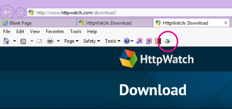
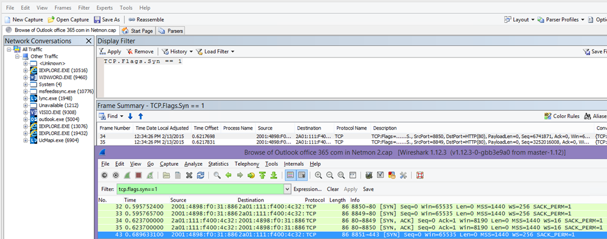

# <a name="performance-troubleshooting-plan-for-office-365"></a>План устранения неполадок с производительностью Office 365

Нужно ли знать, как определить и устранить задержки, зависания и низкую производительность между SharePoint Online, OneDrive для бизнеса, Exchange Online или Skype для бизнеса Online и клиентского компьютера? Прежде чем вызывать службу поддержки, эта статья поможет вам устранить проблемы с производительностью Office 365 и даже устранить некоторые из наиболее распространенных проблем.

Эта статья фактически является образцом плана действий, который можно использовать для сбора ценных данных о проблеме с производительностью во время ее выполнения. В эту статью также включены некоторые главные проблемы.

Если вы еще не знаете производительность сети и хотите разработать долгосрочный план мониторинга производительности между клиентских компьютерами и Office 365, посмотрите на настройку производительности и устранение неполадок Office 365 : администратор и [ИТ-администратор.](performance-tuning-using-baselines-and-history.md)

## <a name="sample-performance-troubleshooting-action-plan"></a>Пример плана действий по устранению неполадок с производительностью

Этот план действий содержит две части; этап подготовки и этап ведения журнала. Если в данный момент у вас возникла проблема с производительностью и вам нужно сделать сбор данных, вы можете сразу начать использовать этот план.

### <a name="prepare-the-client-computer"></a>Подготовка клиентского компьютера

- Найдите клиентский компьютер, который может воспроизвести проблему производительности. Этот компьютер будет использоваться в ходе устранения неполадок.
- Запишите действия, которые приводят к проблеме с производительностью, чтобы быть готовым к проверке.
- Установите средства для сбора и записи информации:
  - Установите [Netmon 3.4](https://www.microsoft.com/download/details.aspx?id=4865) (или используйте эквивалентное средство сетевой трассии).
  - Установите бесплатный выпуск [HTTPWatch Basic](https://www.httpwatch.com/download/) Edition (или используйте эквивалентное средство сетевой трассии).
  - Используйте screen recorder или запустите steps Recorder (PSR.exe), который поставляется с Windows Vista и более поздними версиями, чтобы записать действия, которые вы принимаете во время тестирования.

### <a name="log-the-performance-issue"></a>Занося в журнал проблему с производительностью

- Закроем все лишние интернет-браузеры.
- Запустите steps Recorder или другой экранный регистратор.
- Запустите захват Netmon (или средство трассии сети).
- Очищайте кэш DNS на клиентский компьютер из командной строки, введя ipconfig /flushdns.
- Запустите новый сеанс браузера и включите HTTPWatch.
- Необязательно: если вы тестируете Exchange Online, запустите средство анализа производительности клиента Exchange из консоли администрирования Office 365.
- Воспроизводить точные действия, которые приводят к проблеме с производительностью.
- Остановите трассировка Netmon или другого средства.
- В командной строке запустите маршрут трассировки для подписки на Office 365, введя следующую команду и нажав ввод:

  ``` cmd
  tracert <subscriptionname>.onmicrosoft.com
  ```

- Остановите запись действий и сохраните видео. Обязательно включаем дату и время захвата, а также показывает ли он хорошую или неудаленную производительность.
- Сохраните файлы трассировки. Опять же, обязательно включаем дату и время захвата, а также показывает ли он хорошую или неудаленную производительность.

Если вы не знакомы с запуском средств, упомянутых в этой статье, не беспокойтесь, так как мы предоставляем эти действия далее. Если вы привыкли делать такие записи в сети, можно [](performance-tuning-using-baselines-and-history.md#how-to-collect-baselines)перейти к сбору базовых параметров, в котором описывается фильтрация и чтение журналов.

### <a name="flush-the-dns-cache-first"></a>Очистка DNS-кэша

Почему? Очищая кэш DNS, вы начинаете тесты с чистого листа. Очищая кэш, вы сбрасываете содержимое разрешающих DNS до самых последние записей. Помните, что очистка не удаляет записи файлов HOSTs. Если вы активно используете записи ФАЙЛА HOST, следует скопировать эти записи в файл в другом каталоге, а затем очистить ФАЙЛ HOST.

#### <a name="flush-your-dns-resolver-cache"></a>Очистка кэша разрешения DNS

1. Откройте командную подсказку **(командную** клавишу \> **"Начните запуск"** или \>  **командную** \> **клавишу** Windows).
2. Введите следующую команду и нажмите клавишу ВВОД:

    ``` cmd
    ipconfig /flushdns
    ```

## <a name="netmon"></a>Netmon

Средство мониторинга сети Майкрософт[(Netmon)](https://www.microsoft.com/download/details.aspx?id=4865)анализирует пакеты, то есть трафик, который передается между компьютерами в сетях. Используя Netmon для отслеживания трафика с Office 365, вы можете захватывать, просматривать и считывать заголовки пакетов, выявлять пересекающие устройства, проверять важные параметры сетевого оборудования, искать отброшенные пакеты и отслеживать поток трафика между компьютерами в корпоративной сети и Office 365. Так как фактический текст трафика зашифрован, то есть он (проходит через порт 443 через SSL/TLS, вы не можете прочитать отправленные файлы. Вместо этого вы получаете неотбираемую трассировку пути, которую принимает пакет, что поможет вам отслеживать поведение проблемы.

Убедитесь, что в настоящее время вы не применяли фильтр. Вместо этого необходимо выполнить действия и продемонстрировать проблему, прежде чем останавливать трассировку и сохранять ее.

После установки Netmon 3.4 откройте средство и с помощью указанных здесь действий.

### <a name="take-a-netmon-trace-and-reproduce-the-issue"></a>Трассировка Netmon и воспроизведение проблемы

1. Запустите Netmon 3.4.
На странице "Начните" есть три **области:**"Последние захваты", "Выбор сетей" и "Начало работы с Microsoft Network Monitor   **3.4". Обратите внимание.** На панели "Выбор сетей" также будет отобрален список сетей по умолчанию, из которых можно захватывать. Убедитесь, что сетевые карты выбраны здесь.

2. Нажмите **кнопку "Новый** захват" в верхней части страницы **"Начните".** При этом добавляется новая вкладка рядом со вкладками **"Начальная** страница" под названием **"Захват 1"**.


3. Чтобы сделать простой захват, нажмите кнопку **"Начните"** на панели инструментов.

4. Воспроизводить действия, которые представляют проблему производительности.

5. Click **Stop** \> **File** \> **Save As**. Не забудьте у отметить дату и время в часовом поясе, а также у помнить, показывает ли он некакую или хорошую производительность.

## <a name="httpwatch"></a>HTTPWatch

[HttpWatch](https://www.httpwatch.com/download/) поставляется в режиме с бесплатной и бесплатной версией. Бесплатный выпуск Basic Edition охватывает все необходимое для этого теста. HTTPWatch отслеживает сетевой трафик и время загрузки страницы прямо из окна браузера. HTTPWatch — это подключаемый модуль Internet Explorer, который графически описывает производительность. Анализ можно сохранить и просмотреть в HTTPWatch Studio.

> [!NOTE]
> Если вы используете другой браузер, например Firefox, Google Chrome, или если не можете установить HTTPWatch в Internet Explorer, откройте новое окно браузера и нажмите клавишу F12 на клавиатуре. В нижней части браузера должно отсвещаться всплывающее средство разработчика. Если вы используете Opera, нажмите CTRL+SHIFT+I для Web Inspector, а затем щелкните вкладку **"Сеть"** и завершите тестирование, описанное ниже. Данные будут немного отличаться, но время загрузки по-прежнему будет отображаться в миллисекунах. > HTTPWatch также очень полезен при проблемах со временем загрузки страниц SharePoint Online.

### <a name="run-httpwatch-and-reproduce-the-issue"></a>Запустите HTTPWatch и воспроизведите проблему

HTTPWatch — это подключаемый модуль браузера, поэтому его использование в браузере немного отличается для каждой версии Internet Explorer. Как правило, HTTPWatch можно найти на панели команд в браузере Internet Explorer. Если вы не видите подключаемый модуль HTTPWatch в окне браузера,  проверьте версию браузера, щелкнув "Справка" или в более поздних версиях Internet Explorer, щелкните символ шестеренки и \>  **"О Internet Explorer".** Чтобы запустить **панели команд,** щелкните правой кнопкой мыши в internet Explorer и выберите **пункт "Панели команд".**

В прошлом HTTPWatch был связан как с командами, так и с панели проводника, поэтому после установки, если вы не сразу видите значок (даже после перезагрузки) проверьте "Инструменты" и панели инструментов для значка. Помните, что панели инструментов можно настраивать и добавлять в них параметры.



1. Запустите HTTPWatch в окне браузера Internet Explorer. Он будет отображаться закрепленным в браузере в нижней части этого окна. Нажмите **кнопку "Запись"**.

2. Воспроизводить точные действия, связанные с проблемой производительности. Нажмите **кнопку "Остановить"** в HTTPWatch.

3. **Сохраните** httpWatch или **отправить по электронной почте.** Не забудьте назвать файл таким образом, чтобы он включал сведения о дате и времени, а также указывает, содержит ли ваш watch демонстрацию хорошей или плохой производительности.


Этот снимок экрана— из профессиональной версии HTTPWatch. Вы можете открыть трассировки, сделанные в базовой версии, на компьютере с профессиональной версией и прочитать ее там. Дополнительные сведения могут быть доступны из трассировки с помощью этого метода.

## <a name="problem-steps-recorder"></a>Запись действий по проблеме

Регистратор шагов или PSR.exe позволяет записывать проблемы по мере их решения. Это очень полезный инструмент, который очень прост в запуске.

### <a name="run-problem-steps-recorder-psrexe-to-record-your-work"></a>Run Problem Steps Recorder (PSR.exe) to record your work

1. Либо используйте **тип запуска** \> **PSR.exe** \>  \> **ОК,**  либо щелкните тип ключа Windows \> **PSR.exe** и нажмите \> клавишу ВВОД.

2. Когда появится PSR.exe окна, нажмите кнопку **"Начать** запись" и воспроизведйте действия, которые воспроизводят проблему производительности. При необходимости можно добавить комментарии, нажав кнопку **"Добавить комментарии".**

3. После **завершения действий** нажмите кнопку "Остановить запись". Если проблема с производительностью — отрисовка страницы, подождите, пока страница не будет отрисовка, прежде чем остановить запись.

4. Нажмите кнопку **Сохранить**.


Дата и время записаны для вас. Это позволит вовремя привязить ваш PSR к трассировке Netmon и HTTPWatch, а также поможет вам устранить неполадки с точностью. Например, дата и время в записи PSR могут показать, что между входом и просмотром URL-адреса и частичной отрисовки сайта администрирования проходит минута.

## <a name="read-your-traces"></a>Чтение трассировок

Невозможно обучить пользователей работе с сетью и производительностью с помощью статьи. Для получения хорошего качества производительности требуется опыт и знание работы и обычной работы сети. Однако можно округить список наиболее распространенных проблем и показать, как инструменты могут упростить устранение наиболее распространенных проблем.

Если вы хотите получить навыки чтения сетевых трассировок для сайтов Office 365, нет лучшего преподавателя, чем регулярное создание трассировок загрузки страниц и получение опыта чтения их. Например, если у вас есть возможность, загрузим службу Office 365 и отслежении процесса. Фильтрация трассировки для трафика DNS или поиск в FrameData имени просматриваемой службы. Сканируйте трассировку, чтобы получить представление о действиях, которые происходят при загрузке службы. Это поможет вам узнать, как должна выглядеть обычная нагрузка на страницу, и в случае устранения неполадок, особенно в отношении производительности, сравнение хорошего и плохого трассировок может научить вас многому.

Netmon использует Microsoft Intellisense в поле фильтра отображения. Intellisense или интеллектуальное завершение кода — это то, что вам нужно ввести в точках, и все доступные параметры отображаются в выпадаемом поле выбора. Если, например, вы не уверены в масштабе окна TCP, вы можете найти способ фильтрации (например), таким  `.protocol.tcp.window < 100` образом.


Трассировки netmon могут иметь большой объем трафика. Если вы не знаете, как их читать, скорее всего, вы будете перегружены открытием трассировки в первый раз. В первую очередь необходимо отделить сигнал от фонового шума в трассирове. Вы протестировали Office 365, и именно этот трафик вы хотите увидеть. Если вы использовали навигацию по трассировкам, этот список может не понадобиться.

Трафик между клиентом и Office 365 передается по TLS, что означает, что текст трафика будет зашифрован и нечитаем в универсальной трассировке Netmon. Анализ производительности не должен знать особенности сведений в пакете. Однако его очень интересуют заглавные пакеты и содержащиеся в них сведения.

### <a name="tips-to-get-a-good-trace"></a>Советы по отслеживанию

- Знать значение IPv4- или IPv6-адреса клиентского компьютера. Это можно получить из командной подсказки, введя **IPConfig** и нажав ввод. Зная этот адрес, вы сможете быстро определить, связан ли трафик трассировки непосредственно с клиентского компьютера. Если существует известный прокси-сервер, вы можете сделать его ping и получить его IP-адрес.

- Очистка кэша разрешаемого DNS-устройства и, по возможности, закройте все браузеры, кроме тех, в которых вы тестируете. Если вы не можете это сделать, например, если в службе поддержки используется какое-либо браузерное средство для использования настольного компьютера клиента, подготовьсь к фильтрации трассировки.

- Найдите используемую службу Office 365, используя трассировка занятости. Если вы никогда или редко видели свой трафик раньше, это полезно для разделения проблемы производительности от других сетевых шумов. Это можно сделать несколькими способами. Непосредственно перед тестированием можно использовать _ping_ или _PsPing_ с URL-адресом определенной службы (или, `ping outlook.office365.com` `psping -4 microsoft-my.sharepoint.com:443` например). Вы также можете легко найти ping или PsPing в трассировке Netmon (по имени процесса). Это даст вам возможность начать поиск.

Если вы используете трассировку Netmon только во время проблемы, это тоже нормально. Чтобы сориентировать себя, используйте фильтр "нравится" `ContainsBin(FrameData, ASCII, "office")` или `ContainsBin(FrameData, ASCII, "outlook")` ". Номер кадра можно записать из файла трассировки. Также может потребоваться  прокрутка области сводки по кадрам вправо и искать столбец "ИД беседы". Существует номер, указанный для ИД этой конкретной беседы, который можно также записать и посмотреть в изоляции позже. Не забудьте удалить этот фильтр, прежде чем применять любую другую фильтрацию.

> [!TIP]
> Netmon имеет множество полезных встроенных фильтров. Попробуйте **нажать кнопку** "Фильтр нагрузки" в верхней _части_ области фильтра отображения.


Ознакомьтесь с трафиком и научитесь находить нужные сведения. Например, узнайте, какой пакет трассировки имеет первую ссылку на используемую службу Office 365 (например, Outlook).

Пример работы с Office 365 Outlook Online выглядит так:

- Стандартный запрос DNS и ответ DNS для outlook.office365.com с совпадающие queryID. Важно отметить смещение времени для этого поворота, а также то, где в мире глобальная служба DNS Office 365 отправляет запрос на разрешение имен. В идеале, как можно локально, а не в середине мира.

- HTTP-запрос GET, отчет о состоянии которого перемещен окончательно (301)

- Трафик RWS, включая запросы RWS Connect и ответы Connect. (Это удаленный Winsock, который делает подключение за вас.)

- Беседа TCP SYN и TCP SYN/ACK. Многие параметры в этом разговоре влияют на производительность.

- Затем ряд трафика TLS:TLS, в котором происходит разговор с телефонным и телефонным сертификатом TLS. (Помните, что данные шифруются с помощью SSL/TLS.)

Все части трафика важны и связаны друг с другом, но небольшие части трассировки содержат сведения, которые особенно важны для устранения неполадок производительности, поэтому мы сосредоточимся на этих областях. Кроме того, так как мы сделали достаточное количество проблем с производительностью Office 365 в корпорации Майкрософт для компиляции списка из десяти наиболее распространенных проблем, мы сосредоточимся на этих проблемах и о том, как использовать средства, необходимые для их устранения далее.

Если вы еще не установили их все готово, приведенная ниже матрица использует несколько средств. По возможности. Предоставляются ссылки на точки установки. В этот список входят распространенные средства сетевой трассии, такие как [Netmon](https://www.microsoft.com/download/details.aspx?id=4865) и [Wireshark,](https://www.wireshark.org/)но вы можете использовать любое удобное средство трассии, в котором вы привыкли фильтровать сетевой трафик. При тестировании помните:

- *Закройте браузеры и протестировать,*  вы можете запускать только один браузер. Это уменьшит общий объем трафика, который вы захватываете. Это позволяет уменьшить количество занятой трассировки.
- *Очистка кэша*  разрешаемого DNS на клиентский компьютер — это даст вам чистую доску, когда вы начнете захват, для более чистой трассировки.

## <a name="common-issues"></a>Распространенные проблемы

Некоторые распространенные проблемы, с которых вы можете столкнуться и как их найти в сетевой трассировки.

### <a name="tcp-windows-scaling"></a>Масштабирование Windows по TCP

Находится в синтаксис SYN/ACK. Устаревшее или устаревшее оборудование может не использовать преимущества масштабирования окон TCP.  Без надлежащих параметров масштабирования окон TCP 16-битный буфер по умолчанию в TCP-загонах заполняется в миллисекунах.  Трафик не может продолжать отправляться, пока клиент не получит подтверждение того, что исходные данные были получены, что приводит к задержкам.

#### <a name="tools"></a>Инструменты

- Netmon
- Wireshark

#### <a name="what-to-look-for"></a>Что искать

Найди трафик SYN-SYN/ACK в трассировку сети.  В Netmon используйте фильтр, например  `tcp.flags.syn == 1` . Этот фильтр в Wireshark тот же.



Обратите внимание, что для каждого СИН существует номер порта источника (SrcPort), который соответствует в конечном порте (DstPort) связанного подтверждения (SYN/ACK).

Чтобы увидеть значение масштабирования Windows, используемую сетевым подключением, развяните сначала синтаксис, а затем связанный СИН/ACK.


### <a name="tcp-idle-time-settings"></a>Параметры времени простоя TCP

Традиционно большинство сетей периметра настраиваются для временных подключений, то есть простаивающее подключение обычно прерывается. Сеансы бездействия TCP могут быть завершены прокси-службами и брандмауэрами более чем за 100-300 секунд. Это проблематично для Outlook Online, так как оно создает и использует долгосрочные подключения независимо от того, простаивают они или нет.

Когда подключения прерываются прокси-сервером или брандмауэром, клиент не получает информацию, а попытка использовать Outlook Online будет означать, что клиентский компьютер будет пытаться многократно восстановить подключение перед созданием нового. При загрузке страницы могут быть зависает продукт, подсказки или низкая производительность.

#### <a name="tools"></a>Инструменты

- Netmon
- Wireshark

#### <a name="what-to-look-for"></a>Что искать

В Netmon посмотрите на поле смещения времени для кругового пути. Круговой путь — это время между отправкой запроса на сервер и получением ответа. Проверьте между клиентом и точкой регрессии (например, Клиент — \> прокси-сервер) или клиент в Office 365 (клиент — \> Office 365). Это можно увидеть во многих типах пакетов.

Например, фильтр в Netmon может выглядеть, например, в `.Protocol.IPv4.Address == 10.102.14.112 AND .Protocol.IPv4.Address == 10.201.114.12` Wireshark. `ip.addr == 10.102.14.112 &amp;&amp; ip.addr == 10.201.114.12`

> [!TIP]
> Не знаете, принадлежит ли IP-адрес трассировки вашему DNS-серверу? Попробуйте найти его в командной строке. Нажмите  \> **кнопку "Запустить",** \> **введите cmd** или нажмите **клавишу Windows** и \> **введите cmd.** Введите в  `nslookup <the IP address from the network trace>` запросе . Для тестирования используйте nslookup для IP-адреса вашего компьютера. > список диапазонов IP-адресов Корпорации Майкрософт см. в записях URL-адресов [и диапазонов IP-адресов Office 365.](https://technet.microsoft.com/library/hh373144.aspx)

Если проблема возникает, ожидается, что будут отображаться длинные смещения времени, в данном случае (Outlook Online), особенно в пакетах TLS:TLS, которые показывают место хранения данных приложения (например, в Netmon можно найти пакеты данных приложения через  `.Protocol.TLS AND Description == "TLS:TLS Rec Layer-1 SSL Application Data"` ). Во время сеанса должна быть плавная последовательность. Если при обновление Outlook Online вы видите длительные задержки, это может быть вызвано высокой степенью сбросов.

### <a name="latencyround-trip-time"></a>Задержка/время кругового пути

Задержка — это мера, которая может сильно измениться в зависимости от множества переменных, таких как обновление стареющих устройств, добавление большого количества пользователей в сеть и процент общей пропускной способности, потребляемой другими задачами в сетевом подсети.

На этой странице "Планирование сети и настройка производительности для Office 365" доступны калькуляторы пропускной способности для [Office 365.](network-planning-and-performance.md)

Необходимо измерить скорость подключения или пропускную способность подключения КП? Попробуйте этот сайт (или сайты, похожие на него): [быстрый](https://www.speedtest.net/)официальный сайт или запросите у вашей любимой поисковой системы тест **скорости фразы.**

#### <a name="tools"></a>Инструменты

- Ping
- PsPing
- Netmon
- Wireshark

#### <a name="what-to-look-for"></a>Что искать

Для отслеживания задержки в трассировке вам будет полезно записать IP-адрес клиентского компьютера и IP-адрес DNS-сервера в Office 365. Это делается для упростить фильтрацию трассировки. При подключении через прокси-сервер вам потребуется IP-адрес клиентского компьютера, IP-адрес прокси-сервера и ip-адрес egress, а также DNS-адрес Office 365, чтобы упростить работу.

Запрос ping, отправляемый outlook.office365.com сообщает вам имя центра обработки данных, получающие запрос, даже если  *ping*  не может подключиться для отправки последовательных пакетов ICMP торгового знака. Если вы используете PsPing (бесплатное средство для скачивания) и укакуете порт (443) и, возможно, для использования IPv4 (-4), вы получите среднее время кругового пути для отправленных пакетов. Это будет работать для других URL-адресов в службах Office 365, например `psping -4 yourSite.sharepoint.com:443` . На самом деле, вы можете указать несколько pings, чтобы получить более крупный пример для среднего, попробуйте что-то вроде `psping -4 -n 20 yourSite-my.sharepoint.com:443` .

> [!NOTE]
> PsPing не отправляет пакеты ICMP. Он передается с пакетами TCP через определенный порт, поэтому вы можете использовать любой из них, который вы знаете, чтобы открыть. В Office 365, который использует SSL/TLS, попробуйте присоединить порт :443 к psPing.


Если вы загрузили медленную страницу Office 365 при выполнении сетевой трассировки, следует отфильтровать трассировку Netmon или Wireshark для `DNS` . Это один из IPS, которые мы ищем.

Вот как отфильтровать netmon, чтобы получить IP-адрес (и посмотреть на задержку DNS). В этом примере outlook.office365.com, но может также использовать URL-адрес клиента SharePoint Online (например, hithere.sharepoint.com).

1. Выдав URL-адрес и зафиксировать в результатах имя и IP-адрес DNS-сервера, на который был отправлен `ping outlook.office365.com` запрос ping.
2. Сетевой трассировка открывает страницу или делает действие, которое создает проблему с производительностью, или, если вы видите высокую задержку при работе с ping, сама по сети отслеживает ее.
3. Откройте трассировку в Netmon и фильтр для DNS (этот фильтр также работает в Wireshark, но чувствителен к `-- dns` делу). Так как вы знаете имя DNS-сервера из вашей связи, вы также можете быстрее фильтровать в Netmon, как это выглядит в DNS Wireshark и кадр содержит `DNS AND ContainsBin(FrameData, ASCII, "namnorthwest")` "namnorthwest".<br/>Откройте пакет ответа и в окне сведений о кадре Netmon **щелкните** **DNS,** чтобы развернуть дополнительные сведения. В DNS-данных вы найдете IP-адрес DNS-сервера, на который поступил запрос в Office 365. Этот IP-адрес потребуется для следующего шага (средства PsPing). Удалите фильтр, щелкните правой кнопкой мыши ответ DNS в Netmon (**Frame Summary** \> **Find Conversations** \> **DNS)** для поиска DNS-запросов и ответов рядом.
4. В Netmon также обратите внимание на столбец смещения времени между запросом DNS и ответом. На следующем этапе удобное для установки и использования средство [PsPing](https://technet.microsoft.com/sysinternals/jj729731.aspx) очень удобно, так как ICMP часто блокируется на брандмауэрах, а также потому, что psPing тщательно отслеживает задержку в миллисекунах. PsPing завершает подключение TCP к адресу и порту (в нашем случае откройте порт 443).
5. Установите psPing.
6. Откройте командную подсказку (командную команду типа запуска или командную клавишу Windows) и переведите каталог в каталог, в котором установлен psPing, для запуска команды \> \> \> PsPing. В моих примерах можно увидеть, что я сделал папку Perf в корне C. Это можно сделать для быстрого доступа.
7. Введите команду, чтобы вы нажали psPing на IP-адрес DNS-сервера Office 365 из предыдущей трассировки Netmon, включая номер порта, например `psping -n 20 132.245.24.82:445` . Это позволит сделать выборку 20 раз и усреднить задержку при остановке psPing.

Если вы собираетесь ходить в Office 365 через прокси-сервер, эти действия немного отличаются. Сначала необходимо выполнить psPing на прокси-сервере, чтобы получить среднее значение задержки в миллисекунах до прокси-сервера, отката и обратно, а затем выполнить psPing на прокси-сервере или на компьютере с прямым подключением к Интернету, чтобы получить отсутствующие значения (в Office 365 и обратно).

Если вы решите запустить psPing с прокси-сервера, у вас будут два миллисекундных значения: от клиентского компьютера к прокси-серверу или точки игирования, а от прокси-сервера до Office 365. И все готово! Что ж, записи значений, в любом случае.

Если вы запустите psPing на другом клиентском компьютере, который имеет прямое подключение к Интернету, то есть без прокси-сервера, у вас будет два миллисекундных значения: от клиентского компьютера к прокси-серверу или точки доступа, а от клиентского компьютера к Office 365. В этом случае вычитайте значение клиентского компьютера на прокси-сервер или точку выгрузки из значения клиентского компьютера в Office 365, и у вас будут номера RTT от клиентского компьютера до прокси-сервера или точки выгрузки, а также от прокси-сервера или точки выгрузки в Office 365.

Тем не менее, если вы можете найти клиентский компьютер в расположении, к месту, к которое оно напрямую подключено, или обходить прокси-сервер, вы можете проверить, воспроизводится ли проблема, и протестировать его использование в дальнейшем.

Задержка, как видно в трассировке Netmon, эти дополнительные миллисекунды могут быть добавлены, если их достаточно в любом сеансе.


> [!NOTE]
> Ваш IP-адрес может быть не таким, как IP-адреса, показанные здесь, например, ваш ping может возвращать что-то большее, как 157.56.0.0/16 или аналогичный диапазон. Список диапазонов, используемых в Office 365, можно узнать из URL-адресов [и диапазонов IP-адресов Office 365.](https://technet.microsoft.com/library/hh373144.aspx)

Не забудьте развернуть все узлы (в верхней части этой кнопки), если вы хотите найти, например, 132.245.

### <a name="proxy-authentication"></a>Проверка подлинности прокси-сервера

Это относится только к вам, если вы проходите через прокси-сервер. В этом случае вы можете пропустить эти действия. При правильной работе проверка подлинности прокси-сервера должна выполняться в миллисекунах согласованно. В периоды пиковой нагрузки (например, не следует видеть периодические сбои производительности).

Если проверка подлинности прокси-сервера находится в сети, каждый раз, когда вы делаете новое подключение TCP к Office 365 для получения информации, необходимо пройти проверку подлинности за кадром. Например, при переходе с календаря на "Почта" в Outlook Online будет проверка подлинности. А в SharePoint Online, если страница отображает мультимедиа или данные с нескольких сайтов или местоположений, вы пройдете проверку подлинности для каждого подключения TCP, необходимого для отображения данных.

В Outlook Online может возникнуть низкая нагрузка при переключении между календарем и почтовым ящиком, а также медленная загрузка страниц в SharePoint Online. Однако в этом списке нет других симптомов.

Проверка подлинности прокси-сервера — это параметр на сервере прокси-сервера для уходящего сервера. Если это вызывает проблемы с производительностью в Office 365, обратитесь к сетевой группе.

#### <a name="tools"></a>Инструменты

- Netmon
- Wireshark

#### <a name="what-to-look-for"></a>Что искать

Проверка подлинности прокси-сервера происходит каждый раз, когда необходимо разворачивать новый сеанс TCP, обычно для запроса файлов или информации с сервера или для подачи информации. Например, вы можете увидеть проверку подлинности прокси-сервера в запросах HTTP GET или HTTP POST. Если вы хотите увидеть кадры, в которых вы хотите проверить подлинность запросов в трассировке, добавьте столбец "Сводка NTLMSSP" в Netmon и отфильтруйте  `.property.NTLMSSPSummary` его. Чтобы узнать, сколько времени проходит проверка подлинности, добавьте столбец "Дельта времени".

Добавление столбца в Netmon:

1. Щелкните правой кнопкой мыши столбец, например **"Описание".**
2. Нажмите **кнопку "Выбрать столбцы"**.
3. Найдите в списке сводку и разметку времени _NTLMSSP_ и нажмите кнопку **"Добавить".** 
4. Переместийте новые столбцы на место  перед столбцом "Описание" или за ним, чтобы их можно было читать рядом.
5. Нажмите кнопку **ОК**.

Даже если не добавить столбец, фильтр Netmon будет работать. Но устранение неполадок будет намного проще, если вы сможете увидеть, на каком этапе проверки подлинности вы сейчас.

При поиске экземпляров проверки подлинности прокси-сервера обязательно изучите все кадры, на которых присутствует задача NTLM или сообщение проверки подлинности. При необходимости щелкните правой кнопкой мыши определенный фрагмент трафика и выберите "Найти беседы \> TCP". Следует помнить о значениях дельты времени в этих беседах.


Четырех секундная задержка проверки подлинности прокси-сервера, которая видна в Wireshark. Разное время от предыдущего **отображаемого** столбца кадра было выполнено, щелкнув правой кнопкой мыши поле с тем же именем в сведениях о кадре и выбрав "Добавить как столбец".  <br/> 

### <a name="dns-performance"></a>Производительность DNS

Разрешение имен работает наилучшим образом и быстрее всего, когда оно происходит как можно ближе к стране клиента.

Если разрешение DNS-имен происходит в разных странах, загрузка страниц может быть добавлена в течение нескольких секунд. В идеале разрешение имен происходит до 100 мс. В этом случае следует дальнейший расследований.

> [!TIP]
> Не знаете, как работает служба клиентского подключения в Office 365? Посмотрите на справочный документ о клиентских [подключениях здесь.](https://technet.microsoft.com/library/dn741250.aspx)

#### <a name="tools"></a>Инструменты

- Netmon
- Wireshark
- PsPing

#### <a name="what-to-look-for"></a>Что искать

Анализ производительности DNS обычно является еще одним заданием для трассировки сети. Однако psPing также полезен при висях или выходных, возможной причине.

DNS-трафик основан на запросах TCP и UDP, и ответы четко помечаются с помощью ИД, который поможет найти ответ для определенного запроса. Вы увидите трафик DNS, когда, например, SharePoint Online использует сетевое имя или URL-адрес на веб-странице. Как правило, большая часть этого трафика, кроме передачи зон, проходит через UDP.

В Netmon и Wireshark самый простой фильтр, который позволит вам посмотреть на трафик DNS, — это `dns` просто. При указании фильтра обязательно используйте нижний случай. Не забудьте очистить кэш разрешения DNS, прежде чем начать воспроизводить проблему на клиентский компьютер. Например, при медленной загрузке страницы SharePoint Online для домашней страницы необходимо закрыть все браузеры, открыть новый браузер, запустить трассировку, очистить кэш разрешающих DNS и окне сайта SharePoint Online. После разрешения всей страницы необходимо остановить и сохранить трассировка.


Здесь вы хотите посмотреть смещение времени. Кроме того, может оказаться полезным добавить в Netmon столбец "Дельта времени", что можно сделать, выполив следующие действия: 

1. Щелкните правой кнопкой мыши столбец, например **"Описание".**
2. Нажмите **кнопку "Выбрать столбцы"**.
3. Найдите _в списке_ дельту времени и нажмите кнопку **"Добавить".**
4. Переместийте новый столбец на место перед столбцом _"Описание"_ или за ним, чтобы читать его рядом.
5. Нажмите кнопку **ОК**.

Если вы нашли интересующий запрос, рассмотрите возможность его изоляции, щелкнув правой кнопкой мыши этот запрос на панели сведений о кадре, выбрав DNS **find Conversations** \> . Обратите внимание, что панель "Сетевые беседы" переходит прямо к определенной беседе в журнале трафика UDP.


В Wireshark можно сделать столбец для времени DNS. Трассировка (или открытие трассировки) в Wireshark и фильтрация по `dns` , или, что более полезно,  `dns.time` . Щелкните любой DNS-запрос и на панели с подробными  `Domain Name System (response)` сведениями разойдитесь. Вы увидите поле на некоторое время (например, `[Time: 0.001111100 seconds]` . В этот раз щелкните правой кнопкой мыши и выберите **"Применить как столбец".** Это даст вам **столбец времени** для более быстрой сортировки трассировки. Щелкните новый столбец, чтобы отсортировать его по убывашим значениям, чтобы узнать, какой вызов DNS занимает больше всего времени для разрешения.

[Данные по SharePoint Online, отфильтрованные в Wireshark с помощью dns.time (нижний регистр), при этом значения времени из области сведений собраны в столбец и отсортированы по возрастанию.](../media/1439dcc2-12ff-4ee2-9ef3-1484cf79c384.PNG)

Если вы хотите более подробно исследовать время разрешения DNS, попробуйте использовать psPing для порта DNS, используемого TCP (например,  `psping <IP address of DNS server>:53` ). Вы по-прежнему видите проблему с производительностью? В этом случае проблема, скорее всего, будет более широкой, чем проблема конкретного DNS-приложения, к решению проблемы. Кроме того, стоит упомянуть о том, что при outlook.office365.com вам будет известно, где происходит разрешение имен DNS для Outlook Online (например, outlook-namnorthwest.office365.com).

Если проблема выглядит как специфическая для DNS, может потребоваться обратиться в ИТ-отдел, чтобы изучить конфигурации DNS и DNS-переадментаторы для дальнейшего изучения этой проблемы.

### <a name="proxy-scalability"></a>Масштабируемость прокси-сервера

Такие службы, как Outlook Online в Office 365, предоставляет клиентам несколько долгосрочных подключений. Поэтому каждый пользователь может использовать больше подключений, для которых требуется более длительный срок действия.

#### <a name="tools"></a>Инструменты

математика;

#### <a name="what-to-look-for"></a>Что искать

Для этого не существует средства трассировки сети или устранения неполадок. Вместо этого он основан на вычислениях пропускной способности с учетом заданных ограничений и других переменных.

### <a name="tcp-max-segment-size"></a>Максимальный размер сегмента TCP

Находится в синтаксис SYN/ACK.  Проверьте трассировку производительности сети, чтобы убедиться, что пакеты TCP настроены для передачи максимально возможного объема данных.

Цель состоит в том, чтобы получить msS 1460 bytes для передачи данных. Если вы находитесь за прокси-сервером или используете NAT, не забудьте выполнить этот тест от клиента к прокси-серверу, egress/NAT, а также от прокси-сервера, регресса/NAT к Office 365 для наилучших результатов! Это разные сеансы TCP.

#### <a name="tools"></a>Инструменты

Netmon

#### <a name="what-to-look-for"></a>Что искать

TCP Max Segment Size (MSS) — это еще один параметр трехнамерного рукопожатия в трассировке сети, который означает, что вы найдете необходимые данные в пакете SYN - SYN/ACK. MSS на самом деле довольно прост в том, чтобы увидеть.

Откройте все сетевые трассировки производительности и найдите интересующих вас подключений, или это демонстрирует проблему с производительностью.

> [!NOTE]
> Если вы ищете трассировку и хотите найти трафик, релевантный для вашей беседы, отфильтруйте его по IP-адресу клиента, IP-адресу прокси-сервера или точки и того, и других. При прямом обращении вам потребуется проковать URL-адрес, который вы тестируете для IP-адреса Office 365 в трассировку, и отфильтровать по ней.

Смотрите на трассировка с другой стороны? Попробуйте использовать фильтры, чтобы ориентироваться самостоятельно. В Netmon запустите поиск на основе URL-адреса, `Containsbin(framedata, ascii, "sphybridExample")` например, заметьте номер кадра.

В Wireshark используйте что-то вроде  `frame contains "sphybridExample"` . Если вы заметили, что вы обнаружили удаленный трафик Winsock (RWS) (он может отображаться как [PSH, ACK] в Wireshark), помните, что подключения RWS можно увидеть незадолго до соответствующего SYN - SYN/ACKs, как было рассмотрено ранее.

На этом этапе можно записать номер кадра,  сбросить фильтр и щелкнуть "Весь трафик" в окне "Сетевые беседы" в Netmon, чтобы посмотреть на ближайший синтаксис.

Важно отметить, что если на момент трассировки вы не получили какие-либо сведения об IP-адресах, то при поиске URL-адреса в трассировце (часть, например), IP-адреса будут отфильтроваться `sphybridExample-my.sharepoint.com` по.

Найдите подключение в нужной трассирове. Это можно сделать путем сканирования трассировки, фильтрации по IP-адресам или путем выбора определенных ИД бесед с помощью окна "Сетевые беседы" в Netmon. После того как вы нашли пакет SYN, развяните TCP (в Netmon) или протокол контроля передачи (в Wireshark) на панели сведений о фрейме. Раз развернуть параметры TCP и MaxSegmentSize. Найдите связанный кадр SYN-ACK и параметры Expand TCP и MaxSegmentSize. The smaller of the two values will be your Maximum Segment Size. На этом рисунке я использую встроенный столбец в Netmon под названием "Устранение неполадок TCP".


Встроенный столбец находится в верхней части панели **сведений** о кадре. (Чтобы вернуться к обычному представлению, снова щелкните **"Столбцы"** и выберите **часовой пояс.)**


Ниже отфильтрованной трассировки в Wireshark. Существует фильтр, специфический для значения MSS ( `tcp.options.mss` ). Кадры синтаксис, СИН/ACK и ACK связаны в нижней части Wireshark, эквивалентной подробным сведениям о фрейме (поэтому ACK кадра 47, ссылки на 46 SYN/ACK, ссылки на 43 SYN), чтобы упростить эту работу.


Если вам нужно проверить выборочное **подтверждение** (следующий раздел в этой матрице), не закрывайте трассировка!

### <a name="selective-acknowledgment"></a>Выборочное подтверждение

Находится в синтаксис SYN/ACK. Должен быть заявим как разрешенный как в SYN, так и в SYN/ACK. Выборочное подтверждение (SACK) позволяет более плавно перенастраить данные, если пакет или пакеты отсутствуют. Устройства могут отключить эту функцию, что может привести к проблемам с производительностью.

Если вы находитесь за прокси-сервером или используете NAT, не забудьте выполнить этот тест от клиента к прокси-серверу, egress/NAT, а также от прокси-сервера, регресса/NAT к Office 365 для наилучших результатов! Это разные сеансы TCP.

#### <a name="tools"></a>Инструменты

Netmon

#### <a name="what-to-look-for"></a>Что искать

Выборочное подтверждение (SACK) — это еще один параметр в подтверждении SYN-SYN/ACK. Вы можете фильтровать трассировку по синтаксису SYN/ACK множеством способов.

Найдите подключение в трассировке, которую вы хотите увидеть, сканировав трассировку, отфильтровав ее по IP-адресам или щелкнув ИД беседы в окне "Сетевые беседы" в Netmon. После того как вы нашли пакет SYN, развяните TCP в Netmon или Протокол контроля передачи в Wireshark в разделе "Сведения о фрейме". Раз развернуть параметры TCP, а затем SACK. Найдите связанный кадр SYN-ACK и параметры Expand TCP и его поле SACK. Make certain SACK is allowed in both SYN and SYN/ACK. Вот значения SACK, которые можно увидеть как в Netmon, так и в Wireshark.


### <a name="dns-geolocation"></a>Географическое местонахождение DNS

Если в мире Office 365 пытается разрешить вызов DNS, это влияет на скорость подключения.

После завершения первого DNS-подсмотра в Outlook Online расположение DNS будет использоваться для подключения к ближайшему центру обработки данных. Вы будете подключены к серверу cas Outlook Online, который будет использовать магистрали сети для подключения к центру обработки данных (dC), где хранятся ваши данные. Это быстрее.

При доступе к SharePoint Online перемещающийся пользователь будет перенаправл себя в активный центр обработки данных — это DC, расположение которого основано на домашней базе клиента SPO (так, dC в США, если пользователь, если он находится в США).

Lync Online имеет активные узлы в более чем одном dC одновременно. Когда запросы отправляются для экземпляров Lync Online, DNS корпорации Майкрософт определяет, откуда в мире поступил запрос, и возвращает IP-адреса из ближайшего регионального DC, где активен Lync Online.

> [!TIP]
> Вам нужно узнать больше о том, как клиенты подключаются к Office 365? Посмотрите на справочную статью [о клиентских подключениях](https://technet.microsoft.com/library/dn741250.aspx) (и ее полезную графику).

#### <a name="tools"></a>Инструменты

- Ping
- PsPing

#### <a name="what-to-look-for"></a>Что искать

Запросы на разрешение имен от DNS-серверов клиента на DNS-серверах Майкрософт в большинстве случаев должны привести к возвращению DNS-адресом регионального центра обработки данных (dC) microsoft DNS. Что это значит для вас? Если главный офис находится в Индии, но вы находитесь в США, когда браузер запрашивает Outlook Online, DNS-серверы Майкрософт должны передать ВАМ IP-адреса в региональные центр обработки данных в США. Если почта требуется из Outlook, эти данные будут по всей быстрой магистрали майкрософт между центрами обработки данных.

DNS работает быстрее всего, если разрешение имен максимально близко к расположению пользователя. Если вы в Европе, вы хотите перейти на microsoft DNS в Европе и (в идеале) работать с центром обработки данных в Европе. Производительность клиента в Европе при работе с DNS и центрами обработки данных в Америке будет более медленной.

Запустите средство Ping для outlook.office365.com, чтобы определить, куда в мире маршрутит ваш DNS-запрос. Если вы находитесь в Европе, вы должны увидеть ответ от outlook-emeawest.office365.com. В Северной и Южной Америке следует ожидать чего-то outlook-namnorthwest.office365.com.

Откройте командную подсказку на клиентский компьютер (с помощью командной клавиши Start Run или \> \> windows Key \> Type). Введите outlook.office365.com и нажмите ввод. Не забудьте указать -4, если вы хотите указать для ping через IPv4. Возможно, вам не удастся получить ответ от пакетов ICMP, но должно появиться имя DNS, на который был перенаправл запрос. Если вы хотите увидеть номера задержки для этого подключения, попробуйте psPing на IP-адрес сервера, возвращаемого путем ping.


### <a name="office-365-application-troubleshooting"></a>Устранение неполадок приложений Office 365

#### <a name="tools"></a>Инструменты

- Netmon
- HTTPWatch
- Консоль F12 в браузере

В этой статье о сети мы не используем средства, используемые для устранения неполадок, характерных для конкретного приложения. Но вы найдете ресурсы, *которые можно* использовать [на этой странице.](https://support.office.com/article/Network-planning-and-performance-tuning-for-Office-365-e5f1228c-da3c-4654-bf16-d163daee8848)

## <a name="related-topics"></a>Статьи по теме

[Управление конечными точками Office 365](https://support.office.com/article/99cab9d4-ef59-4207-9f2b-3728eb46bf9a)

[Вопросы и ответы о конечных точках Office 365](https://support.office.com/article/d4088321-1c89-4b96-9c99-54c75cae2e6d)
