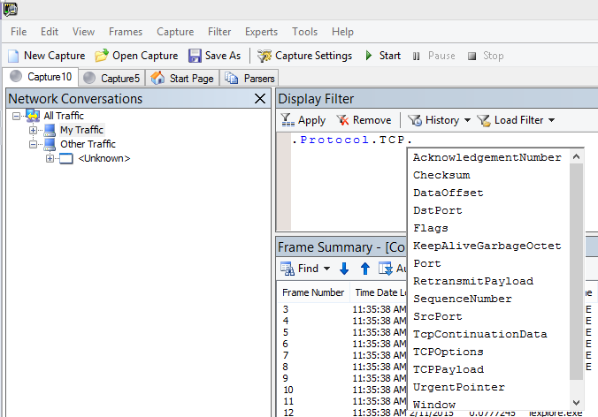

# <a name="performance-troubleshooting-plan-for-office-365"></a>План устранения неполадок с производительностью Office 365

Нужно знать, какие действия необходимо выполнить, чтобы определить и устранить отправку, зависание и снижение производительности между SharePoint Online, OneDrive для бизнеса, Exchange Online или Skype для бизнеса Online и вашим клиентским компьютером? Прежде чем позвонить в службу поддержки, эта статья поможет вам устранить проблемы с производительностью Office 365 и даже устранить некоторые из наиболее распространенных проблем.
  
В действительности эта статья является примером плана действий, который можно использовать для сбора ценных данных о проблемах с производительностью. В эту статью также включены некоторые основные проблемы.

Если вы не знакомы с производительностью сети и хотите длительный план для отслеживания производительности клиентских компьютеров и Office 365, ознакомьтесь со статьей [Настройка производительности office 365 и устранение неполадок — администраторы и ИТ-специалистов](performance-tuning-using-baselines-and-history.md).
  
## <a name="sample-performance-troubleshooting-action-plan"></a>Пример плана действий по устранению неполадок с производительностью

Этот план действий состоит из двух частей; этап подготовки и фаза ведения журнала. Если у вас возникла проблема с производительностью, и вам нужно выполнить сбор данных, вы можете начать использовать этот план сразу.
  
### <a name="prepare-the-client-computer"></a>Подготовка клиентского компьютера
  
- Найдите клиентский компьютер, который может воспроизводить проблему с производительностью. Этот компьютер будет использоваться в рамках устранения неполадок.
- Запишите действия, которые приводят к возникновению проблем с производительностью, чтобы подготовиться к тестированию.
- Установка средств для сбора и записи данных:
  - Установите [Netmon 3,4](https://www.microsoft.com/download/details.aspx?id=4865) (или используйте эквивалентное средство трассировки сети).
  - Установите бесплатный Базовый выпуск [HTTPWatch](https://www.httpwatch.com/download/) (или используйте эквивалентное средство трассировки сети).
  - Используйте средство записи экрана или запустите средство записи действий (PSR.exe), поставляемое с Windows Vista и более поздних версий, чтобы сохранить записи о действиях, выполняемых во время тестирования.

### <a name="log-the-performance-issue"></a>Регистрация неполадок с производительностью
  
- Закройте все лишние браузеры интернета.
- Запустите средство записи действий или другое средство записи экрана.
- Запустите захват NetMon (или средство трассировки сети).
- Очистите кэш DNS на клиентском компьютере из командной строки, набрав ipconfig/флушднс.
- Запустите новый сеанс браузера и включите HTTPWatch.
- Необязательно: Если тестируется Exchange Online, запустите средство анализатора производительности клиента Exchange из консоли администрирования Office 365.
- Воспроизводите точные действия, которые вызывают проблемы с производительностью.
- Остановите трассировку Netmon или другого средства.
- В командной строке выполните маршрут трассировки к вашей подписке на Office 365, введя следующую команду и нажав клавишу ВВОД:

  ``` cmd
  tracert <subscriptionname>.onmicrosoft.com
  ```

- Остановите средство записи действий и сохраните видео. Не забудьте включить дату и время для записи, а также показывает, является ли она наглядной или плохой.
- Сохраните файлы трассировки. Опять же, не забудьте включить дату и время захвата, а также показывает, является ли оно наглядным или плохим производительностью.

Если вы не знакомы с запуском средств, упомянутых в этой статье, не беспокойтесь, так как мы предоставим эти действия следующим образом. Если вы привыкли делать это, вы можете пропустить [инструкции по сбору базовых баз](performance-tuning-using-baselines-and-history.md#how-to-collect-baselines)данных, в которых описывается фильтрация и чтение журналов.
  
### <a name="flush-the-dns-cache-first"></a>Сначала очистите кэш DNS

Почему? После очистки кэша DNS вы начинаете тесты с помощью чистого материала. При очистке кэша вы передаете содержимое распознавателя DNS в самые актуальные записи. Помните, что очистка не удаляет записи файлов hosts. Если записи файла узла широко используются, скопируйте эти записи в файл в другом каталоге, а затем очистите файл узла.
  
#### <a name="flush-your-dns-resolver-cache"></a>Очистка кэша распознавателя DNS
  
1. Откройте командную строку ( **запустите** \> **Run** \> **cmd** или **Windows Key** \> **cmd**).
2. Введите следующую команду и нажмите клавишу ВВОД:

    ``` cmd
    ipconfig /flushdns
    ```

## <a name="netmon"></a>Пользовательском

Средство Microsoft Network Monitoring ([Netmon](https://www.microsoft.com/download/details.aspx?id=4865)) анализирует пакеты, которые являются трафиком, который проходит между компьютерами в сети. С помощью NetMon для трассировки трафика с помощью Office 365 вы можете записывать, просматривать и читать заголовки пакетов, определять промежуточные устройства, проверять важные параметры сетевого оборудования, искать пропущенные пакеты и отслеживать поток трафика между компьютерами в корпоративной сети и Office 365. Так как фактический текст трафика шифруется (перемещается на порте 443 через SSL/TLS, вы не можете считать отправляемые файлы. Вместо этого вы получаете нефильтрованную трассировку пути, который принимает пакет, который поможет вам отслеживать поведение проблемы.
  
Убедитесь, что в настоящее время фильтр не применяется. Вместо этого выполните действия и продемонстрируйте проблему перед остановкой трассировки и сохранением.
  
После установки Netmon 3,4 Откройте средство и выполните указанные ниже действия.
  
### <a name="take-a-netmon-trace-and-reproduce-the-issue"></a>Получение трассировки Netmon и воспроизведение проблемы
  
1. Запустите NetMon 3,4.
На **начальной** странице есть три области: **недавние записи**, **Выбор сетей**и начало **работы с сетевым монитором 3,4. Примечание**. Кроме того, на панели Выбор сетей вы получите список сетей по умолчанию, из которых можно записывать. Убедитесь, что в этой статье выбраны сетевые карты.

2. В верхней части **начальной** страницы нажмите кнопку **создать запись** . При этом на вкладке **Начальная** страница добавляется новая вкладка **захват 1**.


3. Чтобы создать простую запись, нажмите кнопку **Пуск** на панели инструментов.

4. Воспроизведите действия, которые представляют проблемы с производительностью.

5. Нажмите кнопку **остановить** \> **File** \> **Сохранение файла как**. Помните, что вы можете присвоить дату и время в этом часовом поясе, а также указать, что она показывает плохое или хорошую производительность.

## <a name="httpwatch"></a>HTTPWatch

[HTTPWatch](https://www.httpwatch.com/download/) поставляется с платной и бесплатной версией. Бесплатный Базовый выпуск охватывает все, что вам нужно для этого теста. HTTPWatch отслеживает сетевой трафик и время загрузки страницы прямо из окна браузера. HTTPWatch — это подключаемый модуль для Internet Explorer, который графически описывает производительность. Анализ можно сохранить и просмотреть в HTTPWatch Studio.
  
> [!NOTE]
> Если вы используете другой браузер, например Firefox, Google Chrome, или если вы не можете установить HTTPWatch в Internet Explorer, откройте новое окно браузера и нажмите клавишу F12 на клавиатуре. В нижней части браузера должен появиться всплывающее окно средства разработчика. Если вы используете Opera, нажмите клавиши CTRL + SHIFT + I для инспектора веб-страниц, а затем перейдите на вкладку **сеть** и выполните проверку, описанную ниже. Информация будет немного отличаться, но время загрузки по-прежнему будет отображаться в миллисекундах. > HTTPWatch также очень полезен для проблем с временем загрузки страниц SharePoint Online.
  
### <a name="run-httpwatch-and-reproduce-the-issue"></a>Запуск HTTPWatch и воспроизведение проблемы
  
HTTPWatch — это подключаемый модуль браузера, поэтому доступ к средству в браузере несколько отличается для каждой версии Internet Explorer. Как правило, HTTPWatch можно найти в панели команд в браузере Internet Explorer. Если в окне браузера не отображается подключаемый модуль HTTPWatch, проверьте версию браузера, нажав кнопку **Справка** \> **About**, или в последующих версиях Internet Explorer щелкните символ шестеренки и **сведения о Internet Explorer**. Чтобы запустить панель **команд** , щелкните строку меню в Internet Explorer правой кнопкой мыши и выберите пункт **панель команд**.

В прошлый раз HTTPWatch сопоставлены с командами и панелями обозревателя, поэтому после установки, если вы не увидите значок проверки (даже после перезагрузки **), а**панели инструментов для значка. Помните, что вы можете добавлять панели инструментов и добавлять к ним параметры.


  
1. Запустите HTTPWatch в окне браузера Internet Explorer. Он будет отображаться прикрепленным к браузеру в нижней части окна. Нажмите кнопку **запись**.

2. Воспроизводите точные действия, связанные с производительностью. Нажмите кнопку " **остановить** " в HTTPWatch.

3. **Сохраните** HTTPWatch или **отправьте сообщение по электронной почте**. Не забудьте назвать файл так, чтобы он включал сведения о дате и времени, а также сведения о том, содержит ли контрольное значение демонстрацию хорошей или плохой производительности.


Этот снимок экрана относится к профессиональной версии HTTPWatch. Вы можете открывать трассировки, полученные в базовой версии на компьютере с профессиональной версией, и читать их там. В этом методе могут быть доступны дополнительные сведения из трассировки.

## <a name="problem-steps-recorder"></a>Средство записи действий по устранению неполадок

Средство записи действий или PSR.exe позволяет записывать проблемы по мере их возникновения. Это очень полезная инструмент и очень простая работа.
  
### <a name="run-problem-steps-recorder-psrexe-to-record-your-work"></a>Запуск средства записи действий по проблеме (PSR.exe) для записи работы
  
1. Выберите команду **запустить** \> **Запуск** \> **PSR.exe** \> " **ОК**" или выберите тип **ключа Windows** \> **PSR.exe** \> а затем нажмите клавишу ВВОД.

2. Когда появится окно небольшое PSR.exe, нажмите кнопку **начать запись** и воспроизводите шаги, необходимые для воспроизведения проблемы с производительностью. При необходимости можно добавить комментарии, нажав кнопку **Добавить комментарии**.

3. После выполнения этих действий нажмите кнопку **остановить запись** . Если эта ошибка связана с производительностью страницы, дождитесь ее отображения перед остановкой записи.

4. Нажмите кнопку **Сохранить**.


  
Дата и время записываются для вас. Это связывает ПСР с трассировкой Netmon и HTTPWatch во время и помогает устранять неполадки с точностью. Дата и время в записи ПСР могут показать, что минута передается между входом и обзором URL-адреса и частичной визуализацией сайта администрирования, например.
  
## <a name="read-your-traces"></a>Чтение трассировок

Невозможно проучить все сведения об устранении неполадок сети и производительности, которые необходимо знать с помощью статьи. Для обеспечения высокой производительности необходимо иметь в своем составе сведения о том, как работает сеть и как обычно работает. Но можно округлить список самых распространенных проблем и показать, как инструменты могут облегчить устранение наиболее распространенных проблем.
  
Если вы хотите получить навыки, просчитывающие трассировки сети для сайтов Office 365, не существует более эффективного преподавателя, чем регулярно создавать трассировки страниц, а также считывать их. Например, если у вас есть шанс, загрузите службу Office 365 и прослеживанием процесса. Отфильтровать трассировку для трафика DNS или выполнить поиск имени службы, которую вы просматриваете, в Фрамедата. Сканирование трассировки для получения представления о действиях, выполняемых при загрузке службы. Это поможет вам узнать, как должна выглядеть нормальная загрузка страницы, а в случае устранения неполадок, в частности, в случае устранения неполадок, а именно, сравнение хорошей и плохой трассировки может научиться многое.
  
NetMon использует Microsoft IntelliSense в поле Фильтр отображения. IntelliSense или интеллектуальное завершение кода — это прием, в котором вы вводите точку, а все доступные параметры отображаются в раскрывающемся списке выбора. Если, например, вы беспокоитесь о масштабировании окна TCP, вы можете найти свой способ отбора (например,  `.protocol.tcp.window < 100` ).
  

  
Трассировки Netmon могут иметь большой объем трафика. Если вы не читаете их, вероятно, вы будете слишком большим открытием трассировки. Первое, что нужно сделать, это отделить сигнал от фонового шума в трассировке. Вы тестировали свой пакет Office 365, и это трафик, который вы хотите просмотреть. Если вы используете трассировку, этот список может не потребоваться.
  
Трафик между клиентом и Office 365 передается через TLS, что означает, что текст трафика будет зашифрован и не будет читаемым в общей трассировке Netmon. Анализ производительности не обязан знать особенности сведений в пакете. Тем не менее, в заголовках пакетов и содержащихся в них данных очень интересно.
  
### <a name="tips-to-get-a-good-trace"></a>Советы для получения хорошей трассировки
  
- Знать значение IPv4-или IPv6-адреса клиентского компьютера. Для этого в командной строке введите **ipconfig** , а затем нажмите клавишу ВВОД. Зная этот адрес, вы узнаете, как узнать, какой именно трафик в трассировке напрямую включает ваш клиентский компьютер. Если есть известный прокси-сервер, обратитесь к нему и получите его IP-адрес.

- Очистите кэш сопоставителя DNS и, если это возможно, закройте все браузеры, Кроме того, в котором выполняются тесты. Если вы не можете сделать это, например, если поддержка использует какое-либо средство на основе браузера для просмотра рабочего стола клиентского компьютера, необходимо подготовиться к фильтрации трассировки.

- В прослеживании занятости откройте службу Office 365, которую вы используете. Если вы никогда или редко видели трафик до, это полезное действие, связанное с отправкой производительности от других шумов сети. Это можно сделать несколькими способами. Непосредственно перед проверкой можно использовать _команду ping_ или _PsPing_ по URL-адресу определенной службы ( `ping outlook.office365.com` `psping -4 microsoft-my.sharepoint.com:443` например, или). Вы также можете легко найти эту команду ping или PsPing в трассировке Netmon (по имени процесса). Вы сможете начать поиск.

Если вы используете только трассировку NetMon в момент возникновения проблемы, это тоже нормально. Чтобы правильно ориентироваться, используйте фильтр, такой как `ContainsBin(FrameData, ASCII, "office")` или `ContainsBin(FrameData, ASCII, "outlook")` . Вы можете записать номер кадра из файла трассировки. Кроме того, вы можете прокручивать область _сводки кадров_ и искать столбец идентификатор беседы. Существует число, в котором указывается идентификатор этой конкретной беседы, которую можно также записать и просмотреть в изоляции позже. Не забудьте удалить этот фильтр перед применением любой другой фильтрации.

> [!TIP]
> В NetMon включен большой набор полезных встроенных фильтров. Воспользуйтесь кнопкой **загрузить фильтр** в верхней части области фильтра _отображения_ .
  

  

  
Ознакомьтесь с трафиком и Узнайте, как найти нужные сведения. Например, Узнайте, как определить, какой пакет в трассировке имеет первую ссылку на используемую службу Office 365 (например, "Outlook").

В качестве примера вы можете взять Office 365 Outlook Online:
  
- Стандартный запрос DNS и ответ DNS для outlook.office365.com с соответствующими Куеридс. Важно отметить смещение времени для этого отключения, а также то, где в мире глобальный DNS-сервер Office 365 отправляет запрос на разрешение имен. В идеале, как можно раньше, а не на середине мира.

- HTTP-запрос GET, отчет о состоянии которого был перемещен навсегда (301)

- РВС трафик, в том числе запросы на подключение к РВС и подключение ответов. (Это удаленная Winsock, который делает подключение.)

- TCP SYN и TCP SYN/ACK. Множество параметров в этой беседе влияют на производительность.

- Затем серии TLS: трафик TLS, в котором выполняются диалоговые окна подтверждения TLS и TLS-сертификатов. Помните, что данные шифруются с помощью SSL/TLS.

Все части трафика важны и соединяются, но небольшие части трассировки содержат сведения, которые особенно важны в плане устранения неполадок с производительностью, поэтому мы будем сосредоточиться на этих областях. Кроме того, так как мы сделали достаточное количество проблем с производительностью Office 365 в корпорации Майкрософт для компиляции десяти самых распространенных проблем, мы будем сосредоточиться на этих проблемах и в том, как использовать средства, которые необходимо сделать следующим образом.
  
Если вы не установили их все готово, в матрице ниже используется несколько средств. Где это возможно. Ссылки передаются в точки установки. Список включает общие средства трассировки сети, такие как [Netmon](https://www.microsoft.com/download/details.aspx?id=4865) и [Wireshark](https://www.wireshark.org/), но используют любой инструмент трассировки, и в котором вы привыкли к фильтрации сетевого трафика. При тестировании Помните:
  
- *Закройте браузеры и проверьте, работает только один браузер*  . это приведет к уменьшению общего объема записанных данных. Она делает трассировку менее загруженной.
- *Очистите кэш СОПОСТАВИТЕЛЯ DNS на клиентском компьютере*  — в этом случае вы получите чистую отправку материала при запуске записи для очистки.

## <a name="common-issues"></a>Распространенные проблемы

Некоторые распространенные проблемы, которые могут научиться и как их найти в трассировке сети.

### <a name="tcp-windows-scaling"></a>Масштабирование TCP Windows

Находится в SYN-SYN/ACK. Устаревшие или устаревшие аппаратные средства не могут использовать масштабирование TCP Windows.  Без соответствующих параметров масштабирования TCP Windows размер 16-битного буфера по умолчанию в заголовках TCP заполняется в миллисекундах.  Трафик не может продолжаться до тех пор, пока клиент не получит подтверждение получения исходных данных, что приведет к задержкам.

#### <a name="tools"></a>Инструменты

- Пользовательском
- Wireshark

#### <a name="what-to-look-for"></a>Что искать

Найдите трафик SYN-SYN/ACK в сетевой трассировке.  В NetMon используйте такой фильтр  `tcp.flags.syn == 1` . Этот фильтр один и тот же в Wireshark.  


Обратите внимание, что для каждого SYN существует номер исходного порта (Сркпорт), соответствующий порту назначения (Дстпорт) связанного подтверждения (SYN/ACK).

Чтобы просмотреть значение масштабирования Windows, используемое сетевым подключением, разверните первый SYN, а затем связанный с SYN/ACK.  

  

### <a name="tcp-idle-time-settings"></a>Параметры времени простоя TCP

Исторически большинство сетей периметра настроены для временных подключений, что означает, что простаивающие подключения обычно прерываются. Неактивные сеансы TCP могут завершаться с помощью прокси-серверов и брандмауэров в более чем 100 – 300 секунд. Это проблематично для Outlook Online, так как создает и использует долгосрочные подключения, независимо от того, находятся ли они в режиме простоя или нет.  

Когда подключения прерываются через прокси-сервер или брандмауэры, клиент не уведомляется, а попытка использовать Outlook Online означает, что клиентский компьютер будет пытаться повторно ревиве подключение перед созданием нового подключения. Вы можете увидеть зависание в продукте, приглашения или низкая производительность при загрузке страницы.

#### <a name="tools"></a>Инструменты

- Пользовательском
- Wireshark

#### <a name="what-to-look-for"></a>Что искать

В NetMon Взгляните на поле Смещение времени для кругового пути. Круговой путь — это время между клиентом, отправляющее запрос на сервер и получающим ответ обратно. Проверка между клиентом и точкой выхода (например, Клиент- \> прокси) или клиент для office 365 (клиент-- \> Office 365). Это можно увидеть во многих типах пакетов.

Например, фильтр в NetMon может выглядеть как в  `.Protocol.IPv4.Address == 10.102.14.112 AND .Protocol.IPv4.Address == 10.201.114.12` Wireshark, так и в  `ip.addr == 10.102.14.112 &amp;&amp; ip.addr == 10.201.114.12` .  

> [!TIP]
> Не знаете, принадлежит ли IP-адрес вашей трассировки DNS-серверу? Попробуйте найти его в командной строке. Нажмите кнопку **начать** \> **выполнение** \> и введите команду **cmd**, а затем нажмите **клавишу Windows** \> и введите **cmd**. В командной строки введите  `nslookup <the IP address from the network trace>` . Чтобы протестировать, используйте nslookup с IP-адресом своего компьютера. > просмотреть список диапазонов IP-адресов корпорации Майкрософт, обратитесь к разделу [URL-адреса и диапазоны IP-адресов в Office 365](https://technet.microsoft.com/library/hh373144.aspx).

Если возникла проблема, предполагалось наличие длинных смещений времени, в данном случае (Outlook Online), особенно в протоколе TLS: пакеты TLS, отображающие прохождение данных приложений (например, в netmon можно найти пакеты данных приложений с помощью  `.Protocol.TLS AND Description == "TLS:TLS Rec Layer-1 SSL Application Data"` ). Во время сеанса вы должны видеть гладкую прогрессию. Если при обновлении Outlook Online отображаются длительные задержки, это может быть вызвано высокой степенью пересылки.

### <a name="latencyround-trip-time"></a>Время ожидания и время кругового пути

Задержка это мера, которая может изменить множество в зависимости от многих переменных, таких как обновление устройств устаревания, добавление большого числа пользователей в сеть и процент общей пропускной способности, потребляемой другими задачами по сетевому подключению.

Имеются Калькуляторы пропускной способности для Office 365, доступные на странице " [планирование сети и настройка производительности для office 365](network-planning-and-performance.md) ".  

Требуется измерять скорость подключения или пропускную способность подключения к поставщику услуг Интернета? Воспользуйтесь этим сайтом (или сайтами, например,): [Спидтест Официальный сайт](https://www.speedtest.net/)или запросите любимую поисковую подсистему для **проверки скорости**фраз.

#### <a name="tools"></a>Инструменты

- Проверяет
- PsPing
- Пользовательском
- Wireshark

#### <a name="what-to-look-for"></a>Что искать

Чтобы отслеживать задержку в трассировке, вам будет выгодно записать IP-адрес клиентского компьютера и IP-адрес DNS-сервера в Office 365. Это используется для упрощения фильтрации трассировки. Если вы подключаетесь через прокси-сервер, вам потребуется IP-адрес клиентского компьютера, IP-адрес прокси-сервера и IP-адрес сервера Office 365, чтобы упростить работу.  

Запрос ping, отправленный в outlook.office365.com, сообщит вам имя центра обработки данных, который получает запрос, даже  *если не удается*  подключиться к серверу для отправки пакетов ICMP с последовательным товаром. Если вы используете PsPing (бесплатный инструмент для загрузки) и задаете номер порта (443) и, возможно, для использования IPv4 (-4), то среднее время приема для отправленных пакетов будет получено. Это будет работать для других URL-адресов в службах Office 365, например `psping -4 yourSite.sharepoint.com:443` . На самом деле вы можете указать число пакетов проверки связи, чтобы получить более крупный пример для среднего значения, попробуйте что-то вроде `psping -4 -n 20 yourSite-my.sharepoint.com:443` .  

> [!NOTE]
> PsPing не отправляет пакеты ICMP. Он проверяет связь с пакетами TCP через определенный порт, поэтому вы можете использовать любой из них, который будет открыт. В Office 365 с использованием протокола SSL/TLS попробуйте подключить порт: 443 к PsPing.


Если вы загрузили страницу "медленное выполнение Office 365" при выполнении трассировки сети, следует отфильтровать трассировку Netmon или Wireshark для `DNS` . Это один из интересующих вас IP-адресов.  

Ниже описано, как выполнить фильтрацию NetMon, чтобы получить IP-адрес (и взгляните на задержку DNS). В этом примере используется outlook.office365.com, но также может использоваться URL-адрес клиента SharePoint Online (например, hithere.sharepoint.com).  

1. Проверьте связь с URL-адресом `ping outlook.office365.com` и в результатах запишите имя и IP-адрес DNS-сервера, на который был отправлен запрос ping.
2. Трассировка сети Открытие страницы или выполнение действия, которое приводит к возникновению проблемы с производительностью, или, если вы видите большую задержку для проверки связи, она выполняет трассировку сети.
3. Откройте трассировку в NetMon и примените фильтр для DNS (этот фильтр также работает в Wireshark, но чувствителен к регистру `-- dns` ). Так как вы знаете имя DNS-сервера из команды ping, вы также можете отфильтровать дополнительные спидили в NetMon следующим образом: `DNS AND ContainsBin(FrameData, ASCII, "namnorthwest")` , который выглядит следующим образом в Wireshark DNS и Frame содержит "namnorthwes".<br/>Откройте пакет ответа и в окне Netmon **Frame Details** щелкните **DNS** , чтобы раскрыть для получения дополнительных сведений. В разделе сведения DNS вы найдете IP-адрес DNS-сервера, на который походил запрос в Office 365. Этот IP-адрес потребуется для следующего этапа (средство PsPing). Удалите фильтр, щелкните правой кнопкой мыши ответ DNS в разделе Netmon (**Сводка по кадру** \> **Find** \> **DNS**), чтобы просмотреть запрос DNS и отреагировать рядом друг с другом.
4. В NetMon также обратите внимание на столбец смещение времени между запросом DNS и ответом. На следующем этапе удобно устанавливать и использовать средство [PsPing](https://technet.microsoft.com/sysinternals/jj729731.aspx) , так как ICMP часто блокируется для брандмауэров, а PsPing елегантли отслеживает задержку в миллисекундах. PsPing завершает TCP-соединение с адресом и портом (в нашем случае откройте порт 443).
5. Установите PsPing.
6. Откройте командную строку (запустите \> команду \> cmd или Windows Key \> Type) и перейдите к каталогу, в котором вы установили PsPing, чтобы выполнить команду PsPing. В примерах вы видите папку "Perf" в корне C. Для быстрого доступа вы можете выполнять те же действия.
7. Введите команду, чтобы PsPing с IP-адресом DNS-сервера Office 365 из предыдущей трассировки NetMon, включая номер порта, например `psping -n 20 132.245.24.82:445` . При этом выдается выборка 20 проверок связи и средняя задержка при прекращении PsPing.

Если вы планируете Office 365 через прокси-сервер, то эти действия немного отличаются. Сначала PsPing прокси-сервер, чтобы получить среднее значение задержки (в миллисекундах) для прокси-сервера, выхода и возврата, а затем запустите PsPing на прокси-сервере или на компьютере с прямым подключением к Интернету, чтобы получить отсутствующее значение (одно для Office 365 и обратно).  

Если вы решили запустить PsPing из прокси-сервера, у вас будет два значения миллисекунд: клиентский компьютер до прокси-сервера или Выходная точка, а прокси-сервер — Office 365. И все готово. Записываете значения, в любом случае.  

Если вы запускаете PsPing на другом клиентском компьютере с прямым подключением к Интернету (без прокси-сервера), у вас будет два значения миллисекунд: клиентский компьютер к прокси-серверу или выходной точке, а клиентский компьютер — Office 365. В этом случае вычтите значение параметра клиентский компьютер к прокси-серверу или выходную точку с точки зрения клиентского компьютера в Office 365, и вы получите значения приема-передачи от клиентского компьютера к прокси-серверу или выходной точке, а затем от прокси-сервера или выхода до Office 365.

Тем не менее, если вы можете найти клиентский компьютер в затронутом расположении, который напрямую подключен или обходит прокси-сервер, вы можете проверить, не получится ли эта ошибка, чтобы начать работу с, и протестировать ее, используя позже.

Задержка, как показано в трассировке NetMon, эти дополнительные миллисекунды могут сложиться, если их достаточно для каждого сеанса.  


> [!NOTE]
> Ваш IP-адрес может отличаться от показанных здесь IP-адресов, например, при проверке связи может возвращаться нечто большее, например 157.56.0.0/16 или аналогичный диапазон. Список диапазонов, используемых в Office 365, изучите [URL-адреса и диапазоны IP-адресов для office 365](https://technet.microsoft.com/library/hh373144.aspx).

Не забудьте развернуть все узлы (кнопка вверху для этого), если вы хотите найти, например, 132,245.

### <a name="proxy-authentication"></a>Проверка подлинности прокси

Это применимо только в том случае, если вы переходите через прокси-сервер. В противном случае вы можете пропустить эти действия. При правильной работе проверка подлинности прокси должна выполняться в миллисекундах. В периоды пикового использования (например,) не отображаются временные показатели неисправности.  

Если включена проверка подлинности прокси-сервера, при каждом подключении по протоколу TCP к Office 365 для получения информации необходимо проследить процесс проверки подлинности в фоновом режиме. Таким образом, например, при переключении из календаря в почту в Outlook Online выполняется проверка подлинности. В SharePoint Online, если на странице отображается мультимедиа или данные из нескольких сайтов или расположений, выполняется проверка подлинности для каждого TCP-подключения, которое требуется для отображения данных.  

В Outlook Online может наблюдаться замедленная загрузка при переключении между календарем и почтовым ящиком, а также при медленных загрузках страниц в SharePoint Online. Однако в этом списке отсутствуют другие признаки.

Проверка подлинности прокси — это параметр для прокси-сервера исходящих подключений. Если это вызывает проблемы с производительностью в Office 365, необходимо обратиться к группе сети.  

#### <a name="tools"></a>Инструменты

- Пользовательском
- Wireshark

#### <a name="what-to-look-for"></a>Что искать

Проверка подлинности прокси-сервера выполняется всякий раз, когда необходимо выполнить отправку нового сеанса TCP, обычно запрашивать файлы или сведения с сервера, а также предоставлять сведения. Например, вы можете увидеть проверку подлинности прокси для запросов HTTP GET или HTTP POST. Если вы хотите просмотреть кадры, в которых выполняется проверка подлинности запросов в трассировке, добавьте столбец "Сводка по NTLMSSP" в NetMon и фильтр для  `.property.NTLMSSPSummary` . Чтобы узнать, как долго выполняется проверка подлинности, добавьте столбец временной разницы.

Добавление столбца в NetMon:

1. Щелкните правой кнопкой мыши столбец, например **Описание**.
2. Нажмите кнопку **выбрать столбцы**.
3. В списке выберите _сводное_ значение и _разницу по времени_ для NTLMSSP и нажмите кнопку **добавить**.
4. Переместите новые столбцы в столбец " _Описание_ " перед ним или за его пределами, чтобы их можно было прочитать параллельно.
5. Нажмите кнопку **ОК**.

Даже если вы не добавите столбец, фильтр Netmon будет работать. Но при этом вы можете увидеть, какая стадия проверки подлинности будет использоваться.

При поиске экземпляров проверки подлинности прокси-сервера обязательно изучите все кадры, в которых имеется запрос NTLM, или присутствует сообщение проверки подлинности. При необходимости щелкните правой кнопкой мыши конкретный фрагмент трафика и найдите пункт TCP-беседы \> . Обратите внимание на значения времени разности в этих беседах.


Четыре секунды в проверке подлинности прокси-сервера, как показано в Wireshark. Был выполнен щелчок правой кнопкой **мыши по полю** с тем же именем в разделе сведения о кадре и выбором столбца Добавить как.  <br/> 

### <a name="dns-performance"></a>Производительность DNS

Разрешение имен работает лучше всего и быстрее, если это возможно, как можно ближе к стране клиента.

Если разрешение DNS-имен выполняется в загранном месте, оно может добавлять секунды при загрузке страницы. В идеале разрешение имен происходит в разделе 100 мс. В противном случае следует выполнить дальнейший анализ.

> [!TIP]
> Не знаете, как работает клиентское подключение в Office 365? [Ознакомьтесь со справочным документом](https://technet.microsoft.com/library/dn741250.aspx)по подключению клиентов.

#### <a name="tools"></a>Инструменты

- Пользовательском
- Wireshark
- PsPing

#### <a name="what-to-look-for"></a>Что искать

Анализ производительности DNS обычно является еще одним заданием для сетевой трассировки. Тем не менее, PsPing также полезен в случае потенциальной причины.

Трафик DNS основан на TCP-и UDP-запросах и ответах ясно отмечены ИДЕНТИФИКАТОРом, который поможет вам найти конкретный запрос с конкретным ответом. Трафик DNS отображается, если, например, в SharePoint Online используется сетевое имя или URL-адрес на веб-странице. Как правило, большая часть этого трафика, за исключением переноса зон, выполняется по протоколу UDP.

Как в NetMon, так и в Wireshark, самый простой фильтр, который позволит просматривать трафик DNS, просто `dns` . При указании фильтра обязательно используйте нижний регистр. Не забудьте очистить кэш сопоставителя DNS, прежде чем приступать к воспроизведению проблемы на клиентском компьютере. Например, если для домашней страницы используется медленная загрузка страниц SharePoint Online, следует закрыть все браузеры, открыть новый браузер, начать трассировку, очистить кэш сопоставителя DNS и перейти к сайту SharePoint Online. После того как вся страница будет устранена, следует остановить и сохранить трассировку.


Вы хотите посмотреть смещение времени. Кроме того, может быть полезно добавить столбец **Разное времени** в NetMon, который можно сделать, выполнив следующие действия:

1. Щелкните правой кнопкой мыши столбец, например **Описание**.
2. Нажмите кнопку **выбрать столбцы**.
3. В списке выберите _разницу времени_ и нажмите кнопку **Добавить**.
4. Переместите новый столбец в столбец " _Описание_ ", чтобы его можно было прочитать параллельно.
5. Нажмите кнопку **ОК**.

Если вы нашли интересующий запрос, Попробуйте изолировать его, щелкнув запрос правой кнопкой мыши в области сведения о кадре, выбрав **найти беседы** в \> **DNS**. Обратите внимание, что панель беседы по сети перемещается вправо на конкретный диалог в своем журнале UDP-трафика.


В Wireshark можно сделать столбец временем DNS. Выполните трассировку (или откройте трассировку) в Wireshark, а затем выполните фильтрацию по `dns` или, что более удобно  `dns.time` . Щелкните любой DNS-запрос, а затем в панели, где показаны подробные сведения, разверните  `Domain Name System (response)` Дополнительные сведения. Вы увидите поле Time (например, `[Time: 0.001111100 seconds]` . Щелкните это время правой кнопкой мыши и выберите **применить как столбец**. В этом случае вы получите столбец **времени** для ускорения сортировки трассировки. Щелкните новый столбец, чтобы отсортировать их по убыванию, чтобы узнать, какой вызов DNS занял самое длинное решение.

[Данные по SharePoint Online, отфильтрованные в Wireshark с помощью dns.time (нижний регистр), при этом значения времени из области сведений собраны в столбец и отсортированы по возрастанию.](../media/1439dcc2-12ff-4ee2-9ef3-1484cf79c384.PNG)

Если вы хотите проанализировать время разрешения DNS, попробуйте использовать PsPing по отношению к DNS-порту, используемому протоколом TCP (например,  `psping <IP address of DNS server>:53` ). Отображается ли проблема с производительностью? В противном случае проблема, скорее всего, станет более широкой сетью, чем проблема, связанная с разрешениями DNS-приложения. Также стоит упомянуть о том, что сообщение PING с outlook.office365.com будет сообщать вам, где выполняется разрешение имен DNS для Outlook Online (например, outlook-namnorthwest.office365.com).

Если проблема связана с DNS, может потребоваться обратиться к ИТ-отделу, чтобы узнать о конфигурациях DNS и пересылках DNS для дальнейшего изучения этой проблемы.

### <a name="proxy-scalability"></a>Масштабируемость прокси-сервера

Службы, такие как Outlook Online в Office 365, предоставляют клиентам несколько долгосрочных подключений. Таким образом, каждый пользователь может использовать больше подключений, требующих больше времени жизни.  

#### <a name="tools"></a>Инструменты

математика;  

#### <a name="what-to-look-for"></a>Что искать

Для этого не существует средства трассировки сети или средства устранения неполадок. Вместо этого он основывается на вычислениях пропускной способности, заданных ограничениями и другими переменными.  

### <a name="tcp-max-segment-size"></a>Максимальный размер сегмента TCP

Находится в SYN-SYN/ACK.  Выполните эту проверку в любой трассировке сети производительности, которую вы задали, чтобы убедиться в том, что TCP-пакеты настроены на максимально возможный объем данных.

Целью является просмотр MSS 1460 байт для передачи данных. Если вы находитесь за прокси-сервером или используете NAT, не забудьте выполнить этот тест от клиента к прокси-серверу/выходу/NAT, а также от прокси-сервера/выхода/NAT до Office 365, чтобы получить наилучшие результаты. Это разные сеансы TCP.

#### <a name="tools"></a>Инструменты

Пользовательском

#### <a name="what-to-look-for"></a>Что искать

Максимальный размер сегмента TCP (MSS) — это еще один параметр для этого параметра в трассировке сети, что означает, что вы найдете необходимые данные в пакете SYN-SYN/ACK. Размер MSS довольно прост для просмотра.

Откройте любую трассировку сети с производительностью и Найдите интересующее вас подключение или, в том же примере, проблема с производительностью.

> [!NOTE]
> Если вы просматриваете трассировку и хотите найти трафик, относящийся к беседе, выполните фильтрацию по IP-адресу клиента или IP-адресу прокси-сервера или точки выхода, либо и то, и другое. Вы должны выполнить обмен сообщениями с URL-адресом, который тестируется для IP-адреса Office 365 в трассировке, и отфильтровать по нему.

Хотите посмотреть на секунду трассировки? Попробуйте использовать фильтры для самостоятельной ориентации. В NetMon выполните поиск, основанный на URL-адресе, например `Containsbin(framedata, ascii, "sphybridExample")` , запишите номер кадра.

В Wireshark используйте нечто подобное  `frame contains "sphybridExample"` . Если вы заметили, что вы обнаружили удаленный трафик Winsock (РВС) (он может отображаться в виде [ПШ, ACK] в Wireshark), помните, что РВС подключения можно увидеть вскоре перед соответствующими флагами SYN-SYN/ACK, как обсуждалось ранее.

На этом шаге можно записать номер кадра, удалить фильтр, щелкнуть **весь трафик** в окне Сетевые беседы в NetMon, чтобы просмотреть ближайший SYN.

Важно! Если вы не получали никаких сведений об IP-адресе во время трассировки, то при поиске URL-адреса в трассировке (часть `sphybridExample-my.sharepoint.com` , например), вы получите IP-адреса для фильтрации.

Нахождение подключения в трассировке, которую вы хотите увидеть. Это можно сделать, проверяя трассировку по IP-адресам или выбирая конкретные идентификаторы бесед с помощью окна Сетевые беседы в Netmon. После того как вы нашли пакет SYN, разверните узел TCP (в NetMon) или протокол управления передачей (в Wireshark) на панели сведений о кадре. Разверните узел параметры TCP и Макссегментсизе. Откройте соответствующий кадр SYN-ACK и разверните узел параметры TCP и Макссегментсизе. В качестве максимального размера сегмента будет использоваться меньшее из этих двух значений. На этом рисунке я использую встроенный столбец в NetMon с именем "Устранение неполадок TCP".  


Встроенный столбец находится в верхней части панели **сведений о кадре** . (Чтобы вернуться к обычному представлению, еще раз нажмите кнопку **столбцы** , а затем выберите **Часовой пояс**.)


Вот отфильтрованная трассировка в Wireshark. Существует фильтр, относящийся к значению MSS ( `tcp.options.mss` ). Пакеты подтверждения подтверждений SYN, SYN/ACK, подтвержденные в нижней части Wireshark эквивалента сведениям о кадре (поэтому Frame 47 ACK, ссылки на 46 SYN/ACK, ссылки на 43 SYN), чтобы упростить этот вид работы.


Если вам нужно проверить **избирательное подтверждение** (следующий раздел в этой матрице), не закрывайте трассировку.

### <a name="selective-acknowledgment"></a>Избирательное подтверждение

Находится в SYN-SYN/ACK. Должен быть указан как разрешенный как для SYN, так и для SYN/ACK. Избирательное подтверждение (SACK) позволяет более гладко передавать данные при отсутствии пакетов или пакетов. Устройства могут отключить эту функцию, что может повлечь за собой проблемы с производительностью.

Если вы находитесь за прокси-сервером или используете NAT, не забудьте выполнить этот тест от клиента к прокси-серверу/выходу/NAT, а также от прокси-сервера/выхода/NAT до Office 365, чтобы получить наилучшие результаты. Это разные сеансы TCP.

#### <a name="tools"></a>Инструменты

Пользовательском

#### <a name="what-to-look-for"></a>Что искать

SACK — это еще один параметр подтверждения SYN-SYN/ACK. Вы можете отфильтровать трассировку для SYN-SYN/ACK множеством способов.

Нахождение подключения в трассировке, которую вы хотите просмотреть, с помощью сканирования трассировки, фильтрации по IP-адресам или щелчком идентификатора беседы в окне Сетевые беседы в Netmon. После того как вы нашли пакет SYN, разверните узел TCP in Netmon или протокол управления передачей в Wireshark в разделе сведения о кадре. Разверните пункт Параметры TCP, а затем SACK. Откройте соответствующий кадр SYN-ACK и разверните узел параметры TCP и поле SACK. Разрешить использование определенного значения SACK в SYN и SYN/ACK. Ниже приведены значения SACK, как показано в NetMon и Wireshark.


### <a name="dns-geolocation"></a>Географическое расположение DNS

Где в мире Office 365 пытается разрешить вызов DNS, скорость подключения не ограничена.

В Outlook Online после завершения первой операции поиска DNS расположение этой службы DNS будет использоваться для подключения к ближайшему центру обработки данных. Вы будете подключены к серверу клиентского доступа Outlook Online, который будет использовать магистральную сеть для подключения к центру обработки данных (dC), на котором хранятся ваши данные. Это быстрее.

При доступе к SharePoint Online пользователь, проходящих за рубежом, будет направлен в свой активный центр обработки данных — это контроллер домена, расположение которого основано на основном контроллере клиента SPO (поэтому в США, если пользователь работает в США, используется контроллер США).

Lync Online содержит активные узлы более чем на одном контроллере домена за раз. Когда запросы отправляются для экземпляров Lync Online, DNS-служба Майкрософт определяет, откуда поступил запрос, и возвращает IP-адреса от ближайших региональных контроллеров домена, где активна Lync Online.

> [!TIP]
> Необходимо узнать больше о том, как клиенты подключаются к Office 365? Ознакомьтесь со справочной статьей по [подключению клиентов](https://technet.microsoft.com/library/dn741250.aspx) (а также с полезными графическими объектами).

#### <a name="tools"></a>Инструменты

- Проверяет
- PsPing

#### <a name="what-to-look-for"></a>Что искать

Запросы на разрешение имен с DNS-серверов клиента на DNS-серверы корпорации Майкрософт должны в большинстве случаев привести к тому, что DNS возвращает IP-адрес регионального центра обработки данных (dC). Что это означает? Если штаб-квартира находится в Бангалоре, Индии, но находится в поездках в США, то когда ваш браузер отправляет запрос на Outlook Online, DNS-серверы корпорации Майкрософт должны вручную иметь IP-адреса в центрах обработки данных в США — региональном центре обработки данных. Если в Outlook требуется почта, эти данные будут проходить через быструю магистральную сеть Майкрософт между центрами обработки данных.

Служба DNS работает быстрее, если разрешение имен выполняется как можно ближе к расположению пользователя. Если вы находитесь в Европе, вам нужно перейти на Microsoft DNS в Европе и (в идеале) работать с центром обработки данных в Европе. Производительность клиента в Европе, в которой выполняется служба DNS, и центр обработки данных в Америке будут выполняться медленнее.

Запустите средство Ping с outlook.office365.com, чтобы определить, где в мире выполняется маршрутизация DNS-запроса. Если вы в Европе, вы должны увидеть ответ на что-то вроде outlook-emeawest.office365.com. В Америки предполагается что-то вроде outlook-namnorthwest.office365.com.

Откройте командную строку на клиентском компьютере (с помощью команды Start \> Run \> cmd или Windows Key \> Type cmd). Введите команду ping outlook.office365.com и нажмите клавишу ВВОД. Не забудьте указать-4, если вы хотите указать для проверки связи по протоколу IPv4. Вы можете не получить ответ от ICMP-пакетов, но вы должны увидеть имя DNS, на которую был перенаправлен запрос. Если вы хотите просмотреть номера задержек для этого подключения, попытайтесь PsPing IP-адрес сервера, который возвращается командой ping.  


### <a name="office-365-application-troubleshooting"></a>Устранение неполадок приложений Office 365

#### <a name="tools"></a>Инструменты

- Пользовательском
- HTTPWatch
- Консоль F12 в браузере

В этой статье для конкретной сети не рассматриваются средства, используемые при устранении неполадок, связанных с конкретным приложением. Но вы найдете ресурсы, которые  *можно*  использовать [на этой странице](https://support.office.com/article/Network-planning-and-performance-tuning-for-Office-365-e5f1228c-da3c-4654-bf16-d163daee8848).

## <a name="related-topics"></a>Статьи по теме

[Управление конечными точками Office 365](https://support.office.com/article/99cab9d4-ef59-4207-9f2b-3728eb46bf9a)
  
[Вопросы и ответы о конечных точках Office 365](https://support.office.com/article/d4088321-1c89-4b96-9c99-54c75cae2e6d)
