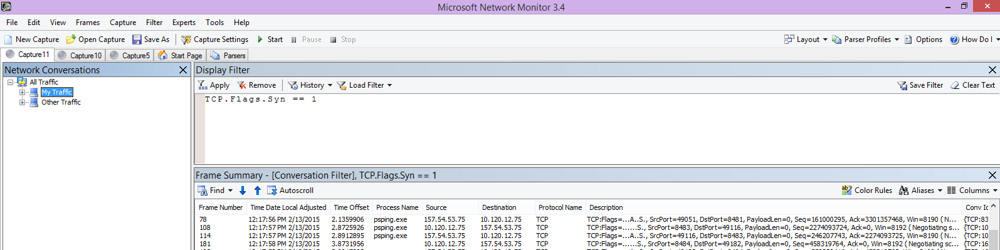

# <a name="performance-troubleshooting-plan-for-office-365"></a><span data-ttu-id="73b0f-103">План устранения неполадок с производительностью Office 365</span><span class="sxs-lookup"><span data-stu-id="73b0f-103">Performance troubleshooting plan for Office 365</span></span>

<span data-ttu-id="73b0f-104">Нужно знать, какие действия необходимо выполнить, чтобы определить и устранить отправку, зависание и снижение производительности между SharePoint Online, OneDrive для бизнеса, Exchange Online или Skype для бизнеса Online и вашим клиентским компьютером?</span><span class="sxs-lookup"><span data-stu-id="73b0f-104">Do you need to know the steps to take to identify and fix lags, hangs, and slow performance between SharePoint Online, OneDrive for Business, Exchange Online, or Skype for Business Online, and your client computer?</span></span> <span data-ttu-id="73b0f-105">Прежде чем позвонить в службу поддержки, эта статья поможет вам устранить проблемы с производительностью Office 365 и даже устранить некоторые из наиболее распространенных проблем.</span><span class="sxs-lookup"><span data-stu-id="73b0f-105">Before you call support, this article can help you troubleshoot Office 365 performance issues and even fix some of the most common issues.</span></span>
  
<span data-ttu-id="73b0f-106">В действительности эта статья является примером плана действий, который можно использовать для сбора ценных данных о проблемах с производительностью.</span><span class="sxs-lookup"><span data-stu-id="73b0f-106">This article is actually a sample action plan that you can use to capture valuable data about your performance issue as it's happening.</span></span> <span data-ttu-id="73b0f-107">В эту статью также включены некоторые основные проблемы.</span><span class="sxs-lookup"><span data-stu-id="73b0f-107">Some top issues are also included in this article.</span></span>

<span data-ttu-id="73b0f-108">Если вы не знакомы с производительностью сети и хотите длительный план для отслеживания производительности клиентских компьютеров и Office 365, ознакомьтесь со статьей [Настройка производительности office 365 и устранение неполадок — администраторы и ИТ-специалистов](performance-tuning-using-baselines-and-history.md).</span><span class="sxs-lookup"><span data-stu-id="73b0f-108">If you're new to network performance and want to make a long term plan to monitor performance between your client machines and Office 365, take a look at [Office 365 performance tuning and troubleshooting - Admin and IT Pro](performance-tuning-using-baselines-and-history.md).</span></span>
  
## <a name="sample-performance-troubleshooting-action-plan"></a><span data-ttu-id="73b0f-109">Пример плана действий по устранению неполадок с производительностью</span><span class="sxs-lookup"><span data-stu-id="73b0f-109">Sample performance troubleshooting action plan</span></span>

<span data-ttu-id="73b0f-110">Этот план действий состоит из двух частей; этап подготовки и фаза ведения журнала.</span><span class="sxs-lookup"><span data-stu-id="73b0f-110">This action plan contains two parts; a preparation phase, and a logging phase.</span></span> <span data-ttu-id="73b0f-111">Если у вас возникла проблема с производительностью, и вам нужно выполнить сбор данных, вы можете начать использовать этот план сразу.</span><span class="sxs-lookup"><span data-stu-id="73b0f-111">If you have a performance problem right now, and you need to do data collection, you can start using this plan right away.</span></span>
  
### <a name="prepare-the-client-computer"></a><span data-ttu-id="73b0f-112">Подготовка клиентского компьютера</span><span class="sxs-lookup"><span data-stu-id="73b0f-112">Prepare the client computer</span></span>
  
- <span data-ttu-id="73b0f-113">Найдите клиентский компьютер, который может воспроизводить проблему с производительностью.</span><span class="sxs-lookup"><span data-stu-id="73b0f-113">Find a client computer that can reproduce the performance problem.</span></span> <span data-ttu-id="73b0f-114">Этот компьютер будет использоваться в рамках устранения неполадок.</span><span class="sxs-lookup"><span data-stu-id="73b0f-114">This computer will be used during the course of troubleshooting.</span></span>
- <span data-ttu-id="73b0f-115">Запишите действия, которые приводят к возникновению проблем с производительностью, чтобы подготовиться к тестированию.</span><span class="sxs-lookup"><span data-stu-id="73b0f-115">Write down the steps that cause the performance problem to happen so you're ready when it comes time to test.</span></span>
- <span data-ttu-id="73b0f-116">Установка средств для сбора и записи данных:</span><span class="sxs-lookup"><span data-stu-id="73b0f-116">Install tools for gathering and recording information:</span></span>
  - <span data-ttu-id="73b0f-117">Установите [Netmon 3,4](https://www.microsoft.com/download/details.aspx?id=4865) (или используйте эквивалентное средство трассировки сети).</span><span class="sxs-lookup"><span data-stu-id="73b0f-117">Install [Netmon 3.4](https://www.microsoft.com/download/details.aspx?id=4865) (or use an equivalent network tracing tool).</span></span>
  - <span data-ttu-id="73b0f-118">Установите бесплатный Базовый выпуск [HTTPWatch](https://www.httpwatch.com/download/) (или используйте эквивалентное средство трассировки сети).</span><span class="sxs-lookup"><span data-stu-id="73b0f-118">Install the free Basic Edition of [HTTPWatch](https://www.httpwatch.com/download/) (or use an equivalent network Tracing tool).</span></span>
  - <span data-ttu-id="73b0f-119">Используйте средство записи экрана или запустите средство записи действий (PSR.exe), поставляемое с Windows Vista и более поздних версий, чтобы сохранить записи о действиях, выполняемых во время тестирования.</span><span class="sxs-lookup"><span data-stu-id="73b0f-119">Use a screen recorder or run the Steps Recorder (PSR.exe) that comes with Windows Vista and later, in order to keep a record of the steps you take during testing.</span></span>

### <a name="log-the-performance-issue"></a><span data-ttu-id="73b0f-120">Регистрация неполадок с производительностью</span><span class="sxs-lookup"><span data-stu-id="73b0f-120">Log the performance issue</span></span>
  
- <span data-ttu-id="73b0f-121">Закройте все лишние браузеры интернета.</span><span class="sxs-lookup"><span data-stu-id="73b0f-121">Close all extraneous Internet browsers.</span></span>
- <span data-ttu-id="73b0f-122">Запустите средство записи действий или другое средство записи экрана.</span><span class="sxs-lookup"><span data-stu-id="73b0f-122">Start the Steps Recorder, or another screen recorder.</span></span>
- <span data-ttu-id="73b0f-123">Запустите захват NetMon (или средство трассировки сети).</span><span class="sxs-lookup"><span data-stu-id="73b0f-123">Start your Netmon capture (or network tracing tool).</span></span>
- <span data-ttu-id="73b0f-124">Очистите кэш DNS на клиентском компьютере из командной строки, набрав ipconfig/флушднс.</span><span class="sxs-lookup"><span data-stu-id="73b0f-124">Clear your DNS cache on the client computer from the command line by typing ipconfig /flushdns.</span></span>
- <span data-ttu-id="73b0f-125">Запустите новый сеанс браузера и включите HTTPWatch.</span><span class="sxs-lookup"><span data-stu-id="73b0f-125">Start a new browser session and turn on HTTPWatch.</span></span>
- <span data-ttu-id="73b0f-126">Необязательно: Если тестируется Exchange Online, запустите средство анализатора производительности клиента Exchange из консоли администрирования Office 365.</span><span class="sxs-lookup"><span data-stu-id="73b0f-126">Optional: If you are testing Exchange Online, run the Exchange Client Performance Analyzer tool from the Office 365 admin console.</span></span>
- <span data-ttu-id="73b0f-127">Воспроизводите точные действия, которые вызывают проблемы с производительностью.</span><span class="sxs-lookup"><span data-stu-id="73b0f-127">Reproduce the exact steps that cause the performance issue.</span></span>
- <span data-ttu-id="73b0f-128">Остановите трассировку Netmon или другого средства.</span><span class="sxs-lookup"><span data-stu-id="73b0f-128">Stop your Netmon or other tool's trace.</span></span>
- <span data-ttu-id="73b0f-129">В командной строке выполните маршрут трассировки к вашей подписке на Office 365, введя следующую команду и нажав клавишу ВВОД:</span><span class="sxs-lookup"><span data-stu-id="73b0f-129">At the command line, run a trace route to your Office 365 subscription by typing the following command and then pressing ENTER:</span></span>

  ``` cmd
  tracert <subscriptionname>.onmicrosoft.com
  ```

- <span data-ttu-id="73b0f-130">Остановите средство записи действий и сохраните видео.</span><span class="sxs-lookup"><span data-stu-id="73b0f-130">Stop the Steps Recorder and save the video.</span></span> <span data-ttu-id="73b0f-131">Не забудьте включить дату и время для записи, а также показывает, является ли она наглядной или плохой.</span><span class="sxs-lookup"><span data-stu-id="73b0f-131">Be sure to include the date and time of the capture and whether it demonstrates good or bad performance.</span></span>
- <span data-ttu-id="73b0f-132">Сохраните файлы трассировки.</span><span class="sxs-lookup"><span data-stu-id="73b0f-132">Save the trace files.</span></span> <span data-ttu-id="73b0f-133">Опять же, не забудьте включить дату и время захвата, а также показывает, является ли оно наглядным или плохим производительностью.</span><span class="sxs-lookup"><span data-stu-id="73b0f-133">Again, be sure to include the date and time of the capture and whether it demonstrates good or bad performance.</span></span>

<span data-ttu-id="73b0f-134">Если вы не знакомы с запуском средств, упомянутых в этой статье, не беспокойтесь, так как мы предоставим эти действия следующим образом.</span><span class="sxs-lookup"><span data-stu-id="73b0f-134">If you're not familiar with running the tools mentioned in this article, don't worry because we provide those steps next.</span></span> <span data-ttu-id="73b0f-135">Если вы привыкли делать это, вы можете пропустить [инструкции по сбору базовых баз](performance-tuning-using-baselines-and-history.md#how-to-collect-baselines)данных, в которых описывается фильтрация и чтение журналов.</span><span class="sxs-lookup"><span data-stu-id="73b0f-135">If you're accustomed to doing this kind of network capturing, you can skip to [How to collect baselines](performance-tuning-using-baselines-and-history.md#how-to-collect-baselines), which describes filtering and reading the logs.</span></span>
  
### <a name="flush-the-dns-cache-first"></a><span data-ttu-id="73b0f-136">Сначала очистите кэш DNS</span><span class="sxs-lookup"><span data-stu-id="73b0f-136">Flush the DNS Cache first</span></span>

<span data-ttu-id="73b0f-137">Почему?</span><span class="sxs-lookup"><span data-stu-id="73b0f-137">Why?</span></span> <span data-ttu-id="73b0f-138">После очистки кэша DNS вы начинаете тесты с помощью чистого материала.</span><span class="sxs-lookup"><span data-stu-id="73b0f-138">By flushing out the DNS cache you're starting your tests with a clean slate.</span></span> <span data-ttu-id="73b0f-139">При очистке кэша вы передаете содержимое распознавателя DNS в самые актуальные записи.</span><span class="sxs-lookup"><span data-stu-id="73b0f-139">By clearing the cache, you're resetting the DNS resolver contents to the most up-to-date entries.</span></span> <span data-ttu-id="73b0f-140">Помните, что очистка не удаляет записи файлов hosts.</span><span class="sxs-lookup"><span data-stu-id="73b0f-140">Remember that a flush does not remove HOSTs file entries.</span></span> <span data-ttu-id="73b0f-141">Если записи файла узла широко используются, скопируйте эти записи в файл в другом каталоге, а затем очистите файл узла.</span><span class="sxs-lookup"><span data-stu-id="73b0f-141">If you use HOST file entries extensively, you should copy those entries out to a file in another directory and then empty the HOST file.</span></span>
  
#### <a name="flush-your-dns-resolver-cache"></a><span data-ttu-id="73b0f-142">Очистка кэша распознавателя DNS</span><span class="sxs-lookup"><span data-stu-id="73b0f-142">Flush your DNS resolver cache</span></span>
  
1. <span data-ttu-id="73b0f-143">Откройте командную строку ( **запустите** \> **Run** \> **cmd** или **Windows Key** \> **cmd**).</span><span class="sxs-lookup"><span data-stu-id="73b0f-143">Open the command prompt, (either **Start** \> **Run** \> **cmd** or **Windows key** \> **cmd**).</span></span>
2. <span data-ttu-id="73b0f-144">Введите следующую команду и нажмите клавишу ВВОД:</span><span class="sxs-lookup"><span data-stu-id="73b0f-144">Type the following command and press ENTER:</span></span>

    ``` cmd
    ipconfig /flushdns
    ```

## <a name="netmon"></a><span data-ttu-id="73b0f-145">Пользовательском</span><span class="sxs-lookup"><span data-stu-id="73b0f-145">Netmon</span></span>

<span data-ttu-id="73b0f-146">Средство Microsoft Network Monitoring ([Netmon](https://www.microsoft.com/download/details.aspx?id=4865)) анализирует пакеты, которые являются трафиком, который проходит между компьютерами в сети.</span><span class="sxs-lookup"><span data-stu-id="73b0f-146">Microsoft's Network Monitoring tool ([Netmon](https://www.microsoft.com/download/details.aspx?id=4865)) analyzes packets, that is traffic, that passes between computers on networks.</span></span> <span data-ttu-id="73b0f-147">С помощью NetMon для трассировки трафика с помощью Office 365 вы можете записывать, просматривать и читать заголовки пакетов, определять промежуточные устройства, проверять важные параметры сетевого оборудования, искать пропущенные пакеты и отслеживать поток трафика между компьютерами в корпоративной сети и Office 365.</span><span class="sxs-lookup"><span data-stu-id="73b0f-147">By using Netmon to trace traffic with Office 365 you can capture, view, and read packet headers, identify intervening devices, check important settings on network hardware, look for dropped packets, and follow the flow of traffic between computers on your corporate network and Office 365.</span></span> <span data-ttu-id="73b0f-148">Так как фактический текст трафика шифруется (перемещается на порте 443 через SSL/TLS, вы не можете считать отправляемые файлы.</span><span class="sxs-lookup"><span data-stu-id="73b0f-148">Because the actual body of the traffic is encrypted, that is, it(travels on port 443 via SSL/TLS, you can't read the files being sent.</span></span> <span data-ttu-id="73b0f-149">Вместо этого вы получаете нефильтрованную трассировку пути, который принимает пакет, который поможет вам отслеживать поведение проблемы.</span><span class="sxs-lookup"><span data-stu-id="73b0f-149">Instead, you get an unfiltered trace of the path that the packet takes which can help you track down the problem behavior.</span></span>
  
<span data-ttu-id="73b0f-150">Убедитесь, что в настоящее время фильтр не применяется.</span><span class="sxs-lookup"><span data-stu-id="73b0f-150">Be sure you don't apply a filter at this time.</span></span> <span data-ttu-id="73b0f-151">Вместо этого выполните действия и продемонстрируйте проблему перед остановкой трассировки и сохранением.</span><span class="sxs-lookup"><span data-stu-id="73b0f-151">Instead, run through the steps and demonstrate the problem before stopping the trace and saving.</span></span>
  
<span data-ttu-id="73b0f-152">После установки Netmon 3,4 Откройте средство и выполните указанные ниже действия.</span><span class="sxs-lookup"><span data-stu-id="73b0f-152">After you install Netmon 3.4, open the tool and take these steps:</span></span>
  
### <a name="take-a-netmon-trace-and-reproduce-the-issue"></a><span data-ttu-id="73b0f-153">Получение трассировки Netmon и воспроизведение проблемы</span><span class="sxs-lookup"><span data-stu-id="73b0f-153">Take a Netmon trace and reproduce the issue</span></span>
  
1. <span data-ttu-id="73b0f-154">Запустите NetMon 3,4.</span><span class="sxs-lookup"><span data-stu-id="73b0f-154">Launch Netmon 3.4.</span></span>
<span data-ttu-id="73b0f-155">На **начальной** странице есть три области: **недавние записи**, **Выбор сетей**и начало **работы с сетевым монитором 3,4. Примечание**.</span><span class="sxs-lookup"><span data-stu-id="73b0f-155">There are three panes on the **Start** page: **Recent Captures**, **Select Networks**, and the **Getting Started with Microsoft Network Monitor 3.4. Notice**.</span></span> <span data-ttu-id="73b0f-156">Кроме того, на панели Выбор сетей вы получите список сетей по умолчанию, из которых можно записывать.</span><span class="sxs-lookup"><span data-stu-id="73b0f-156">The Select Networks panel will also give you a list of the default networks from which you can capture.</span></span> <span data-ttu-id="73b0f-157">Убедитесь, что в этой статье выбраны сетевые карты.</span><span class="sxs-lookup"><span data-stu-id="73b0f-157">Be sure that network cards are selected here.</span></span>

2. <span data-ttu-id="73b0f-158">В верхней части **начальной** страницы нажмите кнопку **создать запись** .</span><span class="sxs-lookup"><span data-stu-id="73b0f-158">Click **New Capture** at the top of the **Start** page.</span></span> <span data-ttu-id="73b0f-159">При этом на вкладке **Начальная** страница добавляется новая вкладка **захват 1**.</span><span class="sxs-lookup"><span data-stu-id="73b0f-159">This adds a new tab beside the **Start** page tab called **Capture 1**.</span></span>
<span data-ttu-id="73b0f-160"></span><span class="sxs-lookup"><span data-stu-id="73b0f-160"></span></span>

3. <span data-ttu-id="73b0f-161">Чтобы создать простую запись, нажмите кнопку **Пуск** на панели инструментов.</span><span class="sxs-lookup"><span data-stu-id="73b0f-161">To take a simple capture, click **Start** on the toolbar.</span></span>

4. <span data-ttu-id="73b0f-162">Воспроизведите действия, которые представляют проблемы с производительностью.</span><span class="sxs-lookup"><span data-stu-id="73b0f-162">Reproduce the steps that present a performance issue.</span></span>

5. <span data-ttu-id="73b0f-163">Нажмите кнопку **остановить** \> **File** \> **Сохранение файла как**.</span><span class="sxs-lookup"><span data-stu-id="73b0f-163">Click **Stop** \> **File** \> **Save As**.</span></span> <span data-ttu-id="73b0f-164">Помните, что вы можете присвоить дату и время в этом часовом поясе, а также указать, что она показывает плохое или хорошую производительность.</span><span class="sxs-lookup"><span data-stu-id="73b0f-164">Remember to give the date and time with the time zone and to mention if it demonstrates bad or good performance.</span></span>

## <a name="httpwatch"></a><span data-ttu-id="73b0f-165">HTTPWatch</span><span class="sxs-lookup"><span data-stu-id="73b0f-165">HTTPWatch</span></span>

<span data-ttu-id="73b0f-166">[HTTPWatch](https://www.httpwatch.com/download/) поставляется с платной и бесплатной версией.</span><span class="sxs-lookup"><span data-stu-id="73b0f-166">[HTTPWatch](https://www.httpwatch.com/download/) comes in charged, and a free edition.</span></span> <span data-ttu-id="73b0f-167">Бесплатный Базовый выпуск охватывает все, что вам нужно для этого теста.</span><span class="sxs-lookup"><span data-stu-id="73b0f-167">The free Basic Edition covers everything you need for this test.</span></span> <span data-ttu-id="73b0f-168">HTTPWatch отслеживает сетевой трафик и время загрузки страницы прямо из окна браузера.</span><span class="sxs-lookup"><span data-stu-id="73b0f-168">HTTPWatch monitors network traffic and page load time right from your browser window.</span></span> <span data-ttu-id="73b0f-169">HTTPWatch — это подключаемый модуль для Internet Explorer, который графически описывает производительность.</span><span class="sxs-lookup"><span data-stu-id="73b0f-169">HTTPWatch is a plug-in to Internet Explorer that graphically describes performance.</span></span> <span data-ttu-id="73b0f-170">Анализ можно сохранить и просмотреть в HTTPWatch Studio.</span><span class="sxs-lookup"><span data-stu-id="73b0f-170">The analysis can be saved and viewed in HTTPWatch Studio.</span></span>
  
> [!NOTE]
> <span data-ttu-id="73b0f-171">Если вы используете другой браузер, например Firefox, Google Chrome, или если вы не можете установить HTTPWatch в Internet Explorer, откройте новое окно браузера и нажмите клавишу F12 на клавиатуре.</span><span class="sxs-lookup"><span data-stu-id="73b0f-171">If you use another browser, such as Firefox, Google Chrome, or if you can't install HTTPWatch in Internet Explorer, open a new browser window and press F12 on your keyboard.</span></span> <span data-ttu-id="73b0f-172">В нижней части браузера должен появиться всплывающее окно средства разработчика.</span><span class="sxs-lookup"><span data-stu-id="73b0f-172">You should see the Developer Tool pop-up at the bottom of your browser.</span></span> <span data-ttu-id="73b0f-173">Если вы используете Opera, нажмите клавиши CTRL + SHIFT + I для инспектора веб-страниц, а затем перейдите на вкладку **сеть** и выполните проверку, описанную ниже.</span><span class="sxs-lookup"><span data-stu-id="73b0f-173">If you use Opera, press CTRL+SHIFT+I for Web Inspector, then click the **Network** tab and complete the testing outlined below.</span></span> <span data-ttu-id="73b0f-174">Информация будет немного отличаться, но время загрузки по-прежнему будет отображаться в миллисекундах.</span><span class="sxs-lookup"><span data-stu-id="73b0f-174">The information will be slightly different, but load times will still be displayed in milliseconds.</span></span> <span data-ttu-id="73b0f-175">> HTTPWatch также очень полезен для проблем с временем загрузки страниц SharePoint Online.</span><span class="sxs-lookup"><span data-stu-id="73b0f-175">> HTTPWatch is also very useful for issues with SharePoint Online page load times.</span></span>
  
### <a name="run-httpwatch-and-reproduce-the-issue"></a><span data-ttu-id="73b0f-176">Запуск HTTPWatch и воспроизведение проблемы</span><span class="sxs-lookup"><span data-stu-id="73b0f-176">Run HTTPWatch and reproduce the issue</span></span>
  
<span data-ttu-id="73b0f-177">HTTPWatch — это подключаемый модуль браузера, поэтому доступ к средству в браузере несколько отличается для каждой версии Internet Explorer.</span><span class="sxs-lookup"><span data-stu-id="73b0f-177">HTTPWatch is a browser plug-in, so exposing the tool in the browser is slightly different for each version of Internet Explorer.</span></span> <span data-ttu-id="73b0f-178">Как правило, HTTPWatch можно найти в панели команд в браузере Internet Explorer.</span><span class="sxs-lookup"><span data-stu-id="73b0f-178">Typically, you can find HTTPWatch under the Commands bar in the Internet Explorer browser.</span></span> <span data-ttu-id="73b0f-179">Если в окне браузера не отображается подключаемый модуль HTTPWatch, проверьте версию браузера, нажав кнопку **Справка** \> **About**, или в последующих версиях Internet Explorer щелкните символ шестеренки и **сведения о Internet Explorer**.</span><span class="sxs-lookup"><span data-stu-id="73b0f-179">If you don't see the HTTPWatch plug-in in your browser window, check the version of your browser by clicking **Help** \> **About**, or in later versions of Internet Explorer, click the gear symbol and **About Internet Explorer**.</span></span> <span data-ttu-id="73b0f-180">Чтобы запустить панель **команд** , щелкните строку меню в Internet Explorer правой кнопкой мыши и выберите пункт **панель команд**.</span><span class="sxs-lookup"><span data-stu-id="73b0f-180">To launch the **Commands** bar, right-click the menu bar in Internet Explorer and click **Commands bar**.</span></span>

<span data-ttu-id="73b0f-181">В прошлый раз HTTPWatch сопоставлены с командами и панелями обозревателя, поэтому после установки, если вы не увидите значок проверки (даже после перезагрузки **), а**панели инструментов для значка.</span><span class="sxs-lookup"><span data-stu-id="73b0f-181">In the past, HTTPWatch has been associated with both the Commands and the Explorer bars, so once you install, if you don't immediately see the icon (even after reboot) check **Tools**, and your toolbars for the icon.</span></span> <span data-ttu-id="73b0f-182">Помните, что вы можете добавлять панели инструментов и добавлять к ним параметры.</span><span class="sxs-lookup"><span data-stu-id="73b0f-182">Remember that toolbars can be customized and options can be added to them.</span></span>


  
1. <span data-ttu-id="73b0f-184">Запустите HTTPWatch в окне браузера Internet Explorer.</span><span class="sxs-lookup"><span data-stu-id="73b0f-184">Launch HTTPWatch in an Internet Explorer browser window.</span></span> <span data-ttu-id="73b0f-185">Он будет отображаться прикрепленным к браузеру в нижней части окна.</span><span class="sxs-lookup"><span data-stu-id="73b0f-185">It will appear docked to the browser at the bottom of that window.</span></span> <span data-ttu-id="73b0f-186">Нажмите кнопку **запись**.</span><span class="sxs-lookup"><span data-stu-id="73b0f-186">Click **Record**.</span></span>

2. <span data-ttu-id="73b0f-187">Воспроизводите точные действия, связанные с производительностью.</span><span class="sxs-lookup"><span data-stu-id="73b0f-187">Reproduce the exact steps involved in the performance issue.</span></span> <span data-ttu-id="73b0f-188">Нажмите кнопку " **остановить** " в HTTPWatch.</span><span class="sxs-lookup"><span data-stu-id="73b0f-188">Click the **Stop** button in HTTPWatch.</span></span>

3. <span data-ttu-id="73b0f-189">**Сохраните** HTTPWatch или **отправьте сообщение по электронной почте**.</span><span class="sxs-lookup"><span data-stu-id="73b0f-189">**Save** the HTTPWatch or **Send by Email**.</span></span> <span data-ttu-id="73b0f-190">Не забудьте назвать файл так, чтобы он включал сведения о дате и времени, а также сведения о том, содержит ли контрольное значение демонстрацию хорошей или плохой производительности.</span><span class="sxs-lookup"><span data-stu-id="73b0f-190">Remember to name the file so that it includes date and time information and an indication of whether your Watch contains a demonstration of good or bad performance.</span></span>


<span data-ttu-id="73b0f-192">Этот снимок экрана относится к профессиональной версии HTTPWatch.</span><span class="sxs-lookup"><span data-stu-id="73b0f-192">This screen shot is from the Professional version of HTTPWatch.</span></span> <span data-ttu-id="73b0f-193">Вы можете открывать трассировки, полученные в базовой версии на компьютере с профессиональной версией, и читать их там.</span><span class="sxs-lookup"><span data-stu-id="73b0f-193">You can open traces taken in the Basic Version on a computer with a Professional version and read it there.</span></span> <span data-ttu-id="73b0f-194">В этом методе могут быть доступны дополнительные сведения из трассировки.</span><span class="sxs-lookup"><span data-stu-id="73b0f-194">Extra information may be available from the trace through that method.</span></span>

## <a name="problem-steps-recorder"></a><span data-ttu-id="73b0f-195">Средство записи действий по устранению неполадок</span><span class="sxs-lookup"><span data-stu-id="73b0f-195">Problem Steps Recorder</span></span>

<span data-ttu-id="73b0f-196">Средство записи действий или PSR.exe позволяет записывать проблемы по мере их возникновения.</span><span class="sxs-lookup"><span data-stu-id="73b0f-196">Steps Recorder, or PSR.exe, allows you to record issues as they are occurring.</span></span> <span data-ttu-id="73b0f-197">Это очень полезная инструмент и очень простая работа.</span><span class="sxs-lookup"><span data-stu-id="73b0f-197">It's a very useful tool and very simple to run.</span></span>
  
### <a name="run-problem-steps-recorder-psrexe-to-record-your-work"></a><span data-ttu-id="73b0f-198">Запуск средства записи действий по проблеме (PSR.exe) для записи работы</span><span class="sxs-lookup"><span data-stu-id="73b0f-198">Run Problem Steps Recorder (PSR.exe) to record your work</span></span>
  
1. <span data-ttu-id="73b0f-199">Выберите команду **запустить** \> **Запуск** \> **PSR.exe** \> " **ОК**" или выберите тип **ключа Windows** \> **PSR.exe** \> а затем нажмите клавишу ВВОД.</span><span class="sxs-lookup"><span data-stu-id="73b0f-199">Either use **Start** \> **Run** \> type **PSR.exe** \> **OK**, or, click the **Windows Key** \> type **PSR.exe** \> and then press ENTER.</span></span>

2. <span data-ttu-id="73b0f-200">Когда появится окно небольшое PSR.exe, нажмите кнопку **начать запись** и воспроизводите шаги, необходимые для воспроизведения проблемы с производительностью.</span><span class="sxs-lookup"><span data-stu-id="73b0f-200">When the small PSR.exe window appears, click **Start Record** and reproduce the steps that reproduce the performance issue.</span></span> <span data-ttu-id="73b0f-201">При необходимости можно добавить комментарии, нажав кнопку **Добавить комментарии**.</span><span class="sxs-lookup"><span data-stu-id="73b0f-201">You can add comments as needed, by clicking **Add Comments**.</span></span>

3. <span data-ttu-id="73b0f-202">После выполнения этих действий нажмите кнопку **остановить запись** .</span><span class="sxs-lookup"><span data-stu-id="73b0f-202">Click **Stop Record** when you have completed the steps.</span></span> <span data-ttu-id="73b0f-203">Если эта ошибка связана с производительностью страницы, дождитесь ее отображения перед остановкой записи.</span><span class="sxs-lookup"><span data-stu-id="73b0f-203">If the performance issue is a page render, wait for the page to render before you stop the recording.</span></span>

4. <span data-ttu-id="73b0f-204">Нажмите кнопку **Сохранить**.</span><span class="sxs-lookup"><span data-stu-id="73b0f-204">Click **Save**.</span></span>


  
<span data-ttu-id="73b0f-206">Дата и время записываются для вас.</span><span class="sxs-lookup"><span data-stu-id="73b0f-206">The date and time is recorded for you.</span></span> <span data-ttu-id="73b0f-207">Это связывает ПСР с трассировкой Netmon и HTTPWatch во время и помогает устранять неполадки с точностью.</span><span class="sxs-lookup"><span data-stu-id="73b0f-207">This links your PSR to your Netmon trace and HTTPWatch in time, and helps with precision troubleshooting.</span></span> <span data-ttu-id="73b0f-208">Дата и время в записи ПСР могут показать, что минута передается между входом и обзором URL-адреса и частичной визуализацией сайта администрирования, например.</span><span class="sxs-lookup"><span data-stu-id="73b0f-208">The date and time in the PSR record can show that a minute passed between the login and browsing of the URL and the partial render of the admin site, for example.</span></span>
  
## <a name="read-your-traces"></a><span data-ttu-id="73b0f-209">Чтение трассировок</span><span class="sxs-lookup"><span data-stu-id="73b0f-209">Read your traces</span></span>

<span data-ttu-id="73b0f-210">Невозможно проучить все сведения об устранении неполадок сети и производительности, которые необходимо знать с помощью статьи.</span><span class="sxs-lookup"><span data-stu-id="73b0f-210">It isn't possible to teach everything about network and performance troubleshooting that someone would need to know via an article.</span></span> <span data-ttu-id="73b0f-211">Для обеспечения высокой производительности необходимо иметь в своем составе сведения о том, как работает сеть и как обычно работает.</span><span class="sxs-lookup"><span data-stu-id="73b0f-211">Getting good at performance takes experience, and knowledge of how your network works and usually performs.</span></span> <span data-ttu-id="73b0f-212">Но можно округлить список самых распространенных проблем и показать, как инструменты могут облегчить устранение наиболее распространенных проблем.</span><span class="sxs-lookup"><span data-stu-id="73b0f-212">But it is possible to round up a list of top issues and show how tools can make it easier for you to eliminate the most common problems.</span></span>
  
<span data-ttu-id="73b0f-213">Если вы хотите получить навыки, просчитывающие трассировки сети для сайтов Office 365, не существует более эффективного преподавателя, чем регулярно создавать трассировки страниц, а также считывать их.</span><span class="sxs-lookup"><span data-stu-id="73b0f-213">If you want to pick up skills reading network traces for your Office 365 sites, there is no better teacher than creating traces of page loads regularly and gaining experience reading them.</span></span> <span data-ttu-id="73b0f-214">Например, если у вас есть шанс, загрузите службу Office 365 и прослеживанием процесса.</span><span class="sxs-lookup"><span data-stu-id="73b0f-214">For example, when you have a chance, load an Office 365 service and trace the process.</span></span> <span data-ttu-id="73b0f-215">Отфильтровать трассировку для трафика DNS или выполнить поиск имени службы, которую вы просматриваете, в Фрамедата.</span><span class="sxs-lookup"><span data-stu-id="73b0f-215">Filter the trace for DNS traffic, or search the FrameData for the name of the service you browsed.</span></span> <span data-ttu-id="73b0f-216">Сканирование трассировки для получения представления о действиях, выполняемых при загрузке службы.</span><span class="sxs-lookup"><span data-stu-id="73b0f-216">Scan the trace to get an idea of the steps that occur when the service loads.</span></span> <span data-ttu-id="73b0f-217">Это поможет вам узнать, как должна выглядеть нормальная загрузка страницы, а в случае устранения неполадок, в частности, в случае устранения неполадок, а именно, сравнение хорошей и плохой трассировки может научиться многое.</span><span class="sxs-lookup"><span data-stu-id="73b0f-217">This will help you learn what normal page load should look like, and in the case of troubleshooting, particularly around performance, comparing good to bad traces can teach you a lot.</span></span>
  
<span data-ttu-id="73b0f-218">NetMon использует Microsoft IntelliSense в поле Фильтр отображения.</span><span class="sxs-lookup"><span data-stu-id="73b0f-218">Netmon uses Microsoft Intellisense in the Display filter field.</span></span> <span data-ttu-id="73b0f-219">IntelliSense или интеллектуальное завершение кода — это прием, в котором вы вводите точку, а все доступные параметры отображаются в раскрывающемся списке выбора.</span><span class="sxs-lookup"><span data-stu-id="73b0f-219">Intellisense, or intelligent code completion, is that trick where you type in a period and all available options are displayed in a drop-down selection box.</span></span> <span data-ttu-id="73b0f-220">Если, например, вы беспокоитесь о масштабировании окна TCP, вы можете найти свой способ отбора (например,  `.protocol.tcp.window < 100` ).</span><span class="sxs-lookup"><span data-stu-id="73b0f-220">If, for example, you are worried about TCP window scaling, you can find your way to a filter (such as  `.protocol.tcp.window < 100`) by this means.</span></span>
  

  
<span data-ttu-id="73b0f-222">Трассировки Netmon могут иметь большой объем трафика.</span><span class="sxs-lookup"><span data-stu-id="73b0f-222">Netmon traces can have a lot of traffic in them.</span></span> <span data-ttu-id="73b0f-223">Если вы не читаете их, вероятно, вы будете слишком большим открытием трассировки.</span><span class="sxs-lookup"><span data-stu-id="73b0f-223">If you aren't experienced with reading them, it's likely you will be overwhelmed opening the trace the first time.</span></span> <span data-ttu-id="73b0f-224">Первое, что нужно сделать, это отделить сигнал от фонового шума в трассировке.</span><span class="sxs-lookup"><span data-stu-id="73b0f-224">The first thing to do is separate the signal from the background noise in the trace.</span></span> <span data-ttu-id="73b0f-225">Вы тестировали свой пакет Office 365, и это трафик, который вы хотите просмотреть.</span><span class="sxs-lookup"><span data-stu-id="73b0f-225">You tested against Office 365, and that's the traffic you want to see.</span></span> <span data-ttu-id="73b0f-226">Если вы используете трассировку, этот список может не потребоваться.</span><span class="sxs-lookup"><span data-stu-id="73b0f-226">If you are used to navigating through traces, you may not need this list.</span></span>
  
<span data-ttu-id="73b0f-227">Трафик между клиентом и Office 365 передается через TLS, что означает, что текст трафика будет зашифрован и не будет читаемым в общей трассировке Netmon.</span><span class="sxs-lookup"><span data-stu-id="73b0f-227">Traffic between your client and Office 365 travels via TLS, which means that the body of the traffic will be encrypted and not readable in a generic Netmon trace.</span></span> <span data-ttu-id="73b0f-228">Анализ производительности не обязан знать особенности сведений в пакете.</span><span class="sxs-lookup"><span data-stu-id="73b0f-228">Your performance analysis doesn't need to know the specifics of the information in the packet.</span></span> <span data-ttu-id="73b0f-229">Тем не менее, в заголовках пакетов и содержащихся в них данных очень интересно.</span><span class="sxs-lookup"><span data-stu-id="73b0f-229">It is, however, very interested in packet headers and the information that they contain.</span></span>
  
### <a name="tips-to-get-a-good-trace"></a><span data-ttu-id="73b0f-230">Советы для получения хорошей трассировки</span><span class="sxs-lookup"><span data-stu-id="73b0f-230">Tips to get a good trace</span></span>
  
- <span data-ttu-id="73b0f-231">Знать значение IPv4-или IPv6-адреса клиентского компьютера.</span><span class="sxs-lookup"><span data-stu-id="73b0f-231">Know the value of the IPv4 or IPv6 address of your client computer.</span></span> <span data-ttu-id="73b0f-232">Для этого в командной строке введите **ipconfig** , а затем нажмите клавишу ВВОД.</span><span class="sxs-lookup"><span data-stu-id="73b0f-232">You can get this from the command prompt by typing **IPConfig** and then pressing ENTER.</span></span> <span data-ttu-id="73b0f-233">Зная этот адрес, вы узнаете, как узнать, какой именно трафик в трассировке напрямую включает ваш клиентский компьютер.</span><span class="sxs-lookup"><span data-stu-id="73b0f-233">Knowing this address will let you tell at a glance whether the traffic in the trace directly involves your client computer.</span></span> <span data-ttu-id="73b0f-234">Если есть известный прокси-сервер, обратитесь к нему и получите его IP-адрес.</span><span class="sxs-lookup"><span data-stu-id="73b0f-234">If there is a known proxy, ping it and get its IP address as well.</span></span>

- <span data-ttu-id="73b0f-235">Очистите кэш сопоставителя DNS и, если это возможно, закройте все браузеры, Кроме того, в котором выполняются тесты.</span><span class="sxs-lookup"><span data-stu-id="73b0f-235">Flush your DNS resolver cache and, if possible, close all browsers except the one in which you are running your tests.</span></span> <span data-ttu-id="73b0f-236">Если вы не можете сделать это, например, если поддержка использует какое-либо средство на основе браузера для просмотра рабочего стола клиентского компьютера, необходимо подготовиться к фильтрации трассировки.</span><span class="sxs-lookup"><span data-stu-id="73b0f-236">If you are not able to do this, for instance, if support is using some browser-based tool to see your client computer's desktop, be prepared to filter your trace.</span></span>

- <span data-ttu-id="73b0f-237">В прослеживании занятости откройте службу Office 365, которую вы используете.</span><span class="sxs-lookup"><span data-stu-id="73b0f-237">In a busy trace, locate the Office 365 service that you're using.</span></span> <span data-ttu-id="73b0f-238">Если вы никогда или редко видели трафик до, это полезное действие, связанное с отправкой производительности от других шумов сети.</span><span class="sxs-lookup"><span data-stu-id="73b0f-238">If you've never or seldom seen your traffic before, this is a helpful step in separating the performance issue from other network noise.</span></span> <span data-ttu-id="73b0f-239">Это можно сделать несколькими способами.</span><span class="sxs-lookup"><span data-stu-id="73b0f-239">There are a few ways to do this.</span></span> <span data-ttu-id="73b0f-240">Непосредственно перед проверкой можно использовать _команду ping_ или _PsPing_ по URL-адресу определенной службы ( `ping outlook.office365.com` `psping -4 microsoft-my.sharepoint.com:443` например, или).</span><span class="sxs-lookup"><span data-stu-id="73b0f-240">Directly before your test, you can use _ping_ or _PsPing_ against the URL of the specific service (`ping outlook.office365.com` or `psping -4 microsoft-my.sharepoint.com:443`, for example).</span></span> <span data-ttu-id="73b0f-241">Вы также можете легко найти эту команду ping или PsPing в трассировке Netmon (по имени процесса).</span><span class="sxs-lookup"><span data-stu-id="73b0f-241">You can also easily find that ping or PsPing in a Netmon trace (by its process name).</span></span> <span data-ttu-id="73b0f-242">Вы сможете начать поиск.</span><span class="sxs-lookup"><span data-stu-id="73b0f-242">That will give you a place to start looking.</span></span>

<span data-ttu-id="73b0f-243">Если вы используете только трассировку NetMon в момент возникновения проблемы, это тоже нормально.</span><span class="sxs-lookup"><span data-stu-id="73b0f-243">If you're only using Netmon tracing at the time of the problem, that's okay too.</span></span> <span data-ttu-id="73b0f-244">Чтобы правильно ориентироваться, используйте фильтр, такой как `ContainsBin(FrameData, ASCII, "office")` или `ContainsBin(FrameData, ASCII, "outlook")` .</span><span class="sxs-lookup"><span data-stu-id="73b0f-244">To orient yourself, use a filter like `ContainsBin(FrameData, ASCII, "office")` or `ContainsBin(FrameData, ASCII, "outlook")`.</span></span> <span data-ttu-id="73b0f-245">Вы можете записать номер кадра из файла трассировки.</span><span class="sxs-lookup"><span data-stu-id="73b0f-245">You can record your frame number from the trace file.</span></span> <span data-ttu-id="73b0f-246">Кроме того, вы можете прокручивать область _сводки кадров_ и искать столбец идентификатор беседы.</span><span class="sxs-lookup"><span data-stu-id="73b0f-246">You may also want to scroll the _Frame Summary_ pane all the way to the right and look for the Conversation ID column.</span></span> <span data-ttu-id="73b0f-247">Существует число, в котором указывается идентификатор этой конкретной беседы, которую можно также записать и просмотреть в изоляции позже.</span><span class="sxs-lookup"><span data-stu-id="73b0f-247">There is a number indicated there for the ID of this specific conversation that you can also record and look at in isolation later.</span></span> <span data-ttu-id="73b0f-248">Не забудьте удалить этот фильтр перед применением любой другой фильтрации.</span><span class="sxs-lookup"><span data-stu-id="73b0f-248">Remember to remove this filter before applying any other filtering.</span></span>

> [!TIP]
> <span data-ttu-id="73b0f-249">В NetMon включен большой набор полезных встроенных фильтров.</span><span class="sxs-lookup"><span data-stu-id="73b0f-249">Netmon has a lot of helpful built-in filters.</span></span> <span data-ttu-id="73b0f-250">Воспользуйтесь кнопкой **загрузить фильтр** в верхней части области фильтра _отображения_ .</span><span class="sxs-lookup"><span data-stu-id="73b0f-250">Try the **Load Filter** button at the top of the _Display_ filter pane.</span></span>
  

  

  
<span data-ttu-id="73b0f-253">Ознакомьтесь с трафиком и Узнайте, как найти нужные сведения.</span><span class="sxs-lookup"><span data-stu-id="73b0f-253">Get familiar with your traffic, and learn to locate the information you need.</span></span> <span data-ttu-id="73b0f-254">Например, Узнайте, как определить, какой пакет в трассировке имеет первую ссылку на используемую службу Office 365 (например, "Outlook").</span><span class="sxs-lookup"><span data-stu-id="73b0f-254">For example, learn to determine which packet in the trace has the first reference to the Office 365 service you're using (like "Outlook").</span></span>

<span data-ttu-id="73b0f-255">В качестве примера вы можете взять Office 365 Outlook Online:</span><span class="sxs-lookup"><span data-stu-id="73b0f-255">Taking Office 365 Outlook Online as an example, the traffic begins something like this:</span></span>
  
- <span data-ttu-id="73b0f-256">Стандартный запрос DNS и ответ DNS для outlook.office365.com с соответствующими Куеридс.</span><span class="sxs-lookup"><span data-stu-id="73b0f-256">DNS Standard Query and DNS Response for outlook.office365.com with matching QueryIDs.</span></span> <span data-ttu-id="73b0f-257">Важно отметить смещение времени для этого отключения, а также то, где в мире глобальный DNS-сервер Office 365 отправляет запрос на разрешение имен.</span><span class="sxs-lookup"><span data-stu-id="73b0f-257">It's important to note the time offset for this turn-around, as well as where in the world the Office 365 Global DNS sends the request for name resolution.</span></span> <span data-ttu-id="73b0f-258">В идеале, как можно раньше, а не на середине мира.</span><span class="sxs-lookup"><span data-stu-id="73b0f-258">Ideally, as locally as possible, rather than halfway across the world.</span></span>

- <span data-ttu-id="73b0f-259">HTTP-запрос GET, отчет о состоянии которого был перемещен навсегда (301)</span><span class="sxs-lookup"><span data-stu-id="73b0f-259">A HTTP GET Request whose status report Moved Permanently (301)</span></span>

- <span data-ttu-id="73b0f-260">РВС трафик, в том числе запросы на подключение к РВС и подключение ответов.</span><span class="sxs-lookup"><span data-stu-id="73b0f-260">RWS Traffic including RWS Connect requests and Connect replies.</span></span> <span data-ttu-id="73b0f-261">(Это удаленная Winsock, который делает подключение.)</span><span class="sxs-lookup"><span data-stu-id="73b0f-261">(This is Remote Winsock making a connection for you.)</span></span>

- <span data-ttu-id="73b0f-262">TCP SYN и TCP SYN/ACK.</span><span class="sxs-lookup"><span data-stu-id="73b0f-262">A TCP SYN and TCP SYN/ACK conversation.</span></span> <span data-ttu-id="73b0f-263">Множество параметров в этой беседе влияют на производительность.</span><span class="sxs-lookup"><span data-stu-id="73b0f-263">A lot of the settings in this conversation impact your performance.</span></span>

- <span data-ttu-id="73b0f-264">Затем серии TLS: трафик TLS, в котором выполняются диалоговые окна подтверждения TLS и TLS-сертификатов.</span><span class="sxs-lookup"><span data-stu-id="73b0f-264">Then a series of TLS:TLS traffic which is where the TLS handshake and TLS certificate conversations take place.</span></span> <span data-ttu-id="73b0f-265">Помните, что данные шифруются с помощью SSL/TLS.</span><span class="sxs-lookup"><span data-stu-id="73b0f-265">(Remember the data is encrypted via SSL/TLS.)</span></span>

<span data-ttu-id="73b0f-266">Все части трафика важны и соединяются, но небольшие части трассировки содержат сведения, которые особенно важны в плане устранения неполадок с производительностью, поэтому мы будем сосредоточиться на этих областях.</span><span class="sxs-lookup"><span data-stu-id="73b0f-266">All parts of the traffic are important and connected, but small portions of the trace contain information particularly important in terms of performance troubleshooting, so we'll focus on those areas.</span></span> <span data-ttu-id="73b0f-267">Кроме того, так как мы сделали достаточное количество проблем с производительностью Office 365 в корпорации Майкрософт для компиляции десяти самых распространенных проблем, мы будем сосредоточиться на этих проблемах и в том, как использовать средства, которые необходимо сделать следующим образом.</span><span class="sxs-lookup"><span data-stu-id="73b0f-267">Also, since we've done enough Office 365 performance troubleshooting at Microsoft to compile a Top Ten list of common problems, we'll focus on those issues and how to use the tools we have to root them out next.</span></span>
  
<span data-ttu-id="73b0f-268">Если вы не установили их все готово, в матрице ниже используется несколько средств.</span><span class="sxs-lookup"><span data-stu-id="73b0f-268">If you haven't installed them all ready, the matrix below makes use of several tools.</span></span> <span data-ttu-id="73b0f-269">Где это возможно.</span><span class="sxs-lookup"><span data-stu-id="73b0f-269">Where possible.</span></span> <span data-ttu-id="73b0f-270">Ссылки передаются в точки установки.</span><span class="sxs-lookup"><span data-stu-id="73b0f-270">Links are provided to the installation points.</span></span> <span data-ttu-id="73b0f-271">Список включает общие средства трассировки сети, такие как [Netmon](https://www.microsoft.com/download/details.aspx?id=4865) и [Wireshark](https://www.wireshark.org/), но используют любой инструмент трассировки, и в котором вы привыкли к фильтрации сетевого трафика.</span><span class="sxs-lookup"><span data-stu-id="73b0f-271">The list includes common network tracing tools like [Netmon](https://www.microsoft.com/download/details.aspx?id=4865) and [Wireshark](https://www.wireshark.org/), but use any tracing tool you are comfortable with, and in which you're accustomed to filtering network traffic.</span></span> <span data-ttu-id="73b0f-272">При тестировании Помните:</span><span class="sxs-lookup"><span data-stu-id="73b0f-272">When you're testing, remember:</span></span>
  
- <span data-ttu-id="73b0f-273">*Закройте браузеры и проверьте, работает только один браузер*  . это приведет к уменьшению общего объема записанных данных.</span><span class="sxs-lookup"><span data-stu-id="73b0f-273">*Close your browsers, and test with only one browser running*  - This will reduce the overall traffic you capture.</span></span> <span data-ttu-id="73b0f-274">Она делает трассировку менее загруженной.</span><span class="sxs-lookup"><span data-stu-id="73b0f-274">It makes for a less busy trace.</span></span>
- <span data-ttu-id="73b0f-275">*Очистите кэш СОПОСТАВИТЕЛЯ DNS на клиентском компьютере*  — в этом случае вы получите чистую отправку материала при запуске записи для очистки.</span><span class="sxs-lookup"><span data-stu-id="73b0f-275">*Flush your DNS resolver cache on the client computer*  - This will give you a clean slate when you start to take your capture, for a cleaner trace.</span></span>

## <a name="common-issues"></a><span data-ttu-id="73b0f-276">Распространенные проблемы</span><span class="sxs-lookup"><span data-stu-id="73b0f-276">Common issues</span></span>

<span data-ttu-id="73b0f-277">Некоторые распространенные проблемы, которые могут научиться и как их найти в трассировке сети.</span><span class="sxs-lookup"><span data-stu-id="73b0f-277">Some common issues you may face and how to find them in your Network trace.</span></span>

### <a name="tcp-windows-scaling"></a><span data-ttu-id="73b0f-278">Масштабирование TCP Windows</span><span class="sxs-lookup"><span data-stu-id="73b0f-278">TCP Windows Scaling</span></span>

<span data-ttu-id="73b0f-279">Находится в SYN-SYN/ACK.</span><span class="sxs-lookup"><span data-stu-id="73b0f-279">Found in the SYN - SYN/ACK.</span></span> <span data-ttu-id="73b0f-280">Устаревшие или устаревшие аппаратные средства не могут использовать масштабирование TCP Windows.</span><span class="sxs-lookup"><span data-stu-id="73b0f-280">Legacy or aging hardware may not take advantage of TCP windows scaling.</span></span>  <span data-ttu-id="73b0f-281">Без соответствующих параметров масштабирования TCP Windows размер 16-битного буфера по умолчанию в заголовках TCP заполняется в миллисекундах.</span><span class="sxs-lookup"><span data-stu-id="73b0f-281">Without proper TCP windows scaling settings, the default 16-bit buffer in TCP headers fills in milliseconds.</span></span>  <span data-ttu-id="73b0f-282">Трафик не может продолжаться до тех пор, пока клиент не получит подтверждение получения исходных данных, что приведет к задержкам.</span><span class="sxs-lookup"><span data-stu-id="73b0f-282">Traffic cannot continue to send until the client receives an acknowledgment that the original data has been received, causing delays.</span></span>

#### <a name="tools"></a><span data-ttu-id="73b0f-283">Инструменты</span><span class="sxs-lookup"><span data-stu-id="73b0f-283">Tools</span></span>

- <span data-ttu-id="73b0f-284">Пользовательском</span><span class="sxs-lookup"><span data-stu-id="73b0f-284">Netmon</span></span>
- <span data-ttu-id="73b0f-285">Wireshark</span><span class="sxs-lookup"><span data-stu-id="73b0f-285">Wireshark</span></span>

#### <a name="what-to-look-for"></a><span data-ttu-id="73b0f-286">Что искать</span><span class="sxs-lookup"><span data-stu-id="73b0f-286">What to look for</span></span>

<span data-ttu-id="73b0f-287">Найдите трафик SYN-SYN/ACK в сетевой трассировке.</span><span class="sxs-lookup"><span data-stu-id="73b0f-287">Look for the SYN - SYN/ACK traffic in your network trace.</span></span>  <span data-ttu-id="73b0f-288">В NetMon используйте такой фильтр  `tcp.flags.syn == 1` .</span><span class="sxs-lookup"><span data-stu-id="73b0f-288">In Netmon, use a filter like  `tcp.flags.syn == 1`.</span></span> <span data-ttu-id="73b0f-289">Этот фильтр один и тот же в Wireshark.</span><span class="sxs-lookup"><span data-stu-id="73b0f-289">This filter is the same in Wireshark.</span></span>  


<span data-ttu-id="73b0f-291">Обратите внимание, что для каждого SYN существует номер исходного порта (Сркпорт), соответствующий порту назначения (Дстпорт) связанного подтверждения (SYN/ACK).</span><span class="sxs-lookup"><span data-stu-id="73b0f-291">Notice that for every SYN there is a source port (SrcPort) number that is matched in the destination port (DstPort) of the related Acknowledgment (SYN/ACK).</span></span>

<span data-ttu-id="73b0f-292">Чтобы просмотреть значение масштабирования Windows, используемое сетевым подключением, разверните первый SYN, а затем связанный с SYN/ACK.</span><span class="sxs-lookup"><span data-stu-id="73b0f-292">To see the Windows Scaling value that is used by your network connection, expand first the SYN, and then the related SYN/ACK.</span></span>  

  

### <a name="tcp-idle-time-settings"></a><span data-ttu-id="73b0f-294">Параметры времени простоя TCP</span><span class="sxs-lookup"><span data-stu-id="73b0f-294">TCP Idle Time Settings</span></span>

<span data-ttu-id="73b0f-295">Исторически большинство сетей периметра настроены для временных подключений, что означает, что простаивающие подключения обычно прерываются.</span><span class="sxs-lookup"><span data-stu-id="73b0f-295">Historically, most perimeter networks are configured for transient connections, meaning idle connections are generally terminated.</span></span> <span data-ttu-id="73b0f-296">Неактивные сеансы TCP могут завершаться с помощью прокси-серверов и брандмауэров в более чем 100 – 300 секунд.</span><span class="sxs-lookup"><span data-stu-id="73b0f-296">Idle TCP sessions can be terminated by proxies and firewalls at greater than 100 to 300 seconds.</span></span> <span data-ttu-id="73b0f-297">Это проблематично для Outlook Online, так как создает и использует долгосрочные подключения, независимо от того, находятся ли они в режиме простоя или нет.</span><span class="sxs-lookup"><span data-stu-id="73b0f-297">This is problematic for Outlook Online because it creates and uses long-term connections, whether they are idle or not.</span></span>  

<span data-ttu-id="73b0f-298">Когда подключения прерываются через прокси-сервер или брандмауэры, клиент не уведомляется, а попытка использовать Outlook Online означает, что клиентский компьютер будет пытаться повторно ревиве подключение перед созданием нового подключения.</span><span class="sxs-lookup"><span data-stu-id="73b0f-298">When connections are terminated by proxy or firewall devices, the client is not informed, and an attempt to use Outlook Online will mean a client computer will try, repeatedly, to revive the connection before making a new one.</span></span> <span data-ttu-id="73b0f-299">Вы можете увидеть зависание в продукте, приглашения или низкая производительность при загрузке страницы.</span><span class="sxs-lookup"><span data-stu-id="73b0f-299">You may see hangs in the product, prompts, or slow performance on page load.</span></span>

#### <a name="tools"></a><span data-ttu-id="73b0f-300">Инструменты</span><span class="sxs-lookup"><span data-stu-id="73b0f-300">Tools</span></span>

- <span data-ttu-id="73b0f-301">Пользовательском</span><span class="sxs-lookup"><span data-stu-id="73b0f-301">Netmon</span></span>
- <span data-ttu-id="73b0f-302">Wireshark</span><span class="sxs-lookup"><span data-stu-id="73b0f-302">Wireshark</span></span>

#### <a name="what-to-look-for"></a><span data-ttu-id="73b0f-303">Что искать</span><span class="sxs-lookup"><span data-stu-id="73b0f-303">What to look for</span></span>

<span data-ttu-id="73b0f-304">В NetMon Взгляните на поле Смещение времени для кругового пути.</span><span class="sxs-lookup"><span data-stu-id="73b0f-304">In Netmon, look at the Time Offset field for a round-trip.</span></span> <span data-ttu-id="73b0f-305">Круговой путь — это время между клиентом, отправляющее запрос на сервер и получающим ответ обратно.</span><span class="sxs-lookup"><span data-stu-id="73b0f-305">A round-trip is the time between client sending a request to the server and receiving a response back.</span></span> <span data-ttu-id="73b0f-306">Проверка между клиентом и точкой выхода (например,</span><span class="sxs-lookup"><span data-stu-id="73b0f-306">Check between the Client and the egress point (ex.</span></span> <span data-ttu-id="73b0f-307">Клиент- \> прокси) или клиент для office 365 (клиент-- \> Office 365).</span><span class="sxs-lookup"><span data-stu-id="73b0f-307">Client --\> Proxy), or the Client to Office 365 (Client --\> Office 365).</span></span> <span data-ttu-id="73b0f-308">Это можно увидеть во многих типах пакетов.</span><span class="sxs-lookup"><span data-stu-id="73b0f-308">You can see this in many types of packets.</span></span>

<span data-ttu-id="73b0f-309">Например, фильтр в NetMon может выглядеть как в  `.Protocol.IPv4.Address == 10.102.14.112 AND .Protocol.IPv4.Address == 10.201.114.12` Wireshark, так и в  `ip.addr == 10.102.14.112 &amp;&amp; ip.addr == 10.201.114.12` .</span><span class="sxs-lookup"><span data-stu-id="73b0f-309">As an example, the filter in Netmon may look like  `.Protocol.IPv4.Address == 10.102.14.112 AND .Protocol.IPv4.Address == 10.201.114.12`, or, in Wireshark,  `ip.addr == 10.102.14.112 &amp;&amp; ip.addr == 10.201.114.12`.</span></span>  

> [!TIP]
> <span data-ttu-id="73b0f-310">Не знаете, принадлежит ли IP-адрес вашей трассировки DNS-серверу?</span><span class="sxs-lookup"><span data-stu-id="73b0f-310">Don't know if the IP address in your trace belongs to your DNS server?</span></span> <span data-ttu-id="73b0f-311">Попробуйте найти его в командной строке.</span><span class="sxs-lookup"><span data-stu-id="73b0f-311">Try looking it up at the command line.</span></span> <span data-ttu-id="73b0f-312">Нажмите кнопку **начать** \> **выполнение** \> и введите команду **cmd**, а затем нажмите **клавишу Windows** \> и введите **cmd**.</span><span class="sxs-lookup"><span data-stu-id="73b0f-312">Click **Start** \> **Run** \> and type **cmd**, or press **Windows Key** \> and type **cmd**.</span></span> <span data-ttu-id="73b0f-313">В командной строки введите  `nslookup <the IP address from the network trace>` .</span><span class="sxs-lookup"><span data-stu-id="73b0f-313">At the prompt, type  `nslookup <the IP address from the network trace>`.</span></span> <span data-ttu-id="73b0f-314">Чтобы протестировать, используйте nslookup с IP-адресом своего компьютера.</span><span class="sxs-lookup"><span data-stu-id="73b0f-314">To test, use nslookup against your own computer's IP address.</span></span> <span data-ttu-id="73b0f-315">> просмотреть список диапазонов IP-адресов корпорации Майкрософт, обратитесь к разделу [URL-адреса и диапазоны IP-адресов в Office 365](https://technet.microsoft.com/library/hh373144.aspx).</span><span class="sxs-lookup"><span data-stu-id="73b0f-315">> To see a list of Microsoft's IP ranges, see [Office 365 URLs and IP address ranges](https://technet.microsoft.com/library/hh373144.aspx).</span></span>

<span data-ttu-id="73b0f-316">Если возникла проблема, предполагалось наличие длинных смещений времени, в данном случае (Outlook Online), особенно в протоколе TLS: пакеты TLS, отображающие прохождение данных приложений (например, в netmon можно найти пакеты данных приложений с помощью  `.Protocol.TLS AND Description == "TLS:TLS Rec Layer-1 SSL Application Data"` ).</span><span class="sxs-lookup"><span data-stu-id="73b0f-316">If there is a problem, expect long Time Offsets to appear, in this case (Outlook Online), particularly in TLS:TLS packets that show the passage of Application Data (for example, in Netmon you can find application data packets via  `.Protocol.TLS AND Description == "TLS:TLS Rec Layer-1 SSL Application Data"`).</span></span> <span data-ttu-id="73b0f-317">Во время сеанса вы должны видеть гладкую прогрессию.</span><span class="sxs-lookup"><span data-stu-id="73b0f-317">You should see a smooth progression in the time across the session.</span></span> <span data-ttu-id="73b0f-318">Если при обновлении Outlook Online отображаются длительные задержки, это может быть вызвано высокой степенью пересылки.</span><span class="sxs-lookup"><span data-stu-id="73b0f-318">If you see long delays when refreshing your Outlook Online, this could be caused by a high degree of resets being sent.</span></span>

### <a name="latencyround-trip-time"></a><span data-ttu-id="73b0f-319">Время ожидания и время кругового пути</span><span class="sxs-lookup"><span data-stu-id="73b0f-319">Latency/Round Trip Time</span></span>

<span data-ttu-id="73b0f-320">Задержка это мера, которая может изменить множество в зависимости от многих переменных, таких как обновление устройств устаревания, добавление большого числа пользователей в сеть и процент общей пропускной способности, потребляемой другими задачами по сетевому подключению.</span><span class="sxs-lookup"><span data-stu-id="73b0f-320">Latency is a measure that can change a lot depending on many variables, such upgrading aging devices, adding a large number of users to a network, and the percentage of overall bandwidth consumed by other tasks on a network connection.</span></span>

<span data-ttu-id="73b0f-321">Имеются Калькуляторы пропускной способности для Office 365, доступные на странице " [планирование сети и настройка производительности для office 365](network-planning-and-performance.md) ".</span><span class="sxs-lookup"><span data-stu-id="73b0f-321">There are bandwidth calculators for Office 365 available from this [Network planning and performance tuning for Office 365](network-planning-and-performance.md) page.</span></span>  

<span data-ttu-id="73b0f-322">Требуется измерять скорость подключения или пропускную способность подключения к поставщику услуг Интернета?</span><span class="sxs-lookup"><span data-stu-id="73b0f-322">Need to measure the speed of your connection, or your ISP connection's bandwidth?</span></span> <span data-ttu-id="73b0f-323">Воспользуйтесь этим сайтом (или сайтами, например,): [Спидтест Официальный сайт](https://www.speedtest.net/)или запросите любимую поисковую подсистему для **проверки скорости**фраз.</span><span class="sxs-lookup"><span data-stu-id="73b0f-323">Try this site (or sites like it): [Speedtest Official Site](https://www.speedtest.net/), or query your favorite search engine for the phrase **speed test**.</span></span>

#### <a name="tools"></a><span data-ttu-id="73b0f-324">Инструменты</span><span class="sxs-lookup"><span data-stu-id="73b0f-324">Tools</span></span>

- <span data-ttu-id="73b0f-325">Проверяет</span><span class="sxs-lookup"><span data-stu-id="73b0f-325">Ping</span></span>
- <span data-ttu-id="73b0f-326">PsPing</span><span class="sxs-lookup"><span data-stu-id="73b0f-326">PsPing</span></span>
- <span data-ttu-id="73b0f-327">Пользовательском</span><span class="sxs-lookup"><span data-stu-id="73b0f-327">Netmon</span></span>
- <span data-ttu-id="73b0f-328">Wireshark</span><span class="sxs-lookup"><span data-stu-id="73b0f-328">Wireshark</span></span>

#### <a name="what-to-look-for"></a><span data-ttu-id="73b0f-329">Что искать</span><span class="sxs-lookup"><span data-stu-id="73b0f-329">What to look for</span></span>

<span data-ttu-id="73b0f-330">Чтобы отслеживать задержку в трассировке, вам будет выгодно записать IP-адрес клиентского компьютера и IP-адрес DNS-сервера в Office 365.</span><span class="sxs-lookup"><span data-stu-id="73b0f-330">To track latency in a trace, you will benefit from having recorded the client computer IP address and the IP address of the DNS server in Office 365.</span></span> <span data-ttu-id="73b0f-331">Это используется для упрощения фильтрации трассировки.</span><span class="sxs-lookup"><span data-stu-id="73b0f-331">This is for the purpose of easier trace filtering.</span></span> <span data-ttu-id="73b0f-332">Если вы подключаетесь через прокси-сервер, вам потребуется IP-адрес клиентского компьютера, IP-адрес прокси-сервера и IP-адрес сервера Office 365, чтобы упростить работу.</span><span class="sxs-lookup"><span data-stu-id="73b0f-332">If you connect through a proxy, you will need your client computer IP address, the proxy/egress IP address, and the Office 365 DNS IP address, to make the work easier.</span></span>  

<span data-ttu-id="73b0f-333">Запрос ping, отправленный в outlook.office365.com, сообщит вам имя центра обработки данных, который получает запрос, даже  *если не удается*  подключиться к серверу для отправки пакетов ICMP с последовательным товаром.</span><span class="sxs-lookup"><span data-stu-id="73b0f-333">A ping request sent to outlook.office365.com will tell you the name of the datacenter receiving the request, even if ping  *may*  not be able to connect to send the trademark consecutive ICMP packets.</span></span> <span data-ttu-id="73b0f-334">Если вы используете PsPing (бесплатный инструмент для загрузки) и задаете номер порта (443) и, возможно, для использования IPv4 (-4), то среднее время приема для отправленных пакетов будет получено.</span><span class="sxs-lookup"><span data-stu-id="73b0f-334">If you use PsPing (a free tool for download), and specific the port (443) and perhaps to use IPv4 (-4) you will get an average round-trip-time for packets sent.</span></span> <span data-ttu-id="73b0f-335">Это будет работать для других URL-адресов в службах Office 365, например `psping -4 yourSite.sharepoint.com:443` .</span><span class="sxs-lookup"><span data-stu-id="73b0f-335">This will work this for other URLs in the Office 365 services, like `psping -4 yourSite.sharepoint.com:443`.</span></span> <span data-ttu-id="73b0f-336">На самом деле вы можете указать число пакетов проверки связи, чтобы получить более крупный пример для среднего значения, попробуйте что-то вроде `psping -4 -n 20 yourSite-my.sharepoint.com:443` .</span><span class="sxs-lookup"><span data-stu-id="73b0f-336">In fact, you can specify a number of pings to get a larger sample for your average, try something like `psping -4 -n 20 yourSite-my.sharepoint.com:443`.</span></span>  

> [!NOTE]
> <span data-ttu-id="73b0f-337">PsPing не отправляет пакеты ICMP.</span><span class="sxs-lookup"><span data-stu-id="73b0f-337">PsPing doesn't send ICMP packets.</span></span> <span data-ttu-id="73b0f-338">Он проверяет связь с пакетами TCP через определенный порт, поэтому вы можете использовать любой из них, который будет открыт.</span><span class="sxs-lookup"><span data-stu-id="73b0f-338">It pings with TCP packets over a specific port, so you can use any one you know to be open.</span></span> <span data-ttu-id="73b0f-339">В Office 365 с использованием протокола SSL/TLS попробуйте подключить порт: 443 к PsPing.</span><span class="sxs-lookup"><span data-stu-id="73b0f-339">In Office 365, which uses SSL/TLS, try attaching port :443 to your PsPing.</span></span>


<span data-ttu-id="73b0f-341">Если вы загрузили страницу "медленное выполнение Office 365" при выполнении трассировки сети, следует отфильтровать трассировку Netmon или Wireshark для `DNS` .</span><span class="sxs-lookup"><span data-stu-id="73b0f-341">If you loaded the slow performing Office 365 page while doing a network trace, you should filter a Netmon or Wireshark trace for `DNS`.</span></span> <span data-ttu-id="73b0f-342">Это один из интересующих вас IP-адресов.</span><span class="sxs-lookup"><span data-stu-id="73b0f-342">This is one of the IPs we're looking for.</span></span>  

<span data-ttu-id="73b0f-343">Ниже описано, как выполнить фильтрацию NetMon, чтобы получить IP-адрес (и взгляните на задержку DNS).</span><span class="sxs-lookup"><span data-stu-id="73b0f-343">Here are the steps to take to filter your Netmon to get the IP address (and take a look at DNS Latency).</span></span> <span data-ttu-id="73b0f-344">В этом примере используется outlook.office365.com, но также может использоваться URL-адрес клиента SharePoint Online (например, hithere.sharepoint.com).</span><span class="sxs-lookup"><span data-stu-id="73b0f-344">This example uses outlook.office365.com, but may also use the URL of a SharePoint Online tenant (hithere.sharepoint.com for example).</span></span>  

1. <span data-ttu-id="73b0f-345">Проверьте связь с URL-адресом `ping outlook.office365.com` и в результатах запишите имя и IP-адрес DNS-сервера, на который был отправлен запрос ping.</span><span class="sxs-lookup"><span data-stu-id="73b0f-345">Ping the URL `ping outlook.office365.com` and, in the results, record the name and IP address of the DNS server the ping request was sent to.</span></span>
2. <span data-ttu-id="73b0f-346">Трассировка сети Открытие страницы или выполнение действия, которое приводит к возникновению проблемы с производительностью, или, если вы видите большую задержку для проверки связи, она выполняет трассировку сети.</span><span class="sxs-lookup"><span data-stu-id="73b0f-346">Network trace opening the page, or doing the action that gives you the performance problem, or, if you see a high latency on the ping, itself, network trace it.</span></span>
3. <span data-ttu-id="73b0f-347">Откройте трассировку в NetMon и примените фильтр для DNS (этот фильтр также работает в Wireshark, но чувствителен к регистру `-- dns` ).</span><span class="sxs-lookup"><span data-stu-id="73b0f-347">Open the trace in Netmon and filter for DNS (this filter also works in Wireshark, but is sensitive to case `-- dns`).</span></span> <span data-ttu-id="73b0f-348">Так как вы знаете имя DNS-сервера из команды ping, вы также можете отфильтровать дополнительные спидили в NetMon следующим образом: `DNS AND ContainsBin(FrameData, ASCII, "namnorthwest")` , который выглядит следующим образом в Wireshark DNS и Frame содержит "namnorthwes".</span><span class="sxs-lookup"><span data-stu-id="73b0f-348">Since you know the name of the DNS server from your ping you may also filter more speedily in Netmon like this: `DNS AND ContainsBin(FrameData, ASCII, "namnorthwest")`, which looks like this in Wireshark dns and frame contains "namnorthwest".</span></span><br/><span data-ttu-id="73b0f-349">Откройте пакет ответа и в окне Netmon **Frame Details** щелкните **DNS** , чтобы раскрыть для получения дополнительных сведений.</span><span class="sxs-lookup"><span data-stu-id="73b0f-349">Open the response packet and, in the Netmon **Frame Details** window, click **DNS** to expand for more information.</span></span> <span data-ttu-id="73b0f-350">В разделе сведения DNS вы найдете IP-адрес DNS-сервера, на который походил запрос в Office 365.</span><span class="sxs-lookup"><span data-stu-id="73b0f-350">In the DNS information you'll find the IP address of the DNS server the request went to in Office 365.</span></span> <span data-ttu-id="73b0f-351">Этот IP-адрес потребуется для следующего этапа (средство PsPing).</span><span class="sxs-lookup"><span data-stu-id="73b0f-351">You'll need this IP address for the next step (the PsPing tool).</span></span> <span data-ttu-id="73b0f-352">Удалите фильтр, щелкните правой кнопкой мыши ответ DNS в разделе Netmon (**Сводка по кадру** \> **Find** \> **DNS**), чтобы просмотреть запрос DNS и отреагировать рядом друг с другом.</span><span class="sxs-lookup"><span data-stu-id="73b0f-352">Remove the filter, right-click on the DNS Response in Netmon (**Frame Summary** \> **Find Conversations** \> **DNS**) to see the DNS Query and Response side-by-side.</span></span>
4. <span data-ttu-id="73b0f-353">В NetMon также обратите внимание на столбец смещение времени между запросом DNS и ответом.</span><span class="sxs-lookup"><span data-stu-id="73b0f-353">In Netmon, also note the Time Offset  column between the DNS Request and Response.</span></span> <span data-ttu-id="73b0f-354">На следующем этапе удобно устанавливать и использовать средство [PsPing](https://technet.microsoft.com/sysinternals/jj729731.aspx) , так как ICMP часто блокируется для брандмауэров, а PsPing елегантли отслеживает задержку в миллисекундах.</span><span class="sxs-lookup"><span data-stu-id="73b0f-354">In the next step, the easy-to-install and use [PsPing](https://technet.microsoft.com/sysinternals/jj729731.aspx) tool comes in very handy, both because ICMP is often blocked on Firewalls, and because PsPing elegantly tracks latency in milliseconds.</span></span> <span data-ttu-id="73b0f-355">PsPing завершает TCP-соединение с адресом и портом (в нашем случае откройте порт 443).</span><span class="sxs-lookup"><span data-stu-id="73b0f-355">PsPing completes a TCP connection to an address and port (in our case open port 443).</span></span>
5. <span data-ttu-id="73b0f-356">Установите PsPing.</span><span class="sxs-lookup"><span data-stu-id="73b0f-356">Install PsPing.</span></span>
6. <span data-ttu-id="73b0f-357">Откройте командную строку (запустите \> команду \> cmd или Windows Key \> Type) и перейдите к каталогу, в котором вы установили PsPing, чтобы выполнить команду PsPing.</span><span class="sxs-lookup"><span data-stu-id="73b0f-357">Open a command prompt (Start \> Run \> type cmd, or Windows Key \> type cmd) and change directory to the directory where you installed PsPing to run the PsPing command.</span></span> <span data-ttu-id="73b0f-358">В примерах вы видите папку "Perf" в корне C. Для быстрого доступа вы можете выполнять те же действия.</span><span class="sxs-lookup"><span data-stu-id="73b0f-358">In my examples you can see I made a 'Perf' folder on the root of C. You can do the same for quick access.</span></span>
7. <span data-ttu-id="73b0f-359">Введите команду, чтобы PsPing с IP-адресом DNS-сервера Office 365 из предыдущей трассировки NetMon, включая номер порта, например `psping -n 20 132.245.24.82:445` .</span><span class="sxs-lookup"><span data-stu-id="73b0f-359">Type the command so that you're making your PsPing against the IP address of the Office 365 DNS server from your earlier Netmon trace, including the port number, like `psping -n 20 132.245.24.82:445`.</span></span> <span data-ttu-id="73b0f-360">При этом выдается выборка 20 проверок связи и средняя задержка при прекращении PsPing.</span><span class="sxs-lookup"><span data-stu-id="73b0f-360">This will give you a sampling of 20 pings and average the latency when PsPing stops.</span></span>

<span data-ttu-id="73b0f-361">Если вы планируете Office 365 через прокси-сервер, то эти действия немного отличаются.</span><span class="sxs-lookup"><span data-stu-id="73b0f-361">If you're going to Office 365 through a proxy server, the steps are a little different.</span></span> <span data-ttu-id="73b0f-362">Сначала PsPing прокси-сервер, чтобы получить среднее значение задержки (в миллисекундах) для прокси-сервера, выхода и возврата, а затем запустите PsPing на прокси-сервере или на компьютере с прямым подключением к Интернету, чтобы получить отсутствующее значение (одно для Office 365 и обратно).</span><span class="sxs-lookup"><span data-stu-id="73b0f-362">You would first PsPing to your proxy server to get an average latency value in milliseconds to proxy/egress and back, and then either run PsPing on the proxy, or on a computer with a direct Internet connection to get the missing value (the one to Office 365 and back).</span></span>  

<span data-ttu-id="73b0f-363">Если вы решили запустить PsPing из прокси-сервера, у вас будет два значения миллисекунд: клиентский компьютер до прокси-сервера или Выходная точка, а прокси-сервер — Office 365.</span><span class="sxs-lookup"><span data-stu-id="73b0f-363">If you choose to run PsPing from the proxy, you'll have two millisecond values: Client computer to proxy server or egress point, and proxy server to Office 365.</span></span> <span data-ttu-id="73b0f-364">И все готово.</span><span class="sxs-lookup"><span data-stu-id="73b0f-364">And you're done!</span></span> <span data-ttu-id="73b0f-365">Записываете значения, в любом случае.</span><span class="sxs-lookup"><span data-stu-id="73b0f-365">Well, recording values, anyway.</span></span>  

<span data-ttu-id="73b0f-366">Если вы запускаете PsPing на другом клиентском компьютере с прямым подключением к Интернету (без прокси-сервера), у вас будет два значения миллисекунд: клиентский компьютер к прокси-серверу или выходной точке, а клиентский компьютер — Office 365.</span><span class="sxs-lookup"><span data-stu-id="73b0f-366">If you run PsPing on another client computer that has a direct connection to the Internet, that is, without a proxy, you will have two millisecond values: Client computer to proxy server or egress point, and client computer to Office 365.</span></span> <span data-ttu-id="73b0f-367">В этом случае вычтите значение параметра клиентский компьютер к прокси-серверу или выходную точку с точки зрения клиентского компьютера в Office 365, и вы получите значения приема-передачи от клиентского компьютера к прокси-серверу или выходной точке, а затем от прокси-сервера или выхода до Office 365.</span><span class="sxs-lookup"><span data-stu-id="73b0f-367">In this case, subtract the value of client computer to proxy server or egress point from the value of client computer to Office 365, and you will have the RTT numbers from your client computer to the proxy server or egress point, and from proxy server or egress point to Office 365.</span></span>

<span data-ttu-id="73b0f-368">Тем не менее, если вы можете найти клиентский компьютер в затронутом расположении, который напрямую подключен или обходит прокси-сервер, вы можете проверить, не получится ли эта ошибка, чтобы начать работу с, и протестировать ее, используя позже.</span><span class="sxs-lookup"><span data-stu-id="73b0f-368">However, if you can find a client computer in the impacted location that is directly connected, or bypasses the proxy, you may choose to see if the issue reproduces there to begin with, and test using it thereafter.</span></span>

<span data-ttu-id="73b0f-369">Задержка, как показано в трассировке NetMon, эти дополнительные миллисекунды могут сложиться, если их достаточно для каждого сеанса.</span><span class="sxs-lookup"><span data-stu-id="73b0f-369">Latency, as seen in a Netmon trace, those extra milliseconds can add up, if there are enough of them in any given session.</span></span>  


> [!NOTE]
> <span data-ttu-id="73b0f-371">Ваш IP-адрес может отличаться от показанных здесь IP-адресов, например, при проверке связи может возвращаться нечто большее, например 157.56.0.0/16 или аналогичный диапазон.</span><span class="sxs-lookup"><span data-stu-id="73b0f-371">Your IP address may be different than the IPs shown here, for example, your ping may return something more like 157.56.0.0/16 or a similar range.</span></span> <span data-ttu-id="73b0f-372">Список диапазонов, используемых в Office 365, изучите [URL-адреса и диапазоны IP-адресов для office 365](https://technet.microsoft.com/library/hh373144.aspx).</span><span class="sxs-lookup"><span data-stu-id="73b0f-372">For a list of ranges used by Office 365, check out [Office 365 URLs and IP address ranges](https://technet.microsoft.com/library/hh373144.aspx).</span></span>

<span data-ttu-id="73b0f-373">Не забудьте развернуть все узлы (кнопка вверху для этого), если вы хотите найти, например, 132,245.</span><span class="sxs-lookup"><span data-stu-id="73b0f-373">Remember to expand all the nodes (there's a button at the top for this) if you want to search for, for example, 132.245.</span></span>

### <a name="proxy-authentication"></a><span data-ttu-id="73b0f-374">Проверка подлинности прокси</span><span class="sxs-lookup"><span data-stu-id="73b0f-374">Proxy Authentication</span></span>

<span data-ttu-id="73b0f-375">Это применимо только в том случае, если вы переходите через прокси-сервер.</span><span class="sxs-lookup"><span data-stu-id="73b0f-375">This only applies to you if you're going through a proxy server.</span></span> <span data-ttu-id="73b0f-376">В противном случае вы можете пропустить эти действия.</span><span class="sxs-lookup"><span data-stu-id="73b0f-376">If not, you can skip these steps.</span></span> <span data-ttu-id="73b0f-377">При правильной работе проверка подлинности прокси должна выполняться в миллисекундах.</span><span class="sxs-lookup"><span data-stu-id="73b0f-377">When working properly, proxy authentication should take place in milliseconds, consistently.</span></span> <span data-ttu-id="73b0f-378">В периоды пикового использования (например,) не отображаются временные показатели неисправности.</span><span class="sxs-lookup"><span data-stu-id="73b0f-378">You shouldn't see intermittent bad performance during peak usage periods (for example).</span></span>  

<span data-ttu-id="73b0f-379">Если включена проверка подлинности прокси-сервера, при каждом подключении по протоколу TCP к Office 365 для получения информации необходимо проследить процесс проверки подлинности в фоновом режиме.</span><span class="sxs-lookup"><span data-stu-id="73b0f-379">If Proxy authentication is on, each time you make a new TCP connection to Office 365 to get information, you need to pass through an authentication process behind the scenes.</span></span> <span data-ttu-id="73b0f-380">Таким образом, например, при переключении из календаря в почту в Outlook Online выполняется проверка подлинности.</span><span class="sxs-lookup"><span data-stu-id="73b0f-380">So, for example, when switching from Calendar to Mail in Outlook Online, you will authenticate.</span></span> <span data-ttu-id="73b0f-381">В SharePoint Online, если на странице отображается мультимедиа или данные из нескольких сайтов или расположений, выполняется проверка подлинности для каждого TCP-подключения, которое требуется для отображения данных.</span><span class="sxs-lookup"><span data-stu-id="73b0f-381">And in SharePoint Online, if a page displays media or data from multiple sites or locations, you will authenticate for each different TCP connection that is needed in order to render the data.</span></span>  

<span data-ttu-id="73b0f-382">В Outlook Online может наблюдаться замедленная загрузка при переключении между календарем и почтовым ящиком, а также при медленных загрузках страниц в SharePoint Online.</span><span class="sxs-lookup"><span data-stu-id="73b0f-382">In Outlook Online, you may experience slow load times whenever you switch between Calendar and your mailbox, or slow page loads in SharePoint Online.</span></span> <span data-ttu-id="73b0f-383">Однако в этом списке отсутствуют другие признаки.</span><span class="sxs-lookup"><span data-stu-id="73b0f-383">However, there are other symptoms not listed here.</span></span>

<span data-ttu-id="73b0f-384">Проверка подлинности прокси — это параметр для прокси-сервера исходящих подключений.</span><span class="sxs-lookup"><span data-stu-id="73b0f-384">Proxy authentication is a setting on your egress proxy server.</span></span> <span data-ttu-id="73b0f-385">Если это вызывает проблемы с производительностью в Office 365, необходимо обратиться к группе сети.</span><span class="sxs-lookup"><span data-stu-id="73b0f-385">If it is causing a performance issue with Office 365, you must consult your networking team.</span></span>  

#### <a name="tools"></a><span data-ttu-id="73b0f-386">Инструменты</span><span class="sxs-lookup"><span data-stu-id="73b0f-386">Tools</span></span>

- <span data-ttu-id="73b0f-387">Пользовательском</span><span class="sxs-lookup"><span data-stu-id="73b0f-387">Netmon</span></span>
- <span data-ttu-id="73b0f-388">Wireshark</span><span class="sxs-lookup"><span data-stu-id="73b0f-388">Wireshark</span></span>

#### <a name="what-to-look-for"></a><span data-ttu-id="73b0f-389">Что искать</span><span class="sxs-lookup"><span data-stu-id="73b0f-389">What to look for</span></span>

<span data-ttu-id="73b0f-390">Проверка подлинности прокси-сервера выполняется всякий раз, когда необходимо выполнить отправку нового сеанса TCP, обычно запрашивать файлы или сведения с сервера, а также предоставлять сведения.</span><span class="sxs-lookup"><span data-stu-id="73b0f-390">Proxy authentication takes place whenever a new TCP session must be spun up, commonly to request files or info from the server, or to supply info.</span></span> <span data-ttu-id="73b0f-391">Например, вы можете увидеть проверку подлинности прокси для запросов HTTP GET или HTTP POST.</span><span class="sxs-lookup"><span data-stu-id="73b0f-391">For example, you may see proxy authentication around HTTP GET or HTTP POST requests.</span></span> <span data-ttu-id="73b0f-392">Если вы хотите просмотреть кадры, в которых выполняется проверка подлинности запросов в трассировке, добавьте столбец "Сводка по NTLMSSP" в NetMon и фильтр для  `.property.NTLMSSPSummary` .</span><span class="sxs-lookup"><span data-stu-id="73b0f-392">If you want to see the frames where you are authenticating requests in your trace, add the 'NTLMSSP Summary' column to Netmon and filter for  `.property.NTLMSSPSummary`.</span></span> <span data-ttu-id="73b0f-393">Чтобы узнать, как долго выполняется проверка подлинности, добавьте столбец временной разницы.</span><span class="sxs-lookup"><span data-stu-id="73b0f-393">To see how long the authentication is taking, add the Time Delta column.</span></span>

<span data-ttu-id="73b0f-394">Добавление столбца в NetMon:</span><span class="sxs-lookup"><span data-stu-id="73b0f-394">To add a column to Netmon:</span></span>

1. <span data-ttu-id="73b0f-395">Щелкните правой кнопкой мыши столбец, например **Описание**.</span><span class="sxs-lookup"><span data-stu-id="73b0f-395">Right-click on a column such as **Description**.</span></span>
2. <span data-ttu-id="73b0f-396">Нажмите кнопку **выбрать столбцы**.</span><span class="sxs-lookup"><span data-stu-id="73b0f-396">Click **Choose Columns**.</span></span>
3. <span data-ttu-id="73b0f-397">В списке выберите _сводное_ значение и _разницу по времени_ для NTLMSSP и нажмите кнопку **добавить**.</span><span class="sxs-lookup"><span data-stu-id="73b0f-397">Locate _NTLMSSP Summary_ and _Time Delta_ in the list and click **Add**.</span></span>
4. <span data-ttu-id="73b0f-398">Переместите новые столбцы в столбец " _Описание_ " перед ним или за его пределами, чтобы их можно было прочитать параллельно.</span><span class="sxs-lookup"><span data-stu-id="73b0f-398">Move the new columns into place before or behind the _Description_ column so you can read them side-by-side.</span></span>
5. <span data-ttu-id="73b0f-399">Нажмите кнопку **ОК**.</span><span class="sxs-lookup"><span data-stu-id="73b0f-399">Click **OK**.</span></span>

<span data-ttu-id="73b0f-400">Даже если вы не добавите столбец, фильтр Netmon будет работать.</span><span class="sxs-lookup"><span data-stu-id="73b0f-400">Even if you don't add the column, the Netmon filter will work.</span></span> <span data-ttu-id="73b0f-401">Но при этом вы можете увидеть, какая стадия проверки подлинности будет использоваться.</span><span class="sxs-lookup"><span data-stu-id="73b0f-401">But your troubleshooting will be much easier if you can see what stage of authentication you're in.</span></span>

<span data-ttu-id="73b0f-402">При поиске экземпляров проверки подлинности прокси-сервера обязательно изучите все кадры, в которых имеется запрос NTLM, или присутствует сообщение проверки подлинности.</span><span class="sxs-lookup"><span data-stu-id="73b0f-402">When looking for instances of Proxy Authentication, be sure to study all frames where there is an NTLM Challenge, or an Authenticate Message is present.</span></span> <span data-ttu-id="73b0f-403">При необходимости щелкните правой кнопкой мыши конкретный фрагмент трафика и найдите пункт TCP-беседы \> .</span><span class="sxs-lookup"><span data-stu-id="73b0f-403">If necessary, right-click the specific piece of traffic and Find Conversations \> TCP.</span></span> <span data-ttu-id="73b0f-404">Обратите внимание на значения времени разности в этих беседах.</span><span class="sxs-lookup"><span data-stu-id="73b0f-404">Be aware of the Time Delta values in these Conversations.</span></span>


<span data-ttu-id="73b0f-406">Четыре секунды в проверке подлинности прокси-сервера, как показано в Wireshark.</span><span class="sxs-lookup"><span data-stu-id="73b0f-406">A four second delay in proxy authentication as seen in Wireshark.</span></span> <span data-ttu-id="73b0f-407">Был выполнен щелчок правой кнопкой **мыши по полю** с тем же именем в разделе сведения о кадре и выбором столбца Добавить как.</span><span class="sxs-lookup"><span data-stu-id="73b0f-407">The **Time delta from previous displayed frame** column was made via right-clicking the field of the same name in the frame details and selecting Add as Column.</span></span>  <br/> <span data-ttu-id="73b0f-408"></span><span class="sxs-lookup"><span data-stu-id="73b0f-408"></span></span>

### <a name="dns-performance"></a><span data-ttu-id="73b0f-409">Производительность DNS</span><span class="sxs-lookup"><span data-stu-id="73b0f-409">DNS Performance</span></span>

<span data-ttu-id="73b0f-410">Разрешение имен работает лучше всего и быстрее, если это возможно, как можно ближе к стране клиента.</span><span class="sxs-lookup"><span data-stu-id="73b0f-410">Name resolution works best and most quickly when it takes place as close to the client's country as possible.</span></span>

<span data-ttu-id="73b0f-411">Если разрешение DNS-имен выполняется в загранном месте, оно может добавлять секунды при загрузке страницы.</span><span class="sxs-lookup"><span data-stu-id="73b0f-411">If DNS name resolution is taking place overseas, it can add seconds to page loads.</span></span> <span data-ttu-id="73b0f-412">В идеале разрешение имен происходит в разделе 100 мс.</span><span class="sxs-lookup"><span data-stu-id="73b0f-412">Ideally, name resolution happens in under 100ms.</span></span> <span data-ttu-id="73b0f-413">В противном случае следует выполнить дальнейший анализ.</span><span class="sxs-lookup"><span data-stu-id="73b0f-413">If not, you should do further investigation.</span></span>

> [!TIP]
> <span data-ttu-id="73b0f-414">Не знаете, как работает клиентское подключение в Office 365?</span><span class="sxs-lookup"><span data-stu-id="73b0f-414">Not sure how Client Connectivity works in Office 365?</span></span> <span data-ttu-id="73b0f-415">[Ознакомьтесь со справочным документом](https://technet.microsoft.com/library/dn741250.aspx)по подключению клиентов.</span><span class="sxs-lookup"><span data-stu-id="73b0f-415">Take a look at the Client Connectivity Reference document [here](https://technet.microsoft.com/library/dn741250.aspx).</span></span>

#### <a name="tools"></a><span data-ttu-id="73b0f-416">Инструменты</span><span class="sxs-lookup"><span data-stu-id="73b0f-416">Tools</span></span>

- <span data-ttu-id="73b0f-417">Пользовательском</span><span class="sxs-lookup"><span data-stu-id="73b0f-417">Netmon</span></span>
- <span data-ttu-id="73b0f-418">Wireshark</span><span class="sxs-lookup"><span data-stu-id="73b0f-418">Wireshark</span></span>
- <span data-ttu-id="73b0f-419">PsPing</span><span class="sxs-lookup"><span data-stu-id="73b0f-419">PsPing</span></span>

#### <a name="what-to-look-for"></a><span data-ttu-id="73b0f-420">Что искать</span><span class="sxs-lookup"><span data-stu-id="73b0f-420">What to look for</span></span>

<span data-ttu-id="73b0f-421">Анализ производительности DNS обычно является еще одним заданием для сетевой трассировки.</span><span class="sxs-lookup"><span data-stu-id="73b0f-421">Analyzing DNS performance is typically another job for a network trace.</span></span> <span data-ttu-id="73b0f-422">Тем не менее, PsPing также полезен в случае потенциальной причины.</span><span class="sxs-lookup"><span data-stu-id="73b0f-422">However, PsPing is also helpful in ruling in, or out, a possible cause.</span></span>

<span data-ttu-id="73b0f-423">Трафик DNS основан на TCP-и UDP-запросах и ответах ясно отмечены ИДЕНТИФИКАТОРом, который поможет вам найти конкретный запрос с конкретным ответом.</span><span class="sxs-lookup"><span data-stu-id="73b0f-423">DNS traffic is based on TCP and UDP requests and responses are clearly marked with an ID that will help to match a specific request with its specific response.</span></span> <span data-ttu-id="73b0f-424">Трафик DNS отображается, если, например, в SharePoint Online используется сетевое имя или URL-адрес на веб-странице.</span><span class="sxs-lookup"><span data-stu-id="73b0f-424">You'll see DNS traffic when, for example, SharePoint Online uses a network name or URL on a web page.</span></span> <span data-ttu-id="73b0f-425">Как правило, большая часть этого трафика, за исключением переноса зон, выполняется по протоколу UDP.</span><span class="sxs-lookup"><span data-stu-id="73b0f-425">As a rule of thumb, most of this traffic, except when transferring Zones, runs over UDP.</span></span>

<span data-ttu-id="73b0f-426">Как в NetMon, так и в Wireshark, самый простой фильтр, который позволит просматривать трафик DNS, просто `dns` .</span><span class="sxs-lookup"><span data-stu-id="73b0f-426">In both Netmon and Wireshark, the most basic filter that will let you look at DNS traffic is simply `dns`.</span></span> <span data-ttu-id="73b0f-427">При указании фильтра обязательно используйте нижний регистр.</span><span class="sxs-lookup"><span data-stu-id="73b0f-427">Be sure to use lower case when specifying the filter.</span></span> <span data-ttu-id="73b0f-428">Не забудьте очистить кэш сопоставителя DNS, прежде чем приступать к воспроизведению проблемы на клиентском компьютере.</span><span class="sxs-lookup"><span data-stu-id="73b0f-428">Remember to flush your DNS resolver cache before you begin to reproduce the issue on your client computer.</span></span> <span data-ttu-id="73b0f-429">Например, если для домашней страницы используется медленная загрузка страниц SharePoint Online, следует закрыть все браузеры, открыть новый браузер, начать трассировку, очистить кэш сопоставителя DNS и перейти к сайту SharePoint Online.</span><span class="sxs-lookup"><span data-stu-id="73b0f-429">For example, if you have a slow SharePoint Online page load for the Home page, you should close all browsers, open a new browser, start tracing, flush your DNS resolver cache, and browse to your SharePoint Online site.</span></span> <span data-ttu-id="73b0f-430">После того как вся страница будет устранена, следует остановить и сохранить трассировку.</span><span class="sxs-lookup"><span data-stu-id="73b0f-430">Once the entire page resolves, you should stop and save the trace.</span></span>


<span data-ttu-id="73b0f-432">Вы хотите посмотреть смещение времени.</span><span class="sxs-lookup"><span data-stu-id="73b0f-432">You want to look at the time offset here.</span></span> <span data-ttu-id="73b0f-433">Кроме того, может быть полезно добавить столбец **Разное времени** в NetMon, который можно сделать, выполнив следующие действия:</span><span class="sxs-lookup"><span data-stu-id="73b0f-433">And it may be helpful to add the **Time Delta** column to Netmon which you can do by completing these steps:</span></span>

1. <span data-ttu-id="73b0f-434">Щелкните правой кнопкой мыши столбец, например **Описание**.</span><span class="sxs-lookup"><span data-stu-id="73b0f-434">Right-click on a column such as **Description**.</span></span>
2. <span data-ttu-id="73b0f-435">Нажмите кнопку **выбрать столбцы**.</span><span class="sxs-lookup"><span data-stu-id="73b0f-435">Click **Choose Columns**.</span></span>
3. <span data-ttu-id="73b0f-436">В списке выберите _разницу времени_ и нажмите кнопку **Добавить**.</span><span class="sxs-lookup"><span data-stu-id="73b0f-436">Locate _Time Delta_ in the list and click **Add**.</span></span>
4. <span data-ttu-id="73b0f-437">Переместите новый столбец в столбец " _Описание_ ", чтобы его можно было прочитать параллельно.</span><span class="sxs-lookup"><span data-stu-id="73b0f-437">Move the new column into place before or behind the _Description_ column so you can read them side-by-side.</span></span>
5. <span data-ttu-id="73b0f-438">Нажмите кнопку **ОК**.</span><span class="sxs-lookup"><span data-stu-id="73b0f-438">Click **OK**.</span></span>

<span data-ttu-id="73b0f-439">Если вы нашли интересующий запрос, Попробуйте изолировать его, щелкнув запрос правой кнопкой мыши в области сведения о кадре, выбрав **найти беседы** в \> **DNS**.</span><span class="sxs-lookup"><span data-stu-id="73b0f-439">If you find a query of interest, consider isolating it by right-clicking that query in the frame details panel, choosing **Find Conversations** \> **DNS**.</span></span> <span data-ttu-id="73b0f-440">Обратите внимание, что панель беседы по сети перемещается вправо на конкретный диалог в своем журнале UDP-трафика.</span><span class="sxs-lookup"><span data-stu-id="73b0f-440">Notice that the Network Conversations panel jumps right to the specific conversation in its log of UDP traffic.</span></span>


<span data-ttu-id="73b0f-442">В Wireshark можно сделать столбец временем DNS.</span><span class="sxs-lookup"><span data-stu-id="73b0f-442">In Wireshark you can make a column for DNS time.</span></span> <span data-ttu-id="73b0f-443">Выполните трассировку (или откройте трассировку) в Wireshark, а затем выполните фильтрацию по `dns` или, что более удобно  `dns.time` .</span><span class="sxs-lookup"><span data-stu-id="73b0f-443">Take your trace (or open a trace) in Wireshark and filter by `dns`, or, more helpfully,  `dns.time`.</span></span> <span data-ttu-id="73b0f-444">Щелкните любой DNS-запрос, а затем в панели, где показаны подробные сведения, разверните  `Domain Name System (response)` Дополнительные сведения.</span><span class="sxs-lookup"><span data-stu-id="73b0f-444">Click on any DNS query, and, in the panel showing details, expand the  `Domain Name System (response)` details.</span></span> <span data-ttu-id="73b0f-445">Вы увидите поле Time (например, `[Time: 0.001111100 seconds]` .</span><span class="sxs-lookup"><span data-stu-id="73b0f-445">You'll see a field for time (for example, `[Time: 0.001111100 seconds]`.</span></span> <span data-ttu-id="73b0f-446">Щелкните это время правой кнопкой мыши и выберите **применить как столбец**.</span><span class="sxs-lookup"><span data-stu-id="73b0f-446">Right-click this time and select **Apply as Column**.</span></span> <span data-ttu-id="73b0f-447">В этом случае вы получите столбец **времени** для ускорения сортировки трассировки.</span><span class="sxs-lookup"><span data-stu-id="73b0f-447">This will give you a **Time** column for quicker sorting of your trace.</span></span> <span data-ttu-id="73b0f-448">Щелкните новый столбец, чтобы отсортировать их по убыванию, чтобы узнать, какой вызов DNS занял самое длинное решение.</span><span class="sxs-lookup"><span data-stu-id="73b0f-448">Click on the new column to sort by descending values to see which DNS call took the longest to resolve.</span></span>

[<span data-ttu-id="73b0f-449">Данные по SharePoint Online, отфильтрованные в Wireshark с помощью dns.time (нижний регистр), при этом значения времени из области сведений собраны в столбец и отсортированы по возрастанию.</span><span class="sxs-lookup"><span data-stu-id="73b0f-449">A browse of SharePoint Online filtered in Wireshark by (lowercase) dns.time, with the time from the details made into a column and sorted ascending.</span></span>](../media/1439dcc2-12ff-4ee2-9ef3-1484cf79c384.PNG)

<span data-ttu-id="73b0f-450">Если вы хотите проанализировать время разрешения DNS, попробуйте использовать PsPing по отношению к DNS-порту, используемому протоколом TCP (например,  `psping <IP address of DNS server>:53` ).</span><span class="sxs-lookup"><span data-stu-id="73b0f-450">If you would like to do more investigation of the DNS resolution time, try a PsPing against the DNS port used by TCP (for example,  `psping <IP address of DNS server>:53`) .</span></span> <span data-ttu-id="73b0f-451">Отображается ли проблема с производительностью?</span><span class="sxs-lookup"><span data-stu-id="73b0f-451">Do you still see a performance issue?</span></span> <span data-ttu-id="73b0f-452">В противном случае проблема, скорее всего, станет более широкой сетью, чем проблема, связанная с разрешениями DNS-приложения.</span><span class="sxs-lookup"><span data-stu-id="73b0f-452">If you do, then the problem is more likely to be a broader network issue than an issue of specific the DNS application you're hitting to do resolution.</span></span> <span data-ttu-id="73b0f-453">Также стоит упомянуть о том, что сообщение PING с outlook.office365.com будет сообщать вам, где выполняется разрешение имен DNS для Outlook Online (например, outlook-namnorthwest.office365.com).</span><span class="sxs-lookup"><span data-stu-id="73b0f-453">It's also worth mentioning, again, that a ping to outlook.office365.com will tell you where DNS name resolution for Outlook Online is taking place (for example, outlook-namnorthwest.office365.com).</span></span>

<span data-ttu-id="73b0f-454">Если проблема связана с DNS, может потребоваться обратиться к ИТ-отделу, чтобы узнать о конфигурациях DNS и пересылках DNS для дальнейшего изучения этой проблемы.</span><span class="sxs-lookup"><span data-stu-id="73b0f-454">If the issue looks to be DNS specific, it may be necessary to contact your IT department to look at DNS configurations and DNS Forwarders to further investigate this issue.</span></span>

### <a name="proxy-scalability"></a><span data-ttu-id="73b0f-455">Масштабируемость прокси-сервера</span><span class="sxs-lookup"><span data-stu-id="73b0f-455">Proxy Scalability</span></span>

<span data-ttu-id="73b0f-456">Службы, такие как Outlook Online в Office 365, предоставляют клиентам несколько долгосрочных подключений.</span><span class="sxs-lookup"><span data-stu-id="73b0f-456">Services like Outlook Online in Office 365 grant clients multiple long-term connections.</span></span> <span data-ttu-id="73b0f-457">Таким образом, каждый пользователь может использовать больше подключений, требующих больше времени жизни.</span><span class="sxs-lookup"><span data-stu-id="73b0f-457">Therefore, each user may use more connections that require a longer life.</span></span>  

#### <a name="tools"></a><span data-ttu-id="73b0f-458">Инструменты</span><span class="sxs-lookup"><span data-stu-id="73b0f-458">Tools</span></span>

<span data-ttu-id="73b0f-459">математика;</span><span class="sxs-lookup"><span data-stu-id="73b0f-459">Math</span></span>  

#### <a name="what-to-look-for"></a><span data-ttu-id="73b0f-460">Что искать</span><span class="sxs-lookup"><span data-stu-id="73b0f-460">What to look for</span></span>

<span data-ttu-id="73b0f-461">Для этого не существует средства трассировки сети или средства устранения неполадок.</span><span class="sxs-lookup"><span data-stu-id="73b0f-461">There is no network trace or troubleshooting tool specific to this.</span></span> <span data-ttu-id="73b0f-462">Вместо этого он основывается на вычислениях пропускной способности, заданных ограничениями и другими переменными.</span><span class="sxs-lookup"><span data-stu-id="73b0f-462">Instead, it's based upon bandwidth calculations given limitations and other variables.</span></span>  

### <a name="tcp-max-segment-size"></a><span data-ttu-id="73b0f-463">Максимальный размер сегмента TCP</span><span class="sxs-lookup"><span data-stu-id="73b0f-463">TCP Max Segment Size</span></span>

<span data-ttu-id="73b0f-464">Находится в SYN-SYN/ACK.</span><span class="sxs-lookup"><span data-stu-id="73b0f-464">Found in the SYN - SYN/ACK.</span></span>  <span data-ttu-id="73b0f-465">Выполните эту проверку в любой трассировке сети производительности, которую вы задали, чтобы убедиться в том, что TCP-пакеты настроены на максимально возможный объем данных.</span><span class="sxs-lookup"><span data-stu-id="73b0f-465">Do this check in any performance network trace you've taken to ensure that TCP packets are configured to carry the maximum amount of data possible.</span></span>

<span data-ttu-id="73b0f-466">Целью является просмотр MSS 1460 байт для передачи данных.</span><span class="sxs-lookup"><span data-stu-id="73b0f-466">The goal is to see a MSS of 1460 bytes for transmission of data.</span></span> <span data-ttu-id="73b0f-467">Если вы находитесь за прокси-сервером или используете NAT, не забудьте выполнить этот тест от клиента к прокси-серверу/выходу/NAT, а также от прокси-сервера/выхода/NAT до Office 365, чтобы получить наилучшие результаты.</span><span class="sxs-lookup"><span data-stu-id="73b0f-467">If you're behind a proxy, or you are using a NAT, remember to run this test from client to proxy/egress/NAT, and from proxy/egress/NAT to Office 365 for best results!</span></span> <span data-ttu-id="73b0f-468">Это разные сеансы TCP.</span><span class="sxs-lookup"><span data-stu-id="73b0f-468">These are different TCP sessions.</span></span>

#### <a name="tools"></a><span data-ttu-id="73b0f-469">Инструменты</span><span class="sxs-lookup"><span data-stu-id="73b0f-469">Tools</span></span>

<span data-ttu-id="73b0f-470">Пользовательском</span><span class="sxs-lookup"><span data-stu-id="73b0f-470">Netmon</span></span>

#### <a name="what-to-look-for"></a><span data-ttu-id="73b0f-471">Что искать</span><span class="sxs-lookup"><span data-stu-id="73b0f-471">What to look for</span></span>

<span data-ttu-id="73b0f-472">Максимальный размер сегмента TCP (MSS) — это еще один параметр для этого параметра в трассировке сети, что означает, что вы найдете необходимые данные в пакете SYN-SYN/ACK.</span><span class="sxs-lookup"><span data-stu-id="73b0f-472">TCP Max Segment Size (MSS) is another parameter of the three-way handshake in your network trace, that means you'll find the data you need in the SYN - SYN/ACK packet.</span></span> <span data-ttu-id="73b0f-473">Размер MSS довольно прост для просмотра.</span><span class="sxs-lookup"><span data-stu-id="73b0f-473">MSS is actually pretty simple to see.</span></span>

<span data-ttu-id="73b0f-474">Откройте любую трассировку сети с производительностью и Найдите интересующее вас подключение или, в том же примере, проблема с производительностью.</span><span class="sxs-lookup"><span data-stu-id="73b0f-474">Open any performance network trace you have and find the connection you're curious about, or that demonstrates the performance problem.</span></span>

> [!NOTE]
> <span data-ttu-id="73b0f-475">Если вы просматриваете трассировку и хотите найти трафик, относящийся к беседе, выполните фильтрацию по IP-адресу клиента или IP-адресу прокси-сервера или точки выхода, либо и то, и другое.</span><span class="sxs-lookup"><span data-stu-id="73b0f-475">If you are looking at a trace and need to find the traffic relevant to your conversation, filter by the IP of the Client, or the IP of the proxy server or egress point, or both.</span></span> <span data-ttu-id="73b0f-476">Вы должны выполнить обмен сообщениями с URL-адресом, который тестируется для IP-адреса Office 365 в трассировке, и отфильтровать по нему.</span><span class="sxs-lookup"><span data-stu-id="73b0f-476">Going directly, you will need to ping the URL that you're testing for the IP address of Office 365 in the trace, and filter by it.</span></span>

<span data-ttu-id="73b0f-477">Хотите посмотреть на секунду трассировки?</span><span class="sxs-lookup"><span data-stu-id="73b0f-477">Looking at the trace second-hand?</span></span> <span data-ttu-id="73b0f-478">Попробуйте использовать фильтры для самостоятельной ориентации.</span><span class="sxs-lookup"><span data-stu-id="73b0f-478">Try using filters to orient yourself.</span></span> <span data-ttu-id="73b0f-479">В NetMon выполните поиск, основанный на URL-адресе, например `Containsbin(framedata, ascii, "sphybridExample")` , запишите номер кадра.</span><span class="sxs-lookup"><span data-stu-id="73b0f-479">In Netmon, run a search based on the URL, such as `Containsbin(framedata, ascii, "sphybridExample")`, take note of the frame number.</span></span>

<span data-ttu-id="73b0f-480">В Wireshark используйте нечто подобное  `frame contains "sphybridExample"` .</span><span class="sxs-lookup"><span data-stu-id="73b0f-480">In Wireshark use something like  `frame contains "sphybridExample"`.</span></span> <span data-ttu-id="73b0f-481">Если вы заметили, что вы обнаружили удаленный трафик Winsock (РВС) (он может отображаться в виде [ПШ, ACK] в Wireshark), помните, что РВС подключения можно увидеть вскоре перед соответствующими флагами SYN-SYN/ACK, как обсуждалось ранее.</span><span class="sxs-lookup"><span data-stu-id="73b0f-481">If you notice that you've found Remote Winsock (RWS) traffic (it may appear as a [PSH, ACK] in Wireshark), remember that RWS connects can be seen shortly before relevant SYN - SYN/ACKs, as discussed earlier.</span></span>

<span data-ttu-id="73b0f-482">На этом шаге можно записать номер кадра, удалить фильтр, щелкнуть **весь трафик** в окне Сетевые беседы в NetMon, чтобы просмотреть ближайший SYN.</span><span class="sxs-lookup"><span data-stu-id="73b0f-482">At this point, you can record the frame number, drop the filter, click **All Traffic** in the Network Conversations window in Netmon to look at the nearest SYN.</span></span>

<span data-ttu-id="73b0f-483">Важно! Если вы не получали никаких сведений об IP-адресе во время трассировки, то при поиске URL-адреса в трассировке (часть `sphybridExample-my.sharepoint.com` , например), вы получите IP-адреса для фильтрации.</span><span class="sxs-lookup"><span data-stu-id="73b0f-483">Importantly, if you didn't receive any of the IP address information at the time of the trace, finding your URL in the trace (part of `sphybridExample-my.sharepoint.com`, for example), will give you IP addresses to filter by.</span></span>

<span data-ttu-id="73b0f-484">Нахождение подключения в трассировке, которую вы хотите увидеть.</span><span class="sxs-lookup"><span data-stu-id="73b0f-484">Locate the connection in the trace that you're interested in seeing.</span></span> <span data-ttu-id="73b0f-485">Это можно сделать, проверяя трассировку по IP-адресам или выбирая конкретные идентификаторы бесед с помощью окна Сетевые беседы в Netmon.</span><span class="sxs-lookup"><span data-stu-id="73b0f-485">You may do this by either scanning the trace, by filtering by IP addresses, or by selecting specific Conversation IDs using the Network Conversations window in Netmon.</span></span> <span data-ttu-id="73b0f-486">После того как вы нашли пакет SYN, разверните узел TCP (в NetMon) или протокол управления передачей (в Wireshark) на панели сведений о кадре.</span><span class="sxs-lookup"><span data-stu-id="73b0f-486">Once you've found the SYN packet, expand TCP (in Netmon), or Transmission Control Protocol (in Wireshark) in the Frame Details panel.</span></span> <span data-ttu-id="73b0f-487">Разверните узел параметры TCP и Макссегментсизе.</span><span class="sxs-lookup"><span data-stu-id="73b0f-487">Expand TCP Options and MaxSegmentSize.</span></span> <span data-ttu-id="73b0f-488">Откройте соответствующий кадр SYN-ACK и разверните узел параметры TCP и Макссегментсизе.</span><span class="sxs-lookup"><span data-stu-id="73b0f-488">Locate the related SYN-ACK frame and Expand TCP Options and MaxSegmentSize.</span></span> <span data-ttu-id="73b0f-489">В качестве максимального размера сегмента будет использоваться меньшее из этих двух значений.</span><span class="sxs-lookup"><span data-stu-id="73b0f-489">The smaller of the two values will be your Maximum Segment Size.</span></span> <span data-ttu-id="73b0f-490">На этом рисунке я использую встроенный столбец в NetMon с именем "Устранение неполадок TCP".</span><span class="sxs-lookup"><span data-stu-id="73b0f-490">In this picture, I make use of the built-in Column in Netmon called TCP Troubleshoot.</span></span>  


<span data-ttu-id="73b0f-492">Встроенный столбец находится в верхней части панели **сведений о кадре** .</span><span class="sxs-lookup"><span data-stu-id="73b0f-492">The built-in column is at the top of the **Frame Details** panel.</span></span> <span data-ttu-id="73b0f-493">(Чтобы вернуться к обычному представлению, еще раз нажмите кнопку **столбцы** , а затем выберите **Часовой пояс**.)</span><span class="sxs-lookup"><span data-stu-id="73b0f-493">(To switch back to your normal view, click **Columns** again, and then choose **Time Zone**.)</span></span>


<span data-ttu-id="73b0f-495">Вот отфильтрованная трассировка в Wireshark.</span><span class="sxs-lookup"><span data-stu-id="73b0f-495">Here's a filtered trace in Wireshark.</span></span> <span data-ttu-id="73b0f-496">Существует фильтр, относящийся к значению MSS ( `tcp.options.mss` ).</span><span class="sxs-lookup"><span data-stu-id="73b0f-496">There is a filter specific to the MSS value ( `tcp.options.mss`).</span></span> <span data-ttu-id="73b0f-497">Пакеты подтверждения подтверждений SYN, SYN/ACK, подтвержденные в нижней части Wireshark эквивалента сведениям о кадре (поэтому Frame 47 ACK, ссылки на 46 SYN/ACK, ссылки на 43 SYN), чтобы упростить этот вид работы.</span><span class="sxs-lookup"><span data-stu-id="73b0f-497">The frames of a SYN, SYN/ACK, ACK handshake are linked at the bottom of the Wireshark equivalent to Frame Details (so frame 47 ACK, links to 46 SYN/ACK, links to 43 SYN) to make this kind of work easier.</span></span>


<span data-ttu-id="73b0f-499">Если вам нужно проверить **избирательное подтверждение** (следующий раздел в этой матрице), не закрывайте трассировку.</span><span class="sxs-lookup"><span data-stu-id="73b0f-499">If you need to check **Selective Acknowledgment** (next topic in this matrix), don't close your trace!</span></span>

### <a name="selective-acknowledgment"></a><span data-ttu-id="73b0f-500">Избирательное подтверждение</span><span class="sxs-lookup"><span data-stu-id="73b0f-500">Selective Acknowledgment</span></span>

<span data-ttu-id="73b0f-501">Находится в SYN-SYN/ACK.</span><span class="sxs-lookup"><span data-stu-id="73b0f-501">Found in the SYN - SYN/ACK.</span></span> <span data-ttu-id="73b0f-502">Должен быть указан как разрешенный как для SYN, так и для SYN/ACK.</span><span class="sxs-lookup"><span data-stu-id="73b0f-502">Must be reported as Permitted in both SYN and SYN/ACK.</span></span> <span data-ttu-id="73b0f-503">Избирательное подтверждение (SACK) позволяет более гладко передавать данные при отсутствии пакетов или пакетов.</span><span class="sxs-lookup"><span data-stu-id="73b0f-503">Selective Acknowledgment (SACK) allows for smoother retransmission of data when a packet or packets go missing.</span></span> <span data-ttu-id="73b0f-504">Устройства могут отключить эту функцию, что может повлечь за собой проблемы с производительностью.</span><span class="sxs-lookup"><span data-stu-id="73b0f-504">Devices can disable this feature, which can lead to performance problems.</span></span>

<span data-ttu-id="73b0f-505">Если вы находитесь за прокси-сервером или используете NAT, не забудьте выполнить этот тест от клиента к прокси-серверу/выходу/NAT, а также от прокси-сервера/выхода/NAT до Office 365, чтобы получить наилучшие результаты.</span><span class="sxs-lookup"><span data-stu-id="73b0f-505">If you're behind a proxy, or you are using a NAT, remember to run this test from client to proxy/egress/NAT, and from proxy/egress/NAT to Office 365 for best results!</span></span> <span data-ttu-id="73b0f-506">Это разные сеансы TCP.</span><span class="sxs-lookup"><span data-stu-id="73b0f-506">These are different TCP sessions.</span></span>

#### <a name="tools"></a><span data-ttu-id="73b0f-507">Инструменты</span><span class="sxs-lookup"><span data-stu-id="73b0f-507">Tools</span></span>

<span data-ttu-id="73b0f-508">Пользовательском</span><span class="sxs-lookup"><span data-stu-id="73b0f-508">Netmon</span></span>

#### <a name="what-to-look-for"></a><span data-ttu-id="73b0f-509">Что искать</span><span class="sxs-lookup"><span data-stu-id="73b0f-509">What to look for</span></span>

<span data-ttu-id="73b0f-510">SACK — это еще один параметр подтверждения SYN-SYN/ACK.</span><span class="sxs-lookup"><span data-stu-id="73b0f-510">Selective Acknowledgment (SACK) is another parameter in the SYN-SYN/ACK handshake.</span></span> <span data-ttu-id="73b0f-511">Вы можете отфильтровать трассировку для SYN-SYN/ACK множеством способов.</span><span class="sxs-lookup"><span data-stu-id="73b0f-511">You can filter your trace for SYN - SYN/ACK many ways.</span></span>

<span data-ttu-id="73b0f-512">Нахождение подключения в трассировке, которую вы хотите просмотреть, с помощью сканирования трассировки, фильтрации по IP-адресам или щелчком идентификатора беседы в окне Сетевые беседы в Netmon.</span><span class="sxs-lookup"><span data-stu-id="73b0f-512">Locate the connection in the trace that you're interested in seeing either by scanning the trace, filtering by IP addresses, or by clicking a Conversation ID using the Network Conversations window in Netmon.</span></span> <span data-ttu-id="73b0f-513">После того как вы нашли пакет SYN, разверните узел TCP in Netmon или протокол управления передачей в Wireshark в разделе сведения о кадре.</span><span class="sxs-lookup"><span data-stu-id="73b0f-513">Once you've found the SYN packet, expand TCP in Netmon, or Transmission Control Protocol in Wireshark in the Frame Details section.</span></span> <span data-ttu-id="73b0f-514">Разверните пункт Параметры TCP, а затем SACK.</span><span class="sxs-lookup"><span data-stu-id="73b0f-514">Expand TCP Options and then SACK.</span></span> <span data-ttu-id="73b0f-515">Откройте соответствующий кадр SYN-ACK и разверните узел параметры TCP и поле SACK.</span><span class="sxs-lookup"><span data-stu-id="73b0f-515">Locate the related SYN-ACK frame and Expand TCP Options and its SACK field.</span></span> <span data-ttu-id="73b0f-516">Разрешить использование определенного значения SACK в SYN и SYN/ACK.</span><span class="sxs-lookup"><span data-stu-id="73b0f-516">Make certain SACK is permitted in both SYN and SYN/ACK.</span></span> <span data-ttu-id="73b0f-517">Ниже приведены значения SACK, как показано в NetMon и Wireshark.</span><span class="sxs-lookup"><span data-stu-id="73b0f-517">Here are SACK values as seen in both Netmon and Wireshark.</span></span>


### <a name="dns-geolocation"></a><span data-ttu-id="73b0f-520">Географическое расположение DNS</span><span class="sxs-lookup"><span data-stu-id="73b0f-520">DNS Geolocation</span></span>

<span data-ttu-id="73b0f-521">Где в мире Office 365 пытается разрешить вызов DNS, скорость подключения не ограничена.</span><span class="sxs-lookup"><span data-stu-id="73b0f-521">Where in the world Office 365 tries to resolve your DNS call effects your connection speed.</span></span>

<span data-ttu-id="73b0f-522">В Outlook Online после завершения первой операции поиска DNS расположение этой службы DNS будет использоваться для подключения к ближайшему центру обработки данных.</span><span class="sxs-lookup"><span data-stu-id="73b0f-522">In Outlook Online, after the first DNS lookup is completed, the location of that DNS will be used to connect to your nearest datacenter.</span></span> <span data-ttu-id="73b0f-523">Вы будете подключены к серверу клиентского доступа Outlook Online, который будет использовать магистральную сеть для подключения к центру обработки данных (dC), на котором хранятся ваши данные.</span><span class="sxs-lookup"><span data-stu-id="73b0f-523">You will be connected to an Outlook Online CAS server, which will use the backbone network to connect to the datacenter (dC) where your data is stored.</span></span> <span data-ttu-id="73b0f-524">Это быстрее.</span><span class="sxs-lookup"><span data-stu-id="73b0f-524">This is faster.</span></span>

<span data-ttu-id="73b0f-525">При доступе к SharePoint Online пользователь, проходящих за рубежом, будет направлен в свой активный центр обработки данных — это контроллер домена, расположение которого основано на основном контроллере клиента SPO (поэтому в США, если пользователь работает в США, используется контроллер США).</span><span class="sxs-lookup"><span data-stu-id="73b0f-525">When accessing SharePoint Online, a user traveling abroad will be directed to their active datacenter -- that's the dC whose location is based on their SPO tenant's home-base (so, a dC in the USA if the user if USA-based).</span></span>

<span data-ttu-id="73b0f-526">Lync Online содержит активные узлы более чем на одном контроллере домена за раз.</span><span class="sxs-lookup"><span data-stu-id="73b0f-526">Lync online has active nodes in more than one dC at a time.</span></span> <span data-ttu-id="73b0f-527">Когда запросы отправляются для экземпляров Lync Online, DNS-служба Майкрософт определяет, откуда поступил запрос, и возвращает IP-адреса от ближайших региональных контроллеров домена, где активна Lync Online.</span><span class="sxs-lookup"><span data-stu-id="73b0f-527">When requests are sent for Lync online instances, Microsoft's DNS will determine where in the world the request came from, and return IP addresses from the nearest regional dC where Lync online is active.</span></span>

> [!TIP]
> <span data-ttu-id="73b0f-528">Необходимо узнать больше о том, как клиенты подключаются к Office 365?</span><span class="sxs-lookup"><span data-stu-id="73b0f-528">Need to know more about how clients connect to Office 365?</span></span> <span data-ttu-id="73b0f-529">Ознакомьтесь со справочной статьей по [подключению клиентов](https://technet.microsoft.com/library/dn741250.aspx) (а также с полезными графическими объектами).</span><span class="sxs-lookup"><span data-stu-id="73b0f-529">Take a look at the [Client Connectivity](https://technet.microsoft.com/library/dn741250.aspx) reference article (and its helpful graphics).</span></span>

#### <a name="tools"></a><span data-ttu-id="73b0f-530">Инструменты</span><span class="sxs-lookup"><span data-stu-id="73b0f-530">Tools</span></span>

- <span data-ttu-id="73b0f-531">Проверяет</span><span class="sxs-lookup"><span data-stu-id="73b0f-531">Ping</span></span>
- <span data-ttu-id="73b0f-532">PsPing</span><span class="sxs-lookup"><span data-stu-id="73b0f-532">PsPing</span></span>

#### <a name="what-to-look-for"></a><span data-ttu-id="73b0f-533">Что искать</span><span class="sxs-lookup"><span data-stu-id="73b0f-533">What to look for</span></span>

<span data-ttu-id="73b0f-534">Запросы на разрешение имен с DNS-серверов клиента на DNS-серверы корпорации Майкрософт должны в большинстве случаев привести к тому, что DNS возвращает IP-адрес регионального центра обработки данных (dC).</span><span class="sxs-lookup"><span data-stu-id="73b0f-534">Requests for name resolution from the client's DNS servers to Microsoft's DNS servers should in most cases result in Microsoft DNS returning the IP address of a regional datacenter (dC).</span></span> <span data-ttu-id="73b0f-535">Что это означает?</span><span class="sxs-lookup"><span data-stu-id="73b0f-535">What does this mean for you?</span></span> <span data-ttu-id="73b0f-536">Если штаб-квартира находится в Бангалоре, Индии, но находится в поездках в США, то когда ваш браузер отправляет запрос на Outlook Online, DNS-серверы корпорации Майкрософт должны вручную иметь IP-адреса в центрах обработки данных в США — региональном центре обработки данных.</span><span class="sxs-lookup"><span data-stu-id="73b0f-536">If your headquarters are in Bangalore, India, but you are traveling in the United States, when your browser makes a request for Outlook Online, Microsoft's DNS servers should hand you IP addresses to datacenters in the United States -- a regional datacenter.</span></span> <span data-ttu-id="73b0f-537">Если в Outlook требуется почта, эти данные будут проходить через быструю магистральную сеть Майкрософт между центрами обработки данных.</span><span class="sxs-lookup"><span data-stu-id="73b0f-537">If mail is needed from Outlook, that data will travel across Microsoft's quick backbone network between the datacenters.</span></span>

<span data-ttu-id="73b0f-538">Служба DNS работает быстрее, если разрешение имен выполняется как можно ближе к расположению пользователя.</span><span class="sxs-lookup"><span data-stu-id="73b0f-538">DNS works fastest when name resolution is done as close to the user location as possible.</span></span> <span data-ttu-id="73b0f-539">Если вы находитесь в Европе, вам нужно перейти на Microsoft DNS в Европе и (в идеале) работать с центром обработки данных в Европе.</span><span class="sxs-lookup"><span data-stu-id="73b0f-539">If you're in Europe, you want to go to a Microsoft DNS in Europe, and (ideally) deal with a datacenter in Europe.</span></span> <span data-ttu-id="73b0f-540">Производительность клиента в Европе, в которой выполняется служба DNS, и центр обработки данных в Америке будут выполняться медленнее.</span><span class="sxs-lookup"><span data-stu-id="73b0f-540">Performance from a client in Europe going to DNS and a datacenter in America will be slower.</span></span>

<span data-ttu-id="73b0f-541">Запустите средство Ping с outlook.office365.com, чтобы определить, где в мире выполняется маршрутизация DNS-запроса.</span><span class="sxs-lookup"><span data-stu-id="73b0f-541">Run the Ping tool against outlook.office365.com to determine where in the world your DNS request is being routed.</span></span> <span data-ttu-id="73b0f-542">Если вы в Европе, вы должны увидеть ответ на что-то вроде outlook-emeawest.office365.com.</span><span class="sxs-lookup"><span data-stu-id="73b0f-542">If you are in Europe, you should see a reply from something like outlook-emeawest.office365.com.</span></span> <span data-ttu-id="73b0f-543">В Америки предполагается что-то вроде outlook-namnorthwest.office365.com.</span><span class="sxs-lookup"><span data-stu-id="73b0f-543">In the Americas, expect something like outlook-namnorthwest.office365.com.</span></span>

<span data-ttu-id="73b0f-544">Откройте командную строку на клиентском компьютере (с помощью команды Start \> Run \> cmd или Windows Key \> Type cmd).</span><span class="sxs-lookup"><span data-stu-id="73b0f-544">Open the command prompt on the client computer (via Start \> Run \> cmd or Windows key \> type cmd).</span></span> <span data-ttu-id="73b0f-545">Введите команду ping outlook.office365.com и нажмите клавишу ВВОД.</span><span class="sxs-lookup"><span data-stu-id="73b0f-545">Type ping outlook.office365.com and press ENTER.</span></span> <span data-ttu-id="73b0f-546">Не забудьте указать-4, если вы хотите указать для проверки связи по протоколу IPv4.</span><span class="sxs-lookup"><span data-stu-id="73b0f-546">Remember, to specify -4 if you want to specify to ping via IPv4.</span></span> <span data-ttu-id="73b0f-547">Вы можете не получить ответ от ICMP-пакетов, но вы должны увидеть имя DNS, на которую был перенаправлен запрос.</span><span class="sxs-lookup"><span data-stu-id="73b0f-547">You may fail to get a reply from the ICMP packets, but you should see the name of the DNS to which the request was routed.</span></span> <span data-ttu-id="73b0f-548">Если вы хотите просмотреть номера задержек для этого подключения, попытайтесь PsPing IP-адрес сервера, который возвращается командой ping.</span><span class="sxs-lookup"><span data-stu-id="73b0f-548">If you want to see the latency numbers for this connection try PsPing to the IP address of the server that is returned by ping.</span></span>  


### <a name="office-365-application-troubleshooting"></a><span data-ttu-id="73b0f-551">Устранение неполадок приложений Office 365</span><span class="sxs-lookup"><span data-stu-id="73b0f-551">Office 365 Application Troubleshooting</span></span>

#### <a name="tools"></a><span data-ttu-id="73b0f-552">Инструменты</span><span class="sxs-lookup"><span data-stu-id="73b0f-552">Tools</span></span>

- <span data-ttu-id="73b0f-553">Пользовательском</span><span class="sxs-lookup"><span data-stu-id="73b0f-553">Netmon</span></span>
- <span data-ttu-id="73b0f-554">HTTPWatch</span><span class="sxs-lookup"><span data-stu-id="73b0f-554">HTTPWatch</span></span>
- <span data-ttu-id="73b0f-555">Консоль F12 в браузере</span><span class="sxs-lookup"><span data-stu-id="73b0f-555">F12 Console in the browser</span></span>

<span data-ttu-id="73b0f-556">В этой статье для конкретной сети не рассматриваются средства, используемые при устранении неполадок, связанных с конкретным приложением.</span><span class="sxs-lookup"><span data-stu-id="73b0f-556">We don't cover tools used in application-specific troubleshooting in this network-specific article.</span></span> <span data-ttu-id="73b0f-557">Но вы найдете ресурсы, которые  *можно*  использовать [на этой странице](https://support.office.com/article/Network-planning-and-performance-tuning-for-Office-365-e5f1228c-da3c-4654-bf16-d163daee8848).</span><span class="sxs-lookup"><span data-stu-id="73b0f-557">But you'll find resources you  *can*  use [on this page](https://support.office.com/article/Network-planning-and-performance-tuning-for-Office-365-e5f1228c-da3c-4654-bf16-d163daee8848).</span></span>

## <a name="related-topics"></a><span data-ttu-id="73b0f-558">Статьи по теме</span><span class="sxs-lookup"><span data-stu-id="73b0f-558">Related Topics</span></span>

[<span data-ttu-id="73b0f-559">Управление конечными точками Office 365</span><span class="sxs-lookup"><span data-stu-id="73b0f-559">Managing Office 365 endpoints</span></span>](https://support.office.com/article/99cab9d4-ef59-4207-9f2b-3728eb46bf9a)
  
[<span data-ttu-id="73b0f-560">Вопросы и ответы о конечных точках Office 365</span><span class="sxs-lookup"><span data-stu-id="73b0f-560">Office 365 endpoints FAQ</span></span>](https://support.office.com/article/d4088321-1c89-4b96-9c99-54c75cae2e6d)
