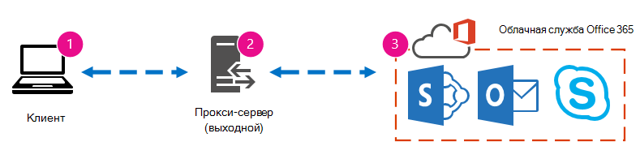

# Настройка производительности Office 365 с помощью базовых показателей и истории производительностиOffice 365 performance tuning using baselines and performance history

Существует несколько простых способов проверить производительность подключения между Office 365 и предприятием, которое позволит вам создать грубую базовую линию подключения.There are some simple ways to check the connection performance between Office 365 and your business that will let you establish a rough baseline of your connectivity. Сведения о том, как вести журнал производительности клиентских компьютеров, поможет обнаружить возникающие проблемы на ранних этапах, выявить и предсказать проблемы.Knowing the performance history of your client computer connections can help you detect emerging issues early, identify, and predict problems.
  
Если вы не используете проблемы с производительностью, эта статья поможет вам определить некоторые распространенные вопросы, например, как вы узнаете, что проблема связана с производительностью, а не инцидентом службы Office 365?If you're not used to working on performance issues, this article is designed to help you consider some common questions, like How do you know the problem you're seeing is a performance issue and not an Office 365 service incident? Как вы можете спланировать хорошую производительность, долгосрочный срок?How can you plan for good performance, long term? Как можно следить за производительностью?How can you keep an eye on performance? Если у вашей команды или клиентов низкая производительность при использовании Office 365, а вы хотите узнать о них, читайте здесь.If your team or clients are seeing slow performance while using Office 365, and you wonder about any of these questions, read on.
  
> [!IMPORTANT]
> **У вашего клиента и Office 365 прямо сейчас возникла ошибка производительности?****Have a performance issue between your client and Office 365 right now?** Выполните действия, описанные в статье [план устранения неполадок с производительностью для Office 365](performance-troubleshooting-plan.md).Follow the steps outlined in the [Performance troubleshooting plan for Office 365](performance-troubleshooting-plan.md). 
    
## Что нужно знать о производительности Office 365Something you should know about Office 365 performance

Office 365 входит в состав выделенной сети Microsoft, которая постоянно отслеживается не только с помощью автоматизации, но и от реальных людей.Office 365 lives inside a high-capacity, dedicated Microsoft network that is steadily monitored not just by automation, but by real people. Частью роли обслуживания облака Office 365 является настройка производительности и упрощение их там, где это возможно.Part of the role of maintaining the Office 365 cloud is building-in performance tuning and streamlining where it's possible. Так как клиенты в облаке Office 365 должны подключаться через Интернет, существуют непрерывные усилия для точной настройки производительности в службах Office 365.Since clients of the Office 365 cloud have to connect across the Internet, there is a continuous effort to fine-tune the performance across Office 365 services too. Улучшения производительности никогда не останавливаются в облаке, и существует большой объем накопленного опыта, позволяющий обеспечить работоспособность и быструю работу облака.Performance improvements never really stop in the cloud, and there is a lot of accumulated experience with keeping the cloud healthy and quick. Если у вас возникла ошибка, связанная с производительностью, подключаясь к Office 365, лучше всего не начинать с него и ждать обращения в службу поддержки.Should you experience a performance issue connecting from your location to Office 365, it's best not to start with, and wait on, a Support case. Вместо этого следует начать исследование проблемы с "во внутренней сети".Instead, you should begin investigating the problem from 'the inside out'. То есть, начать в сети и эффективно работать в Office 365.That is, start inside of your network, and work your way out to Office 365. Прежде чем открыть дело с поддержкой Office 365, можно собрать данные и выполнить действия, которые позволят исследовать и устранять неполадку.Before you open a case with Office 365 Support, you can gather data and take actions that will explore, and may resolve, your problem.
  
> [!IMPORTANT]
> Помните о планировании и ограничении емкости в Office 365.Be aware of capacity planning and limits in Office 365. Эти сведения помещают перед собой кривую при устранении проблем с производительностью.That information will put you ahead of the curve when trying to resolve a performance issue. Ниже приведена ссылка на [Описание служб microsoft 365 и Office 365](https://docs.microsoft.com/office365/servicedescriptions/office-365-service-descriptions-technet-library).Here's a link to the [Microsoft 365 and Office 365 service descriptions](https://docs.microsoft.com/office365/servicedescriptions/office-365-service-descriptions-technet-library). Это центральный центр, и все службы, предлагаемые Office 365, имеют ссылку на свои описания в службах.This is a central hub, and all the services offered by Office 365 have a link that goes to their own Service Descriptions from here. Это означает, что при необходимости увидеть стандартные пределы для SharePoint Online, например, следует щелкнуть [Описание службы SharePoint Online](https://technet.microsoft.com/library/sharepoint-online-service-description.aspx) и найти соответствующий [раздел SharePoint Online Limits](https://go.microsoft.com/fwlink/p/?LinkID=856113).That means, should you need to see the standard limits for SharePoint Online, for example, you would click [SharePoint Online Service Description](https://technet.microsoft.com/library/sharepoint-online-service-description.aspx) and locate its [SharePoint Online Limits section](https://go.microsoft.com/fwlink/p/?LinkID=856113). 
  
Убедитесь, что вы перейдете к устранению неполадок с учетом того, что производительность является скользящим масштабом, но это не повлечет за собой неоптимальное значение и его поддержание без возможности восстановления (если вы считаете, что это так, то иногда задачи с большим количеством пропускной способности, такие как встроенное количество пользователей, или выполнение больших миграций данных будут сильно затруднитьMake sure you go into your troubleshooting with the understanding that performance is a sliding scale, it's not about achieving an idealized value and maintaining it permanently (if you believe this is so, then occasional high-bandwidth tasks like on-boarding a large number of users, or doing large data migrations will be very stressful -- so do plan for performance impacts then). Кроме того, вы можете иметь грубое представление целевых показателей производительности, но большое количество переменных играют производительность, поэтому производительность варьируется.You can, and should, have a rough idea of your performance targets, but a lot of variables play into performance, therefore, performance varies. Это характер производительности.That's the nature of performance. 
  
Устранение неполадок с производительностью не относится к конкретным целям собраний и не сохраняет эти номера в течение неопределенного периода, это сведения об улучшении существующих действий с учетом всех переменных.Performance troubleshooting isn't about meeting specific goals and maintaining those numbers indefinitely, it's about improving existing activities, given all the variables. 
  
## Что же такое проблема с производительностью?Okay, what does a performance problem look like?

Для начала необходимо убедиться, что вы столкнулись с проблемой производительности, а не инцидентом службы.First, you need to make sure that what you are experiencing is indeed a performance issue and not a service incident. Проблема с производительностью отличается от инцидента службы в Office 365.A performance problem is different from a service incident in Office 365. Вот как их отличить.Here's how to tell them apart.
  
Если у службы Office 365 возникли проблемы, это инцидент службы.If the Office 365 service is having issues, that's a service incident. В разделе **Текущая работоспособность** центра администрирования Microsoft 365 вы увидите значки красного или желтого цвета, Кроме того, вы можете заметить снижение производительности на клиентских компьютерах, подключающихся к Office 365.You will see red or yellow icons under **Current health** in the Microsoft 365 admin center, you may also notice slow performance on client computers connecting to Office 365. Например, если отчет о работоспособности выводится красным значком и **вы видите около** Exchange, вы также можете получить ряд вызовов от людей в вашей организации, которые занимаются неправильными почтовыми ящиками клиентов, использующих Exchange Online.For example, if Current health reports a red icon and you see **Investigating** beside Exchange, you might then also receive a bunch of calls from people in your organization who complain that client mailboxes that use Exchange Online are performing badly. В этом случае разумно предположить, что производительность Exchange Online сразу же стала жертвой проблем в службе.In that case, it's reasonable to assume that your Exchange Online performance just became a victim of issues within the Service. 
  

  
На этом шаге администратор Office 365 должен проверить **текущую работоспособность** , а затем **Просмотреть сведения и журнал**, как правило, чтобы последние даты обслуживания системы.At this point, you, the Office 365 admin, should check **Current health** and then **View details and history**, frequently, to keep up to date on maintenance we perform on the system. Текущая панель мониторинга **работоспособности** была обновлена при изменении и проблемах в службе.The **Current health** dashboard was made to update you about changes to, and problems in, the service. Примечания и объяснения, записанные в журнал работоспособности, администратор для администраторов, помогут вам оценить влияние и сохранить текущую работу.The notes and explanations written to health history, admin to admin, are there to help you gauge your impact, and to keep you posted about ongoing work. 
  

  
Проблемы с производительностью не являются инцидентом службы, несмотря на то, что происшествия могут привести к снижению производительности.A performance issue isn't a service incident, even though incidents can cause slow performance. Проблема с производительностью выглядит следующим образом:A performance issue looks like this:
  
- Проблема с производительностью возникает независимо от того, какие сведения о **работоспособности** в центре администрирования поддаются отчетности для службы.A performance issue occurs no matter what the admin center **Current health** is reporting for the service. 
    
-  Поведение, которое было бы относительно прозрачным, занимает много времени и не завершается.A behavior that used to be relatively seamless takes a long time to complete or never completes. 
    
- Вы также можете реплицировать проблему, или, по крайней мере, вы знаете, что это произойдет, если выполнить нужную последовательность действий.You can replicate the problem too, or, at least, you know it will happen if you do the right series of steps.
    
-  Если проблема повторяется, по-прежнему существует шаблон, например, если вы знаете, что у вас 10:00 вызовов от пользователей, которые не могут надежно получить доступ к Office 365, и что вызов будет нарушен по полудню.If the problem is intermittent, there is still a pattern, for example, you know that by 10:00 AM you will have calls from users who can't reliably access Office 365, and that the calls will die down around noon. 
    
Возможно, это звучит знакомо; может быть знакомо.This probably sounds familiar; maybe too familiar. Когда вы узнаете, что проблема связана с производительностью, вопрос будет таким: "что делать дальше?"Once you know it's a performance problem, the question becomes, "What do you do next?" В оставшейся части этой статьи вы захотите точно определить, что.The rest of this article helps you determine exactly that.
  
## Определение и тестирование проблемы с производительностьюHow to define and test the performance problem

Проблемы с производительностью часто возникают с течением времени, поэтому может быть непросто определить фактическую проблему.Performance issues often emerge over time, so it can be challenging to define the actual problem. Вам необходимо создать хороший отчет о проблеме и получить хорошую идею контекста проблемы, а затем для этого необходимо выполнить повторяемые этапы тестирования.You need to create a good problem statement and a good idea of issue context, and then you need to repeatable testing steps to win the day. В противном случае вы можете потерять ошибку.Otherwise, through no fault of your own, you may be lost. Почему?Why? Вот несколько примеров проблем с операторами, которые не предоставляют достаточно сведений:Well, here are some examples of problems statements that don't provide enough information:
  
- Переключиться из папки "Входящие" в календарь на что-то не заметить, а теперь это "кофе".Switching from my Inbox to my Calendar used to be something I didn't notice, and now it's a coffee-break. Вы можете сделать так, чтобы он действовал?Can you make it act like it used to?
    
- Отгрузка моих файлов в SharePoint Online идет очень долго.Uploading my files to SharePoint Online is taking forever. Почему он работает медленнее, но любое другое время это быстро?Why is it slow in the afternoon, but any other time, it's fast? Не может работать достаточно быстро?Can't it just be fast?
    
Существует несколько больших проблем, которые приводят к возникновению проблемных операторов выше.There are several large challenges posed by the problem statements above. В частности, существует множество неоднозначностей, с которыми можно справиться.Specifically, there are a lot of ambiguities to deal with. Пример:for example:
  
- Неясно, как переключение между папкой "Входящие" и "Календарь", используемыми для работы на ноутбуке.It's unclear how switching between Inbox and Calendar used to act on the laptop.
    
- Когда пользователь говорит: "не удается просто", "высокая"?When the user says, "Can't it just be fast", what's "fast"?
    
- Какова продолжительность "бессрочно"?How long is "forever"? Это может занять несколько секунд или минут, а пользователь может закончиться через десять минут после того, как пользователь возвратит запрос?Is that several seconds, or minutes, or could the user go to lunch and it would finish up ten minutes after the user got back?
    
Все это не учитывается, что администратор и средство устранения неполадок не могут знать многие сведения о подобных операторах, подобные этим.All of this is without considering that the admin and troubleshooter can't be aware of many details from problem statements like these. Например, при возникновении проблемы. Пользователь работает из дома и в домашней сети видит только медленное переключение. Пользователь должен запустить несколько других приложений, интенсивно использующих ОЗУ, на локальном клиенте или запустить более раннюю версию операционной системы или не запускать последние обновления.For example, when the problem started happening; That the user works from home and only ever sees slow switching while on a home network; That the user must run several other RAM intensive applications on the local client, or the user is running an older operating system or hasn't run recent updates.
  
Если пользователи сообщают о проблеме с производительностью, сбор данных осуществляется очень подробно.When users report a performance problem, there's a lot of information to collect. Сбор этих сведений является частью процесса, который называется областью выпуска или исследованием.Collecting this information is part of a process called scoping the issue, or investigating it. Ниже приведен список основных областей, которые можно использовать для сбора сведений о проблемах с производительностью.The following is a basic scoping list you can use to collect information about your performance issue. Этот список не является исчерпывающим, но существует место для самостоятельного запуска.This list is not exhaustive, but it's a place to start one of your own: 
  
- В какой дате возникла ошибка, и вокруг какого времени суток или ночью?On what date did the issue happen, and around what time of day or night?
    
- Какой тип клиентского компьютера использовался и как он подключается к бизнес-сети (VPN, проводная связь, беспроводная связь)?What kind of client computer were you using, and how does it connect to the business network (VPN, Wired, Wireless)?
    
- Вы работали удаленно или в офисе?Were you working remotely or were you in the office?
    
- Вы попробуете выполнить те же действия на другом компьютере и видите такое же поведение?Did you try the same actions on another computer and see the same behavior?
    
- Пошаговые инструкции по предоставлению проблем, чтобы можно было записать действия, которые вы перейдете.Walk through the steps that are giving you the trouble so that you can write the actions you take down.
    
- Скорость работы в секундах или минутахHow slow in seconds or minutes is the performance?
    
- Где вы находитесь в мире?Where in the world are you located?
    
Некоторые из этих вопросов являются более очевидными, чем другие.Some of these questions are more obvious than others. Большинство пользователей понимают, что средство устранения неполадок требует точных действий для воспроизведения проблемы.Most everyone will understand a troubleshooter needs the exact steps to reproduce the issue. В конце концов, как вы зарегистрируете неисправность и как еще можно будет проверить, устранена ли проблема?After all, how else can you record what's wrong, and how else can you test if the issue is fixed? Менее очевидны вещи, такие как "какая дата и время возникли?" и "где вы находитесь в мире?", сведения, которые можно использовать совместно.Less obvious are things like "What date and time did you see the issue?", and "Where in the world are you located?", information that can be used in tandem. В зависимости от того, когда пользователь работал, в некоторых часах разницы времени может означаться, что обслуживание уже выполняется в частях сети компании.Depending on when the user was working, a few hours of time difference may mean maintenance is already underway on parts of your company's network. Если, например, в вашей компании есть Гибридная реализация, например гибридный Поиск SharePoint, который может запрашивать индексы поиска в SharePoint Online и локальном экземпляре SharePoint Server 2013, обновления могут выполняться в локальной ферме.If, for example, your company has a hybrid implementation, like a hybrid SharePoint Search, which can query search indexes in both SharePoint Online and an On-premises SharePoint Server 2013 instance, updates may be underway in the on-premises farm. Если ваша организация работает в облаке, Обслуживание системы может включать в себя добавление или удаление сетевого оборудования, развертывание обновлений, предназначенных для всей компании, а также внесение изменений в DNS или другие основные инфраструктуры.If your company is all in the cloud, system maintenance may include adding or removing network hardware, rolling out updates that are company-wide, or making changes to DNS, or other core infrastructure.
  
При устранении проблем с производительностью, как и в случае с помощью преступления, необходимо быть точным и наблюдаемым образом отображать все выводы из свидетельства.When you're troubleshooting a performance problem, it's a bit like a crime scene, you need to be precise and observant to draw any conclusions from the evidence. Для этого необходимо получить хороший отчет о проблеме, выполнив сбор доказательств.In order to do this, you must get a good problem statement by gathering evidence. Он должен включать в себя контекст компьютера, контекст пользователя, при возникновении проблемы, а также точные действия, которые покрывают проблему с производительностью.It should include the computer's context, the user's context, when the problem began, and the exact steps that exposed the performance issue. Этот оператор задачи должен быть и оставаться самым верхней страницей в заметках.This problem statement should be, and stay, the topmost page in your notes. После того, как вы перейдете к решению проблемы, пошаговым руководством, вы протестируете и подтверждаете, были ли выполненные действия решают проблему.By walking through the problem statement again after you work on the resolution, you are taking the steps to test and prove whether the actions you take have resolved the issue. Это важно для того, чтобы знать, когда ваша работа выполнена.This is critical to knowing when your work, there, is done.
  
## Знаете ли вы, как производительность будет выглядеть, когда она хорошая?Do you know how performance used to look when it was good?

Если у вас есть несчастливые, никто не знает.If you're unlucky, nobody knows. Никто не имел цифр.Nobody had numbers. Это означает, что никто не может ответить на простой вопрос "сведения о том, сколько секунд использовалось для получения папки" Входящие "в Office 365?", или "как долго использовалось время, когда руководитель приводился к собранию Lync Online?", который является распространенным сценарием для многих компаний.That means nobody can answer the simple question "About how many seconds did it used to take to bring up an Inbox in Office 365?", or "How long did it used to take when the Executives had a Lync Online meeting?", which is a common scenario for many companies.
  
Здесь нет базовых показателей производительности.What's missing here is a performance baseline.
  
Базовые показатели дают вам контекст производительности.Baselines give you a context for your performance. В зависимости от потребностей компании необходимо иногда использовать базовую линию.You should take a baseline occasionally to frequently, depending on the needs of your company. Если вы занимаетесь крупной компанией, Группа операций может использовать базовые уровни для локальной среды.If you are a larger company, your Operations team may take baselines for your on-premises environment already. Например, если вы исправляете все серверы Exchange Server в первый понедельник месяца и все серверы SharePoint в третьем понедельник, Группа операций, скорее всего, будет иметь список задач и сценариев, которые он выполняет после исправления, чтобы доказать, что критически важные функции работают.For example, if you patch all the Exchange servers on the first Monday of the month, and all your SharePoint servers on the third Monday, your Operations team probably has a list of tasks and scenarios it runs post-patching, to prove that critical functions are operational. Например, откройте папку "Входящие", нажмите кнопку Отправить/получить и убедитесь, что папки обновлены, или в SharePoint перейдите на главную страницу сайта, перейдите на страницу Поиск в корпоративной среде и выполните поиск, возвращающий результаты.For example, opening the Inbox, clicking Send/Receive, and making sure the folders update, or, in SharePoint, browsing the main page of the site, going into the enterprise Search page, and doing a search that returns results.
  
Если ваши приложения находятся в Office 365, то некоторые основные базовые показатели можно оценить в течение времени (в миллисекундах) с клиентского компьютера внутри вашей сети, до точки выхода или в точке выхода из сети и переходе на Office 365.If your applications are in Office 365, some of the most fundamental baselines you can take measure the time (in milliseconds) from a client computer inside your network, to an egress point, or the point where you leave your network and go out to Office 365. Ниже приведены некоторые полезные базовые показатели, которые можно исследовать и записывать.Here are some helpful baselines that you can investigate and record:
  
- Определите устройства между клиентским компьютером и точкой выхода, например прокси-сервер.Identify the devices between your client computer and your egress point, for example, your proxy server.
    
  - Вам необходимо знать устройства, чтобы иметь контекст (IP-адреса, тип устройства, et Цетера) для проблем с производительностью.You need to know your devices so that you have context (IP addresses, type of device, et cetera) for performance problems that arise.
    
  - Прокси-серверы — это распространенные точки выхода, поэтому вы можете проверить веб-браузер, чтобы узнать, какой прокси-сервер он использует (если он указан).Proxy servers are common egress points, so you can check your web browser to see what proxy server it is set to use, if any.
    
  - Существуют сторонние инструменты, которые могут обнаруживать и сопоставлять сеть, но самый безопасный способ узнать ваше устройство — попросить участника группы сети.There are third party tools that can discover and map your network, but the safest way to know your devices is to ask a member of your network team.
    
- Определите поставщика услуг Интернета, запишите сведения о контактах и Узнайте, сколько каналов пропускной способности.Identify your Internet service provider (ISP), write down their contact information, and ask how many circuits how much bandwidth you have.
    
- В вашей организации определите ресурсы для устройств между клиентом и точкой выхода, или определите контакт для экстренного реагирования, который будет обсуждать проблемы с сетью.Inside your company, identify resources for the devices between your client and the egress point, or identify an emergency contact to talk to about networking issues.
    
Ниже приведены некоторые базовые показатели, которые могут быть рассчитаны с помощью средств простого тестирования с помощью средств.Here are some baselines that simple testing with tools can calculate for you:
  
- Время с клиентского компьютера до точки выхода в миллисекундахTime from your client computer to your egress point in milliseconds
    
- Время с момента выхода на Office 365 (в миллисекундах)Time from your egress point to Office 365 in milliseconds
    
- Расположение в мире сервера, которое разрешает URL-адреса для Office 365 при просмотреLocation in the world of the server that resolves the URLS for Office 365 when you browse
    
- Скорость разрешения DNS поставщика услуг Интернета (в миллисекундах), несогласованности при поступлении пакетов (колебание сети), время отправки и загрузки в миллисекундах.The speed of your ISP's DNS resolution in milliseconds, inconsistencies in packet arrival (network jitter), upload and download times in milliseconds
    
Если вы не знакомы с выполнением этих действий, мы рассмотрим более подробные сведения в этой статье.If you're unfamiliar with how to carry out these steps, we'll go into more detail in this article. 
  
## Что такое базовый план?What is a baseline?

Вы узнаете, что в случае неисправности вы узнаете, но если вы не знаете исторических данных о производительности, невозможно создать контекст для того, насколько плохо он стал, и когда.You'll know the impact when it goes bad, but if you don't know your historical performance data, it's not possible to have a context for how bad it may have become, and when. Таким образом, без базового плана вы не можете понять, как решить головоломку: изображение в поле головоломки.So without a baseline, you're missing the key clue to solve the puzzle: the picture on the puzzle box. При устранении неполадок с производительностью необходима точка  *сравнения*  .In performance troubleshooting, you need a point of  *comparison*  . Простые базовые показатели производительности не трудно выполнить.Simple performance baselines aren't difficult to take. В соответствии с расписанием Группа операций может выполнить эти задачи.Your Operations team can be tasked with carrying these out on a schedule. Например, предположим, что ваше подключение выглядит следующим образом:For example, let's say your connection looks like this: 
  

  
Это означает, что вы проверили свою команду сети и обнаружили, что ваша компания покидает Интернет через прокси-сервер, и этот прокси-сервер обрабатывает все запросы, которые клиентский компьютер отправляет в облако.That means you've checked with your network team and found out that you leave your company for the Internet through a proxy server, and that proxy handles all the requests your client computer sends to the cloud. В этом случае необходимо создать упрощенную версию подключения, в которой перечисляются все промежуточные устройства.In this case, you should draw a simplified version of your connection that lists all the intervening devices. Теперь вставьте инструменты, которые можно использовать для проверки производительности клиента, точки выхода (в которой вы покидаете сеть в Интернете) и облака Office 365.Now, insert tools that you can use to test the performance between the client, the egress point (where you leave your network for the Internet), and the Office 365 cloud.
  

  
Эти параметры перечислены как **простые** и **Расширенные** возможности, необходимые для поиска данных о производительности.The options are listed as **Simple** and **Advanced** because of the amount of expertise you need in order to find the performance data. Трассировка сети может занять много времени, по сравнению с запущенными средствами командной строки, такими как PsPing и TraceTCP.A network trace will take a lot of time, compared to running command-line tools like PsPing and TraceTCP. Эти два средства командной строки были выбраны, так как они не используют пакеты ICMP, которые будут заблокированы в Office 365, так как они дают время в миллисекундах, необходимое для выхода клиентского компьютера или прокси-сервера (если у вас есть доступ) и поступления в Office 365.These two command-line tools were chosen because they don't use ICMP packets, which will be blocked by Office 365, and because they give the time in milliseconds that it takes to leave the client computer, or proxy server (if you have access) and arrive at Office 365. Все индивидуальные переходы с одного компьютера на другой будут иметь значение времени, что отлично для базовых планов!Each individual hop from one computer to another will end up with a time value, and that's great for baselines! Как важно, эти средства командной строки позволяют добавить номер порта в команду, так как Office 365 обменивается данными через порт 443, который является портом, используемым протоколами Secure Sockets Layer и TLS и TLS.Just as importantly, these command-line tools allow you to add a port number onto the command, this is useful because Office 365 communicates over port 443, which is the port used by Secure Sockets Layer and Transport Layer Security (SSL and TLS). Тем не менее, другие сторонние инструменты могут оказаться более эффективными решениями в вашей ситуации.However, other third-party tools may be better solutions for your situation. Корпорация Майкрософт не поддерживает все эти средства, поэтому если по какой – то причине не удается получить PsPing и TraceTCP, переходите к сетевой трассировке с помощью средства, такого как Netmon.Microsoft doesn't support all of these tools, so if, for some reason, you can't get PsPing and TraceTCP working, move on to a network trace with a tool like Netmon. 
  
Вы можете выполнить базовый план до рабочих часов, а затем снова использовать его, а затем снова через несколько часов.You can take a baseline before business hours, again during heavy use, and then again after hours. Это означает, что у вас может быть структура папок, которая выглядит так же, как в конце:This means you may have a folder structure that looks a bit like this in the end:
  

  
Кроме того, следует выбрать соглашение об именовании файлов.You should also pick a naming convention your files. Ниже приводятся примеры:Here are some examples:
  
- Feb_09_2015_9amPST_PerfBaseline_Netmon_ClientToEgress_NormalFeb_09_2015_9amPST_PerfBaseline_Netmon_ClientToEgress_Normal
    
- Jan_10_2015_3pmCST_PerfBaseline_PsPing_ClientToO365_bypassProxy_SLOWJan_10_2015_3pmCST_PerfBaseline_PsPing_ClientToO365_bypassProxy_SLOW
    
- Feb_08_2015_2pmEST_PerfBaseline_BADPerfFeb_08_2015_2pmEST_PerfBaseline_BADPerf
    
- Feb_08_2015_8 30amEST_PerfBaseline_GoodPerfFeb_08_2015_8-30amEST_PerfBaseline_GoodPerf
    
Это можно сделать множеством разных способов, но **\<dateTime\>\<what's happening in the test\>** для начала рекомендуется использовать формат.There are lots of different ways to do this, but using the format **\<dateTime\>\<what's happening in the test\>** is a good place to start. Это поможет вам при устранении неполадок, которые могут быть продолжены позже.Being diligent about this will help a lot when you are trying to troubleshoot issues later. Позже вы сможете сказать: "я занял две трассировки 8 февраля, одна продемонстрировала хорошую производительность, и одна из них неисправна, поэтому мы можем сравнить их".Later, you'll be able to say "I took two traces on February 8th, one showed good performance and one showed bad, so we can compare them". Это чрезвычайно полезно для устранения неполадок.This is extremely helpful for troubleshooting. 
  
Необходимо иметь упорядоченный способ хранения исторических базовых показателей.You need to have an organized way to keep your historical baselines. В этом примере простые методы выдали три выходных выхода командной строки, а результаты были собраны как снимки экрана, но вместо этого могут быть файлы записи сети.In this example, the simple methods produced three command line outputs and the results were collected as screen shots, but you may have network capture files instead. Используйте метод, который лучше всего подходит для вас.Use the method that works best for you. Храните свои исторические базовые показатели и ссылаются на них в тех случаях, когда вы заметили изменения в работе веб-служб.Store your historical baselines and refer to them at points where you notice changes in the behavior of online services. 
  
## Зачем собирать данные о производительности во время пилотного проекта?Why collect performance data during a pilot?

Не рекомендуется начинать выполнение базовых планов, чем во время пилотного развертывания службы Office 365.There is no better time to start making baselines than during a pilot of the Office 365 service. У вашего офиса могут быть тысячи пользователей, сотни тысяч или пять, но даже небольшое количество пользователей, можно выполнять тесты для измерения колебаний производительности.Your office may have thousands of users, hundreds of thousands, or it may have five, but even with a small number of users, you can perform tests to measure fluctuations in performance. В случае крупной компании репрезентативный пример нескольких сотен пользователей, пилотный пилотный проект Office 365, может быть проецирован на несколько тысяч, чтобы узнать, где могут возникнуть проблемы до их появления.In the case of a large company, a representative sample of several hundred users piloting Office 365 can be projected outward to several thousands so you know where issues might arise before they happen.
  
В случае с небольшой компанией, где при включенной серверной плате все пользователи отправляются в службу одновременно, и нет пилотного проекта, для отображения данных, которые могут поступать в устранении неполадок, связанных с недостаточной производительностью.In the case of a small company, where on-boarding means that all users go to the service at the same time and there is no pilot, keep performance measures so that you have data to show to anyone who may have to troubleshoot a badly performing operation. Например, если вы заметили, что все внезапно вы можете проанализировать ваше построение в течение времени, которое занимается отправкой изображения среднего размера, в котором она выполнялась очень быстро.For example, if you notice that all of a sudden you can walk around your building in the time it takes to upload a medium-sized graphic where it used to happen very quickly.
  
## Сбор базовых плановHow to collect baselines

Для всех планов устранения неполадок необходимо как минимум:For all troubleshooting plans you need to identify these things at a minimum:
  
- Клиентский компьютер, который вы используете (тип компьютера или устройства, IP-адрес и действия, вызвавшие эту неполадку).The client computer you're using (the type of computer or device, an IP address, and the actions that caused the issue)
    
- Место, где клиентский компьютер находится в мире (например, является ли этот пользователь VPN-подключением для сети, работает удаленно или в интрасети компании)Where the client computer is located in the world (for example, whether this user on a VPN to the network, working remotely, or on the company intranet)
    
- Точка выхода клиентский компьютер использует сеть из сети (точка, в которой трафик покидает ваш бизнес для ISP или Интернет)The egress point the client computer uses from your network (the point at which traffic leaves your business for an ISP or the Internet)
    
 Вы можете узнать макет сети у администратора сети.You can find out the layout of your network from the network administrator. Если вы находитесь в небольшой сети, Взгляните на устройства, подключающиеся к Интернету, и позвоните своему поставщику услуг Интернета, если у вас возникнут вопросы о макете.If you're on a small network, take a look at the devices connecting you to the Internet, and call your ISP if you have questions about the layout. Создайте график готовой структуры для ссылки.Create a graphic of the final layout for your reference. 
  
Этот раздел разбивается на простые средства командной строки и методы, а расширенные параметры инструментов.This section is broken into simple command-line tools and methods, and more advanced tools options. Сначала мы рассмотрим простые методы.We'll cover simple methods first. Но если у вас проблема с производительностью, следует перейти к дополнительным методам и испытать пример плана действий по устранению неполадок с производительностью.But if you've got a performance problem right now, you should jump to advanced methods and try out the sample performance-troubleshooting action plan.
  
### Простые методыSimple methods

Цель этих простых методов состоит в том, чтобы изучать, разбирать и правильно хранить простые базовые показатели производительности с течением времени, чтобы получать сведения о производительности Office 365.The objective of these simple methods is to learn to take, understand, and properly store simple performance baselines over time so that you are informed about Office 365 performance. Вот простая схема для простой, как показано выше:Here's the very simple diagram for simple, as you've seen before:
  

  
> [!NOTE]
> TraceTCP включается в этот снимок экрана, так как это удобно для отображения, в миллисекундах, продолжительности обработки запроса и количества прыжков сети или подключений от одного компьютера к другому, что делает запрос для достижения целевого значения.TraceTCP is included in this screen shot because it's a useful tool for showing, in milliseconds, how long a request takes to process, and how many network hops, or connections from one computer to the next, that the request takes to reach a destination. TraceTCP также может предоставлять имена серверов, используемых при переходах, что может быть полезен в средстве устранения неполадок Microsoft Office 365 в службе поддержки.TraceTCP can also give the names of servers used during hops, which can be useful to a Microsoft Office 365 troubleshooter in Support. > команды TraceTCP могут быть очень простыми, например: >  `tracetcp.exe outlook.office365.com:443`> не забудьте включить номер порта в команду!> TraceTCP commands can be very simple, such as: >  `tracetcp.exe outlook.office365.com:443`> Remember to include the port number in the command! > [TraceTCP](https://simulatedsimian.github.io/tracetcp_download.html) — это бесплатная загрузка, но она основана на винкап. > [TraceTCP](https://simulatedsimian.github.io/tracetcp_download.html) is a free download, but relies on Wincap. Винкап — это средство, которое также используется и устанавливается в Netmon.Wincap is a tool that is also used and installed by Netmon. Кроме того, в разделе Дополнительные методы используется Netmon.We also use Netmon in the advanced methods section. 
  
 Если у вас несколько офисов, необходимо также хранить набор данных клиента в каждом расположении.If you have multiple offices, you'll need to keep a set of data from a client in each of those locations as well. Эта проверка измеряет задержку, в которой, в данном случае, является числовое значение, которое описывает время между клиентом, отправляющим запрос, на Office 365, а Office 365 отвечает на запрос.This test measures latency, which, in this case, is a number value that describes the amount of time between a client sending a request to Office 365, and Office 365 responding to the request. Тестирование исходит от домена на клиентском компьютере и выполняет поиск в измерении кругового пути в сети, исходящих через точку исходящего трафика, через Интернет в Office 365 и обратно.The testing originates inside your domain on a client computer, and looks to measure a round trip from inside your network, out through an egress point, across the Internet to Office 365, and back. 
  
Существует несколько способов работы с точкой выхода (в данном случае — прокси-сервер).There are a few ways to deal with the egress point, in this case, the proxy server. Можно выполнить трассировку от 1 до 2, а затем 2 – 3, а затем добавить числа в миллисекундах, чтобы получить итоговые итоги по краю сети.You can either trace from 1 to 2 and then 2 to 3, and then add the numbers in milliseconds to get a final total to the edge of your network. Вы также можете настроить подключение так, чтобы оно обходило адреса прокси-сервера для Office 365.Or, you can configure the connection to bypass the proxy for Office 365 addresses. В более крупной сети с брандмауэром, обратным прокси-сервером или некоторыми их сочетаниями может потребоваться сделать исключения на прокси-сервере, что позволит передавать трафик по большому URL-адресу.In a larger network with a firewall, reverse proxy, or some combination of the two, you may need to make exceptions on the proxy server that will allow traffic to pass for a lot of URLs. Список конечных точек, используемых в Office 365, представлен в статье [URL-адреса и диапазоны IP-адресов office 365](https://support.office.com/article/8548a211-3fe7-47cb-abb1-355ea5aa88a2).For the list of endpoints used by Office 365, see [Office 365 URLs and IP address ranges](https://support.office.com/article/8548a211-3fe7-47cb-abb1-355ea5aa88a2). Если у вас есть прокси-сервер с проверкой подлинности, начните проверку исключений для следующих компонентов:If you have an authenticating proxy, begin by testing exceptions for the following:
  
- Порты 80 и 443Ports 80 and 443
    
- TCP и HTTPsTCP and HTTPs
    
- Подключения, исходящие через один из этих URL-адресов:Connections that are outbound to any of these URLs:
    
- \*. microsoftonline.com\*.microsoftonline.com
    
- \*. microsoftonline-p.com\*.microsoftonline-p.com
    
- \*.sharepoint.com\*.sharepoint.com
    
- \*. outlook.com\*.outlook.com
    
- \*. lync.com\*.lync.com
    
- osub.microsoft.comosub.microsoft.com
    
Всем пользователям необходимо разрешить пользователям получать доступ к этим адресам без помех или помех прокси-серверов.All users need to be allowed to get to these addresses without any proxy interference or authentication. В сети меньшего размера их необходимо добавить в список обхода прокси-серверов в веб-браузере.On a smaller network, you should add these to your proxy bypass list in your web browser. 
  
Чтобы добавить их в список обхода прокси-серверов в Internet Explorer, откройте **меню Сервис** \> **Свойства** \> **подключения** \> **LAN параметры** подключения \> **Advanced**.To add these to your proxy bypass list in Internet Explorer, go to **Tools** \> **Internet Options** \> **Connections** \> **LAN settings** \> **Advanced**. Кроме того, на вкладке Дополнительно можно найти порт прокси-сервера и прокси-сервера.The advanced tab is also where you will find your proxy server and proxy server port. Возможно, вам потребуется установить флажок **использовать прокси-сервер для локальной сети**, чтобы получить доступ к кнопке **Advanced** .You may need to click the checkbox **Use a proxy server for your LAN**, to access the **Advanced** button. Необходимо убедиться, что флажок **обход прокси-сервера для локальных адресов** установлен.You'll want to make sure that **Bypass proxy server for local addresses** is checked. После нажатия кнопки **Дополнительно**отображается текстовое поле, в котором можно ввести исключения.Once you click **Advanced**, you'll see a text box where you can enter exceptions. Разделяйте приведенные выше URL-адреса с точками с запятой, например:Separate the wildcard URLs listed above with semi-colons, for example:
  
\*. microsoftonline.com; \*. SharePoint.com\*.microsoftonline.com; \*.sharepoint.com
  
После обхода прокси-сервера вы сможете использовать команду ping или PsPing непосредственно в URL-адресе Office 365.Once you bypass your proxy, you should be able to use ping or PsPing directly on an Office 365 URL. Следующий шаг будет тестировать ping **Outlook.Office365.com**.The next step will be to test ping **outlook.office365.com**. Кроме того, если вы используете PsPing или другое средство, которое позволит указать номер порта для команды, PsPing от **Portal.microsoftonline.com:443** , чтобы увидеть среднее время кругового пути в миллисекундах.Or, if you're using PsPing or another tool that will let you supply a port number to the command, PsPing against **portal.microsoftonline.com:443** to see the average round trip time in milliseconds. 
  
Время кругового пути (или RTT) — это числовое значение, которое измеряет продолжительность отправки HTTP-запроса на сервер, например outlook.office365.com, и получения ответа, который подтверждает, что он знает сервер.The round trip time, or RTT, is a number value that measures how long it takes to send a HTTP request to a server like outlook.office365.com and get a response back that acknowledges the server knows that you did it. Это сокращение иногда отображается как RTT.You'll sometimes see this abbreviated as RTT. Это должен быть относительно короткий период времени.This should be a relatively short amount of time.
  
Для выполнения этой проверки необходимо использовать [PSPing](https://technet.microsoft.com/sysinternals/jj729731.aspx) или другое средство, которое не использует пакеты ICMP, заблокированные в Office 365.You have to use [PSPing](https://technet.microsoft.com/sysinternals/jj729731.aspx) or another tool that does not use ICMP packets which are blocked by Office 365 in order to do this test. 
  
 **Как использовать PsPing для получения общего времени кругового пути в миллисекундах непосредственно с URL-адреса Office 365****How to use PsPing to get an overall round trip time in milliseconds directly from an Office 365 URL**
  
1. Запустите командную строку с повышенными привилегиями, выполнив указанные ниже действия.Run an elevated command prompt by completing these steps:
    
1. Нажмите кнопку **Начало**.Click **Start**.
    
2. В поле **начать поиск** введите cmd, а затем нажмите клавиши CTRL + SHIFT + ВВОД.In the **Start Search** box, type cmd, and then press CTRL+SHIFT+ENTER.
    
3. Если появится диалоговое окно **Управление учетной записью пользователя**, убедитесь, что действие, указанное в окне, совпадает с тем, которое вы хотите выполнить, и нажмите **Продолжить**.If the **User Account Control** dialog box appears, confirm that the action it displays is what you want, and then click **Continue**.
    
2. Перейдите к папке, в которой установлен инструмент (в данном случае PsPing), и протестируйте следующие URL-адреса Office 365:Navigate to the folder where the tool (in this case PsPing) is installed and test these Office 365 URLs:
    
  - psping portal.office.com:443psping portal.office.com:443
    
  - psping microsoft-my.sharepoint.com:443psping microsoft-my.sharepoint.com:443
    
  - psping outlook.office365.com:443psping outlook.office365.com:443
    
  - psping www.yammer.com:443psping www.yammer.com:443
    
    
  
Обязательно укажите номер порта 443.Be sure to include the port number of 443. Помните, что Office 365 работает на зашифрованном канале.Remember that Office 365 works on an encrypted channel. Если вы PsPing без номера порта, ваш запрос завершится с ошибками.If you PsPing without the port number, your request will fail. Если вы выполнили команду ping для короткого списка, найдите среднее время в миллисекундах (МС).Once you've pinged your short list, look for the Average time in milliseconds (ms). Вот что вы хотите записать!That is what you want to record!
  

  
Если вы не знакомы с обходом прокси-сервера, и предпочитаете пошаговое выполнение действий, необходимо сначала найти имя прокси-сервера.If you're not familiar with proxy bypass, and prefer to take things step-by-step, you need to first find out the name of your proxy server. В Internet Explorer выберите в **меню Сервис** \> **Свойства** \> **подключения** \> **LAN параметры** подключения \> **расширены**.In Internet Explorer go to **Tools** \> **Internet Options** \> **Connections** \> **LAN settings** \> **Advanced**. На вкладке **Дополнительно** отображается указанный прокси-сервер.The **Advanced** tab is where you will see your proxy server listed. Выполните команду ping для этого прокси-сервера в командной строки, выполнив следующую задачу:Ping that proxy server at a command prompt by completing this task: 
  
 **Проверка связи с прокси-сервером и получение значения кругового пути в миллисекундах для этапа 1 — 2****To ping the proxy server and get a round trip value in milliseconds for stage 1 to 2**
  
1. Запустите командную строку с повышенными привилегиями, выполнив указанные ниже действия.Run an elevated command prompt by completing these steps:
    
1. Нажмите кнопку **Начало**.Click **Start**.
    
2. В поле **начать поиск** введите cmd, а затем нажмите клавиши CTRL + SHIFT + ВВОД.In the **Start Search** box, type cmd, and then press CTRL+SHIFT+ENTER.
    
3. Если появится диалоговое окно **Управление учетной записью пользователя**, убедитесь, что действие, указанное в окне, совпадает с тем, которое вы хотите выполнить, и нажмите **Продолжить**.If the **User Account Control** dialog box appears, confirm that the action it displays is what you want, and then click **Continue**.
    
2. Введите команду ping \<the name of the proxy server your browser uses, or the IP address of the proxy server\> , а затем нажмите клавишу ВВОД.Type ping \<the name of the proxy server your browser uses, or the IP address of the proxy server\> and then press ENTER. Если у вас есть PsPing или другое средство, то вы можете использовать это средство.If you have PsPing, or some other tool, installed, you can choose to use that tool instead. 
    
    Команда может выглядеть, как в одном из следующих примеров:Your command may look like any of these examples: 
    
  - ping ourproxy.ourdomain.industry.business.comping ourproxy.ourdomain.industry.business.com
    
  - ping 155.55.121.55ping 155.55.121.55
    
  - ping аурпроксиping ourproxy
    
  - psping ourproxy.ourdomain.industry.business.com:80psping ourproxy.ourdomain.industry.business.com:80
    
  - psping 155.55.121.55:80psping 155.55.121.55:80
    
  - psping аурпрокси: 80psping ourproxy:80
    
3. Когда трассировка прекратит отправку тестовых пакетов, вы получите небольшой сводный список, в котором указывается среднее значение (в миллисекундах), а это значение, которое вы используете.When the trace stops sending test packets, you'll get a small summary that lists an average, in milliseconds, and that's the value you're after. Сделайте снимок экрана с запросом и сохраните его, используя ваше соглашение об именовании.Take a screen shot of the prompt and save it using your naming convention. На этом шаге также может помочь заполнить схему значением.At this point it may also help to fill in the diagram with the value.
    
Возможно, Вы затратили трассировку на раннем утро, и клиент может быстро получить доступ к прокси-серверу (или к серверу выхода в Интернет).Maybe you've taken a trace in the early morning, and your client can get to the proxy (or whatever egress server exits to the Internet) quickly. В этом случае ваши номера могут выглядеть следующим образом:In this case, your numbers may look like this:
  

  
Если ваш клиентский компьютер является одним из нескольких выбранных серверов с доступом к прокси-серверу (или выходному серверу), можно выполнить следующий участок теста, удаленно подключаясь к этому компьютеру, запустив командную строку, чтобы PsPing в URL-адрес Office 365.If your client computer is one of the select few with access to the proxy (or egress) server, you can run the next leg of the test by remotely connecting to that computer, running the command prompt to PsPing to an Office 365 URL from there. Если у вас нет доступа к этому компьютеру, вы можете обратиться к сетевым ресурсам, чтобы получить справку по следующему подразделу и получить точные номера.If you don't have access to that computer, you can contact your network resources for help with the next leg and get exact numbers that way. Если это невозможно, выполните PsPing по указанному URL-адресу Office 365 и сравните его со временем PsPing или ping с прокси-сервером.If that's not possible, take a PsPing against the Office 365 URL in question and compare it to the PsPing or Ping time against your proxy server. 
  
Например, если у клиента 51,84 МС от клиента к URL-адресу Office 365, и у вас в течение 2,8 миллисекунд от клиента до прокси-сервера (или точки выхода), то в качестве выхода на Office 365 будет установлено 49,04 МС.For example, if you have 51.84 milliseconds from the client to the Office 365 URL, and you have 2.8 milliseconds from the client to the proxy (or egress point), then you have 49.04 milliseconds from the egress to Office 365. Аналогичным образом, если у клиента в течение 12,25 мс от клиента к прокси-серверу в течение дня, а 62,01 миллисекунд от клиента до URL-адреса Office 365, то среднее значение прокси-сервера в URL-адресе Office 365 составляет 49,76 МС.Likewise, if you have a PsPing of 12.25 milliseconds from the client to the proxy during the height of the day, and 62.01 milliseconds from the client to the Office 365 URL, then your average value for the proxy egress to the Office 365 URL is 49.76 milliseconds.
  

  
С точки зрения устранения неполадок вы можете найти нечто интересное о том, как хранить эти базовые планы.In terms of troubleshooting, you may find something interesting just from keeping these baselines. Например, если вы обнаружите, что в большинстве случаев около 40 59 мс задержки от прокси-сервера или выходного адреса в URL-адрес Office 365, и иметь клиент для прокси-сервера или Выходная точка выхода от 3 до 7 миллисекунд (в зависимости от объема сетевого трафика, который вы видите в это время суток), вы наверняка знаете, что что-то не так, если последние три клиента для прокси или выхода покажут задержку в 45 миллисекунд.For example, if you find that you generally have about 40 to 59 milliseconds of latency from the proxy or egress point to the Office 365 URL, and have a client to proxy or egress point latency of about 3 to 7 milliseconds (depending on the amount network traffic you're seeing during that time of day) then you will surely know something is problematic if your last three client to proxy or egress baselines show a latency of 45 milliseconds.
  
### Дополнительные методыAdvanced methods

Если вы действительно хотите узнать, что происходит с Интернет-запросами до Office 365, необходимо ознакомиться с сетевыми трассировками.If you really want to know what is happening with your Internet requests to Office 365, you need to become familiar with network traces. Не имеет значения, какие средства вы предпочитаете использовать для этих трассировок, HTTPWatch, NetMon, анализатор сообщений, Wireshark, Fiddler, средство для разработки панелей разработчика или любое другое, если это средство может записывать и фильтровать сетевой трафик.It does not matter which tools you prefer for these traces, HTTPWatch, Netmon, Message Analyzer, Wireshark, Fiddler, Developer Dashboard tool or any other will do as long as that tool can capture and filter network traffic. В этом разделе вы увидите, что для получения более полной картины проблемы можно использовать более одного из этих средств.You'll see in this section that it's beneficial to run more than one of these tools to get a more complete picture of the problem. При тестировании некоторые из этих средств также действуют как прокси-серверы в своих собственных подразделах.When you're testing, some of these tools also act as proxies in their own right. Средства, используемые в сопровождающей статье, [план устранения неполадок с производительностью для Office 365](performance-troubleshooting-plan.md), включают [Netmon 3,4](https://www.microsoft.com/download/details.aspx?id=4865), [HTTPWatch](https://www.httpwatch.com/download/)или [Wireshark](https://www.wireshark.org/).Tools used in the companion article, [Performance troubleshooting plan for Office 365](performance-troubleshooting-plan.md), include [Netmon 3.4](https://www.microsoft.com/download/details.aspx?id=4865), [HTTPWatch](https://www.httpwatch.com/download/), or [WireShark](https://www.wireshark.org/).
  
Создание базового плана производительности является простой частью этого метода, и многие из них одинаковы, так же, как при устранении проблем с производительностью.Taking a performance baseline is the simple part of this method, and many of the steps are the same as when you troubleshoot a performance issue. Более сложные методы создания базовых планов для производительности требуют использования и хранения трассировок сети.The more advanced methods of creating baselines for performance requires you to take and store network traces. В большинстве примеров, приведенных в этой статье, используется SharePoint Online, но необходимо разработать список общих действий в службах Office 365, на которые вы подписаны для тестирования и записи.Most of the examples in this article use SharePoint Online, but you should develop a list of common actions across the Office 365 services to which you subscribe to test and record. Ниже приведен пример базового примера.Here is a baseline example:
  
- Базовый список для SPO-\* \* Step 1: \* \* Обзор домашней страницы веб-сайта SPO и выполнение сетевой трассировки.Baseline list for SPO - \*\* Step 1: \*\* Browse the home page of the SPO website and do a network trace. Сохраните трассировку.Save the trace. 
    
- Базовый список для SPO- **Step 2:** поиск термина (например, название организации) с помощью Поиск в корпоративной среде и выполнение сетевой трассировки.Baseline list for SPO - **Step 2:** Search for a term (such as your company name) via Enterprise Search and do a network trace. Сохраните трассировку.Save the trace. 
    
- Базовый список для SPO- **Step 3:** отправьте большой файл в библиотеку документов SharePoint Online и выполните трассировку сети.Baseline list for SPO - **Step 3:** Upload a large file to a SharePoint Online document library and do a network trace. Сохраните трассировку.Save the trace. 
    
- Базовый список для SPO- **Step 4:** Обзор домашней страницы веб-сайта OneDrive и выполнение сетевой трассировки.Baseline list for SPO - **Step 4:** Browse the home page of the OneDrive website and do a network trace. Сохраните трассировку.Save the trace. 
    
Этот список должен включать наиболее важные общие действия, выполняемые пользователями в SharePoint Online.This list should include the most important common actions that users take against SharePoint Online. Обратите внимание на то, что последний шаг для трассировки в OneDrive для бизнеса — сравнение нагрузки на домашнюю страницу SharePoint Online (часто настроенные компаниями) и домашняя страница OneDrive для бизнеса, которая настраивается редко.Notice that the last step, to trace going to OneDrive for Business, builds-in a comparison between the load of the SharePoint Online home page (which is often customized by companies) and OneDrive for Business home page, which is seldom customized. Это очень простой тест, когда он доходит до медленной загрузки сайта SharePoint Online.This is a very basic test when it comes to a slow-loading SharePoint Online site. Вы можете создать запись об этом различии для тестирования.You can build a record of this difference into your testing.
  
Если вы в середине проблемы с производительностью, многие из них будут такими же, как при создании базового плана.If you are in the middle of a performance problem, many of the steps are the same as when taking a baseline. Трассировка сети становится критической, поэтому мы обработаем,  *как*  далее выполнить важную трассировку.Network traces become critical, so we'll handle  *how*  to take the important traces next. 
  
Чтобы устранить  *проблему с производительностью, необходимо*  провести трассировку на момент возникновения проблемы с производительностью.To tackle a performance problem,  *right now*  , you need to be taking a trace at the time you are experiencing the performance issue. Необходимо иметь соответствующие средства для сбора журналов, а также план действий, то есть список действий по устранению неполадок, которые необходимо выполнить для сбора лучших сведений.You need to have the proper tools available to gather logs, and you need an action plan, that is, a list of troubleshooting actions to take to gather the best information that you can. Первое, что нужно сделать, — записать дату и время теста, чтобы файлы можно было сохранить в папке, в которой отражается время.The first thing to do is record the date and time of the test so that the files can be saved in a folder that reflect the timing. Далее необходимо сузить область задач до проблем.Next, narrow down to the problem steps themselves. Ниже приведены точные действия, которые необходимо использовать для тестирования.These are the exact steps you will use for testing. Не забывайте об основных принципах: Если проблема связана только с Outlook, убедитесь, что поведение проблемы возникает только в одной службе Office 365.Don't forget the basics: if the issue is only with Outlook, make sure to record that the problem behavior happens in only one Office 365 service. Сужение области этой проблемы поможет сосредоточиться на том, что можно устранить.Narrowing down the scope of this issue will help you to focus on something you can resolve. 
  
## См. такжеSee also

[Управление конечными точками Office 365Managing Office 365 endpoints](https://support.office.com/article/99cab9d4-ef59-4207-9f2b-3728eb46bf9a)

