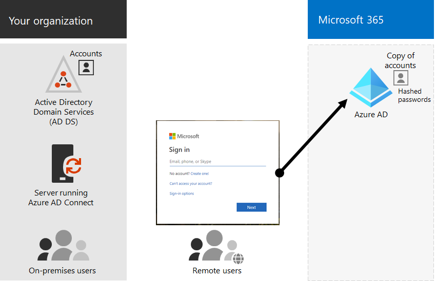
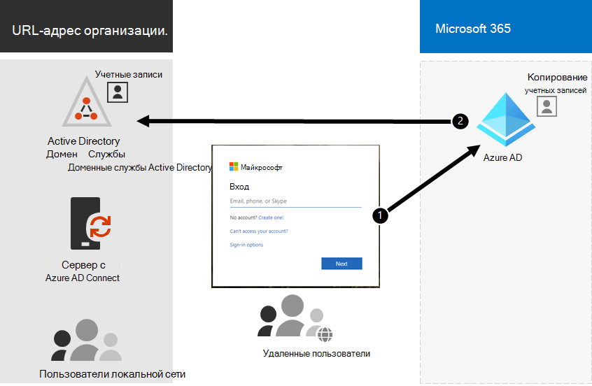

# Гибридное удостоверение и синхронизация каталогов для Microsoft 365Hybrid identity and directory synchronization for Microsoft 365

*Эта статья относится к Microsoft 365 корпоративный и Office 365 корпоративный.**This article applies to both Microsoft 365 Enterprise and Office 365 Enterprise.*

В зависимости от потребностей бизнеса и технических требований, наиболее распространенным выбором для корпоративных клиентов, использующих Microsoft 365, является гибридная модель идентификации и синхронизация службы каталогов.Depending on your business needs and technical requirements, the hybrid identity model and directory synchronization is the most common choice for enterprise customers who are adopting Microsoft 365. Синхронизация службы каталогов позволяет управлять удостоверениями в доменных службах Active Directory (AD DS), а все обновления учетных записей пользователей, групп и контактов синхронизируются с клиентом Azure Active Directory (Azure AD) вашей подписки на Microsoft 365.Directory synchronization allows you to manage identities in your Active Directory Domain Services (AD DS) and all updates to user accounts, groups, and contacts are synchronized to the Azure Active Directory (Azure AD) tenant of your Microsoft 365 subscription.

>[!Note]
>Когда учетные записи пользователей AD DS синхронизируются впервые, им не назначается лицензия Microsoft 365 и не удается получить доступ к службам Microsoft 365, таким как электронная почта.When AD DS user accounts are synchronized for the first time, they are not automatically assigned a Microsoft 365 license and cannot access Microsoft 365 services, such as email. Сначала необходимо назначить им место использования.You must first assign them a usage location. Затем назначьте лицензию для этих учетных записей пользователей по отдельности или динамически с помощью членства в группе.Then, assign a license to these user accounts, either individually or dynamically through group membership.
>

## Проверка подлинности для гибридного удостоверенияAuthentication for hybrid identity

При использовании модели гибридной идентификации существует два типа проверки подлинности:There are two types of authentication when using the hybrid identity model:

- Управляемая проверка подлинности.Managed authentication

  Azure AD обрабатывает процесс проверки подлинности с помощью локально сохраненной хешированной версии пароля или отправляет учетные данные в локальный агент программного обеспечения, чтобы пройти проверку подлинности в локальных доменных СЛУЖБах Active Directory.Azure AD handles the authentication process by using a locally-stored hashed version of the password or sends the credentials to an on-premises software agent to be authenticated by the on-premises AD DS.

- Федеративная проверка подлинностиFederated authentication

  Azure AD перенаправляет клиентский компьютер, запрашивающий проверку подлинности, другому поставщику удостоверений.Azure AD redirects the client computer requesting authentication to another identity provider.

### Управляемая проверка подлинности.Managed authentication

Существует два типа управляемой проверки подлинности:There are two types of managed authentication:

- Синхронизация хэша паролей (PHS)Password hash synchronization (PHS)

  Проверка подлинности выполняется с помощью Azure AD.Azure AD performs the authentication itself.

- Сквозная проверка подлинности (PTA)Pass-through authentication (PTA)

  Проверка подлинности выполняется с помощью доменных служб Aсtive Directory в Azure AD.Azure AD has AD DS perform the authentication.

#### Синхронизация хэша паролей (PHS)Password hash synchronization (PHS)

С помощью ФС вы синхронизируете учетные записи пользователей AD DS с Microsoft 365 и управляете локальными пользователями.With PHS, you synchronize your AD DS user accounts with Microsoft 365 and manage your users on-premises. Хэши паролей пользователей синхронизируются из доменных служб Active Directory в Azure AD, чтобы пользователи могли использовать один и тот же пароль в локальной среде и в облаке.Hashes of user passwords are synchronized from your AD DS to Azure AD so that the users have the same password on-premises and in the cloud. Это самый простой способ включить проверку подлинности для удостоверений AD DS в Azure AD.This is the simplest way to enable authentication for AD DS identities in Azure AD. 

Когда пароли изменяются или сбрасываются локально, новые хэши паролей синхронизируются с Azure AD, чтобы пользователи всегда могли использовать одинаковые пароли для облачных ресурсов и локальных ресурсов.When passwords are changed or reset on-premises, the new password hashes are synchronized to Azure AD so that your users can always use the same password for cloud resources and on-premises resources. Пароли пользователей никогда не отправляются в Azure AD или хранятся в службе Azure AD в виде простого текста.The user passwords are never sent to Azure AD or stored in Azure AD in clear text. Некоторые расширенные функции Azure AD, такие как защита идентификации, требуют ФС независимо от выбранного метода проверки подлинности.Some premium features of Azure AD, such as Identity Protection, require PHS regardless of which authentication method is selected.
  
Чтобы узнать больше, ознакомьтесь со статьей [Выбор правильного метода проверки подлинности](https://docs.microsoft.com/azure/active-directory/hybrid/choose-ad-authn) .See [choosing the right authentication method](https://docs.microsoft.com/azure/active-directory/hybrid/choose-ad-authn) to learn more.
  
#### Сквозная проверка подлинности (PTA)Pass-through authentication (PTA)

ПТА предоставляет простую проверку паролей для служб проверки подлинности Azure AD с помощью программного агента, работающего на одном или нескольких локальных серверах, для проверки пользователей непосредственно в доменных СЛУЖБах Active Directory.PTA provides a simple password validation for Azure AD authentication services using a software agent running on one or more on-premises servers to validate the users directly with your AD DS. С помощью ПТА вы синхронизируете учетные записи пользователей AD DS с Microsoft 365 и управляете локальными пользователями.With PTA, you synchronize AD DS user accounts with Microsoft 365 and manage your users on-premises. 

ПТА позволяет пользователям входить как в локальные, так и в Microsoft 365 ресурсы и приложения, используя их локальную учетную запись и пароль.PTA allows your users to sign in to both on-premises and Microsoft 365 resources and applications using their on-premises account and password. Эта конфигурация проверяет пароли пользователей непосредственно для локальных доменных служб Active Directory без сохранения хеш-кодов паролей в Azure AD.This configuration validates users passwords directly against your on-premises AD DS without storing password hashes in Azure AD. 

ПТА также используется в организациях с требованиями к безопасности для немедленного применения локальных состояний учетных записей пользователей, политик паролей и часов входа.PTA is also for organizations with a security requirement to immediately enforce on-premises user account states, password policies, and logon hours. 
  
Чтобы узнать больше, ознакомьтесь со статьей [Выбор правильного метода проверки подлинности](https://docs.microsoft.com/azure/active-directory/hybrid/choose-ad-authn) .See [choosing the right authentication method](https://docs.microsoft.com/azure/active-directory/hybrid/choose-ad-authn) to learn more.
  
### Федеративная проверка подлинностиFederated authentication

Федеративная проверка подлинности в основном используется для крупных организаций с более сложными требованиями к проверке подлинности.Federated authentication is primarily for large enterprise organizations with more complex authentication requirements. Удостоверения доменных служб Active Directory синхронизируются с Microsoft 365, и учетные записи пользователей управляются локально.AD DS identities are synchronized with Microsoft 365 and users accounts are managed on-premises. При использовании федеративной проверки подлинности пользователи имеют один и тот же пароль в локальной среде и в облаке, и им не нужно повторно входить в систему, чтобы использовать Microsoft 365.With federated authentication, users have the same password on-premises and in the cloud and they do not have to sign in again to use Microsoft 365. 

Федеративная проверка подлинности может поддерживать дополнительные требования к проверке подлинности, такие как проверка подлинности на основе смарт-карт или третья многофакторная проверка подлинности и обычно требуется, когда в организациях нет требований проверки подлинности, изначально поддерживаемых Azure AD.Federated authentication can support additional authentication requirements, such as smartcard-based authentication or a third-party multi-factor authentication and is typically required when organizations have an authentication requirement not natively supported by Azure AD.
 
Чтобы узнать больше, ознакомьтесь со статьей [Выбор правильного метода проверки подлинности](https://docs.microsoft.com/azure/active-directory/hybrid/choose-ad-authn) .See [choosing the right authentication method](https://docs.microsoft.com/azure/active-directory/hybrid/choose-ad-authn) to learn more.
  
#### Сторонние поставщики проверки подлинности и идентификацииThird-party authentication and identity providers

Локальные объекты каталогов могут синхронизироваться с Microsoft 365, а доступ к облачным ресурсам — главным образом сторонним поставщиком удостоверений (IdP).On-premises directory objects may be synchronized to Microsoft 365 and cloud resource access is primarily managed by a third-party identity provider (IdP). Если в вашей организации используется стороннее решение Федерации, можно настроить вход с этим решением для Microsoft 365, предоставило, что стороннее решение совместимо с Azure AD.If your organization uses a third-party federation solution, you can configure sign-on with that solution for Microsoft 365 provided that the third-party federation solution is compatible with Azure AD.
  
Чтобы узнать больше, ознакомьтесь со [списком совместимость Федерации Azure AD](https://docs.microsoft.com/azure/active-directory/connect/active-directory-aadconnect-federation-compatibility) .See the [Azure AD federation compatibility list](https://docs.microsoft.com/azure/active-directory/connect/active-directory-aadconnect-federation-compatibility) to learn more.
  
## Подготовка AD DSAD DS Preparation

Для обеспечения беспрепятственного перехода на Microsoft 365 с помощью синхронизации необходимо подготовить лес доменных служб Active Directory, прежде чем приступать к развертыванию синхронизации каталогов Microsoft 365.To help ensure a seamless transition to Microsoft 365 by using synchronization, you must prepare your AD DS forest before you begin your Microsoft 365 directory synchronization deployment.
  
Подготовка каталогов должна сосредоточиться на следующих задачах:Your directory preparation should focus on the following tasks:

- Удалите повторяющиеся атрибуты **proxyAddress** и **userPrincipalName** .Remove duplicate **proxyAddress** and **userPrincipalName** attributes.
- Обновление пустых и недопустимых атрибутов **userPrincipalName** с допустимыми атрибутами **userPrincipalName** .Update blank and invalid **userPrincipalName** attributes with valid **userPrincipalName** attributes.
- Удалите недопустимые и сомнительные символы в атрибутах **givenName**, фамилия ( **SN** ), **SamAccountName**, **DisplayName**, **mail**, **proxyAddresses**, **mailNickname**и **userPrincipalName** .Remove invalid and questionable characters in the **givenName**, surname ( **sn** ), **sAMAccountName**, **displayName**, **mail**, **proxyAddresses**, **mailNickname**, and **userPrincipalName** attributes. Подробнее о подготовке атрибутов можно узнать [в разделе List of Attributes, которые синхронизируются средством синхронизации Azure Active Directory](https://go.microsoft.com/fwlink/p/?LinkId=396719).For details about preparing attributes, see [List of attributes that are synced by the Azure Active Directory Sync Tool](https://go.microsoft.com/fwlink/p/?LinkId=396719).

    > [!NOTE]
    > Это те же атрибуты, которые синхронизируются с помощью Azure AD Connect.These are the same attributes that Azure AD Connect synchronizes. 
  
## Рекомендации по развертыванию нескольких лесовMulti-forest deployment considerations

Для параметров нескольких лесов и единого входа используйте [выборочную установку Azure AD Connect](https://go.microsoft.com/fwlink/p/?LinkId=698430).For multiple forests and SSO options, use a [Custom Installation of Azure AD Connect](https://go.microsoft.com/fwlink/p/?LinkId=698430).
  
Если в организации используется несколько лесов для проверки подлинности (лесов входа), настоятельно рекомендуется выполнить следующие действия:If your organization has multiple forests for authentication (logon forests), we highly recommend the following:
  
- **Рассмотрите вопрос консолидации лесов.****Consider consolidating your forests.** В общем случае для поддержки нескольких лесов требуется дополнительная нагрузка.In general, there's more overhead required to maintain multiple forests. Если в Организации не предусмотрены ограничения безопасности, которые определяют потребность в отдельных лесах, рекомендуется упростить локальную среду.Unless your organization has security constraints that dictate the need for separate forests, consider simplifying your on-premises environment.
- **Используйте только в основном лесе входа в систему.****Use only in your primary logon forest.** Рекомендуется развертывать Microsoft 365 только в основном лесе входа в систему для первоначального развертывания Microsoft 365.Consider deploying Microsoft 365 only in your primary logon forest for your initial rollout of Microsoft 365. 

Если вы не можете консолидировать развертывание AD DS с несколькими лесами или используете другие службы каталогов для управления удостоверениями, их можно синхронизировать с помощью корпорации Майкрософт или партнера.If you can't consolidate your multi-forest AD DS deployment or are using other directory services to manage identities, you may be able to synchronize these with the help of Microsoft or a partner.
  
Для получения дополнительных сведений см. [топологии для Azure AD Connect](https://docs.microsoft.com/azure/active-directory/hybrid/plan-connect-topologies) .See [Topologies for Azure AD Connect](https://docs.microsoft.com/azure/active-directory/hybrid/plan-connect-topologies) for more information.
  
## Компоненты, зависящие от синхронизации службы каталоговFeatures that are dependent on directory synchronization
  
Синхронизация службы каталогов необходима для следующих функций и функций:Directory synchronization is required for the following features and functionality:
  
- Единый вход в Azure AD (SSO)Azure AD Seamless Single Sign-On (SSO)
- Сосуществование SkypeSkype coexistence
- Гибридное развертывание Exchange, в том числе:Exchange hybrid deployment, including:
  - Полный общий глобальный список адресов (GAL) между локальной средой Exchange и Microsoft 365.Fully shared global address list (GAL) between your on-premises Exchange environment and Microsoft 365.
  - синхронизацию данных глобального списка адресов из разных почтовых систем;Synchronizing GAL information from different mail systems.
  - Возможность добавлять и удалять пользователей из служб Microsoft 365.The ability to add users to and remove users from Microsoft 365 service offerings. Для этого требуются следующие компоненты:This requires the following:
  - Двухсторонняя синхронизация должна быть настроена во время настройки синхронизации службы каталогов.Two-way synchronization must be configured during directory synchronization setup. По умолчанию средства синхронизации службы каталогов записывают данные каталога только в облако.By default, directory synchronization tools write directory information only to the cloud. При настройке двусторонней синхронизации необходимо включить функцию обратной записи, чтобы в облако копировалось ограниченное количество атрибутов объектов, а затем они были записаны в локальные доменные службы Active Directory.When you configure two-way synchronization, you enable write-back functionality so that a limited number of object attributes are copied from the cloud, and then written them back to your local AD DS. Обратная запись также называется гибридным режимом Exchange.Write-back is also referred to as Exchange hybrid mode. 
  - Локальное гибридное развертывание ExchangeAn on-premises Exchange hybrid deployment
  - Возможность перемещать некоторые почтовые ящики пользователей в Microsoft 365, сохраняя другие локальные почтовые ящики пользователей.The ability to move some user mailboxes to Microsoft 365 while keeping other user mailboxes on-premises.
  - Надежные отправители и заблокированные отправители реплицируются в Microsoft 365.Safe senders and blocked senders on-premises are replicated to Microsoft 365.
  - базовое делегирование и функциональную возможность отправки электронной почты от имени кого-либо.Basic delegation and send-on-behalf-of email functionality.
  - У вас есть интегрированная локальная смарт-карта или решение с многофакторной проверкой подлинности.You have an integrated on-premises smart card or multi-factor authentication solution.
- Синхронизация фотографий, эскизов, Конференц-залов и групп безопасностиSynchronization of photos, thumbnails, conference rooms, and security groups

## Следующий шагNext step

Когда вы будете готовы развернуть гибридную идентификацию, ознакомьтесь со статьей [Подготовка к подготовке пользователей](prepare-for-directory-synchronization.md).When you are ready to deploy hybrid identity, see [prepare to provision users](prepare-for-directory-synchronization.md).
  
## См. такжеSee also

[Обзор Microsoft 365 корпоративныйMicrosoft 365 Enterprise overview](microsoft-365-overview.md)

