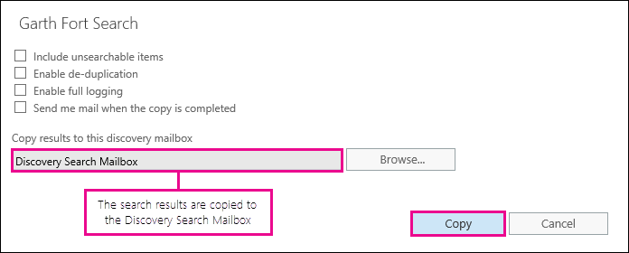
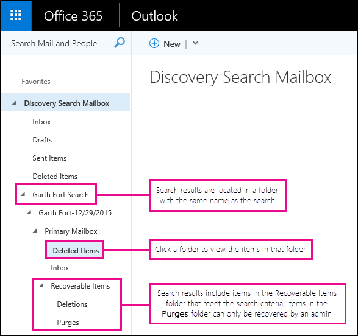
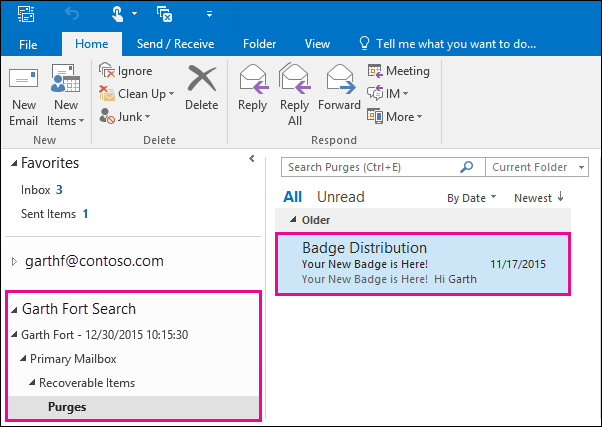

# Восстановление элементов, удаленных из почтового ящика пользователяRecover deleted items in a user mailbox

**Эта статья предназначена для администраторов. Вы пытаетесь восстановить удаленные элементы в вашем почтовом ящике?****This article is for administrators. Are you trying to recover deleted items in your own mailbox?** Попробуйте выполнить одно из следующих действий:Try one of the following:
- [Восстановление удаленных элементов в Outlook для WindowsRecover deleted items in Outlook for Windows](https://support.office.com/article/49e81f3c-c8f4-4426-a0b9-c0fd751d48ce)
- [Восстановление удаленных элементов или электронной почты в Outlook Web AppRecover deleted items or email in Outlook Web App](https://support.office.com/article/c3d8fc15-eeef-4f1c-81df-e27964b7edd4)
- [Восстановление удаленных сообщений электронной почты в Outlook в ИнтернетеRestore deleted email messages in Outlook on the web](https://support.office.com/article/a8ca78ac-4721-4066-95dd-571842e9fb11)
- [Outlook.com.Outlook.com](https://go.microsoft.com/fwlink/p/?LinkID=623435)
   
Был ли пользователь навсегда удалять элементы из своего почтового ящика Outlook?Did a user permanently delete items from their Outlook mailbox? Пользователь хочет выполнить эти функции, но не может их восстановить.The user wants them back but can't recover them. Удаленные элементы могут быть восстановлены, если они не были окончательно удалены из почтового ящика пользователя.You may be able recover the purged items if they haven't been permanently removed from the user's mailbox. Это делается с помощью средства обнаружения электронных данных на месте в Exchange Online для поиска удаленных сообщений электронной почты и других элементов, таких как контакты, встречи календаря и задачи, в почтовом ящике пользователя.You do this by using the In-Place eDiscovery tool in Exchange Online to search for deleted email and other items—and such as contacts, calendar appointments, and tasks—in a user's mailbox. Если вы обнаружите удаленные элементы, их можно экспортировать в PST-файл (также называемый файлом данных Outlook), который пользователь может использовать для восстановления элементов обратно в свой почтовый ящик.If you find the deleted items, you can export them to a PST file (also called an Outlook Data File), which the user can then use to restore the items back to their mailbox.
  
Ниже приведены действия по восстановлению удаленных элементов в почтовом ящике пользователя.Here are the steps for recovering deleted items in a user's mailbox. Как долго будет выполняться эта проблема?How long will this take? В первый раз может потребоваться 20 или 30 минут, чтобы выполнить все действия в зависимости от количества элементов, которые вы пытаетесь восстановить.The first time might take 20 or 30 minutes to complete all the steps, depending on how many items you're trying to recover.
  
> [!NOTE]
> Для выполнения действий, описанных в этой статье, необходимо быть **администратором Exchange** или **глобальным администратором** в Microsoft 365 или членом группы ролей Управление организацией в Exchange Online.You have to be an **Exchange administrator** or **Global administrator** in Microsoft 365 or be a member of the Organization Management role group in Exchange Online to perform the steps in this article. Дополнительные сведения см. в статье [Роли администраторов в Microsoft 365](https://support.office.com/article/da585eea-f576-4f55-a1e0-87090b6aaa9d).For more information, see [About Microsoft 365 admin roles](https://support.office.com/article/da585eea-f576-4f55-a1e0-87090b6aaa9d). 
  
## Шаг 1: назначение собственных разрешений на обнаружение электронных данныхStep 1: Assign yourself eDiscovery permissions

Первый шаг — назначение себе необходимых разрешений в Exchange Online, чтобы можно было использовать средство обнаружения электронных данных на месте для поиска в почтовом ящике пользователя.The first step is to assign yourself the necessary permissions in Exchange Online so you can use the In-Place eDiscovery tool to search a user's mailbox. Это потребуется сделать только один раз.You only have to do this once. Если вы хотите выполнить поиск в другом почтовом ящике в будущем, вы можете пропустить этот шаг.If you have to search another mailbox in the future, you can skip this step.
  
1. [Где войти в Microsoft 365 для бизнеса](https://support.microsoft.com/office/where-to-sign-into-microsoft-365-for-business-e9eb7d51-5430-4929-91ab-6157c5a050b4) с помощью рабочей или учебной учетной записи.[Where to sign in to Microsoft 365 for business](https://support.microsoft.com/office/where-to-sign-into-microsoft-365-for-business-e9eb7d51-5430-4929-91ab-6157c5a050b4) with your work or school account. 
    
2. Выберите значок средства запуска приложений  в левом верхнем углу и щелкните **Администратор**.Select the app launcher icon  in the upper-left and click **Admin**.
    
3. В левой области навигации центра администрирования Microsoft 365 разверните узел **центры администрирования**и выберите **Exchange**.In the left navigation in the Microsoft 365 admin center, expand **Admin centers**, and then click **Exchange**.
    
    
  
4. В центре администрирования Exchange щелкните **разрешения**, а затем — **роли администратора**.In the Exchange admin center, click **Permissions**, and then click **Admin roles**.
    
5. В представлении списка выберите **Управление обнаружением**, а затем щелкните **изменить**  .In the list view, select **Discovery Management**, and then click **Edit**.
    
    
  
6. В группе **члены** **группы ролей**щелкните **добавить**  .In **Role Group**, under **Members**, click **Add**.
    
7. В разделе **Выбор элементов**выберите в списке имя пользователя и нажмите кнопку **Добавить**, а затем нажмите кнопку **ОК**.In **Select Members**, select yourself from the list of names, click **Add**, and then click **OK**.
    
    > [!NOTE]
    > Вы также можете добавить группу, в которую вы являетесь участником, например "Управление организацией" или "Тенантадминс".You can also add a group that you are a member of, such as Organization Management or TenantAdmins. При добавлении группы другим участникам этой группы будут назначены необходимые разрешения для запуска средства обнаружения электронных данных на месте.If you add a group, other members of the group will be assigned the necessary permissions to run the In-Place eDiscovery tool. 
  
8. В **группе ролей**нажмите кнопку **сохранить**.In **Role Group**, click **Save**.
    
9. Выйдите из Microsoft 365.Sign out of Microsoft 365.
    
    Необходимо выйти, прежде чем приступить к следующему шагу, чтобы новые разрешения вступили в силу.You have to sign out before you start the next step so the new permissions will take effect.
    
> [!CAUTION]
> Члены группы ролей Управление обнаружением имеют доступ к конфиденциальному содержимому сообщений.Members of the Discovery Management role group can access sensitive message content. Это включает поиск во всех почтовых ящиках в Организации, предварительный просмотр результатов поиска (и других элементов почтовых ящиков), копирование результатов в почтовый ящик обнаружения и экспорт результатов поиска в PST-файл.This includes searching all mailboxes in your organization, previewing the search results (and other mailbox items), copying the results to a discovery mailbox, and exporting the search results to a PST file. 
  
[Return to topReturn to top](recover-deleted-items-in-a-mailbox.md)
  
## Шаг 2: Поиск удаленных элементов в почтовом ящике пользователяStep 2: Search the user's mailbox for deleted items

При выполнении поиска с обнаружением электронных данных на месте в поиск автоматически включается папка "элементы с возможностью восстановления" в почтовом ящике, в котором выполняется поиск.When you run an In-Place eDiscovery search, the Recoverable Items folder in the mailbox that you search is automatically included in the search. Папка "элементы с возможностью восстановления" позволяет хранить безвозвратно удаленные элементы в почтовом ящике, пока они не будут очищены (окончательно удалены).The Recoverable Items folder is where permanently deleted items are stored until they're purged (permanently removed) from the mailbox. Таким образом, если элемент не был очищен, вы можете найти его с помощью средства обнаружения электронных данных на месте.So, if an item hasn't been purged, you should be able to find it by using the In-Place eDiscovery tool.
  
1. [Где войти в Microsoft 365 для бизнеса](https://support.microsoft.com/office/where-to-sign-into-microsoft-365-for-business-e9eb7d51-5430-4929-91ab-6157c5a050b4) с помощью рабочей или учебной учетной записи.[Where to sign in to Microsoft 365 for business](https://support.microsoft.com/office/where-to-sign-into-microsoft-365-for-business-e9eb7d51-5430-4929-91ab-6157c5a050b4) with your work or school account. 
    
2. Выберите значок средства запуска приложений  в левом верхнем углу и щелкните **Администратор**.Select the app launcher icon  in the upper-left and click **Admin**.
    
3. В левой области навигации центра администрирования Microsoft 365 разверните узел **Администратор**и выберите пункт **Exchange**.In the left navigation in the Microsoft 365 admin center, expand **Admin**, and then click **Exchange**.
    
4. В центре администрирования Exchange выберите **Управление соответствием требованиям**, нажмите кнопку \*\* &amp; удержание электронных данных на месте\*\*, а затем нажмите кнопку **создать**  .In the Exchange admin center, click **Compliance management**, click **In-Place eDiscovery &amp; Hold**, and then click **New**.
    
    
  
5. На странице **имя и описание** введите имя для поиска (например, имя пользователя, для которого выполняется восстановление), необязательное описание, а затем нажмите кнопку **Далее**.On the **Name and description** page, type a name for the search (such as the name of the user you're recovering email for), an optional description, and then click **Next**.
    
6. На странице **почтовые ящики** щелкните **указать почтовые ящики для поиска**, а затем щелкните **добавить**  .On the **Mailboxes** page, click **Specify mailboxes to search**, and then click **Add**.
    
    
  
7. Найдите и выберите имя пользователя, для которого восстанавливается Удаленная электронная почта, нажмите кнопку **Добавить**, а затем нажмите кнопку **ОК**.Find and select the name of the user that you're recovering the deleted email for, click **Add**, and then click **OK**.
    
8. Нажмите кнопку **Далее**.Click **Next**.
    
    Отобразится страница **поискового запроса** .The **Search query** page is displayed. Здесь определяются критерии поиска, которые помогут найти отсутствующие элементы в почтовом ящике пользователя.This is where you define the search criteria that will help you find the missing items in user's mailbox. 
    
9. На странице **Поисковый запрос** заполните следующие поля:On the **Search query** page, complete the following fields: 
    
  - **Включить все содержимое** Выберите этот параметр, чтобы включить все содержимое почтового ящика пользователя в результаты поиска.**Include all content** Select this option to include all content in the user's mailbox in the search results. Если выбрать этот вариант, указать дополнительные критерии поиска будет невозможно.If you select this option, you can't specify additional search criteria. 
    
  - **Фильтрация на основе критериев** Выберите этот параметр, чтобы задать условия поиска, включая ключевые слова, начальную и конечную даты, адреса отправителей и получателей, а также типы сообщений.**Filter based on criteria** Select this option to specify the search criteria, including keywords, start and end dates, sender and recipient addresses, and message types. 
    
    
  
|**Field****Field**|**Используйте это для...****Use this to...**|
|:-----|:-----|
|             |Укажите ключевые слова, диапазон дат, получателей и типы сообщений.Specify keywords, date range, recipients, and message types.    |
|             |Поиск сообщений с ключевыми словами или фразами, а также использование логических операторов, таких как **и** или **или**.Search for messages with keywords or phrases, and use logical operators such as **AND** or **OR**.    |
|             |Поиск сообщений, отправленных или полученных в диапазоне дат.Search for messages sent or received within a date range.    |
|             |Поиск сообщений, полученных или отправленных определенным пользователям.Search for messages received from or sent to specific people.    |
|             |Выполните поиск по всем типам сообщений или выберите определенные.Search for all message types or select specific ones.    |
   
   > [!TIP]
   >  Ниже приведено несколько советов по созданию поискового запроса для обнаружения отсутствующих элементов.Here are a few tips about how to build a search query to find missing items. Попытайтесь получить от пользователя больше сведений, чтобы помочь вам создать поисковый запрос, чтобы можно было найти нужную информацию.Try to get as much information from the user to help you create a search query so you can find what you're looking for. Если вы не знаете, как найти отсутствующее сообщение, рекомендуется использовать параметр **включить все содержимое** .If you are not sure how to find a missing message, consider using the **Include all content** option. В результаты поиска будут включены все элементы в папке "элементы с возможностью восстановления", включая скрытую папку (называемую папкой очистки), которая содержит элементы, удаленные пользователем.The search results will include all items in the user's Recoverable Items folder, including the hidden folder (called the Purges folder) that contain items that have been purged by the user. После этого вы можете перейти к шагу 3, скопировать результаты в почтовый ящик найденных сообщений и посмотреть на сообщение в скрытой папке.Then you can go to Step 3, copy the results to a discovery mailbox, and look at the message in the hidden folder. Если вы знаете приблизительно, когда сообщение было изначально отправлено или получено пользователем, используйте параметр **указать начальную дату** и **Укажите параметры даты окончания** , чтобы задать диапазон дат.If you know approximately when the missing message was originally sent or received by the user, use the **Specify start date** and **Specify end date** options to provide a date range. Будут возвращены все сообщения, отправленные или полученные пользователем в пределах этого диапазона дат.This will return all messages sent or received by the user within that date range. Задание диапазона дат — это действительно хороший способ сужения результатов поиска.Specifying a date range is a really good way to narrow the search results. Если вы знаете, кто отправил недостающий адрес электронной почты, укажите этого отправителя с помощью поля " **от** ".If you know who sent the missing email, use the **From** box to specify this sender. Чтобы сузить результаты поиска по разным типам элементов почтовых ящиков, щелкните **выбрать типы сообщений**, выберите **типы сообщений для поиска**, а затем выберите тип сообщений для поиска.If you want to narrow the search results to different types of mailbox items, click **Select message types**, click **Select the message types to search**, and then choose a specific message type to search for. Например, вы можете выполнять поиск только для элементов календаря и контактов.For example, you can search only for calendar items or contacts. Ниже приведен снимок экрана с различными типами сообщений, которые можно искать; по умолчанию выполняется поиск всех типов сообщений.Here's a screenshot of the different message types you can search for; the default is to search for all message types. 
  
   После завершения страницы **поискового запроса** нажмите кнопку **Далее** .Click **Next** when you've completed the **Search query** page. 
    
10. На странице **Параметры хранения на месте** нажмите кнопку **Готово** , чтобы начать поиск.On the **In-Place Hold settings** page, click **Finish** to start the search. Чтобы восстановить удаленное сообщение, нет причин помещать почтовый ящик пользователя на удержание.To recover deleted email, there's no reason to place the user's mailbox on hold. 
    
    После запуска поиска Exchange будет отображать оценку общего размера и количества элементов, которые будут возвращены при поиске на основе указанных критериев.After you start the search, Exchange will display an estimate of the total size and number of items that will be returned by the search based on the criteria you specified.
    
11. Выберите только что созданный Поиск и щелкните **Обновить**  , чтобы обновить сведения, отображаемые в области сведений.Select the search you just created and click **Refresh** to update the information displayed in the details pane. Состояние **оценки SUCCEEDED** указывает на то, что Поиск завершен.The status of **Estimate Succeeded** indicates that the search has finished. Кроме того, в Exchange отображается оценка общего количества элементов (и их размера), которые были найдены в соответствии с условиями поиска, указанными на шаге 9.Exchange also displays an estimate of the total number of items (and their size) found by the search based on the search criteria you specified in step 9. 
    
12. В области сведений щелкните **Предварительный просмотр результатов поиска** , чтобы просмотреть найденные элементы.In the details pane, click **Preview search results** to view the items that were found. Это может помочь вам определить интересующий вас элемент (ы).This might help you identify the item(s) that you're looking for. Если вы ищете элементы, которые вы пытаетесь восстановить, перейдите к шагу 4, чтобы экспортировать результаты поиска в PST-файл.If you find the item(s) you're trying to recover, go to step 4 to export the search results to a PST file. 
    
    
  
13. Если вы не нашли то, что искали, вы можете изменить критерии поиска, выбрав поиск, щелкнув **изменить**  , а затем щелкнув **поисковый запрос**.If you don't find what you're looking for, you can revise your search criteria by selecting the search, clicking **Edit**, and then clicking **Search query**. Измените условия поиска и повторите поиск.Change the search criteria and then rerun the search.
    
[Return to topReturn to top](recover-deleted-items-in-a-mailbox.md)
  
## Необязательно Шаг 3: копирование результатов поиска в почтовый ящик обнаружения(Optional) Step 3: Copy the search results to a discovery mailbox

Если вы не можете найти элементы, выполнив предварительный просмотр результатов поиска, или хотите узнать, какие элементы находятся в папке "элементы с возможностью восстановления", можно скопировать результаты поиска в специальный почтовый ящик (называемый почтовым ящиком обнаружения), а затем открыть этот почтовый ящик в Outlook в Интернете для просмотра фактических элементов.If you can't find an items by previewing the search results or if you want to see which items are in the user's Recoverable Items folder, then you can copy the search results to a special mailbox (called a discovery mailbox) and then open that mailbox in Outlook on the web to view the actual items. Лучше всего копировать результаты поиска, чтобы можно было просматривать элементы в папке "элементы с возможностью восстановления".The best reason to copy the search results is so you can view the items in the user's Recoverable Items folder. Более вероятно, что восстанавливаемый элемент находится в вложенной папке "Очистка".More than likely, the item you're trying to recover is located in the Purges subfolder. 
  
1. В центре администрирования Exchange перейдите к разделу **Управление соответствием** для \> **обнаружения электронных &amp; данных на месте**.In the Exchange admin center, go to **Compliance management** \> **In-Place eDiscovery &amp; Hold**.
    
2. В списке поиска выберите Поиск, созданный в шаге 2.In the list of searches, select the search that you created in Step 2.
    
3. Нажмите **кнопку Поиск поиска**  и выберите команду **Копировать результаты поиска** из раскрывающегося списка.Click **Search**, and then click **Copy search results** from the drop-down list. 
    
    
  
4. На странице **Копирование результатов поиска** нажмите кнопку **Обзор**.On the **Copy Search Results** page, click **Browse**.
    
    
  
5. В разделе **Отображаемое имя**щелкните **почтовый ящик поиска обнаружения**, а затем нажмите кнопку **ОК**.Under **Display Name**, click **Discovery Search Mailbox**, and then click **OK**.
    
    
  
    > [!NOTE]
    > Почтовый ящик поиска обнаружения это почтовый ящик обнаружения по умолчанию, который автоматически создается в организации Microsoft 365.The Discovery Search Mailbox is a default discovery mailbox that is automatically created in your Microsoft 365 organization. 
  
6. Вернувшись на страницу **Копировать результаты поиска** , нажмите кнопку **Копировать** , чтобы начать процесс копирования результатов поиска в почтовый ящик поиска обнаружения.Back on the **Copy Search Results** page, click **Copy** to start the process to copy the search results to the Discovery Search Mailbox. 
    
    
  
7. Нажмите кнопку **Обновить**  чтобы обновить информацию о состоянии копирования, отображаемую в области сведений.Click **Refresh** to update the information about the copying status that is displayed in the details pane. 
    
8. По завершении копирования нажмите кнопку **Открыть** , чтобы открыть почтовый ящик поиска обнаружения, чтобы просмотреть результаты поиска.When the copying is complete, click **Open** to open the Discovery Search Mailbox to view the search results. 
    
    
  
    Результаты поиска, скопированные в почтовый ящик поиска обнаружения, помещаются в папку с таким же именем, что и при поиске с обнаружением электронных данных на месте.The search results copied to the Discovery Search Mailbox are placed in a folder that has the same name as the In-Place eDiscovery search. Для отображения элементов в этой папке можно щелкнуть папку.You can click a folder to display the items in that folder.
    
    
  
    При выполнении поиска также выполняется поиск папки "элементы для восстановления" пользователя.When you run a search, the user's Recoverable Items folder is also searched. Это означает, что если элементы в папке "элементы с возможностью восстановления" удовлетворяют критериям поиска, они включаются в результаты поиска.That means if items in the Recoverable Items folder meet the search criteria, they are included in the search results. Элементы в папке "удаления" — это элементы, которые пользователь окончательно удалил (удалив элемент из папки "Удаленные" или выделив его и нажав клавиши **SHIFT + DELETE**.Items in the Deletions folder are items that the user permanently deleted (by deleting an item from the Deleted Items folder or by selecting it and pressing **Shift+Delete**. Пользователь может использовать средство восстановления удаленных элементов в Outlook или Outlook в Интернете для восстановления элементов в папке "удаления".A user can use the Recover Deleted Items tool in Outlook or Outlook on the web to recover items in the Deletions folder. Элементы в папке "очистки" — это элементы, которые пользователь удалил с помощью средства "восстановить удаленные элементы" или элементов, которые они автоматически очищают с помощью политики, примененной к почтовому ящику.Items in the Purges folder are items that the user purged by using the Recover Deleted Items tool or items they were automatically purged by a policy applied to the mailbox. В любом случае только администратор может восстановить элементы в папке "очистки".In either case, only an admin can recover items in the Purges folder. 
    
    > [!TIP]
    > Если пользователь не может найти удаленный элемент с помощью средства "элементы для восстановления", но этот элемент все еще можно восстановить (это означает, что он не был окончательно удален из почтового ящика), он, скорее всего, находится в папке "очистки".If a user can't find a deleted item using the Recoverable Items tool, but that item is still recoverable (meaning that it hasn't been permanently removed from the mailbox), it's more than likely located in the Purges folder. Поэтому проверьте папку очистки для удаленного элемента, который вы пытаетесь восстановить для пользователя.So, be sure to look in the Purges folder for the deleted item you're trying to recover for a user. 
  
[Return to topReturn to top](recover-deleted-items-in-a-mailbox.md)
  
## Шаг 4: экспорт результатов поиска в PST-файлStep 4: Export the search results to a PST file

После того как вы найдете элемент, который вы пытаетесь восстановить для пользователя, выполните следующий шаг, чтобы экспортировать результаты из поиска, выполненного на шаге 2, в PST-файл.After you find the item you're trying to recover for a user, the next step is to export the results from the search you ran in Step 2 to a PST file. Пользователь будет использовать этот PST-файл на следующем шаге для восстановления удаленного элемента в своем почтовом ящике.The user will use this PST file in the next step to restore the deleted item to their mailbox.
  
1. В центре администрирования Exchange перейдите к разделу **Управление соответствием** для \> **обнаружения электронных &amp; данных на месте**.In the Exchange admin center, go to **Compliance management** \> **In-Place eDiscovery &amp; Hold**.
    
2. В списке поиска выберите Поиск, созданный в шаге 2.In the list of searches, select the search that you created in Step 2.
    
3. Нажмите кнопку **Экспорт в PST-файл**.Click **Export to a PST file**.
    
    
  
4. Если вам будет предложено установить средство экспорта eDiscovery, нажмите кнопку **выполнить**.If you're prompted to install the eDiscovery Export Tool, click **Run**.
    
5. В средстве экспорта в PST обнаружения электронных данных нажмите кнопку **Обзор** , чтобы указать расположение, в которое требуется скачать PST-файл.In the eDiscovery PST Export Tool, click **Browse** to specify the location where you want to download the PST file. 
    
    
  
    Вы можете игнорировать параметры, чтобы включить дедупликацию и включить элементы, не включаемые в поиск.You can ignore the options to enable deduplication and include unsearchable items.
    
6. Нажмите кнопку **Пуск** , чтобы скачать PST-файл на свой компьютер.Click **Start** to download the PST file to your computer. 
    
    **Средство экспорта в PST обнаружения электронных** данных отображает сведения о состоянии процесса экспорта.The **eDiscovery PST Export Tool** displays status information about the export process. По завершении экспорта можно получить доступ к файлу в том расположении, в котором он был загружен.When the export is complete, you can access the file in the location where it was downloaded. 
    
[Return to topReturn to top](recover-deleted-items-in-a-mailbox.md)
  
## Шаг 5: восстановление восстановленных элементов в почтовом ящике пользователяStep 5: Restore the recovered items to the user's mailbox

Последним шагом является использование PST-файла, экспортированного в действии 4, для восстановления восстановленных элементов в почтовом ящике пользователя.The final step is to use the PST file that was exported in step 4 to restore the recovered items to the user's mailbox. Отправляя PST-файл пользователю, остальная часть этого шага выполняется пользователем для открытия PST-файла, а восстановленные элементы перемещаются в другую папку в своем почтовом ящике.After you send the PST file to the user, the remainder of this step is performed by the user to open the PST file and then move the recovered items to another folder in their mailbox. Пошаговые инструкции также можно отправить пользователю ссылку на этот раздел: [Открытие и закрытие файлов данных Outlook (PST)](https://support.office.com/article/381b776d-7511-45a0-953a-0935c79d24f2).For step-by-step instructions, you can also send the user a link to this topic: [Open and close Outlook Data Files (.pst)](https://support.office.com/article/381b776d-7511-45a0-953a-0935c79d24f2). Вы также можете отправить пользователю ссылку на [Восстановление удаленных элементов в почтовый ящик с помощью следующего раздела PST-файла](recover-deleted-items-in-a-mailbox.md#restoredeleteditems) и попросите выполнить эти действия.Or you can send the user a link to the [Restore deleted items to a mailbox using a PST file](recover-deleted-items-in-a-mailbox.md#restoredeleteditems) section below and ask them to perform these steps. 
  
 **Отправка PST-файла пользователю****Send the PST file to the user**
  
Последним шагом, который необходимо выполнить, является отправка PST-файла, экспортированного в действии 4, пользователю.The final step that you need to perform is sending the PST file that was exported in step 4 to the user. Это можно сделать несколькими способами:There are a few ways to do this:
  
- Вложение PST-файла в сообщение электронной почты.Attach the PST file to an email message. Если приложение Outlook настроено на блокировку PST-файлов, необходимо добавить его в ZIP-файл, а затем вложить в сообщение.If Outlook is configured to block PST files, then you will have to zip the file and then attach it to the message. Вот как это сделать:Here's how:
    
1. В проводнике Windows или проводнике перейдите к PST-файлу.In Windows Explorer or File Explorer, browse to the PST file.
    
2. Щелкните файл правой кнопкой мыши и выберите команду **отправить в** \> **сжатую ZIP-папку**.Right-click the file, and then select **Send to** \> **Compressed (zipped) folder**. Windows создает новый ZIP-файл и присваивает ему идентичное имя в качестве PST-файла.Windows creates a new zip file and gives it an identical name as the PST file.
    
3. Присоедините сжатый PST-файл к сообщению электронной почты и отправьте его пользователю, который затем может выполнить распаковку файла, щелкнув его.Attach the compressed PST file to an email message and send it to the user, who can then decompress the file just by clicking it.
    
- Скопируйте PST-файл в общую папку, к которой у пользователя есть доступ, и извлеките его.Copy the PST file to a shared folder that the user can access and retrieve it.
    
Действия, описанные в следующем разделе, выполняются пользователем для восстановления удаленных элементов в их почтовые ящики.The steps in the next section are performed by the user to restore the deleted items to their mailbox.
  
 
**Восстановление удаленных элементов в почтовом ящике с помощью PST-файла****Restore deleted items to a mailbox using a PST file**
  
Для восстановления удаленного элемента с помощью PST-файла необходимо использовать классическое приложение Outlook.You have to use the Outlook desktop app to restore a deleted item by using a PST file. Вы не можете открыть PST-файл с помощью Outlook Web App или Outlook в Интернете.You can't use Outlook Web App or Outlook on the web to open a PST file.
  
1. В Outlook 2013 или Outlook 2016 перейдите на вкладку **файл** .In Outlook 2013 or Outlook 2016, click the **File** tab. 
    
2. Нажмите кнопку **открыть &amp; Экспорт**, а затем выберите пункт **Открыть файл данных Outlook**.Click **Open &amp; Export**, and then click **Open Outlook Data File**.
    
3. Перейдите к папке, в которой сохранен PST-файл, отправленный администратором.Browse to the location where you saved the PST file that your administrator sent.
    
4. Выберите PST-файл и нажмите кнопку **Открыть**.Select the PST and then click **Open**.
    
    PST-файл отображается в левой панели навигации Outlook.The PST file appears in the left-nav bar in Outlook.
    
    
  
5. Нажмите стрелку, чтобы развернуть PST-файл и папки под ним, чтобы определить, где находится элемент, который требуется восстановить.Click the arrows to expand the PST file and the folders under it to locate the item you want to recover.
    
    
  
    > [!TIP]
    > Просмотрите папку очистки для элемента, который требуется восстановить.Look in the Purges folder for the item you want to recover. Это скрытая папка, в которую перемещаются очищенные элементы.This is a hidden folder that purged items are moved to. Вероятно, этот элемент был восстановлен администратором в этой папке.It's likely the item that your administrator recovered is in this folder. 
  
6. Щелкните правой кнопкой мыши элемент, который необходимо восстановить, а затем выберите **переместить** \> **другую папку**.Right-click the item you want to recover and then click **Move** \> **Other Folder**.
    
    
  
7. Чтобы переместить элемент в папку "Входящие", щелкните **папку Входящие**, а затем нажмите кнопку **ОК**.To move the item to your inbox, click **Inbox**, and then click **OK**.
    
    **Совет:** Чтобы восстановить другие типы элементов, выполните одно из следующих действий.**Tip:** To recover other types of items, do one of the following: 
    
  - Чтобы восстановить элемент календаря, щелкните его правой кнопкой мыши и выберите пункт **переместить** \> **другой** \> **Календарь**папки.To recover a calendar item, right-click it, and then click **Move** \> **Other Folder** \> **Calendar**.
    
  - Чтобы восстановить контакт, щелкните его правой кнопкой мыши и выберите пункт **переместить** \> **других** \> **контактов**для папки.To recover a contact, right-click it, and then click **Move** \> **Other Folder** \> **Contacts**.
    
  - Чтобы восстановить задачу, щелкните ее правой кнопкой мыши, а затем выберите пункт **переместить** \> **другие** \> **задачи**для папки.To recover a task, right-click it, and then click **Move** \> **Other Folder** \> **Tasks**.
    

  
   > [!NOTE]
   > Элементы календаря, контакты и задачи располагаются непосредственно в папке "очистки", а не в подпапке календаря, контактов или задач.Calendar items, contacts, and tasks are located directly in the Purges folder, and not in a Calendar, Contacts, or Tasks subfolder. Тем не менее, можно сортировать по **типу** , чтобы группировать похожие типы элементов.However, you can sort by **Type** to group similar types of items. 
    
8. Завершив восстановление удаленных элементов, щелкните правой кнопкой мыши PST-файл на левой панели навигации и выберите команду **Закрыть "имя PST-файла"**.When you're finished recovering deleted items, right-click the PST file in the left-nav bar and select **Close "name of PST file"**.
    
[Return to topReturn to top](recover-deleted-items-in-a-mailbox.md)
  
## Дополнительные сведенияMore information

- Пользователь может восстановить окончательно удаленный элемент, если срок хранения удаленных элементов для элемента не истек.It might be possible for a user to recover a permanently deleted item if the deleted item retention period for the item hasn't expired. Администратор может указать, как долго элементы в папке "элементы с возможностью восстановления" будут доступны для восстановления.As an admin you may have specified how long items in the Recoverable Items folder are available for recovery. Например, может быть политика, которая удаляет все элементы, которые находятся в папке "Удаленные" пользователя, в течение 30 дней, а другая политика, которая позволяет пользователям восстанавливать элементы в папке "элементы с возможностью восстановления" в течение еще чем 14 дней.For example, there might be a policy that deletes anything that's been in a user's Deleted Items folder for 30 days, and another policy that lets users recover items in the Recoverable Items folder for up to another 14 days. Однако по истечении 14 дней вы можете восстановить элемент в почтовом ящике пользователя, выполнив процедуры, описанные в этом разделе.However, after this 14 days, you may still be able to recover an item in a user's mailbox by using the procedures in this topic.
    
- Пользователи могут восстановить удаленный элемент, если он не был окончательно удален, и если срок хранения удаленных элементов для этого элемента не истек.Users can recover a deleted item if it hasn't been purged and if the deleted item retention period for that item hasn't expired. Чтобы помочь пользователям восстановить удаленные элементы почтового ящика, укажите один из следующих разделов:To help users recover deleted items in their mailbox, point them to one of the following topics:
    
  - [Восстановление удаленных элементов в Outlook для WindowsRecover deleted items in Outlook for Windows](https://support.office.com/article/49e81f3c-c8f4-4426-a0b9-c0fd751d48ce)
    
  - [Восстановление удаленных элементов в Outlook 2010Recover deleted items in Outlook 2010](https://support.office.com/article/cd9dfe12-8e8c-4a21-bbbf-4bd103a3f1fe)
    
  - [Восстановление удаленных элементов или электронной почты в Outlook Web AppRecover deleted items or email in Outlook Web App](https://support.office.com/article/c3d8fc15-eeef-4f1c-81df-e27964b7edd4)
    
  - [Восстановление удаленных сообщений электронной почты в Outlook в ИнтернетеRestore deleted email messages in Outlook on the web](https://support.office.com/article/a8ca78ac-4721-4066-95dd-571842e9fb11)
    
  - [Восстановление удаленного контакта в OutlookRecover a deleted contact in Outlook](https://support.office.com/article/51c83288-6888-4dcd-8c99-4932daabf643)
    
  - [Восстановление удаленных сообщений электронной почты в Outlook.comRestore deleted email messages in Outlook.com](https://go.microsoft.com/fwlink/p/?LinkID=623435)
    
[Return to topReturn to top](recover-deleted-items-in-a-mailbox.md)
  

