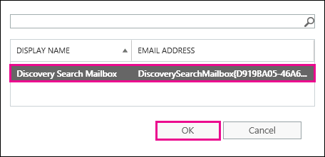

# Восстановление элементов, удаленных из почтового ящика пользователя

**Эта статья предназначена для администраторов. Вы пытаетесь восстановить удаленные элементы в вашем почтовом ящике?** Попробуйте выполнить одно из следующих действий:
- [Восстановление удаленных элементов в Outlook для Windows](https://support.office.com/article/49e81f3c-c8f4-4426-a0b9-c0fd751d48ce)
- [Восстановление удаленных элементов или электронной почты в Outlook Web App](https://support.office.com/article/c3d8fc15-eeef-4f1c-81df-e27964b7edd4)
- [Восстановление удаленных сообщений электронной почты в Outlook в Интернете](https://support.office.com/article/a8ca78ac-4721-4066-95dd-571842e9fb11)
- [Outlook.com.](https://go.microsoft.com/fwlink/p/?LinkID=623435)
   
Был ли пользователь навсегда удалять элементы из своего почтового ящика Outlook? Пользователь хочет выполнить эти функции, но не может их восстановить. Удаленные элементы могут быть восстановлены, если они не были окончательно удалены из почтового ящика пользователя. Это делается с помощью средства обнаружения электронных данных на месте в Exchange Online для поиска удаленных сообщений электронной почты и других элементов, таких как контакты, встречи календаря и задачи, в почтовом ящике пользователя. Если вы обнаружите удаленные элементы, их можно экспортировать в PST-файл (также называемый файлом данных Outlook), который пользователь может использовать для восстановления элементов обратно в свой почтовый ящик.
  
Ниже приведены действия по восстановлению удаленных элементов в почтовом ящике пользователя. Как долго будет выполняться эта проблема? В первый раз может потребоваться 20 или 30 минут, чтобы выполнить все действия в зависимости от количества элементов, которые вы пытаетесь восстановить.
  
> [!NOTE]
> Для выполнения действий, описанных в этой статье, необходимо быть **администратором Exchange** или **глобальным администратором** в Microsoft 365 или членом группы ролей Управление организацией в Exchange Online. Дополнительные сведения см. в статье [Роли администраторов в Microsoft 365](https://support.office.com/article/da585eea-f576-4f55-a1e0-87090b6aaa9d). 
  
## Шаг 1: назначение собственных разрешений на обнаружение электронных данных

Первый шаг — назначение себе необходимых разрешений в Exchange Online, чтобы можно было использовать средство обнаружения электронных данных на месте для поиска в почтовом ящике пользователя. Это потребуется сделать только один раз. Если вы хотите выполнить поиск в другом почтовом ящике в будущем, вы можете пропустить этот шаг.
  
1. [Где войти в Microsoft 365 для бизнеса](https://support.microsoft.com/office/where-to-sign-into-microsoft-365-for-business-e9eb7d51-5430-4929-91ab-6157c5a050b4) с помощью рабочей или учебной учетной записи. 
    
2. Выберите значок средства запуска приложений  в левом верхнем углу и щелкните **Администратор**.
    
3. В левой области навигации центра администрирования Microsoft 365 разверните узел **центры администрирования**и выберите **Exchange**.
    
    
  
4. В центре администрирования Exchange щелкните **разрешения**, а затем — **роли администратора**.
    
5. В представлении списка выберите **Управление обнаружением**, а затем щелкните **изменить**  .
    
    
  
6. В группе **члены** **группы ролей**щелкните **добавить**  .
    
7. В разделе **Выбор элементов**выберите в списке имя пользователя и нажмите кнопку **Добавить**, а затем нажмите кнопку **ОК**.
    
    > [!NOTE]
    > Вы также можете добавить группу, в которую вы являетесь участником, например "Управление организацией" или "Тенантадминс". При добавлении группы другим участникам этой группы будут назначены необходимые разрешения для запуска средства обнаружения электронных данных на месте. 
  
8. В **группе ролей**нажмите кнопку **сохранить**.
    
9. Выйдите из Microsoft 365.
    
    Необходимо выйти, прежде чем приступить к следующему шагу, чтобы новые разрешения вступили в силу.
    
> [!CAUTION]
> Члены группы ролей Управление обнаружением имеют доступ к конфиденциальному содержимому сообщений. Это включает поиск во всех почтовых ящиках в Организации, предварительный просмотр результатов поиска (и других элементов почтовых ящиков), копирование результатов в почтовый ящик обнаружения и экспорт результатов поиска в PST-файл. 
  
[Return to top](recover-deleted-items-in-a-mailbox.md)
  
## Шаг 2: Поиск удаленных элементов в почтовом ящике пользователя

При выполнении поиска с обнаружением электронных данных на месте в поиск автоматически включается папка "элементы с возможностью восстановления" в почтовом ящике, в котором выполняется поиск. Папка "элементы с возможностью восстановления" позволяет хранить безвозвратно удаленные элементы в почтовом ящике, пока они не будут очищены (окончательно удалены). Таким образом, если элемент не был очищен, вы можете найти его с помощью средства обнаружения электронных данных на месте.
  
1. [Где войти в Microsoft 365 для бизнеса](https://support.microsoft.com/office/where-to-sign-into-microsoft-365-for-business-e9eb7d51-5430-4929-91ab-6157c5a050b4) с помощью рабочей или учебной учетной записи. 
    
2. Выберите значок средства запуска приложений  в левом верхнем углу и щелкните **Администратор**.
    
3. В левой области навигации центра администрирования Microsoft 365 разверните узел **Администратор**и выберите пункт **Exchange**.
    
4. В центре администрирования Exchange выберите **Управление соответствием требованиям**, нажмите кнопку ** &amp; удержание электронных данных на месте**, а затем нажмите кнопку **создать**  .
    
    
  
5. На странице **имя и описание** введите имя для поиска (например, имя пользователя, для которого выполняется восстановление), необязательное описание, а затем нажмите кнопку **Далее**.
    
6. На странице **почтовые ящики** щелкните **указать почтовые ящики для поиска**, а затем щелкните **добавить**  .
    
    
  
7. Найдите и выберите имя пользователя, для которого восстанавливается Удаленная электронная почта, нажмите кнопку **Добавить**, а затем нажмите кнопку **ОК**.
    
8. Нажмите кнопку **Далее**.
    
    Отобразится страница **поискового запроса** . Здесь определяются критерии поиска, которые помогут найти отсутствующие элементы в почтовом ящике пользователя. 
    
9. На странице **Поисковый запрос** заполните следующие поля: 
    
  - **Включить все содержимое** Выберите этот параметр, чтобы включить все содержимое почтового ящика пользователя в результаты поиска. Если выбрать этот вариант, указать дополнительные критерии поиска будет невозможно. 
    
  - **Фильтрация на основе критериев** Выберите этот параметр, чтобы задать условия поиска, включая ключевые слова, начальную и конечную даты, адреса отправителей и получателей, а также типы сообщений. 
    
    
  
|**Field**|**Используйте это для...**|
|:-----|:-----|
|             |Укажите ключевые слова, диапазон дат, получателей и типы сообщений.    |
|             |Поиск сообщений с ключевыми словами или фразами, а также использование логических операторов, таких как **и** или **или**.    |
|             |Поиск сообщений, отправленных или полученных в диапазоне дат.    |
|             |Поиск сообщений, полученных или отправленных определенным пользователям.    |
|             |Выполните поиск по всем типам сообщений или выберите определенные.    |
   
   > [!TIP]
   >  Ниже приведено несколько советов по созданию поискового запроса для обнаружения отсутствующих элементов. Попытайтесь получить от пользователя больше сведений, чтобы помочь вам создать поисковый запрос, чтобы можно было найти нужную информацию. Если вы не знаете, как найти отсутствующее сообщение, рекомендуется использовать параметр **включить все содержимое** . В результаты поиска будут включены все элементы в папке "элементы с возможностью восстановления", включая скрытую папку (называемую папкой очистки), которая содержит элементы, удаленные пользователем. После этого вы можете перейти к шагу 3, скопировать результаты в почтовый ящик найденных сообщений и посмотреть на сообщение в скрытой папке. Если вы знаете приблизительно, когда сообщение было изначально отправлено или получено пользователем, используйте параметр **указать начальную дату** и **Укажите параметры даты окончания** , чтобы задать диапазон дат. Будут возвращены все сообщения, отправленные или полученные пользователем в пределах этого диапазона дат. Задание диапазона дат — это действительно хороший способ сужения результатов поиска. Если вы знаете, кто отправил недостающий адрес электронной почты, укажите этого отправителя с помощью поля " **от** ". Чтобы сузить результаты поиска по разным типам элементов почтовых ящиков, щелкните **выбрать типы сообщений**, выберите **типы сообщений для поиска**, а затем выберите тип сообщений для поиска. Например, вы можете выполнять поиск только для элементов календаря и контактов. Ниже приведен снимок экрана с различными типами сообщений, которые можно искать; по умолчанию выполняется поиск всех типов сообщений. 
  
   После завершения страницы **поискового запроса** нажмите кнопку **Далее** . 
    
10. На странице **Параметры хранения на месте** нажмите кнопку **Готово** , чтобы начать поиск. Чтобы восстановить удаленное сообщение, нет причин помещать почтовый ящик пользователя на удержание. 
    
    После запуска поиска Exchange будет отображать оценку общего размера и количества элементов, которые будут возвращены при поиске на основе указанных критериев.
    
11. Выберите только что созданный Поиск и щелкните **Обновить**  , чтобы обновить сведения, отображаемые в области сведений. Состояние **оценки SUCCEEDED** указывает на то, что Поиск завершен. Кроме того, в Exchange отображается оценка общего количества элементов (и их размера), которые были найдены в соответствии с условиями поиска, указанными на шаге 9. 
    
12. В области сведений щелкните **Предварительный просмотр результатов поиска** , чтобы просмотреть найденные элементы. Это может помочь вам определить интересующий вас элемент (ы). Если вы ищете элементы, которые вы пытаетесь восстановить, перейдите к шагу 4, чтобы экспортировать результаты поиска в PST-файл. 
    
    
  
13. Если вы не нашли то, что искали, вы можете изменить критерии поиска, выбрав поиск, щелкнув **изменить**  , а затем щелкнув **поисковый запрос**. Измените условия поиска и повторите поиск.
    
[Return to top](recover-deleted-items-in-a-mailbox.md)
  
## Необязательно Шаг 3: копирование результатов поиска в почтовый ящик обнаружения

Если вы не можете найти элементы, выполнив предварительный просмотр результатов поиска, или хотите узнать, какие элементы находятся в папке "элементы с возможностью восстановления", можно скопировать результаты поиска в специальный почтовый ящик (называемый почтовым ящиком обнаружения), а затем открыть этот почтовый ящик в Outlook в Интернете для просмотра фактических элементов. Лучше всего копировать результаты поиска, чтобы можно было просматривать элементы в папке "элементы с возможностью восстановления". Более вероятно, что восстанавливаемый элемент находится в вложенной папке "Очистка". 
  
1. В центре администрирования Exchange перейдите к разделу **Управление соответствием** для \> **обнаружения электронных &amp; данных на месте**.
    
2. В списке поиска выберите Поиск, созданный в шаге 2.
    
3. Нажмите **кнопку Поиск поиска**  и выберите команду **Копировать результаты поиска** из раскрывающегося списка. 
    
    
  
4. На странице **Копирование результатов поиска** нажмите кнопку **Обзор**.
    
    
  
5. В разделе **Отображаемое имя**щелкните **почтовый ящик поиска обнаружения**, а затем нажмите кнопку **ОК**.
    
    
  
    > [!NOTE]
    > Почтовый ящик поиска обнаружения это почтовый ящик обнаружения по умолчанию, который автоматически создается в организации Microsoft 365. 
  
6. Вернувшись на страницу **Копировать результаты поиска** , нажмите кнопку **Копировать** , чтобы начать процесс копирования результатов поиска в почтовый ящик поиска обнаружения. 
    
    
  
7. Нажмите кнопку **Обновить**  чтобы обновить информацию о состоянии копирования, отображаемую в области сведений. 
    
8. По завершении копирования нажмите кнопку **Открыть** , чтобы открыть почтовый ящик поиска обнаружения, чтобы просмотреть результаты поиска. 
    
    
  
    Результаты поиска, скопированные в почтовый ящик поиска обнаружения, помещаются в папку с таким же именем, что и при поиске с обнаружением электронных данных на месте. Для отображения элементов в этой папке можно щелкнуть папку.
    
    
  
    При выполнении поиска также выполняется поиск папки "элементы для восстановления" пользователя. Это означает, что если элементы в папке "элементы с возможностью восстановления" удовлетворяют критериям поиска, они включаются в результаты поиска. Элементы в папке "удаления" — это элементы, которые пользователь окончательно удалил (удалив элемент из папки "Удаленные" или выделив его и нажав клавиши **SHIFT + DELETE**. Пользователь может использовать средство восстановления удаленных элементов в Outlook или Outlook в Интернете для восстановления элементов в папке "удаления". Элементы в папке "очистки" — это элементы, которые пользователь удалил с помощью средства "восстановить удаленные элементы" или элементов, которые они автоматически очищают с помощью политики, примененной к почтовому ящику. В любом случае только администратор может восстановить элементы в папке "очистки". 
    
    > [!TIP]
    > Если пользователь не может найти удаленный элемент с помощью средства "элементы для восстановления", но этот элемент все еще можно восстановить (это означает, что он не был окончательно удален из почтового ящика), он, скорее всего, находится в папке "очистки". Поэтому проверьте папку очистки для удаленного элемента, который вы пытаетесь восстановить для пользователя. 
  
[Return to top](recover-deleted-items-in-a-mailbox.md)
  
## Шаг 4: экспорт результатов поиска в PST-файл

После того как вы найдете элемент, который вы пытаетесь восстановить для пользователя, выполните следующий шаг, чтобы экспортировать результаты из поиска, выполненного на шаге 2, в PST-файл. Пользователь будет использовать этот PST-файл на следующем шаге для восстановления удаленного элемента в своем почтовом ящике.
  
1. В центре администрирования Exchange перейдите к разделу **Управление соответствием** для \> **обнаружения электронных &amp; данных на месте**.
    
2. В списке поиска выберите Поиск, созданный в шаге 2.
    
3. Нажмите кнопку **Экспорт в PST-файл**.
    
    
  
4. Если вам будет предложено установить средство экспорта eDiscovery, нажмите кнопку **выполнить**.
    
5. В средстве экспорта в PST обнаружения электронных данных нажмите кнопку **Обзор** , чтобы указать расположение, в которое требуется скачать PST-файл. 
    
    
  
    Вы можете игнорировать параметры, чтобы включить дедупликацию и включить элементы, не включаемые в поиск.
    
6. Нажмите кнопку **Пуск** , чтобы скачать PST-файл на свой компьютер. 
    
    **Средство экспорта в PST обнаружения электронных** данных отображает сведения о состоянии процесса экспорта. По завершении экспорта можно получить доступ к файлу в том расположении, в котором он был загружен. 
    
[Return to top](recover-deleted-items-in-a-mailbox.md)
  
## Шаг 5: восстановление восстановленных элементов в почтовом ящике пользователя

Последним шагом является использование PST-файла, экспортированного в действии 4, для восстановления восстановленных элементов в почтовом ящике пользователя. Отправляя PST-файл пользователю, остальная часть этого шага выполняется пользователем для открытия PST-файла, а восстановленные элементы перемещаются в другую папку в своем почтовом ящике. Пошаговые инструкции также можно отправить пользователю ссылку на этот раздел: [Открытие и закрытие файлов данных Outlook (PST)](https://support.office.com/article/381b776d-7511-45a0-953a-0935c79d24f2). Вы также можете отправить пользователю ссылку на [Восстановление удаленных элементов в почтовый ящик с помощью следующего раздела PST-файла](recover-deleted-items-in-a-mailbox.md#restoredeleteditems) и попросите выполнить эти действия. 
  
 **Отправка PST-файла пользователю**
  
Последним шагом, который необходимо выполнить, является отправка PST-файла, экспортированного в действии 4, пользователю. Это можно сделать несколькими способами:
  
- Вложение PST-файла в сообщение электронной почты. Если приложение Outlook настроено на блокировку PST-файлов, необходимо добавить его в ZIP-файл, а затем вложить в сообщение. Вот как это сделать:
    
1. В проводнике Windows или проводнике перейдите к PST-файлу.
    
2. Щелкните файл правой кнопкой мыши и выберите команду **отправить в** \> **сжатую ZIP-папку**. Windows создает новый ZIP-файл и присваивает ему идентичное имя в качестве PST-файла.
    
3. Присоедините сжатый PST-файл к сообщению электронной почты и отправьте его пользователю, который затем может выполнить распаковку файла, щелкнув его.
    
- Скопируйте PST-файл в общую папку, к которой у пользователя есть доступ, и извлеките его.
    
Действия, описанные в следующем разделе, выполняются пользователем для восстановления удаленных элементов в их почтовые ящики.
  
 
**Восстановление удаленных элементов в почтовом ящике с помощью PST-файла**
  
Для восстановления удаленного элемента с помощью PST-файла необходимо использовать классическое приложение Outlook. Вы не можете открыть PST-файл с помощью Outlook Web App или Outlook в Интернете.
  
1. В Outlook 2013 или Outlook 2016 перейдите на вкладку **файл** . 
    
2. Нажмите кнопку **открыть &amp; Экспорт**, а затем выберите пункт **Открыть файл данных Outlook**.
    
3. Перейдите к папке, в которой сохранен PST-файл, отправленный администратором.
    
4. Выберите PST-файл и нажмите кнопку **Открыть**.
    
    PST-файл отображается в левой панели навигации Outlook.
    
    
  
5. Нажмите стрелку, чтобы развернуть PST-файл и папки под ним, чтобы определить, где находится элемент, который требуется восстановить.
    
    
  
    > [!TIP]
    > Просмотрите папку очистки для элемента, который требуется восстановить. Это скрытая папка, в которую перемещаются очищенные элементы. Вероятно, этот элемент был восстановлен администратором в этой папке. 
  
6. Щелкните правой кнопкой мыши элемент, который необходимо восстановить, а затем выберите **переместить** \> **другую папку**.
    
    
  
7. Чтобы переместить элемент в папку "Входящие", щелкните **папку Входящие**, а затем нажмите кнопку **ОК**.
    
    **Совет:** Чтобы восстановить другие типы элементов, выполните одно из следующих действий. 
    
  - Чтобы восстановить элемент календаря, щелкните его правой кнопкой мыши и выберите пункт **переместить** \> **другой** \> **Календарь**папки.
    
  - Чтобы восстановить контакт, щелкните его правой кнопкой мыши и выберите пункт **переместить** \> **других** \> **контактов**для папки.
    
  - Чтобы восстановить задачу, щелкните ее правой кнопкой мыши, а затем выберите пункт **переместить** \> **другие** \> **задачи**для папки.
    

  
   > [!NOTE]
   > Элементы календаря, контакты и задачи располагаются непосредственно в папке "очистки", а не в подпапке календаря, контактов или задач. Тем не менее, можно сортировать по **типу** , чтобы группировать похожие типы элементов. 
    
8. Завершив восстановление удаленных элементов, щелкните правой кнопкой мыши PST-файл на левой панели навигации и выберите команду **Закрыть "имя PST-файла"**.
    
[Return to top](recover-deleted-items-in-a-mailbox.md)
  
## Дополнительные сведения

- Пользователь может восстановить окончательно удаленный элемент, если срок хранения удаленных элементов для элемента не истек. Администратор может указать, как долго элементы в папке "элементы с возможностью восстановления" будут доступны для восстановления. Например, может быть политика, которая удаляет все элементы, которые находятся в папке "Удаленные" пользователя, в течение 30 дней, а другая политика, которая позволяет пользователям восстанавливать элементы в папке "элементы с возможностью восстановления" в течение еще чем 14 дней. Однако по истечении 14 дней вы можете восстановить элемент в почтовом ящике пользователя, выполнив процедуры, описанные в этом разделе.
    
- Пользователи могут восстановить удаленный элемент, если он не был окончательно удален, и если срок хранения удаленных элементов для этого элемента не истек. Чтобы помочь пользователям восстановить удаленные элементы почтового ящика, укажите один из следующих разделов:
    
  - [Восстановление удаленных элементов в Outlook для Windows](https://support.office.com/article/49e81f3c-c8f4-4426-a0b9-c0fd751d48ce)
    
  - [Восстановление удаленных элементов в Outlook 2010](https://support.office.com/article/cd9dfe12-8e8c-4a21-bbbf-4bd103a3f1fe)
    
  - [Восстановление удаленных элементов или электронной почты в Outlook Web App](https://support.office.com/article/c3d8fc15-eeef-4f1c-81df-e27964b7edd4)
    
  - [Восстановление удаленных сообщений электронной почты в Outlook в Интернете](https://support.office.com/article/a8ca78ac-4721-4066-95dd-571842e9fb11)
    
  - [Восстановление удаленного контакта в Outlook](https://support.office.com/article/51c83288-6888-4dcd-8c99-4932daabf643)
    
  - [Восстановление удаленных сообщений электронной почты в Outlook.com](https://go.microsoft.com/fwlink/p/?LinkID=623435)
    
[Return to top](recover-deleted-items-in-a-mailbox.md)
  

