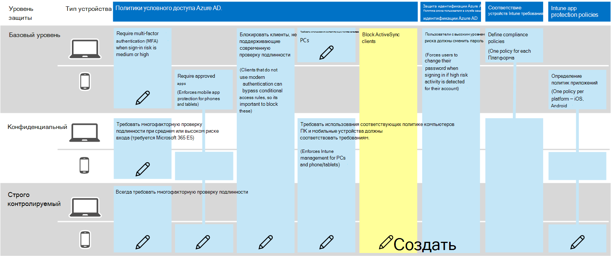

# Рекомендуемые политики для защиты электронной почтыPolicy recommendations for securing email

В этой статье описывается, как реализовать рекомендуемые политики удостоверений и доступа к устройствам для защиты электронной почты организации и почтовых клиентов, поддерживающих современные проверки подлинности и условный доступ.This article describes how to implement the recommended identity and device access policies to protect organizational email and email clients that support modern authentication and conditional access. Это руководство создает [Общие политики идентификации и доступа к устройствам](identity-access-policies.md) , а также включает несколько дополнительных рекомендаций.This guidance builds on the [Common identity and device access policies](identity-access-policies.md) and also includes a few additional recommendations.

Эти рекомендации основаны на трех различных уровнях безопасности и защиты, которые можно применять в зависимости от степени детализации ваших потребностей: **базовый**, **чувствительный**и **строго регулируемый**.These recommendations are based on three different tiers of security and protection that can be applied based on the granularity of your needs: **baseline**, **sensitive**, and **highly regulated**. Дополнительные сведения об этих уровнях безопасности и клиентских операционных системах, на которые указывают эти рекомендации, можно узнать в статье [Рекомендуемые политики безопасности и конфигурации](microsoft-365-policies-configurations.md).You can learn more about these security tiers, and the recommended client operating systems, referenced by these recommendations in the [recommended security policies and configurations introduction](microsoft-365-policies-configurations.md).

Для этих рекомендаций пользователям необходимо использовать современные почтовые клиенты, в том числе Outlook для iOS и Android на мобильных устройствах.These recommendations require your users to use modern email clients, including Outlook for iOS and Android on mobile devices. Outlook для iOS и Android обеспечивает поддержку лучших возможностей Office 365.Outlook for iOS and Android provide support for the best features of Office 365. Эти приложения для мобильных устройств Outlook также основаны на возможностях обеспечения безопасности, которые поддерживают использование мобильных устройств и работают совместно с другими функциями безопасности Microsoft Cloud.These mobile Outlook apps are also architected with security capabilities that support mobile use and work together with other Microsoft cloud security capabilities. Дополнительные сведения можно найти в статье [вопросы и ответы по Outlook для iOS и Android](https://docs.microsoft.com/exchange/clients-and-mobile-in-exchange-online/outlook-for-ios-and-android/outlook-for-ios-and-android-faq).For more information, see [Outlook for iOS and Android FAQ](https://docs.microsoft.com/exchange/clients-and-mobile-in-exchange-online/outlook-for-ios-and-android/outlook-for-ios-and-android-faq).

## Обновление общих политик для включения электронной почтыUpdating common policies to include email

На следующей схеме показаны общие политики идентификации и доступа к устройствам, а также указаны политики, которые необходимо обновить для защиты электронной почты.The following diagram illustrates the common identity and device access policies and indicates which policies need to be updated to protect email. Обратите внимание на добавление нового правила для Exchange Online для блокирования клиентов ActiveSync.Note the addition of a new rule for Exchange Online to block ActiveSync clients. Это приводит к принудительному использованию Outlook Mobile.This forces the use of Outlook mobile.

Если вы включили Exchange Online и Outlook в область политик при их настройке, вам потребуется создать новую политику, чтобы заблокировать только клиентов ActiveSync.If you included Exchange Online and Outlook in the scope of the policies when you set them up, you only need to create the new policy to block ActiveSync clients. Ознакомьтесь с политиками, приведенными в следующей таблице, и либо сделайте Рекомендуемые дополнения, либо подтвердите, что они уже включены.Review the policies listed in the following table and either make the recommended additions, or confirm that these are already included. Каждое правило связывается со связанными инструкциями по настройке в статье [Common Identity and Device Access Policies Policies](identity-access-policies.md) .Each rule links to the associated configuration instructions in the [Common identity and device access policies](identity-access-policies.md) article.

|Уровень защитыProtection level|ПолитикиPolicies|Дополнительные сведенияMore information|
|:---------------|:-------|:----------------|
|**Базовый уровень****Baseline**|[Требовать, чтобы риск входа в систему был *средним* или *высоким*Require MFA when sign-in risk is *medium* or *high*](identity-access-policies.md#require-mfa-based-on-sign-in-risk)|Включение Exchange Online в назначение облачных приложенийInclude Exchange Online in the assignment of cloud apps|
|        |[Блокировать клиенты, не поддерживающие современную проверку подлинностиBlock clients that don't support modern authentication](identity-access-policies.md#block-clients-that-dont-support-modern-authentication)|Включение Exchange Online в назначение облачных приложенийInclude Exchange Online in the assignment of cloud apps|
|        |[Определение политик защиты приложенийDefine app protection policies](identity-access-policies.md#high-risk-users-must-change-password)|Убедитесь, что Outlook включен в список приложений.Be sure Outlook is included in the list of apps. Обязательно обновите политику для каждой платформы (iOS, Android, Windows).Be sure to update the policy for each platform (iOS, Android, Windows)|
|        |[Требовать приложения, поддерживающие политики защиты приложений IntuneRequire apps that support Intune app protection policies](identity-access-policies.md#require-apps-that-support-intune-app-protection-policies)|Включение Exchange Online в список облачных приложенийInclude Exchange Online in the list of cloud apps|
|        |[Требовать использования соответствующих политике компьютеровRequire compliant PCs](identity-access-policies.md#require-compliant-pcs-but-not-compliant-phones-and-tablets)|Включение Exchange Online в список облачных приложенийInclude Exchange Online in list of cloud apps|
|        |[Блокировка клиентов ActiveSyncBlock ActiveSync clients](#block-activesync-clients)|Добавление новой политикиAdd this new policy| 
|**Конфиденциальный****Sensitive**|[Требовать, когда риск входа в систему *мал*, *средний* или *высокий*Require MFA when sign-in risk is *low*, *medium* or *high*](identity-access-policies.md#require-mfa-based-on-sign-in-risk)| Включение Exchange Online в назначение облачных приложенийInclude Exchange Online in the assignment of cloud apps|
|         |[Требовать соответствующие компьютеры *и* мобильные устройстваRequire compliant PCs *and* mobile devices](identity-access-policies.md#require-compliant-pcs-and-mobile-devices)|Включение Exchange Online в список облачных приложенийInclude Exchange Online in the list of cloud apps|
|**Строго регулируемый уровень****Highly regulated**|[*Всегда* требовать MFA*Always* require MFA](identity-access-policies.md#require-mfa-based-on-sign-in-risk)|Включение Exchange Online в назначение облачных приложенийInclude Exchange Online in the assignment of cloud apps|

## Блокировка клиентов ActiveSyncBlock ActiveSync clients

Эта политика запрещает клиентам ActiveSync обходить другие правила условного доступа.This policy prevents ActiveSync clients from bypassing other conditional access rules. Настройка правил применяется только к клиентам ActiveSync.The rule configuration applies only to ActiveSync clients. Выбрав **[параметр требовать политику защиты приложений](https://docs.microsoft.com/azure/active-directory/conditional-access/concept-conditional-access-grant#require-app-protection-policy)**, эта политика блокирует клиентов ActiveSync.By selecting **[Require app protection policy](https://docs.microsoft.com/azure/active-directory/conditional-access/concept-conditional-access-grant#require-app-protection-policy)**, this policy blocks ActiveSync clients. Подробные сведения о создании этой политики можно найти в этой политике: " [требовать политику защиты приложений для облачного доступа к облачному приложению с условным доступом](https://docs.microsoft.com/azure/active-directory/conditional-access/app-protection-based-conditional-access)".Details on creating this policy can be found in [Require app protection policy for cloud app access with Conditional Access](https://docs.microsoft.com/azure/active-directory/conditional-access/app-protection-based-conditional-access).

1. Выполните команду "шаг 2: Настройка политики условного доступа Azure AD для Exchange Online с помощью ActiveSync (EAS)" в [сценарии 1: приложения Office 365 требуют утвержденных приложений с политиками защиты приложений](https://docs.microsoft.com/azure/active-directory/conditional-access/app-protection-based-conditional-access#scenario-1-office-365-apps-require-approved-apps-with-app-protection-policies), что не позволяет клиентам Exchange ActiveSync использовать обычную проверку подлинности для подключения к Exchange Online.Follow "Step 2: Configure an Azure AD Conditional Access policy for Exchange Online with ActiveSync (EAS)" in [Scenario 1: Office 365 apps require approved apps with app protection policies](https://docs.microsoft.com/azure/active-directory/conditional-access/app-protection-based-conditional-access#scenario-1-office-365-apps-require-approved-apps-with-app-protection-policies), which prevents Exchange ActiveSync clients leveraging basic authentication from connecting to Exchange Online.

## Настройка шифрования сообщений в Office 365Setup Office 365 message encryption

Благодаря новым возможностям Microsoft 365 Message encryption (OME), которые используют функции защиты в Azure Information Protection, ваша организация может легко обмениваться защищенной электронной почтой с другими пользователями на любом устройстве.With the new Office 365 Message Encryption (OME) capabilities, which leverage the protection features in Azure Information Protection, your organization can easily share protected email with anyone on any device. Пользователи могут отправлять и получать защищенные сообщения с другими организациями Office 365, а также клиентами, не являющимися клиентами Office 365, с помощью Outlook.com, Gmail и других почтовых служб.Users can send and receive protected messages with other Office 365 organizations as well as non-Office 365 customers using Outlook.com, Gmail, and other email services.

Дополнительные сведения см. в статье [Настройка новых возможностей шифрования сообщений Office 365](https://support.office.com/article/set-up-new-office-365-message-encryption-capabilities-7ff0c040-b25c-4378-9904-b1b50210d00e).For more information, see [Set up new Office 365 Message Encryption capabilities](https://support.office.com/article/set-up-new-office-365-message-encryption-capabilities-7ff0c040-b25c-4378-9904-b1b50210d00e).

## Дальнейшие действияNext steps

[Узнайте о рекомендуемых политиках для защиты сайтов и файлов SharePointLearn about policy recommendations for securing SharePoint Sites and files](sharepoint-file-access-policies.md)
