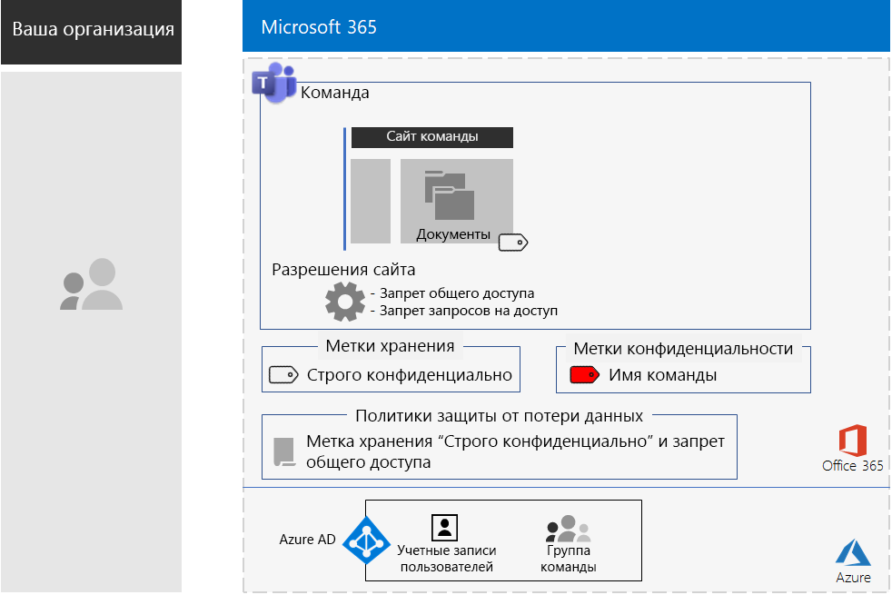
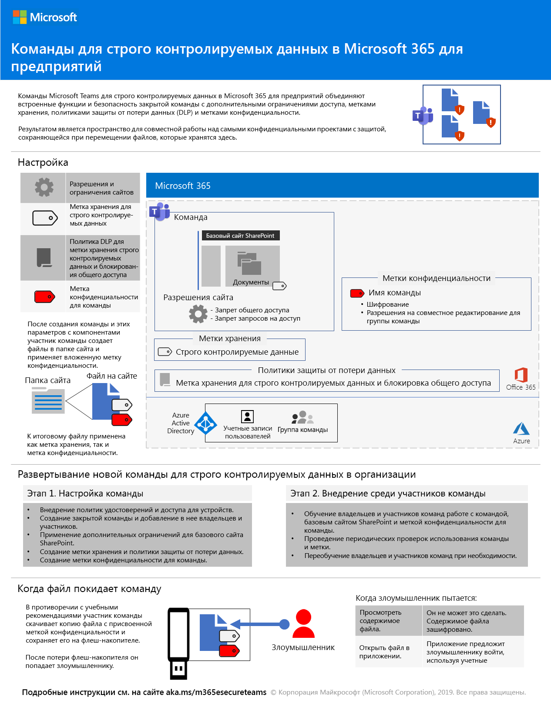
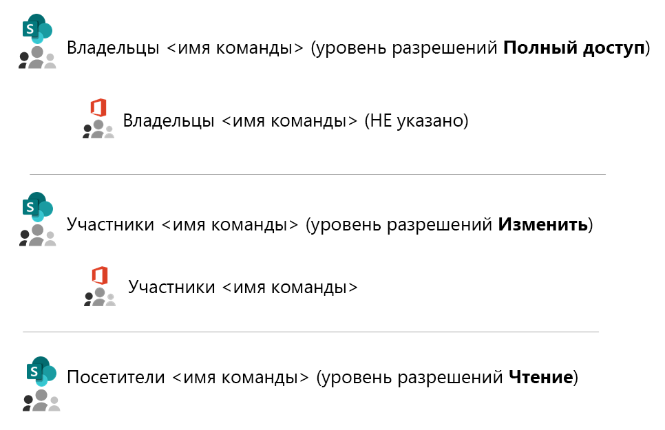
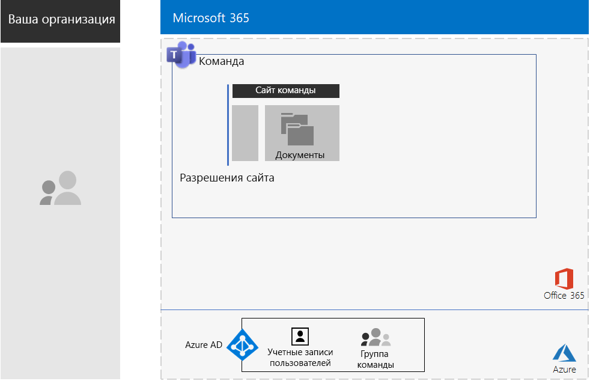
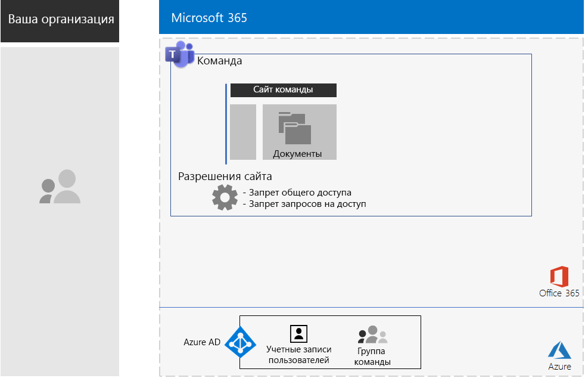
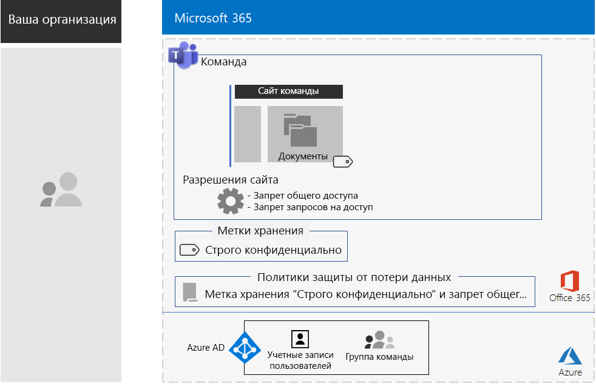
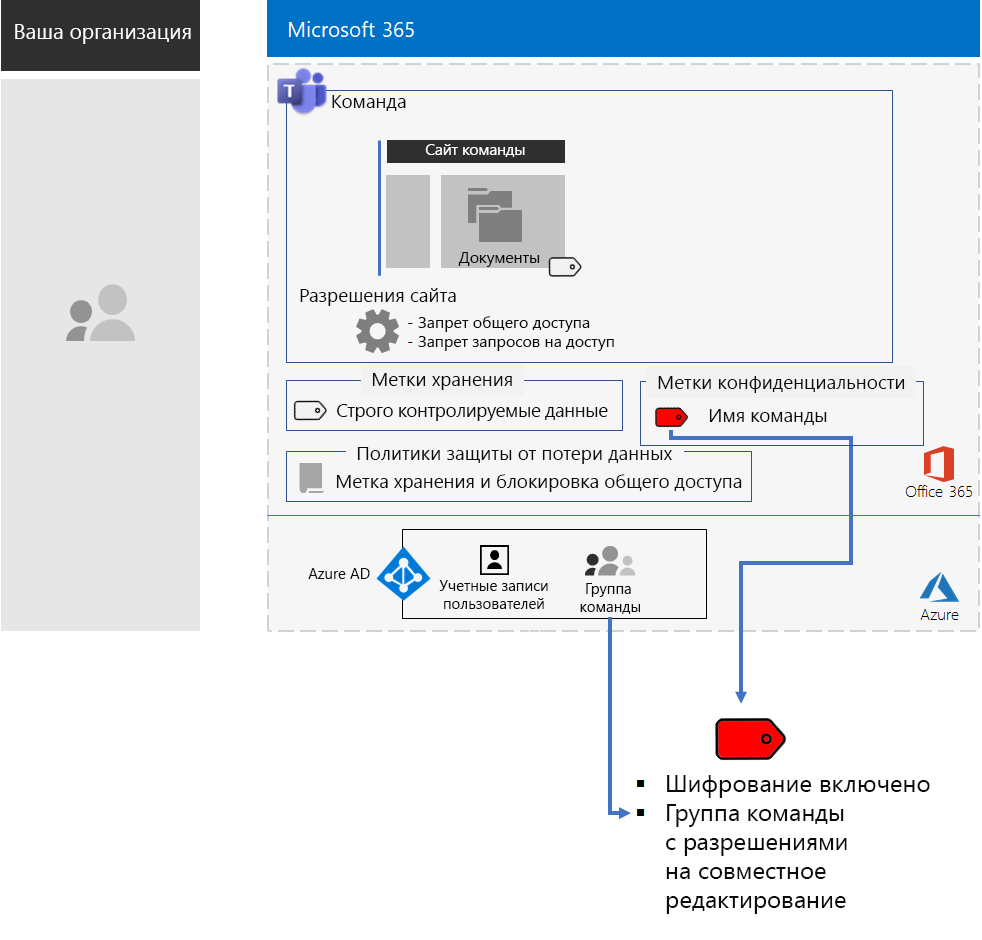
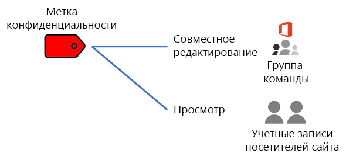
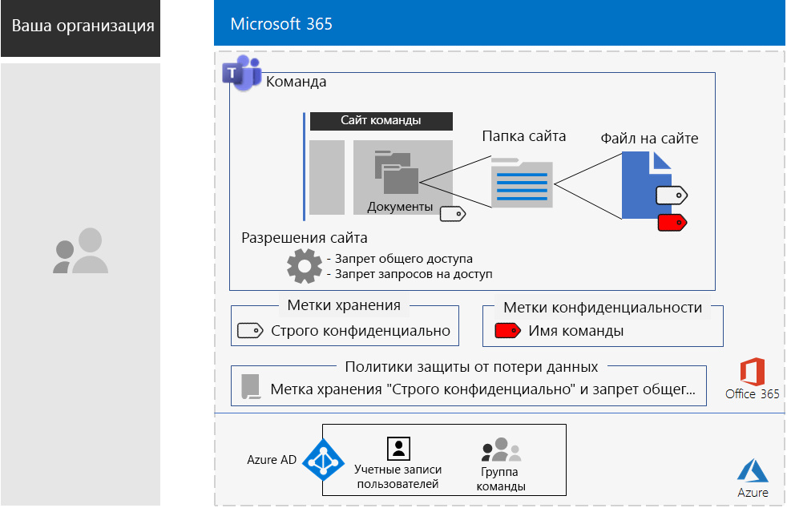

# Teams для строго регулируемых данныхTeams for highly regulated data

Эта статья содержит рекомендации и инструкции по настройке закрытой команды в Microsoft Teams, разрешающей доступ к функциям Teams, таким как чаты, собрания и файлы, только участникам и владельцам группы Office 365 команды.This article provides you with recommendations and steps to configure a private team in Microsoft Teams that locks down access to Teams features—such as chats, meetings, and files—to only members and owners of the Office 365 group for the team. 

Помимо закрытого доступа на основе группы Office 365, в этой статье описывается способ настройки базового закрытого сайта группы SharePoint, доступного из раздела **Файлы** канала команды. Это обеспечивает дополнительную защиту, требующуюся для хранения строго регулируемых данных.Beyond the private access based on the Office 365 group, this article describes how to configure the underlying private SharePoint team site, which you can access from the **Files** section of a team channel, for the additional security needed to store highly regulated data. На этом сайте группы SharePoint можно хранить файлы, страницы, общий календарь, задачи, записную книжку и списки, а также совместно работать над ними.On this SharePoint team site, you can store and collaborate on files, pages, a shared calendar, tasks, a notebook, and lists.

>[!Note]
> Похожий сценарий, в котором используется SharePoint, см. [здесь](teams-sharepoint-online-sites-highly-regulated-data.md).A similar scenario using Microsoft Teams is [here](teams-sharepoint-online-sites-highly-regulated-data.md).
>

Элементы настройки команды для работы со строго регулируемыми данными:The elements of configuration for a team for highly regulated data are:

- Закрытая команда с соответствующей группой Office 365, в которой есть учетные записи владельца и участника.A private team with a corresponding Office 365 group that has owner and member user accounts.
- Дополнительная защита на базовом сайте SharePoint для команды, которая:Additional security on the underlying SharePoint site for the team that:
  - запрещает предоставление участниками сайта доступа третьим лицам;Prevents members of the site from granting access to others.
  - блокирует запросы на доступ к сайту от лиц, которые не являются участниками сайта.Prevents non-members of the site from requesting access to the site.
- Метка хранения Office 365 для базового сайта SharePoint, автоматически применяющаяся к новым файлам сайта в качестве стандартного способа определения политик хранения.An Office 365 retention label for the underlying SharePoint site that is automatically applied to new files on the site as a default way to define retention policies.
- Политика защиты от потери данных (DLP), использующая метку хранения и блокирующая предоставление пользователями общего доступа к файлам или их отправку за пределы организации.A Data Loss Prevention (DLP) policy that uses the retention label and blocks users from sharing or sending files outside the organization.
- Метка конфиденциальности Office 365 или вложенная метка строго регулируемой метки с включенным шифрованием и разрешениями на совместное редактирование для группы Office 365 команды.An Office 365 sensitivity label or a sublabel of a highly regulated label that has encryption enabled and Co-Author permissions for the Office 365 group of the team. Пользователи применяют метку или вложенную метку к файлам, хранящимся в разделе **Файлы** команды, из параметра строки меню "Конфиденциальность" в Word, Excel и PowerPoint.Users apply the label or sublabel to files stored in **Files** section of the team from the Sensitivity menu bar option in Word, Excel, and PowerPoint.

Ниже показана итоговая конфигурация с меткой конфиденциальности.Here is the resulting configuration with a sensitivity label.

 Одностраничную сводку этого сценария см. на плакате [Teams для строго регулируемых данных](./media/secure-teams-highly-regulated-data-scenario/TeamsHighlyRegulatedData.pdf).For a 1-page summary of this scenario, see the [Teams for highly regulated data poster](./media/secure-teams-highly-regulated-data-scenario/TeamsHighlyRegulatedData.pdf).

[Плакат ](./media/secure-teams-highly-regulated-data-scenario/TeamsHighlyRegulatedData.pdf)

Вы также можете скачать этот плакат в формате [PDF](https://github.com/MicrosoftDocs/microsoft-365-docs/raw/public/microsoft-365/enterprise/media/secure-teams-highly-regulated-data-scenario/TeamsHighlyRegulatedData.pdf) и распечатать его на бумаге размера legal или tabloid (11 x 17).You can also download this poster in [PDF](https://github.com/MicrosoftDocs/microsoft-365-docs/raw/public/microsoft-365/enterprise/media/secure-teams-highly-regulated-data-scenario/TeamsHighlyRegulatedData.pdf) or PowerPoint formats and print it in letter, legal, or tabloid (11 x 17) formats.

## Этап 1. Настройка команды для строго регулируемых данныхPhase 1: Configure a team for highly regulated data

Полная настройка состоит из следующих этапов:The end-to-end configuration consists of these steps:

1. Настройка удостоверений и доступа для устройств.Configure identity and device access.
2. Создание закрытой команды.Create a private team.
3. Настройка базового сайта SharePoint для дополнительной безопасности.Configure the underlying SharePoint site for additional security.
4. Создание метки хранения и политики защиты от потери данных.Create a retention label and DLP policy.
5. Создание метки или вложенной метки для метки строго регулируемых данных.Create the label or sublabel of the highly regulated label.

### Шаг 1. Настройка удостоверений и доступа для устройствStep 1: Configure identity and device access

Чтобы защитить доступ к команде или ее базовому сайту SharePoint, убедитесь, что вы настроили [политики удостоверений и доступа для устройств](https://docs.microsoft.com/microsoft-365/enterprise/identity-access-policies), а также рекомендуемые [политики доступа к SharePoint Online](https://docs.microsoft.com/microsoft-365/enterprise/sharepoint-file-access-policies).To protect access to the team and its underlying SharePoint site, ensure that you have configured [identity and device access policies](https://docs.microsoft.com/microsoft-365/enterprise/identity-access-policies) and the recommended [SharePoint Online access policies](https://docs.microsoft.com/microsoft-365/enterprise/sharepoint-file-access-policies).

### Шаг 2. Создание закрытой командыStep 2: Create a private team

Чтобы создать закрытую команду, следуйте [инструкциям](https://support.office.com/article/create-a-team-from-scratch-174adf5f-846b-4780-b765-de1a0a737e2b).Use [these instructions](https://support.office.com/article/create-a-team-from-scratch-174adf5f-846b-4780-b765-de1a0a737e2b) to create a private team.

При создании закрытой команды применяются следующие разрешения по умолчанию:When you create a private team, here are the default permissions:

- Группа Office 365 для команды (группа команды) содержит владельцев и участников группThe Office 365 group for the team (the Team Group) has group owners and group members
- Для базового сайта SharePoint команды (сайт команды):For the underlying SharePoint site for the team (the Team Site):
  - Администраторы семейства веб-сайтов настроены в качестве владельцев группы командыThe Site Collection Administrators is configured for the Team Group owners
  - Для сайта команды:For the Team Site: 
    - Группа SharePoint владельцев сайта команды с уровнем разрешений "Полный доступ" настроена для владельцев группы командыThe Team Site Owners SharePoint group—with the Full Control permission level—is set to the Team Group owners
    - Группа SharePoint участников сайта команды с уровнем разрешений "Изменить" настроена для участников группы командыThe Team Site Members SharePoint group—with the Edit permission level—is set to the Team Group members
    - У группы SharePoint посетителей сайта команды с уровнем разрешений "Чтение" нет групп или учетных записей пользователейThe Team Site Visitors SharePoint group—with the Read permission level—has no groups or user accounts

Ниже представлены разрешения по умолчанию для сайта команды.Here are the default permissions for the Team Site.

 
>[!Note]
>Если вы просматриваете группу SharePoint владельцев \<имя команды> на наличие разрешений "Изменить", в ней не отображаются владельцы \<имя команды>.If you view the \<team name> Owners SharePoint group for the Edit permission level, it does not display \<team name> Owners.
>

Итоговые разрешения позволяют следующее:The resulting permissions allow:

- Владельцы группы команды могут администрировать сайт и обладают полным доступом к содержимому сайта.Team Group owners to administer the site and have full control over the site contents.
- Участники группы команды могут создавать и редактировать файлы на сайте.Team Group members to create and edit files on the site. 

Управление разрешениями аналогично управлению участниками и владельцами команды.Permissions maintenance is the same as team member and owner maintenance.

Ниже показана итоговая конфигурация на текущий момент.Here’s the resulting configuration so far.

 
### Шаг 3. Настройка базового сайта SharePoint для дополнительной безопасностиStep 3: Configure the underlying SharePoint site for additional security

Настройте следующие параметры разрешений на сайте команды.From the Team Site, configure these permission settings.

1. На панели инструментов щелкните значок параметров и выберите вариант **Разрешения для сайта**.In the tool bar, click the settings icon, and then click **Site permissions**.
2. В области **Разрешения для сайта** в разделе **Параметры общего доступа** щелкните **Изменить параметры общего доступа**.In the **Site permissions** pane, under **Sharing Settings**, click **Change sharing settings**.
3. В разделе **Разрешения на предоставление общего доступа** установите флажок **Только владельцы сайта могут делиться файлами, папками и сайтом**.Under **Sharing permissions**, choose **Only site owners can share files, folders, and the site**.
4. Отключите параметр **Разрешить запросы на доступ** и нажмите кнопку **Сохранить**.Turn off **Allow access requests**, and then click **Save**.

При выборе этих параметров отключается возможность для участников группы команды предоставлять общий доступ к сайту команды другим пользователям, а также возможность запрашивать доступ к сайту команды для лиц, не являющихся участниками.With these settings, the ability for Team Group members to share the Team Site with other members or for non-members to request access to the Team Site is disabled.

Ниже показана итоговая конфигурация на текущий момент.Here’s the resulting configuration so far.

 
### Шаг 4. Создание метки хранения и политики защиты от потери данныхStep 4: Create a retention label and DLP policy

Воспользуйтесь [этими инструкциями](https://docs.microsoft.com/microsoft-365/compliance/protect-sharepoint-online-files-with-office-365-labels-and-dlp) для следующих действий:Use [these instructions](https://docs.microsoft.com/microsoft-365/compliance/protect-sharepoint-online-files-with-office-365-labels-and-dlp) to:

1. Создание и публикация метки хранения для строго регулируемых данных (при необходимости).Create and publish a retention label for highly regulated data (if needed).
2. Настройка сайта команды для использования метки хранения, созданной на шаге 1.Configure the Team Site for the retention label created in step 1.
3. Создание политики защиты от потери данных для строго регулируемых данных, использующей метку хранения, созданную на шаге 2, и запрещающей пользователям отправлять файлы за пределы организации.Create a DLP policy for highly regulated data that uses the retention label created in step 2 and blocks users from sending files outside the organization. Кроме того, можно настроить политику для дополнительных требований, например для отраслевых норм здравоохранения и финансов, на основе [шаблонов политики DLP](https://docs.microsoft.com/microsoft-365/compliance/data-loss-prevention-policies#dlp-policy-templates).You can also configure the policy for additional requirements, such as those for health and financial industry regulations, based on [DLP policy templates](https://docs.microsoft.com/microsoft-365/compliance/data-loss-prevention-policies#dlp-policy-templates).

Ниже показана итоговая конфигурация на текущий момент.Here’s the resulting configuration so far.

 
### Шаг 5. Создание метки или вложенной метки для метки строго регулируемых данныхStep 5: Create the label or a sublabel of the highly regulated label

В отличие от метки конфиденциальности для строго регулируемых данных, которую любой пользователь может применить к любому файлу, защищенной команде требуется собственная метка или вложенная метка, чтобы файлы, которым она назначена:Unlike a sensitivity label for highly regulated data that anyone can apply to any file, a secure team needs its own label or sublabel so that assigned files:

- были зашифрованы и оставались зашифрованными при перемещении;Are encrypted and the encryption travels with the file.
- содержали настраиваемые разрешения, благодаря которым их могут открыть только участники группы команды.Contain custom permissions so that only members of the Team Group can open it.

Чтобы установить этот дополнительный уровень безопасности для файлов, хранящихся на сайте команды, требуется настроить новую метку конфиденциальности, являющуюся самостоятельной меткой или вложенной меткой для общей метки строго регулируемых файлов.To accomplish this additional level of security for files stored in the Team Site, you must configure a new sensitivity label that is either its own label a sublabel of the general label for highly regulated files. Только участники группы команды будут видеть ее в списке своих меток. Only Team Group members will see it in their list of labels.

Используйте метку конфиденциальности, если требуется небольшое число меток для общих и отдельных закрытых команд.Use a sensitivity label when you need a small number of labels for both global use and individual private teams. Используйте вложенную метку конфиденциальности, если у вас большое число меток или нужно упорядочить метки для закрытых команд под меткой строго регулируемых данных.Use a sensitivity sublabel when you have a large number of labels or want to organize labels for private teams under the highly regulated label.

[Используйте эти инструкции](https://docs.microsoft.com/microsoft-365/compliance/encryption-sensitivity-labels), чтобы настроить отдельную метку или вложенную метку со следующими параметрами:[Use these instructions](https://docs.microsoft.com/microsoft-365/compliance/encryption-sensitivity-labels) to configure a separate label or a sublabel with the following settings:

- имя метки содержит название команды;The name of the label contains the name of the team
- включено шифрование;Encryption is enabled
- группа команды имеет разрешения на совместное редактирование.The Team Group has Co-Author permissions

Ниже представлена итоговая конфигурация с новой меткой.Here’s the resulting configuration with the new label.

Ниже показаны отношения между метками конфиденциальности и группой команды.Here’s the relationship between the sensitivity label and the Team Group.

>[!Note]
>Если настроена метка или вложенная метка конфиденциальности для пользовательских разрешений или со сроком действия, вы не сможете открыть файл из Teams или SharePoint.If you configure the sensitivity label or sublabel for user-defined permissions or with an expiration date, you cannot open the file from Teams or SharePoint. Потребуется использовать приложение Office.You must use an Office app.
>

### Настраиваемые разрешенияCustom permissions

Вы также можете настроить собственные разрешения сайта SharePoint для сайта команды и соответствующую метку конфиденциальности при необходимости.You can also configure custom SharePoint site permissions for the Team Site and, if needed, its corresponding sensitivity label. Вот два примера.Here are two examples.

#### Пример 1. Делегирование администрирования сайта SharePointExample 1: Delegating SharePoint site administration

Если владелец команды не имеет опыта администрирования SharePoint или хочет делегировать управление сайтом команды, он может добавить учетную запись администратора SharePoint в список владельцев команды.If the team owner does not have SharePoint administration experience or wants to delegate administration of the Team Site, they could add the user account of a SharePoint administrator to the list of team owners. Но после этого администратор SharePoint получит полный доступ к команде и всем ее ресурсам и сможет открыть файл с примененной меткой конфиденциальности.But then the SharePoint administrator would have full access to the team and all its resources and would be able to open a file with the sensitivity label applied. 

Чтобы предотвратить такое предоставление избыточных разрешений, добавьте учетную запись администратора SharePoint в группу SharePoint владельцев сайта команды в разделе дополнительных разрешений для сайта.To prevent this over-granting of privileges, add the user account of the SharePoint administrator to the Team Site Owners SharePoint group in the advanced permissions settings of the site. Администратор SharePoint сможет управлять сайтом, но не сможет получить доступ к команде и ее ресурсам или открыть файлы с присвоенной меткой конфиденциальности.The SharePoint administrator can administer the site but will not be able to access the team and any of its resources or open the files with the sensitivity label assigned.

#### Пример 2. Предоставление доступа только для просмотра файлов с меткамиExample 2: Allowing view-only access to labeled files

Если некоторым сотрудникам требуется просматривать содержимое файлов с метками на сайте команды, добавьте их отдельные учетные записи пользователей в:If some staff only need to view the contents of labeled files in the Team Site, add their individual user accounts to the:

- группу SharePoint посетителей \<название команды>, по умолчанию имеющую уровень разрешений "Чтение";\<team name> Visitors SharePoint group, which by default has the Read permission level. 
- метку конфиденциальности с разрешениями для просмотра.The sensitivity label with the Viewer permissions.

Ниже представлены итоговые разрешения для метки.Here are the resulting permissions on the label.

 
Посетители сайта смогут напрямую получить доступ к сайту команды и просмотреть содержимое файлов с примененными вложенными метками.The site visitors will be able to access the Team Site directly and view the contents of files that have the sublabel applied. Но так как они не являются участниками группы команды, они не смогут получить доступ к команде и ее ресурсам.But because they are not members of the Team Group, they will not be able to access the team or any of its resources.

## Этап 2. Внедрение возможностей среди участников командыPhase 2: Drive user adoption for team members

После создания команды нужно обеспечить применение ее возможностей и дополнительной защиты для участников команды.With the team in place, it’s time to drive the adoption of this team and its additional security to team members.

### Шаг 1. Обучение пользователейStep 1: Train your users

Участники группы команды могут получить доступ к команде и всем ее ресурсам, включая чаты, собрания и другие приложения.Members of the Team Group can access the team and all of its resources, including chats, meetings, and other apps. При работе с файлами из раздела **Файлы** канала участники группы команды должны назначать метку конфиденциальности или вложенную метку файлам, создаваемым для защищенной команды.When working with files from the **Files** section of a channel, members of the Team Group must assign the sensitivity label or sublabel to files created for the secure team. Приведем пример.Here’s an example.

 
После применения метки к файлу он становится защищенным.When the label gets applied to the file it is secured. Участники группы команды могут открывать его в Teams и совместно работать с ним в режиме реального времени.Members of the Team Group can open it in Teams and collaborate in real time. Он зашифрован и содержит разрешения на совместное редактирование, настроенные для участников группы команды.It is encrypted and includes the Co-Author permissions set to the Team Group members. Если файл покидает сайт и пересылается злоумышленнику, ему потребуется предоставить учетные данные пользователя, являющегося участником группы команды, чтобы открыть его и просмотреть содержимое.If the file leaves the site and gets forwarded to a malicious user, they will have to supply credentials of a user account that is member of the Team Group to open the file and view its contents. 

Обучите участников команды, рассказав им:Train your team members:

- насколько важно использовать новую команду для чатов, собраний, файлов и других ресурсов сайта команды, а также о последствиях утечки жестко регламентированных данных, таких как юридические последствия, штрафные санкции за несоблюдение нормативно-правовых актов, появление программ-шантажистов или потеря конкурентного преимущества;On the importance of using the new team for chats, meetings, files, and the other resources of the Team Site and the consequences of a highly regulated data leak, such as legal ramifications, regulatory fines, ransomware, or loss of competitive advantage.
- как получить доступ к команде;How to access the team.
- как создавать файлы на сайте и отправлять новые файлы, которые хранятся локально;How to create new files on the site and upload new files stored locally.
- каким образом политика защиты от потери данных блокирует пользователей при попытке отправить файлы за пределы организации;How the DLP policy blocks them from sharing files externally.
- как пометить файлы с помощью настраиваемых меток или вложенных меток для команды;How to label files with the custom label or sublabel for the team.
- как метка или вложенная метка защищает файлы даже в случае их утечки с сайта.How the label or sublabel protects files even when they are leaked off the site.

В программу такого обучения следует включить практические занятия, где участники команды смогут опробовать эти возможности и ознакомиться с результатами.This training should include hands-on exercises so that your team members can experience these capabilities and their results.

### Шаг 2. Проведение периодических проверок использования и ответы на отзывы участников командыStep 2: Conduct periodic reviews of usage and address team member feedback

В последующие за обучением недели:In the weeks after training:

- Быстро рассмотрите отзывы участников команды и отрегулируйте политики и настройки.Quickly address team member feedback and fine tune polices and configurations.
- Проанализируйте использование команды и сравните результаты с требованиями к использованию.Analyze usage for the team and compare it with usage expectations.
- Убедитесь в правильном применении настраиваемых меток или вложенных меток конфиденциальности к строго регулируемым файлам.Verify that highly regulated files have been properly labeled with the custom sensitivity label or sublabel.

  Вы можете узнать, каким файлам присвоены метки, просмотрев папку в SharePoint и добавив столбец **Конфиденциальность** с помощью параметра **Показать/скрыть столбцы** элемента **Добавить столбец**.You can see which files have a label assigned by viewing a folder in SharePoint and adding the **Sensitivity** column through the **Show/hide columns** option of **Add column**.

При необходимости следует провести повторное обучение пользователей.Retrain your users as needed.

## См. такжеSee also

[Сайты SharePoint для строго регулируемых данныхSharePoint sites for highly regulated data](teams-sharepoint-online-sites-highly-regulated-data.md)

[Рабочие нагрузки и сценарии Microsoft 365 корпоративныйMicrosoft 365 Enterprise workloads and scenarios](deploy-workloads.md)

[Microsoft 365 Productivity Library](https://aka.ms/productivitylibrary) (https://aka.ms/productivitylibrary)[Microsoft 365 Productivity Library](https://aka.ms/productivitylibrary) (https://aka.ms/productivitylibrary)

[Руководство по развертываниюDeployment guide](deploy-microsoft-365-enterprise.md)
