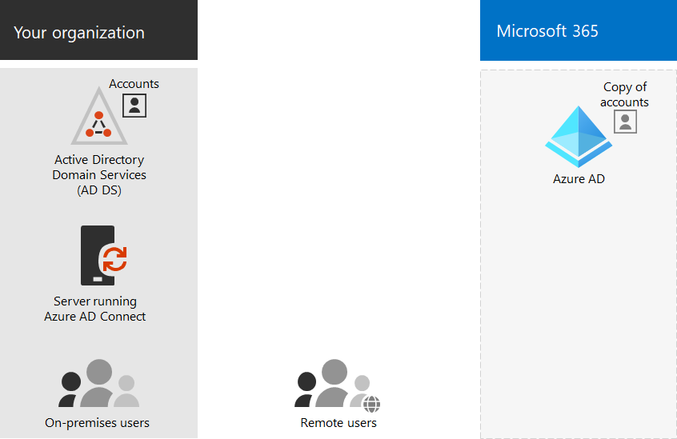

# Настройка синхронизации каталогов для Microsoft 365

*Эта статья относится к Microsoft 365 корпоративный и Office 365 корпоративный.*

Microsoft 365 клиент Azure Active Directory Azure AD для хранения и управления удостоверениями для проверки подлинности и разрешений для доступа к облачным ресурсам. 

Если у вас есть локальной доменной службы Active Directory (AD DS) домена или леса, вы можете синхронизировать учетные записи пользователей AD DS, группы и контакты с клиентом Azure AD вашей Microsoft 365 подписки. Это гибридное удостоверение для Microsoft 365. Ниже перечислены его компоненты.

Azure AD Connect запускается на локальном сервере и синхронизирует ваши доменные службы Active Directory с клиентом Azure AD. Одновременно с синхронизацией каталогов вы можете также задать приведенные ниже параметры проверки подлинности.

- Синхронизация хэша паролей (PHS)

  Проверка подлинности выполняется с помощью Azure AD.

- Сквозная проверка подлинности (PTA)

  Проверка подлинности выполняется с помощью доменных служб Aсtive Directory в Azure AD.

- Федеративная проверка подлинности

  Azure AD направляет клиентский компьютер, запрашивающий проверку подлинности, другому поставщику удостоверений.

Дополнительные сведения см. в статье [Гибридные удостоверения](plan-for-directory-synchronization.md).
  
## 1. Необходимые условия для Azure AD Connect

Вы получаете бесплатную подписку Azure AD с Microsoft 365 подпиской. При настройке синхронизации каталогов вы устанавливаете Azure AD Connect на одном из локальных серверов.
  
Для Microsoft 365 необходимо:
  
- Проверка локального домена. Мастер Azure AD Connect направляет этот процесс.
- Получение имен и паролей пользователей для учетных записей администратора Microsoft 365 клиента и AD DS.

Для локального сервера, на котором выполняется установка Azure AD Connect, вам потребуется
  
|**Серверная ОС**|**Другое ПО**|
|:-----|:-----|
|Windows Server 2012 R2 и более поздних версий | - PowerShell устанавливается по умолчанию; никаких действий не требуется.    - Net 4.5.1 и более поздние выпуски можно получить через Центр обновления Windows. На панели управления убедитесь в том, что установлены последние обновления для Windows Server. |
|Windows Server 2008 R2 с пакетом обновления 1 (SP1)** или Windows Server 2012 | - Последняя версия PowerShell доступна в составе платформы Windows Management Framework 4.0. Найти ее можно в [Центре загрузки Майкрософт](https://go.microsoft.com/fwlink/p/?LinkId=717996).    - .Net 4.5.1 и более поздние выпуски доступны в [Центре загрузки Майкрософт](https://go.microsoft.com/fwlink/p/?LinkId=717996). |
|Windows Server 2008 | Последняя поддерживаемая версия PowerShell доступна в составе платформы Windows Management Framework 3.0, которую можно найти в [Центре загрузки Майкрософт](https://go.microsoft.com/fwlink/p/?LinkId=717996).    - .Net 4.5.1 и более поздние выпуски доступны в [Центре загрузки Майкрософт](https://go.microsoft.com/fwlink/p/?LinkId=717996). |

Более подробно ознакомиться с требованиями к оборудованию, программному обеспечению, учетным записям, разрешениям и SSL-сертификатам, а также с ограничениями на объекты для Azure AD Connect можно в статье [Необходимые условия для Azure AD Connect](/azure/active-directory/hybrid/how-to-connect-install-prerequisites).
  
Вы также можете ознакомиться с [журналом выпуска версий](/azure/active-directory/hybrid/reference-connect-version-history) Azure AD Connect, чтобы выяснить, что добавилось или было исправлено в каждой версии.

## 2. Установка Azure AD Connect и настройка синхронизации каталогов.

Перед началом вам необходимо иметь

- Имя пользователя и пароль глобального Microsoft 365 администратора
- Имя пользователя и пароль администратора доменных служб Active Directory
- Метод проверки подлинности (синхронизация хэша паролей, сквозная или федеративная)
- Либо [Простой единый вход Azure AD](/azure/active-directory/hybrid/how-to-connect-sso) по вашему желанию.

Выполните приведенные ниже действия.

1. Войдите в [Центр администрирования Microsoft 365](https://admin.microsoft.com) https://admin.microsoft.com)и в области навигации слева выберите пункты **Пользователи** \> **> Активные пользователи**.
2. На странице **Активные пользователи** выберите **синхронизацию каталога More** (три \> **точки).**
  
3. На странице **подготовки Azure Active Directory** выберите Перейти в центр загрузки, чтобы получить ссылку на средство **Azure AD Подключение** для начала работы. 
4. Выполните действия в статье [План установки Azure AD Connect и Azure AD Connect Health](/azure/active-directory/hybrid/how-to-connect-install-roadmap).

## 3. Завершение настройки доменов

Следуйте шагам в создании записей DNS для Microsoft 365, когда вы управляете записями [DNS,](/office365/admin/get-help-with-domains/create-dns-records-at-any-dns-hosting-provider) чтобы завершить настройку доменов.

## Следующий этап

[Назначение лицензий учетным записям пользователей](assign-licenses-to-user-accounts.md)