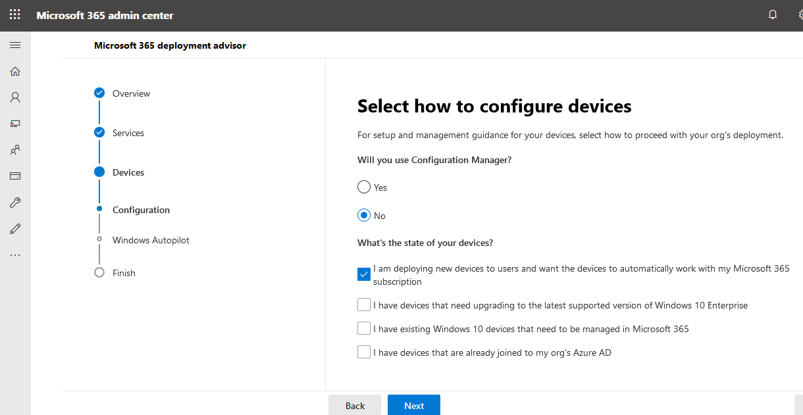

# Руководства по настройке для служб Microsoft 365 и Office 365

Руководства по настройке Microsoft 365 и Office 365 дают вам специализированные рекомендации и ресурсы по планированию и развертыванию клиента, приложений и служб. Эти руководства создаются с использованием тех же лучших методик, что и специалисты по подбору Microsoft [365 FastTrack](https://www.microsoft.com/fasttrack/microsoft-365) при индивидуальном взаимодействии, и они доступны всем администраторам в Центре администрирования Microsoft 365. Они предоставляют сведения о настройке продукта, включая функции безопасности, развертывая средства совместной работы, а также скрипты для ускорения расширенных развертывание.

## Доступ к руководствам по настройке в Центре администрирования Microsoft 365

Руководства по настройке доступны на [странице](https://aka.ms/setupguidance) рекомендаций по установке в Центре администрирования Microsoft 365. Вы можете отслеживать состояние хода выполнения, и у вас есть возможность вернуться в любое время, чтобы завершить руководство. Чтобы добиться страницы **рекомендаций по установке:**

1. В Центре [администрирования Microsoft 365](https://admin.microsoft.com/)перейдите на страницу **"Главная".**

2. Найдите **карточку & учебных руководств.** 

   

3. Выберите **руководство по настройке.**

   

>[!NOTE]
>Для доступа к Центру администрирования Microsoft 365 требуются разрешения администратора клиента.

## Как работают руководства по настройке в Центре администрирования Microsoft 365?

Каждое руководство содержит пошаговую инструкцию, ресурсы, статьи и сценарии, которые можно использовать для внесения изменений в конфигурацию. В этих руководствах вы можете выбирать варианты, которые отражают конкретные потребности как малых, так и крупных организаций. Кроме того, руководство включает помощь как для новых, так и для опытных администраторов.

Вы можете использовать эти руководства, чтобы получить дополнительные информацию о конкретных функциях Microsoft 365 и Office 365 на этапе планирования, во время развертывания и развертывания, или вернуться к ним после завершения развертывания, чтобы изменить параметр.

## Руководства по начальной настройке

### Подготовка среды

Руководство [по подготовке среды](https://aka.ms/prepareyourenvironment) поможет вам подготовить среду организации к службам Microsoft 365 и Office 365. Независимо от ваших целей, для успешного развертывания необходимо выполнить ряд задач. Чтобы избежать ошибок при подготовке среды, вам предоставляются пошагные инструкции по подключению домена, добавлению пользователей, назначению лицензий, установке и развертыванию приложений Office. 

### Помощник по настройке электронной почты

Помощник [по настройке электронной](https://aka.ms/office365setup) почты предоставляет пошаговую инструкцию по настройке Exchange Online для вашей организации. Это включает настройку новых учетных записей электронной почты, перенос электронной почты и настройку защиты электронной почты. Чтобы успешно настроить электронную почту, используйте этого помощника, и вы получите рекомендуемый способ миграции в зависимости от текущей почтовой системы организации, количества переносимых почтовых ящиков и способа управления пользователями и их доступом.

### Перенос контактов Gmail и элементов календаря

При переносе почтового ящика пользователя Gmail в Microsoft 365 сообщения электронной почты переносят, а контакты и элементы календаря — нет. Контакты [Gmail](https://aka.ms/gmailcontactscalendar) и помощник по календарю предоставляют шаги для импорта контактов Google и элементов календаря Google в Microsoft 365 с помощью методов импорта и экспорта с помощью Outlook.com, клиента Outlook или PowerShell.

### Помощник по развертыванию Microsoft 365

Помощник [по развертыванию Microsoft 365](https://aka.ms/microsoft365setupguide) предоставляет рекомендации по настройке средств повышения производительности, политик безопасности и возможностей управления устройствами. С помощью подписки Microsoft 365 бизнес премиум или Microsoft 365 для предприятий вы можете использовать этого консультанта для настройки устройств организации. 

Вы получите инструкции и доступ к ресурсам, чтобы включить облачные службы, обновить устройства до последней поддерживаемой версии Windows 10 и присоединить устройства к Azure Active Directory (Azure AD) в одном центральном расположении.

### Руководство по настройке удаленной работы

Руководство [по настройке](https://aka.ms/remoteworksetup) удаленной работы предоставляет организациям советы и ресурсы, необходимые для обеспечения успешной работы пользователей в удаленном режиме, защиты данных и защиты учетных данных пользователей. 

Вы получите инструкции по оптимизации трафика устройств удаленных сотрудников как к ресурсам Microsoft 365 в облаке, так и к сети вашей организации, что позволит снизить нагрузку на инфраструктуру VPN удаленного доступа. 

### Руководство по настройке виртуального рабочего стола Windows

Виртуальный рабочий стол Windows — это комплексная служба виртуализации компьютеров и приложений, запущенная в облаке. Это единственная инфраструктура виртуальных рабочих стола (VDI), которая обеспечивает упрощенное управление, много сеансы Windows 10, оптимизацию приложений Microsoft 365 и поддержку сред служб удаленных рабочих стола (RDS). Развертывание и масштабирования компьютеров и приложений Для Windows в Azure за несколько минут, а также встроенные функции обеспечения безопасности и соответствия требованиям. 

Руководство [по настройке](https://aka.ms/wvdsetupguide) виртуального рабочего стола Windows предоставляет администраторам ресурсы по планированию и предварительные условия для развертывания, руководство по настройке и дополнительные ресурсы. 

### Руководство по настройке Microsoft Edge

Microsoft Edge был перестроен с нуля для обеспечения совместимости и производительности мирового класса, безопасности и конфиденциальности, которые вы заслуживающий внимания, а также новых функций, предназначенных для обеспечения наилучшего использования интернета.

Руководство по настройке [Microsoft Edge](https://aka.ms/edgeadvisor) поможет вам настроить enterprise Site Discovery, чтобы узнать, какие сайты, к которым требуется получить доступ в организации, использовать режим IE, просмотреть и настроить важные функции безопасности, настроить политики конфиденциальности и дополнительные политики для удовлетворения требований организации и управлять веб-доступом на устройствах. Вы можете скачать Microsoft Edge на отдельные устройства или мы покажем, как развернуть microsoft Intune на нескольких пользователях в вашей организации. 

### Руководство по настройке Поиска (Майкрософт)

Поиск (Майкрософт) помогает вашей организации найти необходимые условия для выполнения своей работы. Независимо от того, ищет ли она людей, файлы, организационные диаграммы, сайты или ответы на распространенные вопросы, ваша компания может использовать Поиск (Майкрософт) в течение всего рабочего дня для получения ответов.

Руководство [по настройке Поиска](https://aka.ms/MicrosoftSearchSetup) (Майкрософт) поможет вам настроить Поиск (Майкрософт) независимо от того, хотите ли вы пилотировать его для группы пользователей или для всех пользователей в организации. Вы назначите администраторов поиска и редакторы поиска, а затем настроите интерфейс поиска для пользователей с помощью ответов и дополнительных параметров, таких как добавление расширения Bing в Chrome или настройка Bing в качестве поисковой системы по умолчанию.

### Руководство по настройке совместного управления Intune Configuration Manager

Используйте руководство по совместному управлению [Intune Configuration Manager](https://aka.ms/comanagementsetup) для существующих клиентских устройств Configuration Manager и новых интернет-устройств, которые ваша компания хочет совместно управлять как с Microsoft Intune, так и с Configuration Manager. Это руководство по совместному управлению позволяет управлять устройствами с Windows 10 и добавляет новые функции на устройства вашей организации, получая при этом преимущества обоих решений.

## Руководства по проверке подлинности и доступу

### Руководство по настройке Azure AD

Руководство [по настройке Azure AD предоставляет](https://aka.ms/aadpguidance) сведения, гарантирующие, что ваша организация имеет прочную основу безопасности. В этом руководстве вы настроите начальные функции, такие как управление доступом на основе ролей Azure (Azure RBAC) для администраторов, Azure AD Connect для локального каталога и Azure AD Connect Health, чтобы отслеживать состояние гибридного удостоверения во время автоматической синхронизации. 

Кроме того, в нем содержатся важные сведения о включаемом самостоятельном сбросе паролей, условном доступе и интегрированном входе сторонних пользователей, включая дополнительную дополнительную защиту идентификации и автоматизацию пользовательской подготовка.

### Синхронизация пользователей из каталога организации

Пользователи [синхронизации из мастера](https://aka.ms/directorysyncsetup) каталогов вашей организации посетют вам включение синхронизации каталогов. Это упрощает доступ к локальной и облачной удостоверениям и упрощает управление ими. Разблокировка новых возможностей, таких как единый вход, варианты самостоятельного обслуживания, автоматическая подготовка учетных записей, средства контроля условного доступа и политики соответствия требованиям. Это гарантирует, что ваши пользователи будут иметь доступ к нужным ресурсам из любого места.

### Планирование развертывания без паролей

Переходить к альтернативному подходу для входов, который позволяет пользователям безопасно получать доступ к своим устройствам с помощью одного из следующих способов проверки подлинности без пароля: 

- Windows Hello для бизнеса
- Приложение Microsoft Authenticator
- Ключи безопасности 

Используйте мастер [планирования развертывания](https://aka.ms/passwordlesssetup) без паролей, чтобы найти лучшие способы проверки подлинности без пароля и получить инструкции по их развертыванию. 

### Планирование развертывания самостоятельного сброса паролей (SSPR)

Предопределение возможности независимого изменения или сброса пароля пользователями, если их учетная запись заблокирована, или они забывают свой пароль без необходимости обращаться к инженеру в helpdesk. 

Используйте мастер [самостоятельного](https://aka.ms/SSPRSetupGuide) сброса пароля для получения соответствующих статей и инструкций по настройке соответствующих параметров портала Azure, которые помогут вам развернуть SSPR в вашей среде.

### Помощник по развертыванию служб федерации Active Directory (AD FS)

Помощник по развертыванию [AD FS](https://aka.ms/adfsguidance) предоставляет пошаговые инструкции по развертыванию локальной инфраструктуры AD FS, которая обеспечивает проверку подлинности пользователей для служб Microsoft 365 и Office 365. С помощью этого руководства ваша организация может просмотреть компоненты и требования AD FS, приобрести и установить SSL-сертификаты, необходимые для развертывания, и установить необходимый прокси-сервер веб-приложения. 

## Руководства по безопасности и обеспечению соответствия требованиям

### Руководство по настройке Microsoft Intune 

Настройка Microsoft Intune для управления устройствами в организации. Для полного контроля корпоративных устройств вы будете использовать функции управления мобильными устройствами (MDM) Intune. Для управления данными организации на общих и личных устройствах можно использовать функции управления мобильными приложениями (MAM) Intune. 

С помощью руководства по настройке [Microsoft Intune](https://aka.ms/intunesetupguide)вы настроите политики соответствия устройств и приложений, назначьте политики защиты приложений и отслеживайте состояние защиты устройств и приложений. 

### Помощник По Защитнику Майкрософт для конечных точек

Помощник [По Microsoft Defender для конечных точек](https://aka.ms/mdatpsetup) предоставляет инструкции, которые помогут вашей корпоративной сети предотвращать, обнаруживать, исследовать и реагировать на сложные угрозы. Проинформайте об уязвимости организации и определите, какой пакет развертывания и методы настройки лучше всего использовать. 

>[!NOTE]
>Для конечной точки Microsoft Defender требуется лицензия на microsoft Volume License.

### Руководство по настройке Exchange Online Protection

Microsoft Exchange Online Protection (EOP) — это облачная служба фильтрации электронной почты для защиты от нежелательной почты и вредоносных программ с функциями для защиты организации от нарушений политики обмена сообщениями. 

Используйте руководство по настройке [Exchange Online Protection,](https://aka.ms/EOPguidance) чтобы настроить EOP, выбрав, какой из трех сценариев развертывания подходит для локального почтового ящика, гибридных (с использованием локального и облачного) почтовых ящиков или всех облачных почтовых &mdash; ящиков. &mdash; В этом руководстве содержится информация и ресурсы для настройки и проверки лицензирования пользователей, назначения разрешений в Центре администрирования Microsoft 365 и настройки политик защиты от вредоносных программ и нежелательной почты в Центре безопасности & соответствия требованиям. 

### Помощник По Microsoft Defender для Office 365

Помощник [По Microsoft Defender для Office 365](https://aka.ms/oatpsetup) защищает организацию от вредоносных угроз, которые могут возникнуть в вашей среде с помощью сообщений электронной почты, ссылок и средств для совместной работы сторонних организаций. Это руководство содержит ресурсы и сведения, которые помогут вам подготовить и определить план Защитника office 365 в случае потребностей вашей организации. 

### Руководство по настройке Защиты информации (Майкрософт)

Получите обзор возможностей, которые можно применить к стратегии защиты информации, чтобы быть уверенными в том, что ваша конфиденциальную информацию защищена. Используйте подход с жизненным циклом из четырех этапов, на которых вы обнаруживаете, классифицируете, защищаете и отслеживаете конфиденциальные сведения. Руководство по настройке Защиты [информации (Майкрософт)](https://aka.ms/mipsetupguide) содержит рекомендации по выполнению каждого из этих этапов.

### Руководство по настройке управления сведениями Майкрософт

В  руководстве по настройке управления сведениями Майкрософт содержится информация, необходимая для настройки стратегии управления организацией и управления ими, чтобы обеспечить классификацию и управление данными в соответствии с определенными рекомендациями жизненного цикла, которые вы настроили. В этом руководстве вы узнаете, как создавать, автоматически применять или публиковать метки, политики меток и политики хранения, применяемые к повторному контенту и записям соответствия требованиям в организации. Вы также получите сведения об импорте CSV-файлов с планом пакетных сценариев или их применении вручную к отдельным документам. 

## Руководства по совместной работе

### Помощник по развертыванию приложений Microsoft 365

Помощник [по развертыванию приложений Microsoft 365](https://aka.ms/OPPquickstartguide) поможет вам получить устройства пользователей с последней версией продуктов Office, таких как Word, Excel, PowerPoint и OneNote. Вы получите руководство по различным методам развертывания, которые включают простые средства самостоятельной установки в корпоративные развертывания с помощью средств управления. Эти инструкции помогут вам оценить среду, определить конкретные требования к развертыванию и внедрить необходимые средства поддержки для успешной установки. 

### Руководство по настройке мобильных приложений

Руководство [по настройке мобильных](https://aka.ms/officeappguidance) приложений содержит инструкции по загрузке и установке приложений Office на мобильных устройствах с Windows, iOS и Android. Это руководство содержит пошаговую информацию для скачивания и установки приложений Microsoft 365 и Office 365 на телефонах и планшетах.

### Руководство по настройке Microsoft Teams

Руководство по [настройке Microsoft Teams](https://aka.ms/teamsguidance) предоставляет вашей организации руководство по настройке рабочей области группы, в котором будут проводиться беседы в режиме реального времени с помощью обмена сообщениями, звонков, аудио- или видеособрания для связи как с командой, так и с помощью личных коммуникаций. Вы получите инструкции по определению сетевых требований организации с помощью средства планировщика сети и помощника Teams в Центре администрирования Teams. Завершив развертывание, вы найдете в руководстве полезные ресурсы по началу использования Teams.

### Руководство по настройке SharePoint

Руководство по настройке [SharePoint](https://aka.ms/spoguidance) поможет вам настроить хранилище документов и управление контентом SharePoint, создать сайты, настроить внешний общий доступ, перенести данные и настроить дополнительные параметры, а также активировать пользователей и обмениваться данными в организации. Вы выполните действия по настройке политик разрешений общего доступа к контенту, выберите средства синхронизации миграции, а также встроите параметры безопасности для среды SharePoint. 

### Руководство по настройке OneDrive

Используйте руководство [по настройке OneDrive для](https://aka.ms/ODfBquickstartguide) начала работы с хранилищем файлов OneDrive, возможностью общего доступа, совместной работы и синхронизации. OneDrive предоставляет централизованное расположение, в котором пользователи могут синхронизировать свои файлы приложений Microsoft 365, настроить внешний общий доступ, перенести данные пользователей и настроить дополнительные параметры безопасности и доступа к устройствам. Руководство по настройке OneDrive можно развернуть с помощью подписки на OneDrive или с помощью плана oneDrive. 

### Помощник по развертыванию Yammer

Подключите Yammer к Yammer и взаимодействовайте с ним во всей организации. Помощник [по развертыванию Yammer](https://aka.ms/yammerdeploymentguide) подготавливает сеть Yammer, добавляя домены, определяя администраторов и объединяя сети Yammer. Вы получите инструкции по развертыванию Yammer, а затем настроим внешний вид, настроим безопасность и соответствие требованиям, а также уточните параметры.

## Расширенные мастера

### Обновление на месте с помощью Configuration Manager

Используйте руководство [по обновлению](https://aka.ms/win10upgradedemo) на месте с помощью Configuration Manager при обновлении устройств с Windows 7 и Windows 8.1 до последней версии Windows 10. Вы будете использовать предоставленный сценарий для проверки необходимых условий и автоматической настройки обновления на месте.

### Развертывание Office для пользователей

Развертывание приложений Office из облака с возможностью настройки установки с помощью средства развертывания Office. Руководство [по развертыванию Office ](https://aka.ms/proplusodt) для пользователей поможет вам создать настраиваемую конфигурацию Office с дополнительными настройками или использовать встроенную рекомендуемую конфигурацию. Независимо от того, проводите ли пользователи самоустановку или развертываетсяе для пользователей по отдельности или массово, этот расширенный мастер предоставляет вам пошаговые инструкции, чтобы предоставить пользователям установку Office, адаптированную для вашей организации.

### Развертывание Office для удаленных пользователей

Теперь, когда удаленная работа является нормой, пользователям необходимо получать параметры Office вашей организации, если они не подключены к внутренней сети или при использовании собственных устройств. 

Используйте руководство [по развертыванию Office](https://aka.ms/officeremoteinstall) для удаленных пользователей, чтобы создать настроенную установку Office, а затем отправьте пользователям созданный сценарий PowerShell, который легко установит Office с вашей конфигурацией.

### Развертывание и обновление приложений Microsoft 365 с помощью Configuration Manager

Организации, использующие Configuration Manager, могут использовать помощник по развертыванию и обновлению приложений [Microsoft 365](https://aka.ms/oppinstall) с помощью помощника Configuration Manager, чтобы создать сценарий, который автоматически настроит развертывание приложений Microsoft 365, используя рекомендации, рекомендованные инженерами FastTrack. Используйте это руководство для создания групп развертывания, настройки приложений и компонентов Office, настройки динамических или нестрогих установок, а затем запуска скрипта для создания приложений, правил автоматического развертывания и коллекций устройств, необходимых для развертывания. 
