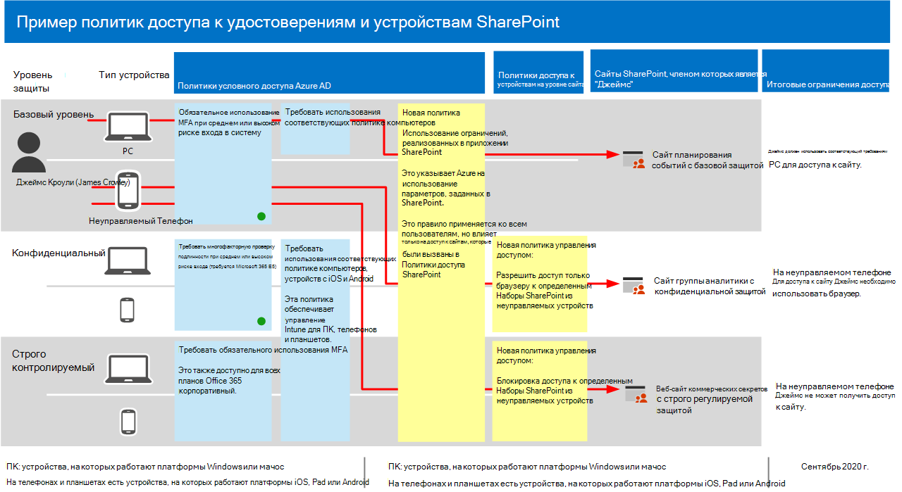

# Рекомендации политики по защите сайтов и файлов SharePoint

В этой статье описывается, как реализовать рекомендуемые политики удостоверений и доступа к устройствам для защиты SharePoint и OneDrive для бизнеса. Это руководство строится на [общих политиках идентификации и доступа к устройствам](identity-access-policies.md).

Эти рекомендации основаны на трех различных уровнях безопасности и защиты для файлов SharePoint, которые можно применять в зависимости от степени детализации ваших потребностей: **базовый**, **конфиденциальный**и **строго регулируемый**. Вы можете узнать больше об этих уровнях безопасности и рекомендуемых клиентских операционных системах, на которые ссылаются эти рекомендации в [обзоре](microsoft-365-policies-configurations.md).

В дополнение к внедрению этих рекомендаций обязательно настройте сайты SharePoint с использованием правильной защиты, включая установку соответствующих разрешений для конфиденциального и строго регулируемого контента.

## Обновление общих политик для включения SharePoint и OneDrive для бизнеса

Чтобы защитить файлы в SharePoint и OneDrive, на следующей схеме показано, какие политики необходимо обновить на основе общих политик идентификации и доступа к устройствам.

[Просмотреть увеличенную версию этого изображения](https://github.com/MicrosoftDocs/microsoft-365-docs/raw/public/microsoft-365/media/microsoft-365-policies-configurations/identity-access-ruleset-sharepoint.png)

Если вы включили SharePoint при создании общих политик, необходимо создать только новые политики. Для политик условного доступа SharePoint включает OneDrive.

Новые политики реализуют защиту устройств для конфиденциального и строго регулируемого контента, применяя определенные требования к доступу к указанным вами сайтам SharePoint.

В следующей таблице перечислены политики, которые необходимо просмотреть и обновить, или создать новую для SharePoint. Общие политики ссылаются на соответствующие инструкции по настройке в статье [Common Identity and Device Access Policies Policies](identity-access-policies.md) .

|Уровень защиты|Политики|Дополнительные сведения|
|:---------------|:-------|:----------------|
|**Базовый уровень**|[Требовать, чтобы риск входа в систему был *средним* или *высоким*](identity-access-policies.md#require-mfa-based-on-sign-in-risk)|Включение SharePoint в назначение облачных приложений.|
|        |[Блокирование клиентов, не поддерживающих современную проверку подлинности](identity-access-policies.md#block-clients-that-dont-support-modern-authentication)|Включение SharePoint в назначение облачных приложений.|
|        |[Применение политик защиты данных приложений](identity-access-policies.md#apply-app-data-protection-policies)|Убедитесь, что все Рекомендуемые приложения включены в список приложений. Обязательно обновите политику для каждой платформы (iOS, Android, Windows).|
|        |[Требовать использования соответствующих политике компьютеров](identity-access-policies.md#require-compliant-pcs-but-not-compliant-phones-and-tablets)|Включение SharePoint в список облачных приложений.|
|        |[Использование принудительных ограничений приложения в SharePoint](#use-app-enforced-restrictions-in-sharepoint)|Добавление новой политики. Это указывает Azure Active Directory (Azure AD) на использование параметров, указанных в SharePoint. Эта политика применяется ко всем пользователям, но влияет только на доступ к сайтам, включенным в политики доступа SharePoint.|
|**Конфиденциально**|[Требовать, когда риск входа в систему *мал*, *средний* или *высокий*](identity-access-policies.md#require-mfa-based-on-sign-in-risk)|Включение SharePoint в назначения облачных приложений.|
|         |[Требовать соответствующие компьютеры *и* мобильные устройства](identity-access-policies.md#require-compliant-pcs-and-mobile-devices)|Включение SharePoint в список облачных приложений.|
||[Политика управления доступом SharePoint](#sharepoint-access-control-policies): разрешает доступ только браузеру к определенным сайтам SharePoint с неуправляемых устройств.|Это предотвращает изменение и скачивание файлов. Указание сайтов с помощью PowerShell.|
|**Строго контролируемый**|[*Всегда* требовать MFA](identity-access-policies.md#require-mfa-based-on-sign-in-risk)|Включение SharePoint в назначение облачных приложений.|
||[Политика управления доступом SharePoint](#use-app-enforced-restrictions-in-sharepoint): блокирует доступ к определенным сайтам SharePoint с неуправляемых устройств.|Указание сайтов с помощью PowerShell.|

## Использование ограничений, реализованных в приложении SharePoint

Если вы реализуете элементы управления доступом в SharePoint, необходимо создать эту политику условного доступа в Azure AD, чтобы уведомить Azure AD о необходимости применения политик, настроенных в SharePoint. Эта политика применяется ко всем пользователям, но влияет только на доступ к сайтам, указанным с помощью PowerShell, при создании элементов управления доступом в SharePoint.

Чтобы настроить эту политику, обратитесь к разделу "Блокировка или ограничьте доступ к определенным семействам веб-сайтов SharePoint или учетным записям OneDrive", чтобы [управлять доступом с неуправляемых устройств](https://docs.microsoft.com/sharepoint/control-access-from-unmanaged-devices).

## Политики управления доступом SharePoint

Корпорация Майкрософт рекомендует защищать контент на сайтах SharePoint с помощью конфиденциального и строго регулируемого контента с помощью управления доступом к устройствам. Для этого необходимо создать политику, определяющую уровень защиты и сайты, к которым применяется защита.

- Конфиденциальные сайты: разрешить доступ только к браузеру. Это не позволяет пользователям редактировать и загружать файлы.
- Строго регулируемые сайты: блокировать доступ с неуправляемых устройств.

В разделе "Блокировка или ограничьте доступ к определенным семействам веб-сайтов SharePoint или учетным записям OneDrive" в разделе [Управление доступом с неуправляемых устройств](https://docs.microsoft.com/sharepoint/control-access-from-unmanaged-devices).

## Совместная работа этих политик

Важно понимать, что разрешения сайтов SharePoint обычно основываются на бизнес-потребности в доступе к сайтам. Эти разрешения управляются владельцами сайтов и могут быть очень динамичными. Использование политик доступа к устройствам SharePoint обеспечивает защиту этих сайтов независимо от того, назначены ли пользователи группе Azure AD, связанной с базовой, конфиденциальной или строго регулируемой защитой.

На следующем рисунке приведен пример того, как политики доступа к устройствам SharePoint защищают доступ к сайтам для пользователя.

[Просмотреть увеличенную версию этого изображения](https://github.com/MicrosoftDocs/microsoft-365-docs/raw/public/microsoft-365/media/microsoft-365-policies-configurations/SharePoint-rules-scenario.png)

Для учетной фразы Джеймс назначены базовые политики условного доступа, но ему можно предоставить доступ к сайтам SharePoint с помощью конфиденциальной или надежной защиты.

- Если Джеймс получает доступ к надежному или строго регулируемому сайту, он является участником использования своего компьютера, его доступ предоставляется, пока его компьютер соответствует требованиям.
- Если Джеймс получает доступ к конфиденциальному сайту, который является участником использования неуправляемого телефона, который разрешен для пользователей базового плана, он будет получать доступ к конфиденциальному сайту только через браузер в соответствии с политикой доступа к устройствам, настроенной для этого сайта.
- Если Джеймс получит доступ к высоко регулируемому сайту, который является участником использования неуправляемого телефона, он будет заблокирован из-за политики доступа, настроенной для этого сайта. Он может получить доступ только к этому сайту с помощью управляемого и совместимого компьютера.

## Следующий шаг

Настройка политик условного доступа для:

- [Microsoft Teams](teams-access-policies.md)
- [Exchange Online](secure-email-recommended-policies.md)

