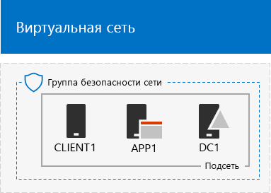

# <a name="simulated-cross-premises-virtual-network-in-a-microsoft-365-test-environment"></a><span data-ttu-id="239f6-103">Имитация распределенной виртуальной сети в тестовой среде Microsoft 365</span><span class="sxs-lookup"><span data-stu-id="239f6-103">Simulated cross-premises virtual network in a Microsoft 365 test environment</span></span>

<span data-ttu-id="239f6-104">*Это руководство по лаборатории тестирования можно использовать для тестовых сред Microsoft 365 корпоративный и Office 365 корпоративный.*</span><span class="sxs-lookup"><span data-stu-id="239f6-104">*This Test Lab Guide can be used for both Microsoft 365 Enterprise and Office 365 Enterprise test environments.*</span></span>

<span data-ttu-id="239f6-p101">В этой статье описаны действия по созданию имитации гибридной облачной среды в Microsoft Azure с помощью двух виртуальных сетей Azure. Ниже показана итоговая конфигурация.</span><span class="sxs-lookup"><span data-stu-id="239f6-p101">This article steps you through creating a simulated hybrid cloud environment with Microsoft Azure using two Azure virtual networks. Here is the resulting configuration.</span></span> 
  

  
<span data-ttu-id="239f6-108">Так имитируется гибридная облачная рабочая среда Azure IaaS, которая включает:</span><span class="sxs-lookup"><span data-stu-id="239f6-108">This simulates an Azure IaaS hybrid cloud production environment and consists of:</span></span>
  
- <span data-ttu-id="239f6-109">Имитацию упрощенной локальной сети, размещенной в виртуальной сети Azure (TestLab).</span><span class="sxs-lookup"><span data-stu-id="239f6-109">A simulated and simplified on-premises network hosted in an Azure virtual network (the TestLab virtual network).</span></span>
    
- <span data-ttu-id="239f6-110">Имитацию распределенной виртуальной сети, размещенной в Azure (XPrem).</span><span class="sxs-lookup"><span data-stu-id="239f6-110">A simulated cross-premises virtual network hosted in Azure (XPrem).</span></span>
    
- <span data-ttu-id="239f6-111">Пиринговую связь между двумя виртуальными сетями.</span><span class="sxs-lookup"><span data-stu-id="239f6-111">A VNet peering relationship between the two virtual networks.</span></span>
    
- <span data-ttu-id="239f6-112">Дополнительный контроллер домена в виртуальной сети XPrem.</span><span class="sxs-lookup"><span data-stu-id="239f6-112">A secondary domain controller in the XPrem virtual network.</span></span>
    
<span data-ttu-id="239f6-113">Это обеспечивает общую исходную точку, начиная с которой, вы можете:</span><span class="sxs-lookup"><span data-stu-id="239f6-113">This provides a basis and common starting point from which you can:</span></span> 
  
- <span data-ttu-id="239f6-114">Разрабатывать и тестировать приложения в имитированной гибридной облачной среде Azure IaaS.</span><span class="sxs-lookup"><span data-stu-id="239f6-114">Develop and test applications in a simulated Azure IaaS hybrid cloud environment.</span></span>
    
- <span data-ttu-id="239f6-115">Создавать тестовые конфигурации компьютеров внутри виртуальной сети (для некоторых это TestLab, а для некоторых — XPrem), чтобы имитировать рабочие ИТ-нагрузки на основе гибридного облака.</span><span class="sxs-lookup"><span data-stu-id="239f6-115">Create test configurations of computers, some within the TestLab virtual network and some within the XPrem virtual network, to simulate hybrid cloud-based IT workloads.</span></span>
    
<span data-ttu-id="239f6-116">Процесс настройки этой среды тестирования состоит из трех перечисленных ниже основных этапов.</span><span class="sxs-lookup"><span data-stu-id="239f6-116">There are three major phases to setting up this test environment:</span></span>
  
1. <span data-ttu-id="239f6-117">Настраивать виртуальную сеть TestLab.</span><span class="sxs-lookup"><span data-stu-id="239f6-117">Configure the TestLab virtual network.</span></span>
    
2. <span data-ttu-id="239f6-118">Создавать распределенную виртуальную сеть.</span><span class="sxs-lookup"><span data-stu-id="239f6-118">Create the cross-premises virtual network.</span></span>
    
3. <span data-ttu-id="239f6-119">Настраивать DC2.</span><span class="sxs-lookup"><span data-stu-id="239f6-119">Configure DC2.</span></span>
    
> [!NOTE]
> <span data-ttu-id="239f6-120">Эта конфигурация требует платной подписки на Azure.</span><span class="sxs-lookup"><span data-stu-id="239f6-120">This configuration requires a paid Azure subscription.</span></span> 

<span data-ttu-id="239f6-121">Вы можете использовать полученную среду для тестирования функций [Microsoft 365 корпоративный](https://www.microsoft.com/microsoft-365/enterprise) с дополнительными [руководствами по лаборатории тестирования](m365-enterprise-test-lab-guides.md) или без них.</span><span class="sxs-lookup"><span data-stu-id="239f6-121">You can use the resulting environment to test the features and functionality of [Microsoft 365 Enterprise](https://www.microsoft.com/microsoft-365/enterprise) with additional [Test Lab Guides](m365-enterprise-test-lab-guides.md) or on your own.</span></span>


> [!TIP]
> <span data-ttu-id="239f6-123">Щелкните [здесь](../media/m365-enterprise-test-lab-guides/Microsoft365EnterpriseTLGStack.pdf), чтобы просмотреть схему всех статей, относящихся к руководствам по лаборатории тестирования Microsoft 365 корпоративный.</span><span class="sxs-lookup"><span data-stu-id="239f6-123">Click [here](../media/m365-enterprise-test-lab-guides/Microsoft365EnterpriseTLGStack.pdf) for a visual map to all the articles in the Microsoft 365 Enterprise Test Lab Guide stack.</span></span>

## <a name="phase-1-configure-the-testlab-virtual-network"></a><span data-ttu-id="239f6-124">Этап 1. Настройка виртуальной сети TestLab</span><span class="sxs-lookup"><span data-stu-id="239f6-124">Phase 1: Configure the TestLab virtual network</span></span>

<span data-ttu-id="239f6-125">Воспользуйтесь инструкциями в разделе **Этап 1** статьи [Базовая конфигурация "имитация предприятия"](simulated-ent-base-configuration-microsoft-365-enterprise.md), чтобы настроить компьютеры DC1, APP1 и CLIENT1 в виртуальной сети Azure под названием TestLab.</span><span class="sxs-lookup"><span data-stu-id="239f6-125">Use the instructions in **Phase 1** of the [simulated enterprise base configuration](simulated-ent-base-configuration-microsoft-365-enterprise.md) to configure the DC1, APP1, and CLIENT1 computers in the Azure virtual network named TestLab.</span></span>
  
<span data-ttu-id="239f6-126">Это ваша текущая конфигурация.</span><span class="sxs-lookup"><span data-stu-id="239f6-126">This is your current configuration.</span></span> 
  

  
## <a name="phase-2-create-the-xprem-virtual-network"></a><span data-ttu-id="239f6-128">Этап 2. Создание виртуальной сети XPrem</span><span class="sxs-lookup"><span data-stu-id="239f6-128">Phase 2: Create the XPrem virtual network</span></span>

<span data-ttu-id="239f6-129">На этом этапе создается и настраивается новая виртуальная сеть XPrem, а затем подключается к пиринговой виртуальной сети TestLab.</span><span class="sxs-lookup"><span data-stu-id="239f6-129">In this phase, you create and configure the new XPrem virtual network and then connect it to the TestLab virtual network with VNet peering.</span></span>
  
<span data-ttu-id="239f6-130">Во-первых, запустите командную строку Azure PowerShell на своем локальном компьютере.</span><span class="sxs-lookup"><span data-stu-id="239f6-130">First, start an Azure PowerShell prompt on your local computer.</span></span>
  
> [!NOTE]
> <span data-ttu-id="239f6-p102">Для приведенных ниже последовательностей команд используется последняя версия Azure PowerShell. См. статью [Общие сведения об Azure PowerShell](https://docs.microsoft.com/powershell/azureps-cmdlets-docs/).</span><span class="sxs-lookup"><span data-stu-id="239f6-p102">The following command sets use the latest version of Azure PowerShell. See [Get started with Azure PowerShell cmdlets](https://docs.microsoft.com/powershell/azureps-cmdlets-docs/).</span></span> 
  
<span data-ttu-id="239f6-133">Войдите в свою учетную запись Azure с помощью указанной ниже команды.</span><span class="sxs-lookup"><span data-stu-id="239f6-133">Sign in to your Azure account with this command.</span></span>
  
```powershell
Connect-AzAccount
```

<span data-ttu-id="239f6-134">Получите имя подписки с помощью приведенной ниже команды.</span><span class="sxs-lookup"><span data-stu-id="239f6-134">Get your subscription name using this command.</span></span>
  
```powershell
Get-AzSubscription | Sort Name | Select Name
```

<span data-ttu-id="239f6-p103">Укажите свою подписку Azure. Замените текст в кавычках, в том числе символы "\<" и ">", на правильное имя.</span><span class="sxs-lookup"><span data-stu-id="239f6-p103">Set your Azure subscription. Replace everything within the quotes, including the \< and > characters, with the correct names.</span></span>
  
```powershell
$subscrName="<subscription name>"
Select-AzSubscription -SubscriptionName $subscrName
```

<span data-ttu-id="239f6-137">Далее создайте виртуальную сеть XPrem и защитите ее с помощью группы безопасности сети, воспользовавшись этими командами.</span><span class="sxs-lookup"><span data-stu-id="239f6-137">Next, create the XPrem virtual network and protect it with a network security group with these commands.</span></span>
  
```powershell
$rgName="<name of the resource group that you used for your TestLab virtual network>"
$locName=(Get-AzResourceGroup -Name $rgName).Location
$Testnet=New-AzVirtualNetworkSubnetConfig -Name "Testnet" -AddressPrefix 192.168.0.0/24
New-AzVirtualNetwork -Name "XPrem" -ResourceGroupName $rgName -Location $locName -AddressPrefix 192.168.0.0/16 -Subnet $Testnet -DNSServer 10.0.0.4
$rule1=New-AzNetworkSecurityRuleConfig -Name "RDPTraffic" -Description "Allow RDP to all VMs on the subnet" -Access Allow -Protocol Tcp -Direction Inbound -Priority 100 -SourceAddressPrefix Internet -SourcePortRange * -DestinationAddressPrefix * -DestinationPortRange 3389
New-AzNetworkSecurityGroup -Name "Testnet" -ResourceGroupName $rgName -Location $locName -SecurityRules $rule1
$vnet=Get-AzVirtualNetwork -ResourceGroupName $rgName -Name XPrem
$nsg=Get-AzNetworkSecurityGroup -Name "Testnet" -ResourceGroupName $rgName
Set-AzVirtualNetworkSubnetConfig -VirtualNetwork $vnet -Name "Testnet" -AddressPrefix 192.168.0.0/24 -NetworkSecurityGroup $nsg
$vnet | Set-AzVirtualNetwork
```

<span data-ttu-id="239f6-138">Затем создайте пиринговую связь между виртуальными сетями TestLab и XPrem с помощью этих команд.</span><span class="sxs-lookup"><span data-stu-id="239f6-138">Next, you create the VNet peering relationship between the TestLab and XPrem VNets with these commands.</span></span>
  
```powershell
$rgName="<name of the resource group that you used for your TestLab virtual network>"
$vnet1=Get-AzVirtualNetwork -ResourceGroupName $rgName -Name TestLab
$vnet2=Get-AzVirtualNetwork -ResourceGroupName $rgName -Name XPrem
Add-AzVirtualNetworkPeering -Name TestLab2XPrem -VirtualNetwork $vnet1 -RemoteVirtualNetworkId $vnet2.Id
Add-AzVirtualNetworkPeering -Name XPrem2TestLab -VirtualNetwork $vnet2 -RemoteVirtualNetworkId $vnet1.Id
```

<span data-ttu-id="239f6-139">Это ваша текущая конфигурация.</span><span class="sxs-lookup"><span data-stu-id="239f6-139">This is your current configuration.</span></span> 
  

  
## <a name="phase-3-configure-dc2"></a><span data-ttu-id="239f6-141">Этап 3. Настройка DC2</span><span class="sxs-lookup"><span data-stu-id="239f6-141">Phase 3: Configure DC2</span></span>

<span data-ttu-id="239f6-142">На этом этапе нужно создать виртуальную машину DC2 в виртуальной сети XPrem, а затем настроить ее в качестве контроллера домена реплики.</span><span class="sxs-lookup"><span data-stu-id="239f6-142">In this phase, you create the DC2 virtual machine in the XPrem virtual network and then configure it as a replica domain controller.</span></span>
  
<span data-ttu-id="239f6-p104">Сначала создайте виртуальную машину для DC2. Выполните эти команды в командной строке Azure PowerShell на локальном компьютере.</span><span class="sxs-lookup"><span data-stu-id="239f6-p104">First, create a virtual machine for DC2. Run these commands at the Azure PowerShell command prompt on your local computer.</span></span>
  
```powershell
$rgName="<your resource group name>"
$locName=(Get-AzResourceGroup -Name $rgName).Location
$vnet=Get-AzVirtualNetwork -Name XPrem -ResourceGroupName $rgName
$pip=New-AzPublicIpAddress -Name DC2-PIP -ResourceGroupName $rgName -Location $locName -AllocationMethod Dynamic
$nic=New-AzNetworkInterface -Name DC2-NIC -ResourceGroupName $rgName -Location $locName -SubnetId $vnet.Subnets[0].Id -PublicIpAddressId $pip.Id -PrivateIpAddress 192.168.0.4
$vm=New-AzVMConfig -VMName DC2 -VMSize Standard_A2_V2
$cred=Get-Credential -Message "Type the name and password of the local administrator account for DC2."
$vm=Set-AzVMOperatingSystem -VM $vm -Windows -ComputerName DC2 -Credential $cred -ProvisionVMAgent -EnableAutoUpdate
$vm=Set-AzVMSourceImage -VM $vm -PublisherName MicrosoftWindowsServer -Offer WindowsServer -Skus 2016-Datacenter -Version "latest"
$vm=Add-AzVMNetworkInterface -VM $vm -Id $nic.Id
$vm=Set-AzVMOSDisk -VM $vm -Name "DC2-OS" -DiskSizeInGB 128 -CreateOption FromImage -StorageAccountType "Standard_LRS"
$diskConfig=New-AzDiskConfig -AccountType "Standard_LRS" -Location $locName -CreateOption Empty -DiskSizeGB 20
$dataDisk1=New-AzDisk -DiskName "DC2-DataDisk1" -Disk $diskConfig -ResourceGroupName $rgName
$vm=Add-AzVMDataDisk -VM $vm -Name "DC2-DataDisk1" -CreateOption Attach -ManagedDiskId $dataDisk1.Id -Lun 1
New-AzVM -ResourceGroupName $rgName -Location $locName -VM $vm
```

<span data-ttu-id="239f6-145">Затем подключитесь к новой виртуальной машине DC2 на [портале Azure](https://portal.azure.com) с помощью имени и пароля учетной записи администратора.</span><span class="sxs-lookup"><span data-stu-id="239f6-145">Next, connect to the new DC2 virtual machine from the [Azure portal](https://portal.azure.com) using its local administrator account name and password.</span></span>
  
<span data-ttu-id="239f6-p105">Далее настройте правило брандмауэра Windows, разрешающее трафик для тестирования базовых параметров подключения. С помощью командной строки Windows PowerShell уровня администратора на DC2 выполните эти команды.</span><span class="sxs-lookup"><span data-stu-id="239f6-p105">Next, configure a Windows Firewall rule to allow traffic for basic connectivity testing. From an administrator-level Windows PowerShell command prompt on DC2, run these commands.</span></span> 
  
```powershell
Set-NetFirewallRule -DisplayName "File and Printer Sharing (Echo Request - ICMPv4-In)" -enabled True
ping dc1.corp.contoso.com
```

<span data-ttu-id="239f6-p106">В результате команды проверки связи должны прийти четыре успешных ответа с IP-адреса 10.0.0.4. Это тест трафика в рамках пиринговой виртуальной сети.</span><span class="sxs-lookup"><span data-stu-id="239f6-p106">The ping command should result in four successful replies from IP address 10.0.0.4. This is a test of traffic across the VNet peering relationship.</span></span> 
  
<span data-ttu-id="239f6-150">Далее добавьте на контроллере домена DC2 дополнительный диск с данными в качестве нового тома с буквой диска "F:", используя для этого указанные ниже команды в командной строке Windows PowerShell.</span><span class="sxs-lookup"><span data-stu-id="239f6-150">Next, add the extra data disk as a new volume with the drive letter F: with this command from the Windows PowerShell command prompt on DC2.</span></span>
  
```powershell
Get-Disk | Where PartitionStyle -eq "RAW" | Initialize-Disk -PartitionStyle MBR -PassThru | New-Partition -AssignDriveLetter -UseMaximumSize | Format-Volume -FileSystem NTFS -NewFileSystemLabel "WSAD Data"
```

<span data-ttu-id="239f6-p107">Затем настройте виртуальную машину DC2 как контроллер домена реплики для corp.contoso.com. Выполните указанные ниже команды в командной строке Windows PowerShell на DC2.</span><span class="sxs-lookup"><span data-stu-id="239f6-p107">Next, configure DC2 as a replica domain controller for the corp.contoso.com domain. Run these commands from the Windows PowerShell command prompt on DC2.</span></span>
  
```powershell
Install-WindowsFeature AD-Domain-Services -IncludeManagementTools
Install-ADDSDomainController -Credential (Get-Credential CORP\User1) -DomainName "corp.contoso.com" -InstallDns:$true -DatabasePath "F:\NTDS" -LogPath "F:\Logs" -SysvolPath "F:\SYSVOL"
```

<span data-ttu-id="239f6-153">Обратите внимание: вам предлагается указать пароли как пользователя CORP\\User1, так и режима восстановления службы каталогов (DSRM), а затем перезапустить DC2.</span><span class="sxs-lookup"><span data-stu-id="239f6-153">Note that you are prompted to supply both the CORP\\User1 password and a Directory Services Restore Mode (DSRM) password, and to restart DC2.</span></span> 
  
<span data-ttu-id="239f6-p108">Теперь, когда у виртуальной сети XPrem есть свой DNS-сервер (DC2), вам нужно настроить XPrem для использования этого DNS-сервера. Выполните эти команды в командной строке Azure PowerShell на локальном компьютере.</span><span class="sxs-lookup"><span data-stu-id="239f6-p108">Now that the XPrem virtual network has its own DNS server (DC2), you must configure the XPrem virtual network to use this DNS server. Run these commands from the Azure PowerShell command prompt on your local computer.</span></span>
  
```powershell
$vnet=Get-AzVirtualNetwork -ResourceGroupName $rgName -name "XPrem"
$vnet.DhcpOptions.DnsServers="192.168.0.4" 
Set-AzVirtualNetwork -VirtualNetwork $vnet
Restart-AzVM -ResourceGroupName $rgName -Name "DC2"
```

<span data-ttu-id="239f6-p109">На портале Azure на локальном компьютере подключитесь к DC1 с помощью учетных данных CORP\\User1. Чтобы настроить домен CORP для проверки подлинности пользователей и компьютеров с помощью их локального контроллера домена, выполните эти команды из командной строки Windows PowerShell уровня администратора на DC1.</span><span class="sxs-lookup"><span data-stu-id="239f6-p109">From the Azure portal on your local computer, connect to DC1 with the CORP\\User1 credentials. To configure the CORP domain so that computers and users use their local domain controller for authentication, run these commands from an administrator-level Windows PowerShell command prompt on DC1.</span></span>
  
```powershell
New-ADReplicationSite -Name "TestLab" 
New-ADReplicationSite -Name "XPrem"
New-ADReplicationSubnet -Name "10.0.0.0/8" -Site "TestLab"
New-ADReplicationSubnet -Name "192.168.0.0/16" -Site "XPrem"
```

<span data-ttu-id="239f6-158">Это ваша текущая конфигурация.</span><span class="sxs-lookup"><span data-stu-id="239f6-158">This is your current configuration.</span></span> 
  

  
<span data-ttu-id="239f6-160">Ваша имитированная гибридная облачная среда Azure готова к тестированию.</span><span class="sxs-lookup"><span data-stu-id="239f6-160">Your simulated Azure hybrid cloud environment is now ready for testing.</span></span>
  
<span data-ttu-id="239f6-161">Теперь вы можете экспериментировать с дополнительными возможностями [Microsoft 365 корпоративный](https://www.microsoft.com/microsoft-365/enterprise).</span><span class="sxs-lookup"><span data-stu-id="239f6-161">You are now ready to experiment with additional features of [Microsoft 365 Enterprise](https://www.microsoft.com/microsoft-365/enterprise).</span></span>
  
## <a name="next-steps"></a><span data-ttu-id="239f6-162">Дальнейшие действия</span><span class="sxs-lookup"><span data-stu-id="239f6-162">Next steps</span></span>

<span data-ttu-id="239f6-163">Ознакомьтесь с этими дополнительными комплектами руководств по лаборатории тестирования:</span><span class="sxs-lookup"><span data-stu-id="239f6-163">Explore these additional sets of Test Lab Guides:</span></span>
  
- [<span data-ttu-id="239f6-164">Идентификация</span><span class="sxs-lookup"><span data-stu-id="239f6-164">Identity</span></span>](m365-enterprise-test-lab-guides.md#identity)
- [<span data-ttu-id="239f6-165">Управление мобильными устройствами</span><span class="sxs-lookup"><span data-stu-id="239f6-165">Mobile device management</span></span>](m365-enterprise-test-lab-guides.md#mobile-device-management)
- [<span data-ttu-id="239f6-166">Защита информации</span><span class="sxs-lookup"><span data-stu-id="239f6-166">Information protection</span></span>](m365-enterprise-test-lab-guides.md#information-protection)

## <a name="see-also"></a><span data-ttu-id="239f6-167">См. также</span><span class="sxs-lookup"><span data-stu-id="239f6-167">See also</span></span>

[<span data-ttu-id="239f6-168">Руководства по лаборатории тестирования для Microsoft 365 корпоративный</span><span class="sxs-lookup"><span data-stu-id="239f6-168">Microsoft 365 Enterprise Test Lab Guides</span></span>](m365-enterprise-test-lab-guides.md)

[<span data-ttu-id="239f6-169">Развертывание Microsoft 365 корпоративный</span><span class="sxs-lookup"><span data-stu-id="239f6-169">Deploy Microsoft 365 Enterprise</span></span>](deploy-microsoft-365-enterprise.md)

[<span data-ttu-id="239f6-170">Документация по Microsoft 365 корпоративный</span><span class="sxs-lookup"><span data-stu-id="239f6-170">Microsoft 365 Enterprise documentation</span></span>](https://docs.microsoft.com/microsoft-365-enterprise/)
