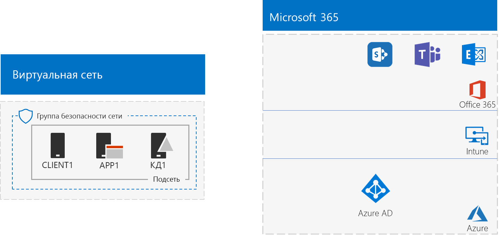
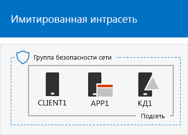
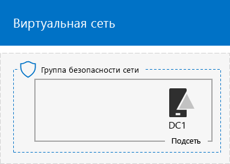
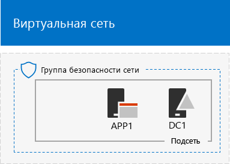

# <a name="the-simulated-enterprise-base-configuration"></a><span data-ttu-id="3fcf8-103">Базовая конфигурация "имитация предприятия"</span><span class="sxs-lookup"><span data-stu-id="3fcf8-103">The simulated enterprise base configuration</span></span>

<span data-ttu-id="3fcf8-104">В этой статье вы найдете пошаговые инструкции по созданию упрощенной среды для Microsoft 365 корпоративный, которая включает:</span><span class="sxs-lookup"><span data-stu-id="3fcf8-104">This article provides you with step-by-step instructions to create a simplified environment for Microsoft 365 Enterprise that includes:</span></span>

- <span data-ttu-id="3fcf8-105">Пробная или платная подписка Microsoft 365 E5</span><span class="sxs-lookup"><span data-stu-id="3fcf8-105">A Microsoft 365 E5 trial or paid subscription.</span></span>
- <span data-ttu-id="3fcf8-106">упрощенную интрасеть организации, подключенную к Интернету и состоящую из трех виртуальных машин в виртуальной сети Azure (DC1, APP1 и CLIENT1).</span><span class="sxs-lookup"><span data-stu-id="3fcf8-106">A simplified organization intranet connected to the Internet, consisting of three virtual machines on an Azure virtual network (DC1, APP1, and CLIENT1).</span></span>
 


<span data-ttu-id="3fcf8-108">Вы можете использовать полученную среду для тестирования функций [Microsoft 365 корпоративный](https://www.microsoft.com/microsoft-365/enterprise) с дополнительными [руководствами по лаборатории тестирования](m365-enterprise-test-lab-guides.md) или без них.</span><span class="sxs-lookup"><span data-stu-id="3fcf8-108">You can use the resulting environment to test the features and functionality of [Microsoft 365 Enterprise](https://www.microsoft.com/microsoft-365/enterprise) with additional [Test Lab Guides](m365-enterprise-test-lab-guides.md) or on your own.</span></span>


> [!TIP]
> <span data-ttu-id="3fcf8-110">Щелкните [здесь](media/m365-enterprise-test-lab-guides/Microsoft365EnterpriseTLGStack.pdf), чтобы просмотреть схему всех статей, относящихся к руководствам по лаборатории тестирования Microsoft 365 корпоративный.</span><span class="sxs-lookup"><span data-stu-id="3fcf8-110">Click [here](media/m365-enterprise-test-lab-guides/Microsoft365EnterpriseTLGStack.pdf) for a visual map to all the articles in the Microsoft 365 Enterprise Test Lab Guide stack.</span></span>

## <a name="phase-1-create-a-simulated-intranet"></a><span data-ttu-id="3fcf8-111">Этап 1. Создание имитированной интрасети</span><span class="sxs-lookup"><span data-stu-id="3fcf8-111">Phase 1: Create a simulated intranet</span></span>

<span data-ttu-id="3fcf8-112">На этом этапе вы создаете имитацию интрасети в службах инфраструктуры Azure, которая включает контроллер домена Active Directory Domain Services (AD DS), сервер приложений и клиентский компьютер.</span><span class="sxs-lookup"><span data-stu-id="3fcf8-112">In this phase, you build a simulated intranet in Azure infrastructure services that includes an Active Directory Domain Services (AD DS) domain controller, an application server, and a client computer.</span></span> 

<span data-ttu-id="3fcf8-113">Вы будете использовать эти компьютеры в дополнительных [Руководствах по лаборатории тестирования для Microsoft 365 корпоративный](m365-enterprise-test-lab-guides.md) для настройки и демонстрации гибридных удостоверений и других возможностей.</span><span class="sxs-lookup"><span data-stu-id="3fcf8-113">You'll use these computers in additional [Microsoft 365 Enterprise Test Lab Guides](m365-enterprise-test-lab-guides.md) to configure and demonstrate hybrid identity and other capabilities.</span></span>

### <a name="method-1-build-your-simulated-intranet-with-an-azure-resource-manager-template"></a><span data-ttu-id="3fcf8-114">Способ 1. Создание имитированной интрасети с помощью шаблона Azure Resource Manager</span><span class="sxs-lookup"><span data-stu-id="3fcf8-114">Method 1: Build your simulated intranet with an Azure Resource Manager template</span></span>

<span data-ttu-id="3fcf8-p101">Этот способ предполагает использование шаблона Azure Resource Manager (ARM) для создания имитации интрасети. Шаблоны ARM содержат все необходимые инструкции для создания сетевой инфраструктуры, виртуальных машин и их конфигурации.</span><span class="sxs-lookup"><span data-stu-id="3fcf8-p101">In this method, you use an Azure Resource Manager (ARM) template to build out the simulated intranet. ARM templates contain all of the instructions to create the Azure networking infrastructure, the virtual machines, and their configuration.</span></span>

<span data-ttu-id="3fcf8-117">Перед развертыванием шаблона ознакомьтесь со [страницей сведений шаблона (README)](https://github.com/maxskunkworks/TLG/tree/master/tlg-base-config_3-vm.m365-ems) и приготовьте приведенные ниже сведения.</span><span class="sxs-lookup"><span data-stu-id="3fcf8-117">Prior to deploying the template, read through the [template README page](https://github.com/maxskunkworks/TLG/tree/master/tlg-base-config_3-vm.m365-ems) and have the following information ready:</span></span>

- <span data-ttu-id="3fcf8-p102">DNS-имя общедоступного домена вашей тестовой среды (testlab.\<ваш общедоступный домен>). Вам понадобится ввести это имя в поле **Доменное имя** на странице **Настраиваемое развертывание**.</span><span class="sxs-lookup"><span data-stu-id="3fcf8-p102">The public DNS domain name of your test environment (testlab.\<your public domain>). You’ll need to enter this name in the **Domain Name field** of the **Custom deployment** page.</span></span>
- <span data-ttu-id="3fcf8-p103">Префикс метки DNS для URL-адресов общедоступных IP-адресов виртуальных машин. Вам понадобится ввести эту метку в поле **Префикс метки DNS** на странице **Настраиваемое развертывание**.</span><span class="sxs-lookup"><span data-stu-id="3fcf8-p103">A DNS label prefix for the URLs of the public IP addresses of your virtual machines. You’ll need to enter this label in the **Dns Label Prefix** field of the **Custom deployment** page.</span></span>

<span data-ttu-id="3fcf8-122">После ознакомления с инструкциями нажмите **Развертывание в Azure** на [странице сведений шаблона (README)](https://github.com/maxskunkworks/TLG/tree/master/tlg-base-config_3-vm.m365-ems), чтобы приступить к работе.</span><span class="sxs-lookup"><span data-stu-id="3fcf8-122">After reading through the instructions, click **Deploy to Azure** on the [template README page](https://github.com/maxskunkworks/TLG/tree/master/tlg-base-config_3-vm.m365-ems) to get started.</span></span>

>[!Note]
><span data-ttu-id="3fcf8-123">Для имитации интрасети, созданной на основе шаблона ARM, требуется платная подписка Azure.</span><span class="sxs-lookup"><span data-stu-id="3fcf8-123">The simulated intranet built by the ARM template requires a paid Azure subscription.</span></span>
>

<span data-ttu-id="3fcf8-124">Ниже показана итоговая конфигурация после завершения работы с шаблоном.</span><span class="sxs-lookup"><span data-stu-id="3fcf8-124">Here is your configuration after the template is complete.</span></span>



### <a name="method-2-build-your-simulated-intranet-with-azure-powershell"></a><span data-ttu-id="3fcf8-126">Способ 2. Создание имитированной интрасети с помощью Azure PowerShell</span><span class="sxs-lookup"><span data-stu-id="3fcf8-126">Method 2: Build your simulated intranet with Azure PowerShell</span></span>

<span data-ttu-id="3fcf8-127">Этот способ предполагает использование Windows PowerShell и модуля Azure PowerShell для создания сетевой инфраструктуры, виртуальных машин и их конфигурации.</span><span class="sxs-lookup"><span data-stu-id="3fcf8-127">In this method, you use Windows PowerShell and the Azure PowerShell module to build out the networking infrastructure, the virtual machines, and their configuration.</span></span>

<span data-ttu-id="3fcf8-p104">Используйте этот способ, если вы хотите получить возможность создания элементов инфраструктуры Azure шаг за шагом с помощью PowerShell. Затем можно настроить командные блоки PowerShell для самостоятельного развертывания других виртуальных машин в Azure.</span><span class="sxs-lookup"><span data-stu-id="3fcf8-p104">Use this method if you want to get experience creating elements of Azure infrastructure one step at a time with PowerShell. You can then customize the PowerShell command blocks for your own deployment of other virtual machines in Azure.</span></span>

#### <a name="step-1-create-dc1"></a><span data-ttu-id="3fcf8-130">Этап 1. Создание DC1</span><span class="sxs-lookup"><span data-stu-id="3fcf8-130">Step 1: Create DC1</span></span>

<span data-ttu-id="3fcf8-131">На этом этапе создается виртуальная сеть Azure и добавляется виртуальная машина DC1, которая является контроллером домена AD DS.</span><span class="sxs-lookup"><span data-stu-id="3fcf8-131">In this step, we create an Azure virtual network and add DC1, a virtual machine that is a domain controller for an AD DS domain.</span></span>

<span data-ttu-id="3fcf8-132">Сначала запустите командную строку Windows PowerShell на локальном компьютере.</span><span class="sxs-lookup"><span data-stu-id="3fcf8-132">First, start a Windows PowerShell command prompt on your local computer.</span></span>
  
> [!NOTE]
> <span data-ttu-id="3fcf8-p105">Для приведенных ниже последовательностей команд используется последняя версия Azure PowerShell. См. статью [Общие сведения об Azure PowerShell](https://docs.microsoft.com/powershell/azureps-cmdlets-docs/).</span><span class="sxs-lookup"><span data-stu-id="3fcf8-p105">The following command sets use the latest version of Azure PowerShell. See [Get started with Azure PowerShell cmdlets](https://docs.microsoft.com/powershell/azureps-cmdlets-docs/).</span></span> 
  
<span data-ttu-id="3fcf8-135">Войдите в свою учетную запись Azure с помощью указанной ниже команды.</span><span class="sxs-lookup"><span data-stu-id="3fcf8-135">Sign in to your Azure account with the following command.</span></span>
  
```powershell
Connect-AzAccount
```

<span data-ttu-id="3fcf8-136">Получите имя подписки с помощью следующей команды.</span><span class="sxs-lookup"><span data-stu-id="3fcf8-136">Get your subscription name using the following command.</span></span>
  
```powershell
Get-AzSubscription | Sort Name | Select Name
```

<span data-ttu-id="3fcf8-p106">Укажите свою подписку Azure. Замените текст в кавычках, в том числе символы < и >, правильным именем.</span><span class="sxs-lookup"><span data-stu-id="3fcf8-p106">Set your Azure subscription. Replace everything within the quotes, including the < and > characters, with the correct name.</span></span>
  
```powershell
$subscr="<subscription name>"
Get-AzSubscription -SubscriptionName $subscr | Select-AzSubscription
```

<span data-ttu-id="3fcf8-p107">Затем создайте группу ресурсов для лаборатории тестирования "имитация предприятия". Чтобы определить уникальное имя группы ресурсов, используйте указанную ниже команду для вывода списка имеющихся групп ресурсов.</span><span class="sxs-lookup"><span data-stu-id="3fcf8-p107">Next, create a new resource group for your simulated enterprise test lab. To determine a unique resource group name, use this command to list your existing resource groups.</span></span>
  
```powershell
Get-AzResourceGroup | Sort ResourceGroupName | Select ResourceGroupName
```

<span data-ttu-id="3fcf8-p108">Создайте группу ресурсов с помощью приведенных ниже команд. Замените все символы в кавычках (в том числе символы < и >) правильными именами.</span><span class="sxs-lookup"><span data-stu-id="3fcf8-p108">Create your new resource group with these commands. Replace everything within the quotes, including the < and > characters, with the correct names.</span></span>
  
```powershell
$rgName="<resource group name>"
$locName="<location name, such as West US>"
New-AzResourceGroup -Name $rgName -Location $locName
```

<span data-ttu-id="3fcf8-p109">После этого создайте виртуальную сеть TestLab, в которой будет размещаться подсеть Corpnet моделируемой среды предприятия, и защитите ее с помощью группы сетевой безопасности. Укажите имя своей группы ресурсов и выполните эти команды в командной строке PowerShell на локальном компьютере.</span><span class="sxs-lookup"><span data-stu-id="3fcf8-p109">Next, you create the TestLab virtual network that will host the Corpnet subnet of the simulated enterprise environment and protect it with a network security group. Fill in the name of your resource group and run these commands at the PowerShell command prompt on your local computer.</span></span>
  
```powershell
$rgName="<name of your new resource group>"
$locName=(Get-AzResourceGroup -Name $rgName).Location
$corpnetSubnet=New-AzVirtualNetworkSubnetConfig -Name Corpnet -AddressPrefix 10.0.0.0/24
New-AzVirtualNetwork -Name TestLab -ResourceGroupName $rgName -Location $locName -AddressPrefix 10.0.0.0/8 -Subnet $corpnetSubnet -DNSServer 10.0.0.4
$rule1=New-AzNetworkSecurityRuleConfig -Name "RDPTraffic" -Description "Allow RDP to all VMs on the subnet" -Access Allow -Protocol Tcp -Direction Inbound -Priority 100 -SourceAddressPrefix Internet -SourcePortRange * -DestinationAddressPrefix * -DestinationPortRange 3389
New-AzNetworkSecurityGroup -Name Corpnet -ResourceGroupName $rgName -Location $locName -SecurityRules $rule1
$vnet=Get-AzVirtualNetwork -ResourceGroupName $rgName -Name TestLab
$nsg=Get-AzNetworkSecurityGroup -Name Corpnet -ResourceGroupName $rgName
Set-AzVirtualNetworkSubnetConfig -VirtualNetwork $vnet -Name Corpnet -AddressPrefix "10.0.0.0/24" -NetworkSecurityGroup $nsg
$vnet | Set-AzVirtualNetwork
```

<span data-ttu-id="3fcf8-145">Затем создайте виртуальную машину DC1 и настройте ее как контроллер домена для **testlab.**\<ваш публичный домен > домен AD DS и DNS-сервер для виртуальных машин виртуальной сети TestLab.</span><span class="sxs-lookup"><span data-stu-id="3fcf8-145">Next, you create the DC1 virtual machine and configure it as a domain controller for the **testlab.**\<your public domain> AD DS domain and a DNS server for the virtual machines of the TestLab virtual network.</span></span> <span data-ttu-id="3fcf8-146">Например, если ваше имя публичного домена — **<span>contoso</span>.com**, виртуальная машина DC1 будет контроллером домена **<span>testlab</span>.contoso.com**.</span><span class="sxs-lookup"><span data-stu-id="3fcf8-146">For example, if your public domain name is **<span>contoso</span>.com**, the DC1 virtual machine will be a domain controller for the **<span>testlab</span>.contoso.com** domain.</span></span>
  
<span data-ttu-id="3fcf8-147">Чтобы создать виртуальную машину Azure для DC1, укажите имя группы ресурсов и выполните приведенные ниже команды в командной строке PowerShell на локальном компьютере.</span><span class="sxs-lookup"><span data-stu-id="3fcf8-147">To create an Azure virtual machine for DC1, fill in the name of your resource group and run these commands at the PowerShell command prompt on your local computer.</span></span>
  
```powershell
$rgName="<resource group name>"
$locName=(Get-AzResourceGroup -Name $rgName).Location
$vnet=Get-AzVirtualNetwork -Name TestLab -ResourceGroupName $rgName
$pip=New-AzPublicIpAddress -Name DC1-PIP -ResourceGroupName $rgName -Location $locName -AllocationMethod Dynamic
$nic=New-AzNetworkInterface -Name DC1-NIC -ResourceGroupName $rgName -Location $locName -SubnetId $vnet.Subnets[0].Id -PublicIpAddressId $pip.Id -PrivateIpAddress 10.0.0.4
$vm=New-AzVMConfig -VMName DC1 -VMSize Standard_A1
$cred=Get-Credential -Message "Type the name and password of the local administrator account for DC1."
$vm=Set-AzVMOperatingSystem -VM $vm -Windows -ComputerName DC1 -Credential $cred -ProvisionVMAgent -EnableAutoUpdate
$vm=Set-AzVMSourceImage -VM $vm -PublisherName MicrosoftWindowsServer -Offer WindowsServer -Skus 2016-Datacenter -Version "latest"
$vm=Add-AzVMNetworkInterface -VM $vm -Id $nic.Id
$vm=Set-AzVMOSDisk -VM $vm -Name "DC1-OS" -DiskSizeInGB 128 -CreateOption FromImage
$diskConfig=New-AzDiskConfig -AccountType "Standard_LRS" -Location $locName -CreateOption Empty -DiskSizeGB 20
$dataDisk1=New-AzDisk -DiskName "DC1-DataDisk1" -Disk $diskConfig -ResourceGroupName $rgName
$vm=Add-AzVMDataDisk -VM $vm -Name "DC1-DataDisk1" -CreateOption Attach -ManagedDiskId $dataDisk1.Id -Lun 1
New-AzVM -ResourceGroupName $rgName -Location $locName -VM $vm
```

<span data-ttu-id="3fcf8-p111">Вам будет предложено ввести имя пользователя и пароль учетной записи локального администратора на DC1. Задайте надежный пароль и запишите его вместе с именем пользователя в безопасном месте.</span><span class="sxs-lookup"><span data-stu-id="3fcf8-p111">You will be prompted for a user name and password for the local administrator account on DC1. Use a strong password and record both the name and password in a secure location.</span></span>
  
<span data-ttu-id="3fcf8-150">После этого подключитесь к виртуальной машине DC1.</span><span class="sxs-lookup"><span data-stu-id="3fcf8-150">Next, connect to the DC1 virtual machine.</span></span>
  
1. <span data-ttu-id="3fcf8-151">На [портале Azure](https://portal.azure.com) выберите **Группы ресурсов >** [имя новой группы ресурсов] **> DC1 > Подключить**.</span><span class="sxs-lookup"><span data-stu-id="3fcf8-151">In the [Azure portal](https://portal.azure.com), click **Resource Groups >** [the name of your new resource group] **> DC1 > Connect**.</span></span>
    
2. <span data-ttu-id="3fcf8-p112">В открытой области выберите элемент **Скачать RDP-файл**. Откройте скачанный файл DC1.rdp и нажмите **Подключить**.</span><span class="sxs-lookup"><span data-stu-id="3fcf8-p112">In the open pane, click **Download RDP file**. Open the DC1.rdp file that is downloaded, and then click **Connect**.</span></span>
    
3. <span data-ttu-id="3fcf8-154">Укажите имя учетной записи локального администратора DC1:</span><span class="sxs-lookup"><span data-stu-id="3fcf8-154">Specify the DC1 local administrator account name:</span></span>
    
   - <span data-ttu-id="3fcf8-155">Для Windows 7:</span><span class="sxs-lookup"><span data-stu-id="3fcf8-155">For Windows 7:</span></span>
    
     <span data-ttu-id="3fcf8-p113">В диалоговом окне **Безопасность Windows** выберите элемент **Использовать другую учетную запись**. В поле **Имя пользователя** введите **DC1\\**[имя локальной учетной записи администратора].</span><span class="sxs-lookup"><span data-stu-id="3fcf8-p113">In the **Windows Security** dialog box, click **Use another account**. In **User name**, type **DC1\\**[Local administrator account name].</span></span>
    
   - <span data-ttu-id="3fcf8-158">Для Windows 8 и Windows 10:</span><span class="sxs-lookup"><span data-stu-id="3fcf8-158">For Windows 8 or Windows 10:</span></span>
    
     <span data-ttu-id="3fcf8-p114">В диалоговом окне **Безопасность Windows** нажмите **Больше вариантов**, а затем — **Использовать другую учетную запись**. В поле **Имя пользователя** введите **DC1\\**[имя учетной записи локального администратора].</span><span class="sxs-lookup"><span data-stu-id="3fcf8-p114">In the **Windows Security** dialog box, click **More choices**, and then click **Use a different account**. In **User name**, type **DC1\\**[Local administrator account name].</span></span>
    
4. <span data-ttu-id="3fcf8-161">В поле **Пароль** укажите пароль к учетной записи локального администратора, а затем нажмите кнопку **ОК**.</span><span class="sxs-lookup"><span data-stu-id="3fcf8-161">In **Password**, type the password of the local administrator account, and then click **OK**.</span></span>
    
5. <span data-ttu-id="3fcf8-162">Когда появится соответствующий запрос, нажмите кнопку **Да**.</span><span class="sxs-lookup"><span data-stu-id="3fcf8-162">When prompted, click **Yes**.</span></span>
    
<span data-ttu-id="3fcf8-163">После этого добавьте еще один диск с данными в качестве нового тома с буквой диска "F:", используя приведенные ниже команды в командной строке Windows PowerShell на уровне администратора в DC1.</span><span class="sxs-lookup"><span data-stu-id="3fcf8-163">Next, add an extra data disk as a new volume with the drive letter F: with this command at an administrator-level Windows PowerShell command prompt on DC1.</span></span>
  
```powershell
Get-Disk | Where PartitionStyle -eq "RAW" | Initialize-Disk -PartitionStyle MBR -PassThru | New-Partition -AssignDriveLetter -UseMaximumSize | Format-Volume -FileSystem NTFS -NewFileSystemLabel "WSAD Data"
```

<span data-ttu-id="3fcf8-p115">Затем настройте DC1 в качестве контроллера домена и DNS-сервера для домена **testlab.**\<ваш публичный домен>. Укажите имя своего публичного домена, удалите символы \< и >, а затем выполните эти команды в командной строке Windows PowerShell от имени администратора на DC1.</span><span class="sxs-lookup"><span data-stu-id="3fcf8-p115">Next, configure DC1 as a domain controller and DNS server for the **testlab.**\<your public domain> domain. Specify your public domain name, remove the \< and > characters, and then run these commands at an administrator-level Windows PowerShell command prompt on DC1.</span></span>
  
```powershell
$yourDomain="<your public domain>"
Install-WindowsFeature AD-Domain-Services -IncludeManagementTools
Install-ADDSForest -DomainName testlab.$yourDomain -DatabasePath "F:\NTDS" -SysvolPath "F:\SYSVOL" -LogPath "F:\Logs"
```
<span data-ttu-id="3fcf8-p116">Потребуется указать пароль администратора для безопасного режима. Храните этот пароль в надежном месте.</span><span class="sxs-lookup"><span data-stu-id="3fcf8-p116">You will need to specify a safe mode administrator password. Store this password in a secure location.</span></span>
  
<span data-ttu-id="3fcf8-168">Обратите внимание, что на выполнение этих команд может потребоваться несколько минут.</span><span class="sxs-lookup"><span data-stu-id="3fcf8-168">Note that these commands can take a few minutes to complete.</span></span>
  
<span data-ttu-id="3fcf8-169">После перезапуска виртуальной машины DC1 снова подключитесь к ней.</span><span class="sxs-lookup"><span data-stu-id="3fcf8-169">After DC1 restarts, reconnect to the DC1 virtual machine.</span></span>
  
1. <span data-ttu-id="3fcf8-170">На [портале Azure](https://portal.azure.com) выберите элементы **Группы ресурсов >** [имя вашей группы ресурсов] \*\* DC1 > Подключить\*\*.</span><span class="sxs-lookup"><span data-stu-id="3fcf8-170">In the [Azure portal](https://portal.azure.com), click **Resource Groups >** [your resource group name] **> DC1 > Connect**.</span></span>
    
2. <span data-ttu-id="3fcf8-171">Запустите скачанный файл DC1.rdp, а затем нажмите **Подключить**.</span><span class="sxs-lookup"><span data-stu-id="3fcf8-171">Run the DC1.rdp file that is downloaded, and then click **Connect**.</span></span>
    
3. <span data-ttu-id="3fcf8-p117">В разделе **Безопасность Windows** нажмите **Использовать другую учетную запись**. В поле **Имя пользователя** введите **TESTLAB\\**[имя учетной записи локального администратора].</span><span class="sxs-lookup"><span data-stu-id="3fcf8-p117">In **Windows Security**, click **Use another account**. In **User name**, type **TESTLAB\\**[Local administrator account name].</span></span>
    
4. <span data-ttu-id="3fcf8-174">В поле **Пароль** укажите пароль к учетной записи локального администратора, а затем нажмите кнопку **ОК**.</span><span class="sxs-lookup"><span data-stu-id="3fcf8-174">In **Password**, type the password of the local administrator account, and then click **OK**.</span></span>
    
5. <span data-ttu-id="3fcf8-175">Когда появится соответствующий запрос, нажмите кнопку **Да**.</span><span class="sxs-lookup"><span data-stu-id="3fcf8-175">When prompted, click **Yes**.</span></span>
    
<span data-ttu-id="3fcf8-p118">Затем создайте учетную запись пользователя в Active Directory, которая будет использоваться при входе в систему на компьютерах, входящих в домен TESTLAB. От имени администратора выполните указанную ниже команду в командной строке Windows PowerShell.</span><span class="sxs-lookup"><span data-stu-id="3fcf8-p118">Next, create a user account in Active Directory that will be used when logging in to TESTLAB domain member computers. Run this command at an administrator-level Windows PowerShell command prompt.</span></span>
  
```powershell
New-ADUser -SamAccountName User1 -AccountPassword (read-host "Set user password" -assecurestring) -name "User1" -enabled $true -PasswordNeverExpires $true -ChangePasswordAtLogon $false
```

<span data-ttu-id="3fcf8-p119">Обратите внимание на то, что при выполнении этой команды вам будет предложено ввести пароль учетной записи User1. Так как эта учетная запись будет использоваться для подключения к удаленному рабочему столу для всех компьютеров, входящих в домен TESTLAB, используйте надежный пароль. Запишите пароль к учетной записи User1 и храните его в безопасном месте.</span><span class="sxs-lookup"><span data-stu-id="3fcf8-p119">Note that this command prompts you to supply the User1 account password. Because this account will be used for remote desktop connections for all TESTLAB domain member computers, choose a strong password. Record the User1 account password and store it in a secured location.</span></span>
  
<span data-ttu-id="3fcf8-p120">Затем сделайте новую учетную запись User1 учетной записью администратора домена, предприятия и схемы. От имени администратора выполните приведенную ниже команду в командной строке Windows PowerShell.</span><span class="sxs-lookup"><span data-stu-id="3fcf8-p120">Next, configure the new User1 account as a domain, enterprise, and schema administrator. Run this command at the administrator-level Windows PowerShell command prompt.</span></span>
  
```powershell
$yourDomain="<your public domain>"
$domainName = "testlab"+$yourDomain
$userName="user1@" + $domainName
$userSID=(New-Object System.Security.Principal.NTAccount($userName)).Translate([System.Security.Principal.SecurityIdentifier]).Value
$groupNames=@("Domain Admins","Enterprise Admins","Schema Admins")
ForEach ($name in $groupNames) {Add-ADPrincipalGroupMembership -Identity $userSID -MemberOf (Get-ADGroup -Identity $name).SID.Value}
```

<span data-ttu-id="3fcf8-183">Закройте сеанс удаленного рабочего стола DC1 и подключитесь заново, используя учетную запись TESTLAB\\User1.</span><span class="sxs-lookup"><span data-stu-id="3fcf8-183">Close the Remote Desktop session with DC1 and then reconnect using the TESTLAB\\User1 account.</span></span>
  
<span data-ttu-id="3fcf8-184">Чтобы разрешить трафик для средства Ping, выполните приведенную ниже команду в командной строке Windows PowerShell от имени администратора.</span><span class="sxs-lookup"><span data-stu-id="3fcf8-184">Next, to allow traffic for the Ping tool, run this command at an administrator-level Windows PowerShell command prompt.</span></span>
  
```powershell
Set-NetFirewallRule -DisplayName "File and Printer Sharing (Echo Request - ICMPv4-In)" -enabled True
```

<span data-ttu-id="3fcf8-185">Это ваша текущая конфигурация.</span><span class="sxs-lookup"><span data-stu-id="3fcf8-185">This is your current configuration.</span></span>
  

  
#### <a name="step-2-configure-app1"></a><span data-ttu-id="3fcf8-187">Шаг 2. Настройка APP1</span><span class="sxs-lookup"><span data-stu-id="3fcf8-187">Step 2: Configure APP1</span></span>

<span data-ttu-id="3fcf8-188">На этом этапе создается и настраивается сервер приложений APP1, который вначале выступает в качестве веб-сервера и сервера обмена файлами.</span><span class="sxs-lookup"><span data-stu-id="3fcf8-188">In this step, you create and configure APP1, which is an application server that initially provides web and file sharing services.</span></span>

<span data-ttu-id="3fcf8-189">Чтобы создать виртуальную машину Azure для APP1, сначала укажите имя группы ресурсов, а затем выполните приведенные ниже команды в командной строке на локальном компьютере.</span><span class="sxs-lookup"><span data-stu-id="3fcf8-189">To create an Azure Virtual Machine for APP1, fill in the name of your resource group and run these commands at the  command prompt on your local computer.</span></span>
  
```powershell
$rgName="<resource group name>"
$locName=(Get-AzResourceGroup -Name $rgName).Location
$vnet=Get-AzVirtualNetwork -Name TestLab -ResourceGroupName $rgName
$pip=New-AzPublicIpAddress -Name APP1-PIP -ResourceGroupName $rgName -Location $locName -AllocationMethod Dynamic
$nic=New-AzNetworkInterface -Name APP1-NIC -ResourceGroupName $rgName -Location $locName -SubnetId $vnet.Subnets[0].Id -PublicIpAddressId $pip.Id
$vm=New-AzVMConfig -VMName APP1 -VMSize Standard_A1
$cred=Get-Credential -Message "Type the name and password of the local administrator account for APP1."
$vm=Set-AzVMOperatingSystem -VM $vm -Windows -ComputerName APP1 -Credential $cred -ProvisionVMAgent -EnableAutoUpdate
$vm=Set-AzVMSourceImage -VM $vm -PublisherName MicrosoftWindowsServer -Offer WindowsServer -Skus 2016-Datacenter -Version "latest"
$vm=Add-AzVMNetworkInterface -VM $vm -Id $nic.Id
$vm=Set-AzVMOSDisk -VM $vm -Name "APP1-OS" -DiskSizeInGB 128 -CreateOption FromImage
New-AzVM -ResourceGroupName $rgName -Location $locName -VM $vm
```

<span data-ttu-id="3fcf8-190">После этого подключитесь к виртуальной машине APP1, используя имя и пароль для учетной записи локального администратора APP1. Затем откройте командную строку Windows PowerShell.</span><span class="sxs-lookup"><span data-stu-id="3fcf8-190">Next, connect to the APP1 virtual machine using the APP1 local administrator account name and password, and then open a Windows PowerShell command prompt.</span></span>
  
<span data-ttu-id="3fcf8-191">Чтобы проверить разрешение имен и сетевое подключение между APP1 и DC1, выполните команду **ping dc1.testlab.**\<имя вашего публичного домена> и убедитесь, что поступило четыре ответа.</span><span class="sxs-lookup"><span data-stu-id="3fcf8-191">To check name resolution and network communication between APP1 and DC1, run the **ping dc1.testlab.**\<your public domain name> command and verify that there are four replies.</span></span>
  
<span data-ttu-id="3fcf8-192">Затем присоедините виртуальную машину APP1 к домену TESTLAB, выполнив приведенные ниже команды в командной строке Windows PowerShell.</span><span class="sxs-lookup"><span data-stu-id="3fcf8-192">Next, join the APP1 virtual machine to the TESTLAB domain with these commands at the Windows PowerShell prompt.</span></span>
  
```powershell
$yourDomain="<your public domain name>"
Add-Computer -DomainName ("testlab" + $yourDomain)
Restart-Computer
```

<span data-ttu-id="3fcf8-193">Обратите внимание, что после выполнения команды **Add-Computer** вам потребуется указать данные учетной записи домена TESTLAB\\User1.</span><span class="sxs-lookup"><span data-stu-id="3fcf8-193">Note that you must supply the TESTLAB\\User1 domain account credentials after running the **Add-Computer** command.</span></span>
  
<span data-ttu-id="3fcf8-194">После перезапуска сервера APP1 подключитесь к нему, используя учетную запись TESTLAB\\User1, а затем откройте командную строку Windows PowerShell от имени администратора.</span><span class="sxs-lookup"><span data-stu-id="3fcf8-194">After APP1 restarts, connect to it using the TESTLAB\\User1 account, and then open an administrator-level Windows PowerShell command prompt.</span></span>
  
<span data-ttu-id="3fcf8-195">После этого сделайте APP1 веб-сервером, выполнив приведенную ниже команду от имени администратора в командной строке Windows PowerShell на APP1.</span><span class="sxs-lookup"><span data-stu-id="3fcf8-195">Next, make APP1 a web server with this command at an administrator-level Windows PowerShell command prompt on APP1.</span></span>
  
```powershell
Install-WindowsFeature Web-WebServer -IncludeManagementTools
```

<span data-ttu-id="3fcf8-196">Создайте общую папку и текстовый файл в папке на APP1 с помощью указанных ниже команд PowerShell.</span><span class="sxs-lookup"><span data-stu-id="3fcf8-196">Next, create a shared folder and a text file within the folder on APP1 with these PowerShell commands.</span></span>
  
```powershell
New-Item -path c:\files -type directory
Write-Output "This is a shared file." | out-file c:\files\example.txt
New-SmbShare -name files -path c:\files -changeaccess TESTLAB\User1
```

<span data-ttu-id="3fcf8-197">Это ваша текущая конфигурация.</span><span class="sxs-lookup"><span data-stu-id="3fcf8-197">This is your current configuration.</span></span>
  

  
#### <a name="step-3-configure-client1"></a><span data-ttu-id="3fcf8-199">Этап 3: настройка CLIENT1.</span><span class="sxs-lookup"><span data-stu-id="3fcf8-199">Step 3: Configure CLIENT1</span></span>

<span data-ttu-id="3fcf8-200">На этом этапе создается и настраивается виртуальная машина CLIENT1, которая выступает в качестве типичного ноутбука, планшета или настольного компьютера в интрасети.</span><span class="sxs-lookup"><span data-stu-id="3fcf8-200">In this step, you create and configure CLIENT1, which acts as a typical laptop, tablet, or desktop computer on the intranet.</span></span>

> [!NOTE]  
> <span data-ttu-id="3fcf8-p121">Приведенный ниже набор команд создает виртуальную машину CLIENT1 под управлением Windows Server 2016 Datacenter. Это возможно благодаря подпискам на Azure любых типов. Если у вас есть подписка на Azure с Visual Studio, то вы можете создать виртуальную машину CLIENT1 под управлением Windows 10 на [портале Azure](https://portal.azure.com).</span><span class="sxs-lookup"><span data-stu-id="3fcf8-p121">The following command set creates CLIENT1 running Windows Server 2016 Datacenter, which can be done for all types of Azure subscriptions. If you have an Visual Studio-based Azure subscription, you can create CLIENT1 running Windows 10 with the [Azure portal](https://portal.azure.com).</span></span> 
  
<span data-ttu-id="3fcf8-203">Чтобы создать виртуальную машину Azure для CLIENT1, сначала укажите имя группы ресурсов, а затем выполните приведенные ниже команды в командной строке на локальном компьютере.</span><span class="sxs-lookup"><span data-stu-id="3fcf8-203">To create an Azure Virtual Machine for CLIENT1, fill in the name of your resource group and run these commands at the  command prompt on your local computer.</span></span>
  
```powershell
$rgName="<resource group name>"
$locName=(Get-AzResourceGroup -Name $rgName).Location
$vnet=Get-AzVirtualNetwork -Name TestLab -ResourceGroupName $rgName
$pip=New-AzPublicIpAddress -Name CLIENT1-PIP -ResourceGroupName $rgName -Location $locName -AllocationMethod Dynamic
$nic=New-AzNetworkInterface -Name CLIENT1-NIC -ResourceGroupName $rgName -Location $locName -SubnetId $vnet.Subnets[0].Id -PublicIpAddressId $pip.Id
$vm=New-AzVMConfig -VMName CLIENT1 -VMSize Standard_A1
$cred=Get-Credential -Message "Type the name and password of the local administrator account for CLIENT1."
$vm=Set-AzVMOperatingSystem -VM $vm -Windows -ComputerName CLIENT1 -Credential $cred -ProvisionVMAgent -EnableAutoUpdate
$vm=Set-AzVMSourceImage -VM $vm -PublisherName MicrosoftWindowsServer -Offer WindowsServer -Skus 2016-Datacenter -Version "latest"
$vm=Add-AzVMNetworkInterface -VM $vm -Id $nic.Id
$vm=Set-AzVMOSDisk -VM $vm -Name "CLIENT1-OS" -DiskSizeInGB 128 -CreateOption FromImage
New-AzVM -ResourceGroupName $rgName -Location $locName -VM $vm
```

<span data-ttu-id="3fcf8-204">После этого подключитесь к виртуальной машине CLIENT1, используя имя и пароль для учетной записи локального администратора CLIENT1. Затем откройте командную строку Windows PowerShell от имени администратора.</span><span class="sxs-lookup"><span data-stu-id="3fcf8-204">Next, connect to the CLIENT1 virtual machine using the CLIENT1 local administrator account name and password, and then open an administrator-level Windows PowerShell command prompt.</span></span>
  
<span data-ttu-id="3fcf8-205">Чтобы проверить разрешение имен и сетевое подключение между CLIENT1 и DC1, выполните команду **ping dc1.testlab.**\<имя вашего публичного домена> в командной строке Windows PowerShell и убедитесь, что поступило четыре ответа.</span><span class="sxs-lookup"><span data-stu-id="3fcf8-205">To check name resolution and network communication between CLIENT1 and DC1, run the **ping dc1.testlab.**\<your public domain name> command at a Windows PowerShell command prompt and verify that there are four replies.</span></span>
  
<span data-ttu-id="3fcf8-206">Затем присоедините виртуальную машину CLIENT1 к домену TESTLAB, выполнив приведенные ниже команды в командной строке Windows PowerShell.</span><span class="sxs-lookup"><span data-stu-id="3fcf8-206">Next, join the CLIENT1 virtual machine to the TESTLAB domain with these commands at the Windows PowerShell prompt.</span></span>
  
```powershell
$yourDomain="<your public domain name>"
Add-Computer -DomainName ("testlab" + $yourDomain)
Restart-Computer
```

<span data-ttu-id="3fcf8-207">Обратите внимание, что после выполнения команды **Add-Computer** вам потребуется указать данные учетной записи домена TESTLAB\\User1.</span><span class="sxs-lookup"><span data-stu-id="3fcf8-207">Note that you must supply your TESTLAB\\User1 domain account credentials after running the **Add-Computer** command.</span></span>
  
<span data-ttu-id="3fcf8-208">После перезапуска виртуальной машины CLIENT1 подключитесь к ней, используя учетную запись TESTLAB\\User1, а затем откройте командную строку Windows PowerShell от имени администратора.</span><span class="sxs-lookup"><span data-stu-id="3fcf8-208">After CLIENT1 restarts, connect to it using the TESTLAB\\User1 account name and password, and then open an administrator-level Windows PowerShell command prompt.</span></span>
  
<span data-ttu-id="3fcf8-209">Затем проверьте доступ к веб-ресурсам и общим файловым ресурсам на APP1 с CLIENT1.</span><span class="sxs-lookup"><span data-stu-id="3fcf8-209">Next, verify that you can access web and file share resources on APP1 from CLIENT1.</span></span>
  
1. <span data-ttu-id="3fcf8-210">В области дерева диспетчера серверов выберите **Локальный сервер**.</span><span class="sxs-lookup"><span data-stu-id="3fcf8-210">In Server Manager, in the tree pane, click **Local Server**.</span></span>
    
2. <span data-ttu-id="3fcf8-211">В поле **Свойства CLIENT1** выберите значение **Вкл.** для параметра **Конфигурация усиленной безопасности Internet Explorer**.</span><span class="sxs-lookup"><span data-stu-id="3fcf8-211">In **Properties for CLIENT1**, click **On** next to **IE Enhanced Security Configuration**.</span></span>
    
3. <span data-ttu-id="3fcf8-212">В разделе **Конфигурация усиленной безопасности Internet Explorer** для параметров **Администраторы** и **Пользователи** выберите значение **Выкл.** и нажмите кнопку **ОК**.</span><span class="sxs-lookup"><span data-stu-id="3fcf8-212">In **Internet Explorer Enhanced Security Configuration**, click **Off** for **Administrators** and **Users**, and then click **OK**.</span></span>
    
4. <span data-ttu-id="3fcf8-213">На начальном экране выберите **Internet Explorer** и нажмите кнопку **ОК**.</span><span class="sxs-lookup"><span data-stu-id="3fcf8-213">From the Start screen, click **Internet Explorer**, and then click **OK**.</span></span>
    
5. <span data-ttu-id="3fcf8-p122">В адресной строке введите **http<span>://</span>app1.testab.**\<имя вашего публичного домена>**/** и нажмите клавишу ВВОД. Вы увидите веб-страницу служб IIS по умолчанию для APP1.</span><span class="sxs-lookup"><span data-stu-id="3fcf8-p122">In the Address bar, type **http<span>://</span>app1.testab.**\<your public domain name>**/**, and then press ENTER. You should see the default Internet Information Services web page for APP1.</span></span>
    
6. <span data-ttu-id="3fcf8-216">Нажмите значок проводника на панели задач рабочего стола.</span><span class="sxs-lookup"><span data-stu-id="3fcf8-216">From the desktop taskbar, click the File Explorer icon.</span></span>
    
7. <span data-ttu-id="3fcf8-p123">В адресной строке браузера введите **\\\\app1\\Files**, а затем нажмите клавишу ВВОД. Откроется окно папки с содержимым общей папки Files.</span><span class="sxs-lookup"><span data-stu-id="3fcf8-p123">In the address bar, type **\\\\app1\\Files**, and then press ENTER. You should see a folder window with the contents of the Files shared folder.</span></span>
    
8. <span data-ttu-id="3fcf8-p124">В окне общей папки **Files** дважды щелкните файл **Example.txt**. Вы увидите содержимое файла Example.txt.</span><span class="sxs-lookup"><span data-stu-id="3fcf8-p124">In the **Files** shared folder window, double-click the **Example.txt** file. You should see the contents of the Example.txt file.</span></span>
    
9. <span data-ttu-id="3fcf8-221">Закройте окно **example.txt - Блокнот** и окно общей папки **Files**.</span><span class="sxs-lookup"><span data-stu-id="3fcf8-221">Close the **example.txt - Notepad** and the **Files** shared folder windows.</span></span>
    
<span data-ttu-id="3fcf8-222">Это ваша текущая конфигурация.</span><span class="sxs-lookup"><span data-stu-id="3fcf8-222">This is your current configuration.</span></span>
  


## <a name="phase-2-create-your-microsoft-365-e5-subscription"></a><span data-ttu-id="3fcf8-224">Этап 2. Создание подписки Microsoft 365 E5</span><span class="sxs-lookup"><span data-stu-id="3fcf8-224">Phase 2: Create your Microsoft 365 E5 subscriptions</span></span>

<span data-ttu-id="3fcf8-225">На этом этапе создается новая подписка Microsoft 365 E5, связанная с новым клиентом Azure AD, независимым от производственной подписки.</span><span class="sxs-lookup"><span data-stu-id="3fcf8-225">In this phase, you create a new Microsoft 365 E5 subscription that use a new Azure AD tenant, one that is separate from your production subscription.</span></span> <span data-ttu-id="3fcf8-226">Это можно сделать двумя способами:</span><span class="sxs-lookup"><span data-stu-id="3fcf8-226">You can do this in two ways:</span></span>

- <span data-ttu-id="3fcf8-227">Использовать пробную подписку Microsoft 365 E5.</span><span class="sxs-lookup"><span data-stu-id="3fcf8-227">Use a trial subscription of Microsoft 365 E5.</span></span> 

  <span data-ttu-id="3fcf8-228">Пробная подписка на Office 365 E5 действительна в течение 30 дней, и этот срок можно легко продлить до 60 дней.</span><span class="sxs-lookup"><span data-stu-id="3fcf8-228">The Microsoft 365 E5 trial subscription is 30 days, which can be easily extended to 60 days.</span></span> <span data-ttu-id="3fcf8-229">После окончания срока действия пробной подписки, необходимо оформить платную подписку или создать новую пробную подписку.</span><span class="sxs-lookup"><span data-stu-id="3fcf8-229">When the trial subscription expires, you must either convert it to a paid subscriptions or create a new trial subscription.</span></span> <span data-ttu-id="3fcf8-230">Создание новой пробной подписки означает, что вы потеряете свою конфигурацию, которая может включать сложные сценарии.</span><span class="sxs-lookup"><span data-stu-id="3fcf8-230">Creating new trial subscriptions means you will leave your configuration, which could include complex scenarios, behind.</span></span>  

- <span data-ttu-id="3fcf8-231">Использовать отдельную производственную подписку на Microsoft 365 E5 с небольшим количеством лицензий.</span><span class="sxs-lookup"><span data-stu-id="3fcf8-231">Use a separate production subscription of Microsoft 365 E5 with a small number of licenses.</span></span>

  <span data-ttu-id="3fcf8-p127">Это дополнительные затраты, но в результате вы получите рабочую тестовую среду для тестирования функций, конфигураций и сценарий, срок действия которой не истечет. Вы можете использовать ту же среду тестирования для доказательства правильности концепций, демонстрации возможностей для коллег и руководства, а также разработки и тестирования приложений. Это рекомендуемый метод.</span><span class="sxs-lookup"><span data-stu-id="3fcf8-p127">This is an additional cost, but ensures that you have a working test environment to try features, configurations, and scenarios that does not expire. You can use the same test environment over the long term for proofs of concept, demonstration to peers and management, and application development and testing. This is the recommended method.</span></span>

<span data-ttu-id="3fcf8-235">Чтобы оформить пробную подписку Microsoft 365 E5, потребуется вымышленное название компании и новая учетная запись Майкрософт.</span><span class="sxs-lookup"><span data-stu-id="3fcf8-235">To start your Office 365 E5 trial subscription, you first need a fictitious company name and a new Microsoft account.</span></span>
  
1. <span data-ttu-id="3fcf8-p128">Рекомендуем использовать в качестве названия компании какую-нибудь вариацию имени Contoso (вымышленной компании, используемой в примерах от Майкрософт), но это необязательно. Запишите здесь название своей вымышленной компании: </span><span class="sxs-lookup"><span data-stu-id="3fcf8-p128">We recommend that you use a variant of the company name Contoso for your company name, which is a fictitious company used in Microsoft sample content, but it isn't required. Record your fictitious company name here: </span></span>
    
2. <span data-ttu-id="3fcf8-p129">Чтобы зарегистрировать новую учетную запись Майкрософт, перейдите на сайт [https://outlook.com](https://outlook.com) и создайте учетную запись, используя новый адрес электронной почты. Эта учетная запись будет использоваться для регистрации в Office 365.</span><span class="sxs-lookup"><span data-stu-id="3fcf8-p129">To sign up for a new Microsoft account, go to [https://outlook.com](https://outlook.com) and create an account with a new email account and address. You will use this account to sign up for Office 365.</span></span>
    
  - <span data-ttu-id="3fcf8-240">Запишите имя и фамилию новой учетной записи здесь: </span><span class="sxs-lookup"><span data-stu-id="3fcf8-240">Record the first and last name of your new account here: </span></span>
    
  - <span data-ttu-id="3fcf8-241">Запишите здесь адрес электронной почты новой учетной записи: @outlook.com</span><span class="sxs-lookup"><span data-stu-id="3fcf8-241">Record the new email account address here: @outlook.com</span></span>
    
### <a name="sign-up-for-an-office-365-e5-trial-subscription"></a><span data-ttu-id="3fcf8-242">Оформление пробной подписки на Office 365 E5</span><span class="sxs-lookup"><span data-stu-id="3fcf8-242">Sign up for an Office 365 E5 trial subscription</span></span>

<span data-ttu-id="3fcf8-243">Мы начнем с пробной подписки на Office 365 E5, а затем добавим к ней подписку Microsoft 365 E5.</span><span class="sxs-lookup"><span data-stu-id="3fcf8-243">We start with an Office 365 E5 trial subscription and then add the Microsoft 365 E5 subscription to it.</span></span>

1. <span data-ttu-id="3fcf8-244">Для среды разработки и тестирования Office 365, имитирующей предприятие, подключитесь к виртуальной машине CLIENT1 на портале Azure, используя учетную запись CORP\User1.</span><span class="sxs-lookup"><span data-stu-id="3fcf8-244">For the simulated enterprise Office 365 dev/test environment, connect to CLIENT1 with the CORP\User1 account from the Azure portal.</span></span>  <span data-ttu-id="3fcf8-245">На начальном экране запустите Microsoft Edge и перейдите по адресу [https://aka.ms/e5trial](https://aka.ms/e5trial).</span><span class="sxs-lookup"><span data-stu-id="3fcf8-245">From the Start screen, run Microsoft Edge and go to [https://aka.ms/e5trial](https://aka.ms/e5trial).</span></span>
    
2. <span data-ttu-id="3fcf8-246">На странице **приветствия** укажите:</span><span class="sxs-lookup"><span data-stu-id="3fcf8-246">On the **Welcome, let's get to know you** page, specify:</span></span>
    
  - <span data-ttu-id="3fcf8-247">ваше физическое местонахождение;</span><span class="sxs-lookup"><span data-stu-id="3fcf8-247">Your physical location</span></span>
    
  - <span data-ttu-id="3fcf8-248">имя и фамилию новой учетной записи Майкрософт;</span><span class="sxs-lookup"><span data-stu-id="3fcf8-248">The first and last name of your new Microsoft account</span></span>
    
  - <span data-ttu-id="3fcf8-249">новый адрес электронной почты;</span><span class="sxs-lookup"><span data-stu-id="3fcf8-249">Your new email account address</span></span>
    
  - <span data-ttu-id="3fcf8-250">рабочий телефон;</span><span class="sxs-lookup"><span data-stu-id="3fcf8-250">A business phone number</span></span>
    
  - <span data-ttu-id="3fcf8-251">вымышленное название компании;</span><span class="sxs-lookup"><span data-stu-id="3fcf8-251">Your fictional company name</span></span>
    
  - <span data-ttu-id="3fcf8-252">размер организации (250–999 человек).</span><span class="sxs-lookup"><span data-stu-id="3fcf8-252">An organization size of 250-999 people</span></span>
    
3. <span data-ttu-id="3fcf8-253">Нажмите **Еще одно действие**.</span><span class="sxs-lookup"><span data-stu-id="3fcf8-253">Click **Just one more step**.</span></span>
    
4. <span data-ttu-id="3fcf8-254">На странице **создание идентификатора пользователя** введите имя пользователя на основе нового адреса электронной почты, название вымышленной компании после знака @ (удалите все пробелы в названии) и пароль (дважды) для новой учетной записи Office 365. </span><span class="sxs-lookup"><span data-stu-id="3fcf8-254">On the **Create your user ID** page, type a user name based on your new email address, your fictional company after the @ sign (remove all spaces in the name), then a password (twice) for this new Office 365 account.</span></span>
    
    <span data-ttu-id="3fcf8-255">Запишите пароль в надежном месте.</span><span class="sxs-lookup"><span data-stu-id="3fcf8-255">Record the password that you typed in a secure location.</span></span>
    
    <span data-ttu-id="3fcf8-256">Запишите вымышленное название компании (**название организации**) здесь: </span><span class="sxs-lookup"><span data-stu-id="3fcf8-256">Record your fictional company name, to be referred to as the **organization name**, here: </span></span>
    
5. <span data-ttu-id="3fcf8-257">Нажмите **Создать мою учетную запись**.</span><span class="sxs-lookup"><span data-stu-id="3fcf8-257">Click **Create my account**.</span></span>
    
6. <span data-ttu-id="3fcf8-p131">На странице **Докажите. Что. Вы. Не. Робот.** введите номер телефона, поддерживающего текстовые сообщения, а затем нажмите **Отправить мне SMS**.</span><span class="sxs-lookup"><span data-stu-id="3fcf8-p131">On the **Prove. You're. Not. A. Robot.** page, type the phone number of your text-capable phone, and then click **Text me**.</span></span>
    
7. <span data-ttu-id="3fcf8-260">Введите код подтверждения из полученного SMS и нажмите **Далее**.</span><span class="sxs-lookup"><span data-stu-id="3fcf8-260">Type the verification code from the received text message, and then click **Next**.</span></span>
    
8. <span data-ttu-id="3fcf8-261">Запишите здесь URL-адрес страницы входа (выделите и скопируйте): </span><span class="sxs-lookup"><span data-stu-id="3fcf8-261">Record the sign-in page URL here (select and copy): </span></span>
    
9. <span data-ttu-id="3fcf8-262">Запишите здесь идентификатор пользователя (выделите и скопируйте): .onmicrosoft.com</span><span class="sxs-lookup"><span data-stu-id="3fcf8-262">Record the user ID here (select and copy): .onmicrosoft.com</span></span>
    
    <span data-ttu-id="3fcf8-263">Это значение будет называться **именем глобального администратора Office 365**.</span><span class="sxs-lookup"><span data-stu-id="3fcf8-263">This value will be referred to as the **Office 365 global administrator name**.</span></span>
    
10. <span data-ttu-id="3fcf8-264">Когда появится надпись **Все готово к работе**, нажмите ее.</span><span class="sxs-lookup"><span data-stu-id="3fcf8-264">When you see **You're ready to go**, click it.</span></span>
    
11. <span data-ttu-id="3fcf8-265">На следующей странице дождитесь завершения настройки Office 365 и появления всех плиток.</span><span class="sxs-lookup"><span data-stu-id="3fcf8-265">On the next page, wait until Office 365 completes setting up and all the tiles are available.</span></span>
    
<span data-ttu-id="3fcf8-266">Появится главная страница портала Office 365, с которой можно получить доступ к службам Office и Центру администрирования Microsoft 365.</span><span class="sxs-lookup"><span data-stu-id="3fcf8-266">You should see main Office 365 portal page from which you can access Office services and the Microsoft 365 admin center.</span></span>
  
<span data-ttu-id="3fcf8-267">Вы создали пробную подписку на Office 365, поэтому среда разработки и тестирования имеет собственный клиент Azure AD, отличный от использующихся для любых доступных платных подписок.</span><span class="sxs-lookup"><span data-stu-id="3fcf8-267">We have you create a trial subscription of Office 365 so that your dev/test environment has a separate Azure AD tenant from any paid subscriptions you currently have.</span></span> <span data-ttu-id="3fcf8-268">Это разделение означает, что вы можете добавлять и удалять пользователей и группы в тестовом клиенте, никак не влияя на рабочие подписки.</span><span class="sxs-lookup"><span data-stu-id="3fcf8-268">This separation means you can add and remove users and groups in the test tenant without affecting your production subscriptions.</span></span>
    
### <a name="configure-your-office-365-e5-trial-subscription"></a><span data-ttu-id="3fcf8-269">Настройка пробной подписки на Office 365 E5</span><span class="sxs-lookup"><span data-stu-id="3fcf8-269">Phase 3: Configure your Office 365 trial subscription</span></span>

<span data-ttu-id="3fcf8-270">После этого нужно настроить подписку на Office 365 E5 с дополнительными пользователями, этим пользователям назначаются лицензии Office 365 E5.</span><span class="sxs-lookup"><span data-stu-id="3fcf8-270">In this phase, you configure your Office 365 subscription with additional users and assign them Office 365 E5 licenses.</span></span>
  
<span data-ttu-id="3fcf8-271">Следуйте указаниям в статье [Подключение к Office 365 PowerShell](https://docs.microsoft.com/office365/enterprise/powershell/connect-to-office-365-powershell#connect-with-the-azure-active-directory-powershell-for-graph-module), чтобы подключить подписку на Office 365 с модулем PowerShell Azure Active Directory для Graph к виртуальной машине CLIENT1.</span><span class="sxs-lookup"><span data-stu-id="3fcf8-271">Use the instructions in [Connect to Office 365 PowerShell](https://docs.microsoft.com/office365/enterprise/powershell/connect-to-office-365-powershell#connect-with-the-azure-active-directory-powershell-for-graph-module) to connect to your Office 365 subscription with the Azure Active Directory PowerShell for Graph module from:</span></span>
    
<span data-ttu-id="3fcf8-272">В диалоговом окне "Запрос учетных данных Windows PowerShell" введите имя глобального администратора Office 365 (например, jdoe@contosotoycompany.onmicrosoft.com) и пароль.</span><span class="sxs-lookup"><span data-stu-id="3fcf8-272">In the Windows PowerShell Credential Request dialog box, type the Office 365 global administrator name (example: jdoe@contosotoycompany.onmicrosoft.com) and password.</span></span>
  
<span data-ttu-id="3fcf8-273">Введите название организации (например, contosotoycompany), двузначный код страны и пароль обычной учетной записи, а затем выполните следующие команды в командной строке PowerShell:</span><span class="sxs-lookup"><span data-stu-id="3fcf8-273">Fill in your organization name (example: contosotoycompany), the two-character country code for your location, a common account password, and then run the following commands from the PowerShell prompt:</span></span>

```powershell
$orgName="<organization name>"
$loc="<two-character country code, such as US>"
$commonPW="<common user account password>"
$PasswordProfile=New-Object -TypeName Microsoft.Open.AzureAD.Model.PasswordProfile
$PasswordProfile.Password=$commonPW

$userUPN= "user2@" + $orgName + ".onmicrosoft.com"
New-AzureADUser -DisplayName "User 2" -GivenName User -SurName 2 -UserPrincipalName $userUPN -UsageLocation $loc -AccountEnabled $true -PasswordProfile $PasswordProfile -MailNickName "user2"
$License = New-Object -TypeName Microsoft.Open.AzureAD.Model.AssignedLicense
$License.SkuId = (Get-AzureADSubscribedSku | Where-Object -Property SkuPartNumber -Value "ENTERPRISEPREMIUM" -EQ).SkuID
$LicensesToAssign = New-Object -TypeName Microsoft.Open.AzureAD.Model.AssignedLicenses
$LicensesToAssign.AddLicenses = $License
Set-AzureADUserLicense -ObjectId $userUPN -AssignedLicenses $LicensesToAssign

$userUPN= "user3@" + $orgName + ".onmicrosoft.com"
New-AzureADUser -DisplayName "User 3" -GivenName User -SurName 3 -UserPrincipalName $userUPN -UsageLocation $loc -AccountEnabled $true -PasswordProfile $PasswordProfile -MailNickName "user3"
$License = New-Object -TypeName Microsoft.Open.AzureAD.Model.AssignedLicense
$License.SkuId = (Get-AzureADSubscribedSku | Where-Object -Property SkuPartNumber -Value "ENTERPRISEPREMIUM" -EQ).SkuID
$LicensesToAssign = New-Object -TypeName Microsoft.Open.AzureAD.Model.AssignedLicenses
$LicensesToAssign.AddLicenses = $License
Set-AzureADUserLicense -ObjectId $userUPN -AssignedLicenses $LicensesToAssign

$userUPN= "user4@" + $orgName + ".onmicrosoft.com"
New-AzureADUser -DisplayName "User 4" -GivenName User -SurName 4 -UserPrincipalName $userUPN -UsageLocation $loc -AccountEnabled $true -PasswordProfile $PasswordProfile -MailNickName "user4"
$License = New-Object -TypeName Microsoft.Open.AzureAD.Model.AssignedLicense
$License.SkuId = (Get-AzureADSubscribedSku | Where-Object -Property SkuPartNumber -Value "ENTERPRISEPREMIUM" -EQ).SkuID
$LicensesToAssign = New-Object -TypeName Microsoft.Open.AzureAD.Model.AssignedLicenses
$LicensesToAssign.AddLicenses = $License
Set-AzureADUserLicense -ObjectId $userUPN -AssignedLicenses $LicensesToAssign
```
> [!NOTE]
> <span data-ttu-id="3fcf8-274">Общий пароль используется для автоматизации и упрощения конфигурации среды разработки и тестирования.</span><span class="sxs-lookup"><span data-stu-id="3fcf8-274">The use of a common password here is for automation and ease of configuration for a dev/test environment.</span></span> <span data-ttu-id="3fcf8-275">Очевидно, что это не рекомендуется в производственных подписках.</span><span class="sxs-lookup"><span data-stu-id="3fcf8-275">Obviously, this is highly discouraged for production subscriptions.</span></span> 

#### <a name="record-key-information-for-future-reference"></a><span data-ttu-id="3fcf8-276">Запишите важнейшую информацию для использования в будущем.</span><span class="sxs-lookup"><span data-stu-id="3fcf8-276">Record key information for future reference</span></span>

<span data-ttu-id="3fcf8-277">Можно напечатать эту статью, чтобы записать информацию, которая понадобится вам для этой среды в течение 30 дней пробной подписки на Office 365.</span><span class="sxs-lookup"><span data-stu-id="3fcf8-277">You might want to print this article to record the specific values that you will need for this environment over the 30 days of the Office 365 trial subscription.</span></span> <span data-ttu-id="3fcf8-278">Пробную подписку можно легко продлить еще на 30 дней.</span><span class="sxs-lookup"><span data-stu-id="3fcf8-278">You can easily extend the trail subscription for another 30 days.</span></span> <span data-ttu-id="3fcf8-279">Чтобы создать постоянную среду тестирования и разработки, создайте новую платную подписку с отдельным клиентом Azure AD и с небольшим количеством лицензий.</span><span class="sxs-lookup"><span data-stu-id="3fcf8-279">For a permanent dev/test environment, create a new paid subscription with a small number of licenses.</span></span>

<span data-ttu-id="3fcf8-280">Запишите эти значения:</span><span class="sxs-lookup"><span data-stu-id="3fcf8-280">Record these values:</span></span>
  
- <span data-ttu-id="3fcf8-281">Имя глобального администратора Office 365: .onmicrosoft.com (с шага 9 этапа 2)</span><span class="sxs-lookup"><span data-stu-id="3fcf8-281">Office 365 global administrator name: .onmicrosoft.com (from step 9 of Phase 2)</span></span>
    
    <span data-ttu-id="3fcf8-282">Кроме того, запишите пароль этой учетной записи в надежном месте.</span><span class="sxs-lookup"><span data-stu-id="3fcf8-282">Also record the password for this account in a secure location.</span></span>
    
- <span data-ttu-id="3fcf8-283">Название организации с пробной подпиской:  (с шага 4 этапа 2)</span><span class="sxs-lookup"><span data-stu-id="3fcf8-283">Your trial subscription organization name:  (from step 4 of Phase 2)</span></span>
    
- <span data-ttu-id="3fcf8-284">Чтобы увидеть список учетных записей пользователей User 2, User 3, User 4 и User 5, выполните следующую команду в командной строке модуля Windows Azure Active Directory для Windows PowerShell:</span><span class="sxs-lookup"><span data-stu-id="3fcf8-284">To list the accounts for User 2, User 3, User 4, and User 5, run the following command from the Windows Azure Active Directory Module for Windows PowerShell prompt:</span></span>
    
  ```powershell
  Get-AzureADUser | Sort UserPrincipalName | Select UserPrincipalName
  ```

    <span data-ttu-id="3fcf8-285">Запишите здесь имена учетных записей:</span><span class="sxs-lookup"><span data-stu-id="3fcf8-285">Record the account names here:</span></span>
    
  - <span data-ttu-id="3fcf8-286">Имя учетной записи пользователя User 2: user2@.onmicrosoft.com</span><span class="sxs-lookup"><span data-stu-id="3fcf8-286">User 2 account name: user2@.onmicrosoft.com</span></span>
    
  - <span data-ttu-id="3fcf8-287">Имя учетной записи пользователя User 3: user3@.onmicrosoft.com</span><span class="sxs-lookup"><span data-stu-id="3fcf8-287">User 3 account name: user3@.onmicrosoft.com</span></span>
    
  - <span data-ttu-id="3fcf8-288">Имя учетной записи пользователя User 4: user4@.onmicrosoft.com</span><span class="sxs-lookup"><span data-stu-id="3fcf8-288">User 4 account name: user4@.onmicrosoft.com</span></span>
    
  - <span data-ttu-id="3fcf8-289">Имя учетной записи пользователя User 5: user5@.onmicrosoft.com</span><span class="sxs-lookup"><span data-stu-id="3fcf8-289">User 5 account name: user5@.onmicrosoft.com</span></span>
    
    <span data-ttu-id="3fcf8-290">Кроме того, запишите в надежном месте общий пароль.</span><span class="sxs-lookup"><span data-stu-id="3fcf8-290">Also record the passwords for these accounts in a secure location.</span></span>
   

#### <a name="using-an-office-365-e5-devtest-environment"></a><span data-ttu-id="3fcf8-291">Использование среды разработки и тестирования Office 365 E5</span><span class="sxs-lookup"><span data-stu-id="3fcf8-291">Using an Office 365 E5 dev/test environment</span></span>

<span data-ttu-id="3fcf8-292">Если вам требуется только среда разработки и тестирования Office 365, то на этом можно остановиться.</span><span class="sxs-lookup"><span data-stu-id="3fcf8-292">If all you need is an Office 365 dev/test environment, you can stop here.</span></span> 

<span data-ttu-id="3fcf8-293">См. [Руководства по лаборатории тестирования для Microsoft 365 корпоративный](m365-enterprise-test-lab-guides.md) для получения дополнительных руководств по лаборатории тестирования, применимых одновременно к Office 365 и Microsoft 365.</span><span class="sxs-lookup"><span data-stu-id="3fcf8-293">See [Microsoft 365 Enterprise Test Lab Guides](m365-enterprise-test-lab-guides.md) for additional Test Lab Guides that apply to both Office 365 and Microsoft 365.</span></span>
  
### <a name="add-a-microsoft-365-e5-trial-subscription"></a><span data-ttu-id="3fcf8-294">Добавление пробной подписки Microsoft 365 E5.</span><span class="sxs-lookup"><span data-stu-id="3fcf8-294">Phase 2: Add a Microsoft 365 E5 trial subscription</span></span>

<span data-ttu-id="3fcf8-295">Теперь нужно оформить пробную подписку Microsoft 365 E5 и добавить ее к той же организации, для которой создана пробная подписка на Office 365 E5.</span><span class="sxs-lookup"><span data-stu-id="3fcf8-295">In this phase, you sign up for the Microsoft 365 E5 trial subscription and add it to the same organization as your Office 365 E5 trial subscription.</span></span>
  
<span data-ttu-id="3fcf8-296">Сначала добавьте пробную подписку Microsoft 365 E5 и назначьте лицензию Microsoft 365 для учетной записи глобального администратора.</span><span class="sxs-lookup"><span data-stu-id="3fcf8-296">First, add the Microsoft 365 E5 trial subscription and assign a Microsoft 365 license to your global administrator account.</span></span>
  
1. <span data-ttu-id="3fcf8-297">С помощью закрытого экземпляра интернет-браузера войдите в Центр администрирования Microsoft 365 [https://admin.microsoft.com](https://admin.microsoft.com), используя данные учетной записи глобального администратора.</span><span class="sxs-lookup"><span data-stu-id="3fcf8-297">With a private instance of an Internet browser, sign in to the Microsoft 365 admin center at [https://admin.microsoft.com](https://admin.microsoft.com) with your global administrator account credentials.</span></span>
    
2. <span data-ttu-id="3fcf8-298">На странице **Центра администрирования Microsoft 365**, в области навигации слева, нажмите **Выставление счетов > Приобретение служб**.</span><span class="sxs-lookup"><span data-stu-id="3fcf8-298">On the **Microsoft 365 admin center** page, in the left navigation, click **Billing > Purchase services**.</span></span>
    
3. <span data-ttu-id="3fcf8-299">На странице **Приобретение служб** найдите пункт **Microsoft 365 E5**.</span><span class="sxs-lookup"><span data-stu-id="3fcf8-299">On the **Purchase services** page, find the **Microsoft 365 E5** item.</span></span> <span data-ttu-id="3fcf8-300">Наведите на него указатель мыши и выберите **Начать бесплатный пробный период**.</span><span class="sxs-lookup"><span data-stu-id="3fcf8-300">Hover your mouse pointer over it and click **Start free trial**.</span></span>

4. <span data-ttu-id="3fcf8-301">На странице **Пробная версия Microsoft 365 E5** выберите текстовое сообщение или звонок, введите свой номер телефона, затем нажмите кнопку **Отправить сообщение** или **Позвонить мне**.</span><span class="sxs-lookup"><span data-stu-id="3fcf8-301">On the **Microsoft 365 E5 Trial** page, choose to receive a text or a call, enter your phone number, then click **Text me** or **Call me**.</span></span>

5. <span data-ttu-id="3fcf8-302">На странице **Подтверждение заказа** нажмите кнопку **Попробовать**.</span><span class="sxs-lookup"><span data-stu-id="3fcf8-302">On the **Confirm your order** page, click **Try now**.</span></span>

6. <span data-ttu-id="3fcf8-303">На странице **Получение заказа** нажмите кнопку **Продолжить**.</span><span class="sxs-lookup"><span data-stu-id="3fcf8-303">On the **Order receipt** page, click **Continue**.</span></span>

7. <span data-ttu-id="3fcf8-304">В центре администрирования Microsoft 365 щелкните **Активные пользователи**, а учетную запись администратора.</span><span class="sxs-lookup"><span data-stu-id="3fcf8-304">In the Microsoft 365 admin center, click **Active users**, and then your administrator account.</span></span>

8. <span data-ttu-id="3fcf8-305">Нажмите **Изменить\*\*\*\*лицензии продукта**.</span><span class="sxs-lookup"><span data-stu-id="3fcf8-305">Click **Edit** for **Product licenses**.</span></span>

9. <span data-ttu-id="3fcf8-306">Отключите лицензию для Office 365 корпоративный E5 и включите лицензию для Microsoft 365 E5.</span><span class="sxs-lookup"><span data-stu-id="3fcf8-306">Turn off the license for Office 365 Enterprise E5 and turn on the license for Microsoft 365 E5.</span></span>

10. <span data-ttu-id="3fcf8-307">Нажмите **Сохранить и закрыть**.</span><span class="sxs-lookup"><span data-stu-id="3fcf8-307">Click **Save > Close > Close**.</span></span>

<span data-ttu-id="3fcf8-308">Затем повторите действия с 8 по 11 из предыдущей процедуры для всех остальных учетных записей (User 2, User 3, User 4 и User 5).</span><span class="sxs-lookup"><span data-stu-id="3fcf8-308">Next, repeat steps 8 and 9 of the previous procedure for all of your other accounts (User 2, User 3, User 4, and User 5).</span></span>
  
> [!NOTE]
> <span data-ttu-id="3fcf8-309">Период действия пробной подписки Microsoft 365 E5 равен 30 дням.</span><span class="sxs-lookup"><span data-stu-id="3fcf8-309">The Microsoft 365 E5 trial subscription is 30 days.</span></span> <span data-ttu-id="3fcf8-310">Для среды постоянного тестирования переведите пробную подписку в платную подписку с небольшим количеством лицензий.</span><span class="sxs-lookup"><span data-stu-id="3fcf8-310">For a permanent test environment, convert this trial subscription to a paid subscription with a small number of licenses.</span></span> 
  
### <a name="results"></a><span data-ttu-id="3fcf8-311">Результаты</span><span class="sxs-lookup"><span data-stu-id="3fcf8-311">Results</span></span>

<span data-ttu-id="3fcf8-312">Теперь ваша тестовая среда содержит:</span><span class="sxs-lookup"><span data-stu-id="3fcf8-312">Your test environment now has:</span></span>
  
- <span data-ttu-id="3fcf8-313">Пробную подписку Microsoft 365 E5.</span><span class="sxs-lookup"><span data-stu-id="3fcf8-313">Microsoft 365 E5 trial subscription.</span></span>
- <span data-ttu-id="3fcf8-314">Все подходящие учетные записи пользователей, готовые к использованию Microsoft 365 E5.</span><span class="sxs-lookup"><span data-stu-id="3fcf8-314">All your appropriate user accounts (either just the global administrator or all five user accounts) are enabled to use Microsoft 365 E5.</span></span>
- <span data-ttu-id="3fcf8-315">Смоделированную и упрощенную интрасеть.</span><span class="sxs-lookup"><span data-stu-id="3fcf8-315">A simulated and simplified intranet.</span></span>
    
<span data-ttu-id="3fcf8-316">Это ваша окончательная конфигурация.</span><span class="sxs-lookup"><span data-stu-id="3fcf8-316">This is your final configuration.</span></span>
  

  
<span data-ttu-id="3fcf8-318">Теперь вы можете экспериментировать с дополнительными возможностями [Microsoft 365 корпоративный](https://www.microsoft.com/microsoft-365/enterprise).</span><span class="sxs-lookup"><span data-stu-id="3fcf8-318">You are now ready to experiment with additional features of [Microsoft 365 Enterprise](https://www.microsoft.com/microsoft-365/enterprise).</span></span>
  
## <a name="next-steps"></a><span data-ttu-id="3fcf8-319">Дальнейшие действия</span><span class="sxs-lookup"><span data-stu-id="3fcf8-319">Next steps</span></span>

<span data-ttu-id="3fcf8-320">Ознакомьтесь с этими дополнительными комплектами руководств по лаборатории тестирования:</span><span class="sxs-lookup"><span data-stu-id="3fcf8-320">Explore these additional sets of Test Lab Guides:</span></span>
  
- [<span data-ttu-id="3fcf8-321">Идентификация</span><span class="sxs-lookup"><span data-stu-id="3fcf8-321">Identity</span></span>](m365-enterprise-test-lab-guides.md#identity)
- [<span data-ttu-id="3fcf8-322">Управление мобильными устройствами</span><span class="sxs-lookup"><span data-stu-id="3fcf8-322">Mobile device management</span></span>](m365-enterprise-test-lab-guides.md#mobile-device-management)
- [<span data-ttu-id="3fcf8-323">Защита информации</span><span class="sxs-lookup"><span data-stu-id="3fcf8-323">Information protection</span></span>](m365-enterprise-test-lab-guides.md#information-protection)

## <a name="see-also"></a><span data-ttu-id="3fcf8-324">См. также</span><span class="sxs-lookup"><span data-stu-id="3fcf8-324">See also</span></span>

[<span data-ttu-id="3fcf8-325">Руководства по лаборатории тестирования для Microsoft 365 корпоративный</span><span class="sxs-lookup"><span data-stu-id="3fcf8-325">Microsoft 365 Enterprise Test Lab Guides</span></span>](m365-enterprise-test-lab-guides.md)

[<span data-ttu-id="3fcf8-326">Развертывание Microsoft 365 корпоративный</span><span class="sxs-lookup"><span data-stu-id="3fcf8-326">Deploy Microsoft 365 Enterprise</span></span>](deploy-microsoft-365-enterprise.md)

[<span data-ttu-id="3fcf8-327">Документация по Microsoft 365 корпоративный</span><span class="sxs-lookup"><span data-stu-id="3fcf8-327">Microsoft 365 Enterprise documentation</span></span>](https://docs.microsoft.com/microsoft-365-enterprise/)
