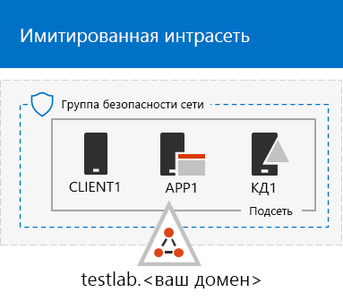
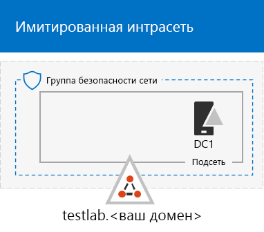

# <a name="the-simulated-enterprise-base-configuration"></a><span data-ttu-id="8c396-103">Базовая конфигурация "имитация предприятия"</span><span class="sxs-lookup"><span data-stu-id="8c396-103">The simulated enterprise base configuration</span></span>

<span data-ttu-id="8c396-104">*Это руководство по лаборатории тестирования можно использовать для тестовых сред Microsoft 365 корпоративный и Office 365 корпоративный.*</span><span class="sxs-lookup"><span data-stu-id="8c396-104">*This Test Lab Guide can be used for both Microsoft 365 Enterprise and Office 365 Enterprise test environments.*</span></span>

<span data-ttu-id="8c396-105">В этой статье вы найдете пошаговые инструкции по созданию упрощенной среды для Microsoft 365 корпоративный, которая включает:</span><span class="sxs-lookup"><span data-stu-id="8c396-105">This article provides you with step-by-step instructions to create a simplified environment for Microsoft 365 Enterprise that includes:</span></span>

- <span data-ttu-id="8c396-106">Пробная или платная подписка Microsoft 365 E5</span><span class="sxs-lookup"><span data-stu-id="8c396-106">A Microsoft 365 E5 trial or paid subscription.</span></span>
- <span data-ttu-id="8c396-107">упрощенную интрасеть организации, подключенную к Интернету и состоящую из трех виртуальных машин в виртуальной сети Azure (DC1, APP1 и CLIENT1).</span><span class="sxs-lookup"><span data-stu-id="8c396-107">A simplified organization intranet connected to the Internet, consisting of three virtual machines on an Azure virtual network (DC1, APP1, and CLIENT1).</span></span>
 


<span data-ttu-id="8c396-109">Вы можете использовать полученную среду для тестирования функций [Microsoft 365 корпоративный](https://www.microsoft.com/microsoft-365/enterprise) с дополнительными [руководствами по лаборатории тестирования](m365-enterprise-test-lab-guides.md) или без них.</span><span class="sxs-lookup"><span data-stu-id="8c396-109">You can use the resulting environment to test the features and functionality of [Microsoft 365 Enterprise](https://www.microsoft.com/microsoft-365/enterprise) with additional [Test Lab Guides](m365-enterprise-test-lab-guides.md) or on your own.</span></span>


> [!TIP]
> <span data-ttu-id="8c396-111">Перейдите в раздел [Руководства по лаборатории тестирования Microsoft 365 корпоративный](../media/m365-enterprise-test-lab-guides/Microsoft365EnterpriseTLGStack.pdf), чтобы просмотреть схему всех статей, относящихся к данной теме.</span><span class="sxs-lookup"><span data-stu-id="8c396-111">Go to [Microsoft 365 Enterprise Test Lab Guide Stack](../media/m365-enterprise-test-lab-guides/Microsoft365EnterpriseTLGStack.pdf) for a visual map to all the articles in the Microsoft 365 Enterprise Test Lab Guide stack.</span></span>

## <a name="phase-1-create-a-simulated-intranet"></a><span data-ttu-id="8c396-112">Этап 1. Создание имитированной интрасети</span><span class="sxs-lookup"><span data-stu-id="8c396-112">Phase 1: Create a simulated intranet</span></span>

<span data-ttu-id="8c396-113">На этом этапе вы создаете имитацию интрасети в службах инфраструктуры Azure, которая включает контроллер домена Active Directory Domain Services (AD DS), сервер приложений и клиентский компьютер.</span><span class="sxs-lookup"><span data-stu-id="8c396-113">In this phase, you build a simulated intranet in Azure infrastructure services that includes an Active Directory Domain Services (AD DS) domain controller, an application server, and a client computer.</span></span> 

<span data-ttu-id="8c396-114">Вы будете использовать эти компьютеры в дополнительных [Руководствах по лаборатории тестирования для Microsoft 365 корпоративный](m365-enterprise-test-lab-guides.md) для настройки и демонстрации гибридных удостоверений и других возможностей.</span><span class="sxs-lookup"><span data-stu-id="8c396-114">You'll use these computers in additional [Microsoft 365 Enterprise Test Lab Guides](m365-enterprise-test-lab-guides.md) to configure and demonstrate hybrid identity and other capabilities.</span></span>

### <a name="method-1-build-your-simulated-intranet-with-an-azure-resource-manager-template"></a><span data-ttu-id="8c396-115">Способ 1. Создание имитированной интрасети с помощью шаблона Azure Resource Manager</span><span class="sxs-lookup"><span data-stu-id="8c396-115">Method 1: Build your simulated intranet with an Azure Resource Manager template</span></span>

<span data-ttu-id="8c396-116">In this method, you use an Azure Resource Manager (ARM) template to build out the simulated intranet.</span><span class="sxs-lookup"><span data-stu-id="8c396-116">In this method, you use an Azure Resource Manager (ARM) template to build out the simulated intranet.</span></span> <span data-ttu-id="8c396-117">ARM templates contain all of the instructions to create the Azure networking infrastructure, the virtual machines, and their configuration.</span><span class="sxs-lookup"><span data-stu-id="8c396-117">ARM templates contain all of the instructions to create the Azure networking infrastructure, the virtual machines, and their configuration.</span></span>

<span data-ttu-id="8c396-118">Перед развертыванием шаблона ознакомьтесь со [страницей сведений шаблона (README)](https://github.com/maxskunkworks/TLG/tree/master/tlg-base-config_3-vm.m365-ems) и приготовьте приведенные ниже сведения.</span><span class="sxs-lookup"><span data-stu-id="8c396-118">Prior to deploying the template, read through the [template README page](https://github.com/maxskunkworks/TLG/tree/master/tlg-base-config_3-vm.m365-ems) and have the following information ready:</span></span>

- <span data-ttu-id="8c396-119">The public DNS domain name of your test environment (testlab.\<your public domain>).</span><span class="sxs-lookup"><span data-stu-id="8c396-119">The public DNS domain name of your test environment (testlab.\<your public domain>).</span></span> <span data-ttu-id="8c396-120">You'll need to enter this name in the **Domain Name field** of the **Custom deployment** page.</span><span class="sxs-lookup"><span data-stu-id="8c396-120">You'll need to enter this name in the **Domain Name field** of the **Custom deployment** page.</span></span>
- <span data-ttu-id="8c396-121">A DNS label prefix for the URLs of the public IP addresses of your virtual machines.</span><span class="sxs-lookup"><span data-stu-id="8c396-121">A DNS label prefix for the URLs of the public IP addresses of your virtual machines.</span></span> <span data-ttu-id="8c396-122">You'll need to enter this label in the **Dns Label Prefix** field of the **Custom deployment** page.</span><span class="sxs-lookup"><span data-stu-id="8c396-122">You'll need to enter this label in the **Dns Label Prefix** field of the **Custom deployment** page.</span></span>

<span data-ttu-id="8c396-123">После ознакомления с инструкциями нажмите **Развертывание в Azure** на [странице сведений шаблона (README)](https://github.com/maxskunkworks/TLG/tree/master/tlg-base-config_3-vm.m365-ems), чтобы приступить к работе.</span><span class="sxs-lookup"><span data-stu-id="8c396-123">After reading through the instructions, click **Deploy to Azure** on the [template README page](https://github.com/maxskunkworks/TLG/tree/master/tlg-base-config_3-vm.m365-ems) to get started.</span></span>

>[!Note]
><span data-ttu-id="8c396-124">Для имитации интрасети, созданной на основе шаблона ARM, требуется платная подписка Azure.</span><span class="sxs-lookup"><span data-stu-id="8c396-124">The simulated intranet built by the ARM template requires a paid Azure subscription.</span></span>
>

<span data-ttu-id="8c396-125">Ниже показана итоговая конфигурация после завершения работы с шаблоном.</span><span class="sxs-lookup"><span data-stu-id="8c396-125">Here is your configuration after the template is complete.</span></span>



### <a name="method-2-build-your-simulated-intranet-with-azure-powershell"></a><span data-ttu-id="8c396-127">Способ 2. Создание имитированной интрасети с помощью Azure PowerShell</span><span class="sxs-lookup"><span data-stu-id="8c396-127">Method 2: Build your simulated intranet with Azure PowerShell</span></span>

<span data-ttu-id="8c396-128">Этот способ предполагает использование Windows PowerShell и модуля Azure PowerShell для создания сетевой инфраструктуры, виртуальных машин и их конфигурации.</span><span class="sxs-lookup"><span data-stu-id="8c396-128">In this method, you use Windows PowerShell and the Azure PowerShell module to build out the networking infrastructure, the virtual machines, and their configuration.</span></span>

<span data-ttu-id="8c396-129">Use this method if you want to get experience creating elements of Azure infrastructure one step at a time with PowerShell.</span><span class="sxs-lookup"><span data-stu-id="8c396-129">Use this method if you want to get experience creating elements of Azure infrastructure one step at a time with PowerShell.</span></span> <span data-ttu-id="8c396-130">You can then customize the PowerShell command blocks for your own deployment of other virtual machines in Azure.</span><span class="sxs-lookup"><span data-stu-id="8c396-130">You can then customize the PowerShell command blocks for your own deployment of other virtual machines in Azure.</span></span>

#### <a name="step-1-create-dc1"></a><span data-ttu-id="8c396-131">Этап 1. Создание DC1</span><span class="sxs-lookup"><span data-stu-id="8c396-131">Step 1: Create DC1</span></span>

<span data-ttu-id="8c396-132">На этом этапе создается виртуальная сеть Azure и добавляется виртуальная машина DC1, которая является контроллером домена AD DS.</span><span class="sxs-lookup"><span data-stu-id="8c396-132">In this step, we create an Azure virtual network and add DC1, a virtual machine that is a domain controller for an AD DS domain.</span></span>

<span data-ttu-id="8c396-133">Сначала запустите командную строку Windows PowerShell на локальном компьютере.</span><span class="sxs-lookup"><span data-stu-id="8c396-133">First, start a Windows PowerShell command prompt on your local computer.</span></span>
  
> [!NOTE]
> <span data-ttu-id="8c396-134">The following command sets use the latest version of Azure PowerShell.</span><span class="sxs-lookup"><span data-stu-id="8c396-134">The following command sets use the latest version of Azure PowerShell.</span></span> <span data-ttu-id="8c396-135">See [Get started with Azure PowerShell cmdlets](https://docs.microsoft.com/powershell/azureps-cmdlets-docs/).</span><span class="sxs-lookup"><span data-stu-id="8c396-135">See [Get started with Azure PowerShell cmdlets](https://docs.microsoft.com/powershell/azureps-cmdlets-docs/).</span></span> 
  
<span data-ttu-id="8c396-136">Войдите в свою учетную запись Azure с помощью указанной ниже команды.</span><span class="sxs-lookup"><span data-stu-id="8c396-136">Sign in to your Azure account with the following command.</span></span>
  
```powershell
Connect-AzAccount
```

<span data-ttu-id="8c396-137">Получите имя подписки с помощью следующей команды.</span><span class="sxs-lookup"><span data-stu-id="8c396-137">Get your subscription name using the following command.</span></span>
  
```powershell
Get-AzSubscription | Sort Name | Select Name
```

<span data-ttu-id="8c396-138">Set your Azure subscription.</span><span class="sxs-lookup"><span data-stu-id="8c396-138">Set your Azure subscription.</span></span> <span data-ttu-id="8c396-139">Replace everything within the quotes, including the < and > characters, with the correct name.</span><span class="sxs-lookup"><span data-stu-id="8c396-139">Replace everything within the quotes, including the < and > characters, with the correct name.</span></span>
  
```powershell
$subscr="<subscription name>"
Get-AzSubscription -SubscriptionName $subscr | Select-AzSubscription
```

<span data-ttu-id="8c396-140">Next, create a new resource group for your simulated enterprise test lab.</span><span class="sxs-lookup"><span data-stu-id="8c396-140">Next, create a new resource group for your simulated enterprise test lab.</span></span> <span data-ttu-id="8c396-141">To determine a unique resource group name, use this command to list your existing resource groups.</span><span class="sxs-lookup"><span data-stu-id="8c396-141">To determine a unique resource group name, use this command to list your existing resource groups.</span></span>
  
```powershell
Get-AzResourceGroup | Sort ResourceGroupName | Select ResourceGroupName
```

<span data-ttu-id="8c396-142">Create your new resource group with these commands.</span><span class="sxs-lookup"><span data-stu-id="8c396-142">Create your new resource group with these commands.</span></span> <span data-ttu-id="8c396-143">Replace everything within the quotes, including the < and > characters, with the correct names.</span><span class="sxs-lookup"><span data-stu-id="8c396-143">Replace everything within the quotes, including the < and > characters, with the correct names.</span></span>
  
```powershell
$rgName="<resource group name>"
$locName="<location name, such as West US>"
New-AzResourceGroup -Name $rgName -Location $locName
```

<span data-ttu-id="8c396-144">Next, you create the TestLab virtual network that will host the Corpnet subnet of the simulated enterprise environment and protect it with a network security group.</span><span class="sxs-lookup"><span data-stu-id="8c396-144">Next, you create the TestLab virtual network that will host the Corpnet subnet of the simulated enterprise environment and protect it with a network security group.</span></span> <span data-ttu-id="8c396-145">Fill in the name of your resource group and run these commands at the PowerShell command prompt on your local computer.</span><span class="sxs-lookup"><span data-stu-id="8c396-145">Fill in the name of your resource group and run these commands at the PowerShell command prompt on your local computer.</span></span>
  
```powershell
$rgName="<name of your new resource group>"
$locName=(Get-AzResourceGroup -Name $rgName).Location
$corpnetSubnet=New-AzVirtualNetworkSubnetConfig -Name Corpnet -AddressPrefix 10.0.0.0/24
New-AzVirtualNetwork -Name TestLab -ResourceGroupName $rgName -Location $locName -AddressPrefix 10.0.0.0/8 -Subnet $corpnetSubnet -DNSServer 10.0.0.4
$rule1=New-AzNetworkSecurityRuleConfig -Name "RDPTraffic" -Description "Allow RDP to all VMs on the subnet" -Access Allow -Protocol Tcp -Direction Inbound -Priority 100 -SourceAddressPrefix Internet -SourcePortRange * -DestinationAddressPrefix * -DestinationPortRange 3389
New-AzNetworkSecurityGroup -Name Corpnet -ResourceGroupName $rgName -Location $locName -SecurityRules $rule1
$vnet=Get-AzVirtualNetwork -ResourceGroupName $rgName -Name TestLab
$nsg=Get-AzNetworkSecurityGroup -Name Corpnet -ResourceGroupName $rgName
Set-AzVirtualNetworkSubnetConfig -VirtualNetwork $vnet -Name Corpnet -AddressPrefix "10.0.0.0/24" -NetworkSecurityGroup $nsg
$vnet | Set-AzVirtualNetwork
```

<span data-ttu-id="8c396-146">Затем создайте виртуальную машину DC1 и настройте ее как контроллер домена для **testlab.**\<your public domain></span><span class="sxs-lookup"><span data-stu-id="8c396-146">Next, you create the DC1 virtual machine and configure it as a domain controller for the **testlab.**\<your public domain></span></span> <span data-ttu-id="8c396-147">Домен AD DS и DNS-сервер для виртуальных машин виртуальной сети TestLab.</span><span class="sxs-lookup"><span data-stu-id="8c396-147">AD DS domain and a DNS server for the virtual machines of the TestLab virtual network.</span></span> <span data-ttu-id="8c396-148">Например, если ваше имя публичного домена — **<span>contoso</span>.com**, виртуальная машина DC1 будет контроллером домена **<span>testlab</span>.contoso.com**.</span><span class="sxs-lookup"><span data-stu-id="8c396-148">For example, if your public domain name is **<span>contoso</span>.com**, the DC1 virtual machine will be a domain controller for the **<span>testlab</span>.contoso.com** domain.</span></span>
  
<span data-ttu-id="8c396-149">Чтобы создать виртуальную машину Azure для DC1, укажите имя группы ресурсов и выполните приведенные ниже команды в командной строке PowerShell на локальном компьютере.</span><span class="sxs-lookup"><span data-stu-id="8c396-149">To create an Azure virtual machine for DC1, fill in the name of your resource group and run these commands at the PowerShell command prompt on your local computer.</span></span>
  
```powershell
$rgName="<resource group name>"
$locName=(Get-AzResourceGroup -Name $rgName).Location
$vnet=Get-AzVirtualNetwork -Name TestLab -ResourceGroupName $rgName
$pip=New-AzPublicIpAddress -Name DC1-PIP -ResourceGroupName $rgName -Location $locName -AllocationMethod Dynamic
$nic=New-AzNetworkInterface -Name DC1-NIC -ResourceGroupName $rgName -Location $locName -SubnetId $vnet.Subnets[0].Id -PublicIpAddressId $pip.Id -PrivateIpAddress 10.0.0.4
$vm=New-AzVMConfig -VMName DC1 -VMSize Standard_A2_V2
$cred=Get-Credential -Message "Type the name and password of the local administrator account for DC1."
$vm=Set-AzVMOperatingSystem -VM $vm -Windows -ComputerName DC1 -Credential $cred -ProvisionVMAgent -EnableAutoUpdate
$vm=Set-AzVMSourceImage -VM $vm -PublisherName MicrosoftWindowsServer -Offer WindowsServer -Skus 2016-Datacenter -Version "latest"
$vm=Add-AzVMNetworkInterface -VM $vm -Id $nic.Id
$vm=Set-AzVMOSDisk -VM $vm -Name "DC1-OS" -DiskSizeInGB 128 -CreateOption FromImage
$diskConfig=New-AzDiskConfig -AccountType "Standard_LRS" -Location $locName -CreateOption Empty -DiskSizeGB 20
$dataDisk1=New-AzDisk -DiskName "DC1-DataDisk1" -Disk $diskConfig -ResourceGroupName $rgName
$vm=Add-AzVMDataDisk -VM $vm -Name "DC1-DataDisk1" -CreateOption Attach -ManagedDiskId $dataDisk1.Id -Lun 1
New-AzVM -ResourceGroupName $rgName -Location $locName -VM $vm
```

<span data-ttu-id="8c396-150">You will be prompted for a user name and password for the local administrator account on DC1.</span><span class="sxs-lookup"><span data-stu-id="8c396-150">You will be prompted for a user name and password for the local administrator account on DC1.</span></span> <span data-ttu-id="8c396-151">Use a strong password and record both the name and password in a secure location.</span><span class="sxs-lookup"><span data-stu-id="8c396-151">Use a strong password and record both the name and password in a secure location.</span></span>
  
<span data-ttu-id="8c396-152">После этого подключитесь к виртуальной машине DC1.</span><span class="sxs-lookup"><span data-stu-id="8c396-152">Next, connect to the DC1 virtual machine.</span></span>
  
1. <span data-ttu-id="8c396-153">На [портале Azure](https://portal.azure.com) выберите **Группы ресурсов >** [имя новой группы ресурсов] **> DC1 > Подключить**.</span><span class="sxs-lookup"><span data-stu-id="8c396-153">In the [Azure portal](https://portal.azure.com), click **Resource Groups >** [the name of your new resource group] **> DC1 > Connect**.</span></span>
    
2. <span data-ttu-id="8c396-154">In the open pane, click **Download RDP file**.</span><span class="sxs-lookup"><span data-stu-id="8c396-154">In the open pane, click **Download RDP file**.</span></span> <span data-ttu-id="8c396-155">Open the DC1.rdp file that is downloaded, and then click **Connect**.</span><span class="sxs-lookup"><span data-stu-id="8c396-155">Open the DC1.rdp file that is downloaded, and then click **Connect**.</span></span>
    
3. <span data-ttu-id="8c396-156">Укажите имя учетной записи локального администратора DC1:</span><span class="sxs-lookup"><span data-stu-id="8c396-156">Specify the DC1 local administrator account name:</span></span>
    
   - <span data-ttu-id="8c396-157">Для Windows 7:</span><span class="sxs-lookup"><span data-stu-id="8c396-157">For Windows 7:</span></span>
    
     <span data-ttu-id="8c396-158">In the **Windows Security** dialog box, click **Use another account**.</span><span class="sxs-lookup"><span data-stu-id="8c396-158">In the **Windows Security** dialog box, click **Use another account**.</span></span> <span data-ttu-id="8c396-159">In **User name**, type **DC1\\**[Local administrator account name].</span><span class="sxs-lookup"><span data-stu-id="8c396-159">In **User name**, type **DC1\\**[Local administrator account name].</span></span>
    
   - <span data-ttu-id="8c396-160">Для Windows 8 и Windows 10:</span><span class="sxs-lookup"><span data-stu-id="8c396-160">For Windows 8 or Windows 10:</span></span>
    
     <span data-ttu-id="8c396-161">In the **Windows Security** dialog box, click **More choices**, and then click **Use a different account**.</span><span class="sxs-lookup"><span data-stu-id="8c396-161">In the **Windows Security** dialog box, click **More choices**, and then click **Use a different account**.</span></span> <span data-ttu-id="8c396-162">In **User name**, type **DC1\\**[Local administrator account name].</span><span class="sxs-lookup"><span data-stu-id="8c396-162">In **User name**, type **DC1\\**[Local administrator account name].</span></span>
    
4. <span data-ttu-id="8c396-163">В поле **Пароль** укажите пароль к учетной записи локального администратора, а затем нажмите кнопку **ОК**.</span><span class="sxs-lookup"><span data-stu-id="8c396-163">In **Password**, type the password of the local administrator account, and then click **OK**.</span></span>
    
5. <span data-ttu-id="8c396-164">Когда появится соответствующий запрос, нажмите кнопку **Да**.</span><span class="sxs-lookup"><span data-stu-id="8c396-164">When prompted, click **Yes**.</span></span>
    
<span data-ttu-id="8c396-165">После этого добавьте еще один диск с данными в качестве нового тома с буквой диска "F:", используя приведенные ниже команды в командной строке Windows PowerShell на уровне администратора в DC1.</span><span class="sxs-lookup"><span data-stu-id="8c396-165">Next, add an extra data disk as a new volume with the drive letter F: with this command at an administrator-level Windows PowerShell command prompt on DC1.</span></span>
  
```powershell
Get-Disk | Where PartitionStyle -eq "RAW" | Initialize-Disk -PartitionStyle MBR -PassThru | New-Partition -AssignDriveLetter -UseMaximumSize | Format-Volume -FileSystem NTFS -NewFileSystemLabel "WSAD Data"
```

<span data-ttu-id="8c396-166">Затем настройте DC1 как контроллер домена и DNS-сервер для домена **testlab.**\<your public domain></span><span class="sxs-lookup"><span data-stu-id="8c396-166">Next, configure DC1 as a domain controller and DNS server for the **testlab.**\<your public domain></span></span> <span data-ttu-id="8c396-167">.</span><span class="sxs-lookup"><span data-stu-id="8c396-167">domain.</span></span> <span data-ttu-id="8c396-168">Укажите имя своего общедоступного домена, удалите символы \< and >, а затем выполните указанные ниже команды в командной строке Windows PowerShell на уровне администратора в DC1.</span><span class="sxs-lookup"><span data-stu-id="8c396-168">Specify your public domain name, remove the \< and > characters, and then run these commands at an administrator-level Windows PowerShell command prompt on DC1.</span></span>
  
```powershell
$yourDomain="<your public domain>"
Install-WindowsFeature AD-Domain-Services -IncludeManagementTools
Install-ADDSForest -DomainName testlab.$yourDomain -DatabasePath "F:\NTDS" -SysvolPath "F:\SYSVOL" -LogPath "F:\Logs"
```
<span data-ttu-id="8c396-169">You will need to specify a safe mode administrator password.</span><span class="sxs-lookup"><span data-stu-id="8c396-169">You will need to specify a safe mode administrator password.</span></span> <span data-ttu-id="8c396-170">Store this password in a secure location.</span><span class="sxs-lookup"><span data-stu-id="8c396-170">Store this password in a secure location.</span></span>
  
<span data-ttu-id="8c396-171">Обратите внимание, что на выполнение этих команд может потребоваться несколько минут.</span><span class="sxs-lookup"><span data-stu-id="8c396-171">Note that these commands can take a few minutes to complete.</span></span>
  
<span data-ttu-id="8c396-172">После перезапуска виртуальной машины DC1 снова подключитесь к ней.</span><span class="sxs-lookup"><span data-stu-id="8c396-172">After DC1 restarts, reconnect to the DC1 virtual machine.</span></span>
  
1. <span data-ttu-id="8c396-173">На [портале Azure](https://portal.azure.com) выберите элементы **Группы ресурсов >** [имя вашей группы ресурсов] \*\* DC1 > Подключить\*\*.</span><span class="sxs-lookup"><span data-stu-id="8c396-173">In the [Azure portal](https://portal.azure.com), click **Resource Groups >** [your resource group name] **> DC1 > Connect**.</span></span>
    
2. <span data-ttu-id="8c396-174">Запустите скачанный файл DC1.rdp, а затем нажмите **Подключить**.</span><span class="sxs-lookup"><span data-stu-id="8c396-174">Run the DC1.rdp file that is downloaded, and then click **Connect**.</span></span>
    
3. <span data-ttu-id="8c396-175">In **Windows Security**, click **Use another account**.</span><span class="sxs-lookup"><span data-stu-id="8c396-175">In **Windows Security**, click **Use another account**.</span></span> <span data-ttu-id="8c396-176">In **User name**, type **TESTLAB\\**[Local administrator account name].</span><span class="sxs-lookup"><span data-stu-id="8c396-176">In **User name**, type **TESTLAB\\**[Local administrator account name].</span></span>
    
4. <span data-ttu-id="8c396-177">В поле **Пароль** укажите пароль к учетной записи локального администратора, а затем нажмите кнопку **ОК**.</span><span class="sxs-lookup"><span data-stu-id="8c396-177">In **Password**, type the password of the local administrator account, and then click **OK**.</span></span>
    
5. <span data-ttu-id="8c396-178">Когда появится соответствующий запрос, нажмите кнопку **Да**.</span><span class="sxs-lookup"><span data-stu-id="8c396-178">When prompted, click **Yes**.</span></span>
    
<span data-ttu-id="8c396-179">Next, create a user account in Active Directory that will be used when logging in to TESTLAB domain member computers.</span><span class="sxs-lookup"><span data-stu-id="8c396-179">Next, create a user account in Active Directory that will be used when logging in to TESTLAB domain member computers.</span></span> <span data-ttu-id="8c396-180">Run this command at an administrator-level Windows PowerShell command prompt.</span><span class="sxs-lookup"><span data-stu-id="8c396-180">Run this command at an administrator-level Windows PowerShell command prompt.</span></span>
  
```powershell
New-ADUser -SamAccountName User1 -AccountPassword (read-host "Set user password" -assecurestring) -name "User1" -enabled $true -PasswordNeverExpires $true -ChangePasswordAtLogon $false
```

<span data-ttu-id="8c396-181">Note that this command prompts you to supply the User1 account password.</span><span class="sxs-lookup"><span data-stu-id="8c396-181">Note that this command prompts you to supply the User1 account password.</span></span> <span data-ttu-id="8c396-182">Because this account will be used for remote desktop connections for all TESTLAB domain member computers, choose a strong password.</span><span class="sxs-lookup"><span data-stu-id="8c396-182">Because this account will be used for remote desktop connections for all TESTLAB domain member computers, choose a strong password.</span></span> <span data-ttu-id="8c396-183">Record the User1 account password and store it in a secured location.</span><span class="sxs-lookup"><span data-stu-id="8c396-183">Record the User1 account password and store it in a secured location.</span></span>
  
<span data-ttu-id="8c396-184">Next, configure the new User1 account as a domain, enterprise, and schema administrator.</span><span class="sxs-lookup"><span data-stu-id="8c396-184">Next, configure the new User1 account as a domain, enterprise, and schema administrator.</span></span> <span data-ttu-id="8c396-185">Run this command at the administrator-level Windows PowerShell command prompt.</span><span class="sxs-lookup"><span data-stu-id="8c396-185">Run this command at the administrator-level Windows PowerShell command prompt.</span></span>
  
```powershell
$yourDomain="<your public domain>"
$domainName = "testlab."+$yourDomain
$userName="user1@" + $domainName
$userSID=(New-Object System.Security.Principal.NTAccount($userName)).Translate([System.Security.Principal.SecurityIdentifier]).Value
$groupNames=@("Domain Admins","Enterprise Admins","Schema Admins")
ForEach ($name in $groupNames) {Add-ADPrincipalGroupMembership -Identity $userSID -MemberOf (Get-ADGroup -Identity $name).SID.Value}
```

<span data-ttu-id="8c396-186">Закройте сеанс удаленного рабочего стола DC1 и подключитесь заново, используя учетную запись TESTLAB\\User1.</span><span class="sxs-lookup"><span data-stu-id="8c396-186">Close the Remote Desktop session with DC1 and then reconnect using the TESTLAB\\User1 account.</span></span>
  
<span data-ttu-id="8c396-187">Чтобы разрешить трафик для средства Ping, выполните приведенную ниже команду в командной строке Windows PowerShell от имени администратора.</span><span class="sxs-lookup"><span data-stu-id="8c396-187">Next, to allow traffic for the Ping tool, run this command at an administrator-level Windows PowerShell command prompt.</span></span>
  
```powershell
Set-NetFirewallRule -DisplayName "File and Printer Sharing (Echo Request - ICMPv4-In)" -enabled True
```

<span data-ttu-id="8c396-188">Это ваша текущая конфигурация.</span><span class="sxs-lookup"><span data-stu-id="8c396-188">This is your current configuration.</span></span>
  

  
#### <a name="step-2-configure-app1"></a><span data-ttu-id="8c396-190">Шаг 2. Настройка APP1</span><span class="sxs-lookup"><span data-stu-id="8c396-190">Step 2: Configure APP1</span></span>

<span data-ttu-id="8c396-191">На этом этапе создается и настраивается сервер приложений APP1, который вначале выступает в качестве веб-сервера и сервера обмена файлами.</span><span class="sxs-lookup"><span data-stu-id="8c396-191">In this step, you create and configure APP1, which is an application server that initially provides web and file sharing services.</span></span>

<span data-ttu-id="8c396-192">Чтобы создать виртуальную машину Azure для APP1, сначала укажите имя группы ресурсов, а затем выполните приведенные ниже команды в командной строке на локальном компьютере.</span><span class="sxs-lookup"><span data-stu-id="8c396-192">To create an Azure Virtual Machine for APP1, fill in the name of your resource group and run these commands at the  command prompt on your local computer.</span></span>
  
```powershell
$rgName="<resource group name>"
$locName=(Get-AzResourceGroup -Name $rgName).Location
$vnet=Get-AzVirtualNetwork -Name TestLab -ResourceGroupName $rgName
$pip=New-AzPublicIpAddress -Name APP1-PIP -ResourceGroupName $rgName -Location $locName -AllocationMethod Dynamic
$nic=New-AzNetworkInterface -Name APP1-NIC -ResourceGroupName $rgName -Location $locName -SubnetId $vnet.Subnets[0].Id -PublicIpAddressId $pip.Id
$vm=New-AzVMConfig -VMName APP1 -VMSize Standard_A2_V2
$cred=Get-Credential -Message "Type the name and password of the local administrator account for APP1."
$vm=Set-AzVMOperatingSystem -VM $vm -Windows -ComputerName APP1 -Credential $cred -ProvisionVMAgent -EnableAutoUpdate
$vm=Set-AzVMSourceImage -VM $vm -PublisherName MicrosoftWindowsServer -Offer WindowsServer -Skus 2016-Datacenter -Version "latest"
$vm=Add-AzVMNetworkInterface -VM $vm -Id $nic.Id
$vm=Set-AzVMOSDisk -VM $vm -Name "APP1-OS" -DiskSizeInGB 128 -CreateOption FromImage
New-AzVM -ResourceGroupName $rgName -Location $locName -VM $vm
```

<span data-ttu-id="8c396-193">После этого подключитесь к виртуальной машине APP1, используя имя и пароль для учетной записи локального администратора APP1. Затем откройте командную строку Windows PowerShell.</span><span class="sxs-lookup"><span data-stu-id="8c396-193">Next, connect to the APP1 virtual machine using the APP1 local administrator account name and password, and then open a Windows PowerShell command prompt.</span></span>
  
<span data-ttu-id="8c396-194">Чтобы проверить разрешение имен и сетевое взаимодействие между APP1 и DC1, выполните команду **ping dc1.testlab.**\<your public domain name></span><span class="sxs-lookup"><span data-stu-id="8c396-194">To check name resolution and network communication between APP1 and DC1, run the **ping dc1.testlab.**\<your public domain name></span></span> <span data-ttu-id="8c396-195">и убедитесь что получено четыре ответа.</span><span class="sxs-lookup"><span data-stu-id="8c396-195">command and verify that there are four replies.</span></span>
  
<span data-ttu-id="8c396-196">Затем присоедините виртуальную машину APP1 к домену TESTLAB, выполнив приведенные ниже команды в командной строке Windows PowerShell.</span><span class="sxs-lookup"><span data-stu-id="8c396-196">Next, join the APP1 virtual machine to the TESTLAB domain with these commands at the Windows PowerShell prompt.</span></span>
  
```powershell
$yourDomain="<your public domain name>"
Add-Computer -DomainName ("testlab." + $yourDomain)
Restart-Computer
```

<span data-ttu-id="8c396-197">Обратите внимание, что после выполнения команды **Add-Computer** вам потребуется указать данные учетной записи домена TESTLAB\\User1.</span><span class="sxs-lookup"><span data-stu-id="8c396-197">Note that you must supply the TESTLAB\\User1 domain account credentials after running the **Add-Computer** command.</span></span>
  
<span data-ttu-id="8c396-198">После перезапуска сервера APP1 подключитесь к нему, используя учетную запись TESTLAB\\User1, а затем откройте командную строку Windows PowerShell от имени администратора.</span><span class="sxs-lookup"><span data-stu-id="8c396-198">After APP1 restarts, connect to it using the TESTLAB\\User1 account, and then open an administrator-level Windows PowerShell command prompt.</span></span>
  
<span data-ttu-id="8c396-199">После этого сделайте APP1 веб-сервером, выполнив приведенную ниже команду от имени администратора в командной строке Windows PowerShell на APP1.</span><span class="sxs-lookup"><span data-stu-id="8c396-199">Next, make APP1 a web server with this command at an administrator-level Windows PowerShell command prompt on APP1.</span></span>
  
```powershell
Install-WindowsFeature Web-WebServer -IncludeManagementTools
```

<span data-ttu-id="8c396-200">Создайте общую папку и текстовый файл в папке на APP1 с помощью указанных ниже команд PowerShell.</span><span class="sxs-lookup"><span data-stu-id="8c396-200">Next, create a shared folder and a text file within the folder on APP1 with these PowerShell commands.</span></span>
  
```powershell
New-Item -path c:\files -type directory
Write-Output "This is a shared file." | out-file c:\files\example.txt
New-SmbShare -name files -path c:\files -changeaccess TESTLAB\User1
```

<span data-ttu-id="8c396-201">Это ваша текущая конфигурация.</span><span class="sxs-lookup"><span data-stu-id="8c396-201">This is your current configuration.</span></span>
  

  
#### <a name="step-3-configure-client1"></a><span data-ttu-id="8c396-203">Этап 3: настройка CLIENT1.</span><span class="sxs-lookup"><span data-stu-id="8c396-203">Step 3: Configure CLIENT1</span></span>

<span data-ttu-id="8c396-204">На этом этапе создается и настраивается виртуальная машина CLIENT1, которая выступает в качестве типичного ноутбука, планшета или настольного компьютера в интрасети.</span><span class="sxs-lookup"><span data-stu-id="8c396-204">In this step, you create and configure CLIENT1, which acts as a typical laptop, tablet, or desktop computer on the intranet.</span></span>

> [!NOTE]  
> <span data-ttu-id="8c396-205">The following command set creates CLIENT1 running Windows Server 2016 Datacenter, which can be done for all types of Azure subscriptions.</span><span class="sxs-lookup"><span data-stu-id="8c396-205">The following command set creates CLIENT1 running Windows Server 2016 Datacenter, which can be done for all types of Azure subscriptions.</span></span> <span data-ttu-id="8c396-206">If you have a Visual Studio-based Azure subscription, you can create CLIENT1 running Windows 10 with the [Azure portal](https://portal.azure.com).</span><span class="sxs-lookup"><span data-stu-id="8c396-206">If you have a Visual Studio-based Azure subscription, you can create CLIENT1 running Windows 10 with the [Azure portal](https://portal.azure.com).</span></span> 
  
<span data-ttu-id="8c396-207">Чтобы создать виртуальную машину Azure для CLIENT1, сначала укажите имя группы ресурсов, а затем выполните приведенные ниже команды в командной строке на локальном компьютере.</span><span class="sxs-lookup"><span data-stu-id="8c396-207">To create an Azure Virtual Machine for CLIENT1, fill in the name of your resource group and run these commands at the  command prompt on your local computer.</span></span>
  
```powershell
$rgName="<resource group name>"
$locName=(Get-AzResourceGroup -Name $rgName).Location
$vnet=Get-AzVirtualNetwork -Name TestLab -ResourceGroupName $rgName
$pip=New-AzPublicIpAddress -Name CLIENT1-PIP -ResourceGroupName $rgName -Location $locName -AllocationMethod Dynamic
$nic=New-AzNetworkInterface -Name CLIENT1-NIC -ResourceGroupName $rgName -Location $locName -SubnetId $vnet.Subnets[0].Id -PublicIpAddressId $pip.Id
$vm=New-AzVMConfig -VMName CLIENT1 -VMSize Standard_A2_V2
$cred=Get-Credential -Message "Type the name and password of the local administrator account for CLIENT1."
$vm=Set-AzVMOperatingSystem -VM $vm -Windows -ComputerName CLIENT1 -Credential $cred -ProvisionVMAgent -EnableAutoUpdate
$vm=Set-AzVMSourceImage -VM $vm -PublisherName MicrosoftWindowsServer -Offer WindowsServer -Skus 2016-Datacenter -Version "latest"
$vm=Add-AzVMNetworkInterface -VM $vm -Id $nic.Id
$vm=Set-AzVMOSDisk -VM $vm -Name "CLIENT1-OS" -DiskSizeInGB 128 -CreateOption FromImage
New-AzVM -ResourceGroupName $rgName -Location $locName -VM $vm
```

<span data-ttu-id="8c396-208">После этого подключитесь к виртуальной машине CLIENT1, используя имя и пароль для учетной записи локального администратора CLIENT1. Затем откройте командную строку Windows PowerShell от имени администратора.</span><span class="sxs-lookup"><span data-stu-id="8c396-208">Next, connect to the CLIENT1 virtual machine using the CLIENT1 local administrator account name and password, and then open an administrator-level Windows PowerShell command prompt.</span></span>
  
<span data-ttu-id="8c396-209">Чтобы проверить разрешение имен и сетевое взаимодействие между CLIENT1 и DC1, выполните команду **ping dc1.testlab.**\<your public domain name></span><span class="sxs-lookup"><span data-stu-id="8c396-209">To check name resolution and network communication between CLIENT1 and DC1, run the **ping dc1.testlab.**\<your public domain name></span></span> <span data-ttu-id="8c396-210">в командной строке Windows PowerShell и убедитесь, что получено четыре ответа.</span><span class="sxs-lookup"><span data-stu-id="8c396-210">command at a Windows PowerShell command prompt and verify that there are four replies.</span></span>
  
<span data-ttu-id="8c396-211">Затем присоедините виртуальную машину CLIENT1 к домену TESTLAB, выполнив приведенные ниже команды в командной строке Windows PowerShell.</span><span class="sxs-lookup"><span data-stu-id="8c396-211">Next, join the CLIENT1 virtual machine to the TESTLAB domain with these commands at the Windows PowerShell prompt.</span></span>
  
```powershell
$yourDomain="<your public domain name>"
Add-Computer -DomainName ("testlab." + $yourDomain)
Restart-Computer
```

<span data-ttu-id="8c396-212">Обратите внимание, что после выполнения команды **Add-Computer** вам потребуется указать данные учетной записи домена TESTLAB\\User1.</span><span class="sxs-lookup"><span data-stu-id="8c396-212">Note that you must supply your TESTLAB\\User1 domain account credentials after running the **Add-Computer** command.</span></span>
  
<span data-ttu-id="8c396-213">После перезапуска виртуальной машины CLIENT1 подключитесь к ней, используя учетную запись TESTLAB\\User1, а затем откройте командную строку Windows PowerShell от имени администратора.</span><span class="sxs-lookup"><span data-stu-id="8c396-213">After CLIENT1 restarts, connect to it using the TESTLAB\\User1 account name and password, and then open an administrator-level Windows PowerShell command prompt.</span></span>
  
<span data-ttu-id="8c396-214">Затем проверьте доступ к веб-ресурсам и общим файловым ресурсам на APP1 с CLIENT1.</span><span class="sxs-lookup"><span data-stu-id="8c396-214">Next, verify that you can access web and file share resources on APP1 from CLIENT1.</span></span>
  
1. <span data-ttu-id="8c396-215">В области дерева диспетчера серверов выберите **Локальный сервер**.</span><span class="sxs-lookup"><span data-stu-id="8c396-215">In Server Manager, in the tree pane, click **Local Server**.</span></span>
    
2. <span data-ttu-id="8c396-216">В поле **Свойства CLIENT1** выберите значение **Вкл.** для параметра **Конфигурация усиленной безопасности Internet Explorer**.</span><span class="sxs-lookup"><span data-stu-id="8c396-216">In **Properties for CLIENT1**, click **On** next to **IE Enhanced Security Configuration**.</span></span>
    
3. <span data-ttu-id="8c396-217">В разделе **Конфигурация усиленной безопасности Internet Explorer** для параметров **Администраторы** и **Пользователи** выберите значение **Выкл.** и нажмите кнопку **ОК**.</span><span class="sxs-lookup"><span data-stu-id="8c396-217">In **Internet Explorer Enhanced Security Configuration**, click **Off** for **Administrators** and **Users**, and then click **OK**.</span></span>
    
4. <span data-ttu-id="8c396-218">На начальном экране выберите **Internet Explorer** и нажмите кнопку **ОК**.</span><span class="sxs-lookup"><span data-stu-id="8c396-218">From the Start screen, click **Internet Explorer**, and then click **OK**.</span></span>
    
5. <span data-ttu-id="8c396-219">В адресной строке браузера введите **http<span>://</span>app1.testlab.**\<your public domain name>**/**, а затем нажмите клавишу ВВОД.</span><span class="sxs-lookup"><span data-stu-id="8c396-219">In the Address bar, type **http<span>://</span>app1.testab.**\<your public domain name>**/**, and then press ENTER.</span></span> <span data-ttu-id="8c396-220">Вы увидите страницу служб IIS по умолчанию для APP1.</span><span class="sxs-lookup"><span data-stu-id="8c396-220">You should see the default Internet Information Services web page for APP1.</span></span>
    
6. <span data-ttu-id="8c396-221">Нажмите значок проводника на панели задач рабочего стола.</span><span class="sxs-lookup"><span data-stu-id="8c396-221">From the desktop taskbar, click the File Explorer icon.</span></span>
    
7. <span data-ttu-id="8c396-222">In the address bar, type **\\\\app1\\Files**, and then press ENTER.</span><span class="sxs-lookup"><span data-stu-id="8c396-222">In the address bar, type **\\\\app1\\Files**, and then press ENTER.</span></span> <span data-ttu-id="8c396-223">You should see a folder window with the contents of the Files shared folder.</span><span class="sxs-lookup"><span data-stu-id="8c396-223">You should see a folder window with the contents of the Files shared folder.</span></span>
    
8. <span data-ttu-id="8c396-224">In the **Files** shared folder window, double-click the **Example.txt** file.</span><span class="sxs-lookup"><span data-stu-id="8c396-224">In the **Files** shared folder window, double-click the **Example.txt** file.</span></span> <span data-ttu-id="8c396-225">You should see the contents of the Example.txt file.</span><span class="sxs-lookup"><span data-stu-id="8c396-225">You should see the contents of the Example.txt file.</span></span>
    
9. <span data-ttu-id="8c396-226">Закройте окно **example.txt - Блокнот** и окно общей папки **Files**.</span><span class="sxs-lookup"><span data-stu-id="8c396-226">Close the **example.txt - Notepad** and the **Files** shared folder windows.</span></span>
    
<span data-ttu-id="8c396-227">Это ваша текущая конфигурация.</span><span class="sxs-lookup"><span data-stu-id="8c396-227">This is your current configuration.</span></span>
  


## <a name="phase-2-create-your-microsoft-365-e5-subscription"></a><span data-ttu-id="8c396-229">Этап 2. Создание подписки Microsoft 365 E5</span><span class="sxs-lookup"><span data-stu-id="8c396-229">Phase 2: Create your Microsoft 365 E5 subscription</span></span>

<span data-ttu-id="8c396-230">На этом этапе создается новая подписка Microsoft 365 E5, связанная с новым клиентом Azure AD, независимым от производственной подписки.</span><span class="sxs-lookup"><span data-stu-id="8c396-230">In this phase, you create a new Microsoft 365 E5 subscription that uses a new Azure AD tenant, one that is separate from your production subscription.</span></span> <span data-ttu-id="8c396-231">Это можно сделать двумя способами:</span><span class="sxs-lookup"><span data-stu-id="8c396-231">You can do this in two ways:</span></span>

- <span data-ttu-id="8c396-232">Использовать пробную подписку Microsoft 365 E5.</span><span class="sxs-lookup"><span data-stu-id="8c396-232">Use a trial subscription of Microsoft 365 E5.</span></span> 

  <span data-ttu-id="8c396-233">Пробная подписка на Office 365 E5 действительна в течение 30 дней, и этот срок можно легко продлить до 60 дней.</span><span class="sxs-lookup"><span data-stu-id="8c396-233">The Microsoft 365 E5 trial subscription is 30 days, which can be easily extended to 60 days.</span></span> <span data-ttu-id="8c396-234">После окончания срока действия пробной подписки, необходимо оформить платную подписку или создать новую пробную подписку.</span><span class="sxs-lookup"><span data-stu-id="8c396-234">When the trial subscription expires, you must either convert it to a paid subscription or create a new trial subscription.</span></span> <span data-ttu-id="8c396-235">Создание новой пробной подписки означает, что вы потеряете свою конфигурацию, которая может включать сложные сценарии.</span><span class="sxs-lookup"><span data-stu-id="8c396-235">Creating new trial subscriptions means you will leave your configuration, which could include complex scenarios, behind.</span></span>  

- <span data-ttu-id="8c396-236">Использовать отдельную производственную подписку на Microsoft 365 E5 с небольшим количеством лицензий.</span><span class="sxs-lookup"><span data-stu-id="8c396-236">Use a separate production subscription of Microsoft 365 E5 with a small number of licenses.</span></span>

  <span data-ttu-id="8c396-237">This is an additional cost, but ensures that you have a working test environment to try features, configurations, and scenarios that does not expire.</span><span class="sxs-lookup"><span data-stu-id="8c396-237">This is an additional cost, but ensures that you have a working test environment to try features, configurations, and scenarios that does not expire.</span></span> <span data-ttu-id="8c396-238">You can use the same test environment over the long term for proofs of concept, demonstration to peers and management, and application development and testing.</span><span class="sxs-lookup"><span data-stu-id="8c396-238">You can use the same test environment over the long term for proofs of concept, demonstration to peers and management, and application development and testing.</span></span> <span data-ttu-id="8c396-239">This is the recommended method.</span><span class="sxs-lookup"><span data-stu-id="8c396-239">This is the recommended method.</span></span>

### <a name="sign-up-for-an-office-365-e5-trial-subscription"></a><span data-ttu-id="8c396-240">Оформление пробной подписки на Office 365 E5</span><span class="sxs-lookup"><span data-stu-id="8c396-240">Sign up for an Office 365 E5 trial subscription</span></span>

<span data-ttu-id="8c396-241">На портале Azure подключитесь к компьютеру CLIENT1, используя учетную запись CORP\User1.</span><span class="sxs-lookup"><span data-stu-id="8c396-241">Connect to CLIENT1 with the CORP\User1 account from the Azure portal.</span></span>

<span data-ttu-id="8c396-242">Чтобы создать пробную подписку на Office 365 E5, выполните инструкции из [этапа 1](lightweight-base-configuration-microsoft-365-enterprise.md#phase-1-create-your-office-365-e5-subscription) руководства по лаборатории тестирования простой базовой конфигурации.</span><span class="sxs-lookup"><span data-stu-id="8c396-242">To create a new Office 365 E5 trial subscription, perform the instructions in [Phase 1](lightweight-base-configuration-microsoft-365-enterprise.md#phase-1-create-your-office-365-e5-subscription) of the lightweight base configuration Test Lab Guide.</span></span>

<span data-ttu-id="8c396-243">Чтобы настроить новую пробную подписку на Office 365 E5, выполните инструкции из [этапа 2](lightweight-base-configuration-microsoft-365-enterprise.md#phase-2-configure-your-office-365-trial-subscription) руководства по лаборатории тестирования простой базовой конфигурации.</span><span class="sxs-lookup"><span data-stu-id="8c396-243">To configure your new Office 365 E5 trial subscription, perform the instructions in [Phase 2](lightweight-base-configuration-microsoft-365-enterprise.md#phase-2-configure-your-office-365-trial-subscription) of the lightweight base configuration Test Lab Guide.</span></span>

#### <a name="using-an-office-365-e5-test-environment"></a><span data-ttu-id="8c396-244">Использование среды тестирования Office 365 E5</span><span class="sxs-lookup"><span data-stu-id="8c396-244">Using an Office 365 E5 test environment</span></span>

<span data-ttu-id="8c396-245">Если вам требуется только среда тестирования Office 365, на этом можно остановиться.</span><span class="sxs-lookup"><span data-stu-id="8c396-245">If all you need is an Office 365 test environment, you can stop here.</span></span> 

<span data-ttu-id="8c396-246">См. [Руководства по лаборатории тестирования для Microsoft 365 корпоративный](m365-enterprise-test-lab-guides.md) для получения дополнительных руководств по лаборатории тестирования, применимых одновременно к Office 365 и Microsoft 365.</span><span class="sxs-lookup"><span data-stu-id="8c396-246">See [Microsoft 365 Enterprise Test Lab Guides](m365-enterprise-test-lab-guides.md) for additional Test Lab Guides that apply to both Office 365 and Microsoft 365.</span></span>

### <a name="add-a-microsoft-365-e5-trial-subscription"></a><span data-ttu-id="8c396-247">Добавление пробной подписки Microsoft 365 E5.</span><span class="sxs-lookup"><span data-stu-id="8c396-247">Add a Microsoft 365 E5 trial subscription</span></span>

<span data-ttu-id="8c396-248">Чтобы получить пробную подписку на Microsoft 365 E5 и настроить учетные записи пользователей с лицензиями, выполните инструкции из [этапа 3](lightweight-base-configuration-microsoft-365-enterprise.md#phase-3-add-a-microsoft-365-e5-trial-subscription) руководства по лаборатории тестирования простой базовой конфигурации.</span><span class="sxs-lookup"><span data-stu-id="8c396-248">To a Microsoft 365 E5 trial subscription and configure your users accounts with licenses, perform the instructions in [Phase 3](lightweight-base-configuration-microsoft-365-enterprise.md#phase-3-add-a-microsoft-365-e5-trial-subscription) of the lightweight base configuration Test Lab Guide.</span></span>

  
## <a name="results"></a><span data-ttu-id="8c396-249">Результаты</span><span class="sxs-lookup"><span data-stu-id="8c396-249">Results</span></span>

<span data-ttu-id="8c396-250">Теперь ваша тестовая среда содержит:</span><span class="sxs-lookup"><span data-stu-id="8c396-250">Your test environment now has:</span></span>
  
- <span data-ttu-id="8c396-251">Пробную подписку Microsoft 365 E5.</span><span class="sxs-lookup"><span data-stu-id="8c396-251">Microsoft 365 E5 trial subscription.</span></span>
- <span data-ttu-id="8c396-252">Все подходящие учетные записи пользователей, готовые к использованию Microsoft 365 E5.</span><span class="sxs-lookup"><span data-stu-id="8c396-252">All your appropriate user accounts are enabled to use Microsoft 365 E5.</span></span>
- <span data-ttu-id="8c396-253">Смоделированную и упрощенную интрасеть.</span><span class="sxs-lookup"><span data-stu-id="8c396-253">A simulated and simplified intranet.</span></span>
    
<span data-ttu-id="8c396-254">Это ваша окончательная конфигурация.</span><span class="sxs-lookup"><span data-stu-id="8c396-254">This is your final configuration.</span></span>
  

  
<span data-ttu-id="8c396-256">Теперь вы можете экспериментировать с дополнительными возможностями [Microsoft 365 корпоративный](https://www.microsoft.com/microsoft-365/enterprise).</span><span class="sxs-lookup"><span data-stu-id="8c396-256">You are now ready to experiment with additional features of [Microsoft 365 Enterprise](https://www.microsoft.com/microsoft-365/enterprise).</span></span>
  
## <a name="next-steps"></a><span data-ttu-id="8c396-257">Дальнейшие действия</span><span class="sxs-lookup"><span data-stu-id="8c396-257">Next steps</span></span>

<span data-ttu-id="8c396-258">Ознакомьтесь с этими дополнительными комплектами руководств по лаборатории тестирования:</span><span class="sxs-lookup"><span data-stu-id="8c396-258">Explore these additional sets of Test Lab Guides:</span></span>
  
- [<span data-ttu-id="8c396-259">Идентификация</span><span class="sxs-lookup"><span data-stu-id="8c396-259">Identity</span></span>](m365-enterprise-test-lab-guides.md#identity)
- [<span data-ttu-id="8c396-260">Управление мобильными устройствами</span><span class="sxs-lookup"><span data-stu-id="8c396-260">Mobile device management</span></span>](m365-enterprise-test-lab-guides.md#mobile-device-management)
- [<span data-ttu-id="8c396-261">Защита информации</span><span class="sxs-lookup"><span data-stu-id="8c396-261">Information protection</span></span>](m365-enterprise-test-lab-guides.md#information-protection)

## <a name="see-also"></a><span data-ttu-id="8c396-262">См. также</span><span class="sxs-lookup"><span data-stu-id="8c396-262">See also</span></span>

[<span data-ttu-id="8c396-263">Руководства по лаборатории тестирования для Microsoft 365 корпоративный</span><span class="sxs-lookup"><span data-stu-id="8c396-263">Microsoft 365 Enterprise Test Lab Guides</span></span>](m365-enterprise-test-lab-guides.md)

[<span data-ttu-id="8c396-264">Развертывание Microsoft 365 корпоративный</span><span class="sxs-lookup"><span data-stu-id="8c396-264">Deploy Microsoft 365 Enterprise</span></span>](deploy-microsoft-365-enterprise.md)

[<span data-ttu-id="8c396-265">Документация по Microsoft 365 корпоративный</span><span class="sxs-lookup"><span data-stu-id="8c396-265">Microsoft 365 Enterprise documentation</span></span>](https://docs.microsoft.com/microsoft-365-enterprise/)
