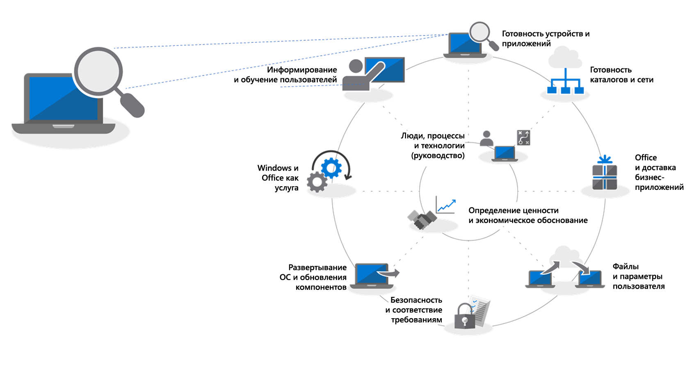
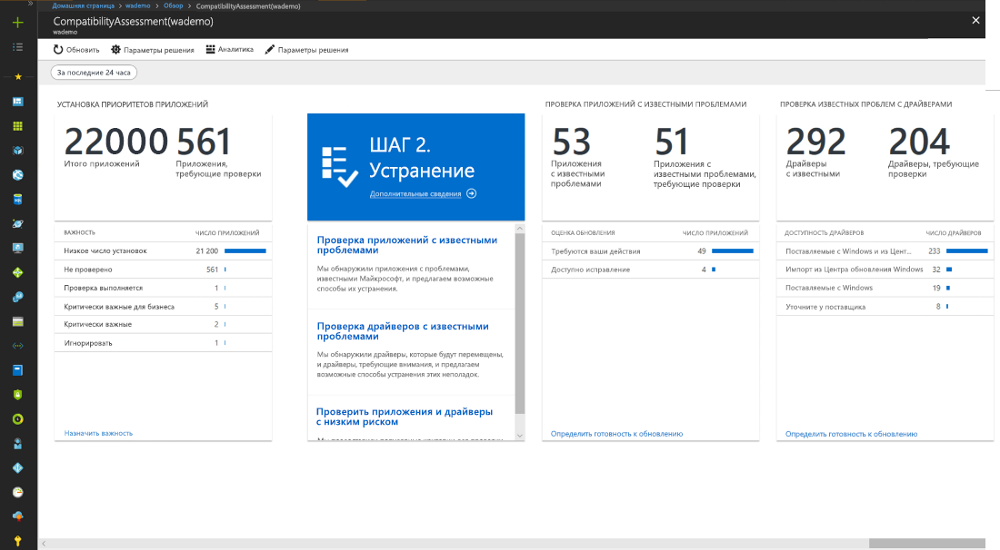
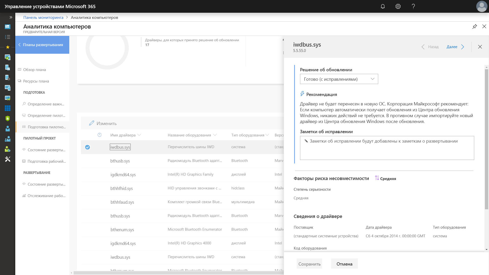
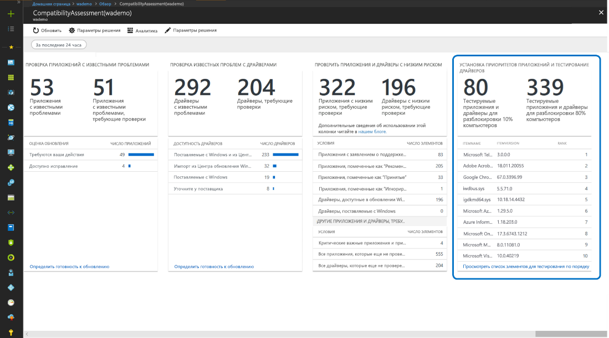
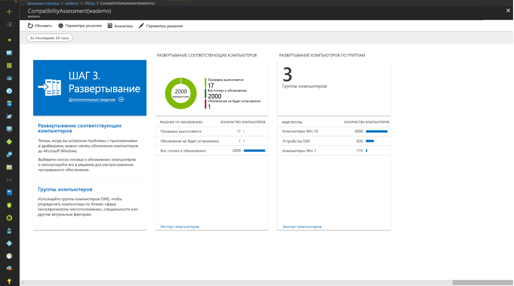

# Этап 1. Проверка готовности устройств и приложений

<table>
<thead>
<td></td>
<td>
<strong>Этап 1. Проверка готовности устройств и приложений</strong>

Начните проект развертывания компьютера с инвентаризации устройств и приложений, определите приоритеты, протестируйте приоритетные приложения и устройства, а затем исправьте необходимые элементы, чтобы подготовиться к развертыванию.
</td>
<td></td>
</thead>
</table>

>[!NOTE]
>Проверка готовности устройств и приложений — первый этап рекомендуемого нами процесса развертывания, при выполнении которого необходимо проверить аспекты целостности в части совместимости приложений и оборудования. Полный процесс развертывания для настольных ПК описан в статье [Центр развертывания компьютеров](https://aka.ms/HowToShift).
>

В прошлом основным препятствием при обновлении настольных ПК пользователей были вопросы совместимости приложений и оборудования. Если вы планируете перейти на Windows 10 и Office 365 профессиональный плюс, хорошая новость заключается в том, что в Windows 10 будут работать почти все приложения, написанные в течение 10 последних лет. Любые надстройки COM и макросы VBA, которые ваша организация использовала, начиная с Office 2010, будут по-прежнему работать в последних версиях Office без какой-либо модернизации.

Таким образом, в зависимости от размера и возраста вашей организации проверка совместимости приложений и оборудования, вероятно, по-прежнему будет важным первоначальным этапом рекомендуемого нами восьмиэтапного процесса развертывания.

В этой статье мы рассказываем о первом этапе — проверке готовности устройств и приложений с помощью средств оценки готовности Майкрософт, в том числе нового средства "Проверка готовности к обновлению" в Аналитике компьютеров. Это интеллектуальное облачное решение, доступное при наличии лицензии на ОС Windows.

## Проверка совместимости с Windows 10

Перед развертыванием Windows 10 Майкрософт рекомендует проверять готовность существующих устройств под управлением Windows 7 или 8/8.1. Установочные носители Windows 10 поддерживают параметр командной строки для файла setup.exe, позволяющий проверить совместимость без установки новой версии. Параметр ScanOnly можно применять для пакетного файла со скриптом или интегрировать в последовательность задач System Center Configuration Manager. Кроме того, указывать параметр ScanOnly можно напрямую из сети, чтобы не выполнять передачу установочных носителей Windows 10 на локальный диск. Результаты выполнения с применением параметра ScanOnly записываются в виде кодов возврата в файл журнала, созданный файлом Setup.EXE.   

Пример команды с параметром ScanOnly, которая в фоновом режиме проверяет совместимость, выглядит так:

    Setup.EXE /Auto Upgrade /Quiet /NoReboot /Compat ScanOnly

Дополнительные сведения о ScanOnly и других параметрах командной строки для установки Windows см. в статье [Параметры командной строки для установки Windows](https://aka.ms/setupswitches).

## Рекомендуемое средство: "Проверка готовности к обновлению" в Аналитике компьютеров

Рекомендуемое нами средство "Проверка готовности к обновлению" в Аналитике компьютеров имеет много преимуществ перед традиционными системами управления для настольных ПК. Для его использования не нужен агент. С помощью этого средства вы выполните все необходимые действия. И, наконец, на основании сведений о совместимости приложений и драйверов, собранных при обновлении сотен миллионов потребительских ПК, это средство способно выполнить подробную оценку и выявить проблемы совместимости, из-за которых, возможно, не удастся выполнить обновление, а также предоставить ссылки на рекомендуемые исправления, известные Майкрософт.

Чтобы настроить средство "Проверка готовности к обновлению" в Windows Analytics, вам прежде всего потребуется настроить подписку на Azure и включить в нее рабочую область Azure Log Analytics. После запуска этого средства вы можете зарегистрировать любое подключенное к Интернету устройство под управлением Windows 7 с пакетом обновления 1 (SP1) или более поздней версии через параметры групповой политики. Это просто. Не нужно развертывать агенты, а с помощью визуального рабочего процесса средства "Проверка готовности к обновлению" в Аналитике компьютеров вы пройдете от пилотной версии до развертывания в рабочей среде. При желании вы можете экспортировать данные из этого инструмента в средства развертывания программного обеспечения, например в System Center Configuration Manager (Current Branch), чтобы выполнить настройку для компьютеров и создавать коллекции по мере их готовности к развертыванию.

Если в данный момент в вашей среде нет службы "Аналитика компьютеров" либо вы хотите зарегистрироваться, чтобы использовать пробную версию, перейдите на страницу Desktop Analytics](http://www.aka.ms/desktopanalytics) и начните работу.

## Процесс проверки готовности устройств и приложений

Процесс проверки готовности устройств и приложений состоит из четырех этапов: инвентаризация, определение приоритетов, тестирование, исправление. Поговорим о каждом из них подробнее.

### 1\. Инвентаризация

Для службы "Проверка готовности к обновлению" в Аналитике компьютеров используется процесс инвентаризации компьютеров и приложений на настольных ПК в организации, в котором не используются агенты.

Кроме того, это средство формирует отчеты по самым посещаемым сайтам в Интернете, приложениям и расположениям в интрасети. Эти отчеты упростят для вас проверку совместимости в будущем.

### 2\. Определение приоритетов

После инвентаризации с помощью средства "Проверка готовности к обновлению" в Аналитике компьютеров можно обнаружить распространенные приложения и оборудование вашей организации, определить для них приоритеты, а также аспекты, на которых необходимо сконцентрироваться, чтобы подготовить как можно больше ПК к развертыванию.

Кроме того, в этом средстве имеются рекомендации по оценке обновлений, необходимых для решения проблем на следующем этапе — этапе тестирования.

### 3\. Тестирование

Вы обнаружите, что большая часть прошедших инвентаризацию приложений, драйверов и надстроек работает, как и прежде. Если средство "Проверка готовности к обновлению" в Аналитике компьютеров обнаружит проблемы для каких-либо элементов, оно предоставит известную ему информацию, включая сведения о том, где найти обновления версий для устранения проблем, связанных с совместимостью. Вместо того чтобы тратить время и ресурсы на решение сложных проблем, связанных с второстепенными редко развертываемыми приложениями и старыми устройствами, вы можете проработать с пользователями возможность вывода этих элементов из эксплуатации или их замены.

С помощью средства "Проверка готовности к обновлению" в Аналитике компьютеров вы также можете обнаружить проблемы совместимости при использовании браузеров, выявив веб-сайты и веб-приложения, к которым обращаются пользователи и в которых по-прежнему используются элементы ActiveX, вспомогательные объекты браузера, VBScript и другие устаревшие технологии, не поддерживаемые в браузере Microsoft Edge. Для работы с такими сайтами пользователям придется по-прежнему использовать браузер Internet Explorer 11. Вы можете добавить такие сайты в [список сайтов режима предприятия](https://docs.microsoft.com/ru-RU/microsoft-edge/deploy/emie-to-improve-compatibility) с помощью средства Enterprise Mode Site List Manager.

Кроме того, чтобы упростить переход на Office 365 профессиональный плюс, вам может потребоваться использовать средство [Readiness Toolkit for Office](https://docs.microsoft.com/ru-RU/deployoffice/use-the-readiness-toolkit-to-assess-application-compatibility-for-office-365-pro) для проверки совместимости ваших надстроек и макросов Microsoft Visual Basic для приложений (VBA).

### 4.\. Исправление

Последний этап проверки совместимости устройств и приложений — исправление. На этом этапе вам потребуется собрать необходимые пакеты программного обеспечения и драйверов. С их помощью вы замените или обновите устройства и приложения старых версий в процессе развертывания.

При проработке списка проблем, которые необходимо исправить, вы обнаружите, что все больше и больше ПК переходит в состояние "Готов к развертыванию". Это означает, что драйверы и приложения на ПК признаны совместимыми с версией ОС Windows 10, для которой вы хотите выполнить развертывание.

### Инвентаризация программного обеспечения Configuration Manager для определения приоритета приложений

Вместо использования облачных аналитических решений для проверки готовности устройств и приложений можно провести инвентаризацию программного обеспечения Configuration Manager. Вы можете использовать сведения о количестве установок и подробно изучить отдельные компьютеры, чтобы определить приоритет тестирования и проверки совместимости и настроить приложения для совместимости с Windows 10 с помощью параметров пакета. Хотя этот вариант не предполагает сравнение известных сведений о совместимости с помощью аналитических служб Майкрософт, он может быть эффективным решением для выбора небольшого набора приоритетных приложений для ручного тестирования. 

Дополнительные сведения см. в статье [Общие сведения об инвентаризации программного обеспечения в System Center Configuration Manager](https://docs.microsoft.com/ru-RU/sccm/core/clients/manage/inventory/introduction-to-software-inventory). Сведения о настройке требований к платформе в пакетах приложений см. в статье [Пакеты и программы в System Center Configuration Manager](https://docs.microsoft.com/ru-RU/sccm/apps/deploy-use/packages-and-programs).

## Служба Assure для классических приложений

Другим средством, которое поможет определить совместимость с Windows 10 и приложениями Office 365 профессиональный плюс является [служба Assure для классических приложений](https://aka.ms/desktopappassure), доступная в FastTrack Center. В случае проблем совместимости приложения специалист Майкрософт через службу Assure для классических приложений будет работать с вами над их устранением без дополнительной платы.

## Последующее использование в качестве средств диагностики данных

"Проверка готовности к обновлению" в Аналитике компьютеров — это не только средство, с помощью которого вы можете перейти на Windows 10 и Office 365 профессиональный плюс. После перевода настольных компьютеров на Windows 10 и Office 365 вы можете использовать это средство для обслуживания развертывания полугодовых обновлений компонентов и управления ими, чтобы поддерживать компьютеры в актуальном состоянии.

## Следующий шаг 

## [Этап 2. Проверка готовности каталогов и сети](https://aka.ms/mdd2)