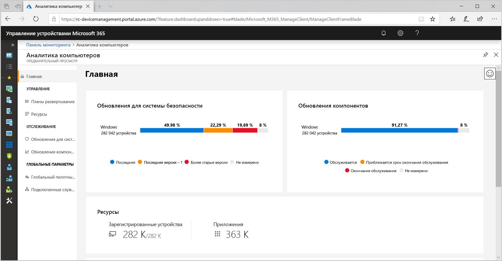
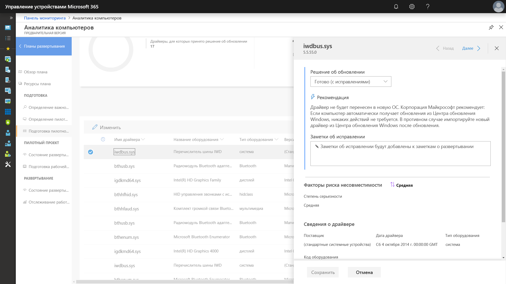
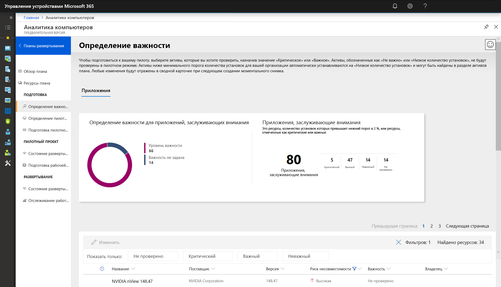
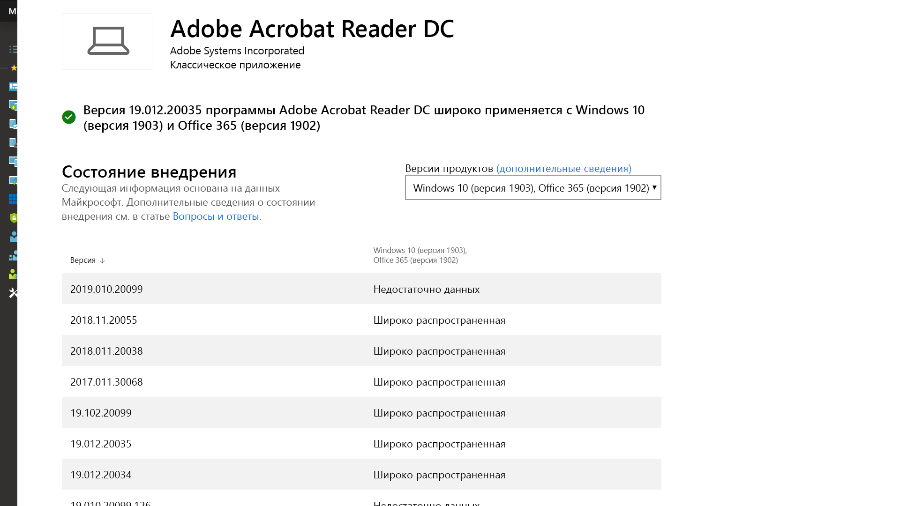

# Этап 1. Проверка готовности устройств и приложенийStep 1: Device and App Readiness

<table>
<thead>
<td></td>
<td>
<strong>Этап 1. Проверка готовности устройств и приложений</strong><strong>Step 1: Device and App Readiness</strong>

Начните проект развертывания компьютера с инвентаризации устройств и приложений, определите приоритеты, протестируйте приоритетные приложения и устройства, а затем исправьте необходимые элементы, чтобы подготовиться к развертыванию.Begin your desktop deployment project with an inventory of your devices and apps, prioritize what you need to move forward, test prioritized apps and devices, then remediate what’s needed to get ready for deployment.
</td>
<td></td>
</thead>
</table>

>[!NOTE]
>Проверка готовности устройств и приложений — первый этап рекомендуемого нами процесса развертывания, при выполнении которого необходимо проверить аспекты целостности в части совместимости приложений и оборудования.Device and App Readiness is the first step in our recommended deployment process wheel by covering the holistic aspects of application and hardware compatibility. Полный процесс развертывания для настольных ПК описан в статье [Центр развертывания компьютеров](https://aka.ms/HowToShift).To see the full desktop deployment process, visit the [Desktop Deployment Center](https://aka.ms/HowToShift).
>

В прошлом основным препятствием при обновлении настольных ПК пользователей были вопросы совместимости приложений и оборудования. Если вы планируете перейти на Windows 10 и Office 365 профессиональный плюс, хорошая новость заключается в том, что в Windows 10 будут работать почти все приложения, написанные в течение 10 последних лет. Любые надстройки COM и макросы VBA, которые ваша организация использовала, начиная с Office 2010, будут по-прежнему работать в последних версиях Office без какой-либо модернизации.In the past, a major hurdle to upgrading the users’ desktops is application and hardware compatibility. The good news as you plan your shift to Windows 10 and Office 365 ProPlus, is just about any application written in the last 10 years will run on Windows 10, and any COM add-ins and VBA macros your organization used on versions of Office dating back to Office 2010, will continue to work on the latest versions of Office, without modification.

Таким образом, в зависимости от размера и возраста вашей организации проверка совместимости приложений и оборудования, вероятно, по-прежнему будет важным первоначальным этапом рекомендуемого нами восьмиэтапного процесса развертывания.That said, depending on the size and age of your organization, verifying application and hardware compatibility is likely still an essential initial step in our recommended 8-phase deployment process.

В этой статье мы рассказываем о первом этапе — проверке готовности устройств и приложений с помощью средств оценки готовности Майкрософт, в том числе средства “Аналитика компьютеров”. Это интеллектуальное облачное решение, доступное при наличии лицензии на ОС Windows.In this article we take you through that first phase – Device and App Readiness – using Microsoft readiness assessment tools including the Desktop Analytics, an intelligent cloud-based solution available with your Windows license.

## Проверка совместимости с Windows 10Windows 10 Compatibility Scan

Перед развертыванием Windows 10 Майкрософт рекомендует проверять готовность существующих устройств под управлением Windows 7 или 8/8.1.Before deploying Windows 10 Microsoft recommends checking the readiness of your existing devices running Windows 7 or 8/8.1. Установочные носители Windows 10 поддерживают параметр командной строки для файла setup.exe, позволяющий проверить совместимость без установки новой версии.Windows 10 installation media supports a command line switch for the setup.exe to run the upgrade but only check for compatibility, not actually perform the upgrade. Параметр ScanOnly можно применять для пакетного файла со скриптом или интегрировать в последовательность задач Microsoft Endpoint Configuration Manager. Кроме того, указывать параметр ScanOnly можно напрямую из сети, чтобы не выполнять передачу установочных носителей Windows 10 на локальный диск.ScanOnly can be run as a scripted batch file or integrated into a Microsoft Endpoint Configuration Manager task sequence, including the ability to run the ScanOnly directly from the network so the Windows 10 installation media isn't streamed down to the local device. Результаты выполнения с применением параметра ScanOnly записываются в виде кодов возврата в файл журнала, созданный файлом Setup.EXE.When ScanOnly completes the results are returned via return codes in log files generated by Setup.EXE.   

Пример команды с параметром ScanOnly, которая в фоновом режиме проверяет совместимость, выглядит так:A sample ScanOnly command line that completes the compatibility scan silently would look like the below:

    Setup.EXE /Auto Upgrade /Quiet /NoReboot /Compat ScanOnly

Дополнительные сведения о ScanOnly и других параметрах командной строки для установки Windows см. в статье [Параметры командной строки для установки Windows](https://aka.ms/setupswitches).For more information on ScanOnly and other Windows setup command switches please review the [Windows Setup Command-line Options](https://aka.ms/setupswitches).

## Рекомендуемое средство: "Аналитика компьютеров”Recommended Tool: Desktop Analytics

"Аналитика компьютеров" имеет много преимуществ перед традиционными системами управления для ПК и является нашим рекомендуемым инструментом.Desktop Analytics offers many advantages over traditional desktop management systems and is our recommended tool. Для его использования не нужен агент. С помощью этого средства вы выполните все необходимые действия. И, наконец, на основании сведений о совместимости приложений и драйверов, собранных при обновлении сотен миллионов потребительских ПК,It is agentless and guides you through what needs to be done making use of application and driver compatibility information gathered through the upgrade of hundreds of millions of consumer PCs. это средство способно выполнить подробную оценку и выявить проблемы совместимости, из-за которых, возможно, не удастся выполнить обновление, а также предоставить ссылки на рекомендуемые исправления, известные Майкрософт.This information gives you a detailed assessment, identifying compatibility issues that might block your upgrade, supported with links to suggested fixes known to Microsoft.

Чтобы настроить средство "Аналитика компьютеров", вам прежде всего потребуется настроить подписку на Azure и включить в нее рабочую область Azure Log Analytics.To set up Desktop Analytics you’ll first need to set up an Azure subscription and include an Azure Log Analytics workspace to that. После запуска этого средства вы можете зарегистрировать любое подключенное к Интернету устройство под управлением Windows 7 с пакетом обновления 1 (SP1) или более поздней версии через параметры групповой политики. Это просто.Once you have the Desktop Analytics service running, you can then enroll any Internet-connected Windows 7 SP1 or newer device via Group Policy settings - it’s that simple. Не нужно развертывать агенты, а с помощью визуального рабочего процесса средства "Аналитика компьютеров" вы пройдете от пилотной версии до развертывания в рабочей среде.There are no agents to deploy, and Desktop Analytics’ visual workflow guides you from pilot to production deployment. При желании вы можете экспортировать данные из этого инструмента в средства развертывания программного обеспечения, например в Microsoft Endpoint Configuration Manager (Current Branch), чтобы выполнить настройку для компьютеров и создавать коллекции по мере их готовности к развертыванию.If you wish, you can export data from Desktop Analytics to software deployment tools such as Microsoft Endpoint Configuration Manager (Current Branch), to target PCs directly and build collections as they become ready for deployment.

Если в данный момент в вашей среде нет службы "Аналитика компьютеров" либо вы хотите зарегистрироваться, чтобы использовать пробную версию, перейдите на страницу Аналитики компьютеров](https://www.aka.ms/desktopanalytics) и начните работу.If you don’t currently have Desktop Analytics set up for your environment or would like to sign up for a trial, go the Desktop Analytics page](https://www.aka.ms/desktopanalytics) and get started.

## Процесс проверки готовности устройств и приложенийDevice and App Readiness Process

Процесс проверки готовности устройств и приложений состоит из четырех этапов:Device and App Readiness is comprised of four steps: 1. инвентаризация,Inventory, 2. определение приоритетов,Prioritize, 3. тестирование,Test, 4. исправление.Remediate. Поговорим о каждом из них подробнее.Let’s look at each of these in turn.

### 1\.1\. ИнвентаризацияInventory

Для службы "Аналитика компьютеров" используется процесс инвентаризации компьютеров и приложений на ПК в организации, в котором не используются агенты.Desktop Analytics uses an agent-less process to inventory the computers and applications across your desktop estate. Кроме того, это средство формирует отчеты по самым посещаемым сайтам в Интернете, приложениям и расположениям в интрасети. Эти отчеты упростят для вас проверку совместимости в будущем.It also provides reports on highly visited Internet sites, apps, and Intranet locations to help you with compatibility testing later.

### 2\.2\. Определение приоритетовPrioritize

После инвентаризации с помощью средства "Аналитика компьютеров" можно обнаружить распространенные приложения и оборудование вашей организации, определить для них приоритеты, а также аспекты, на которых необходимо сконцентрироваться, чтобы подготовить как можно больше ПК к развертыванию.With inventory taken, Desktop Analytics helps you to identify and prioritize the most common apps and hardware used in your organization, as well as what to focus on to unblock as many PCs as possible for deployment.

Кроме того, в этом средстве имеются рекомендации по оценке обновлений, необходимых для решения проблем на следующем этапе — этапе тестирования.It also provides guidance to help you assess the updates necessary to resolve issues during the next step: testing.

### 3\.3\. ТестированиеTesting

Вы обнаружите, что большая часть прошедших инвентаризацию приложений, драйверов и надстроек работает, как и прежде.You will find that most of the applications, drivers, and add-ins inventoried will work as-is. Если средство "Аналитика компьютеров" обнаружит проблемы для каких-либо элементов, оно предоставит известную ему информацию, включая сведения о том, где найти обновления версий для устранения проблем, связанных с совместимостью.For items Desktop Analytics assesses to have issues, it provides you with known information including where to find version updates to resolve compatibility problems. Вместо того чтобы тратить время и ресурсы на решение сложных проблем, связанных с второстепенными редко развертываемыми приложениями и старыми устройствами, вы можете проработать с пользователями возможность вывода этих элементов из эксплуатации или их замены.Rather than devoting time and resource resolving complex issues in non-critical, sparsely deployed applications and older devices, you may choose instead to work with users to retire and replace these items.

“Аналитика компьютеров” может быть использована также для оценки проблем совместимости, связанных с браузерами, позволяя определить, какие веб-сайты и веб-приложения, к которым обращались пользователи, все еще используют элементы ActiveX, вспомогательные объекты браузера, VBScript или другие устаревшие технологии, не поддерживаемые браузером Microsoft Edge.You can use Desktop Analytics to assess browser-based compatibility issues too, identifying websites and web apps accessed by users still using ActiveX controls, Browser Helper Objects, VBScript, or other legacy technology not supported by the Microsoft Edge browser. Вашим пользователям будет по-прежнему необходимо использовать Internet Explorer 11 для этих сайтов, и вы сможете добавить их добавить в [список сайтов, запускаемых в корпоративном режиме](https://docs.microsoft.com/microsoft-edge/deploy/emie-to-improve-compatibility), используя диспетчер списка сайтов, запускаемых в корпоративном режиме.Your users will still need to use Internet Explorer 11 for these sites, and you can add them to the [Enterprise Mode site list](https://docs.microsoft.com/microsoft-edge/deploy/emie-to-improve-compatibility), using the Enterprise Mode Site List Manager.

Кроме того, чтобы упростить переход на Office 365 профессиональный плюс, вам может потребоваться использовать средство [Readiness Toolkit for Office](https://docs.microsoft.com/deployoffice/use-the-readiness-toolkit-to-assess-application-compatibility-for-office-365-pro) для проверки совместимости ваших надстроек и макросов Microsoft Visual Basic для приложений (VBA).Additionally, to assist in your move to Office 365 ProPlus, you may wish to make use of the [Readiness Toolkit for Office](https://docs.microsoft.com/deployoffice/use-the-readiness-toolkit-to-assess-application-compatibility-for-office-365-pro) to test the compatibility of your add-ins and Microsoft Visual Basic for Applications (VBA) macros.

### 4.\. Исправление4\. Remediation

Последний этап проверки совместимости устройств и приложений — исправление.The final phase of device and app readiness is to ‘remediate’. На этом этапе вам потребуется собрать необходимые пакеты программного обеспечения и драйверов. С их помощью вы замените или обновите устройства и приложения старых версий в процессе развертывания.Here you’ll want to collect the required software or driver packages; you are going to use these to supersede or update older versions as part of the deployment process.

При проработке списка проблем, которые необходимо исправить, вы обнаружите, что все больше и больше ПК переходит в состояние "Готов к развертыванию". Это означает, что драйверы и приложения на ПК признаны совместимыми с версией ОС Windows 10, для которой вы хотите выполнить развертывание.As you work through the list remediating issues, you’ll see that more and more PCs become “Ready for Deployment”. This means that both the drivers and apps on the PCs are noted as compatible with the version of Windows 10 you are targeting for deployment.

### Инвентаризация программного обеспечения Configuration Manager для определения приоритета приложенийConfiguration Manager Software Inventory for Application Prioritization

Вместо использования облачных аналитических решений для проверки готовности устройств и приложений можно провести инвентаризацию программного обеспечения Configuration Manager.Configuration Manager software inventory is an alternative to using cloud-based analytics solutions for device and app readiness. Вы можете использовать сведения о количестве установок и подробно изучить отдельные компьютеры, чтобы определить приоритет тестирования и проверки совместимости и настроить приложения для совместимости с Windows 10 с помощью параметров пакета.You can use installation counts and drill into specific computers to help prioritize compatibility testing and validation and set application packages as compatible with Windows 10 via package settings. Хотя этот вариант не предполагает сравнение известных сведений о совместимости с помощью аналитических служб Майкрософт, он может быть эффективным решением для выбора небольшого набора приоритетных приложений для ручного тестирования.While this option does not offer the ability to compare known compatibility information with Microsoft’s analytics services, it can be an effective solution to target a smaller set of prioritized apps for manual testing. 

Дополнительные сведения см. в статье [Общие сведения об инвентаризации программного обеспечения в Configuration Manager](https://docs.microsoft.com/configmgr/core/clients/manage/inventory/introduction-to-software-inventory). Сведения о настройке требований к платформе в пакетах приложений см. в статье [Пакеты и программы в Configuration Manager](https://docs.microsoft.com/configmgr/apps/deploy-use/packages-and-programs).For more information, see [Introduction to software inventory in Configuration Manager](https://docs.microsoft.com/configmgr/core/clients/manage/inventory/introduction-to-software-inventory) and setting platform requirements in application packages in [Packages and programs in Configuration Manager](https://docs.microsoft.com/configmgr/apps/deploy-use/packages-and-programs).

## App AssureApp Assure

Другим средством, которое поможет определить совместимость с Windows 10 и приложениями Office 365 профессиональный плюс является программа [App Assure](https://aka.ms/appassure), доступная в FastTrack Center.Another tool to help with Windows 10 and Office 365 ProPlus app compatibility is the [App Assure](https://aka.ms/appassure) program available through the FastTrack Center. В случае проблем совместимости приложения специалист Майкрософт через службу App Assure будет работать с вами над их устранением без дополнительной платы.In the event of valid application issues, a Microsoft engineer with work with you at no additional cost through App Assure to help remediate the application incompatibility.

## Последующее использование в качестве средств диагностики данныхContinued Use of Diagnostic Data Tools

“Аналитика компьютеров” может быть использована не только в качестве вспомогательного средства для перехода на Windows 10 и Office 365 профессиональный плюс.Desktop Analytics isn’t just a tool to help you shift to Windows 10 and Office 365 ProPlus. После перевода компьютеров на Windows 10 и Office 365 вы можете использовать это средство для обслуживания развертывания полугодовых обновлений компонентов и управления ими, чтобы поддерживать компьютеры в актуальном состоянии.Once you have desktops running on Windows 10 and Office 365 you can use it to help maintain your deployment and manage semi-annual Feature Updates so that you can stay current.

## Следующий шагNext Step 

## [Этап 2. Проверка готовности каталогов и сетиStep 2: Directory and Network Readiness](https://aka.ms/mdd2)
