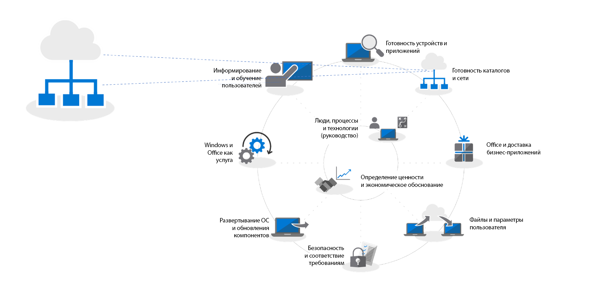
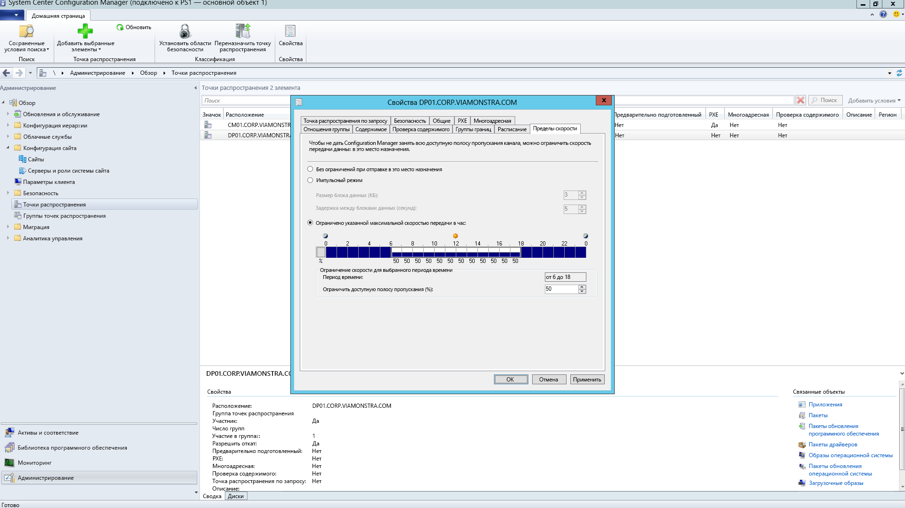
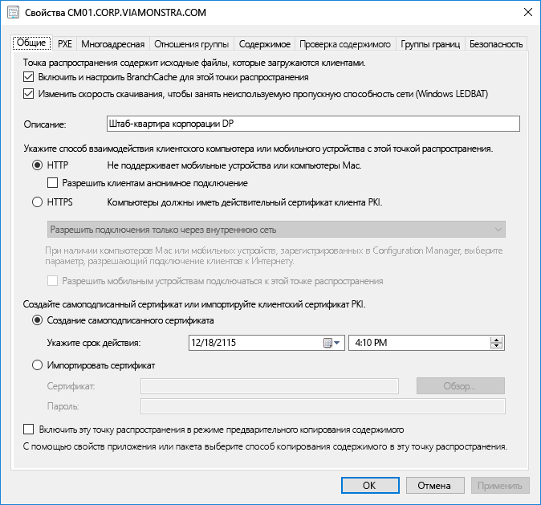
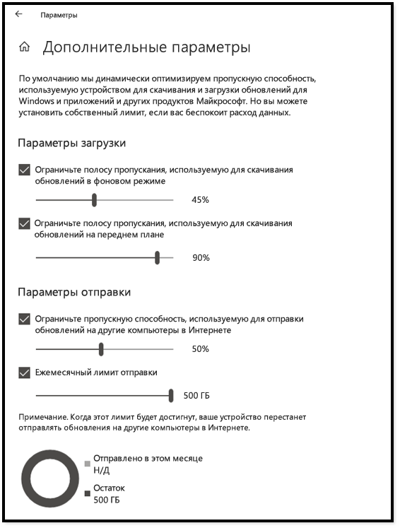
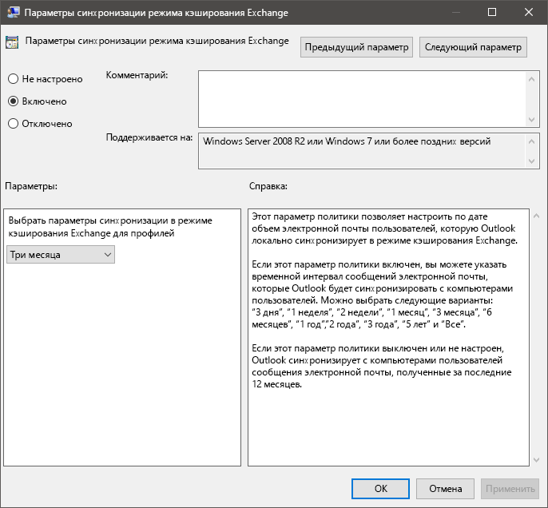
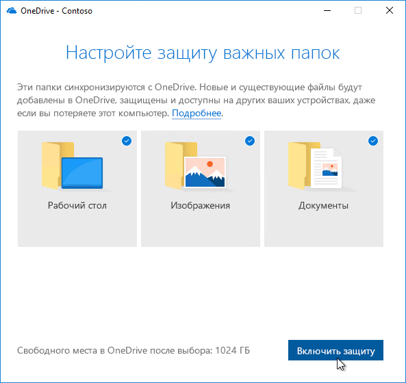

# Этап 2. Готовность каталогов и сети

Убедитесь, что каталог и сеть настроены и готовы к поддержке перехода на Windows 10 и Office 365 профессиональный плюс. Для этого у пользователей должны быть настроены службы Azure Active Directory, а пропускная способность сети должна быть достаточной как для обычного трафика, так и для передачи больших объемов данных во время обновления компьютеров с восстановлением файлов, параметров и приложений пользователей.

<table>
<thead>
<td></td>
<td>
<strong>Этап 2. Готовность каталогов и сети</strong>

Облачные службы в Office 365 профессиональный плюс и новые возможности развертывания, например Windows Autopilot, требуют Azure Active Directory. Сеть и подключение также важны для планирования при перемещении изображений, приложений, драйверов и соответствующих файлов Windows на ваш компьютер. Узнайте, как новые инструменты и возможности развертывания уменьшают и оптимизируют сетевой трафик.
</td>
<td></td>
</thead>
</table>

>[!NOTE]
>Обеспечение готовности каталогов и сети — второй этап рекомендуемого нами процесса развертывания, при котором основное внимание уделяется Azure Active Directory и оптимизации сети. Полный процесс развертывания для настольных ПК описан в статье [Центр развертывания компьютеров](https://aka.ms/HowToShift).
>

Готовность каталогов и сети крайне важна для успешного развертывания ОС и компьютеров. Как и при любом автоматическом развертывании, важно обеспечить доступность сетевых папок, а сеть должна поддерживать передачу очень больших файлов, иногда на сотни или даже на тысячи компьютеров одновременно.

С переходом на Windows 10 и Office 365 профессиональный плюс вам также необходимо убедиться, что в Azure Active Directory настроены облачные удостоверения. Это не только важно для активации Office 365 профессиональный плюс, но и позволяет пользоваться современными решениями для подготовки, например Windows Autopilot.

В этой статье мы рассмотрим инструменты и варианты подготовки служб каталогов, а также разрешения для пользователей и устройств, готовые к развертыванию в Windows 10 и Office 365 профессиональный плюс.

## Добавление Azure Active Directory

Если в вашей организации уже используются Office 365, Exchange Online, Microsoft Intune или другие веб-службы Майкрософт, то спешим вас обрадовать: вы уже используете Azure Active Directory. Если это так, то вам достаточно убедиться, что пользователи, на компьютерах которых выполняется развертывание, зарегистрированы в Azure Active Directory и им назначены лицензии.

Если в настоящее время вы не используете службу Azure Active Directory, существует [множество ресурсов](https://docs.microsoft.com/ru-RU/azure/active-directory/), которые помогут вам настроить ее. Возможно, вам доступна персонализированная поддержка через Microsoft FastTrack в рамках вашей лицензии на Office 365. Дополнительные сведения о Microsoft Fastrack см. [здесь](https://fasttrack.microsoft.com).

После настройки Azure Active Directory пользователи смогут входить в свои приложения Office 365 профессиональный плюс и активировать их, а вы сможете автоматически развертывать приложения и политики с помощью Microsoft Intune или Windows Autopilot.

## Готовность сети

Планируя развертывание, следует учитывать требования к пропускной способности. Три основных компонента развертывания, которые повлияют на сеть — это создание образов ПК, обновления программного обеспечения и персонализация пользователей. Сочетание этих факторов может добавлять до 20 ГБ на компьютер при первоначальной миграции, а зачастую — от 1 ГБ в месяц на обновление каждого компьютера.

Для начала рассмотрим требования к каждому из этих трех компонентов:

### Создание образа ПК

Как правило, для образов Windows без модификаций следует выделять по 3 ГБ на компьютер, а для настроенных образов с приложениями может потребоваться до 6 ГБ или даже больше. Кроме того, может потребоваться учесть пакеты драйверов. Они могут занимать по несколько сотен мегабайт на каждом компьютере, иногда до 1 ГБ.

### Обновления программного обеспечения

Вам потребуется запланировать полосу пропускания для обновлений ПО. В Windows 10 и Office 365 профессиональный плюс используется новая модель обслуживания, доставляющая ежемесячные и полугодовые обновления. Если вы не знакомы с этой моделью, дополнительные сведения о принципе ее работы можно найти [здесь](https://docs.microsoft.com/ru-RU/windows/deployment/update/waas-overview).

Новая модель обслуживания включает обновления компонентов для Windows дважды в год, обновления Office из Semi-Annual Channel и ежемесячные исправления. Как правило, обновления компонентов занимают 2–4 ГБ, а обновления Office из Semi-Annual Channel — по 300–400 МБ. Кроме того, каждый месяц выходят исправления, размер которых варьируется от нескольких сотен мегабайт до гигабайта и более. Это связано с тем, что ежемесячные обновления являются накопительными, поэтому их размер увеличивается в течение срока обслуживания каждой версии Windows 10. С другой стороны, существуют средства, которые могут помочь уменьшить объем данных, проходящих по сети для внедрения обновлений. Они подробнее рассматриваются ниже.

### Персонализация пользователей

Третий важный компонент — персонализация пользователей. Это означает, что вам нужно запланировать пропускную способность сети для восстановления файлов, параметров и приложений пользователей в ходе восстановления или замены компьютера. Общий размер этих элементов часто превышает 20 ГБ на компьютер. У некоторых пользователей он может превышать 100 ГБ.

## **Ограничение пропускной способности**

Один из способов ограничить влияние сетевого трафика при развертывании — регулировать его при помощи параметров BITS (фоновой интеллектуальной службы передачи) в клиенте. BITS использует переменную скорость (ABR), чтобы регулировать полосу пропускания, доступную для развертывания. Эти параметры можно настраивать в клиентах с помощью групповой политики.

[Сведения о BITS](https://docs.microsoft.com/ru-RU/windows/desktop/bits/about-bits)

Если вы используете System Center Configuration Manager (Current Branch), вы также можете настроить точки распространения с поддержкой BITS или включить многоадресную рассылку с WDS.

Регулирование определенного трафика означает, что обычный сетевой трафик меньше подвержен влиянию скачивания обновлений и приложений на компьютерах. Выделив определенный процент полосы пропускания для этих задач, вы гарантируете, что развертывание Windows или Office не повлияет на продуктивность, а процессы продолжат работать должным образом, но это может увеличить время простоя, связанного с развертыванием, во время которого пользователи не могут пользоваться компьютерами.

К счастью существуют новые инструменты, которые помогут вам управлять воздействием крупномасштабного развертывания на сеть, в том числе LEDBAT для оптимизации использования доступной полосы пропускания и параметры одноранговой передачи (P2P), позволяющие отводить трафик развертывания от центра сети к ее периметру.

## **Очистка полосы пропускания**

Фоновый транспорт с низкой добавочной задержкой (LEDBAT), поддерживаемый в Windows Server 2019 и System Center Configuration Manager (Current Branch), предназначен для оптимизации сетевого трафика, адресованного клиентам Windows.

[10 лучших сетевых функций в Windows Server 2019: \#9. LEDBAT — фоновый транспорт с оптимизированной задержкой](https://blogs.technet.microsoft.com/networking/2018/07/25/ledbat/)

В отличие от традиционного регулирования, LEDBAT может использовать всю доступную пропускную способность в качестве фоновой задачи, мгновенно освобождая полосу пропускания, когда другой трафик запрашивает ее. В отличие от BITS, здесь отсутствует задержка. Система полностью автоматизирована — ничего не потребуется настраивать или планировать вручную, все настроено на стороне сервера. Благодаря этому возможен огромный рост производительности.

## **Параметры одноранговой передачи**

Параметры одноранговой передачи все чаще используются для миграции в Windows 10, создания образов компьютеров, обновлений программного обеспечения и персонализации пользователей. Они также полезны для перехода между сборками после первоначального развертывания Windows 10. В этой статье мы рассмотрим несколько примеров отвода трафика, связанного с Windows 10 и Office, от центра сети, чтобы снизить потребность в классических подходах к регулированию и позволить компьютерам находить файлы нужных обновлений на том же уровне своей локальной сети, а не скачивать их из точки распространения в Интернете.

**BranchCache** может помочь вам скачивать контент в распределенных средах, не перегружая сеть. Доступно два варианта: режим размещенного кэша, позволяющий использовать локальные серверы для кэширования контента, и режим распределенного кэша (поддерживаемый в System Center Configuration Manager), позволяющий клиентам предоставлять друг другу доступ к уже скачанному контенту.

**Одноранговый кэш.** Клиенты, поддерживаемые в System Center Configuration Manager, также могут использовать одноранговый кэш. Благодаря этому на компьютерах, доступных в сети, можно размещать источники для распространения контента. Его следует включать не на всех компьютерах, а только на тех узлах, где имеется надежное сетевое подключение (например, настольных компьютерах, а также компьютерах в корпусах "мини-башня" или "башня"). Одноранговый кэш может работать даже для задач развертывания, выполняемых на этапах Windows PE во время установки.

Примечание: BranchCache и одноранговый кэш дополняют друг друга и могут совместно работать в одной среде.

[BranchCache и одноранговый кэш](https://blogs.technet.microsoft.com/swisspfe/2018/01/25/branch-cache-vs-peer-cache/)

**Оптимизация доставки.** Оптимизация доставки — это еще одна технология однорангового кэширования, предоставляющая сетевые средства управления для развертываний. Оптимизация доставки Windows 10 предназначена для обновления встроенных приложений UWP, а также для установки приложений из Microsoft Store и обновления программного обеспечения при помощи экспресс-обновлений. Она была доступна с ранних версий Windows 10, но только недавно была интегрирована с System Center Configuration Manager (Current Branch). Начиная с Windows 10 версии 1803, новые параметры конфигурации позволяют независимо задавать ограничения пропускной способности для фоновых обновлений и задач переднего плана, таких как установка приложений из Microsoft Store. Оптимизация доставки Windows теперь также обеспечивает поддержку Office 365 профессиональный плюс во время обновления клиентов для всех поддерживаемых каналов. Скоро будет доступна поддержка оптимизации доставки Windows во время первоначальной установки клиента Office 365.  

**Дополнительные рекомендации для Office 365 профессиональный плюс**

Кроме оптимизации доставки есть еще три элемента, которые помогут вам сократить нагрузку на сеть во время развертывания Office 365 профессиональный плюс.

**Двоичное разностное сжатие.** Office 365 профессиональный плюс использует двоичное разностное сжатие, чтобы уменьшить полосу пропускания, используемую при переходе с последнего выпуска Office 365 профессиональный плюс на новый. Извлекая только изменения по сравнению с предыдущим выпуском на двоичном уровне, можно свести к минимуму влияние ежемесячного роста накопительных пакетов обновления. В перспективе это поможет ежемесячно экономить по несколько сотен мегабайт данных на компьютер. Однако при использовании этой возможности неприемлемо пропускать выпуски. В противном случае потребуется скачать накопительный пакет обновления полностью.

[Скачивание обновлений для Office 365](https://docs.microsoft.com/ru-RU/deployoffice/overview-of-the-update-process-for-office-365-proplus#download-the-updates-for-office-365-proplus)

**Файлы данных Outlook.** Outlook часто настраивают на локальное кэширование всего почтового ящика пользователя для автономного использования. При любом развертывании Windows, кроме обновления на месте, для этого требуется, чтобы файлы данных Outlook пользователя восстановились после обновления. Этот процесс автоматизирован, но так как ограничения почтовых ящиков Outlook обычно составляют 100 ГБ, для повторного локального кэширования всего почтового ящика потребуется передать много данных Чтобы снизить нагрузку на сеть, вы можете использовать групповую политику, уменьшив значение параметра "Почта, которая должна храниться локально". В Outlook из набора Office 365 профессиональный плюс и Office 2016 по умолчанию задано значение 12 месяцев. Рекомендуем задать срок действия автономного кэша от 1 до 6 месяцев. Изменение этого параметра не повлияет на размер почтового ящика в Интернете, и при наличии сетевого подключения по-прежнему можно будет выполнять поиск по всему почтовому ящику через Outlook.

**Файлы по запросу и перенос известных папок в OneDrive.** OneDrive — отличное средство для синхронизации и защиты файлов пользователя с компьютеров и других устройств в облаке. При переносе известных папок вы можете принудительно синхронизировать файлы из папок "Рабочий стол", "Документы" и "Изображения" в хранилище OneDrive пользователя, делая эти файлы доступными при входе на новое устройство или компьютер, переустановленный из образа. Однако помните, что по причине огромного размера и количества файлов в этих папках следует тщательно распланировать развертывание политик, включающих и применяющих OneDrive на компьютерах. Один из вариантов — использовать сетевые средства управления групповыми политиками, чтобы регулировать полосу пропускания, используемую службой синхронизации OneDrive.

[Настройка переноса известных папок](https://techcommunity.microsoft.com/t5/Microsoft-OneDrive-Blog/Migrate-Your-Files-to-OneDrive-Easily-with-Known-Folder-Move/ba-p/207076)

[Файлы OneDrive по запросу](https://www.microsoft.com/ru-RU/microsoft-365/blog/2017/05/11/introducing-onedrive-files-on-demand-and-additional-features-making-it-easier-to-access-and-share-files/)

Если вы уже развернули OneDrive, то переход с Windows 7 на Windows 10 станет отличной возможностью для включения службы OneDrive. Кроме того, она отлично интегрируется с Office 365 профессиональный плюс. Рекомендуем начать это развертывание при подготовке приложений и устройств. Благодаря этому синхронизация файлов начнется до перемещения образов Windows и развертывания приложений в сети.

## Следующий этап 

## [Этап 3. Доставка приложений Office и бизнес-приложений](https://aka.ms/mdd3)

## Предыдущий этап:

## [Этап 1. Проверка готовности устройств и приложений](https://aka.ms/mdd1)

## Отзывы

Мы будем рады вашим отзывам. Выберите нужный тип:

Отзыв о продукте. Войдите, чтобы оставить отзыв о документации.

Наша новая система отзывов основана на вопросах в GitHub. Сведения об этом изменении вы найдете в записи блога.
