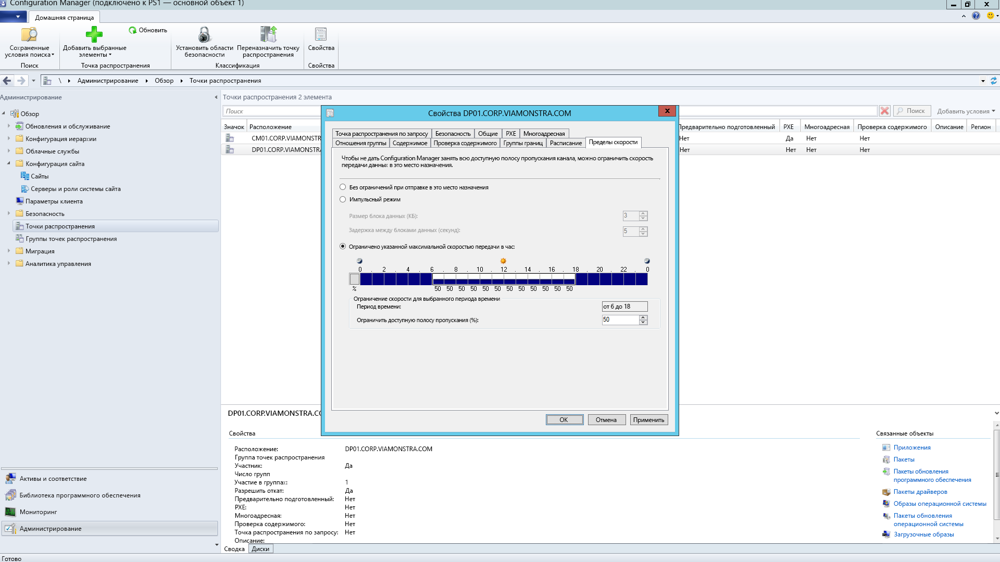
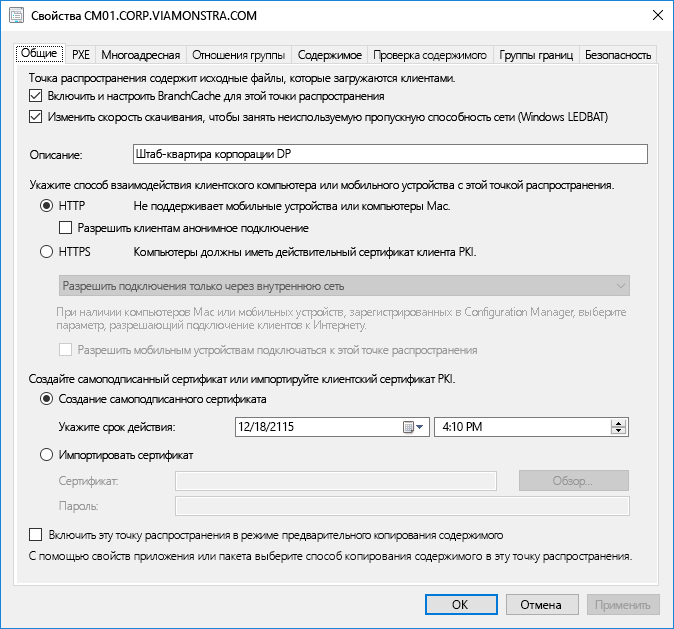
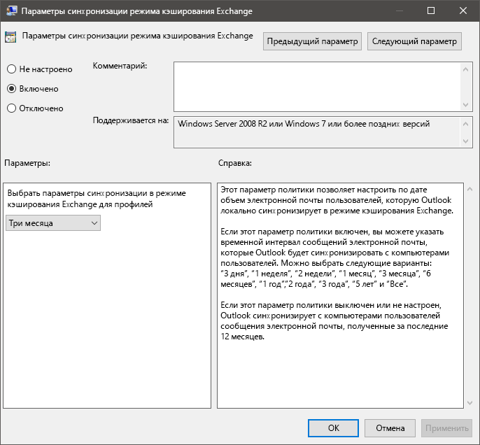
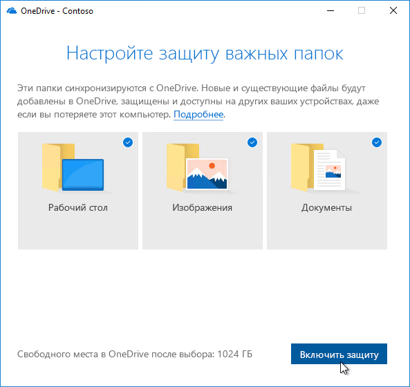

# Этап 2. Готовность каталогов и сетиStep 2: Directory and Network Readiness

Убедитесь, что каталог и сеть настроены и готовы к поддержке перехода на Windows 10 и Office 365 профессиональный плюс. Для этого у пользователей должны быть настроены службы Azure Active Directory, а пропускная способность сети должна быть достаточной как для обычного трафика, так и для передачи больших объемов данных во время обновления компьютеров с восстановлением файлов, параметров и приложений пользователей.Ensure your directory and the network are configured and ready to support to your shift to Windows 10 and Office 365 ProPlus. This will require Azure Active Directory Services to be in place for users, and your network must have the capacity to handle both its regular traffic and the movement of potentially vast amounts of data as PCs are upgraded, and users’ files, settings and applications are restored.

<table>
<thead>
<td></td>
<td>
<strong>Этап 2. Готовность каталогов и сети</strong><strong>Step 2: Directory and Network Readiness</strong>

Облачные службы в Office 365 профессиональный плюс и новые возможности развертывания, например Windows Autopilot, требуют Azure Active Directory. Сеть и подключение также важны для планирования при перемещении изображений, приложений, драйверов и соответствующих файлов Windows на ваш компьютер. Узнайте, как новые инструменты и возможности развертывания уменьшают и оптимизируют сетевой трафик.Cloud connected services in Office 365 ProPlus and new deployment options like Windows Autopilot require Azure Active Directory. Your network and connectivity are also important areas to plan when moving Windows images, apps, drivers and related files to your PCs. Learn how new tools and deployment options reduce and streamline network traffic.
</td>
<td></td>
</thead>
</table>

>[!NOTE]
>Обеспечение готовности каталогов и сети — второй этап рекомендуемого нами процесса развертывания, при котором основное внимание уделяется Azure Active Directory и оптимизации сети.Directory and Network Readiness is the second step in our recommended deployment process wheel focusing on Azure Active Directory and optimizing the network. Полный процесс развертывания для настольных ПК описан в статье [Центр развертывания компьютеров](https://aka.ms/HowToShift).To see the full desktop deployment process, visit the [Desktop Deployment Center](https://aka.ms/HowToShift).
>

Готовность каталогов и сети крайне важна для успешного развертывания ОС и компьютеров. Как и при любом автоматическом развертывании, важно обеспечить доступность сетевых папок, а сеть должна поддерживать передачу очень больших файлов, иногда на сотни или даже на тысячи компьютеров одновременно.Directory and Network readiness is fundamental to ensuring a smooth OS and desktop deployment. As with any automated deployment, it is important to ensure your file shares can be reached, and your network will need to be able to support the transfer of very large files, possibly to hundreds or even thousands of PCs at a time.

С переходом на Windows 10 и Office 365 профессиональный плюс вам также необходимо убедиться, что в Azure Active Directory настроены облачные удостоверения. Это не только важно для активации Office 365 профессиональный плюс, но и позволяет пользоваться современными решениями для подготовки, например Windows Autopilot.With your shift to Windows 10 and Office 365 ProPlus you also now need to make sure that cloud-based identity is set up with Azure Active Directory. This is key not only to activating Office 365 ProPlus, it also allows you to take advantage of modern provisioning solutions like Windows Autopilot.

В этой статье мы рассмотрим инструменты и варианты подготовки служб каталогов, а также разрешения для пользователей и устройств, готовые к развертыванию в Windows 10 и Office 365 профессиональный плюс.In this article we’ll explore the tools and options to prepare your directory services, and user and device permissions, ready for deployment to Windows 10 and Office 365 ProPlus.

## Добавление Azure Active DirectoryAdding Azure Active Directory

Если в вашей организации уже используются Office 365, Exchange Online, Microsoft Intune или другие веб-службы Майкрософт, то спешим вас обрадовать: вы уже используете Azure Active Directory.If your organization already uses Office 365, Exchange Online, Microsoft Intune, or other Microsoft Online services, the good news is you are already using Azure Active Directory. Если это так, то вам достаточно убедиться, что пользователи, на компьютерах которых выполняется развертывание, зарегистрированы в Azure Active Directory и им назначены лицензии.If you are, you just need to ensure that the users you are targeting for desktop deployment are in your Azure Active Directory and that licenses have been assigned.

Если в настоящее время вы не используете службу Azure Active Directory, существует [множество ресурсов](https://docs.microsoft.com/azure/active-directory/), которые помогут вам настроить ее.If you are not currently using Azure Active Directory, there are [numerous resources](https://docs.microsoft.com/azure/active-directory/) to help you set it up. Возможно, вам доступна персонализированная поддержка через Microsoft FastTrack в рамках вашей лицензии на Office 365.You may well qualify for personalized assistance via Microsoft FastTrack, as part of your Office 365 license. Дополнительные сведения о Microsoft Fastrack см. [здесь](https://fasttrack.microsoft.com).You can check out more about Microsoft Fastrack [here](https://fasttrack.microsoft.com).

После настройки Azure Active Directory пользователи смогут входить в свои приложения Office 365 профессиональный плюс и активировать их, а вы сможете автоматически развертывать приложения и политики с помощью Microsoft Intune или Windows Autopilot.Once you have Azure Active Directory in place, your users can sign in to and activate their Office 365 ProPlus apps, and you can use Microsoft Intune or Windows Autopilot deployment for automated deployment of apps and policy.

## Готовность сетиNetwork Readiness

Планируя развертывание, следует учитывать требования к пропускной способности.You must consider bandwidth requirements when planning your deployments. Три основных компонента развертывания, которые повлияют на сеть — это создание образов ПК, обновления программного обеспечения и персонализация пользователей.There are three main components in a deployment that will have an impact on your network – PC imaging, software updates, and user personalization. Сочетание этих факторов может добавлять до 20 ГБ на компьютер при первоначальной миграции, а зачастую — от 1 ГБ в месяц на обновление каждого компьютера.Between them, this can mean in excess of 20 GB per PC for the initial migration, and often 1 GB or more per month per PC to stay up-to-date.

Для начала рассмотрим требования к каждому из этих трех компонентов:Let’s start by exploring the requirements of each of these three main components:

### Создание образа ПКPC Imaging

Как правило, для образов Windows без модификаций следует выделять по 3 ГБ на компьютер, а для настроенных образов с приложениями может потребоваться до 6 ГБ или даже больше.For Windows Images with no customization you should plan typically for 3GB per PC, while for customized images with apps you may need to allow 6GB, or more. Кроме того, может потребоваться учесть пакеты драйверов. Они могут занимать по несколько сотен мегабайт на каждом компьютере, иногда до 1 ГБ.You may also need to consider Driver packages; these can be a few hundred megabytes per PC, sometimes up to 1GB.

### Обновления программного обеспеченияSoftware Updates

Вам потребуется запланировать полосу пропускания для обновлений ПО.You’ll need to plan network bandwidth for software updates. В Windows 10 и Office 365 профессиональный плюс используется новая модель обслуживания, доставляющая ежемесячные и полугодовые обновления.Windows 10 and Office 365 ProPlus use a new servicing model delivering monthly and semi-annual updates. Если вы не знакомы с этой моделью, дополнительные сведения о принципе ее работы можно найти [здесь](https://docs.microsoft.com/windows/deployment/update/waas-overview).If you are new to this model, you can learn more about how this works [here](https://docs.microsoft.com/windows/deployment/update/waas-overview).

Новая модель обслуживания включает обновления компонентов для Windows дважды в год, обновления Office из Semi-Annual Channel и ежемесячные исправления. Как правило, обновления компонентов занимают 2–4 ГБ, а обновления Office из Semi-Annual Channel — по 300–400 МБ. Кроме того, каждый месяц выходят исправления, размер которых варьируется от нескольких сотен мегабайт до гигабайта и более. Это связано с тем, что ежемесячные обновления являются накопительными, поэтому их размер увеличивается в течение срока обслуживания каждой версии Windows 10. С другой стороны, существуют средства, которые могут помочь уменьшить объем данных, проходящих по сети для внедрения обновлений. Они подробнее рассматриваются ниже.The new servicing model includes Feature Updates for Windows twice a year, Office Semi-Annual Channel Updates, and monthly Quality Updates. Feature Updates are typically 2 – 4GB in size, and Office Semi-Annual Channel updates are 300 – 400 MB per update. Then there are the monthly Quality Updates. These may range from a few hundred megabytes to over a gigabyte. This is because monthly updates are cumulative, so these increase in size over the servicing lifetime for each Windows 10 version. That said, there are tools that can help reduce the amount of data that must pass over the network to implement updates. We will cover this in more detail below.

### Персонализация пользователейUser Personalization

Третий важный компонент — персонализация пользователей. Это означает, что вам нужно запланировать пропускную способность сети для восстановления файлов, параметров и приложений пользователей в ходе восстановления или замены компьютера. Общий размер этих элементов часто превышает 20 ГБ на компьютер. У некоторых пользователей он может превышать 100 ГБ.The third component to consider is user personalization. Here you need to plan network bandwidth to accommodate the restoring of user files, their settings, and their applications as part of the PC refresh or replacement process. Together, these items often exceed 20 GB per PC; for some users these may exceed 100 GB.

## Ограничение пропускной способностиLimiting Bandwidth

Один из способов ограничить влияние сетевого трафика при развертывании — регулировать его при помощи параметров BITS (фоновой интеллектуальной службы передачи) в клиенте. BITS использует переменную скорость (ABR), чтобы регулировать полосу пропускания, доступную для развертывания. Эти параметры можно настраивать в клиентах с помощью групповой политики.One way to limit the impact of deployment-related traffic on the network is to throttle it using the BITS (Background Intelligent Transfer Service) setting on clients. BITS uses an Adaptive Bit Rate (ABR) to adjust bandwidth available for deployment purposes; it can be configured on clients using Group Policy.

[Сведения о BITSAbout BITS](https://docs.microsoft.com/windows/desktop/bits/about-bits)

Если вы используете Microsoft Endpoint Configuration Manager (Current Branch), вы также можете настроить точки распространения с поддержкой BITS или включить многоадресную рассылку с WDS.If you use Microsoft Endpoint Configuration Manager (Current Branch), you can also configure BITS-enabled Distribution Points or enable multicast with WDS.

Регулирование определенного трафика означает, что обычный сетевой трафик меньше подвержен влиянию скачивания обновлений и приложений на компьютерах. Выделив определенный процент полосы пропускания для этих задач, вы гарантируете, что развертывание Windows или Office не повлияет на продуктивность, а процессы продолжат работать должным образом, но это может увеличить время простоя, связанного с развертыванием, во время которого пользователи не могут пользоваться компьютерами.Throttling specific traffic means that normal network traffic is less impacted by PCs downloading updates and applications. But carving out a certain percentage of bandwidth for these tasks helps ensure productivity isn’t impacted by Windows or Office deployment and processes continue to run as needed, it can worsen deployment-related downtime, with users locked out of their PCs while a deployment runs.

К счастью существуют новые инструменты, которые помогут вам управлять воздействием крупномасштабного развертывания на сеть, в том числе LEDBAT для оптимизации использования доступной полосы пропускания и параметры одноранговой передачи (P2P), позволяющие отводить трафик развертывания от центра сети к ее периметру.Fortunately, there are new tools to make it easier for you to manage the network impact of a large-scale desktop deployment, including LEDBAT to optimize use of available bandwidth, and peer-to-peer (P2P) options to move deployment traffic away from the center of the network and out to the perimeter

## Очистка полосы пропусканияScavenging Bandwidth

Фоновый транспорт с низкой добавочной задержкой (LEDBAT), поддерживаемый в Windows Server 2019 и Microsoft Endpoint Configuration Manager (Current Branch), предназначен для оптимизации сетевого трафика, адресованного клиентам Windows.Low Extra Delay Background Transport (LEDBAT), supported in Windows Server 2019 and Microsoft Endpoint Configuration Manager (Current Branch), is designed to optimize network traffic to Windows clients.

[10 лучших сетевых функций в Windows Server 2019: \#9. LEDBAT — фоновый транспорт с оптимизированной задержкойTop 10 Networking Features in Windows Server 2019: \#9 LEDBAT – Latency Optimized Background Transport](https://blogs.technet.microsoft.com/networking/2018/07/25/ledbat/)

В отличие от традиционного регулирования, LEDBAT может использовать всю доступную пропускную способность в качестве фоновой задачи, мгновенно освобождая полосу пропускания, когда другой трафик запрашивает ее. В отличие от BITS, здесь отсутствует задержка. Система полностью автоматизирована — ничего не потребуется настраивать или планировать вручную, все настроено на стороне сервера. Благодаря этому возможен огромный рост производительности.Unlike traditional throttling, LEDBAT can use all available network bandwidth as a background task, instantly yielding bandwidth when other traffic requests it. Unlike BITS there is no delay; everything is automated – no manual tuning or scheduling required, and everything is setup server side. This affords potentially massive performance gains.

## Параметры одноранговой передачиPeer-to-Peer options

Параметры одноранговой передачи все чаще используются для миграции в Windows 10, создания образов компьютеров, обновлений программного обеспечения и персонализации пользователей. Они также полезны для перехода между сборками после первоначального развертывания Windows 10. В этой статье мы рассмотрим несколько примеров отвода трафика, связанного с Windows 10 и Office, от центра сети, чтобы снизить потребность в классических подходах к регулированию и позволить компьютерам находить файлы нужных обновлений на том же уровне своей локальной сети, а не скачивать их из точки распространения в Интернете.Peer-to-Peer options are increasingly being used in Windows 10 migrations, for PC imaging, software updates and user personalization. They are also valuable in facilitating build-to-build upgrades after your initial Windows 10 deployment. Here we will cover several examples to help move Windows 10 and Office-related traffic away from the center of the network, reducing the need for classic throttling approaches, and allowing PCs to find the update files they need on peers in their local network rather than downloading them from a distribution point or the internet.

**BranchCache** может помочь вам скачивать контент в распределенных средах, не перегружая сеть. Доступно два варианта: режим размещенного кэша, позволяющий использовать локальные серверы для кэширования контента, и режим распределенного кэша (поддерживаемый в Configuration Manager), позволяющий клиентам предоставлять друг другу доступ к уже скачанному контенту.**BranchCache** can help you download content in distributed environments without saturating the network. It comes in two options: Hosted Cache Mode, which lets you use local servers to cache content, and Distributed Cache Mode (a mode supported in Configuration Manager), which lets clients share already downloaded content with each other.

**Одноранговый кэш.** Клиенты, поддерживаемые в Configuration Manager, также могут использовать одноранговый кэш.**Peer Cache** Clients supported by Configuration Manager can also make use of Peer Cache. Благодаря этому на компьютерах, доступных в сети, можно размещать источники для распространения контента.This allows PCs that are reliably available on the network to host source for content distribution. Его следует включать не на всех компьютерах, а только на тех узлах, где имеется надежное сетевое подключение (например, настольных компьютерах, а также компьютерах в корпусах "мини-башня" или "башня").You won’t want to enable this all of your PCs – only target devices with reliable network connections as hosts (e.g. desktop, mini-tower, or tower PCs). Одноранговый кэш может работать даже для задач развертывания, выполняемых на этапах Windows PE во время установки.Peer Cache can even work for deployment tasks running in Windows PE phases during setup.

Примечание: BranchCache и одноранговый кэш дополняют друг друга и могут совместно работать в одной среде.Note: BranchCache and Peer Cache are complementary and can work together in the same environment.

[BranchCache и одноранговый кэшBranchCache vs. Peer Cache](https://blogs.technet.microsoft.com/swisspfe/2018/01/25/branch-cache-vs-peer-cache/)

**Оптимизация доставки.** Оптимизация доставки — это еще одна технология однорангового кэширования, предоставляющая сетевые средства управления для развертываний.**Delivery Optimization** Delivery Optimization is another peer-to-peer caching technology, providing network-based controls for deployments. Оптимизация доставки Windows 10 предназначена для обновления встроенных приложений UWP, а также для установки приложений из Microsoft Store и обновления программного обеспечения при помощи экспресс-обновлений.Windows 10 Delivery Optimization to update built-in UWP apps, also to install applications from the Microsoft Store, and for software updates using Express Updates. Она была доступна с ранних версий Windows 10, но только недавно была интегрирована с Microsoft Endpoint Configuration Manager (Current Branch).It has been available since early versions of Windows 10, though it has only recently integrated with Microsoft Endpoint Configuration Manager (Current Branch). Начиная с Windows 10 версии 1803, новые параметры конфигурации позволяют независимо задавать ограничения пропускной способности для фоновых обновлений и задач переднего плана, таких как установка приложений из Microsoft Store.Since Windows 10 version 1803 new configuration options mean you can now independently set bandwidth limits for background updates and foreground jobs such as an app install from the Store. Оптимизация доставки Windows теперь также обеспечивает поддержку Office 365 профессиональный плюс во время обновления клиентов для всех поддерживаемых каналов.Windows Delivery Optimization now also supports Office 365 ProPlus during client updates, available in all supported Office 365 client update channels. Скоро будет доступна поддержка оптимизации доставки Windows во время первоначальной установки клиента Office 365.Support for Windows Delivery Optimization during Office 365 client initial installation will be coming soon.  

**Дополнительные рекомендации для Office 365 профессиональный плюс****Additional Considerations for Office 365 ProPlus**

Кроме оптимизации доставки есть еще три элемента, которые помогут вам сократить нагрузку на сеть во время развертывания Office 365 профессиональный плюс.In addition to leveraging Delivery Optimization, here are three items that will help reduce your network load due to Office 365 ProPlus deployments.

**Двоичное разностное сжатие.** Office 365 профессиональный плюс использует двоичное разностное сжатие, чтобы уменьшить полосу пропускания, используемую при переходе с последнего выпуска Office 365 профессиональный плюс на новый. Извлекая только изменения по сравнению с предыдущим выпуском на двоичном уровне, можно свести к минимуму влияние ежемесячного роста накопительных пакетов обновления. В перспективе это поможет ежемесячно экономить по несколько сотен мегабайт данных на компьютер. Однако при использовании этой возможности неприемлемо пропускать выпуски. В противном случае потребуется скачать накопительный пакет обновления полностью.**Binary Delta Compression** Office 365 ProPlus uses Binary Delta Compression to reduce bandwidth consumed by software updates when updating from the most recent release of Office 365 ProPlus to the next release. By only pulling the binary level changes from the previous release, the impact from month-over-month growth of cumulative updates is minimized. This has the potential of saving several hundred megabytes of data, per PC, each month. In order to use this capability though, you cannot skip releases. If you do, then the full cumulative update must be downloaded.

[Скачивание обновлений для Office 365Downloading Updates for Office 365](https://docs.microsoft.com/deployoffice/overview-of-the-update-process-for-office-365-proplus#download-the-updates-for-office-365-proplus)

**Файлы данных Outlook.** Outlook часто настраивают на локальное кэширование всего почтового ящика пользователя для автономного использования.**Outlook Data Files** Outlook is often configured to cache users’ entire mailbox locally for use offline. При любом развертывании Windows, кроме обновления на месте, для этого требуется, чтобы файлы данных Outlook пользователя восстановились после обновления.In any Windows deployment, except an in-place upgrade, that requires the users’ Outlook Data Files to rebuild themselves after the upgrade. Этот процесс автоматизирован, но так как ограничения почтовых ящиков Outlook обычно составляют 100 ГБ, для повторного локального кэширования всего почтового ящика потребуется передать много данныхThis is an automated process, but with Outlook mailbox limits typically set to up to 100GB, re-caching the entire mailbox locally for all users means a lot of data transfer. Чтобы снизить нагрузку на сеть, вы можете использовать групповую политику, уменьшив значение параметра "Почта, которая должна храниться локально".To reduce the network load you may want to consider using Group Policy to reduce the “Mail to keep offline” setting. В Outlook из набора Office 365 профессиональный плюс и Office 2016 по умолчанию задано значение 12 месяцев.In Office 365 ProPlus or Office 2016 the default value for Outlook is set to 12 months. Рекомендуем задать срок действия автономного кэша от 1 до 6 месяцев.In order to reduce network impact consider setting the offline cache to last between 1 to 6 months. Изменение этого параметра не повлияет на размер почтового ящика в Интернете, и при наличии сетевого подключения по-прежнему можно будет выполнять поиск по всему почтовому ящику через Outlook.Changing this setting does not affect the size of the online mailbox, and the entire mailbox can still be searched via Outlook when online.

**Файлы по запросу и перенос известных папок в OneDrive.** OneDrive — отличное средство для синхронизации и защиты файлов пользователя с компьютеров и других устройств в облаке.**OneDrive Files on Demand and Known Folder Move** OneDrive is a great way to synchronize and protect user files from PCs and other devices in the cloud. При переносе известных папок вы можете принудительно синхронизировать файлы из папок "Рабочий стол", "Документы" и "Изображения" в хранилище OneDrive пользователя, делая эти файлы доступными при входе на новое устройство или компьютер, переустановленный из образа.With Known Folder Move, you can enforce file sync from a user’s Desktop, Documents, and Pictures folders to OneDrive making those files available when signing into a new device a or reimaged PC. Однако помните, что по причине огромного размера и количества файлов в этих папках следует тщательно распланировать развертывание политик, включающих и применяющих OneDrive на компьютерах.Remember though, due to the sheer size and number of files kept in Desktop, Documents, and Pictures locations, you’ll want to be planful with the rollout of policies enabling and enforcing OneDrive on your PCs. Один из вариантов — использовать сетевые средства управления групповыми политиками, чтобы регулировать полосу пропускания, используемую службой синхронизации OneDrive.One option is to use Group Policy Network controls to throttle bandwidth used by the OneDrive sync service.

[Настройка переноса известных папокSetup Known Folder Move](https://techcommunity.microsoft.com/t5/Microsoft-OneDrive-Blog/Migrate-Your-Files-to-OneDrive-Easily-with-Known-Folder-Move/ba-p/207076)

[Файлы OneDrive по запросуOneDrive Files on Demand](https://www.microsoft.com/microsoft-365/blog/2017/05/11/introducing-onedrive-files-on-demand-and-additional-features-making-it-easier-to-access-and-share-files/)

Если вы уже развернули OneDrive, то переход с Windows 7 на Windows 10 станет отличной возможностью для включения службы OneDrive. Кроме того, она отлично интегрируется с Office 365 профессиональный плюс.If you haven’t already rolled out OneDrive, the shift from Windows 7 to Windows 10 is a perfect opportunity to enable OneDrive and it integrates seamlessly Office 365 ProPlus. Рекомендуем начать это развертывание при подготовке приложений и устройств.Consider starting this roll-out while working through your app and device readiness. Благодаря этому синхронизация файлов начнется до перемещения образов Windows и развертывания приложений в сети.This will give file sync a head start before you start moving Windows images and deploying apps over your network.

## Следующий этапNext Step 

## [Этап 3. Доставка приложений Office и бизнес-приложенийStep 3: Office and LOB App Delivery](https://aka.ms/mdd3)

## Предыдущий этап:Previous Step:

## [Этап 1. Проверка готовности устройств и приложенийStep 1: Device and App Readiness](https://aka.ms/mdd1)

## ОтзывыFeedback

Мы будем рады вашим отзывам. Выберите нужный тип:We'd love to hear your thoughts. Choose the type you'd like to provide:

Отзыв о продукте. Войдите, чтобы оставить отзыв о документации.Product feedback Sign in to give documentation feedback

Наша новая система отзывов основана на вопросах в GitHub. Сведения об этом изменении вы найдете в записи блога.Our new feedback system is built on GitHub Issues. Read about this change in our blog post.
