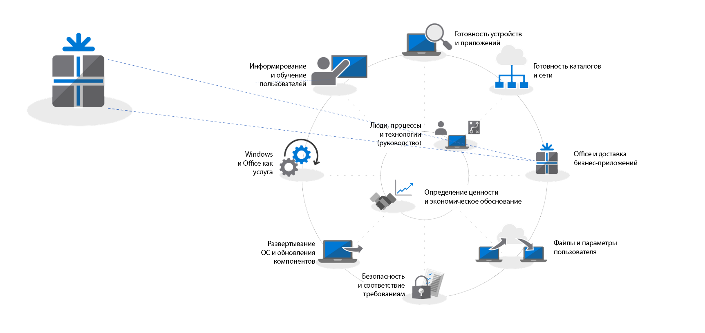
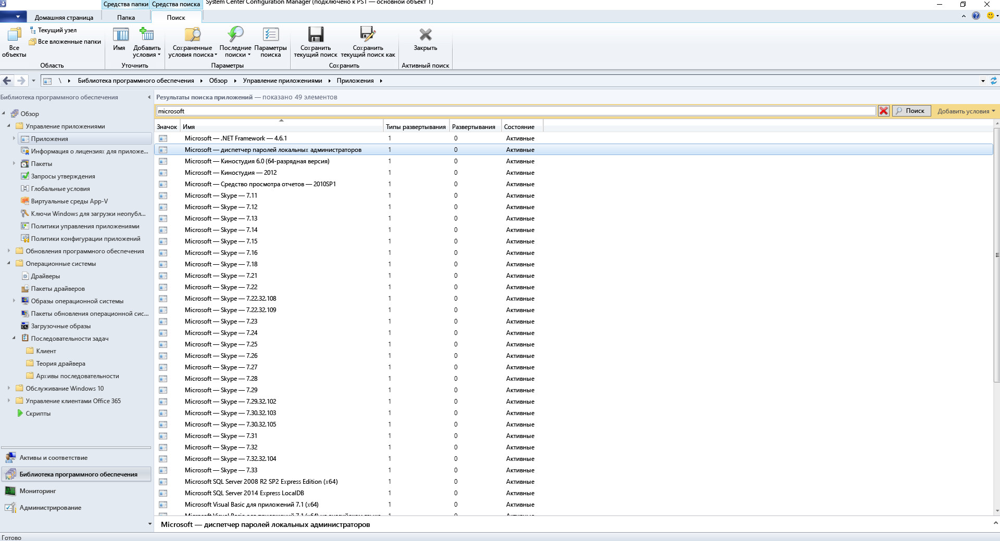
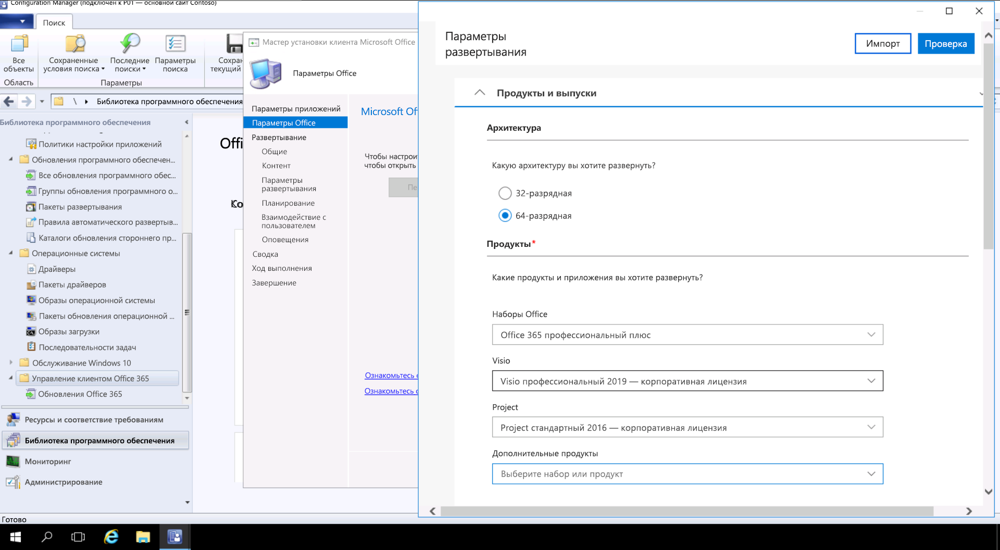

# Этап 3. Доставка приложений Office и бизнес-приложенийStep 3: Office and LOB App Delivery

<table>
<thead>
<td></td>
<td>
<strong>Этап 3. Доставка приложений Office и бизнес-приложений</strong><strong>Step 3: Office and LOB App Delivery</strong>

Убедитесь, что приложения упакованы и готовы для автоматической установки. Узнайте, как упаковка по технологии "нажми и работай" с использованием Office 365 профессиональный плюс предоставляет новые возможности для настройки, установки и обновления приложений Office.Ensure your apps are packaged and ready for automated installation. Learn how Click-to-Run packaging with Office 365 ProPlus gives you new options to configure, deliver and keep your Office apps up-to-date.
</td>
<td></td>
</thead>
</table>

>[!NOTE]
>Доставка приложений Office и бизнес-приложений — третий этап рекомендуемого нами процесса развертывания, охватывающего варианты установки приложений Office и бизнес-приложений, а также управления ими.Office and LOB App Delivery is the third step in our recommended deployment process wheel covering the options to install and manage Office and LOB. Для успешного развертывания выполните первые два этапа.For successful deployment do not skip the first two steps.  Полный процесс развертывания для настольных ПК описан в статье [Центр развертывания компьютеров](https://aka.ms/HowToShift).To see the full desktop deployment process, visit the [Desktop Deployment Center](https://aka.ms/HowToShift).
>

Теперь вы готовы доставить приложения Office и бизнес-приложения. Это можно сделать множеством способов, среди которых появились интересные новые варианты.You are now ready to deliver Office and your Line of Business Apps and there are a number of ways to do this, including some exciting new options. Некоторые приложения доступны только в виде 32- или 64-разрядной скомпилированной версии, но другие (в том числе Office 365 профессиональный плюс) — в виде 32-разрядного и 64-разрядного скомпилированного машинного кода, а одно из важнейших решений, которые вам придется принять, касается развертываемой версии.While some applications are only available as either a 32-bit or 64-bit compiled version, others such as Office 365 ProPlus, offer both as 32-bit and 64-bit native compiled code, and one of biggest decisions you will make is which version to deploy. Чтобы воспользоваться дополнительной вычислительной мощностью и ОЗУ на новых устройствах, Майкрософт рекомендует установить 64-разрядную версию, если отсутствуют зависимости от 32-разрядной версии.To take advantage of additional compute power and RAM on new devices Microsoft recommends using the 64-bit version when there are no 32-bit dependencies. Чтобы разобраться, какие трудности с совместимостью надстроек или файлов могут возникнуть, рекомендуется вернуться к этапу 1 — "Проверка готовности устройств и приложений".To determine any add-in or file-related compatibility challenges you may have it is recommended to revisit Step 1 Device and App Readiness before you continue.

Если вам ничто не мешает, рекомендуем развертывать 64-разрядные версии всех приложений, включая Microsoft Office. 64-разрядные скомпилированные собственные приложения обеспечивают оптимальную производительность и готовность и будущему.If nothing is blocking you, we recommend you deploy 64-bit versions of all apps, including Microsoft Office. 64-bit native compiled apps offer the best performance and is the most future-proof choice.

Существует множество способов и моделей установки приложений в Windows, поэтому рассмотрим варианты доставки.There are many methods and models for installing apps on Windows, so let’s look at your delivery options.

[Управление приложениями для Windows 10Windows 10 application management](https://docs.microsoft.com/ru-RU/windows/application-management/)

## Развертывания на основе MSIMSI-based Deployments

Что касается бизнес-приложений, вероятнее всего вы будете использовать пакеты MSI или исполняемые файлы и устанавливать приложения в рамках последовательности задач по развертыванию ОС.For your line of business apps, you’ll probably use MSI-based packages or executable  and install apps as part of an OS deployment task sequence. Windows 10 продолжит работать с этими пакетами.Windows 10 continues to work with these packages.

Средства развертывания ПО (такие как System Center Configuration Manager и Microsoft Intune) также оптимизированы для доставки приложений в пакетах MSI. Проверив свои приложения в Windows 10, вы можете использовать System Center Configuration Manager (Current Branch) для их доставки. Если вы используете корпоративный портал в Microsoft Intune, можно расширить ассортимент разрешенных ИТ-отделом приложений в организации, чтобы он включал новейшие приложения, а пользователи могли самостоятельно выбирать нужные.Software deployment tools like System Center Configuration Manager and Microsoft Intune are also optimized to deliver MSI-packaged apps. Once you have validated your apps on Windows 10, you can use System Center Configuration Manager (current branch) for app delivery. If you use the Company Portal in Microsoft Intune you can extend the choice of IT sanctioned apps available to your organization to include the latest applications, and users to self-select what they need.

## Создание образа ПКPC Imaging

Еще один популярный способ доставки приложений — создание образа ПК.Another popular method of app delivery is PC imaging. В этом случае приложения устанавливаются либо в ходе последовательности задач, либо вручную на эталонном компьютере, после чего создается образ системы, в которой уже установлены необходимые приложения.In this case, applications are either installed via task sequence or manually on a sample PC, then a system image is captured with the required applications pre-installed. Создание образа для сборки и захвата приложений может сэкономить время при подготовке новых компьютеров, но помните, что операционные системы и приложения в образе могут быстро устареть.The imaging approach to build and capture can save time when provisioning new PCs but remember operating systems and apps within the image can become stale quickly. Модель накопительных пакетов обновления в Windows 10 и Office 365 профессиональный плюс помогает обойти эту проблему, но не устраняет ее окончательно.The Cumulative Update model in Windows 10 and Office 365 ProPlus help with this problem, but doesn’t eliminate it completely. Поэтому рекомендуем использовать подход с тонкими образами, устанавливая приложения извне образа во время развертывания.This is why we recommend a thin image approach, where your applications are installed from outside the image at deploy time.

Если вы хотите включить Office 365 профессиональный плюс в свой образ, помните, что в нем используется активация отдельных пользователей. Его не может активировать системный администратор. Используйте средство развертывания Office, чтобы заранее установить Office на устройстве, с которого будет создаваться образ, пропустив вход пользователя.If you do want to include Office 365 ProPlus in your image, remember that this uses a user-based activation; it cannot be pre-activated by the system admin. Use the Office Deployment Tool to pre-install Office on the device you are imaging and skip the user sign-in. После развертывания образа конечные пользователи смогут войти, используя свои учетные данные Office 365, и активировать Office 365 профессиональный плюс.Once the image is deployed end users can sign-in using their Office 365 credentials and activate Office 365 ProPlus.

[Создание последовательности задач для установки операционной системыCreate a Task Sequence to Install an Operating System](https://docs.microsoft.com/ru-RU/sccm/osd/deploy-use/create-a-task-sequence-to-install-an-operating-system)

[Развертывание Office 365 профессиональный плюс в составе образа операционной системыDeploy Office 365 ProPlus as part of an operating system image](https://docs.microsoft.com/ru-RU/deployoffice/deploy-office-365-proplus-as-part-of-an-operating-system-image)

## Технология "нажми и работай" в OfficeOffice Click-to-Run 

Office 365 профессиональный плюс устанавливается с помощью технологии "нажми и работай", которая заменит пакеты MSI в предстоящем выпуске Office 2019 для Windows.Office 365 ProPlus is installed using Click-to-Run, and Click-to-Run replaces MSI-based packaging in every version of the upcoming Office 2019 release for Windows. Это дает ряд преимуществ, в том числе более быструю и чистую установку, а также более быстрое и эффективное обновление.It brings with it a number of advantages, including faster installations, faster and more efficient updating, and cleaner uninstallation. 

Программы, доставляемые с помощью технологии "нажми и работай", выполняются в виртуальной среде приложений на компьютере и сосуществуют с другими приложениями без конфликтов. Кроме того, они занимают примерно в два раза меньше места на диске, чем аналогичные пакеты MSI.Programs delivered via Click-to-Run execute in a virtual application environment on your computer and so co-exist with other applications without conflict; they also take about half the disk space they would as an MSI-based package. Приложения Office доставляются и управляются через [средство развертывания Office](https://www.microsoft.com/en-us/download/details.aspx?id=49117) (программу установки Office, необходимую для скачивания и настройки приложений Office).Office applications are delivered and managed via the [Office Deployment Tool](https://www.microsoft.com/en-us/download/details.aspx?id=49117) which is the Office setup engine needed to download, configure, and customize your Office apps. Средство развертывания Office считывает XML-файл конфигурации с инструкциями в отношении метаданных, которые описывают, как настраивать установку Office.The Office Deployment Tool reads a configuration XML file which provides the metadata instructions on how to configure and customization your Office installation.

Майкрософт рекомендует использовать [центр развертывания Office](https://config.office.com/) для настройки параметров развертывания и создания XML-файла конфигурации.Microsoft recommends using the [Office Customization Tool](https://config.office.com/) to customize your deployment settings and create your configuration XML file. С помощью центра развертывания Office вы сможете указать, какие приложения и языки будут установлены, как приложения будут обновляться, настройки приложений и параметры установки.Through the Office Customization Tool you can set which applications and languages will be installed, how the applications will be updated, application preferences, and installation expereince settings.

Если применяется System Center Configuration Manager, вы можете продолжать использовать его для широкого развертывания Office 365 профессиональный плюс. System Center Configuration Manager (Current Branch) по умолчанию поддерживает обновленный центр развертывания Office, настройку пакетов для технологии "нажми и работай" во время установки и управление обновлениями программ после нее.If you use System Center Configuration Manager, you can still use it for broad deployment of Office 365 ProPlus. System Center Configuration Manager (current branch) has native support for the updated Office Customization Tool, package customization for Click-to-Run at install time, and native support for software update management post installation.

[Руководство по развертыванию Office 365 профессиональный плюсDeployment Guide for Office 365 ProPlus](https://docs.microsoft.com/ru-RU/deployoffice/deployment-guide-for-office-365-proplus)

[Удаление существующих версий MSI Office при переходе на Office 365 профессиональный плюсRemove existing MSI versions of Office when upgrading to Office 365 ProPlus](https://docs.microsoft.com/ru-RU/deployoffice/upgrade-from-msi-version)

[Управление Office 365 профессиональный плюс с помощью Configuration ManagerManage Office 365 ProPlus with Configuration Manager](https://docs.microsoft.com/ru-RU/sccm/sum/deploy-use/manage-office-365-proplus-updates)

[Назначение приложений Office 365 устройствам на базе Windows 10 с помощью Microsoft IntuneAssign Office 365 apps to Windows 10 devices with Microsoft Intune](https://docs.microsoft.com/ru-RU/intune/apps-add-office365)

## Браузерные приложенияBrowser-based Apps

Чтобы обеспечить надлежащую работу браузерных приложений, следует учесть несколько факторов. Если у вас есть определенные веб-сайты и приложения, у которых есть известные проблемы совместимости с Microsoft Edge, вы можете использовать список сайтов в режиме предприятия, чтобы веб-сайты автоматически открывались с помощью Internet Explorer 11.There are a few things to consider in order to make sure that your browser-based applications continue to work as expected. If you have specific web sites and apps that you know have compatibility problems with Microsoft Edge, you can use the Enterprise Mode site list so that the web sites will automatically open using Internet Explorer 11.

Кроме того, если вы знаете, что сайты в вашей интрасети не будут должным образом работать с Microsoft Edge, то вы можете сделать так, чтобы все эти сайты автоматически открывались с помощью Internet Explorer 11. В этом процессе используется XML-файл, в котором указано, используется ли IE11 для каждого сайта, а параметры принудительно применяются с помощью групповой политики.Additionally, if you know that your intranet sites aren't going to work properly with Microsoft Edge, you can set all intranet sites to open using Internet Explorer 11 automatically. This process uses an XML file to govern whether IE11 is used for each site, using Group Policy to enforce settings.

[Что такое режим предприятияWhat is Enterprise Mode](https://docs.microsoft.com/ru-RU/internet-explorer/ie11-deploy-guide/what-is-enterprise-mode#what-is-enterprise-mode)

На данный момент мы рассказали об известных способах развертывания.So far, we have covered well known deployment methods. Но вам следует рассмотреть два новых подхода к развертыванию приложений.But there are two new approaches to app deployment you may wish to consider.

## Microsoft Store для бизнесаMicrosoft Store for Business 

Microsoft Store для бизнеса предоставляет гибкий способ обнаружения, получения, контроля и распространения бесплатных и платных приложений на устройства под управлением Windows 10 в крупных масштабах.Microsoft Store for Business provides a flexible way discover, acquire, manage, and distribute free and paid apps to Windows 10 devices at scale. ИТ-администратор может публиковать определенные приложения из Microsoft Store, а также собственные приложения, в личном магазине, назначая и повторно используя лицензии по мере необходимости.As an IT admin, you can publish selected Microsoft Store apps, along with your custom own apps, to your own private store while assigning and re-using licenses as needed. Ваши пользователи направляются только в этот магазин, поэтому можно находить и устанавливать только утвержденные приложения.Your users are directed to this store only, and so can only find and install approved apps.

Приложения из магазина можно изначально собирать как приложения UWP. Вы также можете использовать мост для классических приложений, чтобы заново упаковывать имеющиеся приложения для магазина и добавлять современные интерфейсы для Windows 10. Если не считать кода, используемого для усовершенствования интерфейсов Windows 10, приложение остается без изменений и продолжает работать в режиме полного доверия.Store apps can be natively built as UWP apps or you can use the Desktop Bridge to repackage your existing apps for the Store and add modern experiences for Windows 10. Aside from the code that you use to light up Windows 10 experiences, your app remains unchanged and continues to run in full-trust user mode.

## Контейнеризация MSIXMSIX Containerization

Новый вариант упаковывания приложений — MSIX.A new option for application packaging is MSIX. MSIX использует технологию контейнеризации, доступную в Windows, собирая воедино лучшие аспекты технологии "нажми и работай", UWP и пакетов MSI.MSIX uses the containerization technology available in Windows, bringing together the best aspects of Click-to-Run, UWP and MSI packaging. Благодаря средствам для миграции имеющихся установщиков (например, EXE, MSI, APPV и APPX) непосредственно в MSIX, контейнеризация MSIX предоставляет единый путь для многих используемых в настоящее время технологий установки.With tools to migrate existing installers like EXE, MSI, APPV and APPX directly to MSIX we see MSIX Containerization provides a unifed path for the many installation technologies in use today. Поддержка MSIX включена в текущие версии Windows: любое устройство под управлением Windows 10 RS5 или более поздней версии включает все необходимое для установки и запуска приложений из пакетов MSIX.MSIX support is included in current versions of Windows: any device running Windows 10 RS5 or newer includes everything you need to install and run MSIX packaged apps. Windows 10 динамически интегрирует полученные контейнеры MSIX, отделяя приложения от операционной системы.Windows 10 dynamically integrates MSIX containers it receives, while keeping the applications separate from the operating system.

Контейнеризация обеспечивает чистое удаление программ и пакетов, в отличие от многих современных пакетов MSI и EXE, которые могут оставлять элементы в системе. Кроме того, благодаря ей для установки достаточно учетных данных обычного пользователя — вам не нужны учетные данные администратора, чтобы устанавливать контейнеры MSIX. Контейнеры MSIX также обеспечивают более эффективное обновление. При публикации обновления использование дифференциалов на уровне блоков означает, что применяются только новые двоичные файлы, что снижает полезную нагрузку обновления, время развертывания и потребление полосы пропускания сети.Containerization means clean uninstall and removal of packages, unlike a lot of MSI and EXE-based packages today that may leave items on the system. It also means only needing Standard User credentials to install applications – you do not have to have Administrator credentials to install MSIX containers. MSIX containers are more efficient to update too. When an update is published, use of block level differentials means only net new binaries are applied, reducing the update payload, for faster deployments consuming less network bandwidth.

Дополнительные сведения см. на [сайте Tech Community, посвященном MSIX](https://techcommunity.microsoft.com/t5/MSIX/ct-p/MSIX).You can find more information on MSIX via the [MSIX Tech Community site](https://techcommunity.microsoft.com/t5/MSIX/ct-p/MSIX)

## Следующий этапNext Step

## [Этап 4. Файлы и параметры пользователейStep 4: User Files and Settings](https://aka.ms/mdd4)

## Предыдущий этапPrevious Step

## [Этап 2. Проверка готовности каталогов и сетиStep 2: Directory and Network Readiness](https://aka.ms/mdd2) 