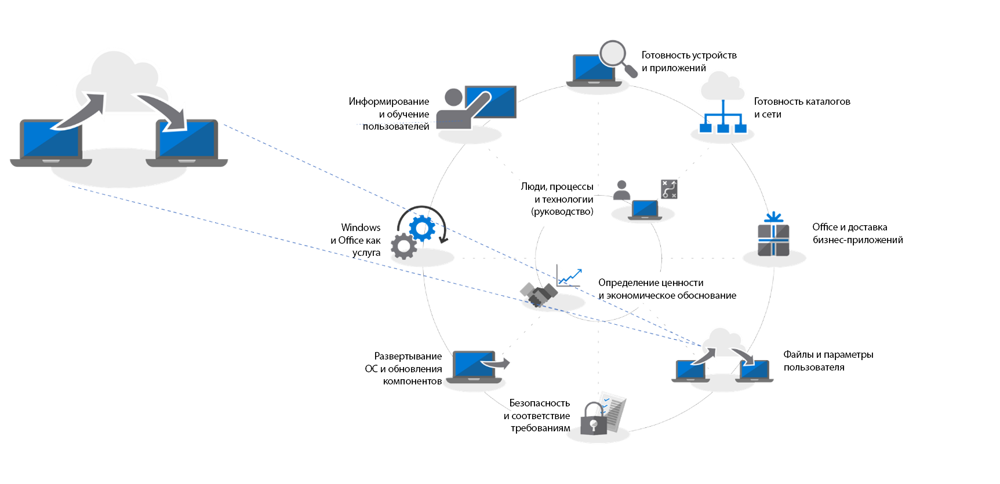

# Этап 4. Перенос файлов и параметров пользователя

Перемещение файлов и параметров пользователей на новые или обновленные компьютеры — ответственный процесс. Вы можете перенести каждый компьютер вручную или выбрать один из нескольких способов автоматизации. Какой бы способ переноса вы ни выбрали, необходимо решить три основных вопроса: перенос файлов пользователей, их параметров и управление макетами меню "Пуск" и панели задач Windows 10.

<table>
<thead>
<td></td>
<td>
<strong>Этап 4. Файлы и параметры пользователей</strong>

При обновлении или замене компьютера, сэкономьте время путем автоматизации резервного копирования и восстановления состояния пользователя. Новые возможности облачной синхронизации файлов позволяют выполнять для каждого пользователя синхронизацию с OneDrive папок рабочего стола, документов и изображений для удобного доступа к файлам из новых экземпляров Windows.
</td>
<td></td>
</thead>
</table>

>[!NOTE]
>Вы продолжите использовать те же процессы миграции, что и раньше, но с переходом на Office 365 профессиональный плюс рекомендуем использовать функцию перемещения известных папок OneDrive (см. ниже). Полный процесс развертывания для настольных ПК описан в статье [Центр развертывания компьютеров](https://aka.ms/HowToShift).
>

Одна из наиболее сложных и трудоемких задач при крупномасштабном развертывании — перенос файлов и параметров пользователей. В этой статье мы рассмотрим доступные вам варианты переноса пользователей на новые, восстановленные или переустановленные из образа компьютеры.

## Перенос вручную

Когда возникает вопрос о том, какие данные сохранять при переходе на новый компьютер или новую версию Windows, одни пользователи хотят сохранить все, другим же нравится возможность очистить свои диски. По этой причине некоторые ИТ-отделы переносят файлы пользователей вручную. Иногда для этого к пользователям направляют специалистов, а иногда организуются центры поддержки, куда пользователи могут приносить свои компьютеры. В любом случае, пользователи могут участвовать в выборе передаваемых и удаляемых данных.

Возможность применения этого подхода в вашей организации зависит от масштаба планируемой миграции. Очевидно, что в этом случае важны время и трудозатраты, необходимые для работы непосредственно с пользователями, понимания их потребностей и копирования файлов на новые или обновленные компьютеры.

Если вы решите выполнить миграцию вручную, рекомендуем оценить возможность выполнения этой задачи до января 2020 г., когда закончится поддержка Windows 7. Если это вызывает сомнения, рассмотрите возможность использования одного из описанных ниже автоматических вариантов или задействуйте больше людей для поддержки.

## Автоматическая миграция с помощью USMT 

В случае крупномасштабного развертывания вы можете автоматизировать значительную часть процесса с помощью средств автоматизации развертывания, использующих последовательности задач, например System Center Configuration Manager или Microsoft Deployment Toolkit (MDT). Оба этих решения используют средство миграции пользовательской среды (USMT) в рамках полного процесса развертывания. USMT входит в состав [комплекта средств для развертывания и оценки Windows (Windows ADK)](https://docs.microsoft.com/ru-RU/windows-hardware/get-started/adk-install).

USMT собирает учетные записи пользователей, их файлы, параметры операционной системы и настройки приложений, а затем переносит их в новый экземпляр Windows. Кроме того, это средство помогает ИТ-администратору выбирать, какие именно компоненты переносятся, а при необходимости исключать нежелательные типы файлов, например видео, звуковые или исполняемые файлы.

В ходе миграции вам потребуется достаточно места на сервере, чтобы использовать его в качестве временного хранилища для миграции. Для этого в USMT предусмотрено две важные функции. Во-первых, это средство может подсчитывать приблизительное количество места, которое потребуется для каждого компьютера. Во-вторых, с его помощью можно шифровать хранилища для миграции, снижая риск компрометации данных при их хранении на файловых серверах.

Если вы восстанавливаете компьютер, не форматируя основной раздел Windows, вы также можете использовать USMT совместно с хранилищем миграции с жесткими связями. В ходе этого процесса на компьютере сохраняется среда пользователя, а старые приложения и операционная система удаляются и восстанавливаются. При восстановлении из того же локального раздела этот вариант обеспечивает существенное повышение производительности и сокращает сетевой трафик.

  [Обзор средства миграции пользовательской среды (USMT)](https://docs.microsoft.com/ru-RU/windows/deployment/usmt/usmt-overview)

## Перемещение известных папок OneDrive

Если ваши пользователи работают с OneDrive или вы добавляете OneDrive в ходе развертывания, то вам будет доступен этот новый вариант. Используя облако для синхронизации файлов пользователей, функция перемещения известных папок OneDrive обеспечивает гибкость, недостижимую при миграции по локальной сети. Включив эту функцию до миграции, вы получите безопасный доступ к новым или восстановленным компьютерам. Кроме того, вам не потребуется создавать временные хранилища для миграции на своих серверах. При этом обеспечивается полная прозрачность для пользователей.

  [Перенаправление и перенос известных папок Windows в OneDrive](https://docs.microsoft.com/ru-RU/onedrive/redirect-known-folders)

Если вы уже используете OneDrive, то вам известно, что пользователи могут выбирать папки и расположения из OneDrive и SharePoint, синхронизируемые с их устройствами, но это по сути возлагает обязанности по настройке на пользователей. При переносе известных папок вы можете выбрать папки "Документы", "Рабочий стол" и "Изображения" из профиля пользователя и защищать эти данные в OneDrive. Пользователь может сделать это самостоятельно, либо (что важно для данного сценария) вы можете [принудительно применить эти параметры с помощью групповой политики](https://docs.microsoft.com/ru-RU/onedrive/use-group-policy?redirectSourcePath=%252fen-us%252farticle%252fUse-Group-Policy-to-control-OneDrive-sync-client-settings-0ecb2cf5-8882-42b3-a6e9-be6bda30899c).

При переносе известных папок пользователи не меняют свой рабочий процесс — во время синхронизации с OneDrive и после нее все выглядит так же, как и раньше. С помощью групповой политики вы даже можете выбрать, следует ли сообщать пользователям, что их документы, изображения и рабочие столы защищены в OneDrive. Если вы решите не уведомлять пользователей, миграция будет незаметно выполнена в фоновом режиме. Пользователи узнают только о доставке нового компьютера или восстановлении имеющегося. Когда пользователь войдет в свою учетную запись OneDrive, эти файлы снова станут доступны и будут восстановлены на новом компьютере. Конечно же, в OneDrive пользователи также смогут безопасно хранить свои файлы с телефонов и других устройств.

Проверка подлинности для OneDrive основана на платформе Azure Active Directory, поэтому для дополнительной защиты вы можете легко включить многофакторную проверку подлинности. Кроме того, вы можете задавать политики, чтобы управлять полосой пропускания для отправки и скачивания, которую OneDrive использует для ограничения сетевой активности.

Вам не нужно переносить всех пользователей одновременно. Вы можете поэтапно развертывать параметры групповой политики или [ограничить синхронизацию файлов компьютерами, присоединенными к домену](https://docs.microsoft.com/ru-RU/powershell/module/sharepoint-online/Set-SPOTenantSyncClientRestriction?view=sharepoint-ps).

## Настройка меню "Пуск" и панели задач

Служба OneDrive предназначена для синхронизации и защиты файлов и папок. Она не синхронизирует параметры приложений и Windows. Для этого в прошлом вы могли использовать способ с копированием профиля, чтобы настраивать структуру меню "Пуск" и панели задач для пользователей. В Windows 10 Pro, Windows 10 Корпоративная и Windows 10 для образовательных учреждений можно использовать групповую политику, MDM, PowerShell или подготовку пакетов, чтобы развертывать [пользовательскую структуру меню "Пуск" и панели задач](https://docs.microsoft.com/ru-RU/windows/configuration/windows-10-start-layout-options-and-policies). Переустановка из образа не требуется, а для обновления структуры достаточно заменить соответствующий XML-файл.

Чтобы создать новую структуру, просто настройте эталонную систему и используйте командлет PowerShell [Export-StartLayout](https://docs.microsoft.com/ru-RU/powershell/module/startlayout/export-startlayout?view=win10-ps), чтобы создать XML-файл, а затем поместите этот файл в сетевую папку или кэшируйте ее локально в ходе развертывания. Когда пользователь входит в систему, эта папка должна быть доступна ему только для чтения. Затем вы можете ссылаться на этот файл с помощью политики или командлета [Import-StartLayout](https://docs.microsoft.com/ru-RU/powershell/module/startlayout/import-startlayout?view=win10-ps).

## Удаление ненужных встроенных приложений

Стандартная установка Windows 10 включает множество полезных встроенных приложений, но вам может потребоваться удалить некоторые из них (например, XBOX или "Музыка Zune") с управляемых компьютеров или даже запретить установку этих приложений. Вы можете получить список этих приложений с помощью команды [PowerShell Get-AppxPackage](https://technet.microsoft.com/ru-RU/library/hh856044.aspx) и удалять ненужные программы с помощью команды [Remove-AppxPackage](https://technet.microsoft.com/ru-RU/library/hh856038.aspx). Кроме того, вы можете подключить файл образа Windows (IMG) в автономном режиме перед развертыванием и извлекать ненужные пакеты с помощью [системы обслуживания образов развертывания и управления ими (DISM)](https://docs.microsoft.com/ru-RU/windows-hardware/manufacture/desktop/what-is-dism) и команды [Remove-AppxProvisionedPackage](https://docs.microsoft.com/ru-RU/powershell/module/dism/remove-appxprovisionedpackage?view=win10-ps).

## Следующий этап

## [Этап 5. Вопросы по безопасности и соответствию требованиям](https://aka.ms/mdd5)

## Предыдущий этап

## [Этап 3. Доставка приложений Office и бизнес-приложений](https://aka.ms/mdd3)