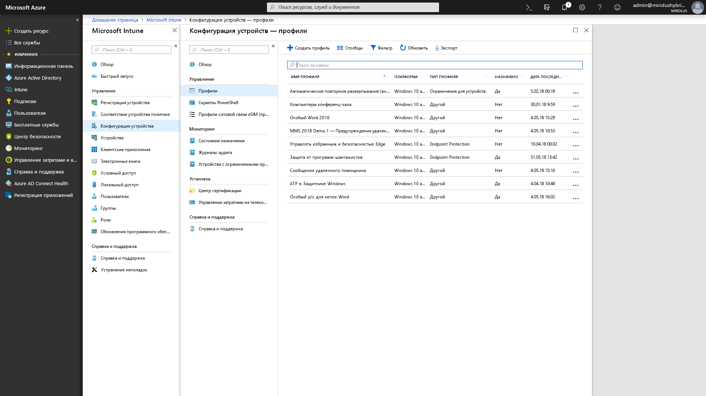

# Шаг 5. Вопросы по безопасности и соответствию требованиямStep 5: Security and Compliance Considerations

<table>
<thead>
<td></td>
<td>
<strong>Этап 5. Вопросы по безопасности и соответствию требованиям</strong><strong>Step 5: Security and Compliance Considerations</strong>

В Windows 10 и в приложениях Microsoft 365 для предприятий доступны новые способы защиты данных, устройств и пользователей, а также быстрого выявления угроз и реагирования на них. Кроме того, узнайте, как устранять распространенные проблемы, связанные с шифрованием дисков, приложениями для защиты от вредоносных программ и политиками при переходе на Windows 10.Windows 10 and Microsoft 365 Apps for enterprise provide new ways to protect your data, devices and users and quickly detect and respond to threats. Also, learn how to deal with common problems associated with disk encryption, anti-malware apps and policies when moving to Windows 10.
</td>
<td></td>
</thead>
</table>

>[!NOTE]
>Безопасность и соответствие требованиям — это пятый этап рекомендуемого процесса развертывания. Эта статья цикла посвящена вопросам безопасности и соответствия требованиям в Windows 10 и приложений Microsoft 365 для предприятий.Security and Compliance is the fifth step in our recommended deployment process wheel covering Windows 10 and Microsoft 365 Apps for enterprise security and compliance considerations. Полный процесс развертывания для настольных ПК описан в статье [Центр развертывания компьютеров](https://aka.ms/HowToShift).To see the full desktop deployment process, visit the [Desktop Deployment Center](https://aka.ms/HowToShift).
>

Пришло время рассмотреть варианты целевого выбора новых возможностей для обеспечения безопасности и соответствия требованиям в рамках развертывания Windows 10 и приложений Microsoft 365 для предприятий, а также факторы, которые необходимо учитывать, и препятствия, которые часто возникают при переходе с предыдущих версий Windows и Office.Now it's time to review options for targeting new security and compliance capabilities as part of your Windows 10 and Microsoft 365 Apps for enterprise deployment, along with the considerations and common blockers when moving from previous versions of Windows and Office. Многие возможности, связанные с безопасностью в Windows 10, сами по себе уже являются шагом вперед.Many of the security-related capabilities in Windows 10 alone are driving the shift to the newer platform. Кроме того, интеграция с облачными службами и возможности работы с удостоверениями с помощью Azure Active Directory обеспечивают доступ к новым и постоянно обновляемым средствам защиты данных, устройств и пользователей.Also, integration with cloud services and identity options using Azure Active Directory brings access to new and continually updated protections for your data, devices and users.

## Преодоление препятствий, связанных с безопасностью, которые могут возникнуть при развертыванииOvercoming Potential Security-Related Deployment Blockers

Прежде чем приступить к изучению новых возможностей, которые появляются при переходе на Windows 10 и приложения Microsoft 365 для предприятий, а также при подключении к облаку, давайте рассмотрим некоторые причины, не дающие довести развертывание до конца.Before explaining new capabilities that you can add as you move to Windows 10 and Microsoft 365 Apps for enterprise and connect those experiences to the cloud, let’s start with a few trends we’re seeing that can often interrupt deployment progress.

### Шифрование дискаDisk Encryption

Прежде всего, может быть зашифрован жесткий диск. Многие решения для шифрования жесткого диска не так просто обновить при переходе с предыдущей версии Windows на более новую.First one of the initial challenges you might encounter is hard disk encryption. Many solutions for hard disk encryption cannot easily be upgraded from a previous version of Windows to a newer version of Windows.

Некоторые из них позволяют выполнить обновления с помощью параметра /reflectdrivers при установке Windows на определенных версиях их платформ, в то время как для других может потребоваться расшифровка диска перед развертыванием и последующее повторное шифрование после установки Windows 10. Кроме того, в некоторых решениях не удается с помощью устаревшей системы BIOS перейти с основной загрузочной записи (MBR) к таблице разделов GPT, необходимой для UEFI. Это важно, так как 64-разрядная версия Windows 10 с UEFI необходима для имеющихся в Windows 10 новых возможностей обеспечения безопасности на основе виртуализации, описанных ниже.Some disk encryption solutions allow you to perform the upgrades when using the ‘/reflectdrivers’ option with Windows Setup on certain versions of their platforms, but others may require you to unencrypt the drive prior to deployment, then re-encrypt after Windows 10 is installed. Some solutions also do not allow you to move from Master Boot Record (MBR), using legacy BIOS, to GUID Partition Table (GPT), required for UEFI. This is important because a 64-bit version of Windows 10 with UEFI is required for the new virtualization-based security capabilities in Windows 10 and those are explained below.

Один из вариантов устранения этих проблем — использование BitLocker в Windows 10 (входит в Windows 10 Pro и другие выпуски с большими возможностями). BitLocker позволяет отключить защиту для обновления ОС и компонентов во время развертывания.One option to resolve these issues is using BitLocker in Windows 10, which is included in Windows 10 Pro and higher editions. BitLocker allows you to suspend protection for OS upgrades and Feature Updates as part of the process.

[Базовое развертывание BitLockerBitlocker basic deployment](https://docs.microsoft.com/windows/security/information-protection/bitlocker/bitlocker-basic-deployment)

### Совместимость антивирусных приложений и приложений для защиты от вредоносных программAntivirus and Antimalware Application Compatibility

Хотя более [99 % Windows-приложений совместимы](https://www.microsoft.com/microsoft-365/blog/2018/09/06/helping-customers-shift-to-a-modern-desktop/) как с Windows 7, так и Windows 10, встречаются исключения, к которым чаще всего относятся антивирусные приложения или клиенты виртуальных частных сетей (VPN). Для этих приложений часто применяются нестандартные методы разработки и API, нередко с использованием недокументированных способов защиты системы или подключения к сетевым ресурсам.Second, while we’ve seen that more than [99% of Windows applications are compatible](https://www.microsoft.com/microsoft-365/blog/2018/09/06/helping-customers-shift-to-a-modern-desktop/) between Windows 7 and Windows 10, the exceptions are often anti-virus (AV) apps or Virtual Private Network (VPN) clients. These applications often implement non-standard development practices and APIs, using often undocumented ways to protect your system or connect you to network resources.

Таким образом, эти приложения по своей природе могут значительно зависеть от изменений, связанных с переходом на новую версию Windows. Если программное обеспечение для антивирусной защиты или VPN не работает в Windows 10 или после перехода, исправление, как правило, заключается в замене используемого приложения на поддерживаемое и проверенное в Windows 10.As a result, these apps by nature can be fragile to changes when shifting to a new version of Windows. If your AV or VPN software doesn’t work in Windows 10 or after upgrading, the fix is typically to replace the app you’re using with something supported and tested on Windows 10.

### Политики безопасностиSecurity Policies

Параметры групповой политики Active Directory, используемые для более ранних версий Windows и Office, не всегда можно перенести напрямую в Windows 10 и приложения Microsoft 365 для предприятий. Существуют различные факторы, связанные с новыми возможностями для обеспечения безопасности и соответствия требованиям. Рекомендуется определить базовые характеристики политики безопасности для текущих версий приложений Windows и Office с помощью набора средств для безопасности и соответствия требованиям Майкрософт. Кроме того, стоит рассмотреть политики управления мобильными устройствами в Microsoft Intune.Your Active Directory Group Policy settings used for older versions of Windows and Office may not translate directly to Windows 10 and Microsoft 365 Apps for enterprise, and there are different considerations with newer security and compliance capabilities. It’s a good idea to use the Microsoft Security Compliance Toolkit to get a baseline of the security policies for current versions of Windows and Office. Additionally, it’s worth looking into Mobile Device Management policies as part of Microsoft Intune.

## 

## Новые возможности для безопасности и соответствия требованиям в Microsoft 365New Security and Compliance Capabilities in Microsoft 365

До этого момента мы рассматривали перенос имеющихся средств защиты и факторы, которые нужно учесть до начала перехода. Давайте теперь обсудим новые возможности, которые у вас появятся после перехода на Windows 10, приложения Microsoft 365 для предприятий, облачные средства EMS и т. д.Now, those were considerations for moving your current protections forward and things to be aware of before your shift. Now let’s take a look at new capabilities that you can take advantage of when moving to Windows 10, Microsoft 365 Apps for enterprise and cloud-based options from EMS and beyond.

### Управление удостоверениями и доступомIdentity and Access Management

Начнем с управления удостоверениями и доступом. Azure Active Directory представляет собой панель управления удостоверениями для приложений, устройств и облачных служб и служит современным способом подключения к Microsoft 365 и другим облачным службам. Условный доступ позволяет определить разные требования к проверке подлинности на основе места и устройства для входа, а также необычного поведения и аналогичных аспектов.Starting with identity and access management. Azure Active Directory is the identity control plane for apps, devices and Cloud services and is the modern way to connect to Microsoft 365 and other Cloud services. Conditional access allows you to define different authentication requirements based on where you are logging in from, which device you're using, as well as things like anomalous behaviors.

На уровне устройства биометрические данные могут служить уникальными идентификаторами для упрощенного и более безопасного доступа к устройствам и приложениям, что помогло бы быстрее отказаться от создания и ввода паролей. Windows Hello выполняет многофакторную проверку подлинности с использованием самого устройства, ПИН-кода или уникального биометрического идентификатора, например лица или отпечатка пальца. Подобную проверку можно принудительно задать с помощью политики.At the device level, biometrics can provide unique identifiers for simpler and more secure access to your devices and apps - as you move toward the goal of eliminating passwords. Windows Hello offers device-based, multi-factor authentication. It relies on the device itself, your PIN, or unique biometric identifier such as your face or fingerprint, which you can enforce via policy.

[Основы управления удостоверениями AzureFundamentals of Azure identity management](https://docs.microsoft.com/azure/active-directory/fundamentals/identity-fundamentals)

[Общие сведения о решениях для удостоверений AzureUnderstand Azure identity solutions](https://docs.microsoft.com/azure/active-directory/fundamentals/understand-azure-identity-solutions)

[Условный доступ с помощью Azure Active DirectoryAzure Active Directory Conditional Access](https://docs.microsoft.com/azure/active-directory/conditional-access/overview)

[Windows Hello для бизнесаWindows Hello for Business](https://docs.microsoft.com/windows/security/identity-protection/hello-for-business/hello-identity-verification)

### Безопасность на основе виртуализацииVirtualization-based security

Теперь помимо проверки удостоверений можно обеспечить непрерывную защиту от известных и неизвестных угроз. В Windows 10 реализовано обеспечение безопасности с помощью виртуализации на уровне ядра для правильной начальной загрузки и целостности кода благодаря функции безопасной загрузки. Решение Credential Guard помогает предотвратить кражу учетных данных, так как секретные сведения пользователя изолированы от Windows. Технология Application Guard позволяет изолировать и уменьшить угрозы в браузере путем запуска браузера в изолированном контейнере. Все новейшие технологии в Windows 10 работают благодаря системе безопасности на основе виртуализации, и поэтому несовместимы с системой Windows 7 на уровне оборудования. Обратите внимание, что для них также требуется UEFI, 64-разрядная версия Windows и поддержка расширения виртуализации с помощью SLAT.Now beyond identity, you can also enable continuous protection against both known and unknown threats and to do this Windows 10 uses virtualization-based security at the core to ensure boot integrity and code integrity using Secure Boot. We can help also stop credential theft with Credential Guard by maintaining user secrets in isolation from Windows. And, Application Guard can isolate and mitigate browser-based threats by running the browser in an isolated container. All of these technologies use virtualization-based security in Windows 10 and are foundational changes that cannot be replicated on a Windows 7 system – note that these also require UEFI, 64-bit Windows and virtualization extension support with SLAT – at the hardware level.

[Дополнительные сведения о безопасности на основе виртуализацииMore on Virtualization-based Security](https://docs.microsoft.com/windows-hardware/design/device-experiences/oem-vbs)

### Дополнительные возможности системы безопасности, предоставляемые облачными службамиSecurity enhancements from cloud services

Облачные службы создают дополнительный уровень защиты в Windows и Office за счет более частых проверок в режиме реального времени. Это позволяет мгновенно обнаруживать и предотвращать новые атаки различных типов, а также реагировать на них. Разница наиболее заметна в сравнении с традиционным обновлением программного обеспечения и файлами сигнатур антивирусных программ, когда реагирование и развертывание обновлений неизбежно выполняется медленнее.Cloud services provide another layer of optional protection to improve Windows and Office security. These can give you a new level of often real-time control that can instantly detect, resist and respond to new attacks and attack types – especially compared to traditional software updating and AV signature files – where response and update deployment times are inherently slower.

С помощью Microsoft Intelligent Security Graph вы быстрее получите доступ к сведениям о новых угрозах и средствам защиты от них. Ниже рассмотрены несколько примеров подобных преимуществ. Начнем с Office.Along with the Microsoft Intelligent Security Graph, you have faster access to both information and protections from emerging threats. Here are a few examples of what you can take advantage of, starting with Office.

**[Технология защиты от потери данных](https://docs.microsoft.com/office365/securitycompliance/data-loss-prevention-policies)**, встроенная в приложения Microsoft 365 для предприятий, помогает ознакомить пользователей с политиками безопасности при обнаружении содержимого с высоким уровнем риска, например данными кредитных карт или идентификационных номеров. Политики могут сообщать об обнаружении таких сведений или блокировать их отправку и совместное использование, предварительно уведомив пользователей.**[Data Loss Prevention](https://docs.microsoft.com/office365/securitycompliance/data-loss-prevention-policies)** built into Microsoft 365 Apps for enterprise, helps inform users of security policies when high risk content like credit card or identification numbers are detected. Policies can inform or block sending and sharing after notifying users.

**[Azure Information Protection](https://docs.microsoft.com/azure/information-protection/rms-client/client-admin-guide)** — дополнительная служба, которую можно использовать совместно с Office и которая помогает легко классифицировать и маркировать файлы Office. Она может запускать автоматические действия с отмеченными файлами, например шифрование или блокировку совместного использования.**[Azure Information Protection](https://docs.microsoft.com/azure/information-protection/rms-client/client-admin-guide)** is a complementary service that can be used with Office, allowing users to easily classify and label their Office files. It can trigger automatic action on labeled files, such as encryption or locking down sharing.

Мы добавили также защиту с помощью **[безопасных ссылок](https://docs.microsoft.com/office365/securitycompliance/atp-safe-links)** во всех приложениях Office для защиты пользователей от динамического списка известных вредоносных веб-сайтов.We've also introduced **[Safe Links](https://docs.microsoft.com/office365/securitycompliance/atp-safe-links)** protection across Office apps to protect you against a dynamic list of known malicious websites.

Кроме того, политики **[безопасных вложений](https://docs.microsoft.com/office365/securitycompliance/atp-safe-attachments)** в Outlook и в составе Exchange Online не ограничиваются фильтрами для проверки вложений электронной почты. Выявив вредоносное вложение с высокой степенью риска, эта служба удалит его из электронной почты и сообщит об этом пользователю.Additionally, **[Safe Attachments](https://docs.microsoft.com/office365/securitycompliance/atp-safe-attachments)** in Outlook and as part of Exchange Online goes beyond email filtering to inspect attachments. If a high-risk attachment is identified, Safe Attachments will inform the user of known malicious attachments and remove them from email.

**[Шифрование сообщений Office 365](https://docs.microsoft.com/office365/securitycompliance/encryption)** (OME) может также использоваться для защиты электронной почты и отправленных вложений, чтобы только указанные получатели могли просматривать содержимое электронной почты. OME легко работает с проверкой подлинности потребителей Google, Yahoo и Майкрософт, а единоразовые секретные коды дают возможность пользователям других служб электронной почты безопасно ее получать.**[Office 365 Message Encryption](https://docs.microsoft.com/office365/securitycompliance/encryption)** (OME) can also be used to safeguard email and attachments sent, ensuring only intended recipients can view email content. OME works seamlessly with Google, Yahoo, and Microsoft consumer account authentication, and one-time passcodes allow users of other email services to securely receive email as well.

#### Дополнительные средства защиты в Windows 10Additional Windows 10 protections

**[Управление приложениями в Защитнике Windows](https://docs.microsoft.com/windows/security/threat-protection/windows-defender-application-control/windows-defender-application-control)** затрагивает в Windows 10 утвержденный список разрешенных и запрещенных приложений, проверенных корпорацией Майкрософт для безопасности, а также все, что управляется политиками защиты конечных точек с помощью Microsoft Intune.**[Windows Defender Application Control](https://docs.microsoft.com/windows/security/threat-protection/windows-defender-application-control/windows-defender-application-control)** in Windows 10 operates off an approved allow and deny list of applications that Microsoft has checked for safety and all that is managed by endpoint protection policies using Microsoft Intune.

**[Advanced Threat Protection в Microsoft Defender](https://docs.microsoft.com/windows/security/threat-protection/windows-defender-atp/overview)** — это единая платформа для профилактической защиты, определения произошедших нарушений, автоматизированного расследования и реагирования. Это решение защищает конечные точки от киберугроз, выявляет расширенные атаки и нарушения безопасности данных, автоматизирует инциденты безопасности и повышает уровень безопасности.**[Microsoft Defender Advanced Threat Protection](https://docs.microsoft.com/windows/security/threat-protection/windows-defender-atp/overview)** is a unified platform for preventative protection, post-breach detection, automated investigation, and response. It protects endpoints from cyber threats; detects advanced attacks and data breaches, automates security incidents and improves security posture.

**[Exploit Guard](https://docs.microsoft.com/windows/security/threat-protection/windows-defender-exploit-guard/windows-defender-exploit-guard)** помогает уменьшить масштаб атак на работающие приложения, предотвращая проникновение вредоносных программ в Windows и блокируя ненадежные процессы, препятствуя их доступу к защищенным папкам.**[Exploit Guard](https://docs.microsoft.com/windows/security/threat-protection/windows-defender-exploit-guard/windows-defender-exploit-guard)** helps reduce the attack surface for running applications by preventing malware from getting into Windows and blocking untrusted processes from accessing protected folders.

#### Microsoft IntuneMicrosoft Intune

[Microsoft Intune](https://docs.microsoft.com/intune/introduction-intune) работает как облачная служба управления для мобильных сценариев, в том числе на устройствах с iOS, Android и Windows. Теперь вы можете настроить эту службу для совместного управления, что позволит дополнить и расширить элементы управления для определенных рабочих нагрузок, находящихся в ведении Configuration Manager. Одно из преимуществ подобного решения заключается в том, что для устройств, получающих доступ к защищенным ресурсам, можно требовать регистрацию в системах управления устройствами, даже если это неуправляемые устройства, которые не были присоединены к домену или к Azure AD. Также можно воспользоваться преимуществами детальной настройки и применения политики соответствия требованиям на уровне операционной системы и приложений. Политики и параметры приложений можно централизованно настраивать и применять для приложений Microsoft 365 для предприятий и приложений магазина в Windows 10 с помощью Microsoft Intune.[Microsoft Intune](https://docs.microsoft.com/intune/introduction-intune) serves as a Cloud based management service for mobile scenarios, including IOS, Android and Windows devices, and can now be configured for co-management to complement and extend controls for specific workloads managed by Configuration Manager. One advantage here is that, devices accessing protected resources can be required to enroll into device management – even non-managed, non-domain joined or non-Azure AD joined devices. You can also take advantage of granular configuration and compliance policy enforcement at the operating system and application level. Application policies and settings can be configured centrally and enforced for Microsoft 365 Apps for enterprise and Store apps in Windows 10 using Microsoft Intune.

## Следующий этапNext Step

## [Шаг 6. Обновления компонентов и развертывание ОСStep 6: OS Deployment and Feature Updates](https://aka.ms/mdd6)

## Предыдущий шагPrevious Step 

## [Шаг 4. Файлы пользователя и параметрыStep 4: User Files and Settings](https://aka.ms/mdd4)
