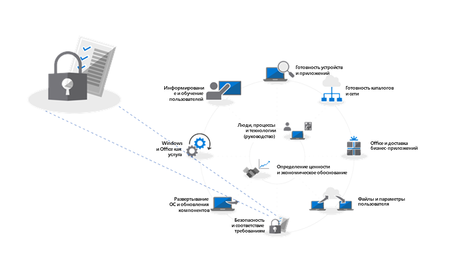

# Шаг 5. Вопросы по безопасности и соответствию требованиям

<table>
<thead>
<td></td>
<td>
<strong>Шаг 5. Вопросы по безопасности и соответствию требованиям</strong>

Windows 10 и Office 365 профессиональный плюс предоставляют новые способы защиты данных, устройств и пользователей, а также быстрого выявления угроз и реагирования на них. Кроме того, узнайте, как устранять распространенные проблемы, связанные с шифрованием дисков, приложениями для защиты от вредоносных программ и политиками при переходе на Windows 10.
</td>
<td></td>
</thead>
</table>

>[!NOTE]
>Безопасность и соответствие требованиям — это пятый этап рекомендуемого процесса развертывания. Эта статья цикла посвящена вопросам безопасности и соответствия требованиям в Windows 10 и Office 365 профессиональный плюс. Полный процесс развертывания для настольных ПК описан в статье [Центр развертывания компьютеров](https://aka.ms/HowToShift).
>

Пришло время рассмотреть варианты целевого выбора новых возможностей для обеспечения безопасности и соответствия требованиям в рамках развертывания Windows 10 и Office 365 профессиональный плюс, а также факторы, которые необходимо учитывать, и препятствия, которые часто возникают при переходе с предыдущих версий Windows и Office. Многие возможности, связанные с безопасностью в Windows 10, сами по себе уже являются шагом вперед. Кроме того, интеграция с облачными службами в Office 365 и возможности работы с удостоверениями с помощью Azure Active Directory обеспечивают доступ к новым и постоянно обновляемым средствам защиты данных, устройств и пользователей.

## Преодоление препятствий, связанных с безопасностью, которые могут возникнуть при развертывании

Прежде чем приступить к изучению новых возможностей, которые появляются при переходе на Windows 10 и Office 365 профессиональный плюс, а также при подключении к облаку, давайте рассмотрим некоторые причины, не дающие довести развертывание до конца.

### Шифрование диска

Прежде всего, может быть зашифрован жесткий диск. Многие решения для шифрования жесткого диска не так просто обновить при переходе с предыдущей версии Windows на более новую.

Некоторые из них позволяют выполнить обновления с помощью параметра /reflectdrivers при установке Windows на определенных версиях их платформ, в то время как для других может потребоваться расшифровка диска перед развертыванием и последующее повторное шифрование после установки Windows 10. Кроме того, в некоторых решениях не удается с помощью устаревшей системы BIOS перейти с основной загрузочной записи (MBR) к таблице разделов GPT, необходимой для UEFI. Это важно, так как 64-разрядная версия Windows 10 с UEFI необходима для имеющихся в Windows 10 новых возможностей обеспечения безопасности на основе виртуализации, описанных ниже.

Один из вариантов устранения этих проблем — использование BitLocker в Windows 10 (входит в Windows 10 Pro и другие выпуски с большими возможностями). BitLocker позволяет отключить защиту для обновления ОС и компонентов во время развертывания.

  [Базовое развертывание BitLocker](https://docs.microsoft.com/ru-RU/windows/security/information-protection/bitlocker/bitlocker-basic-deployment)

### Совместимость антивирусных приложений и приложений для защиты от вредоносных программ

Хотя более [99 % Windows-приложений совместимы](https://www.microsoft.com/en-us/microsoft-365/blog/2018/09/06/helping-customers-shift-to-a-modern-desktop/) как с Windows 7, так и Windows 10, встречаются исключения, к которым чаще всего относятся антивирусные приложения или клиенты виртуальных частных сетей (VPN). Для этих приложений часто применяются нестандартные методы разработки и API, нередко с использованием недокументированных способов защиты системы или подключения к сетевым ресурсам.

Таким образом, эти приложения по своей природе могут значительно зависеть от изменений, связанных с переходом на новую версию Windows. Если программное обеспечение для антивирусной защиты или VPN не работает в Windows 10 или после перехода, исправление, как правило, заключается в замене используемого приложения на поддерживаемое и проверенное в Windows 10.

### Политики безопасности

Параметры групповой политики Active Directory, используемые для более ранних версий Windows и Office, не всегда можно перенести напрямую в Windows 10 и Office 365 профессиональный плюс. Существуют различные факторы, связанные с новыми возможностями для обеспечения безопасности и соответствия требованиям. Рекомендуется определить базовые характеристики политики безопасности для текущих версий приложений Windows и Office с помощью набора средств для безопасности и соответствия требованиям Майкрософт. Кроме того, стоит рассмотреть политики управления мобильными устройствами в Microsoft Intune.

## 

## Новые возможности для безопасности и соответствия требованиям в Microsoft 365

До этого момента мы рассматривали перенос имеющихся средств защиты и факторы, которые нужно учесть до начала перехода. Давайте теперь обсудим новые возможности, которые у вас появятся после перехода на Windows 10, Office 365 профессиональный плюс, облачные средства EMS и т. д.

### Управление удостоверениями и доступом

Начнем с управления удостоверениями и доступом. Azure Active Directory представляет собой панель управления удостоверениями для приложений, устройств и облачных служб и служит современным способом подключения к Office 365 и другим облачным службам. Условный доступ позволяет определить разные требования к проверке подлинности на основе места и устройства для входа, а также необычного поведения и аналогичных аспектов.

На уровне устройства биометрические данные могут служить уникальными идентификаторами для упрощенного и более безопасного доступа к устройствам и приложениям, что помогло бы быстрее отказаться от создания и ввода паролей. Windows Hello выполняет многофакторную проверку подлинности с использованием самого устройства, ПИН-кода или уникального биометрического идентификатора, например лица или отпечатка пальца. Подобную проверку можно принудительно задать с помощью политики.

  [Основы управления удостоверениями Azure](https://docs.microsoft.com/ru-RU/azure/active-directory/fundamentals/identity-fundamentals)

  [Общие сведения о решениях для удостоверений Azure](https://docs.microsoft.com/ru-RU/azure/active-directory/fundamentals/understand-azure-identity-solutions)

  [Условный доступ с помощью Azure Active Directory](https://docs.microsoft.com/ru-RU/azure/active-directory/conditional-access/overview)

  [Windows Hello для бизнеса](https://docs.microsoft.com/ru-RU/windows/security/identity-protection/hello-for-business/hello-identity-verification)

### Безопасность на основе виртуализации

Теперь помимо проверки удостоверений можно обеспечить непрерывную защиту от известных и неизвестных угроз. В Windows 10 реализовано обеспечение безопасности с помощью виртуализации на уровне ядра для правильной начальной загрузки и целостности кода благодаря функции безопасной загрузки. Решение Credential Guard помогает предотвратить кражу учетных данных, так как секретные сведения пользователя изолированы от Windows. Технология Application Guard позволяет изолировать и уменьшить угрозы в браузере путем запуска браузера в изолированном контейнере. Все новейшие технологии в Windows 10 работают благодаря системе безопасности на основе виртуализации, и поэтому несовместимы с системой Windows 7 на уровне оборудования. Обратите внимание, что для них также требуется UEFI, 64-разрядная версия Windows и поддержка расширения виртуализации с помощью SLAT.

  [Дополнительные сведения о безопасности на основе виртуализации](https://docs.microsoft.com/ru-RU/windows-hardware/design/device-experiences/oem-vbs)

### Дополнительные возможности системы безопасности, предоставляемые облачными службами

Облачные службы создают дополнительный уровень защиты в Windows и Office за счет более частых проверок в режиме реального времени. Это позволяет мгновенно обнаруживать и предотвращать новые атаки различных типов, а также реагировать на них. Разница наиболее заметна в сравнении с традиционным обновлением программного обеспечения и файлами сигнатур антивирусных программ, когда реагирование и развертывание обновлений неизбежно выполняется медленнее.

С помощью Microsoft Intelligent Security Graph вы быстрее получите доступ к сведениям о новых угрозах и средствам защиты от них. Ниже рассмотрены несколько примеров подобных преимуществ. Начнем с Office.

  **
  [Защита от потери данных](https://docs.microsoft.com/ru-RU/office365/securitycompliance/data-loss-prevention-policies)**, встроенная в Office 365 профессиональный плюс, помогает ознакомить пользователей с политиками безопасности при обнаружении содержимого с высоким уровнем риска, например данными кредитных карт или идентификационных номеров. Политики могут сообщать об обнаружении таких сведений или блокировать их отправку и совместное использование, предварительно уведомив пользователей.

  **
  [Azure Information Protection](https://docs.microsoft.com/ru-RU/azure/information-protection/rms-client/client-admin-guide)** — дополнительная служба, которую можно использовать совместно с Office и которая помогает легко классифицировать и маркировать файлы Office. Она может запускать автоматические действия с отмеченными файлами, например шифрование или блокировку совместного использования.

Мы добавили также защиту с помощью **[безопасных ссылок](https://docs.microsoft.com/ru-RU/office365/securitycompliance/atp-safe-links)** во всех приложениях Office для защиты пользователей от динамического списка известных вредоносных веб-сайтов.

Кроме того, политики **[безопасных вложений](https://docs.microsoft.com/ru-RU/office365/securitycompliance/atp-safe-attachments)** в Outlook и в составе Exchange Online не ограничиваются фильтрами для проверки вложений электронной почты. Выявив вредоносное вложение с высокой степенью риска, эта служба удалит его из электронной почты и сообщит об этом пользователю.

  **
  [Шифрование сообщений Office 365](https://docs.microsoft.com/ru-RU/office365/securitycompliance/encryption)** (OME) может также использоваться для защиты электронной почты и отправленных вложений, чтобы только указанные получатели могли просматривать содержимое электронной почты. OME легко работает с проверкой подлинности потребителей Google, Yahoo и Майкрософт, а единоразовые секретные коды дают возможность пользователям других служб электронной почты безопасно ее получать.

#### Дополнительные средства защиты в Windows 10

  **
  [Управление приложениями в Защитнике Windows](https://docs.microsoft.com/ru-RU/windows/security/threat-protection/windows-defender-application-control/windows-defender-application-control)** затрагивает в Windows 10 утвержденный список разрешенных и запрещенных приложений, проверенных корпорацией Майкрософт для безопасности, а также все, что управляется политиками защиты конечных точек с помощью Microsoft Intune.

  **
  [Advanced Threat Protection в Защитнике Windows ](https://docs.microsoft.com/ru-RU/windows/security/threat-protection/windows-defender-atp/overview)** — это единая платформа для профилактической защиты, определения произошедших нарушений, автоматизированного расследования и реагирования. Это решение защищает конечные точки от киберугроз, выявляет расширенные атаки и нарушения безопасности данных, автоматизирует инциденты безопасности и повышает уровень безопасности.

  **
  [Exploit Guard](https://docs.microsoft.com/ru-RU/windows/security/threat-protection/windows-defender-exploit-guard/windows-defender-exploit-guard)** помогает уменьшить масштаб атак на работающие приложения, предотвращая проникновение вредоносных программ в Windows и блокируя ненадежные процессы, препятствуя их доступу к защищенным папкам.

#### Microsoft Intune

  [Microsoft Intune](https://docs.microsoft.com/ru-RU/intune/introduction-intune) работает как облачная служба управления для мобильных сценариев, в том числе на устройствах с iOS, Android и Windows. Теперь вы можете настроить эту службу для совместного управления, что позволит дополнить и расширить элементы управления для определенных рабочих нагрузок, находящихся в ведении System Center Configuration Manager. Одно из преимуществ подобного решения заключается в том, что для устройств, получающих доступ к защищенным ресурсам, можно требовать регистрацию в управлении устройствами — даже для неуправляемых, не подключенных к домену или Azure AD присоединенных устройств. Можно также воспользоваться преимуществами детальной настройки и политики соответствия требованиям, принудительно примененной на уровне операционной системы и приложений. Политики и параметры для приложений можно централизованно настроить и принудительно применить для Office 365 профессиональный плюс и приложений магазина в Windows 10 с помощью Microsoft Intune.

## Следующий шаг

## [Шаг 6. Обновления компонентов и развертывание ОС](https://aka.ms/mdd6)

## Предыдущий шаг 

## [Шаг 4. Файлы пользователя и параметры](https://aka.ms/mdd4)
