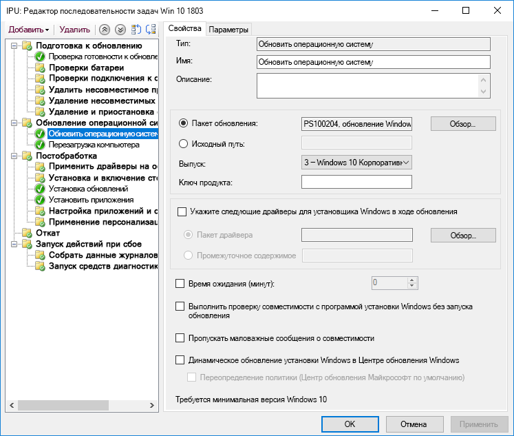

# Шаг 6. Обновления компонентов и развертывание ОС

<table>
<thead>
<td></td>
<td>
<strong>Шаг 6. Обновления компонентов и развертывание ОС</strong>

Развертывание на основе последовательности задач используется для автоматизации крупномасштабного, поэтапного развертывания исходного состояния системы, обновления и замены компьютеров. Последовательность задач при обновлении помогает также не забывать установить значительные полугодичные обновления. Windows Autopilot — это недавнее дополнение, оптимизирующее процесс приобретения нового компьютера.
</td>
<td></td>
</thead>
</table>

>[!NOTE]
>Обновления компонентов и развертывание ОС — шестой этап рекомендуемого нами процесса развертывания, который охватывает развертывание и обновление ОС Windows 10, а также обновления компонентов. Полный процесс развертывания для настольных ПК описан в статье [Центр развертывания компьютеров](https://aka.ms/HowToShift).
>

Если вы до настоящего момента следовали инструкциям из серии статей о процессе развертывания, то по крайней мере частично выполнили шаги, касающиеся подготовки устройства и приложения, подготовили инфраструктуру, настроили и собрали пакеты приложений, разработали план переноса файлов пользователей и настройки параметров по умолчанию, а также разработали планы для сохранения существующих средств контроля безопасности и, возможно, развертывания новых.

Теперь мы подошли к этапу объединения всех составляющих для максимальной автоматизации установки Windows 10 и Приложений Microsoft 365 для предприятий вместе с необходимыми драйверами, приложениями и другими элементами.

В конечном итоге самый лучший критерий успешного развертывания ОС — это оправдание ожиданий пользователя и недопущение прерывания его работы. На этом этапе вы начнете тестирование и развертывание для пилотных пользователей в рамках поэтапного развертывания. Один совет: прежде чем расширять развертывание, ознакомьтесь с шагом 8 из серии статей о процессе развертывания ([Связь с пользователями и их обучение](https://aka.ms/mdd8)). Пользователи должны быть проинформированы и подготовлены к изменениям, а вам нужна возможность оценить ход развертывания путем непрерывной проверки при поэтапном развертывании.

## Процесс создания образа Windows

В большинстве организаций создают образ компьютера для настройки и записи клона Windows, в том числе базового набора некоторых стандартных установленных приложений, или даже "тонкого" образа, включающего только среды выполнения приложений и обновления. Лучше всего это сделать с помощью виртуальной машины, чтобы не возникли неожиданные проблемы из-за несовместимости драйверов. Кроме того, это упростит автоматизацию.

При создании образа нужна максимальная автоматизация. Это поможет добиться как можно лучшего качества образа и обеспечит повторяемость процесса. Для большинства вариантов развертывания рекомендуем выполнять как можно меньше настроек и добавлять как можно меньше предварительно установленных приложений в Windows перед записью. Это так называемый подход "тонкого" образа, позволяющий не перегружать полосу пропускания сети за счет уменьшения количества приложений в образе. Взяв "тонкий" образ за основу, можно добавить требуемые приложения, языки и конфигурации, динамически созданные для пользователей.

Во время сборки и записи такие средства, как Microsoft Endpoint Configuration Manager (Current Branch) и Microsoft Deployment Toolkit, используют средство Sysprep наряду с командой "Generalize", чтобы запечатать образ перед записью устанавливаемой Windows 10 в виде образа.

Записанный образ будет иметь формат образа Windows (WIM), как в случае стандартного установочного носителя Windows. После создания специального файла WIM можно использовать другую последовательность задач в рамках развертывания ОС в Configuration Manager или Microsoft Deployment Toolkit для выполнения задач, связанных с развертыванием, чтобы применить образ и выполнить задачи до и после применения образа Windows.

[Создание эталонного образа Windows 10](https://docs.microsoft.com/windows/deployment/deploy-windows-mdt/create-a-windows-10-reference-image)

[Создание последовательности задач для установки операционной системы](https://docs.microsoft.com/mem/configmgr/osd/deploy-use/create-a-task-sequence-to-install-an-operating-system)

### Типы развертывания

Виды установки или миграции с помощью готового специального образа делятся на описанные ниже категории.

  - Первая — **развертывание на "чистом" компьютере**. Этот сценарий используется для развертывания образа на чистом диске или повторного создания образа для компьютера, с диска которого можно удалить данные.

  - И вторая, похожая, — **обновление компьютера**. Главное отличие состоит в том, что пользовательская среда сохраняется на диске\* или будет восстановлена по завершении установки.

  - Наконец, **замена компьютера**. Как подразумевает сам термин, речь идет о замене одного компьютера на другой. В этом случае создается резервная копия пользовательских файлов с первого компьютера в централизованном хранилище, а затем эти файлы восстанавливаются на втором компьютере.

Все три сценария подразумевают выполнение последовательности задач, в каждом случае можно применять специальный образ.

[Дополнительные сведения о сценариях развертывания Windows 10](https://docs.microsoft.com/windows/deployment/windows-10-deployment-scenarios)

### Обновление на месте с автоматизацией последовательности задач

Помимо упомянутых типов развертывания, существует еще один новый вариант — последовательность задач Microsoft Endpoint Configuration Manager (Current Branch) в Windows 10 и обновление на месте с помощью последовательности задач обновления.

Для обновления предыдущей версии Windows на месте последовательность задач не требуется, но этот подход рекомендуется при развертывании в масштабах корпорации. Обновление на месте не позволяет применить специальный образ с приложениями, однако можно обновить используемый по умолчанию образ install.wim путем автономного обслуживания. Например, можно принудительно применить последние обновления Windows перед установкой новой версии.

При обновлении на месте используется программа установки Windows, которая запускает несколько небольших проверок перед установкой, чтобы выявить известные проблемы с совместимостью. Кроме того, она сохраняет пользовательскую среду и приложения и удаляет только элементы, несовместимые с устанавливаемой версией Windows 10. Таким образом, сохраняются ранее установленные приложения и пользовательская среда. При обновлении на месте можно также выполнить откат до предыдущей установленной операционной системы, если это понадобится для устранения неполадок.

[Проверка перед обновлением в случае Windows 10 с помощью setup.exe](https://blogs.technet.microsoft.com/mniehaus/2015/08/23/windows-10-pre-upgrade-validation-using-setup-exe/)

С помощью сценария обновления на месте можно перейти на Windows 10 с устаревших версий Windows, а также выполнить обновление предыдущих версий Windows 10. Когда программа установки Windows завершит обновление, ваша последовательность задач может выполняться и дальше, обновляя приложения Office, заменяя драйверы и применяя параметры персонализации. Можно также использовать последовательность задач обновления, чтобы перед установкой выполнить задачи или проверки, необходимые для установки новой версии.

[Обновление на месте до Windows 10 с помощью Configuration Manager](https://docs.microsoft.com/windows/deployment/upgrade/upgrade-to-windows-10-with-system-center-configuraton-manager)

[Создание последовательности задач для обновления операционной системы в Configuration Manager](https://docs.microsoft.com/mem/configmgr/osd/deploy-use/create-a-task-sequence-to-upgrade-an-operating-system)

### Поэтапное развертывание

При планировании развертывания определяют целевые компьютеры для развертывания на "чистом" компьютере, обновления, замены и установки новой версии. В этом случае рекомендуем применять поэтапное развертывание к группам похожих компьютеров. Таким образом можно проверить совместимость, доставку и автоматизацию, принятие пользователями, использование полосы пропускания сети и прочие факторы, а затем масштабировать развертывание.

### Рекомендуемые средства: Microsoft Endpoint Configuration Manager (Current Branch) и Microsoft Deployment Toolkit

Любой выбранный вариант развертывания нужно максимально автоматизировать, чтобы добиться прогнозируемых и повторяемых результатов. Корпорация Майкрософт предлагает два решения для автоматизации развертывания операционной системы с помощью автоматизированных последовательностей задач, описанные ниже.

  - **[Microsoft Endpoint Configuration Manager](https://docs.microsoft.com/mem/configmgr/core/understand/introduction)** (ConfigMgr), помимо средств управления распространением программного обеспечения и его обновлением, имеет встроенные возможности развертывания операционной системы. ConfigMgr широко применяется организациями всех размеров и поддерживает все четыре типа развертывания Windows. При желании можно интегрировать ConfigMgr в Microsoft Intune, добавив дополнительные возможности развертывания и управления устройствами.

  - Другой популярный вариант развертывания — бесплатное средство **[Microsoft Deployment Toolkit](https://docs.microsoft.com/windows/deployment/deploy-windows-mdt/get-started-with-the-microsoft-deployment-toolkit)** (MDT), с помощью которого обычно развертывают операционные системы в компаниях малого и среднего бизнеса. В этом случае требуется очень небольшая инфраструктура. MDT интегрируется со службами развертывания Windows (WDS) для загрузки из сети и поддерживает все четыре типа развертывания, а также установку приложений, драйверов и параметров. Разумеется, MDT можно интегрировать с Configuration Manager.

### Windows Autopilot

Новая возможность Windows 10 — настройка новых компьютеров в рамках цикла обновления оборудования с помощью Windows Autopilot. В данном случае можно согласовать с поставщиками оборудования, поддерживающими Windows Autopilot, настройку стандартной установки Windows (например, отменить показ пользователям некоторых элементов, таких как лицензионные соглашения и параметры диагностических данных).

Когда пользователь во время установки войдет в систему компьютера, указав свои учетные данные Azure AD, устройство зарегистрируется в Microsoft Intune, после чего уже Microsoft Intune продолжит развертывание, применит конфигурации обновления приложений и программного обеспечения, а также политики соответствия требованиям. При необходимости Windows Autopilot может запретить пользователю доступ к первому сеансу, пока не будет завершена подготовка.

[Обзор Windows Autopilot](https://docs.microsoft.com/windows/deployment/windows-autopilot/windows-10-autopilot)

[Обязательные условия для Windows Autopilot](https://docs.microsoft.com/windows/deployment/windows-autopilot/windows-10-autopilot#prerequisites)

## Центр обновления Windows для бизнеса для обновления компонентов

Центр обновления Windows для бизнеса — это бесплатная служба, которая позволяет ИТ-специалистам обеспечивать актуальность Windows 10 на устройствах, напрямую подключая их к Центру обновления Windows. Центр обновления Windows для бизнеса можно настроить с помощью групповой политики или через решение MDM, например Microsoft Intune, а ИТ-специалисты могут создать [круги развертывания](https://docs.microsoft.com/windows/deployment/update/waas-deployment-rings-windows-10-updates) для проверки новых сборок. Эта служба интегрирована в такие средства управления, как Windows Server Update Services (WSUS), Microsoft Endpoint Configuration Manager (Current Branch) и Microsoft Intune. Кроме того, Центр обновления Windows для бизнеса поддерживает доставку между одноранговыми узлами, что помогает оптимизировать пропускную способность и снизить загруженность сети.

Дополнительные сведения о Центре обновления Windows для бизнеса см. в указанных ниже статьях.

- [Развертывание обновлений с помощью Центра обновления Windows для бизнеса](https://docs.microsoft.com/windows/deployment/update/waas-manage-updates-wufb)
- [Настройка Центра обновления Windows для бизнеса](https://docs.microsoft.com/windows/deployment/update/waas-configure-wufb)
- [Интеграция Центра обновления Windows для бизнеса с существующими средствами управления](https://docs.microsoft.com/windows/deployment/update/waas-integrate-wufb)
- [Использование групповой политики для настройки Центра обновления Windows для бизнеса](https://docs.microsoft.com/windows/deployment/update/waas-wufb-group-policy)
- [Использование Microsoft Intune для настройки Центра обновления Windows для бизнеса](https://docs.microsoft.com/intune/windows-update-for-business-configure)

## Следующий этап 

## [Этап 7. Обслуживание Windows и Office](https://aka.ms/mdd7)

## Предыдущий этап

## [Шаг 5. Вопросы по безопасности и соответствию требованиям](https://aka.ms/mdd5)
