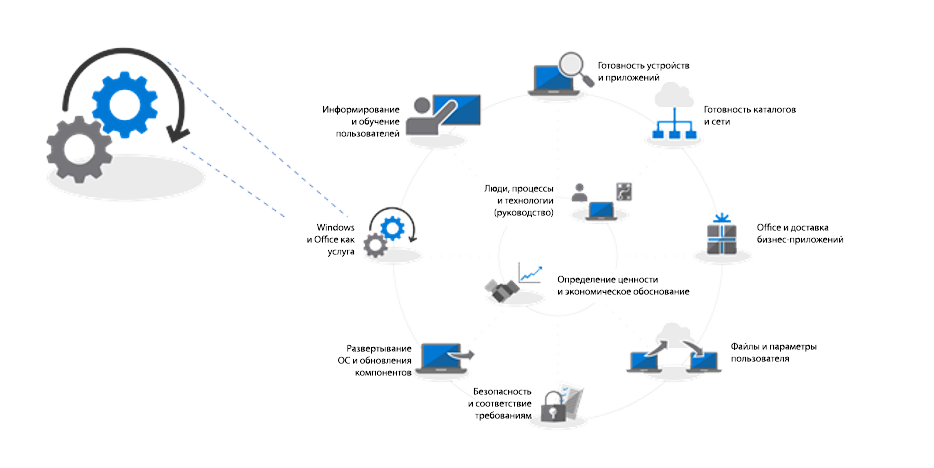
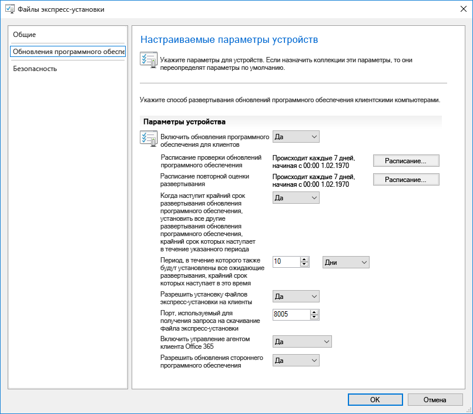
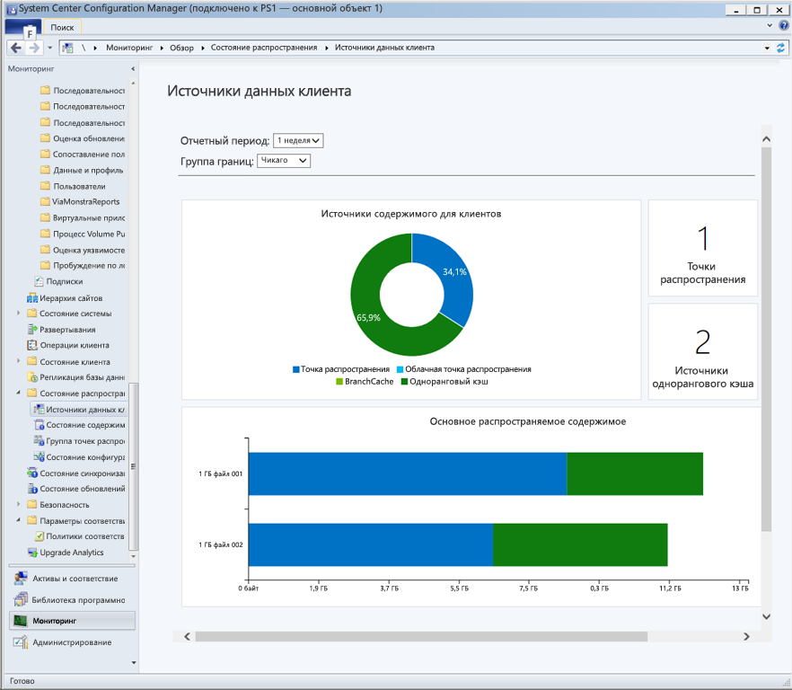
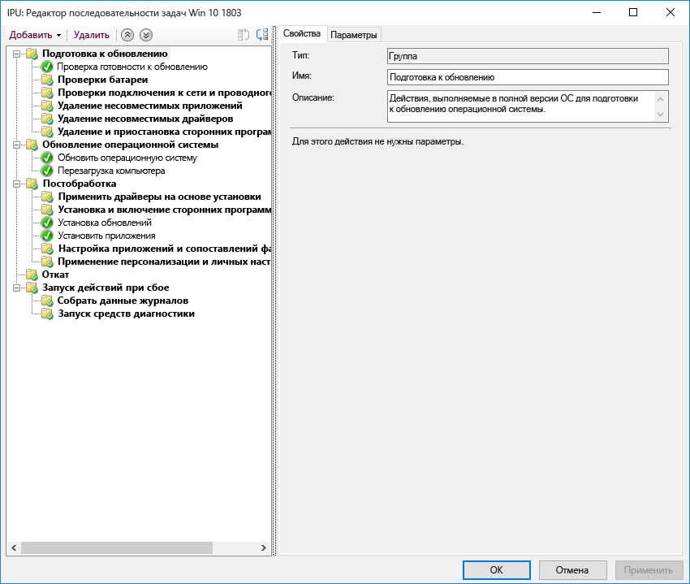

# Этап 7. Обслуживание Windows и Office

<table>
<thead>
<td></td>
<td>
<strong>Этап 7. Обслуживание Windows и Office</strong>

В Windows 10 и Office 365 профессиональный плюс постоянно добавляются новые функции, чтобы развивать пользовательский интерфейс и средства безопасности в соответствии с новейшими инновациями. Узнайте, как обеспечивать актуальность с помощью полугодичных и ежемесячных обновлений, как работают новые модели обслуживания и какие у вас есть инструменты и возможности.
</td>
<td></td>
</thead>
</table>

>[!NOTE]
>Обслуживание Windows и Office — седьмой этап рекомендуемого нами процесса развертывания, который охватывает аспекты планирования полугодичных обновлений компонентов. Полный процесс развертывания для настольных ПК описан в статье [Центр развертывания компьютеров](https://aka.ms/HowToShift).
>

Как в Windows 10, так и в Office 365 профессиональный плюс представлены новые варианты обслуживания, модели поддержки и расписания обновления. Эти изменения помогают своевременно добавлять новые возможности. Вместе с этими обновлениями предоставляются новые параметры конфигурации, позволяющие использовать подходящие вам планы обслуживания. Узнайте, как подготовиться к обновлениям Semi-Annual Channel с новыми компонентами и возможностями в Windows 10 и Office 365 профессиональный плюс, а также использовать новые возможности в System Center Configuration Manager (Current Branch).

[Как мы помогаем клиентам перейти на Windows 10 и Office 365 профессиональный плюс](https://www.microsoft.com/en-us/microsoft-365/blog/2018/09/06/helping-customers-shift-to-a-modern-desktop/)

## Типы обновлений

Обновления делятся на две основные категории: обновления компонентов и исправления с обновлениями для системы безопасности, содержащие накопительные пакеты исправлений ошибок, а также улучшений безопасности и надежности. Что касается частоты, для Windows и Office доступен канал Semi-Annual Channel, предоставляющий новые возможности дважды в год (в марте и сентябре), в то время как исправления и обновления для системы безопасности выпускаются ежемесячно. Кроме того, исключительно для приложений Office 365 мы предоставляем обновления на канале Monthly Channel, которые полностью поддерживаются и содержат как новые возможности, так и исправления.

Если вы привыкли более продолжительному циклу обновления ОС и приложений, вы можете спросить:

  - Будут ли обновления совместимыми?

  - Потребуется ли постоянная переподготовка пользователей?

  - Каковы риски?

Чтобы ответить на эти вопросы и объяснить преимущества более частой доставки новых возможностей, мы рассмотрим некоторые особенности этого подхода.

### Преимущества обновлений компонентов

Во-первых, мы отказались от старой модели, которая создавала огромные волны перемен примерно каждые три года, в пользу небольших добавочных изменений с выпуском обновлений компонентов дважды в год. Почему? Технологии, как и угрозы безопасности, стремительно развиваются, поэтому возможности и защиту требуется поддерживать в актуальном состоянии. Например, некоторые обновления, связанные с безопасностью, невозможно просто доставлять в ежемесячных обновлениях для системы безопасности или файлах сигнатур антивируса. Это могут быть низкоуровневые изменения платформы, например защиты на основе виртуализации.

  [Краткое руководство по модели "Windows как услуга"](https://docs.microsoft.com/ru-RU/windows/deployment/update/waas-quick-start)

  [Устранение угроз с помощью функций безопасности Windows 10](https://docs.microsoft.com/ru-RU/windows/security/threat-protection/overview-of-threat-mitigations-in-windows-10%20%20)

### Преимущества модели накопительных пакетов обновления

Доставка исправлений и обновлений для системы безопасности в виде накопительного пакета обновления исправляет множество возникавших ранее проблем. Раньше каждый месяц приходилось выбирать нужные компоненты из десятков доступных обновлений для Windows и Office. Как вы можете представить, это делает поддержку тестовых матриц практически невозможной. Кроме того, если установить версию Windows или Office, вышедшую более года назад, то применение всех обновлений, выпущенных с момента выхода этой версии, может занять часы или даже дни.

С накопительной моделью от актуальной версии вас всегда отделяет лишь одно обновление, поэтому необходимое количество ежемесячных обновлений снижается. Каждое обновление дополняет выпуски за предыдущие месяцы и содержит все исправления, необходимые для обеспечения актуальности. Накопительные пакеты обновления особенно полезны для тех компьютеров, которые были отключены в течение нескольких месяцев, так как находились на складе, ожидая переназначения другому пользователю.

### Расширенная проверка обновлений

Еще одно преимущество заключается в том, что перед широким развертыванием обновлений мы сначала выпускаем сборки через программы предварительной оценки [Office](https://products.office.com/ru-RU/office-insider?tab=Windows-Desktop) и [Windows](https://insider.windows.com/en-us/), что позволяет нам собирать диагностические данные и отзывы до выпуска общедоступной версии. В настоящее время программы предварительной оценки открыты для всех, поэтому вы можете заранее осваивать новые обновления. К моменту выпуска мы собираем диагностические данные с миллионов конфигураций, поэтому можем быть уверены в качестве общедоступных обновлений.

И еще: сборки для участников программы предварительной оценки Office 365 профессиональный плюс основаны на обновлениях Monthly Channel, поэтому если вы используете Semi-Annual Channel для Office, чтобы доставлять обновления компонентов дважды в год, как и для Windows, то вы можете проверять эти сборки заранее, а также использовать выпуски для Semi-Annual Channel.

### Вспомогательные средства управления

Мы также продумали удобное развертывание обновлений. System Center Configuration Manager (Current Branch) часто обновляется для поддержки новых возможностей и развертывания этих обновлений в Windows и Office.

  [Развертывание обновлений Windows 10 с помощью System Center Configuration Manager](https://docs.microsoft.com/ru-RU/windows/deployment/update/waas-manage-updates-configuration-manager)

  [Управление Office 365 профессиональный плюс с помощью Configuration Manager](https://docs.microsoft.com/ru-RU/sccm/sum/deploy-use/manage-office-365-proplus-updates)

## Общие сведения о каналах для Windows и Office

Для Windows 10 предлагается три канала обслуживания:

- 
  [
  **Программа предварительной оценки Windows**](https://docs.microsoft.com/ru-RU/windows/deployment/update/waas-overview#windows-insider) для тестирования организациями новых возможностей обновления и предоставления отзыва о них
- **Semi-Annual Channel** предоставляет новые функции в выпусках обновления компонентов два раза в год
- **Long Term Servicing Channel** предназначен только для специальных устройств, которым требуется вариант обслуживания с более длительным сроком действия

Для Office 365 предлагается четыре канала обслуживания:

- 
  [
  **Программа предварительной оценки Office**](https://support.office.com/ru-RU/article/What-is-Office-Insider-f4208185-b63a-4b68-9c7a-9a32d2411c16) для тестирования организациями новых возможностей и функций Office, которые находятся в разработке, и предоставления отзыва о них
- **Monthly Channel** для предоставления пользователям новейших возможностей Office по мере их выпуска
- **Semi-Annual Channel** предоставляет новые функции в новых компонентах только два раза в год
- **Semi-Annual Channel (Targeted)**  — полностью поддерживаемая сборка Office, которая позволяет пилотным пользователям и тестировщикам совместимости приложений тестировать и проверять следующий выпуск Semi-Annual Channel

Подробные сведения о каналах обслуживания Windows и Office см. в указанных ниже статьях.

- 
  [Обзор модели "Windows как услуга"](https://docs.microsoft.com/ru-RU/windows/deployment/update/waas-overview#servicing-channels)
- 
  [Обзор каналов обновления Office 365 профессиональный плюс](https://docs.microsoft.com/ru-RU/DeployOffice/overview-of-update-channels-for-office-365-proplus#BKMK_SAC)

## Поэтапное развертывание обновлений

Теперь переключим внимание на то, как вы будете развертывать эти обновления. Для любого выпуска рекомендуем выполнять развертывание как минимум в три этапа: проверку, пилотное тестирование и широкое развертывание в рабочей среде. Когда Windows 10 и Office 365 профессиональный плюс будут готовы к работе, вы будете использовать ежемесячное обслуживание, чтобы поддерживать их актуальность с помощью обновлений для системы безопасности и исправлений, а новые функции будут добавляться в рамках полугодичного обслуживания.

### Ежемесячное обновление

Эта модель обслуживания устроена так, чтобы вы могли сократить частоту развертывания новых функций до двух раз в год, а при необходимости даже пропускать полугодичные обновления и продолжать получать исправления и обновления для системы безопасности. Как уже упоминалось, накопительный характер ежемесячных обновлений означает, что их размер будет увеличиваться каждый месяц.

#### Экспресс-обновления

С помощью технологии "экспресс-обновлений" в Windows и двоичного разностного сжатия в Office мы можем значительно уменьшать размер скачиваемых файлов. В обоих случаях системы обновления проверяют версию, установленную на компьютере, и находят отличия, которые требуется обновить.

[Описание исправлений Windows 10 и сведения об окончании выпуска разностных обновлений](https://techcommunity.microsoft.com/t5/Windows-IT-Pro-Blog/Windows-10-quality-updates-explained-amp-the-end-of-delta/ba-p/214426)

Центр обновления Windows для бизнеса и Windows Server Update Services уже давно поддерживают экспресс-обновления, но теперь мы добавили их поддержку в System Center Configuration Manager.

#### Двоичное разностное сжатие

Двоичное разностное сжатие в Office используется, только если вы обновляете последнюю версию Office 365 профессиональный плюс, поэтому для его использования необходимо выполнять обновление с предыдущей сборки и не пропускать обновления.

Каналами обновления Windows и Office можно управлять с помощью диспетчера конфигураций, используя стандартный процесс утверждения и таргетинга. Кроме того, вы можете использовать параметры политики в Office и Windows, чтобы принудительно применять определенные каналы обновления, а также связанные с ними параметры.

### Полугодичные обновления

Итак, мы рассмотрели ежемесячные обновления. Теперь перейдем к более масштабным полугодичным обновлениям.

Как упоминалось в статье "Готовность устройств и приложений", подготовку к этим крупным обновлениям следует начать с помощью тех же средств обеспечения готовности, которые мы настроили на 1-м этапе развертывания.

Что касается инструментария, вы можете использовать параметры политики в центре обновления Windows для бизнеса, средства управления обновлениями ПО в System Center Configuration Manager, Windows Server Update Services (WSUS) или политики обновления, заданные в Microsoft Intune. Если вас беспокоит пропускная способность сети, см. статью "Этап 2. Готовность каталогов и сети", чтобы узнать, как вы можете уменьшить сетевой трафик с помощью оптимизации доставки и других технологий однорангового кэширования.

  [Windows Semi-Annual Channel](https://docs.microsoft.com/ru-RU/windows/deployment/update/waas-overview#semi-annual-channel)

  [Semi-Annual Channel для Office 365 профессиональный плюс](https://docs.microsoft.com/ru-RU/DeployOffice/overview-of-update-channels-for-office-365-proplus#BKMK_SAC)

#### Последовательности задач обновления

Установка крупных обновлений компонентов с помощью стандартных методик управления обновлениями ПО поддерживается, но многие организации выбирают последовательность задач обновления в System Center Configuration Manager или Microsoft Deployment Toolkit.

Последовательность задач позволяет создавать собственные проверки или задачи ДО установки обновления компонентов, а также выполнять пользовательские задачи ПОСЛЕ установки самого обновления. Задачи после обновления могут включать временную остановку служб, если это требуется во время обновления, установку и замену драйверов, обновления приложений, а также параметры персонализации панели задач или меню "Пуск" в Windows 10.

Если вы уже используете последовательности задач для переноса компьютеров с Windows 7 на Windows 10 и хорошо владеете этими инструментами, то это отличная отправная точка, предоставляющая полный контроль. Вы можете использовать одну последовательность задач для всего обновления, но во многих организациях используется две последовательности. Одна гарантирует, что компьютеры готовы к обновлению, незаметно подготавливая все необходимые установочные файлы на целевых компьютерах, а другая выполняет само обновление. Этот подход обеспечивает меньшее воздействие на продуктивность пользователей.

  [Создание последовательности задач для обновления операционной системы в Configuration Manager](https://docs.microsoft.com/ru-RU/sccm/osd/deploy-use/create-a-task-sequence-to-upgrade-an-operating-system)

#### Поддержка обновлений компонентов в полугодовом канале

[Как было объявлено в сентябре 2018 г.](https://www.microsoft.com/en-us/microsoft-365/blog/2018/09/06/helping-customers-shift-to-a-modern-desktop/), сроки поддержки обновлений Semi-Annual Channel будут основаны на описанной ниже модели.

  - Все поддерживаемые в данный момент обновления компонентов Windows 10 Корпоративная и Windows 10 для образовательных учреждений, начиная с версии 1607, будут поддерживаться в течение 30 месяцев со дня их первоначального выпуска.

  - Все последующие обновления компонентов, начиная с версии 1809, выпущенные в сентябре, будут поддерживаться в течение 30 месяцев со дня их выпуска.

  - Будущие обновления компонентов, выпущенные в марте, начиная с версии 1903, будут поддерживаться в течение 18 месяцев со дня их выпуска.

  - Полугодичные обновления Office 365 профессиональный плюс продолжат поддерживаться в течение 18 месяцев.

#### Дополнительные варианты автоматизации установки помимо последовательностей задач

Если вы не используете последовательности задач обновления, то теперь вы можете выполнять дополнительные действия или применять файлы драйверов во время обновления компонентов до установки (до того, как программа установки выполнит проверки совместимости) или до фиксации (применения обновления).

  [Что нового в программе установки Windows 10 версии 1803](https://docs.microsoft.com/ru-RU/windows/whats-new/whats-new-windows-10-version-1803%23windows-setup)

## Следующий этап 

## [Этап 8. Информирование и обучение пользователей](https://aka.ms/mdd8)

## Предыдущий этап 

## [Этап 6. Развертывание ОС и обновление компонентов](https://aka.ms/mdd6)