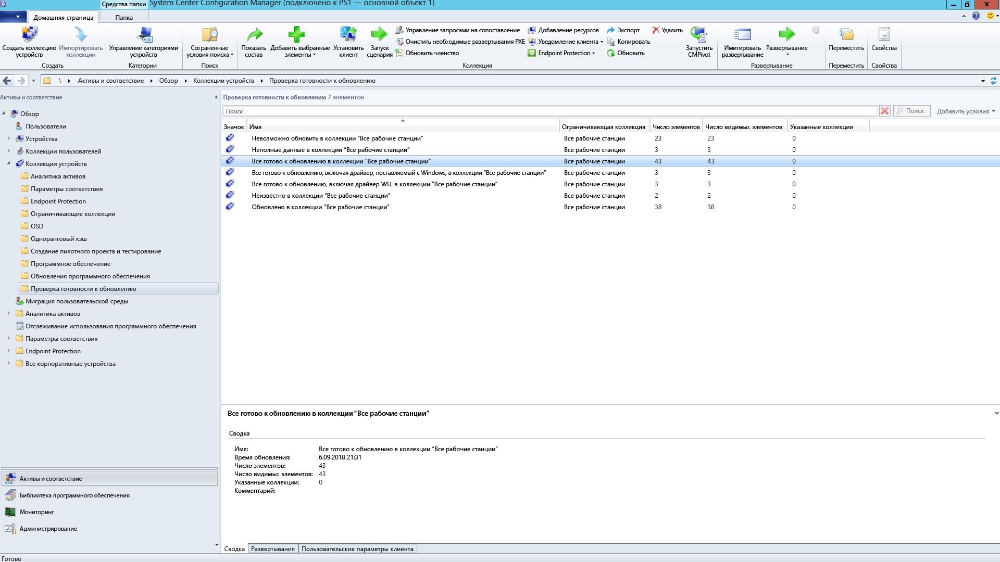
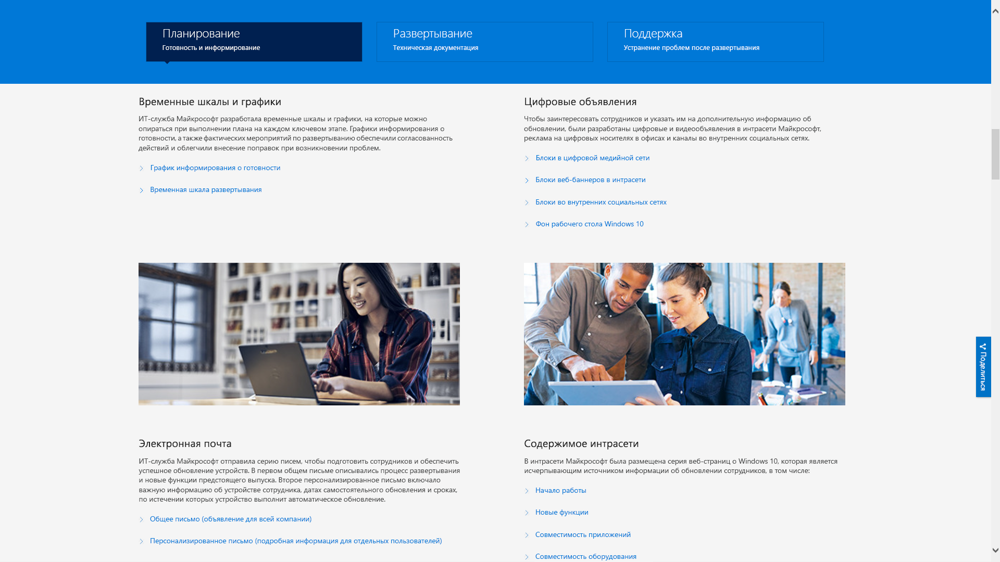

# Шаг 8. Информирование и обучение пользователей

<table>
<thead>
<td></td>
<td>
<strong>Шаг 8. Обучение и взаимодействие пользователей</strong>

Убедитесь, что пользователи уведомлены о новых возможностях и способах работы при переходе на Windows 10 и приложения Microsoft 365 для предприятий. Узнайте, как воспользоваться помощью по адаптации пользователей с использованием Microsoft FastTrack, обучающих материалов, шаблонов для общения, а также новых способов отслеживать принятие и использование продуктов пользователями.
</td>
<td></td>
</thead>
</table>

>[!NOTE]
>Информирование и обучение пользователей — это восьмой шаг рекомендуемого нами процесса развертывания, включающий советы и рекомендации по информированию и подготовке пользователей. Полный процесс развертывания для настольных ПК описан в [Центре развертывания компьютеров](https://aka.ms/HowToShift).
>

Информирование и подготовка пользователей к работе с современным компьютером, которая включает работу с Office 365, Windows 10 и новыми средствами обеспечения безопасности и соответствия требованиям в Azure Active Directory, крайне важны для выполнения внедрения. Здесь важно понять, как вводить обновления, когда некоторые пользователи могут бояться перебоев в работе, изменений в рабочем процессе или изучения новых вещей.

Хорошая новость заключается в том, что при переходе с Windows 7 и Office 2010 или Office 2013 многие уже будут знакомы с Windows 10 и более поздними версиями Office, так как они установлены на их личных устройствах. Все это поможет внести изменения с минимальными негативными последствиями.

## Подготовка к новому взаимодействию

Начнем с Office. Если развертывание приложений Microsoft 365 для предприятий выполняется впервые, самое время сообщить о преимуществах входа в приложения Office и сохранения файлов в OneDrive или SharePoint: при этом упрощается общий доступ, уменьшается ветвление файлов и предоставляется возможность совместно редактировать файлы в реальном времени.

Для этих и других локальных или браузерных приложений, например Teams и Планировщика, доступны подробные шаблоны для информирования и обучения.

Также мы предоставляем инструкции, посвященные новым возможностям приложений, в частности вложению файлов OneDrive в Outlook в виде ссылок, новым переходам с трансформацией и возможностям конструктора в PowerPoint.

Мы поможем вам познакомить пользователей с дополнительными и стандартными возможностями Windows 10, например Windows Hello для безопасного входа с помощью биометрических данных, началом обновлений для персонализации интерфейса Windows, временной шкалой для легкого возобновления начатой ранее работы, Кортаной и многим другим.

Вы также можете предоставить пользователям средства обеспечения безопасности и соответствия требованиям. Решение Enterprise Mobility + Security, которое состоит из Azure AD и Microsoft Intune, интегрирует дополнительные возможности в Windows 10 и Office 365.

[Microsoft Enterprise Mobility + Security](https://www.microsoft.com/cloud-platform/enterprise-mobility-security)

Например, при включенной многофакторной проверке подлинности используется Azure AD. Для безопасного доступа к ресурсам и службам пользователь должен будет выполнить вход с помощью приложения для телефона или PIN-кода. Azure Information Protection упрощает классификацию и маркировку документов.

[Настройка многофакторной проверки подлинности для пользователей](https://support.office.com/article/set-up-multi-factor-authentication-for-office-365-users-8f0454b2-f51a-4d9c-bcde-2c48e41621c6)

В распоряжении пользователей появятся новые возможности, некоторые из них станут приятным (или не столь приятным) сюрпризом. Такие сюрпризы, особенно меняющие привычный рабочий процесс, могут привести к увеличению числа звонков и запросов в службу технической поддержки.

## Упреждающая подготовка и измеряемые развертывания

Чтобы уменьшить риски, связанные с изменениями интерфейса, рекомендуем два дополняющих друг друга подхода:

  - заранее сообщить пользователям, чего им ожидать;

  - контролировать скорость развертывания с помощью кругов.

### Поэтапное развертывание

Концепция поэтапного развертывания с помощью кругов заключается в следующем: начинают с малых групп, а затем контролируемым образом расширяют масштабы развертывания. Обычно к тому времени, когда план информирования и обучения будет составлен, эти круги и их участники должны уже сформироваться. Таким образом, снизится возможный риск, а примененный подход будет проверен. Можно будет расширять масштабы развертывания постоянно или же приостановить его в случае необходимости, например если звонков в службу технической поддержки поступит больше, чем ожидалось.

Круги развертывания лучше всего создавать совместно с подразделениями и их руководителями. Нужно понять, какие дни и периоды являются критическими, и воздержаться от развертывания или внесения изменений в это время. Без тщательного планирования и участия заинтересованных лиц будет сложно привлечь пользователей и обеспечить их комфортную работу во время изменений.

### Этап 1. ИТ-отдел и первые пользователи внутри организации 

Обычно лучше начинать развертывание с ИТ-отдела и энтузиастов, которые добровольно желают стать первыми пользователями. На них можно опробовать информирование, оценить последствия изменений и эффективность информирования и обучения. Во время этого этапа ИТ-отдел реализует небольшие пилотные проекты, изучает средства устранения неполадок и автоматизации, которые пригодятся во время более масштабных этапов развертывания.

Во время первоначального пилотного этапа важно задействовать участников, чтобы они задокументировали свои наблюдения и отзывы о процессе. Рекомендуется также ранее внедрение за пределами ИТ-отдела, что поможет естественным образом устно распространить информацию о новых возможностях. Часто первые пользователи оказывают поддержку остальным во время последующих этапов.

### Этап 2. Пилотный проект 

Если первый этап прошел хорошо, можно переходить ко второму — пилотному проекту с участием большего количества пользователей. Здесь необходима репрезентативная выборка ролей пользователей, типов устройств, приложений для Windows и надстроек Office. Данные, возвращаемые из этих групп, будут использоваться службой аналитики для рассмотрения первоначальных волн этапа 3, более широкого развертывания.

Помните, что все компьютеры на этом и будущих этапах должны отправлять журналы в службу аналитики, чтобы вы могли собирать диагностические данные о работоспособности устройств и приложений, а также сэкономленной пропускной способности сети за счет оптимизации доставки и использования входа через Windows Hello.

Во время этого этапа особенно важно сообщать об изменениях и помогать пользователям осваивать новые возможности. Пользователи часто считают неважными или игнорируют сообщения электронной почты и другие уведомления от ИТ-отдела, поэтому лучше встретиться с руководителями и заручиться их поддержкой в оповещении пользователей об изменениях и принятии новых инструментов и технологий.

От них также потребуется информация о периодах, в течение которых нельзя выполнять обновления, чтобы как можно меньше прерывать работу пользователей. Например, финансовый отдел может быть чрезвычайно загружен в конце финансового квартала, а производственный — во время запуска продукта.

Одновременно с планированием для устройств, пользователей, отделов и хронологией вы можете начать создавать планы информирования и обучения, а также собирать материалы или задействовать внешние ресурсы для обучения пользователей.

#### Microsoft FastTrack 

Вам будет проще собирать обучающие материалы, если вы пройдете полный видеокурс с пошаговыми инструкциями в библиотеке производительности Microsoft FastTrack.

[Библиотека производительности Microsoft FastTrack](https://www.microsoft.com/microsoft-365/success/?rtc=2)

В библиотеке сотни тем, посвященных важным для вашей организации аспектам: созданию более впечатляющего содержимого, совместному использованию сайтов и содержимого, преобразованию командной работы и значительному повышению производительности с помощью современных устройств.

Кроме того, пользователи Microsoft 365 или Office 365 могут получить помощь службы Microsoft FastTrack по стимулированию внедрения. Представители ознакомят вас с рекомендациями по внедрению во время развертывания Microsoft 365, Windows, Office и EMS.

#### Демонстрация ИТ-подразделения Майкрософт 

Серия демонстраций ИТ-подразделения Майкрософт — еще один отличный ресурс для содержимого, связанного с развертыванием Windows 10. Эта серия включает временные графики и расписания, шаблоны для цифрового продвижения, шаблоны электронной почты и содержимое интрасети. Все это содержимое основано на материалах, используемых корпорацией Майкрософт для развертывания Windows 10 в своей собственной среде и изменены таким образом, что ими сможет воспользоваться любая организация.

[Подготовка организации к простому развертыванию Windows 10](https://www.microsoft.com/itshowcase/windows10deployment)

Эти компоненты и службы можно настроить во время пилотного этапа. Вы уже знаете, что важно согласовать с пользователями целевые устройства в процессе обучения и выяснить с помощью службы аналитики, для каких устройств или групп пользователей следует отменить или отсрочить развертывание. На основе полученных данных и накопленного опыта можно будет расширять развертывание на более поздних этапах.

Во время расширения пилотного проекта имеет смысл документировать и публиковать наиболее частые вопросы и содержимое для самообслуживания. Это поможет заблаговременно уменьшить количество обращений в службу поддержки и в справочную службу.

### Этап 3 и далее. Широкое производственное развертывание 

К началу этапов широкого развертывания процессы следует ожидать усовершенствования процессов, механизмов обмена информацией, средств обучения и самообслуживания. После этого можно использовать собранные диагностические данные для обновления все большего числа компьютеров.

Выполняйте развертывание на скорости, которая устроит ваш ИТ-отдел, службу технической поддержки и пользователей, а также будет соответствовать пропускной способности сети. Вы всегда сможете вернуться к шагу 2 процесса развертывания для дополнительной оптимизации с помощью однорангового кэша, LEDBAT и других технологий, ускоряющих перенос данных.

Помимо диагностических данных, контролируемых с помощью средств аналитики, можно подробно отслеживать использование службы Office 365 и Microsoft 365 по детальным отчетам об использовании по рабочей нагрузке в центре администрирования, а также на информационных панелях администрирования через Power BI. Это отличные инструменты для определения и отслеживания целей при развертывании новых инструментов для совместной работы, например Microsoft Teams, и новых способов совместного использования файлов, в частности OneDrive.

Внедрение новых технологий будет происходить еще долго после того, как на каждом компьютере в вашей организации установят Windows 10 и приложения Microsoft 365 для предприятий. При этом порядок работы пользователей может и не измениться, поэтому не всегда придется тратить время на информирование пользователей и их обучение новым возможностям. Наконец, в новых моделях обслуживания продолжится информирование о новшествах: раз в полгода для Windows и (дополнительно) раз в месяц для Office.

## Предыдущий этап 

## [Этап 7. Обслуживание Windows и Office](https://aka.ms/mdd7)
