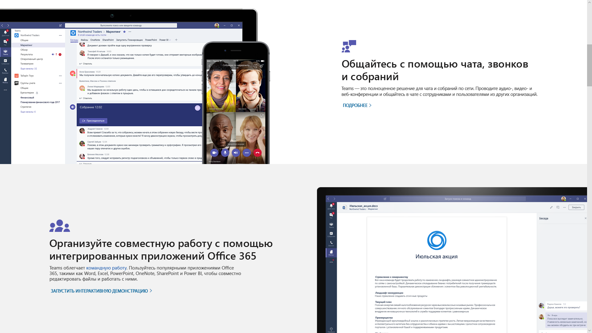
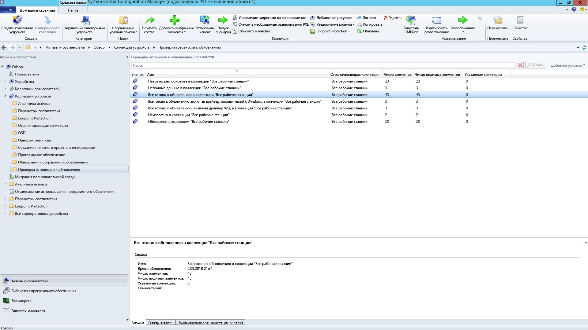
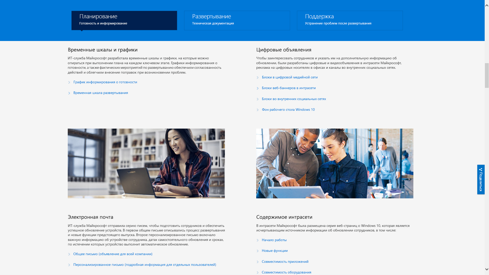

# Шаг 8. Информирование и обучение пользователейStep 8: User Communications and Training

<table>
<thead>
<td></td>
<td>
<strong>Шаг 8. Обучение и взаимодействие пользователей</strong><strong>Step 8: User Communication and Training</strong>

Убедитесь, что пользователи уведомлены о новых возможностях и способах работы при переходе на Windows 10 и Office 365 профессиональный плюс. Узнайте, как воспользоваться помощью по адаптации пользователей с применением Microsoft FastTrack, обучающими материалами, шаблонами для общения, а также новыми способами отслеживать принятие и использование продуктов пользователями.Make sure your users are informed about new experiences and new ways of working as you shift your PCs to Windows 10 and Office 365 ProPlus. Learn how to take advantage of user adoption assistance with Microsoft FastTrack, training materials and communication templates, as well as new ways to monitor user acceptance and usage.
</td>
<td></td>
</thead>
</table>

>[!NOTE]
>Информирование и обучение пользователей — это восьмой шаг рекомендуемого нами процесса развертывания, включающий советы и рекомендации по информированию и подготовке пользователей.User Communications and Training is the eighth step in our recommended deployment process wheel by covering tips and recommendations to inform and prepare users. Полный процесс развертывания для настольных ПК описан в [Центре развертывания компьютеров](https://aka.ms/HowToShift).To see the full desktop deployment process, visit the [Desktop Deployment Center](https://aka.ms/HowToShift).
>

Информирование и подготовка пользователей к работе с современным компьютером, которая включает работу с Office 365, Windows 10 и новыми средствами обеспечения безопасности и соответствия требованиям в Azure Active Directory, крайне важны для выполнения внедрения.Informing and preparing your users for modern workplace experiences spanning Office 365, Windows 10, and new security and compliance controls with Azure Active Directory is critical to driving adoption. Здесь важно понять, как вводить обновления, когда некоторые пользователи могут бояться перебоев в работе, изменений в рабочем процессе или изучения новых вещей.The trick here is to figure out how to introduce updates -- when some users may fear disruptions to their productivity or changes in their workflow, or if they have to learn new things.

Хорошая новость заключается в том, что при переходе с Windows 7 и Office 2010 или Office 2013 многие уже будут знакомы с Windows 10 и более поздними версиями Office, так как они установлены на их личных устройствах. Все это поможет внести изменения с минимальными негативными последствиями.The good news is if you are moving from Windows 7 and Office 2010 or Office 2013, there will be a lot of people familiar with Windows 10 and newer versions of Office running on their personal devices, and all this will help reduce the impact of change.

## Подготовка к новому взаимодействиюGetting ready for new experiences

Начнем с Office. Если развертывание Office 365 профессиональный плюс выполняется впервые, самое время сообщить о преимуществах входа в приложения Office и сохранения файлов в OneDrive или SharePoint — это упрощает общий доступ, уменьшает ветвление файлов и дает возможность совместно их редактировать в режиме реального времени.Starting with Office, if you’re deploying Office 365 ProPlus for the first time, this is when you can communicate the benefits of signing in to Office apps and saving files to OneDrive or SharePoint locations to enable easier sharing, reduce file branching and enable real-time co-authoring.

Для этих и других локальных или браузерных приложений, например Teams и Планировщика, доступны подробные шаблоны для информирования и обучения.Detailed communication and training templates are available for these and other local or browser-based apps, like Teams and Planner.

Также мы предоставляем инструкции, посвященные новым возможностям приложений, в частности вложению файлов OneDrive в Outlook в виде ссылок, новым переходам с трансформацией и возможностям конструктора в PowerPoint.We also give guidance for new in-app capabilities like attaching OneDrive linked files in Outlook or using the new Morph slide transitions and Designer features in PowerPoint.

Мы поможем вам познакомить пользователей с дополнительными и стандартными возможностями Windows 10, например Windows Hello для безопасного входа с помощью биометрических данных, началом обновлений для персонализации интерфейса Windows, временной шкалой для легкого возобновления начатой ранее работы, Кортаной и многим другим.For Windows 10, we help you to familiarize your users with optional and default capabilities like Windows Hello to log in securely using biometrics, Start updates to personalize your Windows experience, Timeline to easily get back to what you were working on, Cortana and more.

Вы также можете предоставить пользователям средства обеспечения безопасности и соответствия требованиям. Решение Enterprise Mobility + Security, которое состоит из Azure AD и Microsoft Intune, интегрирует дополнительные возможности в Windows 10 и Office 365.There are also visible security and compliance controls that your users may be exposed to. Enterprise Mobility + Security which comprises Azure AD and Microsoft Intune, integrates additional capabilities with Windows 10 and Office 365 that you can target for your desktop upgrade.

[Microsoft Enterprise Mobility + SecurityMicrosoft Enterprise Mobility + Security](https://www.microsoft.com/ru-RU/cloud-platform/enterprise-mobility-security)

Например, при включенной многофакторной проверке подлинности используется Azure AD. Для безопасного доступа к ресурсам и службам пользователь должен будет выполнить вход с помощью приложения для телефона или PIN-кода. Azure Information Protection упрощает классификацию и маркировку документов.For example, if you've enabled Multi-factor Authentication, this uses Azure AD --and protects user sign-in to resources by leveraging a phone app or PIN to securely access services. And Azure Information Protection makes it easy for users to classify and label documents.

[Настройка многофакторной проверки подлинности для пользователей Office 365Set up multi-factor authentication for Office 365 users](https://support.office.com/ru-RU/article/set-up-multi-factor-authentication-for-office-365-users-8f0454b2-f51a-4d9c-bcde-2c48e41621c6)

В распоряжении пользователей появятся новые возможности, некоторые из них станут приятным (или не столь приятным) сюрпризом. Такие сюрпризы, особенно меняющие привычный рабочий процесс, могут привести к увеличению числа звонков и запросов в службу технической поддержки.These are just a handful of new capabilities that will be experienced by your users and some may catch them by surprise – either in a positive or less positive way. And these surprises – especially if they alter the normal work flow – can result in more calls and tickets for you or your helpdesk.

## Упреждающая подготовка и измеряемые развертыванияProactive Preparation and Measured Roll-outs

Чтобы уменьшить риски, связанные с изменениями интерфейса, рекомендуем два дополняющих друг друга подхода:To help minimize the risk associated with changes in the user experience, we recommend two complementary approaches:

  - заранее сообщить пользователям, чего им ожидать;Proactive communication to your users so they know what to expect

  - контролировать скорость развертывания с помощью кругов.Use of deployment rings to control the rate of deployment

### Поэтапное развертываниеPhased Deployment

Концепция поэтапного развертывания с помощью кругов заключается в следующем: начинают с малых групп, а затем контролируемым образом расширяют масштабы развертывания. Обычно к тому времени, когда план информирования и обучения будет составлен, эти круги и их участники должны уже сформироваться. Таким образом, снизится возможный риск, а примененный подход будет проверен. Можно будет расширять масштабы развертывания постоянно или же приостановить его в случае необходимости, например если звонков в службу технической поддержки поступит больше, чем ожидалось.Phased deployment using deployment rings is the concept of starting with small groups then broadened deployment scale in a measured way over time. Normally by the time a communication and training plan is drafted, these rings and their members should be formed. This way, you can reduce potential risk and validate your approach as you continually open the deployment valve, or pause activities if needed, for example, when you see more helpdesk calls come in than expected.

Круги развертывания лучше всего создавать совместно с подразделениями и их руководителями. Нужно понять, какие дни и периоды являются критическими, и воздержаться от развертывания или внесения изменений в это время. Без тщательного планирования и участия заинтересованных лиц будет сложно привлечь пользователей и обеспечить их комфортную работу во время изменений.Deployment rings are best created in cooperation with business units and their managers. You’ll want an understanding of critical dates and times to avoid when deploying or making changes. Without careful planning and buy-in from stakeholders, it will be difficult to get users on-board and comfortable with any changes coming their way.

### Этап 1. ИТ-отдел и первые пользователи внутри организацииPhase 1: The IT Team and Early Adopter Insiders 

Обычно лучше начать развертывание с ИТ-отдела и энтузиастов, которые добровольно желают стать первыми пользователями. На них можно опробовать информирование, оценить последствия изменений и эффективность информирования и обучения. Во время этого этапа ИТ-отдел реализует небольшие пилотные проекты, изучает средства устранения неполадок и автоматизации, которые пригодятся во время более масштабных этапов развертывания.It’s usually best to begin your deployment with the IT team and enthusiastic early adopters, who volunteer for early access. With these “insiders” you can test your communications, the impacts of change and the effectiveness of your communications and training. During this phase, IT runs small pilots, learns troubleshooting and automation techniques to help during broader deployment phases.

Во время первоначального пилотного этапа важно задействовать участников, чтобы они задокументировали свои наблюдения и отзывы о процессе. Рекомендуется также ранее внедрение за пределами ИТ-отдела, что поможет естественным образом устно распространить информацию о новых возможностях. Часто первые пользователи оказывают поддержку остальным во время последующих этапов.It’s important to have engaged members in the initial pilot phase, to make sure they are documenting their observations and feeding back to the process. Also, it’s good to have champions outside the IT team that help extend organic, word-of-mouth communication of new capabilities, and they’ll often be first line of support when users in later phases need help.

### Этап 2. Пилотный проектPhase 2: Pilot 

Если первый этап прошел хорошо, можно переходить ко второму — пилотному проекту с участием большего количества пользователей. Здесь необходима репрезентативная выборка ролей пользователей, типов устройств, приложений для Windows и надстроек Office. Данные, возвращаемые из этих групп, будут использоваться службой аналитики для рассмотрения первоначальных волн этапа 3, более широкого развертывания.Once you feel good about the first phase, you can target a larger set of users for your second, pilot phase. This should comprise a representative mix of user roles, device types, Windows apps and Office add-ins. The data returning from these groups will be used via Analytics to target the initial waves for phase 3, the broader deployment.

Помните, что все компьютеры на этом и будущих этапах должны отправлять журналы в службу аналитики, чтобы вы могли собирать диагностические данные о работоспособности устройств и приложений, а также сэкономленной пропускной способности сети за счет оптимизации доставки и использования входа через Windows Hello.Remember, all PCs in this phase and future phases should be logging up to the Analytics service, so you can collect diagnostic data about device and app health as well as bandwidth savings from Delivery Optimization and use of Windows Hello login.

Во время этого этапа особенно важно сообщать об изменениях и помогать пользователям осваивать новые возможности. Пользователи часто считают неважными или игнорируют сообщения электронной почты и другие уведомления от ИТ-отдела, поэтому лучше встретиться с руководителями и заручиться их поддержкой в оповещении пользователей об изменениях и принятии новых инструментов и технологий.For this phase it is especially important to communicate changes and help users take advantage of new capabilities. Users can often de-prioritize or ignore email or other communications coming from IT – so it helps to meet with management to get their help in communicating change and drive adoption of new tools and technology.

От них потребуется также информация о периодах, в течение которых нельзя выполнять обновления, чтобы как можно меньше прерывать работу пользователей. Например, финансовый отдел может быть чрезвычайно загружен в конце финансового квартала, а производственный — во время запуска продукта.You’ll also need their input on timeframes to avoid, so you can minimize user disruption – for example the finance team may be particularly sensitive at the end of fiscal quarters or product development teams during a product launch.

Одновременно с планированием для устройств, пользователей, отделов и хронологией вы можете начать создавать планы информирования и обучения, а также собирать материалы или задействовать внешние ресурсы для обучения пользователей.In parallel to planning for devices, users, departments and timing, you can start to build your communication and training plans, as well as begin compiling content or engaging outside resources to help train users.

#### Microsoft FastTrackMicrosoft FastTrack 

Вам будет проще собирать обучающие материалы, если вы пройдете полный видеокурс с пошаговыми инструкциями в библиотеке производительности Microsoft FastTrack.To help your effort in pulling together training content, you can access a comprehensive set of short, video-based training with step-by-step instructional guidance on the Microsoft FastTrack Productivity Library.

[Библиотека производительности Microsoft FastTrackMicrosoft FastTrack Productivity Library](https://www.microsoft.com/en-us/microsoft-365/success/?rtc=2)

В библиотеке сотни тем, посвященных важным для вашей организации аспектам: созданию более впечатляющего содержимого, совместному использованию сайтов и содержимого, трансформации командной работы и значительному повышению производительности с помощью современных устройств.There are hundreds of topics, based on what’s important to your organization, including: creating more impactful content, sharing sites and content, transforming teamwork and unlocking productivity with modern devices.

Кроме того, пользователи Microsoft 365 или Office 365 могут получить помощь по стимулированию внедрения от службы Microsoft FastTrack. Представители ознакомят вас с рекомендациями по внедрению во время развертывания Microsoft 365, Windows, Office и EMS.Also, if you are using Microsoft 365 or Office 365, there is good chance that you’re eligible for help with driving user adoption via Microsoft’s FastTrack service. Representatives guide you through adoption best practices as you go through the Microsoft 365 – Windows, Office and EMS – rollout process.

#### Демонстрация ИТ-подразделения МайкрософтMicrosoft IT Showcase 

Серия демонстраций ИТ-подразделения Майкрософт — еще один отличный ресурс для содержимого, связанного с развертыванием Windows 10. Она включает временные рамки и расписания, шаблоны для цифрового продвижения, шаблоны электронной почты и содержимое интрасети. Они основаны на материалах, используемых корпорацией Майкрософт для собственного развертывания Windows 10 и изменены таким образом, что ими сможет воспользоваться любая организация.Microsoft’s IT Showcase series is another great resource for Windows 10 deployment-related content. It includes timelines and schedules, digital promotion templates, email templates and Intranet content. These are based on materials used for Microsoft’s own deployment of Windows 10 and has been modified for any organization to use.

[Подготовка организации к простому развертыванию Windows 10Preparing your organization for a seamless Windows 10 deployment](https://www.microsoft.com/itshowcase/windows10deployment)

Эти компоненты и службы можно настроить все вместе во время пилотного этапа. Вы уже знаете, что важно согласовать с пользователями целевые устройства в процессе обучения и выяснить с помощью службы аналитики, для каких устройств или групп пользователей отменить или отсрочить развертывание. Поэтому вы можете начать расширять развертывание на более поздних этапах на основе данных и полученного опыта.These components and services together can be fine-tuned during the pilot phase. And as you start to realize what’s resonating with users on the training side of things, which devices to target and via Analytics and which devices or user groups to avoid or delay, you can begin to broaden your deployment in later phases using a data- and experience-driven approach.

Во время расширения пилотного проекта вам нужно документировать и публиковать часто задаваемые вопросы и содержимое для самообслуживания. Это поможет заблаговременно уменьшить количество запросов в службу поддержки и снизить загрузку службы.As your pilot expands, you’ll want to document and publish frequently asked questions and self-service content to help proactively reduce support tickets and helpdesk activities.

### Этап 3 и далее. Широкое производственное развертываниеPhase 3 and beyond: Broad Production deployment 

К тому времени, когда вы дойдете до этапов масштабного развертывания, вы усовершенствуете процессы, обмен информацией, обучение и средства самостоятельного обслуживания.By the time you reach broad deployment phases, you’ll have refined your processes, communication, training and self-service tools. После этого можно использовать собранные диагностические данные для обновления все большего числа компьютеров.Now you can use the diagnostic data collected to target more and more PCs.

Выполняйте развертывание на скорости, которая устроит ваш ИТ-отдел, службу технической поддержки и пользователей, а также будет соответствовать пропускной способности сети. Вы всегда сможете вернуться к шагу 2 процесса развертывания для дополнительной оптимизации с помощью однорангового кэша, LEDBAT и других технологий, ускоряющих перенос данных.Deploy at a rate that is manageable to your IT department, help desk, users and network capacity. You can always go back to Step 2 in the deployment process wheel to optimize your network even further using peer to peer cache, LEDBAT and other techniques to facilitate faster transfer of deployment-related data.

Помимо диагностических данных, контролируемых с помощью средств аналитики, можно подробно отслеживать использование службы Office 365 и Microsoft 365 по детальным отчетам об использовании по рабочей нагрузке в центре администрирования, а также на информационных панелях администрирования через Power BI.In addition to the diagnostic data that you monitor via the analytics tools, you can also monitor Office 365 and Microsoft 365 service usage in a granular way with detailed usage reports in by workload in the admin center and using the admin dashboards via Power BI. Это отличные инструменты для определения и отслеживания целей при развертывании новых инструментов для совместной работы, например Microsoft Teams, и новых способов совместного использования файлов, в частности OneDrive.These are great tools to help set and track goals as you roll-out new tools for working together – like Microsoft Teams – or new ways to share files – like OneDrive.

Внедрение новых технологий будет происходить еще долго после того, как на каждом компьютере в вашей организации установят Windows 10 и Office 365 профессиональный плюс. Пользователям необязательно придется осваивать новые методы работы, а значит, необязательно придется тратить время на изучение новых возможностей. Наконец, в новых моделях обслуживания продолжится информирование о новшествах: раз в полгода для Windows и (дополнительно) раз в месяц для Office.New technology acceptance and adoption will go on long after every PC in your organization has Windows 10 and Office 365 ProPlus installed. And users won’t necessarily change how they work – without taking the time to inform and train them of new capabilities. Finally, with the new servicing models providing new capabilities on an ongoing semi-annual schedule for Windows and optionally a monthly schedule for Office, communication will be continual.

## Предыдущий этапPrevious Step 

## [Этап 7. Обслуживание Windows и OfficeStep 7: Windows and Office Servicing](https://aka.ms/mdd7)