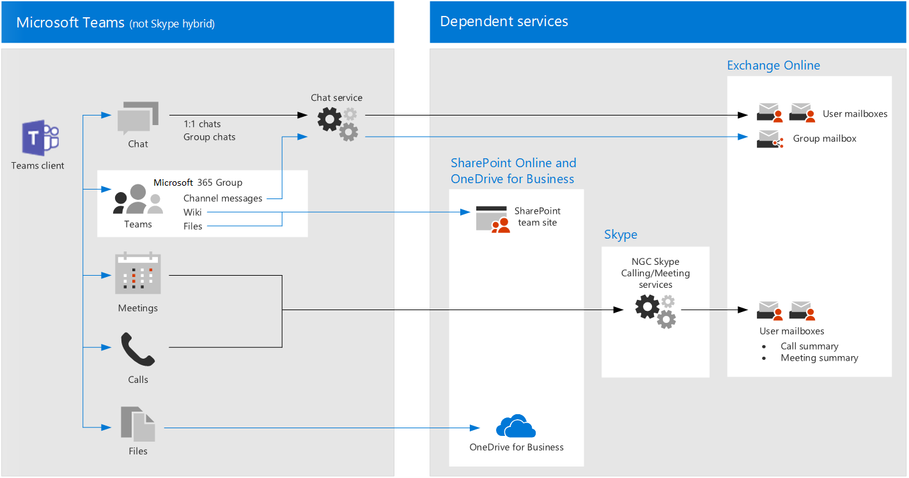

# Рекомендации политики по обеспечению безопасности для чатов, групп и файлов в TeamsPolicy recommendations for securing Teams chats, groups, and files

В этой статье описывается, как реализовать рекомендуемые политики удостоверений и доступа к устройствам для защиты чатов, групп и контента Teams, таких как файлы и календари.This article describes how to implement the recommended identity and device-access policies to protect Teams chats, groups, and content such as files and calendars. Это руководство строится на [общих политиках идентификации и доступа к устройствам](identity-access-policies.md)с дополнительными сведениями, характерными для Teams.This guidance builds on the [Common identity and device access policies](identity-access-policies.md), with additional information that's Teams-specific. Так как teams интегрируется с другими продуктами, также вы можете ознакомиться с [рекомендациями политики по защите сайтов и файлов SharePoint](sharepoint-file-access-policies.md) и [рекомендациями политики по защите электронной почты](secure-email-recommended-policies.md).Because Teams integrates with our other products, also see [Policy recommendations for securing SharePoint sites and files](sharepoint-file-access-policies.md) and [Policy recommendations for securing email](secure-email-recommended-policies.md).

Эти рекомендации основаны на трех различных уровнях безопасности и защиты для Teams, которые можно применять в зависимости от степени детализации ваших потребностей: базовый, чувствительный и строго регулируемый.These recommendations are based on three different tiers of security and protection for Teams that can be applied based on the granularity of your needs: baseline, sensitive, and highly regulated. Вы можете узнать больше об этих уровнях безопасности и рекомендуемых политиках, указанных в этих рекомендациях, в [конфигурациях удостоверений и доступа к устройствам](microsoft-365-policies-configurations.md).You can learn more about these security tiers and the recommended policies referenced by these recommendations in the [Identity and device access configurations](microsoft-365-policies-configurations.md).

В эту статью включены дополнительные рекомендации по развертыванию Teams, которые охватывают определенные обстоятельства проверки подлинности, в том числе для пользователей за пределами Организации.Additional recommendations specific to Teams deployment are included in this article to cover specific authentication circumstances, including for users outside your organization. Вам потребуется выполнить эти рекомендации по обеспечению безопасности.You will need to follow this guidance for a complete security experience.

## Начало работы с Teams перед другими зависимыми службамиGetting started with Teams before other dependent services

Чтобы начать работу с Microsoft Teams, вам не нужно включать зависимые службы.You don’t need to enable dependent services to get started with Microsoft Teams. Все они будут просто работать.These will all ‘just work.’ Тем не менее, необходимо подготовиться к управлению следующими параметрами:However, you do need to be prepared to manage the following:

- Группы Office 365Office 365 groups
- Сайты групп SharePointSharePoint team sites
- OneDrive для бизнесаOneDrive for Business
- Почтовые ящикиMailboxes
- Потоковые видео и планы планировщика (если эти службы включены)Stream videos and Planner plans (if these services are enabled)

## Обновление общих политик для включения TeamsUpdating common policies to include Teams

На следующей схеме показан набор рекомендуемых политик для защиты чата, групп и контента в Teams.The following diagram illustrates the set of recommended policies for protecting chat, groups and content in Teams. Значок карандаша указывает, какие политики необходимо повторно посетить, чтобы убедиться в том, что Teams и зависимые службы включены в назначение облачных приложений.The pencil icon indicates which policies need to be revisited to be sure that Teams and dependent services are included in the assignment of cloud apps.

Ниже приведены зависимые службы, которые необходимо включить в назначение облачных приложений для teams:These are the dependent services to include in the assignment of cloud apps for Teams:

- Microsoft TeamsMicrosoft Teams
- SharePoint Online и OneDrive для бизнесаSharePoint Online and OneDrive for Business
- Exchange OnlineExchange Online
- Skype для бизнеса OnlineSkype for Business Online
- Microsoft Stream (записи собраний)Microsoft Stream (meeting recordings)
- Планировщик Microsoft (задачи и планирование данных планировщика)Microsoft Planner (Planner tasks and plan data)

В этой таблице перечислены политики, которые необходимо повторно посетить, и ссылки на каждую политику в [общих политиках идентификации и доступа к устройствам](identity-access-policies.md), в которых для всех приложений Office используется более широкий набор правил.This table lists the policies that need to be revisited and links to each policy in [Common identity and device access policies](identity-access-policies.md), which has the wider rule-set for all Office applications.

|Уровень защитыProtection level|ПолитикиPolicies|Дополнительные сведения о реализации TeamsFurther information for Teams implementation|
|:---------------|:-------|:----------------|
|**Базовый****Baseline**|[Требовать, чтобы риск входа в систему был *средним* или *высоким*Require MFA when sign-in risk is *medium* or *high*](identity-access-policies.md#require-mfa-based-on-sign-in-risk)|Убедитесь, что в список приложений включены Teams и зависимые службы.Be sure Teams and dependent services are included in the list of apps. Кроме того, в Teams есть правила гостевого доступа и внешнего доступа, которые также будут рассмотрены далее в этой статье.Teams has Guest Access and External Access rules to consider as well, you'll learn more about these later in this article.|
|        |[Блокировать клиенты, не поддерживающие современную проверку подлинностиBlock clients that don't support modern authentication](identity-access-policies.md#block-clients-that-dont-support-modern-authentication)|Включение Teams и зависимых служб при назначении облачных приложений.Include Teams and dependent services in the assignment of cloud apps.|
|        |[Высокий риск пользователи должны изменить парольHigh risk users must change password](identity-access-policies.md#high-risk-users-must-change-password)|Заставляет пользователей Teams менять свой пароль при входе в учетную запись, если для их учетных записей обнаружено значительное опасное действие.Forces Teams users to change their password when signing in if high-risk activity is detected for their account. Убедитесь, что в список приложений включены Teams и зависимые службы.Be sure Teams and dependent services are included in the list of apps.|
|        |[Определение политик защиты приложенийDefine app protection policies](identity-access-policies.md#define-app-protection-policies)|Убедитесь, что в список приложений включены Teams и зависимые службы.Be sure Teams and dependent services are included in the list of apps. Обновите политику для каждой платформы (iOS, Android, Windows).Update the policy for each platform (iOS, Android, Windows).|
|        |[Требовать утвержденные приложенияRequire approved apps](identity-access-policies.md#require-approved-apps)|Включение Teams и зависимых служб в эту политику.Include Teams and dependent services in this policy.|
|        |[Определение политик соответствия требованиям устройствDefine device compliance policies](identity-access-policies.md#define-device-compliance-policies)|Включение Teams и зависимых служб в эту политику.Include Teams and dependent services in this policy.|
|        |[Требовать использования соответствующих политике компьютеровRequire compliant PCs](identity-access-policies.md#require-compliant-pcs-but-not-compliant-phones-and-tablets)|Включение Teams и зависимых служб в эту политику.Include Teams and dependent services in this policy.|
|**Конфиденциальный****Sensitive**|[Требовать, когда риск входа в систему *мал*, *средний* или *высокий*Require MFA when sign-in risk is *low*, *medium* or *high*](identity-access-policies.md#require-mfa-based-on-sign-in-risk)|Кроме того, в Teams есть правила гостевого доступа и внешнего доступа, которые также будут рассмотрены далее в этой статье.Teams has Guest Access and External Access rules to consider as well, you'll learn more about these later in this article. Включение Teams и зависимых служб в эту политику.Include Teams and dependent services in this policy.|
|         |[Требовать соответствующие компьютеры *и* мобильные устройстваRequire compliant PCs *and* mobile devices](identity-access-policies.md#require-compliant-pcs-and-mobile-devices)|Включение Teams и зависимых служб в эту политику.Include Teams and dependent services in this policy.|
|**Строго контролируемый****Highly regulated**|[*Всегда* требовать MFA*Always* require MFA](identity-access-policies.md#require-mfa-based-on-sign-in-risk)|Независимо от удостоверения пользователя, MFA будет использоваться вашей организацией.Regardless of user identity, MFA will be used by your organization. Включение Teams и зависимых служб в эту политику.Include Teams and dependent services in this policy.
| | |

## Архитектура зависимых служб TeamsTeams dependent services architecture

На приведенной ниже схеме показаны службы, на которые полагаются службы Teams.For reference, the following diagram illustrates the services Teams relies on. Для получения дополнительных сведений и дополнительных иллюстраций ознакомьтесь со статьей [Microsoft Teams и соответствующими службами производительности в microsoft 365 для ИТ архитекторов](https://docs.microsoft.com/office365/enterprise/microsoft-cloud-it-architecture-resources#microsoft-teams-and-related-productivity-services-in-microsoft-365-for-it-architects).For more information and additional illustrations, see [Microsoft Teams and related productivity services in Microsoft 365 for IT architects](https://docs.microsoft.com/office365/enterprise/microsoft-cloud-it-architecture-resources#microsoft-teams-and-related-productivity-services-in-microsoft-365-for-it-architects).

## Включение гостевого и внешнего доступа для TeamsEnabling guest and external access for Teams

В Azure AD гостевые и внешние пользователи одинаковы.In Azure AD, guest and external users are the same. Тип пользователя для обоих из них — гость.The user type for both of these is Guest. Гостевые пользователи — это пользователи B2B.Guest users are B2B users. Microsoft Teams различает гостевые пользователи и внешних пользователей в приложении.Microsoft Teams differentiates between guest users and external users in the app. Важно понимать, как каждый из них рассматривается в Teams, и пользователи с двумя типами пользователей — это пользователи в Azure AD, а рекомендуемые политики для пользователей B2B применяются к обоим продуктам.While it's important to understand how each of these are treated in Teams, both types of users are B2B users in Azure AD and the recommended policies for B2B users apply to both. Для рекомендуемых политик, позволяющих [Разрешить гостевой доступ, см.](identity-access-policies-guest-access.md)For recommended policies to allow guest access, see [Policies for allowing guest and external B2B access](identity-access-policies-guest-access.md).

### Гостевой доступ в TeamsGuest Access in Teams

В дополнение к политикам для пользователей, которые являются внутренними для организации или организации, администраторы могут включить гостевой доступ, чтобы разрешить доступ к ресурсам Teams для пользователей, которые являются внешними по отношению к вашей организации или организации, и взаимодействовать с внутренние люди для таких вещей, как беседы групп, чат и собрания.In addition to the policies for users who are internal to your business or organization, administrators may enable guest access to allow, on a user-by-user basis, people who are external to your business or organization to access Teams resources and interact with internal people for things like group conversations, chat, and meetings. Дополнительные сведения о гостевом доступе можно узнать по следующей ссылке: [гостевой доступ Teams](https://docs.microsoft.com/microsoftteams/guest-access)You can learn more about Guest Access at the following link: [Teams guest access](https://docs.microsoft.com/microsoftteams/guest-access)

### Внешний доступ в TeamsExternal Access in Teams

Внешний доступ иногда путают с гостевым доступом, поэтому важно ясно убедиться в том, что эти два невнутренних механизма доступа сильно отличаются.External access is sometimes confused with guest access, so it's important to be clear that these two non-internal access mechanisms are actually quite different. Хотя гостевой доступ выполняется отдельно для каждого пользователя (вы добавляете одного пользователя за раз), когда администратор включает внешний доступ, он позволяет одновременно добавить в Teams одновременно всех пользователей внешнего домена.While guest access occurs on a per-user basis (you add one user at a time), when an administrator enables external access it allows you to add all the users of an external domain at the same time to Teams. Тем не менее доступ и функциональные возможности для внешних пользователей имеют менее, чем у пользователя, добавленного через гостевой доступ.However those external users have less access and functionality than an individual who's been added via guest access would have. Пользователи внешнего доступа могут общаться с внутренними пользователями с помощью Teams.External access users can chat with your internal users via Teams.

Дополнительные сведения о внешнем доступе и его применении в случае необходимости просмотрите [Управление внешним доступом в Microsoft Teams](https://docs.microsoft.com/microsoftteams/manage-external-access) .For more reading about external access, and how to implement it if you need to, please review [Manage external access in Microsoft Teams](https://docs.microsoft.com/microsoftteams/manage-external-access)

## Политики TeamsTeams Policies

За пределами общих политик, перечисленных выше, существуют политики для определенных групп, которые можно настроить для управления различными функциональными возможностями Teams.Outside of the common policies listed above, there are Teams-specific policies that can and should be configured to manage various Teams functionalities.

### Политики Teams и channelsTeams and Channels Policies

Teams и channels — это два часто используемых элемента в Microsoft Teams, и существуют политики, которые можно использовать для управления тем, какие пользователи могут и не могут делать при использовании команд и каналов.Teams and channels are two commonly used elements in Microsoft Teams, and there are policies you can put in place to control what users can and cannot do when using teams and channels. Несмотря на то, что вы можете создать глобальную группу, если ваша организация имеет 5000 пользователей или меньше, вам, скорее всего, будет удобно иметь более мелкие команды и каналы для определенных целей, в рамках потребностей Организации.While you can create a global team, if your organization has 5000 users or less, you are likely to find it helpful to have smaller teams and channels for specific purposes, in-line with your organizational needs.

Рекомендуется изменить политику по умолчанию или создать настраиваемые политики, и вы можете узнать больше об управлении политиками на этой странице: [Управление политиками Teams в Microsoft Teams](https://docs.microsoft.com/microsoftteams/teams-policies).Changing the default policy or creating custom policies would be recommended, and you can learn more about managing your policies at this link: [Manage teams policies in Microsoft Teams](https://docs.microsoft.com/microsoftteams/teams-policies).

### Политики обмена сообщениямиMessaging Policies

Обмен сообщениями или чат может управляться через глобальную политику по умолчанию или с помощью настраиваемых политик, и это может помочь пользователям общаться друг с другом в соответствии с требованиями вашей организации.Messaging, or chat, can also be managed through the default global policy, or through custom policies, and this can help your users communicate with one another in a way that's appropriate for your organization. Эти сведения можно просмотреть на странице [Управление политиками обмена сообщениями в Teams](https://docs.microsoft.com/microsoftteams/messaging-policies-in-teams).This information can be reviewed at [Managing messaging policies in Teams](https://docs.microsoft.com/microsoftteams/messaging-policies-in-teams).

### Политики собранийMeeting Policies

Нет никакого обсуждения Teams без планирования и внедрения политик для собраний Teams.No discussion of Teams would be complete without planning and implementing policies around Teams meetings. Собрания — это важный компонент Teams, позволяющий пользователям формально присутствовать и присутствовать одновременно для нескольких пользователей, а также для общего доступа к содержимому, связанному с собранием.Meetings are an essential component of Teams, allowing people to formally meet and present to many users at once, as well as share content relevant to the meeting. Важно настроить подправную политику для Организации на собраниях.Setting the right policies for your organization around meetings is essential.

Для получения дополнительных сведений ознакомьтесь со разделом [Управление политиками собраний в Teams](https://docs.microsoft.com/microsoftteams/meeting-policies-in-teams) .Please review [Manage meeting policies in Teams](https://docs.microsoft.com/microsoftteams/meeting-policies-in-teams) for more information.

### Политики разрешений для приложенийApp Permission Policies

Кроме того, Teams позволяет использовать приложения в различных местах, например в каналах или личных беседах.Teams also allows you to use apps in various places, such as channels or personal chats. Политики, связанные с тем, какие приложения можно добавлять и использовать, а где — важно поддерживать надежную среду для работы с контентом.Having policies around what apps can be added and used, and where, is essential to maintaining a content-rich environment that is also secure.

Для получения дополнительных сведений о политиках разрешений для приложений ознакомьтесь с разделом [Управление политиками разрешений приложений в Microsoft Teams](https://docs.microsoft.com/microsoftteams/teams-app-permission-policies).For more reading about App Permission Policies, check out [Manage app permission policies in Microsoft Teams](https://docs.microsoft.com/microsoftteams/teams-app-permission-policies).

## Дальнейшие действияNext steps

[Сведения о включении условного доступа для Exchange OnlineLearn how to enable conditional access for Exchange Online](secure-email-recommended-policies.md)

