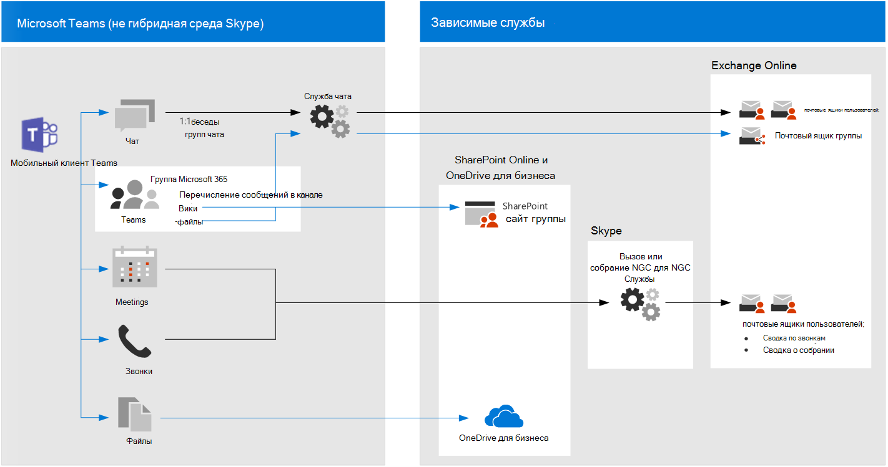

# Рекомендации политики по обеспечению безопасности для чатов, групп и файлов в Teams

В этой статье описывается, как реализовать рекомендуемые политики удостоверений и доступа к устройствам для защиты чатов, групп и контента Microsoft Teams, таких как файлы и календари. Это руководство строится на [общих политиках идентификации и доступа к устройствам](identity-access-policies.md)с дополнительными сведениями, характерными для Teams. Так как teams интегрируется с другими продуктами, также вы можете ознакомиться с [рекомендациями политики по защите сайтов и файлов SharePoint](sharepoint-file-access-policies.md) и [рекомендациями политики по защите электронной почты](secure-email-recommended-policies.md).

Эти рекомендации основаны на трех различных уровнях безопасности и защиты для Teams, которые можно применять в зависимости от степени детализации ваших потребностей: базовый, чувствительный и строго регулируемый. Вы можете узнать больше об этих уровнях безопасности и рекомендуемых политиках, указанных в этих рекомендациях, в [конфигурациях удостоверений и доступа к устройствам](microsoft-365-policies-configurations.md).

В эту статью включены дополнительные рекомендации по развертыванию Teams, которые охватывают определенные обстоятельства проверки подлинности, в том числе для пользователей за пределами Организации. Вам потребуется выполнить эти рекомендации по обеспечению безопасности.

## Начало работы с Teams перед другими зависимыми службами

Чтобы начать работу с Microsoft Teams, вам не нужно включать зависимые службы. Все они будут просто работать. Тем не менее, необходимо подготовиться к управлению следующими параметрами:

- Группы Microsoft 365
- Сайты групп SharePoint
- OneDrive для бизнеса
- Почтовые ящики Exchange
- Потоковые видео и планы планировщика (если эти службы включены)

## Обновление общих политик для включения Teams

Чтобы защитить чат, группы и контент в Teams, на следующей схеме показано, какие политики необходимо обновить на основе общих политик идентификации и доступа к устройствам. Для обновления каждой политики убедитесь, что Teams и зависимые службы включены в назначение облачных приложений.

[Просмотреть увеличенную версию этого изображения](https://github.com/MicrosoftDocs/microsoft-365-docs/raw/public/microsoft-365/media/microsoft-365-policies-configurations/identity-access-ruleset-teams.png)

Ниже приведены зависимые службы, которые необходимо включить в назначение облачных приложений для teams:

- Microsoft Teams
- SharePoint и OneDrive для бизнеса
- Exchange Online
- Skype для бизнеса Online
- Microsoft Stream (записи собраний)
- Планировщик Microsoft (задачи и планирование данных планировщика)

В этой таблице перечислены политики, которые необходимо повторно посетить, и ссылки на каждую политику в общих политиках [идентификации и доступа к устройствам](identity-access-policies.md), где для всех приложений Office используется более широкий набор политик.

|Уровень защиты|Политики|Дополнительные сведения о реализации Teams|
|:---------------|:-------|:----------------|
|**Базовый уровень**|[Требовать, чтобы риск входа в систему был *средним* или *высоким*](identity-access-policies.md#require-mfa-based-on-sign-in-risk)|Убедитесь, что в список приложений включены Teams и зависимые службы. Кроме того, в Teams есть правила гостевого доступа и внешнего доступа, которые также будут рассмотрены далее в этой статье.|
|        |[Блокирование клиентов, не поддерживающих современную проверку подлинности](identity-access-policies.md#block-clients-that-dont-support-modern-authentication)|Включение Teams и зависимых служб при назначении облачных приложений.|
|        |[Необходимость смены пароля для пользователей с высоким риском](identity-access-policies.md#high-risk-users-must-change-password)|Заставляет пользователей Teams менять свой пароль при входе в учетную запись, если для их учетных записей обнаружено значительное опасное действие. Убедитесь, что в список приложений включены Teams и зависимые службы.|
|        |[Применение политик защиты данных приложений](identity-access-policies.md#apply-app-data-protection-policies)|Убедитесь, что в список приложений включены Teams и зависимые службы. Обновите политику для каждой платформы (iOS, Android, Windows).|
|        |[Требовать утвержденные приложения и защиту приложений](identity-access-policies.md#require-approved-apps-and-app-protection)|Включение Teams и зависимых служб в эту политику.|
|        |[Определение политик соответствия требованиям устройств](identity-access-policies.md#define-device-compliance-policies)|Включение Teams и зависимых служб в эту политику.|
|        |[Требовать использования соответствующих политике компьютеров](identity-access-policies.md#require-compliant-pcs-but-not-compliant-phones-and-tablets)|Включение Teams и зависимых служб в эту политику.|
|**Конфиденциально**|[Требовать, когда риск входа в систему *мал*, *средний* или *высокий*](identity-access-policies.md#require-mfa-based-on-sign-in-risk)|Кроме того, в Teams есть правила гостевого доступа и внешнего доступа, которые также будут рассмотрены далее в этой статье. Включение Teams и зависимых служб в эту политику.|
|         |[Требовать соответствующие компьютеры *и* мобильные устройства](identity-access-policies.md#require-compliant-pcs-and-mobile-devices)|Включение Teams и зависимых служб в эту политику.|
|**Строго контролируемый**|[*Всегда* требовать MFA](identity-access-policies.md#require-mfa-based-on-sign-in-risk)|Независимо от удостоверения пользователя, MFA будет использоваться вашей организацией. Включение Teams и зависимых служб в эту политику.
| | |

## Архитектура зависимых служб Teams

На приведенной ниже схеме показаны службы, на которые полагаются службы Teams. Для получения дополнительных сведений и дополнительных иллюстраций ознакомьтесь со статьей [Microsoft Teams и соответствующими службами производительности в microsoft 365 для ИТ архитекторов](../solutions/productivity-illustrations.md).

## Включение гостевого и внешнего доступа для Teams

В Azure AD гостевые и внешние пользователи одинаковы. Тип пользователя для обоих из них — гость. Гостевые пользователи — это пользователи B2B. Microsoft Teams различает гостевые пользователи и внешних пользователей в приложении. Важно понимать, как каждый из них рассматривается в Teams, и пользователи с двумя типами пользователей — это пользователи в Azure AD, а рекомендуемые политики для пользователей B2B применяются к обоим продуктам. Для рекомендуемых политик, позволяющих [Разрешить гостевой доступ, см.](identity-access-policies-guest-access.md)

### Гостевой доступ в Teams

В дополнение к политикам для пользователей, которые являются внутренними для организации или организации, администраторы могут разрешить гостевому абоненту разрешить пользователям, которые являются внешними по отношению к Организации или организации, получать доступ к ресурсам Teams и взаимодействовать с внутренними пользователями для таких вещей, как беседы в группах, чат и собрания. Дополнительные сведения о гостевом доступе можно узнать по следующей ссылке: [гостевой доступ Teams](https://docs.microsoft.com/microsoftteams/guest-access)

### Внешний доступ в Teams

Внешний доступ иногда путают с гостевым доступом, поэтому важно ясно убедиться в том, что эти два невнутренних механизма доступа сильно отличаются. Хотя гостевой доступ выполняется отдельно для каждого пользователя (вы добавляете одного пользователя за раз), когда администратор включает внешний доступ, он позволяет одновременно добавить в Teams одновременно всех пользователей внешнего домена. Тем не менее доступ и функциональные возможности для внешних пользователей имеют менее, чем у пользователя, добавленного через гостевой доступ. Пользователи внешнего доступа могут общаться с внутренними пользователями с помощью Teams.

Дополнительные сведения о внешнем доступе и его применении в случае необходимости просмотрите [Управление внешним доступом в Microsoft Teams](https://docs.microsoft.com/microsoftteams/manage-external-access) .

## Политики Teams

За пределами общих политик, перечисленных выше, существуют политики для определенных групп, которые можно настроить для управления различными функциональными возможностями Teams.

### Политики Teams и channels

Teams и channels — это два часто используемых элемента в Microsoft Teams, и существуют политики, которые можно использовать для управления тем, какие пользователи могут и не могут делать при использовании команд и каналов. Несмотря на то, что вы можете создать глобальную группу, если ваша организация имеет 5000 пользователей или меньше, вам, скорее всего, будет удобно иметь более мелкие команды и каналы для определенных целей, в рамках потребностей Организации.

Рекомендуется изменить политику по умолчанию или создать настраиваемые политики, и вы можете узнать больше об управлении политиками на этой странице: [Управление политиками Teams в Microsoft Teams](https://docs.microsoft.com/microsoftteams/teams-policies).

### Политики обмена сообщениями

Обмен сообщениями или чат может управляться через глобальную политику по умолчанию или с помощью настраиваемых политик, и это может помочь пользователям общаться друг с другом в соответствии с требованиями вашей организации. Эти сведения можно просмотреть на странице [Управление политиками обмена сообщениями в Teams](https://docs.microsoft.com/microsoftteams/messaging-policies-in-teams).

### Политики собраний

Нет никакого обсуждения Teams без планирования и внедрения политик для собраний Teams. Собрания — это важный компонент Teams, позволяющий пользователям формально присутствовать и присутствовать одновременно для нескольких пользователей, а также для общего доступа к содержимому, связанному с собранием. Важно настроить подправную политику для Организации на собраниях.

Для получения дополнительных сведений ознакомьтесь со разделом [Управление политиками собраний в Teams](https://docs.microsoft.com/microsoftteams/meeting-policies-in-teams) .

### Политики разрешений для приложений

Кроме того, Teams позволяет использовать приложения в различных местах, например в каналах или личных беседах. Политики, связанные с тем, какие приложения можно добавлять и использовать, а где — важно поддерживать надежную среду для работы с контентом.

Для получения дополнительных сведений о политиках разрешений для приложений ознакомьтесь с разделом [Управление политиками разрешений приложений в Microsoft Teams](https://docs.microsoft.com/microsoftteams/teams-app-permission-policies).

## Дальнейшие действия

Настройка политик условного доступа для:

- [Exchange Online](secure-email-recommended-policies.md)
- [SharePoint](secure-email-recommended-policies.md)

