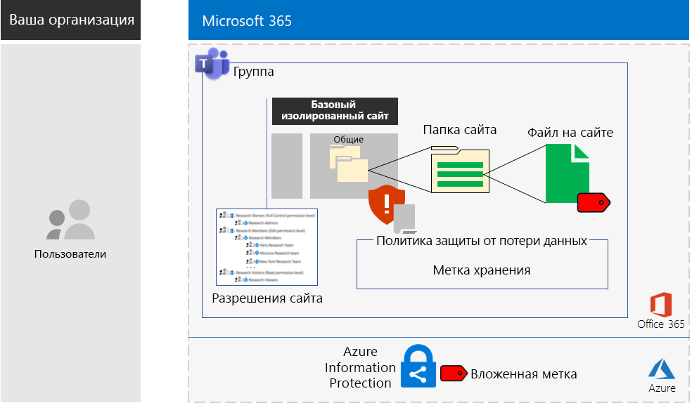

# Сайты Microsoft Teams и SharePoint Online для жестко регламентированных данныхMicrosoft Teams and SharePoint Online sites for highly regulated data

*Этот сценарий применяется к планам E3 и E5 Microsoft 365 корпоративный.**This scenario applies to both the E3 and E5 versions of Microsoft 365 Enterprise*

Решение Microsoft 365 корпоративный содержит полный набор облачных служб, предназначенных для создания, хранения и защиты жестко регламентированных данных. К их числу относятся:Microsoft 365 Enterprise includes a full suite of cloud-based services so that you can create, store, and secure your highly regulated data. This includes data that is:

- данные, на которые распространяется действие региональных нормативных актов;Subject to regional regulations.
- наиболее важные для предприятия данные, например коммерческие тайны, информация о финансовой деятельности или данные о персонале и стратегии организации.The most valuable data for your organization, such as trade secrets, financial or human resources information, and organization strategy.

Облачный сценарий Microsoft 365 корпоративный, который соответствует такой бизнес-потребности предприятия, потребует от вас:A Microsoft 365 Enterprise cloud-based solution that meets this business need requires that you:

- хранения цифровых активов (документы, наборы слайдов, электронные таблицы, т. д.) на сайте группы SharePoint Online или во вкладке **Файлы** группы Microsoft Teams;Store digital assets (documents, slide decks, spreadsheets, etc.) in a SharePoint Online team site or in the **Files** tab of a Microsoft Teams team.
- блокировки сайта или группы, чтобы предотвратить:Lock down the site or team to prevent:
   - доступ только для конкретного набора учетных записей пользователей, определенного участием в группе; сюда входят пользователи, имеющие доступ к сайту группы SharePoint Online (с указанием уровня разрешения), и администраторы сайта;Access to only a specific set of user accounts through group membership, which includes those who can access the SharePoint Online team site and at what level of permission, and those who can administer it.
   - предоставление участниками сайта доступа третьим лицам;Members of the site from granting access to others.
   - запросы на доступ к сайту от лиц, которые не являются участниками сайта;Non-members of the site from requesting access to the site.
- настройки метки хранения Office 365 для сайтов или групп SharePoint Online в качестве стандартного способа определения политик хранения для документов на сайте или в группе;Configure an Office 365 retention label for your SharePoint Online sites or teams as a default way to define retention policies on the documents in the site or team.
- запрета на отправку пользователями файлов за пределы организации;Block users from sending files outside the organization.
- шифрования наиболее конфиденциальных цифровых активов сайта или группы;Encrypt the most sensitive digital assets of the site or team.
- добавления разрешений к наиболее конфиденциальным активам. В этом случае, даже если такие активы окажутся за пределами сайта, чтобы их открыть потребуются действительные учетные данные пользователя учетной записи, который имеет соответствующее разрешение.Add permissions to the most sensitive digital assets so that if even if they get shared outside of the site, opening the asset still requires the valid credentials of a user account that has permission.

В приведенной ниже таблице сопоставляются требования этого сценария и функции Microsoft 365 корпоративный.The following table maps the requirements of this solution to a feature of Microsoft 365 Enterprise.

|||
|:-------|:-----|
| **Требования****Requirement** | **Функция Microsoft 365 корпоративный****Microsoft 365 Enterprise feature** |
| Хранение цифровых активовStore digital assets | Сайты групп и группы SharePoint Online в Office 365SharePoint Online team sites and teams in Office 365 |
| Блокировка сайтаLock down the site | Разрешения для групп Azure AD и сайта группы SharePoint OnlineAzure AD groups and SharePoint Online team site permissions |
| Добавление метки к цифровым активам сайтаLabel the digital assets of the site | Метки хранения Office 365Office 365 retention labels |
| Блокирование пользователей при отправке файлов за пределы организацииBlock users when sending files outside the organization | Политики защиты от потери данных в Office 365Data Loss Prevention (DLP) policies in Office 365 |
| Шифрование всех цифровых активов сайтаEncrypt all of the digital assets of the site | Вложенные метки Azure Information Protection в Enterprise Mobility + Security (EMS)Azure Information Protection sub-labels in Enterprise Mobility + Security (EMS) |
| Добавление разрешений ко всем цифровым активам сайтаAdd permissions to the digital assets of the site | Вложенные метки Azure Information Protection в EMSAzure Information Protection sub-labels in EMS |
|||

Конфигурация для сайта SharePoint Online.Here is the configuration for a SharePoint Online site.

Этот сценарий требует, чтобы у вас уже были развернуты:This solution requires that you have already deployed:

- этап [удостоверений](identity-infrastructure.md) и шаги 1 и 2 этапа [защиты информации](infoprotect-infrastructure.md) для базовой инфраструктуры;The [Identity](identity-infrastructure.md) phase and steps 1 and 2 of the [Information protection](infoprotect-infrastructure.md) phase of the foundation infrastructure. 
- [SharePoint Online](sharepoint-online-onedrive-workload.md) (для жестко регламентированных данных на сайтах группы SharePoint Online);For highly regulated data in SharePoint Online team sites, [SharePoint Online](sharepoint-online-onedrive-workload.md).
- [Microsoft Teams](teams-workload.md) (для жестко регламентированных данных в группах Microsoft Teams).For highly regulated data in Microsoft Teams teams, [Microsoft Teams](teams-workload.md).

Описанные ниже поэтапные шаги помогут выполнить проектирование, настройку и внедрение сайтов и групп SharePoint Online для жестко регламентированных данных.The following phases step you through the design, configuration, and driving adoption for SharePoint Online sites and teams for highly regulated data.

Чтобы узнать, как вымышленная корпорация Contoso, которая представляет типичные международные компании, разработала сайт SharePoint Online для исследовательских групп, см. [пример конфигурации](contoso-sharepoint-online-site-for-highly-confidential-assets.md).To see how the Contoso Corporation, a fictional but representative multi-national organization, designed a SharePoint Online site for its research teams, see this [example configuration](contoso-sharepoint-online-site-for-highly-confidential-assets.md).

Группа для жестко регламентированных данных требует предварительного создания сайта группы SharePoint Online для жестко регламентированных данных и группы Office 365. Чтобы узнать больше, см. этап 2, шаг 4.A team for highly regulated data requires that you first create a SharePoint Online team site for highly regulated data. You then create a new team that uses the Office 365 group of the SharePoint Online team site. See Phase 2, Step 4 for more information.

Конфигурация для команды.Here is the configuration for a team.

## Необходимые компоненты для идентификации и доступа к устройствуIdentity and device access prerequisites

Чтобы защитить доступ к группе или сайту SharePoint Online, убедитесь, что вы настроили [политики идентификации и доступа к устройству](identity-access-policies.md), а также [рекомендуемые политики доступа к SharePoint Online](sharepoint-file-access-policies.md).To protect access to the team or SharePoint Online site, ensure that you have configured [identity and device access policies](identity-access-policies.md) and the [recommended SharePoint Online access policies](sharepoint-file-access-policies.md).

## Этап 1. ПроектированиеPhase 1: Design

Чтобы создать сайт или группу SharePoint Online для жестко регламентированных данных, сначала необходимо определить ее назначение. Например, отделу исследований и разработок какой-либо производственной организации требуется сайт SharePoint Online для хранения текущих проектных спецификаций на существующие продукты, а также место для совместной работы над новыми продуктами. Доступ к такому сайту должен быть разрешен только для сотрудников отдела исследований и разработок, а также для некоторых руководителей организации.To create a SharePoint Online site or team for highly regulated data, you must first identify its purpose. For example, the research and development department of a manufacturing organization needs a SharePoint Online site to store current design specifications for existing products and a place to collaborate on new products. Only members of the Research & Development department and selected executives will be allowed to access the site.

Такое назначение сайта потребует определения основных элементов конфигурации, таких как:That purpose will drive the determination of essential configuration items such as:

- настройка наборов разрешений SharePoint Online и групп SharePoint;The set of SharePoint Online permission sets and SharePoint groups
- настройка групп доступа, групп безопасности Azure AD и их участников для добавления их в группы SharePoint;The set of access groups, the Azure AD security groups and their members to add to the SharePoint groups
- метка хранения Office 365 для назначения сайту и определение для нее набора политик защиты от потери данных;The Office 365 retention label to assign to the site and the set of DLP policies for the label
- параметры вложенной метки Azure Information Protection, которую пользователи применяют в отношении наиболее конфиденциальных цифровых активов, хранящихся на сайте.The settings of an Azure Information Protection sub-label that users apply to highly sensitive digital assets stored in the site

Как только эти параметры будут определены, вы сможете использовать их для настройки сайта на этапе 2.Once determined, you use these settings to configure the site in Phase 2. 

### Шаг 1. Изолированный сайт SharePoint OnlineStep 1: An isolated SharePoint Online site

Изолированным сайтом называется заблокированная версия сайта группы SharePoint Online. В отличие от параметров сайтов частных групп, устанавливаемых по умолчанию, настройка изолированных сайтов выполняется с целью предотвращения:The locked-down version of a SharePoint Online team site is known as an isolated site. Unlike the default settings of private team sites, isolated sites are configured to prevent:

- доступа лиц, которые не являются участниками указанных групп;Access to those who are not members of specified groups.
- запроса на доступ;The requesting of access.
- несанкционированного предоставления разрешения на доступ текущими участниками указанных групп;The unauthorized granting of access by current members of specified groups.
- администрирования сайта путем получения доступа участниками группы.Administration of the site by access group members.

Надежность и безопасность сайтов групп SharePoint Online, которые содержат строго регулируемые активы, остается неизменной, кроме тех случаев, когда внесение изменений выполняется администратором сайта SharePoint.The security of SharePoint Online team sites that contain highly regulated assets do not change unless done by a SharePoint administrator for the site.

Чтобы определить наборы уровней разрешений, групп SharePoint, групп доступа и групп участников, см. дополнительные сведения в статье [Разработка изолированного сайта группы SharePoint Online](https://docs.microsoft.com/office365/enterprise/design-an-isolated-sharepoint-online-team-site).See [Design an isolated SharePoint Online team site](https://docs.microsoft.com/office365/enterprise/design-an-isolated-sharepoint-online-team-site) for the details to determine the set of permission levels, SharePoint groups, access groups, and group members.

### Шаг 2. Метки хранения Office 365 и политики защиты от потери данныхStep 2: Office 365 retention labels and DLP policies

Применяя к сайту группы SharePoint Online метки хранения Office 365, укажите заданный по умолчанию метод классификации всех цифровых активов, хранящихся на этом сайте.When applied to a SharePoint Online team site, Office 365 retention labels provide a default method of classifying all digital assets stored on the site.
 
В отношении сайтов SharePoint Online для жестко регламентированных данных необходимо определить, какую метку хранения Office 365 следует использовать.For SharePoint Online sites for highly regulated data, you need to determine which Office 365 retention label to use.

Вопросы проектирования меток Office 365 рассмотрены в статье [Классификация и метки Office 365](https://docs.microsoft.com/office365/securitycompliance/secure-sharepoint-online-sites-and-files#office-365-retention-labels).For the design considerations of Office 365 labels, see [Office 365 classification and labels](https://docs.microsoft.com/office365/securitycompliance/secure-sharepoint-online-sites-and-files#office-365-retention-labels).

Для защиты конфиденциальной информации и предотвращения ее случайного или преднамеренного разглашения используются политики защиты от потери данных. Дополнительные сведения о них см. в этом [обзоре](https://docs.microsoft.com/office365/securitycompliance/data-loss-prevention-policies).To protect sensitive information and prevent its accidental or intentional disclosure, you use DLP policies. For more information, see this [overview](https://docs.microsoft.com/office365/securitycompliance/data-loss-prevention-policies).

В отношении сайтов SharePoint Online для жестко регламентированных данных необходимо настроить политики защиты от потери данных для метки хранения Office 365, назначенной такому сайту. Это позволит блокировать пользователей, если они пытаются предоставить доступ к цифровым активам внешним пользователям.For SharePoint Online sites for highly regulated data, you must configure a DLP policy for the Office 365 retention label assigned to the site to block users when they attempt to share digital assets with external users. 

### Шаг 3. Вложенная метка Azure Information ProtectionStep 3: Your Azure Information Protection sub-label

Чтобы обеспечить шифрование и установить набор разрешений для наиболее конфиденциальных цифровых активов, пользователи должны применить метку Azure Information Protection с помощью одноименного клиента. Чтобы применить метки Azure Information Protection в отношении сайтов SharePoint Online для жестко регламентированных данных, необходимо настроить вложенную метку Azure Information Protection в политике области.To provide encryption and a set of permissions to your most sensitive digital assets, users must apply an Azure Information Protection label using the Azure Information Protection client. To use Azure Information Protection labels for SharePoint Online sites for highly regulated data, you must configure an Azure Information Protection sub-label in a scoped policy. 

Вложенная метка располагается под уже существующей. Например, можно создать вложенную метку отдела исследований и разработок под меткой "Строго конфиденциально". К подмножеству пользователей применяется только политика области. Для сайтов SharePoint Online для жестко регламентированных данных область представляет собой набор пользователей, являющихся участниками групп доступа к данному сайту.A sub-label exists under an existing label. For example, you can create a Research & Development sub-label under the Highly Confidential label. A scoped policy is one that applies only to a subset of users. For SharePoint Online sites for highly regulated data, the scope is the set of users that are members of the access groups for the site.

Параметры применяемой вложенной метки перемещаются вместе с активом. Даже если актив загружается и отправляется за пределы сайта, получить разрешение на его открытие могут только учетные записи пользователей, прошедшие проверку подлинности.The settings of the applied sub-label travel with the asset. Even if it is downloaded and shared outside the site, only authenticated user accounts that have permissions can open it.

### Результаты проектированияDesign results

Вы уже определили:You have determined the following:

- Набор групп SharePoint и уровни разрешенийThe set of SharePoint groups and permission levels
- Набор групп доступа и их участников для каждого уровня разрешенийThe set of access groups and their members for each permission level
- Соответствующую метку хранения Office 365 и политику защиты от потери данных, связанную с этой меткойThe appropriate Office 365 retention label and the DLP policy that is associated with the label
- Параметры вложенной метки Azure Information Protection, куда входят шифрование и разрешенияThe settings of the Azure Information Protection sub-label that include encryption and permissions

## Этап 2. НастройкаPhase 2: Configure

На этом этапе параметры, определенные на этапе 1, реализуются с целью создания сайта SharePoint Online для жестко регламентированных данных.In this phase, you take the settings determined in Phase 1 and implement them to create a SharePoint Online site for highly regulated data.

### Шаг 1. Создание и настройка изолированного сайта группы SharePoint OnlineStep 1: Create and configure an isolated SharePoint Online team site

Используйте инструкции, изложенные в статье [Развертывание изолированного сайта группы SharePoint Online](https://docs.microsoft.com/office365/enterprise/deploy-an-isolated-sharepoint-online-team-site), для:Use the instructions in [Deploy an isolated SharePoint Online team site](https://docs.microsoft.com/office365/enterprise/deploy-an-isolated-sharepoint-online-team-site) to:

- создания и заполнения групп доступа для каждого уровня разрешений SharePoint, используемого на этом сайте;Create and populate the access groups for each SharePoint permission level used on the site.
- создания и настройки изолированного сайта группы.Create and configure the isolated team site.

### Шаг 2. Настройка сайта для соблюдения политики защиты от потери данных метки хранения Office 365Step 2: Configure the site for an Office 365 retention label DLP policy

Используйте инструкции, изложенные в статье [Защита файлов SharePoint Online с помощью меток Office 365 и DLP](https://docs.microsoft.com/office365/enterprise/protect-sharepoint-online-files-with-office-365-labels-and-dlp), для:Use the instructions in [Protect SharePoint Online files with Office 365 labels and DLP](https://docs.microsoft.com/office365/enterprise/protect-sharepoint-online-files-with-office-365-labels-and-dlp) to:

- определения или создания метки хранения Office 365 и ее применения к изолированному сайту SharePoint Online;Identify or create the Office 365 retention label and apply it to your isolated SharePoint Online site.
- создания и настройки политики защиты от потери данных, которая блокирует пользователей, если они пытаются отправить цифровой актив с вашего сайта SharePoint Online за пределы организации.Create and configure the DLP policy that blocks users when they attempt to share a digital asset on your SharePoint Online site outside the organization.

### Шаг 3. Создание вложенной метки Azure Information Protection для сайтаStep 3: Create an Azure Information Protection sub-label for the site

Используйте инструкции, изложенные в статье [Защита файлов SharePoint Online с помощью Azure Information Protection](https://docs.microsoft.com/office365/enterprise/protect-sharepoint-online-files-with-azure-information-protection), для:Use the instructions in [Protect SharePoint Online files with Azure Information Protection](https://docs.microsoft.com/office365/enterprise/protect-sharepoint-online-files-with-azure-information-protection) to: 

- создания и настройки вложенной метки Azure Information Protection в политике области;Create and configure an Azure Information Protection sub-label in a scoped policy.
- развертывания на компьютерах пользователя клиента Azure Information Protection.Deploy the Azure Information Protection client to user computers.

### Шаг 4 (необязательный). Создание группы для жестко регламентированных данныхStep 4 (optional): Create a team for the highly regulated data

Если вы хотите создать группу для жестко регламентированных данных, сначала создайте сайт SharePoint Online для жестко регламентированных данных. В процессе создания исходного сайта частной группы SharePoint Online, укажите имя группы Office 365.If you want a team for highly regulated data, you first create a SharePoint Online site for highly regulated data. When you create the initial private SharePoint Online team site, you specify an Office 365 group name.

По завершении полной настройки сайта SharePoint Online для жестко регламентированных данных следуйте инструкции ниже, чтобы преобразовать его в группу для жестко регламентированных данных.After the SharePoint Online site for highly regulated data is fully configured, use these steps to convert it into a team for highly regulated data:

1. Войдите в Office 365.Sign in to Office 365.
2. На вкладке **Microsoft Office** щелкните **Группы**.From the **Microsoft Office Home** tab, click **Teams**.
3. На вкладке **Microsoft Teams** в области **Присоединиться к или создать группу** щелкните **Создать группу**.From the **Microsoft Teams** tab, in the **Join or create a team** pane, click **Create team**.
4. В области **Создать свою группу** щелкните **Создать группу из существующей группы Office 365**.In the **Create your team** pane, click **Create a team from an existing Office 365 group**.
5. В списке групп Office 365 выберите название группы Office 365, которое соответствует сайту SharePoint Online для жестко регламентированных данных, а затем щелкните **Выбрать группу**.In the list of Office 365 groups, select the name of the Office 365 group corresponding to the SharePoint Online site for highly regulated data, and then click **Choose team**.

Вкладка **Файлы** списков новых групп содержит папку **Общие** в области **Документы** соответствующего сайта SharePoint Online. Чтобы просмотреть остальные ресурсы сайта SharePoint Online для данной группы, щелкните многоточие, а затем выберите **Открыть в SharePoint**.The **Files** tab of the new team lists the contents of the **General** folder of the **Documents** area of the corresponding SharePoint Online site. To see the rest of the resources of the SharePoint Online site for the team, click the ellipsis, and then click **Open in SharePoint**.

### Результаты настройкиConfiguration results

Вы настроили:You have configured the following:

- изолированный сайт SharePoint Online;A SharePoint Online isolated site
- метку хранения Office 365, назначенную изолированному сайту SharePoint Online;An Office 365 retention label assigned to the SharePoint Online isolated site
- политику защиты от потери данных для метки хранения Office 365;A DLP policy for the Office 365 retention label
- вложенную метку Azure Information Protection для политики области, которую пользователи могут применить к наиболее конфиденциальным цифровым активам, хранящимся на сайте и которая выполняет шифрование актива, а также принудительно применяет разрешения;An Azure Information Protection sub-label of a scoped policy that users can apply to the most sensitive digital assets stored in the site that encrypts the asset and enforces permissions
- группу для жестко регламентированных данных на базе сайта SharePoint Online (при необходимости).If needed, a team for highly regulated data based on the SharePoint Online site

## Этап 3. Внедрение среди пользователейPhase 3: Drive user adoption

Сайт или группа SharePoint Online для жестко регламентированных данных может защитить такие данные, только если регулярно используется для хранения конфиденциальных цифровых активов и доступа к ним. Этот этап является наиболее сложным, так как его реализация зависит от пользователей, которым придется отказаться от привычных способов хранения информации.A SharePoint Online site or team for highly regulated data can only protect that data if it is consistently used for storage and access of sensitive digital assets. This is the hardest phase because it relies on users changing their ways. 

Например, руководители организации, которые ранее хранили конфиденциальные файлы на USB-накопителях или в персональных облачных хранилищах, теперь будут вынуждены хранить их только на сайте или в группе SharePoint Online для жестко регламентированных данных.For example, executives that are used to storing sensitive files on USB drives or on personal cloud-based storage solutions will now have to store them exclusively in a SharePoint Online site or team for highly regulated data.

### Шаг 1. Обучение пользователейStep 1: Train your users

После завершения настройки обучите пользователей, входящих в группы доступа к сайту, рассказав им:After completing your configuration, train the set of users who are members of the site access groups:

- насколько важно использовать новый сайт или группу для защиты ценных активов, а также о последствиях утечки жестко регламентированных данных, таких как юридические последствия, штрафные санкции за несоблюдение нормативно-правовых актов, появление программ-шантажистов или потеря конкурентного преимущества;On the importance of using the new site or team to protect valuable assets and the consequences of a highly regulated data leak, such as legal ramifications, regulatory fines, ransomware, or loss of competitive advantage.
- как получить доступ к сайту и его активам;How to access the site and its assets.
- как создавать файлы на сайте и отправлять новые файлы, которые хранятся локально;How to create new files on the site and upload new files stored locally.
- каким образом политика защиты от потери данных блокирует пользователей при попытке отправить файлы за пределы организации;How the DLP policy blocks them from sharing files externally.
- как использовать клиент Azure Information Protection чтобы с помощью настроенной вложенной метки присвоить метку наиболее конфиденциальным цифровым активам;How to use the Azure Information Protection client to label the most sensitive digital assets with the configured sub-label.
- как вложенная метка Azure Information Protection защищает актив даже в случае его утечки за пределы сайта или группы.How the Azure Information Protection sub-label protects an asset even when it is leaked off the site or team.

В программу такого обучения следует включить практические занятия, где пользователи смогут опробовать эти операции и ознакомиться с результатами.This training should include hands-on exercises so that the users can experience these operations and their results.

### Шаг 2. Проведение периодических проверок использования и файловStep 2: Conduct periodic reviews of usage and files

Через несколько недель после обучения администратор SharePoint может выполнить следующие действия в отношении сайта или группы SharePoint Online:In the weeks after training, the SharePoint administrator for the SharePoint Online site or team can:

- проанализировать использование сайта или группы и сравнить результаты с требованиями к использованию;Analyze usage for the site or team and compare it with usage expectations.
- убедиться, что наиболее конфиденциальным файлы были надлежащим образом помечены с помощью вложенной метки Azure Information Protection.Verify that highly sensitive files have been properly labeled with the Azure Information Protection sub-label.

При необходимости следует провести повторное обучение пользователей.Retrain your users as needed.

### Результаты адаптации пользователей к новым требованиямUser adoption results

Конфиденциальные цифровые активы хранятся только на сайтах или в группах SharePoint Online для жестко регламентированных данных. Пользователи выполнили настройку наиболее конфиденциальных активов с помощью вложенной метки Azure Information Protection.Sensitive digital assets are stored exclusively on SharePoint Online sites or teams for highly regulated data and that the most sensitive assets have the configured Azure Information Protection sub-label applied.

## Как корпорация Contoso выполнила развертывание Microsoft 365 корпоративныйHow the Contoso Corporation deployed Microsoft 365 Enterprise

Корпорация Contoso — вымышленная показательная транснациональная промышленная компания-конгломерат с главным офисом в Париже.The Contoso Corporation is a fictional but representative global manufacturing conglomerate with its headquarters in Paris, France. Посмотрите, как корпорация Contoso разработала, настроила и внедрила [надежный сайт SharePoint Online](contoso-sharepoint-online-site-for-highly-confidential-assets.md) для исследовательских команд в Париже, Москве, Нью-Йорке, Пекине и Бангалоре.See how Contoso designed, configured, and then drove the adoption of a [secure SharePoint Online site](contoso-sharepoint-online-site-for-highly-confidential-assets.md) for their research teams in Paris, Moscow, New York, Beijing, and Bangalore. 

## См. такжеSee also

[Руководство по развертываниюDeployment guide](deploy-microsoft-365-enterprise.md)

[Руководства по лаборатории тестированияTest lab guides](m365-enterprise-test-lab-guides.md)

[Защита сайтов SharePoint Online в среде разработки и тестированияSecure SharePoint Online sites in a dev/test environment](https://docs.microsoft.com/office365/enterprise/secure-sharepoint-online-sites-in-a-dev-test-environment)
