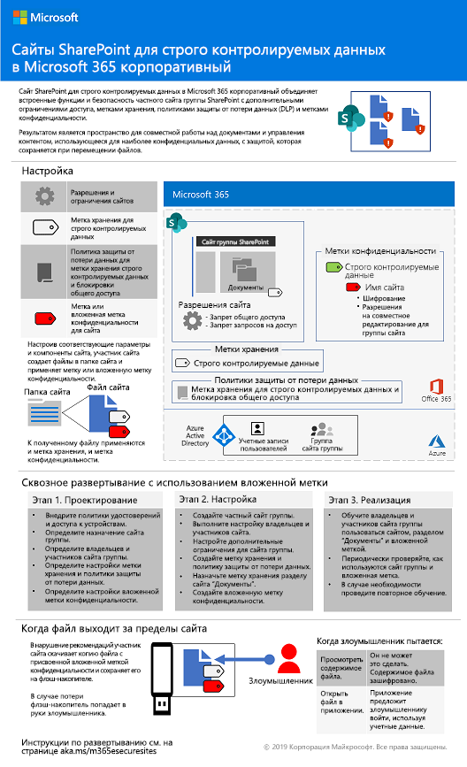
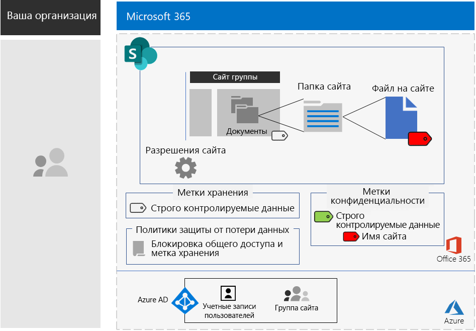

# Сайты SharePoint для жестко регламентированных данныхSharePoint sites for highly regulated data

*Этот сценарий применяется к планам E3 и E5 Microsoft 365 корпоративный.**This scenario applies to both the E3 and E5 versions of Microsoft 365 Enterprise*

Решение Microsoft 365 корпоративный содержит полный набор облачных служб, предназначенных для создания, хранения и защиты жестко регламентированных данных, хранящихся в файлах, а также для управления ими. К их числу относятся:Microsoft 365 Enterprise includes a full suite of cloud-based services so that you can create, store, secure, and manage your highly regulated data stored in files. This includes data that is:

- данные, на которые распространяется действие региональных нормативных актов;Subject to regional regulations.
- наиболее важные для предприятия данные, например коммерческие тайны, информация о финансовой деятельности или данные о персонале и стратегии организации.The most valuable data for your organization, such as trade secrets, financial or human resources information, and organization strategy.

>[!Note]
> Аналогичный сценарий с использованием Microsoft Teams представлен [здесь](secure-teams-highly-regulated-data-scenario.md).A similar scenario using Microsoft Teams is [here](secure-teams-highly-regulated-data-scenario.md).
>

Облачный сценарий Microsoft 365 корпоративный, который соответствует такой бизнес-потребности предприятия, потребует от вас:A Microsoft 365 Enterprise cloud-based scenario that meets this business need requires that you:

- хранения файлов (документов, презентаций, электронных таблиц и т. д.) на сайте группы SharePoint;Store files (documents, slide decks, spreadsheets, etc.) in a SharePoint team site.
- блокировки сайта, чтобы предотвратить:Lock down the site to prevent:
  - предоставление доступа пользователям, не являющимся участниками группы Office 365 для этого сайта;Access to users who are not members of the Office 365 group for the site.
  - предоставление участниками сайта доступа третьим лицам;Members of the site from granting access to others.
  - запросы на доступ к сайту от лиц, которые не являются участниками сайта;Non-members of the site from requesting access to the site.
- настройки метки хранения Office 365 для сайтов SharePoint по умолчанию, чтобы блокировать пользователей при отправке файлов за пределы организации;Configure an Office 365 retention label for your SharePoint sites as a default way to block users from sending files outside the organization.
- шифрования наиболее конфиденциальных файлов сайта таким образом, чтобы файл оставался зашифрованным при перемещении;Encrypt the most sensitive files of the site with encryption that travels with the file.
- добавления разрешений к наиболее конфиденциальным файлам. Чтобы открыть такие файлы, даже если они будут доступны вне сайта, потребуются действительные учетные данные учетной записи пользователя с соответствующим разрешением. Add permissions to the most sensitive files so that if even if they get shared outside of the site, opening the file still requires the valid credentials of a user account that has permission.

В приведенной ниже таблице сопоставляются требования этого сценария и функции Microsoft 365 корпоративный.The following table maps the requirements of this scenario to a feature of Microsoft 365 Enterprise.

|||
|:-------|:-----|
| **Требования****Requirement** | **Функция Microsoft 365 корпоративный****Microsoft 365 Enterprise feature** |
| Хранение файловStore files | Сайты групп SharePointSharePoint team sites |
| Блокировка сайтаLock down the site | Разрешения для групп Office 365 и сайта группы SharePointOffice 365 groups and SharePoint team site permissions |
| Пометка файлов сайтаLabel the files of the site | Метки хранения Office 365Office 365 retention labels |
| Блокирование пользователей при отправке файлов за пределы организацииBlock users when sending files outside the organization | Политики защиты от потери данных в Office 365Data Loss Prevention (DLP) policies in Office 365 |
| Шифрование всех файлов сайтаEncrypt all of the files of the site | Метки или вложенные метки конфиденциальности Office 365Office 365 sensitivity labels or sublabels |
| Добавление разрешений к файлам сайтаAdd permissions to the files of the site | Метки или вложенные метки конфиденциальности Office 365Office 365 sensitivity labels or sublabels |
|||

Ниже приведен пример конфигурации безопасного сайта SharePoint.Here is an example configuration for a secure SharePoint site.

Этот сценарий требует, чтобы у вас уже были развернуты:This scenario requires that you have already deployed:

- этап [удостоверений](identity-infrastructure.md) и шаги 1 и 2 этапа [защиты информации](infoprotect-infrastructure.md) для базовой инфраструктуры;The [Identity](identity-infrastructure.md) phase and steps 1 and 2 of the [Information protection](infoprotect-infrastructure.md) phase of the foundation infrastructure. 
- [SharePoint](sharepoint-online-onedrive-workload.md).[SharePoint](sharepoint-online-onedrive-workload.md).

Описанные ниже поэтапные шаги помогут выполнить проектирование, настройку и внедрение сайтов SharePoint  для жестко регламентированных данных.The following phases step you through designing, configuring, and driving adoption for SharePoint sites for highly regulated data.

 Одностраничную сводку этого сценария см. на плакате [Сайты SharePoint для жестко регламентированных данных](./media/teams-sharepoint-online-sites-highly-regulated-data/SharePointSitesHighlyRegulatedData.pdf).For a 1-page summary of this scenario, see the [SharePoint sites for highly regulated data poster](./media/teams-sharepoint-online-sites-highly-regulated-data/SharePointSitesHighlyRegulatedData.pdf).

[Плакат ](./media/teams-sharepoint-online-sites-highly-regulated-data/SharePointSitesHighlyRegulatedData.pdf)

Вы также можете скачать этот плакат в формате [PDF](https://github.com/MicrosoftDocs/microsoft-365-docs/raw/public/microsoft-365/enterprise/media/teams-sharepoint-online-sites-highly-regulated-data/SharePointSitesHighlyRegulatedData.pdf) или [PowerPoint](https://github.com/MicrosoftDocs/microsoft-365-docs/raw/public/microsoft-365/enterprise/media/teams-sharepoint-online-sites-highly-regulated-data/SharePoint-Sites-Highly-Regulated-Data.pptx) и распечатать его на бумаге размера letter, legal или tabloid (11 x 17).You can also download this poster in [PDF](https://github.com/MicrosoftDocs/microsoft-365-docs/raw/public/microsoft-365/enterprise/media/teams-sharepoint-online-sites-highly-regulated-data/SharePointSitesHighlyRegulatedData.pdf) or [PowerPoint](https://github.com/MicrosoftDocs/microsoft-365-docs/raw/public/microsoft-365/enterprise/media/teams-sharepoint-online-sites-highly-regulated-data/SharePoint-Sites-Highly-Regulated-Data.pptx) formats and print it on letter, legal, or tabloid (11 x 17)-sized paper.

## Необходимые компоненты для идентификации и доступа к устройствуIdentity and device access prerequisites

Чтобы защитить доступ к сайту SharePoint, убедитесь, что вы настроили [политики идентификации и доступа к устройству](identity-access-policies.md), а также [рекомендуемые политики доступа к SharePoint](sharepoint-file-access-policies.md).To protect access to the SharePoint site, ensure that you have configured [identity and device access policies](identity-access-policies.md) and the [recommended SharePoint access policies](sharepoint-file-access-policies.md).

## Этап 1. ПроектированиеPhase 1: Design

Чтобы создать сайт SharePoint для жестко регламентированных данных, сначала необходимо определить его назначение.To create a SharePoint site for highly regulated data, you must first identify its purpose. Например, отделу исследований и разработок производственного предприятия сайт SharePoint необходим для хранения текущих проектных спецификаций существующих продуктов, а также для совместной работы над новыми продуктами.For example, the research and development department of a manufacturing organization needs a SharePoint site to store current design specifications for existing products and a place to collaborate on new products. Доступ к сайту будет разрешен только членам отдела исследований и разработок и избранным руководителям.Only members of the Research & Development department and selected executives will be allowed to access the site.

Такое назначение сайта потребует определения основных элементов конфигурации, таких как:That purpose will drive the determination of essential configuration items such as:

- метка хранения Office 365 для назначения разделу сайта "Документы" и набор политик защиты от потери данных для нее;The Office 365 retention label to assign to the Documents portion of the site and DLP policies for the label
- параметры вложенной метки конфиденциальности Office 365, которая применяется к высоко конфиденциальным файлам, хранящимся на сайте.The settings of an Office 365 sensitivity sublabel that users apply to highly sensitive files stored in the site

Как только эти параметры будут определены, вы сможете использовать их для настройки сайта на этапе 2.Once determined, you use these settings to configure the site in Phase 2. 

### Шаг 1. Метки хранения Office 365 и политики защиты от потери данныхStep 1 Office 365 retention labels and DLP policies

При применении меток хранения Office 365 к разделу "Документы" сайта группы SharePoint указывается заданный по умолчанию метод классификации всех файлов, хранящихся на этом сайте.When applied to the Documents portion of a SharePoint team site, Office 365 retention labels provide a default method of classifying all files stored on the site.
 
В отношении сайтов SharePoint для жестко регламентированных данных необходимо определить, какую метку хранения Office 365 следует использовать.For SharePoint sites for highly regulated data, you need to determine which Office 365 retention label to use.

Вопросы проектирования меток Office 365 рассмотрены в статье [Классификация и метки Office 365](https://docs.microsoft.com/office365/securitycompliance/secure-sharepoint-online-sites-and-files#office-365-retention-labels).For the design considerations of Office 365 labels, see [Office 365 classification and labels](https://docs.microsoft.com/office365/securitycompliance/secure-sharepoint-online-sites-and-files#office-365-retention-labels).

Для защиты конфиденциальной информации и предотвращения ее случайного или преднамеренного разглашения используются политики защиты от потери данных. Дополнительные сведения о них см. в этом [обзоре](https://docs.microsoft.com/office365/securitycompliance/data-loss-prevention-policies).To protect sensitive information and prevent its accidental or intentional disclosure, you use DLP policies. For more information, see this [overview](https://docs.microsoft.com/office365/securitycompliance/data-loss-prevention-policies).

В отношении сайтов SharePoint для жестко регламентированных данных необходимо настроить политику защиты от потери данных для метки хранения Office 365, назначенной такому сайту. Это позволит блокировать пользователей при попытке предоставить доступ к файлам внешним пользователям.For SharePoint sites, you must configure a DLP policy for the Office 365 retention label assigned to the site to block users when they attempt to share files with external users. 

### Шаг 2. Вложенная метка конфиденциальности Office 365Step 2: Your Office 365 sensitivity sublabel

Чтобы обеспечить шифрование и набор разрешений для наиболее конфиденциальных файлов, нужно применить метку или вложенную метку конфиденциальности Office 365.To provide encryption and a set of permissions to your most sensitive files, users must apply an Office 365 sensitivity label or sublabel. Вложенная метка существует в имеющейся метке.A sublabel exists under an existing label. 

Используйте метку конфиденциальности, если требуется небольшое число меток для общих и отдельных закрытых команд.Use a sensitivity label when you need is a small number of labels for both global use and individual private teams. Используйте вложенную метку конфиденциальности, если у вас большое число меток или нужно упорядочить метки для безопасных сайтов под меткой строго регулируемых данных.Use a sensitivity sublabel when you have a large number of labels or want to organize labels for secure sites the under your highly regulated label. 

Параметры примененной метки или вложенной метки сохраняются при перемещении файла.The settings of the applied label or sublabel travel with the file. Даже в случае утечки за пределы сайта файл можно открыть только с помощью учетных записей пользователей, прошедших проверку подлинности, которые имеют разрешения.Even if it is leaked outside the site, only authenticated user accounts that have permissions can open it.

### Результаты проектированияDesign results

Вы уже определили:You have determined the following:

- соответствующую метку хранения Office 365 и политику защиты от потери данных, связанную с этой меткой;The appropriate Office 365 retention label and the DLP policy that is associated with the label
- параметры вложенной метки конфиденциальности Office 365, в том числе шифрование и разрешения.The settings of the Office 365 sensitivity sublabel that include encryption and permissions

## Этап 2. НастройкаPhase 2: Configure

На этом этапе параметры, определенные на этапе 1, реализуются с целью создания сайта SharePoint для жестко регламентированных данных.In this phase, you take the settings determined in Phase 1 and implement them to create a SharePoint site for highly regulated data.

### Шаг 1. Создание частного сайта группы SharePoint владельцами и участниками соответствующей группы Office 365Step 1: Create a private SharePoint team site with owners and members of the corresponding Office 365 group

Чтобы создать частный сайт группы SharePoint, следуйте [инструкциям]( https://support.office.com/article/create-a-site-in-sharepoint-online-4d1e11bf-8ddc-499d-b889-2b48d10b1ce8).Follow [these instructions]( https://support.office.com/article/create-a-site-in-sharepoint-online-4d1e11bf-8ddc-499d-b889-2b48d10b1ce8) to create a private SharePoint team site.

### Шаг 2. Настройка параметров дополнительных разрешений для сайта группы SharePointStep 2: Configure additional permissions settings for the SharePoint team site

Настройте параметры разрешений на сайте SharePoint.From the SharePoint site, configure these permission settings.

1. На панели инструментов щелкните значок параметров и выберите вариант **Разрешения для сайта**.In the tool bar, click the settings icon, and then click **Site permissions**.
2. В области **Разрешения для сайта** в разделе **Параметры общего доступа** щелкните **Изменить параметры общего доступа**.In the **Site permissions** pane, under **Sharing Settings**, click **Change sharing settings**.
3. В разделе **Разрешения на предоставление общего доступа** установите флажок **Только владельцы сайта могут делиться файлами, папками и сайтом**.Under **Sharing permissions**, choose **Only site owners can share files, folders, and the site**.
4. Отключите параметр **Разрешить запросы на доступ** и нажмите кнопку **Сохранить**.Turn off **Allow access requests**, and then click **Save**.

С помощью этих параметров можно отключить возможность предоставлять общий доступ к сайту другим пользователям для участников группы сайта, а также возможность запрашивать доступ к сайту для лиц, не являющихся участниками.With these settings, the ability for site group members to share the site with other members or for non-members to request access to the site is disabled.

### Шаг 3. Настройка сайта для использования метки хранения Office 365Step 3: Configure the site for an Office 365 retention label

Используйте инструкции, приведенные в статье [Защита файлов SharePoint с помощью меток Office 365 и политики защиты от потери данных](https://docs.microsoft.com/office365/enterprise/protect-sharepoint-online-files-with-office-365-labels-and-dlp), для:Use the instructions in [Protect SharePoint files with Office 365 labels and DLP](https://docs.microsoft.com/office365/enterprise/protect-sharepoint-online-files-with-office-365-labels-and-dlp) to:

1. создания и публикации метки хранения для жестко регламентированных данных (при необходимости);Create and publish a retention label for highly regulated data (if needed).
2. настройки сайта для использования метки хранения, созданной на шаге 1;Configure the site for the retention label created in step 1.
3. создания политики защиты от потери данных для жестко регламентированных данных, которая будет использовать метку хранения, созданную на шаге 2, и блокировать пользователей при отправке файлов за пределы организации.Create a DLP policy for highly regulated data that uses the retention label created in step 2 and blocks users from sending files outside the organization

#### Шаг 4. Создание вложенной метки конфиденциальности Office 365 для сайтаStep 4: Create an Office 365 sensitivity sublabel for the site

В отличие от метки конфиденциальности для жестко регламентированных данных, которую любой пользователь может применить к любому файлу, защищенный сайт должен иметь собственную вложенную метку, чтобы файлы, которым она назначена:Unlike a sensitivity label for highly regulated data that anyone can apply to any file, a secure site needs its own sublabel so that files with the sublabel assigned:

- были зашифрованы и оставались зашифрованными при перемещении;Are encrypted and the encryption travels with the file.
- содержали настраиваемые разрешения, благодаря которым их могут открыть только участники группы сайта.Contain custom permissions so that only members of the site group can open it.

Чтобы установить этот дополнительный уровень безопасности для файлов, хранящихся на сайте, необходимо настроить новую метку конфиденциальности или вложенную метку общей метки файлов с жестко регламентированными данными.To accomplish this additional level of security for files stored in the site, you must configure a new sensitivity label or a sublabel of the general label for highly regulated files. Только участники группы сайта будут видеть ее в списке вложенных меток для метки жестко регламентированных данных.  Only group members for the site will see it in the list of sublabels for the highly regulated label.

Следуя инструкциям [здесь](https://docs.microsoft.com/microsoft-365/compliance/encryption-sensitivity-labels), настройте метку или вложенную метку для метки, используемой для файлов с жестко регламентированными данными, со следующими параметрами:Use the instructions [here](https://docs.microsoft.com/microsoft-365/compliance/encryption-sensitivity-labels) to configure a label or a sublabel of the label you are using for highly regulated files with the following settings:

- имя метки или вложенной метки должно содержать имя сайта, чтобы легко возникали ассоциации при назначении метки или вложенной метки файлу;The name of the label or sublabel contains the name of the site for easy association when assigning the label or sublabel to a file.
- необходимо включить шифрование;Encryption is enabled.
- группа сайта должна иметь разрешения на совместное редактирование.The site group has Co-Author permissions.

### Результаты настройкиConfiguration results

Вы настроили:You have configured the following:

- более строгие параметры разрешений на сайте SharePoint;More restrictive permission settings on the SharePoint site
- метку хранения Office 365, назначенную разделу "Документы" сайта SharePoint;An Office 365 retention label assigned to the Documents portion of the SharePoint site
- политику защиты от потери данных для метки хранения Office 365;A DLP policy for the Office 365 retention label
- метку или вложенную метку конфиденциальности Office 365, которую пользователи могут применить к наиболее конфиденциальным файлам, хранящимся на сайте. Эта метка шифрует файл и предоставляет доступ для совместного редактирования только участникам группы сайта команды.An Office 365 sensitivity label or sublabel that users can apply to the most sensitive files stored in the site, which encrypts the file and only allows Co-Author access for members of the team site group 

Ниже представлена итоговая конфигурация, использующая вложенную метку для метки жестко регламентированных данных.Here is the resulting configuration that uses a sublabel of the Highly regulated label.

Ниже показан пример применения вложенной метки к файлу, хранящемуся на сайте.Here is an example of a user that has applied the sublabel to a file stored in the site.

## Этап 3. Внедрение среди пользователейPhase 3: Drive user adoption

Сайт SharePoint для жестко регламентированных данных может защищать данные только в том случае, если он постоянно используется для хранения и доступа к конфиденциальным файлам.A SharePoint site for highly regulated data can only protect that data if it is consistently used for storage and access of sensitive files. Это наиболее сложный этап, так как он предполагает изменение привычек и предпочтений пользователей. This is the hardest phase because it relies on users changing their habits and preferences. 

Например, сотрудники, которые ранее хранили конфиденциальные файлы на USB-накопителях или в личных облачных хранилищах, теперь будут вынуждены хранить их только на сайте SharePoint для жестко регламентированных данных.For example, employees that are used to storing sensitive files on USB drives or on personal cloud-based storage solutions will now have to store them exclusively in a SharePoint site for highly regulated data.

### Шаг 1. Обучение пользователейStep 1: Train your users

После завершения настройки обучите пользователей, являющихся участниками сайта, рассказав им:After completing your configuration, train the set of users who are members of the site:

- насколько важно использовать новый сайт для защиты ценных файлов, а также о последствиях утечки жестко регламентированных данных, таких как юридические последствия, штрафные санкции за несоблюдение нормативно-правовых актов, появление программ-шантажистов или потеря конкурентного преимущества;On the importance of using the new site to protect valuable files and the consequences of a highly regulated data leak, such as legal ramifications, regulatory fines, ransomware, or loss of competitive advantage.
- как получить доступ к сайту и его файлам;How to access the site and its files.
- как создавать файлы на сайте и отправлять новые файлы, которые хранятся локально;How to create new files on the site and upload new files stored locally.
- каким образом политика защиты от потери данных блокирует пользователей при попытке отправить файлы за пределы организации;How the DLP policy blocks them from sharing files externally.
- как пометить наиболее конфиденциальные файлы с помощью метки или вложенной метки для сайта;How to label the most sensitive files with the label or sublabel for the site.
- как метка или вложенная метка защищает файл даже в случае утечки с сайта.How the label or sublabel protects a file even when it is leaked off the site.

В программу такого обучения следует включить практические занятия, где пользователи смогут опробовать эти операции и ознакомиться с результатами.This training should include hands-on exercises so that the users can experience these operations and their results.

### Шаг 2. Проведение периодических проверок использования и файловStep 2: Conduct periodic reviews of usage and files

Через несколько недель после обучения администратор SharePoint может выполнить следующие действия в отношении сайта SharePoint:In the weeks after training, the SharePoint administrator for the SharePoint site can:

- проанализировать использование сайта и сравнить результаты с требованиями к использованию;Analyze usage for the site and compare it with usage expectations.
- убедиться, что наиболее конфиденциальные файлы были надлежащим образом помечены с помощью метки или вложенной метки конфиденциальности.Verify that highly sensitive files have been properly labeled with the sensitivity label or sublabel.

  Вы можете узнать, каким файлам присвоены метки, просмотрев папку в SharePoint и добавив столбец **Конфиденциальность** с помощью параметра **Показать/скрыть столбцы** элемента **Добавить столбец**.You can see which files have a label assigned by viewing a folder in SharePoint and adding the **Sensitivity** column through the **Show/hide columns** option of **Add column**.

При необходимости следует провести повторное обучение пользователей.Retrain your users as needed.

### Результаты адаптации пользователей к новым требованиямUser adoption results

Файлы с жестко регламентированными данными хранятся только на сайтах SharePoint для жестко регламентированных данных, а к наиболее конфиденциальным файлам применяется метка или вложенная метка конфиденциальности для сайта.Highly regulated files are stored exclusively on SharePoint sites for highly regulated data and the most sensitive files have the sensitivity label or sublabel for the site applied.

## Как корпорация Contoso использовала сайт SharePoint для строго регулируемых данныхHow the Contoso Corporation used a SharePoint site for highly regulated data

Корпорация Contoso — вымышленная показательная транснациональная промышленная компания-конгломерат.The Contoso Corporation is a fictional but representative global manufacturing conglomerate. Посмотрите, как корпорация Contoso разработала, настроила и внедрила [надежный сайт SharePoint](contoso-sharepoint-online-site-for-highly-confidential-assets.md) для исследовательских команд в Париже, Москве, Нью-Йорке, Пекине и Бангалоре.See how Contoso designed, configured, and then drove the adoption of a [secure SharePoint site](contoso-sharepoint-online-site-for-highly-confidential-assets.md) for their research teams in Paris, Moscow, New York, Beijing, and Bangalore. 

## См. такжеSee also

[Teams для строго регулируемых данныхTeams for highly regulated data](secure-teams-highly-regulated-data-scenario.md)

[Рабочие нагрузки и сценарии Microsoft 365 корпоративныйMicrosoft 365 Enterprise workloads and scenarios](deploy-workloads.md)

[Microsoft 365 Productivity Library](https://aka.ms/productivitylibrary) (https://aka.ms/productivitylibrary)[Microsoft 365 Productivity Library](https://aka.ms/productivitylibrary) (https://aka.ms/productivitylibrary)

[Руководство по развертываниюDeployment guide](deploy-microsoft-365-enterprise.md)
