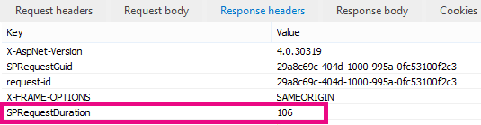

# Использование веб-части поиска контента вместо веб-части "Запрос контента" для улучшения производительности в SharePoint Online

В этой статье описывается, как повысить производительность, заменив веб-часть "запрос содержимого" на веб-часть "поиск контента" в SharePoint Server 2013 и SharePoint Online.
  
Одной из самых мощных новых функций SharePoint Server 2013 и SharePoint Online является веб-часть поиска контента (CSWP). Эта веб-часть использует индекс поиска для быстрого извлечения результатов, отображаемых для пользователя. Используйте веб-часть "поиск контента", а не веб-часть "запрос содержимого" (CQWP) на страницах, чтобы увеличить производительность для пользователей.
  
Использование веб-части поиска контента по сравнению с веб-частью "запрос содержимого" почти всегда приводит к значительному повышению производительности загрузки страниц в SharePoint Online. Чтобы получить правильный запрос, существует немного дополнительная настройка, но повышение производительности повышает производительность и довольные пользователи.
  
## Сравнение повышения производительности с использованием веб-части "поиск контента" вместо веб-части "Запрос контента"

В следующих примерах показано снижение производительности, которое может быть получено при использовании веб-части "поиск контента" вместо веб-части "запрос содержимого". Эти эффекты более очевидны с помощью сложной структуры сайта и очень широкого спектра запросов к содержимому.
  
Этот пример сайта имеет следующие характеристики:
  
- 8 уровней дочерних сайтов.
    
- Списки, использующие настраиваемый тип контента "фруктов".
    
- В веб-части Запрос контента является широким, возвращая все элементы с типом контента "фруктов".
    
- В этом примере используются только элементы 50 на 8 сайтах. Эти эффекты станут еще более выраженными для сайтов с большим содержимым.
    
Ниже приведен снимок результатов веб-части "запрос содержимого".
  

  
В Internet Explorer используйте вкладку **сеть** в средствах разработчика F12, чтобы просмотреть сведения о заголовке отклика. На следующем снимке экрана значение **SPRequestDuration** для этой страницы загружается 924 миллисекунд. 
  

  
 **SPRequestDuration** указывает объем трудозатрат, выполняемых на сервере для подготовки страницы. Переключение контента по веб-частям запроса с контентом с помощью веб-частей поиска значительно сокращает время, необходимое для отображения страницы. В отличие от того, что страница с эквивалентной веб-частью поиска контента возвращает такое же количество результатов, значение **SPRequestDuration** равно 106 миллисекунд, как показано на следующем снимке экрана: 
  

  
## Добавление веб-части поиска контента в SharePoint Online

Добавление веб-части поиска контента очень похоже на стандартную веб-часть "запрос содержимого". В разделе  *"Добавление веб-части поиска контента"*  в разделе [Настройка веб-части поиска контента в SharePoint](https://support.office.com/article/Configure-a-Content-Search-Web-Part-in-SharePoint-0dc16de1-dbe4-462b-babb-bf8338c36c9a).
  
## Создание правого запроса поиска для веб-части поиска контента

После добавления веб-части "поиск контента" вы можете уточнить поиск и возвратить нужные элементы. Подробные инструкции по выполнению этой процедуры приведены в разделе  *"Отображение содержимого путем настройки расширенного запроса в веб-части" поиск контента "*  в SharePoint" [Настройка веб-части "поиск контента" в SharePoint](https://support.office.com/article/Configure-a-Content-Search-Web-Part-in-SharePoint-0dc16de1-dbe4-462b-babb-bf8338c36c9a).
  
## Средство построения и тестирования запросов

Для создания и тестирования сложных запросов в средстве поиска обратитесь к разделу [поисковый запрос](https://sp2013searchtool.codeplex.com/) на сайте CodePlex. 
  

