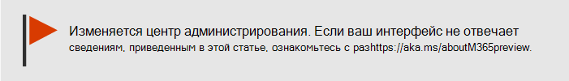

# Проверка работоспособности службы Microsoft 365How to check Microsoft 365 service health

Вы можете просмотреть состояние службы Майкрософт, включая облачные службы Office в Интернете, Yammer, Microsoft Dynamics CRM и управления мобильными устройствами, на странице Здоровье службы в центре администрирования [Microsoft 365.](https://go.microsoft.com/fwlink/p/?linkid=2024339) You can view the health of your Microsoft services, including Office on the web, Yammer, Microsoft Dynamics CRM, and mobile device management cloud services, on the **Service health** page in the [Microsoft 365 admin center](https://go.microsoft.com/fwlink/p/?linkid=2024339). If you are experiencing problems with a cloud service, you can check the service health to determine whether this is a known issue with a resolution in progress before you call support or spend time troubleshooting.If you are experiencing problems with a cloud service, you can check the service health to determine whether this is a known issue with a resolution in progress before you call support or spend time troubleshooting.

Если вы не можете войти в центр администрирования,  вы можете использовать страницу состояния службы для проверки известных проблем, препятствующих входу в клиент.If you are unable to sign in to the admin center, you can use the [service status page](https://status.office365.com) to check for known issues preventing you from logging into your tenant.  Кроме того, зарегистрироваться, чтобы следовать за [нами @MSFT365status](https://twitter.com/MSFT365Status) в Twitter, чтобы увидеть информацию о некоторых событиях.Also sign up to follow us at [@MSFT365status](https://twitter.com/MSFT365Status) on Twitter to see information on certain events.

## Проверка работоспособности службыHow to check service health

1. Перейдите в Microsoft 365 центра администрирования [https://admin.microsoft.com](https://go.microsoft.com/fwlink/p/?linkid=2024339) и войдите в учетную запись администратора.Go to the Microsoft 365 admin center at [https://admin.microsoft.com](https://go.microsoft.com/fwlink/p/?linkid=2024339), and sign in with an admin account.

    > [!NOTE]
    > Люди, которым назначена роль администратора глобальной службы или администратора службы, могут просматривать состояние службы.People who are assigned the global admin or service support admin role can view service health. Чтобы разрешить администраторам Exchange, SharePoint и Skype для бизнеса просматривать сведения о работоспособности служб, необходимо также назначить им роль администратора служб.To allow Exchange, SharePoint, and Skype for Business admins to view service health, they must also be assigned the Service admin role. Дополнительные сведения о ролях, которые могут просматривать состояние службы, см. в [статью О ролях администратора.](../admin/add-users/about-admin-roles.md?preserve-view=true&view=o365-worldwide#commonly-used-microsoft-365-admin-center-roles)For more information about roles that can view service health, see [About admin roles](../admin/add-users/about-admin-roles.md?preserve-view=true&view=o365-worldwide#commonly-used-microsoft-365-admin-center-roles).

2. Если вы не используете новый центр  администрирования, на домашней странице выберите **метод Try the new admin center** toggle в верхнем правом углу.If you are not using the new admin center, on the **Home** page, select the **Try the new admin center** toggle in the upper-right corner.

3. Чтобы просмотреть состояние службы, в центре администрирования перейдите в службу здравоохранения или выберите карточку здоровья службы  >  на панели **мониторинга home.** To view service health, in the admin center, go to **Health** > **Service health**, or select the **Service health** card on the **Home dashboard**. На карточке мониторинга указывается, существует ли активная проблема службы, и ссылки на подробную страницу **здоровья** службы.The dashboard card indicates whether there is an active service issue and links to the detailed **Service health** page.

4. На странице **Здоровье службы** состояние здоровья каждой облачной службы отображается в формате таблицы.On the **Service health** page, the health state of each cloud service is shown in a table format.

   

На **вкладке Все службы** (представление по умолчанию) показаны все службы и их текущее состояние.The **All services** tab (the default view) shows all services and their current health state. Значок и **столбец Состояние** указывают состояние каждой службы.An icon and the **Status** column indicate the state of each service.

Чтобы фильтровать представление для служб, в настоящее время столкнующихся с инцидентом, выберите вкладку **Incidents** в верхней части страницы.To filter your view to services currently experiencing an incident, select the **Incidents** tab at the top of the page. При выборе **вкладки Advisories** будут показываться только службы, на которые в настоящее время размещена консультативная служба.Selecting the **Advisories** tab will show only services that currently have an advisory posted.

На **вкладке История** показана история устраненных инцидентов и консультантов.The **History** tab shows the history of incidents and advisories that have been resolved.

Если у вас возникли проблемы со службой Microsoft 365 и вы не видите  ее, указанную на странице здоровье службы, сообщите нам об этом, выбрав отчет о проблеме и заполнив короткую форму.If you're experiencing an issue with a Microsoft 365 service and you don’t see it listed on the **Service health** page, tell us about it by selecting **Report an issue**, and completing the short form. Мы посмотрим на соответствующие данные и отчеты из других организаций, чтобы узнать, насколько широко распространена проблема и возникла ли она с помощью нашей службы.We’ll look at related data and reports from other organizations to see how widespread the issue is, and if it originated with our service. Если это произошло, мы добавим его в  качестве нового инцидента или рекомендации на странице здоровье службы, где можно отслеживать его разрешение.If it did, we’ll add it as a new incident or advisory on the **Service health** page, where you can track its resolution. Если вы не видите его в списке в течение 30 минут, обратитесь в службу поддержки, чтобы устранить проблему.If you don’t see it appear on the list within about 30 minutes, consider contacting support to resolve the issue.

Чтобы настроить представление о том, какие службы будут показываться на панели мониторинга, выберите настраиваемый просмотр **Preferences** и очистите флажки для служб, которые необходимо отфильтровать из представления панели мониторинга состояния  >  службы.To customize your view of which services show up on the dashboard, select **Preferences** > **Custom view**,  and clear the check boxes for the services you want to filter out of your Service health dashboard view. Убедитесь, что для каждой службы, которую необходимо отслеживать, выбрано поле.Make sure that the check box is selected for each service that you want to monitor.

Чтобы подписаться на уведомления электронной почты о новых инцидентах, влияющих на изменения клиента и состояния для активного инцидента, выберите "Настройки электронной почты", нажмите кнопку   >   **Отправка** уведомлений об обогреве службы в электронной почте, а затем укажите:To sign up for email notifications of new incidents that affect your tenant and status changes for an active incident, select **Preferences** > **Email**, click **Send me service heath notifications in email**, and then specify:

- До двух адресов электронной почты.Up to two email addresses.
- Нужны ли уведомления об инцидентах или консультацияхWhether you want notifications for incidents or advisories
- Службы, для которых необходимо уведомлениеThe services for which you want notification

> [!NOTE]
> Каждый администратор может иметь свои настройки, и вышеуказанное ограничение в два адреса электронной почты — на учетную запись администратора.Each admin can have their Preferences set and the above limit of two email address is per admin account.

> [!TIP]
> Вы также можете использовать [приложение администрирования Microsoft 365](https://go.microsoft.com/fwlink/p/?linkid=627216) на мобильном устройстве для просмотра состояния службы, что является отличным способом оставаться актуальным с push-уведомлениями.You can also use the [Microsoft 365 Admin app](https://go.microsoft.com/fwlink/p/?linkid=627216) on your mobile device to view Service health, which is a great way to stay current with push notifications.

### Просмотр опубликованных сведений о работоспособности службыView details of posted service health

В **представлении "Все службы"** выбор состояния службы откроет сводное представление о советниках или инцидентах.On the **All services** view, selecting the service status will open a summary view of advisories or incidents.

В сводку включена следующая информация:The advisory or incident summary provides the following information:

- **Название** — сводка проблемы.**Title** - A summary of the problem.
- **Служба** . Имя пострадавшей службы.**Service** - The name of the affected service.
- **ID** — числимый идентификатор проблемы.**ID** - A numeric identifier for the problem.
- **Состояние** . Как эта проблема влияет на службу.**Status** - How this problem affects the service.
- **Время начала** — время начала проблемы.**Start time** - The time when the issue started.
- **Последнее обновление** — последний раз, когда было обновлено сообщение о состоянии службы.**Last updated** - The last time that the service health message was updated. Мы вывешим частые сообщения, чтобы узнать о том, как мы продвинулись в применении решения.We post frequent messages to let you know the progress that we're making in applying a solution.

Выберите название проблемы, чтобы увидеть страницу сведений о проблеме,  на которой показаны дополнительные сведения о проблеме, включая историю всех сообщений, которые были размещены во время работы над решением.Select the issue title to see the issue detail page, which shows more information about the issue, including the [history](#history) of all messages posted while we work on a solution.

### Перевод сведений о работоспособности службыTranslate service health details

Так как сведения о работоспособности служб публикуются в режиме реального времени, они предлагаются только на английском языке и не переводятся автоматически. Чтобы перевести объяснения, выполните следующие действия:Because service health explanations are posted in real-time, they are not automatically translated to your language and the details of a service event are in English only. To translate the explanation, follow these steps:

1. Перейдите на сайт [Переводчика](https://www.bing.com/translator/).Go to [Translator](https://www.bing.com/translator/).

2. На странице **Работоспособность службы** выберите инцидент или рекомендацию. В разделе **Показать сведения** скопируйте текст.On the **Service health** page, select an incident or advisory. Under **Show details**, copy the text about the issue.

3. Вставьте текст в Переводчик и нажмите кнопку **Translate** (Перевести).In Translator, paste the text and choose **Translate**.

### ОпределенияDefinitions

Большую часть времени службы будут отображаться как полезные без дополнительных сведений.Most of the time, services will appear as healthy with no further information. Если в службе возникла проблема, выводится инцидент или рекомендация, а также сведения о текущем состоянии.When a service is having a problem, the issue is identified as either an advisory or an incident and shows a current status.

> [!TIP]
> Запланированные события обслуживания не показаны в состоянии обслуживания.Planned maintenance events aren't shown in service health. Вы можете отслеживать запланированные события обслуживания, оставаясь в курсе событий в Центре **сообщений.**You can track planned maintenance events by staying up to date with the **Message center**. Фильтрация сообщений, классифицируются как План изменений, чтобы узнать, когда произойдет изменение, его влияние и как к этому подготовиться.Filter to messages categorized as Plan for change to find out when the change is going to happen, its effect, and how to prepare for it. Дополнительные [сведения см. в Microsoft 365](https://support.office.com/article/38fb3333-bfcc-4340-a37b-deda509c2093) центре сообщений.See [Message center in Microsoft 365](https://support.office.com/article/38fb3333-bfcc-4340-a37b-deda509c2093) for more details.

### Инциденты и рекомендацииIncidents and advisories

| ЗначокIcon | ОписаниеDescription |
|:-----|:-----|
||Если для службы выводятся рекомендации, это значит, что нам известно о проблеме, которая касается некоторых пользователей, но служба по-прежнему доступна. В рекомендации часто указывается временное решение проблемы, которая может быть непостоянной или иметь ограниченное воздействие.If a service has an advisory shown, we are aware of a problem that is affecting some users, but the service is still available. In an advisory, there is often a workaround to the problem and the problem may be intermittent or is limited in scope and user impact.    |
||Если для службы указан инцидент, это критическая проблема, а служба или ее основные функции недоступны. Например, может не работать отправка и получение электронной почты или вход в службу. Инциденты оказывают заметное влияние на пользователей. При возникновении инцидентов мы будем публиковать на информационной панели новости об их изучении и устранении, а также сообщения о том, что проблема решена.If a service has an active incident shown, it's a critical issue and the service or a major function of the service is unavailable. For example, users may be unable to send and receive email or unable to sign-in. Incidents will have noticeable impact to users. When there is an incident in progress, we will provide updates regarding the investigation, mitigation efforts, and confirmation of resolution in the Service health dashboard.    |

### Определения состоянийStatus definitions

| СостояниеStatus | ОпределениеDefinition |
|:-----|:-----|
|**Изучается****Investigating** | Мы знаем о возможной проблеме и собираем дополнительные сведения о ней и ее влиянии.We're aware of a potential issue and are gathering more information about what's going on and the scope of impact. |
|**Производительность службы снижена****Service degradation** | Мы подтвердили, что проблема может повлиять на использование служб или функций. Это состояние может отображаться, если служба работает медленнее, чем обычно, периодически возникают прерывания или если недоступна определенная функция.We've confirmed that there is an issue that may affect use of a service or feature. You might see this status if a service is performing more slowly than usual, there are intermittent interruptions, or if a feature isn't working, for example. |
|**Работа службы прервана****Service interruption** | Вы увидите это состояние, если определено, что проблема влияет на доступ к службе. В этом случае проблема является значительной и ее можно воспроизвести.You'll see this status if we determine that an issue affects the ability for users to access the service. In this case, the issue is significant and can be reproduced consistently. |
|**Восстановление службы****Restoring service** | Причина проблемы определена, мы знаем, как ее решить, и восстанавливаем службу.The cause of the issue has been identified, we know what corrective action to take, and are in the process of bringing the service back to a healthy state. |
|**Длительное восстановление****Extended recovery** | Это состояние указывает на то, что работа над восстановлением службы идет, но пройдет некоторое время, прежде чем она станет доступна для всех затронутых систем. Это состояние также отображается, если мы применили временное исправление, чтобы уменьшить влияние проблемы, пока готовится постоянное исправление.This status indicates that corrective action is in progress to restore service to most users but will take some time to reach all the affected systems. You might also see this status if we've made a temporary fix to reduce impact while we wait to apply a permanent fix. |
|**Исследование приостановлено****Investigation suspended** | Это состояние отображается, если для дальнейшего исследования необходимы дополнительные сведения. В случае если от вас требуются определенные действия, мы дадим вам знать, какие данные или журналы нам нужны.If our detailed investigation of a potential issue results in a request for additional information from customers to allow us to investigate further, you'll see this status. If we need you to act, we'll let you know what data or logs we need. |
|**Служба восстановлена****Service restored** | Мы убедились, что проблема была решена, а работоспособность службы восстановлена. Чтобы узнать, в чем было дело, просмотрите сведения о проблеме.We've confirmed that corrective action has resolved the underlying problem and the service has been restored to a healthy state. To find out what went wrong, view the issue details. |
|**Ложный срабатыв****False positive** | После подробного исследования мы подтвердили, что служба работает в штатном режиме.After a detailed investigation, we’ve confirmed the service is healthy and operating as designed. Никакого влияния на службу не наблюдалось, а причина инцидента возникла за пределами службы.No impact to the service was observed or the cause of the incident originated outside of the service. |
|**Опубликован отчет о после инцидентах****Post-incident report published** | Мы опубликовали отчет об инцидентах после публикации для определенной проблемы, которая включает сведения о первопричинах и последующие действия для обеспечения того, чтобы подобная проблема не повторялась.We’ve published a Post Incident Report for a specific issue that includes root cause information and next steps to ensure a similar issue doesn’t reoccur. |

### HistoryHistory

Состояние службы позволяет просмотреть текущее состояние здоровья и просмотреть историю любых консультантов и инцидентов, которые затронули клиента за последние 30 дней.Service health lets you look at current health status and view the history of any service advisories and incidents that have affected your tenant in the past 30 days. Чтобы просмотреть прошлое состояние всех служб, выберите **историю просмотра** на странице подробные вопросы.To view the past health of all services, select **View history** on the issue detail page.

Появится список всех сообщений о работоспособности службы, опубликованных за выбранный период времени, как показано ниже:A list of all service health messages posted in the selected timeframe is displayed, as shown below:

Расширь любую строку, чтобы просмотреть дополнительные сведения о проблеме.Expand any row to view more details about the issue.

Дополнительные сведения о нашем обязательстве по работе см. в [Microsoft 365.](/office365/servicedescriptions/office-365-platform-service-description/service-health-and-continuity)For more information about our commitment to uptime, see [Transparent operations from Microsoft 365](/office365/servicedescriptions/office-365-platform-service-description/service-health-and-continuity).

## Статьи по темеRelated topics

[Отчеты о действиях в Microsoft 365 центре администрированияActivity Reports in the Microsoft 365 admin center](https://support.office.com/article/0d6dfb17-8582-4172-a9a9-aed798150263)

[Предпочтения центра сообщенийMessage center Preferences](../admin/manage/message-center.md?preserve-view=true&view=o365-worldwide#preferences)

[Проверка состояния Windows в центре администрированияHow to check Windows release health on admin center](/windows/deployment/update/check-release-health)
