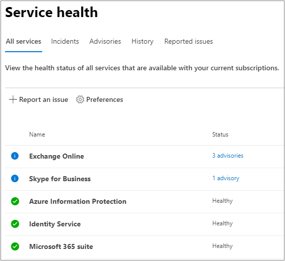

# Проверка состояния службы Microsoft 365

Вы можете просмотреть состояние ваших служб Майкрософт, включая Office в Интернете, Yammer, Microsoft Dynamics CRM и облачные  службы управления мобильными устройствами, на странице "Состояние служб" в Центре администрирования [Microsoft 365.](https://go.microsoft.com/fwlink/p/?linkid=2024339) If you are experiencing problems with a cloud service, you can check the service health to determine whether this is a known issue with a resolution in progress before you call support or spend time troubleshooting.

Если вам не удается войти в Центр администрирования,  можно воспользоваться страницей состояния службы, чтобы проверить известные проблемы, препятствующие входу в клиент.  Кроме того, вы можете подписаться на нас [по @MSFT365status](https://twitter.com/MSFT365Status) Twitter, чтобы увидеть сведения о некоторых событиях.

  
### Проверка работоспособности службы

1. Перейдите в Центр администрирования Microsoft 365 и войдите с помощью [https://admin.microsoft.com](https://go.microsoft.com/fwlink/p/?linkid=2024339) учетной записи администратора.

    > [!NOTE]
    > Для просмотра сведений о работоспособности требуется роль глобального администратора или администратора службы. Чтобы разрешить администраторам Exchange, SharePoint и Skype для бизнеса просматривать сведения о работоспособности служб, необходимо также назначить им роль администратора служб. Дополнительные сведения о ролях, которые могут просматривать сведения о состоянии службы, см. [в сведениях о ролях администраторов.](https://docs.microsoft.com/microsoft-365/admin/add-users/about-admin-roles?view=o365-worldwide&preserve-view=true#roles-available-in-the-microsoft-365-admin-center)
  
2. Если вы не используете новый Центр  администрирования, на  домашней странице выберите новый флажки Центра администрирования в правом верхнем углу.

3. Чтобы просмотреть состояние службы, в Центре администрирования перейдите в службу здравоохранения или выберите карточку состояния службы   >  на информационной панели **"Главная".**  На карточке панели мониторинга указывается, есть ли проблема с активной службой, и ссылки на подробную страницу о **состоянии** службы.
  
4. На странице **"Состояние службы"** состояние состояния каждой облачной службы отображается в табличном формате.

   

На **вкладке "Все службы"** (представление по умолчанию) показаны все службы и их текущее состояние. Значок и **столбец состояния** указывают состояние каждой службы. 

Чтобы отфильтровать представление по службам, в настоящее время столкнумся с инцидентом, выберите вкладку **"Происшествия"** в верхней части страницы. На **вкладке "Рекомендации"** будут отображиться только те службы, для которые в настоящее время опубликована рекомендация. 

На **вкладке** "История" показана история разрешенных инцидентов и консультантов.

Если у вас возникли проблемы со службой Microsoft 365 и она  не указана на странице "Состояние службы", сообщите нам об этом, выбрав "Сообщить о проблеме" и заполнив краткую форму.  Мы изумим связанные данные и отчеты от других организаций, чтобы узнать, насколько широко распространена проблема и возникла ли она в нашей службе. В этом случае мы добавим его в качестве  нового инцидента или рекомендации на странице "Состояние службы", где можно отслеживать его разрешение. Если вы не видите его в списке в течение 30 минут, обратитесь в службу поддержки, чтобы устранить проблему.

Чтобы настроить представление служб, которые будут показываться на панели мониторинга, выберите настраиваемые параметры и сняйте флажки для служб, которые нужно отфильтровать из представления панели мониторинга состояния  >  службы. Убедитесь, что для каждой службы, которую необходимо отслеживать, будет выбран этот контроль.    

Чтобы зарегистрироваться для получения уведомлений по электронной почте о новых инцидентах, влияющих на ваш клиент и изменения состояния активного инцидента, выберите "Настройка электронной почты", щелкните "Отправить мне сервисные уведомления" в электронной почте, а затем  >  укажите: 

- До двух адресов электронной почты.
- Хотите ли вы получать уведомления об инцидентах или консультантах
- Службы, для которых нужно уведомление

> [!NOTE]
> У каждого администратора могут быть свои настройки, а для каждой учетной записи администратора задается выше предельное количество адресов электронной почты.

> [!TIP]
> Вы также можете использовать приложение ["Администратор Microsoft 365"](https://go.microsoft.com/fwlink/p/?linkid=627216) на мобильном устройстве для просмотра состояния службы, что позволяет получать push-уведомления. 
  
### Просмотр опубликованных сведений о работоспособности службы

В **представлении "Все службы"** при выборе состояния службы откроется сводное представление консультантов или инцидентов.
  

В сводку включена следующая информация:

- **Заголовок** — сводка проблемы.
- **Служба** — имя затронутой службы.
- **ID** — числовая идентификация проблемы.
- **Состояние** — как эта проблема влияет на службу.
- **Время начала** — время начала проблемы.
- **Last updated** - the last time that the service health message was updated. Мы вывешим частые сообщения, чтобы вы могли узнать о ходе применения решения.

Выберите название проблемы, чтобы увидеть страницу сведений о проблеме,  на которой показаны дополнительные сведения о проблеме, включая историю всех сообщений, которые были опубликованы во время работы над решением.

### Перевод сведений о работоспособности службы

Так как сведения о работоспособности служб публикуются в режиме реального времени, они предлагаются только на английском языке и не переводятся автоматически. Чтобы перевести объяснения, выполните следующие действия:
  
1. Перейдите на сайт [Переводчика](https://www.bing.com/translator/).

2. На странице **Работоспособность службы** выберите инцидент или рекомендацию. В разделе **Показать сведения** скопируйте текст.

3. Вставьте текст в Переводчик и нажмите кнопку **Translate** (Перевести).

### Определения

В большинстве раз службы будут отображаться как полезные без дополнительных сведений. Если в службе возникла проблема, выводится инцидент или рекомендация, а также сведения о текущем состоянии.
  
> [!TIP]
> Запланированные события обслуживания не показываются в состоянии обслуживания. Вы можете отслеживать запланированные события обслуживания, оставаясь в курсе событий в **Центре сообщений.** Фильтрация сообщений, классифицируются как планирование изменений, чтобы узнать, когда произойдет изменение, его влияние и как подготовиться к этому. Дополнительные сведения см. в Центре сообщений [в Microsoft 365.](https://support.office.com/article/38fb3333-bfcc-4340-a37b-deda509c2093)
  
### Инциденты и рекомендации

| Значок | Description |
|:-----|:-----|
||Если для службы выводятся рекомендации, это значит, что нам известно о проблеме, которая касается некоторых пользователей, но служба по-прежнему доступна. В рекомендации часто указывается временное решение проблемы, которая может быть непостоянной или иметь ограниченное воздействие.    |
||Если для службы указан инцидент, это критическая проблема, а служба или ее основные функции недоступны. Например, может не работать отправка и получение электронной почты или вход в службу. Инциденты оказывают заметное влияние на пользователей. При возникновении инцидентов мы будем публиковать на информационной панели новости об их изучении и устранении, а также сообщения о том, что проблема решена.    |

### Определения состояний

| Status | Определение |
|:-----|:-----|
|**Изучается** | Мы знаем о возможной проблеме и собираем дополнительные сведения о ней и ее влиянии. |
|**Производительность службы снижена** | Мы подтвердили, что проблема может повлиять на использование служб или функций. Это состояние может отображаться, если служба работает медленнее, чем обычно, периодически возникают прерывания или если недоступна определенная функция. |
|**Работа службы прервана** | Вы увидите это состояние, если определено, что проблема влияет на доступ к службе. В этом случае проблема является значительной и ее можно воспроизвести. |
|**Восстановление службы** | Причина проблемы определена, мы знаем, как ее решить, и восстанавливаем службу. |
|**Длительное восстановление** | Это состояние указывает на то, что работа над восстановлением службы идет, но пройдет некоторое время, прежде чем она станет доступна для всех затронутых систем. Это состояние также отображается, если мы применили временное исправление, чтобы уменьшить влияние проблемы, пока готовится постоянное исправление. |
|**Исследование приостановлено** | Это состояние отображается, если для дальнейшего исследования необходимы дополнительные сведения. В случае если от вас требуются определенные действия, мы дадим вам знать, какие данные или журналы нам нужны. |
|**Служба восстановлена** | Мы убедились, что проблема была решена, а работоспособность службы восстановлена. Чтобы узнать, в чем было дело, просмотрите сведения о проблеме. |
|**Ложное срабатыва** | После подробного исследования мы подтверждают, что служба работает правильно. Влияние на службу не наблюдалось или причина инцидента возникла за пределами службы. |
|**Опубликованный отчет после инцидента** | Мы опубликовали отчет об инциденте после возникновения определенной проблемы, который содержит сведения об основной причине и дальнейшие действия, чтобы подобная проблема не повторялась. |

### History

Состояние службы позволяет просмотреть текущее состояние системы и историю всех консультантов и инцидентов, которые повлияли на ваш клиент за последние 30 дней. Чтобы просмотреть прошлые состояния всех служб, выберите "Просмотр **истории"** на странице с подробными данными о проблеме.
  

  
Появится список всех сообщений о работоспособности службы, опубликованных за выбранный период времени, как показано ниже:
  

  
Раз развернуть любую строку, чтобы просмотреть дополнительные сведения о проблеме.
  
Дополнительные сведения о наших обязательствах по обеспечению времени работы см. в под вопросе ["Прозрачные операции" из Microsoft 365.](https://go.microsoft.com/fwlink/?linkid=848695)

## Связанные статьи

[Отчеты об активности в Центре администрирования Microsoft 365](https://support.office.com/article/0d6dfb17-8582-4172-a9a9-aed798150263) 
 [Параметры центра сообщений](https://docs.microsoft.com/microsoft-365/admin/manage/message-center?view=o365-worldwide&preserve-view=true#preferences11)
