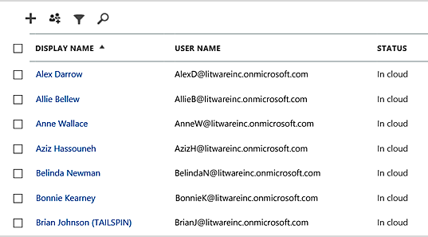
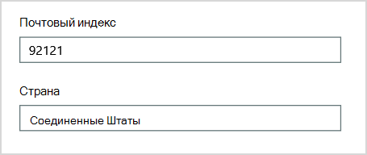
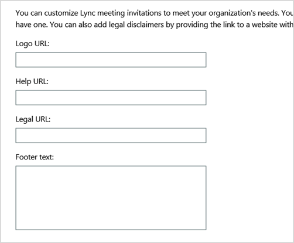

# <a name="why-you-need-to-use-powershell-for-microsoft-365"></a>Зачем использовать PowerShell для Microsoft 365

*Эта статья относится к Microsoft 365 корпоративный и Office 365 корпоративный.*

С помощью Центра администрирования Microsoft 365 вы можете управлять учетными записями и лицензиями пользователей Microsoft 365. Вы также можете управлять своими службами Microsoft 365, такими как Exchange Online, Teams и SharePoint Online. Если вместо этого вы используете PowerShell для управления этими службами, вы можете использовать среду командной строки и языка сценариев для скорости, автоматизации и дополнительных возможностей.
  
В этой статье показано, как использовать PowerShell для управления Microsoft 365 для:
  
- Раскрытие дополнительной информации, которую вы не видите в Центре администрирования Microsoft 365
    
- Настройка функций и параметров возможна только с помощью PowerShell
    
- Массовые операции
    
- Фильтрация данных
    
- Печать или сохранение данных
    
- Управление службами
    
Помните, что PowerShell для Microsoft 365 — это набор модулей для Windows PowerShell, которая является средой командной строки для служб и платформ windows. В этой среде создается язык командной оболочки, который можно расширить с помощью дополнительных модулей. Он предоставляет способ выполнения простых или сложных команд или сценариев. Например, после установки модулей PowerShell для Microsoft 365 и подключения к подписке на Microsoft 365 можно выполнить следующую команду, чтобы получить список всех почтовых ящиков пользователей для Microsoft Exchange Online:
  
```powershell
Get-Mailbox
```

Вы также можете получить список почтовых ящиков с помощью Центра администрирования Microsoft 365, но подсчет элементов во всех списках для всех сайтов для всех веб-приложений будет непростой задачей.
  
PowerShell для Microsoft 365 предназначен для управления Microsoft 365, а не для замены Центра администрирования Microsoft 365. Администраторы должны иметь возможность использовать PowerShell для Microsoft 365, так как существуют некоторые процедуры настройки, которые можно сделать только с помощью PowerShell для команд Microsoft 365. В таких случаях необходимо знать, как:
  
- Установите PowerShell для модулей Microsoft 365 (только один раз для каждого компьютера администратора).
    
- Подключите свою подписку на Microsoft 365 (один раз для каждого сеанса PowerShell).
    
- Соберите сведения, необходимые для запуска необходимых команд PowerShell для Microsoft 365.
    
- Запустите PowerShell для команд Microsoft 365.
    
После того как вы изучите эти базовые навыки, вам не придется перечислять пользователей почтовых ящиков с помощью команды **Get-Mailbox.** Вам также не нужно понимать, как создать команду, например указанную ранее, чтобы подсчитать все элементы во всех списках для всех сайтов для всех веб-приложений. Майкрософт и сообщество администраторов могут помочь вам с такими задачами при необходимости.
  
## <a name="powershell-for-microsoft-365-can-reveal-information-that-you-cant-see-with-the-microsoft-365-admin-center"></a>PowerShell для Microsoft 365 может раскрывать информацию, которую вы не видите в Центре администрирования Microsoft 365

В Центре администрирования Microsoft 365 отображается много полезной информации. Однако в нем не отображаются все возможные сведения, которые Microsoft 365 хранит о пользователях, лицензиях, почтовых ящиках и сайтах. Вот пример для пользователей и *групп в* Центре администрирования Microsoft 365:
  

  
Это представление предоставляет необходимую информацию во многих случаях. Однако иногда требуется больше. Например, лицензирование Microsoft 365 (и доступные пользователю функции Microsoft 365) частично зависит от географического расположения пользователя. Политики и функции, которые можно распространить на пользователя, который является пользователем в США, могут быть не теми, которые можно распространить на пользователя в Индии или Бельгии. Чтобы определить географическое положение пользователя, выполните следующие действия в Центре администрирования Microsoft 365:
  
1. Дважды щелкните **отображаемое имя** пользователя.
    
2. В области отображения свойств пользователя выберите **сведения.**
    
3. На экране сведений выберите **дополнительные сведения.**
    
4. Прокрутите страницу до тех пор, пока не найдете заголовок **"Страна или регион":**
    
     
  
5. Запишите отображаемое имя и местонахождение пользователя на лист бумаги или скопируйте и вставьте их в Блокнот.
    
Эту процедуру необходимо повторить для каждого пользователя. Если у вас много пользователей, этот процесс может быть утомительным. С помощью PowerShell для Microsoft 365 вы можете отобразить эти сведения для всех пользователей с помощью следующей команды:
  
```powershell
Get-AzureADUser | Select DisplayName, UsageLocation
```


>[!Note]
>PowerShell Core не поддерживает модуль Microsoft Azure Active Directory для Windows PowerShell и командлеты *с Msol* в их имени. Эти cmdlets необходимо запускать из Windows PowerShell.
>

Ниже приводится пример результатов.
  
```powershell
DisplayName                               UsageLocation
-----------                               -------------
Bonnie Kearney                            GB
Fabrice Canel                             BR
Brian Johnson (TAILSPIN)                  US
Anne Wallace                              US
Alex Darrow                               US
David Longmuir                            BR
```

Эта команда PowerShell получает всех пользователей в текущей подписке Microsoft 365 (**Get-AzureADUser),** но отображает только имя и расположение каждого пользователя (**Select DisplayName, UsageLocation).**
  
Так как PowerShell для Microsoft 365 поддерживает язык командной оболочки, вы можете дополнительно управлять информацией, полученной командой **Get-AzureADUser.** Например, вы хотите отсортировать этих пользователей по их расположению, сгруппировать всех пользователей из Бразилии, всех пользователей ИЗ США и так далее. Вот команда:
  
```powershell
Get-AzureADUser | Select DisplayName, UsageLocation | Sort UsageLocation, DisplayName
```

Ниже приводится пример результатов.
  
```powershell
DisplayName                                 UsageLocation
-----------                                 -------------
David Longmuir                              BR
Fabrice Canel                               BR
Bonnie Kearney                              GB
Alex Darrow                                 US
Anne Wallace                                US
Brian Johnson (TAILSPIN)                    US
```

Эта команда PowerShell получает всех пользователей в текущей подписке Microsoft 365, но отображает только имя и расположение каждого пользователя и сортировать их сначала по его расположению, а затем по имени **(Sort UsageLocation, DisplayName).**
  
Можно также использовать дополнительную фильтрацию. Например, если нужно просмотреть сведения о пользователях, находящихся в Бразилии, используйте следующую команду:
  
```powershell
Get-AzureADUser | Where {$_.UsageLocation -eq "BR"} | Select DisplayName, UsageLocation 
```

Ниже приводится пример результатов.
  
```powershell
DisplayName                                           UsageLocation
-----------                                           -------------
David Longmuir                                        BR
Fabrice Canel                                         BR
```

Эта команда PowerShell интер интерпретации: получить всех пользователей в текущей подписке Microsoft 365, чьи расположения в Бразилии (**Где {$ \_ . UsageLocation -eq "BR"}**) и отображение имени и расположения для каждого пользователя.
  
 **Примечание о больших доменах**
  
Если у вас большой домен с десятками тысяч пользователей, некоторые примеры, которые мы покажем в этой статье, могут привести к регулированием. В зависимости от таких факторов, как вычислительная мощность и доступная пропускная способность сети, вы можете пытаться сделать слишком много одновременно. Крупным организациям может потребоваться разделить некоторые из этих операций PowerShell на две команды.

Например, следующая команда возвращает все учетные записи пользователей и отображает имя и расположение для каждой из них:
  
```powershell
Get-AzureADUser | Select DisplayName, UsageLocation
```

Она отлично подходит для небольших доменов. Но в крупной организации может потребоваться разделить эту операцию на две команды: одну команду для хранения сведений об учетной записи пользователя в переменной, а другую для отображения необходимых сведений. Пример:
  
```powershell
$x = Get-AzureADUser
$x | Select DisplayName, UsageLocation
```

Этот набор команд PowerShell интер интерпретации:
1. Получите всех пользователей в текущей подписке Microsoft 365 и храните сведения в переменной $x (**$x = Get-AzureADUser).**
1.  Отображение содержимого переменной *$x,* но только имя и расположение для каждого пользователя (**$x | Выберите DisplayName, UsageLocation**).
  
## <a name="microsoft-365-has-features-that-you-can-only-configure-with-powershell-for-microsoft-365"></a>В Microsoft 365 есть функции, которые можно настроить только с помощью PowerShell для Microsoft 365

Центр администрирования Microsoft 365 предназначен для предоставления доступа к распространенным, полезным задачам администрирования, которые применяются к большинству сред. Другими словами, Центр администрирования Microsoft 365 был разработан таким образом, чтобы типичный администратор может выполнять наиболее распространенные задачи управления. Однако некоторые задачи нельзя выполнять в Центре администрирования.
  
Например, в Центре администрирования Skype для бизнеса Online есть несколько вариантов создания настраиваемого приглашения на собрания:
  

  
С помощью указанных ниже параметров приглашения на собрания можно сделать более персонализированными и профессиональными. Но параметры конфигурации собраний — это не просто создание настраиваемого приглашения на собрание. Например, по умолчанию собрания позволяют:
  
- анонимным пользователям автоматически присоединяться к каждому собранию;
    
- участникам записывать собрание;
    
- обозначать всех пользователей из вашей организации докладчиками при их присоединении к собранию.
    
Эти параметры недоступны в Центре администрирования Skype для бизнеса Online. Вы можете управлять ими в PowerShell для Microsoft 365. Вот команда, которая отключает эти три параметра:
  
```powershell
Set-CsMeetingConfiguration -AdmitAnonymousUsersByDefault $False -AllowConferenceRecording $False -DesignateAsPresenter "None"
```

> [!NOTE]
> Чтобы выполнить эту команду, необходимо установить модуль [PowerShell Skype для бизнеса Online. ](https://www.microsoft.com/download/details.aspx?id=39366)
  
Эта команда PowerShell интер интерпретация:
 
1. In the settings for new Skype for Business Online meetings (**Set-CsMeetingConfiguration**), disable allowing anonymous users to gain automatic entrance to meetings (**-AdmitAnonymousUsersByDefault $False**).
2.  Отключает возможность записи собраний участниками (**-AllowConferenceRecording $False).**
3. Не назначайте всех пользователей из вашей организации в качестве presenters (**-DesignateAsPresenter "None"**).
  
Чтобы восстановить эти параметры по умолчанию (включить параметры), запустите команду:
  
```powershell
Set-CsMeetingConfiguration -AdmitAnonymousUsersByDefault $True -AllowConferenceRecording $True -DesignateAsPresenter "Company"
```

Существуют и другие аналогичные сценарии, поэтому администраторам следует знать, как запускать PowerShell для команд Microsoft 365.
  
## <a name="powershell-for-microsoft-365-is-great-for-bulk-operations"></a>PowerShell для Microsoft 365 отлично подходит для массовых операций

Визуальные интерфейсы, такие как Центр администрирования Microsoft 365, являются наиболее ценными при одной операции. Например, если необходимо отключить одну учетную запись пользователя, вы можете быстро найти и очистить этот контрольный ящик с помощью Центра администрирования. Это может быть проще, чем выполнение аналогичной операции в PowerShell.
  
Но если вам нужно изменить множество вещей или некоторые выбранные в рамках большого набора других вещей, Центр администрирования Microsoft 365 может оказаться не лучшим средством. Например, вы должны изменить префикс для тысяч номеров телефонов или удалить определенного пользователя *Ken Myer* со всех сайтов SharePoint Online. Как это сделать в Центре администрирования Microsoft 365?
  
В последнем примере допустим, что у вас несколько сотен сайтов SharePoint Online, и вы не знаете, к каков из них входит Ken Meyer. Сначала необходимо запустить Центр администрирования Microsoft 365, а затем выполнить эту процедуру для каждого сайта:
  
1. Выберите **URL-адрес** сайта.
    
2. В поле **свойств коллекции сайтов** выберите ссылку **"Адрес** веб-сайта", чтобы открыть сайт.
    
3. На сайте выберите **"Поделиться".**
    
4. В **диалоговом** окне "Поделиться" выберите ссылку, где будут показаны все пользователи с разрешениями на доступ к сайту:
    
     
  
5. В **диалоговом окне "Общий** доступ" выберите **"Дополнительные".**
    
6. Прокрутите список пользователей вниз, найдите и выберите Ken Myer (при условии, что у него есть разрешения на доступ к сайту), а затем выберите "Удалить **разрешения пользователя".**
    
Это займет много *времени* для нескольких сотен сайтов.
  
Альтернативой является запуск следующей команды в PowerShell для Microsoft 365, чтобы удалить Кена Myer со всех сайтов:
  
```powershell
Get-SPOSite | ForEach {Remove-SPOUser -Site $_.Url -LoginName "kenmyer@litwareinc.com"}
```

> [!NOTE]
> Для этой команды необходимо установить модуль [SharePoint Online PowerShell.](https://docs.microsoft.com/powershell/sharepoint/sharepoint-online/connect-sharepoint-online?view=sharepoint-ps) 
  
Эта команда PowerShell может получить все сайты SharePoint в текущей подписке Microsoft 365 (**Get-SPOSite),** а для каждого сайта удалить Кена Мейера из списка пользователей, которые могут получить к нему доступ (**ForEach {Remove-SPOUser -Site $ \_ . Url -LoginName "kenmyer \@ litwareinc.com"}**).
  
Мы сообщите Microsoft 365, чтобы удалить Кена Мейера с каждого сайта, включая те, к кому у него нет доступа. Таким образом, в результатах покажутся ошибки для тех сайтов, к которые у него нет доступа. Мы можем использовать дополнительное условие для этой команды, чтобы удалить Кена Мейера только с сайтов, на которые он входит в список входа. Но возвращаемая ошибка не причинит вреда самим сайтам. На запуск этой команды для сотен сайтов может потребоваться несколько минут, а не часы работы в Центре администрирования Microsoft 365.
  
Вот еще один пример массовой операции. Используйте эту команду, чтобы добавить Нового администратора SharePoint Ленни *Киарни* на все сайты в организации:
  
```powershell
Get-SPOSite | ForEach {Add-SPOUser -Site $_.Url -LoginName "bkearney@litwareinc.com" -Group "Members"}
```

Эта команда PowerShell выполняет конечную точку: получите все сайты SharePoint в текущей подписке Microsoft 365 и для каждого сайта разрешите доступ к Этому сайту, добавив имя для входа в группу "Участники" сайта (**ForEach {Add-SPOUser -Site $ \_ . Url -LoginName "bkearney \@ litwareinc.com" -Group "Members"}**).
  
## <a name="powershell-for-microsoft-365-is-great-at-filtering-data"></a>PowerShell для Microsoft 365 отлично подходит для фильтрации данных

Центр администрирования Microsoft 365 предоставляет несколько способов фильтрации данных, чтобы легко найти целевое подмножество данных. Например, Exchange упрощает фильтрацию практически по любому свойству почтового ящика пользователя. Например, вот список почтовых ящиков для всех пользователей, которые являются пользователями города Блумингтон:
  

  
Центр администрирования Exchange также позволяет объединять критерии фильтрации. Например, можно найти почтовые ящики всех людей, которые работают в Блумингтоне и работают в финансовом отделе.
  
Однако существуют ограничения на действия, которые можно сделать в Центре администрирования Exchange. Например, вам не так просто найти почтовые ящики людей,  которые находятся в Блумингтоне или Сан-Орто, или почтовые ящики для всех людей, которые не находятся в г. Блумингтон.
  
Вы можете использовать следующую команду PowerShell для Microsoft 365, чтобы получить список почтовых ящиков для всех людей, которые живу в Блумингтоне или Сан-Кике:
  
```powershell
Get-User | Where {$_.RecipientTypeDetails -eq "UserMailbox" -and ($_.City -eq "San Diego" -or $_.City -eq "Bloomington")} | Select DisplayName, City
```

Ниже приводится пример результатов.
  
```powershell
DisplayName                              City
-----------                              ----
Alex Darrow                              San Diego
Bonnie Kearney                           San Diego
Julian Isla                              Bloomington
Rob Young                                Bloomington
```

Эта команда PowerShell выполняется так: получите всех пользователей в текущей подписке На Microsoft 365, у которых есть почтовый ящик в городе Сан-Орт или Блумингтон (**где {$ \_ . RecipientTypeDetails -eq "UserMailbox" -and ($ \_ . City -eq "San Дейс" -or $ \_ . City -eq "Bloomington")}**), and then display the name and city for each (**Select DisplayName, City**).
  
А вот команда для списка всех почтовых ящиков людей, которые где-либо, кроме Блумингтона:
  
```powershell
Get-User | Where {$_.RecipientTypeDetails -eq "UserMailbox" -and $_.City -ne "Bloomington"} | Select DisplayName, City
```

Ниже приводится пример результатов.
  
```powershell
DisplayName                               City
-----------                               ----
MOD Administrator                         Redmond
Alex Darrow                               San Diego
Allie Bellew                              Bellevue
Anne Wallace                              Louisville
Aziz Hassouneh                            Cairo
Belinda Newman                            Charlotte
Bonnie Kearney                            San Diego
David Longmuir                            Waukesha
Denis Dehenne                             Birmingham
Garret Vargas                             Seattle
Garth Fort                                Tulsa
Janet Schorr                              Bellevue
```

Эта команда PowerShell выполняется так: получите всех пользователей в текущей подписке Microsoft 365, почтовый ящик которых не находится в г. Блумингтон **(где {$ \_ . RecipientTypeDetails -eq "UserMailbox" -and $ \_ . City -ne "Bloomington"}**), а затем отобразить имя и город для каждого из них.
  
### <a name="use-wildcards"></a>Использование поддиаными знаками

Для совпадения части имени в фильтрах PowerShell также можно использовать поддиаными знаками. Например, предположим, что вы ищете учетную запись пользователя. Вы можете только запомнить, что фамилией пользователя был *Есенков* или, возможно, *Хельсон* или *Йоргенсон.*
  
Вы можете найти этого пользователя в Центре администрирования Microsoft 365 с помощью средства поиска и проведения трех различных поисковых запросов:
  
- *Андерсон*  ; 
    
- *Хендерсон*  ; 
    
- *Йоргенсон*  . 
    
Так как все три из этих имен заканчиваются на "son", вы можете сообщить PowerShell, чтобы отображались все пользователи, имена которых заканчиваются на "son". Вот команда:
  
```powershell
Get-User -Filter '{LastName -like "*son"}'
```

Эта команда PowerShell интер интерпретации: получить всех пользователей в текущей подписке Microsoft 365, но использовать фильтр, который перечисляет только пользователей, фамилии которых заканчиваются на "son" (**-Filter '{LastName -like " \* son"}'**). Означает любой набор символов, которые являются буквами в фамилии \* пользователя.
  
## <a name="powershell-for-microsoft-365-makes-it-easy-to-print-or-save-data"></a>PowerShell для Microsoft 365 упрощает печать и сохранение данных

Центр администрирования Microsoft 365 позволяет просматривать списки данных. Вот пример центра администрирования Skype для бизнеса Online, отображающий список пользователей, которым был включен Доступ к Skype для бизнеса Online:
  

  
Чтобы сохранить эти сведения в файл, необходимо в paste it into a document or Microsoft Excel worksheet. В любом случае может потребоваться дополнительное форматирование. Кроме того, Центр администрирования Microsoft 365 не предоставляет способ непосредственной печати отображаемого списка.
  
К счастью, с помощью PowerShell можно не только отобразить список, но и сохранить его в файл, который можно легко импортировать в Excel. Вот пример команды для сохранения пользовательских данных Skype для бизнеса Online в CSV-файл, который можно легко импортировать в качестве таблицы на листах Excel:
  
```powershell
Get-CsOnlineUser | Select DisplayName, UserPrincipalName, UsageLocation | Export-Csv -Path "C:\Logs\SfBUsers.csv" -NoTypeInformation
```

Ниже приводится пример результатов.
  

  
Эта команда PowerShell интер интерпретации: получить всех пользователей Skype для бизнеса Online в текущей подписке Microsoft 365 (**Get-CsOnlineUser**); получение только имени пользователя, имени пользователя и расположения (**Select DisplayName, UserPrincipalName, UsageLocation);** затем сохраните эти сведения в CSV-файле C: \\ Logs \\SfBUsers.csv (**Export-Csv -Path "C: \\ Logs \\SfBUsers.csv" -NoTypeInformation).**
  
Вы также можете использовать параметры для сохранения этого списка в формате XML-файла или HTML-страницы. На самом деле с помощью дополнительных команд PowerShell вы можете сохранить его непосредственно в виде файла Excel с любым пользовательским форматированием.
  
Вы также можете отправить выходные данные команды PowerShell, которая отображает список непосредственно на принтере по умолчанию в Windows. Вот пример команды:
  
```powershell
Get-CsOnlineUser | Select DisplayName, UserPrincipalName, UsageLocation | Out-Printer
```

Ниже показано, как будет выглядеть напечатанный документ.
  

  
Эта команда PowerShell интер интерпретация: получить всех пользователей Skype для бизнеса Online в текущей подписке Microsoft 365; получение только имени пользователя, имени пользователя и расположения; а затем отправьте эти сведения на принтер Windows по умолчанию (**Out-Printer).**
  
Печатный документ имеет такое же простое форматирование, как и отображение в командном окне PowerShell. Чтобы получить твердую копию, просто добавьте | **Вне принтера** до конца команды.
  
## <a name="powershell-for-microsoft-365-lets-you-manage-across-server-products"></a>PowerShell для Microsoft 365 позволяет управлять серверным продуктом

Компоненты, составляющие Microsoft 365, предназначены для совместной работы. Например, предположим, что вы добавили нового пользователя в Microsoft 365 и указали такие сведения, как его отдел и номер телефона. Эти сведения будут доступны при доступе к сведениям пользователя в любой из служб Microsoft 365: Skype для бизнеса Online, Exchange или SharePoint.
  
Это общие сведения, распространяющиеся на набор продуктов. Информация о продукте, например сведения о почтовом ящике Exchange пользователя, обычно недоступна в наборе. Например, сведения о том, включен ли почтовый ящик пользователя, доступны только в Центре администрирования Exchange.
  
Предположим, вы хотите создать отчет со следующим сведениями обо всех пользователях:
  
- краткое имя пользователя;
    
- Имеет ли пользователь лицензию на Microsoft 365
    
- включен ли почтовый ящик Exchange пользователя;
    
- включено ли для пользователя приложение Skype для бизнеса Online.
    
Вы не можете легко создать такой отчет в Центре администрирования Microsoft 365. Вместо этого необходимо создать отдельный документ для хранения информации, например листа Excel. Затем получите все имена пользователей и сведения о лицензировании в Центре администрирования Microsoft 365, получите сведения о почтовом ящике из Центра администрирования Exchange, получите сведения о Skype для бизнеса Online из Центра администрирования Skype для бизнеса Online, а затем объединяйте эти сведения.
  
Альтернативой является использование скрипта PowerShell для компиляции отчета.
  
В следующем примере сценарий сложнее, чем команды, которые вы уже видели в этой статье. Однако он показывает возможность использования PowerShell для создания представлений информации, которые сложно получить в противном случае. Вот сценарий для компиляции и отображения нужного списка:
  
```powershell
$x = Get-AzureADUser

foreach ($i in $x)
    {
      $y = Get-Mailbox -Identity $i.UserPrincipalName
      $i | Add-Member -MemberType NoteProperty -Name IsMailboxEnabled -Value $y.IsMailboxEnabled

      $y = Get-CsOnlineUser -Identity $i.UserPrincipalName
      $i | Add-Member -MemberType NoteProperty -Name EnabledForSfB -Value $y.Enabled
    }

$x | Select DisplayName, IsLicensed, IsMailboxEnabled, EnabledforSfB
```

Ниже приводится пример результатов.
  
```powershell
DisplayName             IsLicensed   IsMailboxEnabled   EnabledForSfB
-----------             ----------   ----------------   --------------
Bonnie Kearney          True         True               True
Fabrice Canel           True         True               True
Brian Johnson           False        True               False
Anne Wallace            True         True               True
Alex Darrow             True         True               True
David Longmuir          True         True               True
Katy Jordan             False        True               False
Molly Dempsey           False        True               False
```

Этот сценарий PowerShell интер интерпретации:  

1. Получите всех пользователей в текущей подписке Microsoft 365 и храните сведения в переменной с именем *$x* (**$x = Get-AzureADUser).**
1. Запустите цикл, который выполняется над всеми пользователями в переменной $x (**foreach ($i в $x).**  
1. Определите переменную *с именем $y* и храните в ней сведения о почтовом ящике пользователя (**$y = Get-Mailbox -Identity $i.UserPrincipalName).**
1. Добавьте новое свойство к сведениям о пользователе с именем *IsMailBoxEnabled.* Установите для него значение свойства IsMailBoxEnabled почтового ящика пользователя (**$i | Add-Member -MemberType NoteProperty -Name IsMailboxEnabled -Value $y.IsMailboxEnabled**).
1. Определите переменную *с именем $y* и храните в ней сведения о Skype для бизнеса Online пользователя (**$y = Get-CsOnlineUser -Identity $i.UserPrincipalName).**
1. Добавьте новое свойство к сведениям о пользователе с именем *EnabledForSfB.* Установите для него значение свойства Enabled сведений о Skype для бизнеса Online пользователя (**$i | Add-Member -MemberType NoteProperty -Name EnabledForSfB -Value $y.Enabled).**
1. Отображает список пользователей, но включает только их имя, лицензируются ли они, и два новых свойства, которые указывают, включен ли их почтовый ящик и включена ли для них Skype для бизнеса Online **($x | Выберите DisplayName, IsLicensed, IsMailboxEnabled, EnabledforSfB).**
  
## <a name="see-also"></a>См. также

[Начало работы с PowerShell для Microsoft 365](getting-started-with-microsoft-365-powershell.md)
  
[Управление учетными записями пользователей Microsoft 365, лицензиями и группами с помощью PowerShell](manage-user-accounts-and-licenses-with-microsoft-365-powershell.md)
  
[Использование Windows PowerShell для создания отчетов в Microsoft 365](use-windows-powershell-to-create-reports-in-microsoft-365.md)
