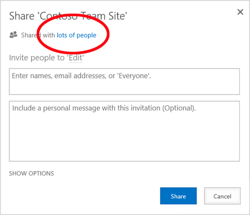

# <a name="why-you-need-to-use-powershell-for-microsoft-365"></a><span data-ttu-id="5cacd-103">Зачем использовать PowerShell для Microsoft 365</span><span class="sxs-lookup"><span data-stu-id="5cacd-103">Why you need to use PowerShell for Microsoft 365</span></span>

<span data-ttu-id="5cacd-104">*Эта статья относится к Microsoft 365 корпоративный и Office 365 корпоративный.*</span><span class="sxs-lookup"><span data-stu-id="5cacd-104">*This article applies to both Microsoft 365 Enterprise and Office 365 Enterprise.*</span></span>

<span data-ttu-id="5cacd-105">Центр администрирования Microsoft 365 может управлять учетными записями и лицензиями пользователей Microsoft 365.</span><span class="sxs-lookup"><span data-stu-id="5cacd-105">With the Microsoft 365 admin center, you can manage your Microsoft 365 user accounts and licenses.</span></span> <span data-ttu-id="5cacd-106">Вы также можете управлять службами Microsoft 365, такими как Exchange Online, Teams и SharePoint Online.</span><span class="sxs-lookup"><span data-stu-id="5cacd-106">You can also manage your Microsoft 365 services, such as Exchange Online, Teams, and SharePoint Online.</span></span> <span data-ttu-id="5cacd-107">Если вместо этого использовать PowerShell для управления этими службами, вы можете использовать языковую среду командной строки и сценариев для скорости, автоматизации и дополнительных возможностей.</span><span class="sxs-lookup"><span data-stu-id="5cacd-107">If you instead use PowerShell to manage these services, you can and take advantage of the command-line and scripting language environment for speed, automation, and additional capabilities.</span></span>
  
<span data-ttu-id="5cacd-108">В этой статье показано, как использовать PowerShell для управления Microsoft 365 для:</span><span class="sxs-lookup"><span data-stu-id="5cacd-108">This article shows how to use PowerShell to manage Microsoft 365 to:</span></span>
  
- <span data-ttu-id="5cacd-109">Раскройте дополнительные сведения, которые не видятся в центре администрирования Microsoft 365</span><span class="sxs-lookup"><span data-stu-id="5cacd-109">Reveal additional information that you can't see in the Microsoft 365 admin center</span></span>
    
- <span data-ttu-id="5cacd-110">Настройка функций и параметров возможна только с помощью PowerShell</span><span class="sxs-lookup"><span data-stu-id="5cacd-110">Configure features and settings only possible with PowerShell</span></span>
    
- <span data-ttu-id="5cacd-111">Сделайте массовые операции</span><span class="sxs-lookup"><span data-stu-id="5cacd-111">Do bulk operations</span></span>
    
- <span data-ttu-id="5cacd-112">Фильтрация данных</span><span class="sxs-lookup"><span data-stu-id="5cacd-112">Filter data</span></span>
    
- <span data-ttu-id="5cacd-113">Печать или сохранение данных</span><span class="sxs-lookup"><span data-stu-id="5cacd-113">Print or save data</span></span>
    
- <span data-ttu-id="5cacd-114">Управление между службами</span><span class="sxs-lookup"><span data-stu-id="5cacd-114">Manage across services</span></span>
    
<span data-ttu-id="5cacd-115">Помните, что PowerShell для Microsoft 365 — это набор модулей для Windows PowerShell, который является командной средой для служб и платформ на основе Windows.</span><span class="sxs-lookup"><span data-stu-id="5cacd-115">Keep in mind that PowerShell for Microsoft 365 is a set of modules for Windows PowerShell, which is a command-line environment for Windows-based services and platforms.</span></span> <span data-ttu-id="5cacd-116">Эта среда создает язык командной оболочки, который можно расширить с помощью дополнительных модулей.</span><span class="sxs-lookup"><span data-stu-id="5cacd-116">This environment creates a command-shell language that can be extended with additional modules.</span></span> <span data-ttu-id="5cacd-117">Это позволяет выполнять простые или сложные команды или сценарии.</span><span class="sxs-lookup"><span data-stu-id="5cacd-117">It provides a way to execute simple or complex commands or scripts.</span></span> <span data-ttu-id="5cacd-118">Например, после установки модулей PowerShell для Microsoft 365 и подключения к подписке Microsoft 365 можно выполнить следующую команду, чтобы перечислить все почтовые ящики пользователей для Microsoft Exchange Online:</span><span class="sxs-lookup"><span data-stu-id="5cacd-118">For example, after you install the PowerShell for Microsoft 365 modules and connect to your Microsoft 365 subscription, you can run the following command to list all the user mailboxes for Microsoft Exchange Online:</span></span>
  
```powershell
Get-Mailbox
```

<span data-ttu-id="5cacd-119">Список почтовых ящиков можно также получить с помощью центра администрирования Microsoft 365, но пересчитать элементы во всех списках для всех сайтов для всех веб-приложений непросто.</span><span class="sxs-lookup"><span data-stu-id="5cacd-119">You could also get the list of mailboxes by using the Microsoft 365 admin center but counting the items in all the lists for all the sites for all of your web apps isn't easy.</span></span>
  
<span data-ttu-id="5cacd-120">PowerShell для Microsoft 365 предназначена для управления Microsoft 365, а не для замены центра администрирования Microsoft 365.</span><span class="sxs-lookup"><span data-stu-id="5cacd-120">PowerShell for Microsoft 365 is designed to help you manage Microsoft 365, not to replace the Microsoft 365 admin center.</span></span> <span data-ttu-id="5cacd-121">Администраторы должны иметь возможность использовать PowerShell для Microsoft 365, так как существуют некоторые процедуры конфигурации, которые можно сделать только с помощью PowerShell для команд Microsoft 365.</span><span class="sxs-lookup"><span data-stu-id="5cacd-121">Admins need to be able to use PowerShell for Microsoft 365 because there are some configuration procedures that can only be done through PowerShell for Microsoft 365 commands.</span></span> <span data-ttu-id="5cacd-122">В этих случаях необходимо знать, как:</span><span class="sxs-lookup"><span data-stu-id="5cacd-122">For these cases, you need to know how to:</span></span>
  
- <span data-ttu-id="5cacd-123">Установка модулей PowerShell для Microsoft 365 (только один раз для каждого компьютера администратора).</span><span class="sxs-lookup"><span data-stu-id="5cacd-123">Install the PowerShell for Microsoft 365 modules (done only one time for each administrator computer).</span></span>
    
- <span data-ttu-id="5cacd-124">Подключение к подписке Microsoft 365 (один раз для каждого сеанса PowerShell).</span><span class="sxs-lookup"><span data-stu-id="5cacd-124">Connect to your Microsoft 365 subscription (one time for each PowerShell session).</span></span>
    
- <span data-ttu-id="5cacd-125">Сбор сведений, необходимых для запуска требуемой powerShell для команд Microsoft 365.</span><span class="sxs-lookup"><span data-stu-id="5cacd-125">Gather the information needed to run the required PowerShell for Microsoft 365 commands.</span></span>
    
- <span data-ttu-id="5cacd-126">Запустите PowerShell для команд Microsoft 365.</span><span class="sxs-lookup"><span data-stu-id="5cacd-126">Run PowerShell for Microsoft 365 commands.</span></span>
    
<span data-ttu-id="5cacd-127">После получения этих базовых навыков не нужно перечислять пользователей почтовых ящиков с помощью команды **Get-Mailbox.**</span><span class="sxs-lookup"><span data-stu-id="5cacd-127">After you learn these basic skills, you don't have to list your mailbox users by using the **Get-Mailbox** command.</span></span> <span data-ttu-id="5cacd-128">Вам также не нужно понимать, как создать новую команду, как указанная ранее команда, чтобы подсчитать все элементы во всех списках для всех сайтов для всех веб-приложений.</span><span class="sxs-lookup"><span data-stu-id="5cacd-128">You also don't have to understand how to create a new command like the command cited previously to count all the items in all the lists for all the sites for all of your web apps.</span></span> <span data-ttu-id="5cacd-129">Корпорация Майкрософт и сообщество администраторов могут помочь вам в таких задачах при необходимости.</span><span class="sxs-lookup"><span data-stu-id="5cacd-129">Microsoft and the community of administrators can help you with such tasks as needed.</span></span>
  
## <a name="powershell-for-microsoft-365-can-reveal-information-that-you-cant-see-with-the-microsoft-365-admin-center"></a><span data-ttu-id="5cacd-130">PowerShell для Microsoft 365 может раскрывать сведения, которые нельзя увидеть в центре администрирования Microsoft 365</span><span class="sxs-lookup"><span data-stu-id="5cacd-130">PowerShell for Microsoft 365 can reveal information that you can't see with the Microsoft 365 admin center</span></span>

<span data-ttu-id="5cacd-131">Центр администрирования Microsoft 365 отображает множество полезных сведений.</span><span class="sxs-lookup"><span data-stu-id="5cacd-131">The Microsoft 365 admin center displays many useful information.</span></span> <span data-ttu-id="5cacd-132">Но в нем не отображаются все возможные сведения, которые хранит Microsoft 365 о пользователях, лицензиях, почтовых ящиках и сайтах.</span><span class="sxs-lookup"><span data-stu-id="5cacd-132">But it doesn't display all the possible information that Microsoft 365 stores about users, licenses, mailboxes, and sites.</span></span> <span data-ttu-id="5cacd-133">Вот пример для  пользователей и групп в центре администрирования Microsoft 365:</span><span class="sxs-lookup"><span data-stu-id="5cacd-133">Here's an example for *users and groups* in the Microsoft 365 admin center:</span></span>
  

  
<span data-ttu-id="5cacd-135">В этом представлении содержится необходимая во многих случаях информация.</span><span class="sxs-lookup"><span data-stu-id="5cacd-135">This view provides the information that you need in many cases.</span></span> <span data-ttu-id="5cacd-136">Тем не менее, есть моменты, когда вам нужно больше.</span><span class="sxs-lookup"><span data-stu-id="5cacd-136">However, there are times when you need more.</span></span> <span data-ttu-id="5cacd-137">Например, лицензирование Microsoft 365 (и доступные пользователю функции Microsoft 365) частично зависит от географического расположения пользователя.</span><span class="sxs-lookup"><span data-stu-id="5cacd-137">For example, Microsoft 365 licensing (and the Microsoft 365 features available to a user) depends in part on the user's geographic location.</span></span> <span data-ttu-id="5cacd-138">Политики и функции, которые можно распространить на пользователя, который живет в США, могут быть не теми, которые можно распространить на пользователя в Индии или Бельгии.</span><span class="sxs-lookup"><span data-stu-id="5cacd-138">The policies and features that you can extend to a user who lives in the United States might not be the same as those that you can extend to a user in India or Belgium.</span></span> <span data-ttu-id="5cacd-139">Выполните следующие действия в центре администрирования Microsoft 365, чтобы определить географическое расположение пользователя:</span><span class="sxs-lookup"><span data-stu-id="5cacd-139">Follow these steps in the Microsoft 365 admin center to determine a user's geographic location:</span></span>
  
1. <span data-ttu-id="5cacd-140">Дважды щелкните **отображаемое имя** пользователя.</span><span class="sxs-lookup"><span data-stu-id="5cacd-140">Double-click the user's **Display Name**.</span></span>
    
2. <span data-ttu-id="5cacd-141">В области отображения свойств пользователя выберите **сведения.**</span><span class="sxs-lookup"><span data-stu-id="5cacd-141">In the user properties display pane, select **details**.</span></span>
    
3. <span data-ttu-id="5cacd-142">В дисплее сведений выберите **дополнительные сведения.**</span><span class="sxs-lookup"><span data-stu-id="5cacd-142">In the details display, select **additional details**.</span></span>
    
4. <span data-ttu-id="5cacd-143">Прокрутите, пока не найдете **заголовки Страна или регион:**</span><span class="sxs-lookup"><span data-stu-id="5cacd-143">Scroll until you find the heading **Country or region**:</span></span>
    
     
  
5. <span data-ttu-id="5cacd-145">Запишите отображаемое имя и местонахождение пользователя на лист бумаги или скопируйте и вставьте их в Блокнот.</span><span class="sxs-lookup"><span data-stu-id="5cacd-145">Write the user's display name and location on a piece of paper, or copy and paste it into Notepad.</span></span>
    
<span data-ttu-id="5cacd-146">Эту процедуру необходимо повторить для каждого пользователя.</span><span class="sxs-lookup"><span data-stu-id="5cacd-146">You must repeat this procedure for each user.</span></span> <span data-ttu-id="5cacd-147">Если у вас много пользователей, этот процесс может быть утомительным.</span><span class="sxs-lookup"><span data-stu-id="5cacd-147">If you have many users, this process can be tedious.</span></span> <span data-ttu-id="5cacd-148">С помощью PowerShell для Microsoft 365 вы можете отобразить эти сведения для всех пользователей, используя следующую команду:</span><span class="sxs-lookup"><span data-stu-id="5cacd-148">With PowerShell for Microsoft 365, you can display this information for all of your users by using the following command:</span></span>
  
```powershell
Get-AzureADUser | Select DisplayName, UsageLocation
```


>[!Note]
><span data-ttu-id="5cacd-149">PowerShell Core не поддерживает модуль Microsoft Azure Active Directory для Windows PowerShell и командлетов с *Msol* в их имени.</span><span class="sxs-lookup"><span data-stu-id="5cacd-149">PowerShell Core doesn't support the Microsoft Azure Active Directory Module for Windows PowerShell module and cmdlets that have *Msol* in their name.</span></span> <span data-ttu-id="5cacd-150">Вы должны запустить эти комлеты из Windows PowerShell.</span><span class="sxs-lookup"><span data-stu-id="5cacd-150">You have to run these cmdlets from Windows PowerShell.</span></span>
>

<span data-ttu-id="5cacd-151">Вот пример результатов.</span><span class="sxs-lookup"><span data-stu-id="5cacd-151">Here's an example of the results:</span></span>
  
```powershell
DisplayName                               UsageLocation
-----------                               -------------
Bonnie Kearney                            GB
Fabrice Canel                             BR
Brian Johnson (TAILSPIN)                  US
Anne Wallace                              US
Alex Darrow                               US
David Longmuir                            BR
```

<span data-ttu-id="5cacd-152">Интерпретация этой команды PowerShell: получите всех пользователей в текущей подписке Microsoft 365 **(Get-AzureADUser),** но только отобразить имя и расположение для каждого пользователя **(Выберите DisplayName, UseLocation**).</span><span class="sxs-lookup"><span data-stu-id="5cacd-152">The interpretation of this PowerShell command is: Get all of the users in the current Microsoft 365 subscription (**Get-AzureADUser**), but only display the name and location for each user (**Select DisplayName, UsageLocation**).</span></span>
  
<span data-ttu-id="5cacd-153">Так как PowerShell для Microsoft 365 поддерживает язык командной оболочки, можно дополнительно управлять сведениями, полученными командой **Get-AzureADUser.**</span><span class="sxs-lookup"><span data-stu-id="5cacd-153">Because PowerShell for Microsoft 365 supports a command-shell language, you can further manipulate the information obtained by the **Get-AzureADUser** command.</span></span> <span data-ttu-id="5cacd-154">Например, может быть, вы хотите сортировать этих пользователей по их расположению, сгруппировать всех бразильских пользователей, всех пользователей Соединенных Штатов вместе и так далее.</span><span class="sxs-lookup"><span data-stu-id="5cacd-154">For example, maybe you'd like to sort these users by their location, grouping all the Brazilian users together, all the United States users together, and so on.</span></span> <span data-ttu-id="5cacd-155">Вот команда:</span><span class="sxs-lookup"><span data-stu-id="5cacd-155">Here's the command:</span></span>
  
```powershell
Get-AzureADUser | Select DisplayName, UsageLocation | Sort UsageLocation, DisplayName
```

<span data-ttu-id="5cacd-156">Вот пример результатов.</span><span class="sxs-lookup"><span data-stu-id="5cacd-156">Here's an example of the results:</span></span>
  
```powershell
DisplayName                                 UsageLocation
-----------                                 -------------
David Longmuir                              BR
Fabrice Canel                               BR
Bonnie Kearney                              GB
Alex Darrow                                 US
Anne Wallace                                US
Brian Johnson (TAILSPIN)                    US
```

<span data-ttu-id="5cacd-157">Интерпретация этой команды PowerShell: получите всех пользователей в текущей подписке Microsoft 365, но отобразить имя и расположение только для каждого пользователя и сортировать их сначала по расположению, а затем их имени **(Sort UseLocation, DisplayName**).</span><span class="sxs-lookup"><span data-stu-id="5cacd-157">The interpretation of this PowerShell command is: Get all the users in the current Microsoft 365 subscription, but only display the name and location for each user and sort them first by their location and then their name (**Sort UsageLocation, DisplayName**).</span></span>
  
<span data-ttu-id="5cacd-158">Можно также использовать дополнительную фильтрацию.</span><span class="sxs-lookup"><span data-stu-id="5cacd-158">You can also use additional filtering.</span></span> <span data-ttu-id="5cacd-159">Например, если нужно просмотреть сведения о пользователях, находящихся в Бразилии, используйте следующую команду:</span><span class="sxs-lookup"><span data-stu-id="5cacd-159">For example, if you only want to see information about users based in Brazil, use this command:</span></span>
  
```powershell
Get-AzureADUser | Where {$_.UsageLocation -eq "BR"} | Select DisplayName, UsageLocation 
```

<span data-ttu-id="5cacd-160">Вот пример результатов.</span><span class="sxs-lookup"><span data-stu-id="5cacd-160">Here's an example of the results:</span></span>
  
```powershell
DisplayName                                           UsageLocation
-----------                                           -------------
David Longmuir                                        BR
Fabrice Canel                                         BR
```

<span data-ttu-id="5cacd-161">Интерпретация этой команды PowerShell: получите всех пользователей в текущей подписке Microsoft 365, расположение которой Бразилия (**Where {$ \_ . UseLocation -eq "BR"} и** затем отображает имя и расположение для каждого пользователя.</span><span class="sxs-lookup"><span data-stu-id="5cacd-161">The interpretation of this PowerShell command is: Get all the users in the current Microsoft 365 subscription whose location is Brazil (**Where {$\_.UsageLocation -eq "BR"}**) and then display the name and location for each user.</span></span>
  
 <span data-ttu-id="5cacd-162">**Примечание о больших доменах**</span><span class="sxs-lookup"><span data-stu-id="5cacd-162">**A note about large domains**</span></span>
  
<span data-ttu-id="5cacd-163">Если у вас есть большой домен с десятками тысяч пользователей, некоторые примеры, которые мы показывем в этой статье, могут привести к регулирование.</span><span class="sxs-lookup"><span data-stu-id="5cacd-163">If you have a large domain with tens of thousands of users, trying some of the examples we show in this article could lead to throttling.</span></span> <span data-ttu-id="5cacd-164">В зависимости от таких факторов, как вычислительная мощность и доступная пропускная способность сети, вы можете одновременно пытаться сделать слишком много.</span><span class="sxs-lookup"><span data-stu-id="5cacd-164">Based on factors like computing power and available network bandwidth, you may be trying to do too much at one time.</span></span> <span data-ttu-id="5cacd-165">Крупные организации могут разделить некоторые из этих операций PowerShell на две команды.</span><span class="sxs-lookup"><span data-stu-id="5cacd-165">Large organizations might want to split some of these PowerShell operations into two commands.</span></span>

<span data-ttu-id="5cacd-166">Например, следующая команда возвращает все учетные записи пользователей и показывает имя и расположение для каждой из них:</span><span class="sxs-lookup"><span data-stu-id="5cacd-166">For example, the following command returns all the user accounts and shows the name and location for each:</span></span>
  
```powershell
Get-AzureADUser | Select DisplayName, UsageLocation
```

<span data-ttu-id="5cacd-167">Она отлично подходит для небольших доменов.</span><span class="sxs-lookup"><span data-stu-id="5cacd-167">That works great for smaller domains.</span></span> <span data-ttu-id="5cacd-168">Но в крупной организации эту операцию можно разделить на две команды: одну команду для хранения сведений об учетной записи пользователя в переменной, а другую для отображения необходимых сведений.</span><span class="sxs-lookup"><span data-stu-id="5cacd-168">But in a large organization, you might want to split that operation into two commands: one command to store the user account information in a variable and another to display the needed information.</span></span> <span data-ttu-id="5cacd-169">Пример:</span><span class="sxs-lookup"><span data-stu-id="5cacd-169">Here's an example:</span></span>
  
```powershell
$x = Get-AzureADUser
$x | Select DisplayName, UsageLocation
```

<span data-ttu-id="5cacd-170">Интерпретация этого набора команд PowerShell:</span><span class="sxs-lookup"><span data-stu-id="5cacd-170">The interpretation of this set of PowerShell commands is:</span></span>
1. <span data-ttu-id="5cacd-171">Получите всех пользователей текущей подписки Microsoft 365 и храните сведения в переменной с именем $x **($x = Get-AzureADUser).**</span><span class="sxs-lookup"><span data-stu-id="5cacd-171">Get all the users in the current Microsoft 365 subscription and store the information in a variable named $x (**$x = Get-AzureADUser**).</span></span>
1.  <span data-ttu-id="5cacd-172">Отображение содержимого переменной *$x,* но только имя и расположение для **каждого пользователя ($x | Выберите DisplayName, UseLocation**).</span><span class="sxs-lookup"><span data-stu-id="5cacd-172">Display the contents of the variable *$x*, but only include the name and location for each user (**$x | Select DisplayName, UsageLocation**).</span></span>
  
## <a name="microsoft-365-has-features-that-you-can-only-configure-with-powershell-for-microsoft-365"></a><span data-ttu-id="5cacd-173">В Microsoft 365 есть функции, которые можно настроить только с помощью PowerShell для Microsoft 365</span><span class="sxs-lookup"><span data-stu-id="5cacd-173">Microsoft 365 has features that you can only configure with PowerShell for Microsoft 365</span></span>

<span data-ttu-id="5cacd-174">Центр администрирования Microsoft 365 предназначен для предоставления доступа к общим полезным административным задачам, которые применяются к большинству сред.</span><span class="sxs-lookup"><span data-stu-id="5cacd-174">The Microsoft 365 admin center is intended to provide access to common, useful administrative tasks that apply to most environments.</span></span> <span data-ttu-id="5cacd-175">Другими словами, центр администрирования Microsoft 365 был разработан таким образом, чтобы типичный администратор может выполнять наиболее распространенные задачи управления.</span><span class="sxs-lookup"><span data-stu-id="5cacd-175">In other words, the Microsoft 365 admin center was designed so that the typical administrator can carry out the most-common management tasks.</span></span> <span data-ttu-id="5cacd-176">Но есть некоторые задачи, которые не могут быть сделаны в центре администрирования.</span><span class="sxs-lookup"><span data-stu-id="5cacd-176">But there are some tasks that can't be done in the admin center.</span></span>
  
<span data-ttu-id="5cacd-177">Например, центр администрирования Skype для бизнеса Online предоставляет несколько вариантов создания настраиваемого приглашения на собрания:</span><span class="sxs-lookup"><span data-stu-id="5cacd-177">For example, the Skype for Business Online admin center provides a few options for creating custom meeting invitations:</span></span>
  

  
<span data-ttu-id="5cacd-179">С помощью указанных ниже параметров приглашения на собрания можно сделать более персонализированными и профессиональными.</span><span class="sxs-lookup"><span data-stu-id="5cacd-179">With these settings, you can add a touch of personalization and professionalism to meeting invitations.</span></span> <span data-ttu-id="5cacd-180">Но параметров конфигурации собраний больше, чем просто создание настраиваемого приглашения на собрания.</span><span class="sxs-lookup"><span data-stu-id="5cacd-180">But there's more to meeting-configuration settings than simply creating custom meeting invitations.</span></span> <span data-ttu-id="5cacd-181">Например, по умолчанию собрания позволяют:</span><span class="sxs-lookup"><span data-stu-id="5cacd-181">For example, by default, meetings allow:</span></span>
  
- <span data-ttu-id="5cacd-182">анонимным пользователям автоматически присоединяться к каждому собранию;</span><span class="sxs-lookup"><span data-stu-id="5cacd-182">Anonymous users to gain automatic entrance to each meeting.</span></span>
    
- <span data-ttu-id="5cacd-183">участникам записывать собрание;</span><span class="sxs-lookup"><span data-stu-id="5cacd-183">Attendees to record the meeting.</span></span>
    
- <span data-ttu-id="5cacd-184">обозначать всех пользователей из вашей организации докладчиками при их присоединении к собранию.</span><span class="sxs-lookup"><span data-stu-id="5cacd-184">All users from your organization to be designated as presenters when they join the meeting.</span></span>
    
<span data-ttu-id="5cacd-185">Эти параметры недоступны в центре администрирования Skype для бизнеса Online.</span><span class="sxs-lookup"><span data-stu-id="5cacd-185">These settings aren't available from the Skype for Business Online admin center.</span></span> <span data-ttu-id="5cacd-186">Вы можете управлять ими из PowerShell для Microsoft 365.</span><span class="sxs-lookup"><span data-stu-id="5cacd-186">You can control them from PowerShell for Microsoft 365.</span></span> <span data-ttu-id="5cacd-187">Вот команда, которая отключает эти три параметра:</span><span class="sxs-lookup"><span data-stu-id="5cacd-187">Here's a command that disables these three settings:</span></span>
  
```powershell
Set-CsMeetingConfiguration -AdmitAnonymousUsersByDefault $False -AllowConferenceRecording $False -DesignateAsPresenter "None"
```

> [!NOTE]
> <span data-ttu-id="5cacd-188">Чтобы выполнить эту команду, необходимо установить [модуль PowerShell Skype для бизнеса Online. ](https://www.microsoft.com/download/details.aspx?id=39366)</span><span class="sxs-lookup"><span data-stu-id="5cacd-188">To run this command, you must install the [Skype for Business Online PowerShell Module ](https://www.microsoft.com/download/details.aspx?id=39366).</span></span>
  
<span data-ttu-id="5cacd-189">Интерпретация этой команды PowerShell:</span><span class="sxs-lookup"><span data-stu-id="5cacd-189">The interpretation of this PowerShell command is:</span></span>
 
1. <span data-ttu-id="5cacd-190">В параметрах новых собраний Skype для бизнеса Online **(Set-CsMeetingConfiguration)** отключать доступ анонимных пользователей к автоматическому входу на собрания **(-AdmitAnonymousUsersByDefault $False).**</span><span class="sxs-lookup"><span data-stu-id="5cacd-190">In the settings for new Skype for Business Online meetings (**Set-CsMeetingConfiguration**), disable allowing anonymous users to gain automatic entrance to meetings (**-AdmitAnonymousUsersByDefault $False**).</span></span>
2.  <span data-ttu-id="5cacd-191">Отключение возможности для участников записывать собрания **(-AllowConferenceRecording $False).**</span><span class="sxs-lookup"><span data-stu-id="5cacd-191">Disable the ability for attendees to record meetings (**-AllowConferenceRecording $False**).</span></span>
3. <span data-ttu-id="5cacd-192">Не назначайте всех пользователей из вашей организации в качестве презентеров **(-DesignateAsPresenter "None").**</span><span class="sxs-lookup"><span data-stu-id="5cacd-192">Don't designate all users from your organization as presenters (**-DesignateAsPresenter "None"**).</span></span>
  
<span data-ttu-id="5cacd-193">Чтобы восстановить эти параметры по умолчанию (включить параметры), запустите эту команду:</span><span class="sxs-lookup"><span data-stu-id="5cacd-193">To restore these default settings (enable the options), run this command:</span></span>
  
```powershell
Set-CsMeetingConfiguration -AdmitAnonymousUsersByDefault $True -AllowConferenceRecording $True -DesignateAsPresenter "Company"
```

<span data-ttu-id="5cacd-194">Существуют и другие аналогичные сценарии, поэтому администраторы должны знать, как запускать powerShell для команд Microsoft 365.</span><span class="sxs-lookup"><span data-stu-id="5cacd-194">There are other similar scenarios as well, which is why administrators should know how to run PowerShell for Microsoft 365 commands.</span></span>
  
## <a name="powershell-for-microsoft-365-is-great-for-bulk-operations"></a><span data-ttu-id="5cacd-195">PowerShell для Microsoft 365 отлично подходит для массовых операций</span><span class="sxs-lookup"><span data-stu-id="5cacd-195">PowerShell for Microsoft 365 is great for bulk operations</span></span>

<span data-ttu-id="5cacd-196">Visual interfaces like the Microsoft 365 admin center are most valuable when you have a single operation to do.</span><span class="sxs-lookup"><span data-stu-id="5cacd-196">Visual interfaces like the Microsoft 365 admin center are most valuable when you have a single operation to do.</span></span> <span data-ttu-id="5cacd-197">Например, если требуется отключить одну учетную запись пользователя, можно использовать центр администрирования для быстрого обнаружения и очистки почтового ящика.</span><span class="sxs-lookup"><span data-stu-id="5cacd-197">For example, if you need to disable one user account, you can use the admin center to quickly locate and clear a checkbox.</span></span> <span data-ttu-id="5cacd-198">Это может быть проще, чем выполнение аналогичной операции в PowerShell.</span><span class="sxs-lookup"><span data-stu-id="5cacd-198">This may be easier than performing a similar operation in PowerShell.</span></span>
  
<span data-ttu-id="5cacd-199">Но если в большом наборе других вещей необходимо изменить многое или некоторые выбранные вещи, центр администрирования Microsoft 365 может оказаться не самым лучшим средством.</span><span class="sxs-lookup"><span data-stu-id="5cacd-199">But if you have to change many things or some selected things within a large set of other things, the Microsoft 365 admin center might not be the best tool.</span></span> <span data-ttu-id="5cacd-200">Например, скажите, что необходимо изменить префикс на тысячах номеров телефонов или удалить определенного пользователя *Кена Myer* со всех сайтов SharePoint Online.</span><span class="sxs-lookup"><span data-stu-id="5cacd-200">For example, say you have to change the prefix on thousands of phone numbers or remove the specific user *Ken Myer* from all your SharePoint Online sites.</span></span> <span data-ttu-id="5cacd-201">Как это сделать в центре администрирования Microsoft 365?</span><span class="sxs-lookup"><span data-stu-id="5cacd-201">How would you do that in the Microsoft 365 admin center?</span></span>
  
<span data-ttu-id="5cacd-202">В последнем примере скажем, что у вас есть несколько сотен сайтов SharePoint Online, и вы не знаете, какие из них Кен Мейер является членом.</span><span class="sxs-lookup"><span data-stu-id="5cacd-202">For the last example, say you have several hundred SharePoint Online sites, and you don't know which ones Ken Meyer is a member of.</span></span> <span data-ttu-id="5cacd-203">Вам придется начать работу в центре администрирования Microsoft 365, а затем выполнить эту процедуру для каждого сайта:</span><span class="sxs-lookup"><span data-stu-id="5cacd-203">You would have to start at the Microsoft 365 admin center and then perform this procedure for each site:</span></span>
  
1. <span data-ttu-id="5cacd-204">Выберите **URL-адрес** сайта.</span><span class="sxs-lookup"><span data-stu-id="5cacd-204">Select the **URL** of the site.</span></span>
    
2. <span data-ttu-id="5cacd-205">В поле **свойства коллекции веб-сайтов** выберите ссылку **Адрес** веб-сайта для открытия сайта.</span><span class="sxs-lookup"><span data-stu-id="5cacd-205">In the **site collection properties** box, select the **Web Site Address** link to open the site.</span></span>
    
3. <span data-ttu-id="5cacd-206">На сайте выберите **Share**.</span><span class="sxs-lookup"><span data-stu-id="5cacd-206">On the site, select **Share**.</span></span>
    
4. <span data-ttu-id="5cacd-207">В **диалоговом** окне Share выберите ссылку, на которую будут показаны все пользователи, у которых есть разрешения на сайт:</span><span class="sxs-lookup"><span data-stu-id="5cacd-207">In the **Share** dialog box, select the link that shows all the users who have permissions to the site:</span></span>
    
     
  
5. <span data-ttu-id="5cacd-209">В **диалоговом окне "Общий** доступ" выберите **Расширенный**.</span><span class="sxs-lookup"><span data-stu-id="5cacd-209">In the **Shared With** dialog box, select **Advanced**.</span></span>
    
6. <span data-ttu-id="5cacd-210">Прокрутите список пользователей, найдите и выберите Кена Myer (если у него есть разрешения на сайт), а затем выберите **Remove User Permissions**.</span><span class="sxs-lookup"><span data-stu-id="5cacd-210">Scroll down the list of users, find and select Ken Myer (assuming he has permissions to the site), and then select **Remove User Permissions**.</span></span>
    
<span data-ttu-id="5cacd-211">Это займет много *времени* для нескольких сотен сайтов.</span><span class="sxs-lookup"><span data-stu-id="5cacd-211">This would take a *long* time for several hundred sites.</span></span>
  
<span data-ttu-id="5cacd-212">Альтернативой является запуск следующей команды в PowerShell для Microsoft 365, чтобы удалить Кена Myer со всех сайтов:</span><span class="sxs-lookup"><span data-stu-id="5cacd-212">The alternative is to run the following command in PowerShell for Microsoft 365 to remove Ken Myer from all your sites:</span></span>
  
```powershell
Get-SPOSite | ForEach {Remove-SPOUser -Site $_.Url -LoginName "kenmyer@litwareinc.com"}
```

> [!NOTE]
> <span data-ttu-id="5cacd-213">Эта команда требует установки модуля [PowerShell SharePoint Online.](/powershell/sharepoint/sharepoint-online/connect-sharepoint-online?view=sharepoint-ps)</span><span class="sxs-lookup"><span data-stu-id="5cacd-213">This command requires that you install the [SharePoint Online PowerShell module](/powershell/sharepoint/sharepoint-online/connect-sharepoint-online?view=sharepoint-ps).</span></span> 
  
<span data-ttu-id="5cacd-214">Интерпретация этой команды PowerShell: Получите все сайты SharePoint в текущей подписке Microsoft 365 **(Get-SPOSite)** и для каждого сайта удалите Кена Мейера из списка пользователей, которые могут получить к нему доступ **(ForEach {Remove-SPOUser-Site $ \_ . URL-LoginName "kenmyer \@ litwareinc.com"}**).</span><span class="sxs-lookup"><span data-stu-id="5cacd-214">The interpretation of this PowerShell command is: Get all of the SharePoint sites in the current Microsoft 365 subscription (**Get-SPOSite**) and for each site remove Ken Meyer from the list of users who can access it (**ForEach {Remove-SPOUser -Site $\_.Url -LoginName "kenmyer\@litwareinc.com"}**).</span></span>
  
<span data-ttu-id="5cacd-215">Мы сообщите Microsoft 365, чтобы удалить Кена Мейера с каждого сайта, включая те, к кому он не имеет доступа.</span><span class="sxs-lookup"><span data-stu-id="5cacd-215">We tell Microsoft 365 to remove Ken Meyer from every site, including those that he doesn't have access to.</span></span> <span data-ttu-id="5cacd-216">Таким образом, в результатах будут показываться ошибки для тех сайтов, к которые он не имеет доступа.</span><span class="sxs-lookup"><span data-stu-id="5cacd-216">So the results will show errors for those sites that he doesn't have access to.</span></span> <span data-ttu-id="5cacd-217">Мы можем использовать дополнительное условие в этой команде, чтобы удалить Кена Мейера только с сайтов, на которые он входит в список входа.</span><span class="sxs-lookup"><span data-stu-id="5cacd-217">We can use an additional condition on this command to remove Ken Meyer only from the sites that have him on their login list.</span></span> <span data-ttu-id="5cacd-218">Но ошибки, которые возвращаются, не причиняют вреда самим сайтам.</span><span class="sxs-lookup"><span data-stu-id="5cacd-218">But the errors that are returned cause no harm to the sites themselves.</span></span> <span data-ttu-id="5cacd-219">Эта команда может занять несколько минут для запуска сотен сайтов, а не часов работы через центр администрирования Microsoft 365.</span><span class="sxs-lookup"><span data-stu-id="5cacd-219">This command might take a few minutes to run against hundreds of sites, rather than hours of working through the Microsoft 365 admin center.</span></span>
  
<span data-ttu-id="5cacd-220">Вот еще один пример массовой операции.</span><span class="sxs-lookup"><span data-stu-id="5cacd-220">Here's another bulk operation example.</span></span> <span data-ttu-id="5cacd-221">Используйте эту команду, чтобы добавить *Бонни Керни*, нового администратора SharePoint, ко всем сайтам в организации:</span><span class="sxs-lookup"><span data-stu-id="5cacd-221">Use this command to add *Bonnie Kearney*, a new SharePoint administrator, to all sites in the organization:</span></span>
  
```powershell
Get-SPOSite | ForEach {Add-SPOUser -Site $_.Url -LoginName "bkearney@litwareinc.com" -Group "Members"}
```

<span data-ttu-id="5cacd-222">Интерпретация этой команды PowerShell: получить все сайты SharePoint в текущей подписке Microsoft 365 и для каждого сайта разрешить доступ Бонни Kearney, добавив свое имя входа в группу участников сайта (**ForEach {Add-SPOUser-Site $ \_ . URL-LoginName "bkearney \@ litwareinc.com" -Group "Members"}**).</span><span class="sxs-lookup"><span data-stu-id="5cacd-222">The interpretation of this PowerShell command is: Get all the SharePoint sites in the current Microsoft 365 subscription and for each site allow Bonnie Kearney access by adding her login name to the Members group of the site (**ForEach {Add-SPOUser -Site $\_.Url -LoginName "bkearney\@litwareinc.com" -Group "Members"}**).</span></span>
  
## <a name="powershell-for-microsoft-365-is-great-at-filtering-data"></a><span data-ttu-id="5cacd-223">PowerShell для Microsoft 365 отлично подходит для фильтрации данных</span><span class="sxs-lookup"><span data-stu-id="5cacd-223">PowerShell for Microsoft 365 is great at filtering data</span></span>

<span data-ttu-id="5cacd-224">Центр администрирования Microsoft 365 предоставляет несколько способов фильтрации данных, чтобы легко найти целевой подмножество данных.</span><span class="sxs-lookup"><span data-stu-id="5cacd-224">The Microsoft 365 admin center provides several ways to filter your data to easily locate a targeted subset of information.</span></span> <span data-ttu-id="5cacd-225">Например, Exchange упрощает фильтрацию практически любого свойства почтового ящика пользователя.</span><span class="sxs-lookup"><span data-stu-id="5cacd-225">For example, Exchange makes it easy to filter on practically any property of a user mailbox.</span></span> <span data-ttu-id="5cacd-226">Например, вот список почтовых ящиков для всех пользователей, которые живут в городе Блумингтон:</span><span class="sxs-lookup"><span data-stu-id="5cacd-226">For example, here's the list of mailboxes for all the users who live in the city of Bloomington:</span></span>
  

  
<span data-ttu-id="5cacd-228">Центр администрирования Exchange также позволяет сочетать критерии фильтрации.</span><span class="sxs-lookup"><span data-stu-id="5cacd-228">The Exchange Admin center also lets you combine filter criteria.</span></span> <span data-ttu-id="5cacd-229">Например, вы можете найти почтовые ящики для всех людей, которые живут в Блумингтоне и работают в финансовом отделе.</span><span class="sxs-lookup"><span data-stu-id="5cacd-229">For example, you can find the mailboxes for all the people who live in Bloomington and work in the Finance department.</span></span>
  
<span data-ttu-id="5cacd-230">Но есть ограничения для того, что можно сделать в центре администрирования Exchange.</span><span class="sxs-lookup"><span data-stu-id="5cacd-230">But there are limitations to what you can do in the Exchange Admin center.</span></span> <span data-ttu-id="5cacd-231">Например, не так просто найти почтовые ящики людей, которые  живут в Блумингтоне или Сан-Диего, или почтовые ящики для всех людей, которые не живут в Блумингтоне.</span><span class="sxs-lookup"><span data-stu-id="5cacd-231">For example, you couldn't as easily find the mailboxes of people who live in Bloomington *or* San Diego, or the mailboxes for all people who don't live in Bloomington.</span></span>
  
<span data-ttu-id="5cacd-232">Вы можете использовать следующую команду PowerShell для Microsoft 365, чтобы получить список почтовых ящиков для всех людей, которые живут в Блумингтоне или Сан-Диего:</span><span class="sxs-lookup"><span data-stu-id="5cacd-232">You can use the following PowerShell for Microsoft 365 command to get a list of mailboxes for all the people who live in Bloomington or San Diego:</span></span>
  
```powershell
Get-User | Where {$_.RecipientTypeDetails -eq "UserMailbox" -and ($_.City -eq "San Diego" -or $_.City -eq "Bloomington")} | Select DisplayName, City
```

<span data-ttu-id="5cacd-233">Вот пример результатов.</span><span class="sxs-lookup"><span data-stu-id="5cacd-233">Here's an example of the results:</span></span>
  
```powershell
DisplayName                              City
-----------                              ----
Alex Darrow                              San Diego
Bonnie Kearney                           San Diego
Julian Isla                              Bloomington
Rob Young                                Bloomington
```

<span data-ttu-id="5cacd-234">Интерпретация этой команды PowerShell: Получите всех пользователей в текущей подписке Microsoft 365, у которых есть почтовый ящик в городе Сан-Диего или Блумингтоне **(Где {$ \_ . RecipientTypeDetails -eq "UserMailbox" и ($ \_ . City-eq "San Diego" или \_ $. City-eq "Bloomington")}** и затем отобразить имя и город для каждого **(Выберите DisplayName, City).**</span><span class="sxs-lookup"><span data-stu-id="5cacd-234">The interpretation of this PowerShell command is: Get all the users in the current Microsoft 365 subscription who have a mailbox in the city of San Diego or Bloomington (**Where {$\_.RecipientTypeDetails -eq "UserMailbox" -and ($\_.City -eq "San Diego" -or $\_.City -eq "Bloomington")}**), and then display the name and city for each (**Select DisplayName, City**).</span></span>
  
<span data-ttu-id="5cacd-235">И вот команда перечислить все почтовые ящики для людей, которые живут в любом месте, кроме Bloomington:</span><span class="sxs-lookup"><span data-stu-id="5cacd-235">And here's the command to list all the mailboxes for people who live anywhere except Bloomington:</span></span>
  
```powershell
Get-User | Where {$_.RecipientTypeDetails -eq "UserMailbox" -and $_.City -ne "Bloomington"} | Select DisplayName, City
```

<span data-ttu-id="5cacd-236">Вот пример результатов.</span><span class="sxs-lookup"><span data-stu-id="5cacd-236">Here's an example of the results:</span></span>
  
```powershell
DisplayName                               City
-----------                               ----
MOD Administrator                         Redmond
Alex Darrow                               San Diego
Allie Bellew                              Bellevue
Anne Wallace                              Louisville
Aziz Hassouneh                            Cairo
Belinda Newman                            Charlotte
Bonnie Kearney                            San Diego
David Longmuir                            Waukesha
Denis Dehenne                             Birmingham
Garret Vargas                             Seattle
Garth Fort                                Tulsa
Janet Schorr                              Bellevue
```

<span data-ttu-id="5cacd-237">Интерпретация этой команды PowerShell: Получите всех пользователей текущей подписки Microsoft 365, у которых почтовый ящик не расположен в городе Блумингтон **(Where {$ \_ . RecipientTypeDetails -eq "UserMailbox" и $ \_ . City -ne "Bloomington"}**, а затем отобразить имя и город для каждого.</span><span class="sxs-lookup"><span data-stu-id="5cacd-237">The interpretation of this PowerShell command is: Get all the users in the current Microsoft 365 subscription who have a mailbox not located in the city of Bloomington (**Where {$\_.RecipientTypeDetails -eq "UserMailbox" -and $\_.City -ne "Bloomington"}**), and then display the name and city for each.</span></span>
  
### <a name="use-wildcards"></a><span data-ttu-id="5cacd-238">Использование подкардов</span><span class="sxs-lookup"><span data-stu-id="5cacd-238">Use wildcards</span></span>

<span data-ttu-id="5cacd-239">Кроме того, в фильтрах PowerShell можно использовать символы под диктовки, чтобы соответствовать части имени.</span><span class="sxs-lookup"><span data-stu-id="5cacd-239">You can also use wildcard characters in your PowerShell filters to match part of a name.</span></span> <span data-ttu-id="5cacd-240">Например, предположим, что вы ищете учетную запись пользователя.</span><span class="sxs-lookup"><span data-stu-id="5cacd-240">For example, suppose you're looking for a user account.</span></span> <span data-ttu-id="5cacd-241">Все, что вы можете помнить, это то, что имя пользователя было *Андерсон* или, может *быть, Хендерсон* или *Йоргенсон*.</span><span class="sxs-lookup"><span data-stu-id="5cacd-241">All you can remember is that the user's last name was *Anderson* or maybe *Henderson* or *Jorgenson*.</span></span>
  
<span data-ttu-id="5cacd-242">Вы можете отследить этого пользователя в центре администрирования Microsoft 365 с помощью средства поиска и проведения трех различных поисков:</span><span class="sxs-lookup"><span data-stu-id="5cacd-242">You could track down that user in the Microsoft 365 admin center by using the search tool and carrying out three different searches:</span></span>
  
- <span data-ttu-id="5cacd-243">*Андерсон*  ;</span><span class="sxs-lookup"><span data-stu-id="5cacd-243">One for  *Anderson*</span></span> 
    
- <span data-ttu-id="5cacd-244">*Хендерсон*  ;</span><span class="sxs-lookup"><span data-stu-id="5cacd-244">One for  *Henderson*</span></span> 
    
- <span data-ttu-id="5cacd-245">*Йоргенсон*  .</span><span class="sxs-lookup"><span data-stu-id="5cacd-245">One for  *Jorgenson*</span></span> 
    
<span data-ttu-id="5cacd-246">Так как все три этих имени заканчиваются в "сыне", можно сказать PowerShell, чтобы отображались все пользователи, имя которых заканчивается в "сыне".</span><span class="sxs-lookup"><span data-stu-id="5cacd-246">Because all three of these names end in "son", you can tell PowerShell to display all the users whose name ends in "son".</span></span> <span data-ttu-id="5cacd-247">Вот команда:</span><span class="sxs-lookup"><span data-stu-id="5cacd-247">Here's the command:</span></span>
  
```powershell
Get-User -Filter '{LastName -like "*son"}'
```

<span data-ttu-id="5cacd-248">Интерпретация этой команды PowerShell: Получите всех пользователей в текущей подписке Microsoft 365, но используйте фильтр, который только перечисляет пользователей, чьи фамилии заканчиваются в "son"**(-Filter '{LastName -like \* "son"}'**).</span><span class="sxs-lookup"><span data-stu-id="5cacd-248">The interpretation of this PowerShell command is: Get all the users in the current Microsoft 365 subscription, but use a filter that only lists the users whose last names end in "son" (**-Filter '{LastName -like "\*son"}'**).</span></span> <span data-ttu-id="5cacd-249">\*Подстройки для любого набора символов, которые являются буквами в фамилии пользователя.</span><span class="sxs-lookup"><span data-stu-id="5cacd-249">The \* stands for any set of characters, which are letters in the user's last name.</span></span>
  
## <a name="powershell-for-microsoft-365-makes-it-easy-to-print-or-save-data"></a><span data-ttu-id="5cacd-250">PowerShell для Microsoft 365 упрощает печать или сохранение данных</span><span class="sxs-lookup"><span data-stu-id="5cacd-250">PowerShell for Microsoft 365 makes it easy to print or save data</span></span>

<span data-ttu-id="5cacd-251">Центр администрирования Microsoft 365 позволяет просматривать списки данных.</span><span class="sxs-lookup"><span data-stu-id="5cacd-251">The Microsoft 365 admin center lets you view lists of data.</span></span> <span data-ttu-id="5cacd-252">Вот пример центра администрирования Skype для бизнеса Online, отображающий список пользователей, включенных для Skype для бизнеса Online:</span><span class="sxs-lookup"><span data-stu-id="5cacd-252">Here's an example of the Skype for Business Online admin center displaying a list of users who have been enabled for Skype for Business Online:</span></span>
  

  
<span data-ttu-id="5cacd-254">Чтобы сохранить эти сведения в файле, необходимо вклеить их в документ или таблицу Microsoft Excel.</span><span class="sxs-lookup"><span data-stu-id="5cacd-254">To save that information to a file, you must paste it into a document or Microsoft Excel worksheet.</span></span> <span data-ttu-id="5cacd-255">В любом случае может потребоваться дополнительное форматирование.</span><span class="sxs-lookup"><span data-stu-id="5cacd-255">Either case might require additional formatting.</span></span> <span data-ttu-id="5cacd-256">Кроме того, центр администрирования Microsoft 365 не предоставляет способ непосредственной печати отображаемого списка.</span><span class="sxs-lookup"><span data-stu-id="5cacd-256">Additionally, the Microsoft 365 admin center doesn't provide a way to directly print the displayed list.</span></span>
  
<span data-ttu-id="5cacd-257">К счастью, с помощью PowerShell можно не только отобразить список, но и сохранить его в файле, который можно легко импортировать в Excel.</span><span class="sxs-lookup"><span data-stu-id="5cacd-257">Fortunately, you can use PowerShell to not only display the list but to save it to a file that can be easily imported into Excel.</span></span> <span data-ttu-id="5cacd-258">Вот пример команды, чтобы сохранить данные пользователей Skype для бизнеса Online в файле, разделенном запятой, которые можно легко импортировать в качестве таблицы в таблице Excel:</span><span class="sxs-lookup"><span data-stu-id="5cacd-258">Here's an example command to save Skype for Business Online user data to a comma-separated values (CSV) file, which can then be easily imported as a table in an Excel worksheet:</span></span>
  
```powershell
Get-CsOnlineUser | Select DisplayName, UserPrincipalName, UsageLocation | Export-Csv -Path "C:\Logs\SfBUsers.csv" -NoTypeInformation
```

<span data-ttu-id="5cacd-259">Вот пример результатов.</span><span class="sxs-lookup"><span data-stu-id="5cacd-259">Here's an example of the results:</span></span>
  

  
<span data-ttu-id="5cacd-261">Интерпретация этой команды PowerShell: получите все пользователи Skype для бизнеса Online в текущей подписке Microsoft 365 **(Get-CsOnlineUser);** получение только имени пользователя, upN и расположения **(Select DisplayName, UserPrincipalName, UseLocation);** а затем сохраните эти сведения в CSV-файле C: \\ \\ LogsSfBUsers.csv **(Export-Csv-Path "C: \\ Logs \\SfBUsers.csv" -NoTypeInformation**).</span><span class="sxs-lookup"><span data-stu-id="5cacd-261">The interpretation of this PowerShell command is: Get all the Skype for Business Online users in the current Microsoft 365 subscription (**Get-CsOnlineUser**); obtain only the user name, UPN, and location (**Select DisplayName, UserPrincipalName, UsageLocation**); and then save that information in a CSV file named C:\\Logs\\SfBUsers.csv (**Export-Csv -Path "C:\\Logs\\SfBUsers.csv" -NoTypeInformation**).</span></span>
  
<span data-ttu-id="5cacd-262">Вы также можете использовать параметры для сохранения этого списка в качестве XML-файла или htmL-страницы.</span><span class="sxs-lookup"><span data-stu-id="5cacd-262">You can also use options to save this list as an XML file or an HTML page.</span></span> <span data-ttu-id="5cacd-263">На самом деле с помощью дополнительных команд PowerShell можно сохранить его непосредственно в файле Excel с любым настраиваемой форматированием.</span><span class="sxs-lookup"><span data-stu-id="5cacd-263">In fact, with additional PowerShell commands, you could save it directly as an Excel file, with any custom formatting you want.</span></span>
  
<span data-ttu-id="5cacd-264">Вы также можете отправить вывод команды PowerShell, которая отображает список непосредственно на принтере по умолчанию в Windows.</span><span class="sxs-lookup"><span data-stu-id="5cacd-264">You can also send the output of a PowerShell command that displays a list directly to the default printer in Windows.</span></span> <span data-ttu-id="5cacd-265">Вот пример команды:</span><span class="sxs-lookup"><span data-stu-id="5cacd-265">Here's an example command:</span></span>
  
```powershell
Get-CsOnlineUser | Select DisplayName, UserPrincipalName, UsageLocation | Out-Printer
```

<span data-ttu-id="5cacd-266">Ниже показано, как будет выглядеть напечатанный документ.</span><span class="sxs-lookup"><span data-stu-id="5cacd-266">Here's what your printed document will look like:</span></span>
  

  
<span data-ttu-id="5cacd-268">Интерпретация этой команды PowerShell: получите всех пользователей Skype для бизнеса Online в текущей подписке Microsoft 365; получение только имени пользователя, upN и расположения; а затем отправьте эти сведения на принтер Windows по умолчанию **(Out-Printer).**</span><span class="sxs-lookup"><span data-stu-id="5cacd-268">The interpretation of this PowerShell command is: Get all the Skype for Business Online users in the current Microsoft 365 subscription; obtain only the user name, UPN, and location; and then send that information to the default Windows printer (**Out-Printer**).</span></span>
  
<span data-ttu-id="5cacd-269">Печатный документ имеет тот же простой формат, что и дисплей в окне командной окне PowerShell.</span><span class="sxs-lookup"><span data-stu-id="5cacd-269">The printed document has the same simple formatting as the display in the PowerShell command window.</span></span> <span data-ttu-id="5cacd-270">Чтобы получить твердую копию, просто добавьте **| Вне принтера** до конца команды.</span><span class="sxs-lookup"><span data-stu-id="5cacd-270">To get a hard copy, just add **| Out-Printer** to the end of the command.</span></span>
  
## <a name="powershell-for-microsoft-365-lets-you-manage-across-server-products"></a><span data-ttu-id="5cacd-271">PowerShell для Microsoft 365 позволяет управлять через серверные продукты</span><span class="sxs-lookup"><span data-stu-id="5cacd-271">PowerShell for Microsoft 365 lets you manage across server products</span></span>

<span data-ttu-id="5cacd-272">Компоненты, составляющие Microsoft 365, предназначены для совместной работы.</span><span class="sxs-lookup"><span data-stu-id="5cacd-272">The components that make up Microsoft 365 are designed to work together.</span></span> <span data-ttu-id="5cacd-273">Например, предположим, что вы добавим нового пользователя в Microsoft 365 и укажите такие сведения, как отдел пользователя и номер телефона.</span><span class="sxs-lookup"><span data-stu-id="5cacd-273">For example, suppose you add a new user to Microsoft 365, and you specify such information as the user's department and phone number.</span></span> <span data-ttu-id="5cacd-274">Эти сведения будут доступны при доступе к данным пользователя в любой из служб Microsoft 365: Skype для бизнеса Online, Exchange или SharePoint.</span><span class="sxs-lookup"><span data-stu-id="5cacd-274">That information will then be available if you access the user's information in any of the Microsoft 365 services: Skype for Business Online, Exchange, or SharePoint.</span></span>
  
<span data-ttu-id="5cacd-275">Это общие сведения, распространяющиеся на набор продуктов.</span><span class="sxs-lookup"><span data-stu-id="5cacd-275">But that's for common information that spans the suite of products.</span></span> <span data-ttu-id="5cacd-276">Сведения о продукте, такие как сведения о почтовом ящике Exchange пользователя, обычно недоступны во всем наборе.</span><span class="sxs-lookup"><span data-stu-id="5cacd-276">Product-specific information, such as information about a user's Exchange mailbox, isn't typically available across the suite.</span></span> <span data-ttu-id="5cacd-277">Например, сведения о том, включен почтовый ящик пользователя или нет, доступны только в центре администрирования Exchange.</span><span class="sxs-lookup"><span data-stu-id="5cacd-277">For example, information about whether a user's mailbox is enabled or not is available only in the Exchange admin center.</span></span>
  
<span data-ttu-id="5cacd-278">Предположим, вы хотите создать отчет со следующим сведениями обо всех пользователях:</span><span class="sxs-lookup"><span data-stu-id="5cacd-278">Suppose you'd like to make a report that shows the following information for all your users:</span></span>
  
- <span data-ttu-id="5cacd-279">краткое имя пользователя;</span><span class="sxs-lookup"><span data-stu-id="5cacd-279">The user's display name</span></span>
    
- <span data-ttu-id="5cacd-280">Имеет ли пользователь лицензию на Microsoft 365</span><span class="sxs-lookup"><span data-stu-id="5cacd-280">Whether the user is licensed for Microsoft 365</span></span>
    
- <span data-ttu-id="5cacd-281">включен ли почтовый ящик Exchange пользователя;</span><span class="sxs-lookup"><span data-stu-id="5cacd-281">Whether the user's Exchange mailbox has been enabled</span></span>
    
- <span data-ttu-id="5cacd-282">включено ли для пользователя приложение Skype для бизнеса Online.</span><span class="sxs-lookup"><span data-stu-id="5cacd-282">Whether the user is enabled for Skype for Business Online</span></span>
    
<span data-ttu-id="5cacd-283">Вы не можете легко подготовить такой отчет в центре администрирования Microsoft 365.</span><span class="sxs-lookup"><span data-stu-id="5cacd-283">You can't easily produce such a report in the Microsoft 365 admin center.</span></span> <span data-ttu-id="5cacd-284">Вместо этого необходимо создать отдельный документ для хранения информации, например листа Excel.</span><span class="sxs-lookup"><span data-stu-id="5cacd-284">Instead, you would have to create a separate document to store the information, such as an Excel worksheet.</span></span> <span data-ttu-id="5cacd-285">Затем получите все имена пользователей и сведения о лицензировании в центре администрирования Microsoft 365, получите сведения об почтовых ящиках центра администрирования Exchange, получите информацию Skype для бизнеса Online из центра администрирования Skype для бизнеса Online, а затем объединяйте эти сведения.</span><span class="sxs-lookup"><span data-stu-id="5cacd-285">Then, get all the user names and licensing information from the Microsoft 365 admin center, get mailbox information from the Exchange Admin center, get Skype for Business Online information from the Skype for Business Online Admin center, and then combine that information.</span></span>
  
<span data-ttu-id="5cacd-286">Альтернативой является использование скрипта PowerShell для компиляции отчета для вас.</span><span class="sxs-lookup"><span data-stu-id="5cacd-286">The alternative is to use a PowerShell script to compile the report for you.</span></span>
  
<span data-ttu-id="5cacd-287">Следующий сценарий примера более сложный, чем команды, которые вы видели до сих пор в этой статье.</span><span class="sxs-lookup"><span data-stu-id="5cacd-287">The following example script is more complicated than the commands you've seen so far in this article.</span></span> <span data-ttu-id="5cacd-288">Но он показывает потенциал использования PowerShell для создания представлений информации, которые трудно получить в противном случае.</span><span class="sxs-lookup"><span data-stu-id="5cacd-288">But, it shows the potential of using PowerShell to create information views that are difficult to get otherwise.</span></span> <span data-ttu-id="5cacd-289">Ниже показан сценарий для компиляции и отображения списка, который необходим:</span><span class="sxs-lookup"><span data-stu-id="5cacd-289">Here's the script to compile and display the list you need:</span></span>
  
```powershell
$x = Get-AzureADUser

foreach ($i in $x)
    {
      $y = Get-Mailbox -Identity $i.UserPrincipalName
      $i | Add-Member -MemberType NoteProperty -Name IsMailboxEnabled -Value $y.IsMailboxEnabled

      $y = Get-CsOnlineUser -Identity $i.UserPrincipalName
      $i | Add-Member -MemberType NoteProperty -Name EnabledForSfB -Value $y.Enabled
    }

$x | Select DisplayName, IsLicensed, IsMailboxEnabled, EnabledforSfB
```

<span data-ttu-id="5cacd-290">Вот пример результатов.</span><span class="sxs-lookup"><span data-stu-id="5cacd-290">Here's an example of the results:</span></span>
  
```powershell
DisplayName             IsLicensed   IsMailboxEnabled   EnabledForSfB
-----------             ----------   ----------------   --------------
Bonnie Kearney          True         True               True
Fabrice Canel           True         True               True
Brian Johnson           False        True               False
Anne Wallace            True         True               True
Alex Darrow             True         True               True
David Longmuir          True         True               True
Katy Jordan             False        True               False
Molly Dempsey           False        True               False
```

<span data-ttu-id="5cacd-291">Интерпретация этого сценария PowerShell:</span><span class="sxs-lookup"><span data-stu-id="5cacd-291">The interpretation of this PowerShell script is:</span></span>  

1. <span data-ttu-id="5cacd-292">Получите всех пользователей текущей подписки Microsoft 365 и храните сведения в переменной с именем *$x* **($x = Get-AzureADUser).**</span><span class="sxs-lookup"><span data-stu-id="5cacd-292">Get all the users in the current Microsoft 365 subscription and store the information in a variable that's named *$x* (**$x = Get-AzureADUser**).</span></span>
1. <span data-ttu-id="5cacd-293">Запустите цикл, который выполняется над всеми пользователями в переменной $x ($i **в $x).**</span><span class="sxs-lookup"><span data-stu-id="5cacd-293">Start a loop that runs over all the users in the variable $x (**foreach ($i in $x)**).</span></span>  
1. <span data-ttu-id="5cacd-294">Определите переменную *с именем $y* и храните в ней сведения о почтовом ящике пользователя **($y = Get-Mailbox-Identity $i.UserPrincipalName).**</span><span class="sxs-lookup"><span data-stu-id="5cacd-294">Define a variable named *$y* and store the user's mailbox information in it (**$y = Get-Mailbox -Identity $i.UserPrincipalName**).</span></span>
1. <span data-ttu-id="5cacd-295">Добавьте новое свойство к сведениям пользователей с именем *IsMailBoxEnabled.*</span><span class="sxs-lookup"><span data-stu-id="5cacd-295">Add a new property to the user information that's named *IsMailBoxEnabled*.</span></span> <span data-ttu-id="5cacd-296">Установите значение свойства IsMailBoxEnabled почтового ящика пользователя **($i | Add-Member-MemberType NoteProperty -Name IsMailboxEnabled -Value $y.IsMailboxEnabled**).</span><span class="sxs-lookup"><span data-stu-id="5cacd-296">Set it to the value of the IsMailBoxEnabled property of the user's mailbox (**$i | Add-Member -MemberType NoteProperty -Name IsMailboxEnabled -Value $y.IsMailboxEnabled**).</span></span>
1. <span data-ttu-id="5cacd-297">Определите переменную *с именем $y* и храните в ней сведения Skype для бизнеса Online **($y = Get-CsOnlineUser-Identity $i.UserPrincipalName).**</span><span class="sxs-lookup"><span data-stu-id="5cacd-297">Define a variable named *$y*, and store the user's Skype for Business Online information in it (**$y = Get-CsOnlineUser -Identity $i.UserPrincipalName**).</span></span>
1. <span data-ttu-id="5cacd-298">Добавьте новое свойство к сведениям пользователей с именем *EnabledForSfB.*</span><span class="sxs-lookup"><span data-stu-id="5cacd-298">Add a new property to the user information that's named *EnabledForSfB*.</span></span> <span data-ttu-id="5cacd-299">Установите его для значения свойства Включено данных Skype для бизнеса в Интернете пользователя **($i | Add-Member-MemberType NoteProperty-Name EnabledForSfB-Value $y.Enabled).**</span><span class="sxs-lookup"><span data-stu-id="5cacd-299">Set it to the value of the Enabled property of the user's Skype for Business Online information (**$i | Add-Member -MemberType NoteProperty -Name EnabledForSfB -Value $y.Enabled**).</span></span>
1. <span data-ttu-id="5cacd-300">Отобразить список пользователей, но включить только их имя, лицензию и два новых свойства, которые указывают, включен ли их почтовый ящик и включен ли он для Skype для бизнеса Online **($x | Выберите DisplayName, IsLicensed, IsMailboxEnabled, EnabledforSfB).**</span><span class="sxs-lookup"><span data-stu-id="5cacd-300">Display the list of users, but include only their name, whether they are licensed, and the two new properties that indicate whether their mailbox is enabled and whether they are enabled for Skype for Business Online (**$x | Select DisplayName, IsLicensed, IsMailboxEnabled, EnabledforSfB**).</span></span>
  
## <a name="see-also"></a><span data-ttu-id="5cacd-301">См. также</span><span class="sxs-lookup"><span data-stu-id="5cacd-301">See also</span></span>

[<span data-ttu-id="5cacd-302">Начало работы с PowerShell для Microsoft 365</span><span class="sxs-lookup"><span data-stu-id="5cacd-302">Get started with PowerShell for Microsoft 365</span></span>](getting-started-with-microsoft-365-powershell.md)
  
[<span data-ttu-id="5cacd-303">Управление учетными записями пользователей Microsoft 365, лицензиями и группами с помощью PowerShell</span><span class="sxs-lookup"><span data-stu-id="5cacd-303">Manage Microsoft 365 user accounts, licenses, and groups with PowerShell</span></span>](manage-user-accounts-and-licenses-with-microsoft-365-powershell.md)
  
[<span data-ttu-id="5cacd-304">Использование Windows PowerShell для создания отчетов в Microsoft 365</span><span class="sxs-lookup"><span data-stu-id="5cacd-304">Use Windows PowerShell to create reports in Microsoft 365</span></span>](use-windows-powershell-to-create-reports-in-microsoft-365.md)