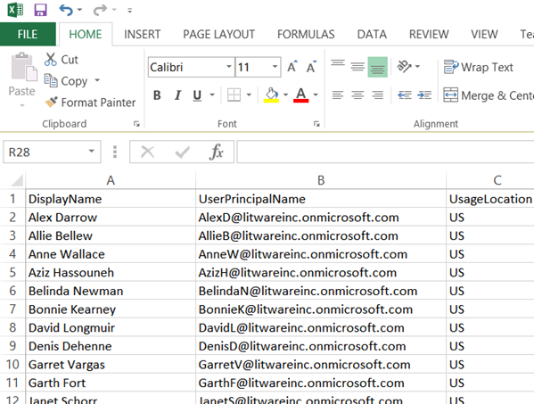

# <a name="why-you-need-to-use-powershell-for-microsoft-365"></a>Зачем использовать PowerShell для Microsoft 365

*Эта статья относится к Microsoft 365 корпоративный и Office 365 корпоративный.*

С помощью центра администрирования Microsoft 365 вы можете управлять пользовательскими учетными записями и лицензиями Microsoft 365. Вы также можете управлять службами Microsoft 365, такими как Exchange Online, Teams и SharePoint Online. Если вместо этого вы используете PowerShell для управления этими службами, вы можете использовать преимущества командной строки и язык сценариев для ускорения, автоматизации и дополнительных возможностей.
  
В этой статье показано, как использовать PowerShell для управления Microsoft 365:
  
- Отображение дополнительной информации, которая не отображается в центре администрирования Microsoft 365
    
- Настройка функций и параметров, доступных только в PowerShell
    
- Выполнение массовых операций
    
- Фильтрация данных
    
- Печать или сохранение данных
    
- Управление между службами
    
Помните, что PowerShell для Microsoft 365 — это набор модулей для Windows PowerShell, который представляет собой среду командной строки для служб и платформ на основе Windows. Эта среда создает язык командной консоли, который можно расширить с помощью дополнительных модулей. Он предоставляет способ выполнения простых или сложных команд или сценариев. Например, после установки модулей PowerShell для Microsoft 365 и подключения к вашей подписке Microsoft 365 можно выполнить следующую команду, чтобы получить список всех почтовых ящиков пользователей для Microsoft Exchange Online:
  
```powershell
Get-Mailbox
```

Вы также можете получить список почтовых ящиков с помощью центра администрирования Microsoft 365, но подсчитать элементы во всех списках всех сайтов для всех веб-приложений непросто.
  
PowerShell для Microsoft 365 предназначен для управления Microsoft 365, а не для замены центра администрирования Microsoft 365. Администраторы должны иметь возможность использовать PowerShell для Microsoft 365, так как некоторые процедуры настройки можно выполнить только с помощью команд PowerShell для Microsoft 365. В таких случаях необходимо знать, как:
  
- Установите PowerShell для модулей Microsoft 365 (выполнить только один раз для каждого компьютера администратора).
    
- Подключаться к вашей подписке Microsoft 365 (один раз для каждого сеанса PowerShell);
    
- Соберите информацию, необходимую для запуска необходимых команд PowerShell для Microsoft 365.
    
- Запустите PowerShell для команд Microsoft 365.
    
Изучите эти основные навыки, вам не нужно перечислить пользователей почтовых ящиков с помощью команды **Get/Mailbox** . Кроме того, вам не нужно знать, как создать новую команду, например команду, указанную ранее, чтобы подсчитать все элементы во всех списках всех сайтов для всех веб-приложений. Корпорация Майкрософт и сообщество администраторов могут помочь вам с такими задачами.
  
## <a name="powershell-for-microsoft-365-can-reveal-information-that-you-cant-see-with-the-microsoft-365-admin-center"></a>В PowerShell для Microsoft 365 может отображаться информация, которая не отображается в центре администрирования Microsoft 365

Центр администрирования Microsoft 365 содержит много полезной информации. Но в нем не отображаются все возможные сведения о пользователях, лицензиях, почтовых ящиках и сайтах, которые хранятся в Microsoft 365. Ниже приведен пример для *пользователей и групп* в центре администрирования Microsoft 365:
  

  
Это представление предоставляет сведения, необходимые для многих случаев. Однако бывают случаи, когда вам требуется больше времени. Например, лицензирование Microsoft 365 (и функции Microsoft 365, доступные пользователю) зависят от географического расположения пользователя. Политики и функции, которые можно расширить для пользователя, который живет в США, могут отличаться от тех, которые можно расширить для пользователя в Индии или Бельгии. Чтобы определить географическое расположение пользователя, выполните следующие действия в центре администрирования Microsoft 365:
  
1. Дважды щелкните **отображаемое имя** пользователя.
    
2. В области Отображение свойств пользователя выберите **сведения**.
    
3. В отображении сведений выберите **Дополнительные сведения**.
    
4. Прокрутите страницу, пока не найдете **название страны или региона**:
    
     
  
5. Запишите отображаемое имя и местонахождение пользователя на лист бумаги или скопируйте и вставьте их в Блокнот.
    
Эту процедуру необходимо повторить для каждого пользователя. Если у вас много пользователей, этот процесс может быть утомительным. С помощью PowerShell для Microsoft 365 вы можете отобразить эту информацию для всех пользователей с помощью следующей команды:
  
```powershell
Get-AzureADUser | Select DisplayName, UsageLocation
```


>[!Note]
>PowerShell Core не поддерживает модуль Microsoft Azure Active Directory для модулей Windows PowerShell и командлетов, в именах которых *MSOL* . Эти командлеты необходимо запускать в Windows PowerShell.
>

Вот пример результатов:
  
```powershell
DisplayName                               UsageLocation
-----------                               -------------
Bonnie Kearney                            GB
Fabrice Canel                             BR
Brian Johnson (TAILSPIN)                  US
Anne Wallace                              US
Alex Darrow                               US
David Longmuir                            BR
```

Интерпретация этой команды PowerShell: получение всех пользователей в текущей подписке Microsoft 365 (**Get-AzureADUser**), но отображение только имени и расположения каждого пользователя (**выберите DisplayName, UsageLocation**).
  
Так как PowerShell для Microsoft 365 поддерживает язык командной консоли, вы можете дополнительно манипулировать сведениями, полученными с помощью команды **Get-AzureADUser** . Например, вы хотели бы сортировать этих пользователей по их расположению, объединяя всех пользователей Бразилии, всех пользователей США и т. д. Вот эта команда:
  
```powershell
Get-AzureADUser | Select DisplayName, UsageLocation | Sort UsageLocation, DisplayName
```

Вот пример результатов:
  
```powershell
DisplayName                                 UsageLocation
-----------                                 -------------
David Longmuir                              BR
Fabrice Canel                               BR
Bonnie Kearney                              GB
Alex Darrow                                 US
Anne Wallace                                US
Brian Johnson (TAILSPIN)                    US
```

Интерпретация этой команды PowerShell: получение всех пользователей в текущей подписке на Microsoft 365, но отображение имени и расположения каждого пользователя и сортировка их по их расположению, а затем по имени (**Sort UsageLocation, DisplayName**).
  
Кроме того, можно использовать дополнительную фильтрацию. Например, если нужно просмотреть сведения о пользователях, находящихся в Бразилии, используйте следующую команду:
  
```powershell
Get-AzureADUser | Where {$_.UsageLocation -eq "BR"} | Select DisplayName, UsageLocation 
```

Вот пример результатов:
  
```powershell
DisplayName                                           UsageLocation
-----------                                           -------------
David Longmuir                                        BR
Fabrice Canel                                         BR
```

Интерпретация этой команды PowerShell: получение всех пользователей в текущей подписке на Microsoft 365, чье расположение — Бразилия (**где {$ \_ . UsageLocation-EQ "BR"}**), а затем отобразите имя и местоположение каждого пользователя.
  
 **Примечание о больших доменах**
  
Если у вас большой домен с десятками тысяч пользователей, попробуйте в некоторых примерах, приведенных в этой статье, привести к регулированию. На основе таких факторов, как вычислительная мощность и доступная пропускная способность сети, вы можете попробовать слишком много времени. В крупных организациях может потребоваться разделить некоторые операции PowerShell на две команды.

Например, следующая команда возвращает все учетные записи пользователей и отображает имя и расположение каждого из них:
  
```powershell
Get-AzureADUser | Select DisplayName, UsageLocation
```

Она отлично подходит для небольших доменов. Но в большой организации может потребоваться разделить эту операцию на две команды: одна команда для хранения данных учетной записи пользователя в переменной, а другая — для отображения необходимой информации. Пример:
  
```powershell
$x = Get-AzureADUser
$x | Select DisplayName, UsageLocation
```

Ниже приведена интерпретация этого набора команд PowerShell.
1. Получите всех пользователей в текущей подписке на Microsoft 365 и сохраните их в переменной с именем $x (**$x = Get-AzureADUser**).
1.  Отображение содержимого переменной *$x*, но включать только имя и местоположение каждого пользователя (**$x | Выберите DisplayName, UsageLocation**).
  
## <a name="microsoft-365-has-features-that-you-can-only-configure-with-powershell-for-microsoft-365"></a>Microsoft 365 содержит функции, которые можно настроить только с помощью PowerShell для Microsoft 365

Центр администрирования Microsoft 365 предназначен для обеспечения доступа к общим и удобным административным задачам, которые применимы к большинству сред. Другими словами, центр администрирования Microsoft 365 разработан, чтобы обычный администратор мог выполнять наиболее распространенные задачи управления. Но в центре администрирования можно выполнить некоторые задачи.
  
Например, центр администрирования Skype для бизнеса Online предоставляет несколько вариантов для создания настраиваемых приглашений на собрания:
  

  
С помощью указанных ниже параметров приглашения на собрания можно сделать более персонализированными и профессиональными. Но параметры настройки собраний больше, чем простое создание настраиваемых приглашений на собрания. Например, по умолчанию собрания позволяют:
  
- анонимным пользователям автоматически присоединяться к каждому собранию;
    
- участникам записывать собрание;
    
- обозначать всех пользователей из вашей организации докладчиками при их присоединении к собранию.
    
Эти параметры недоступны в центре администрирования Skype для бизнеса Online. Вы можете управлять ими в PowerShell для Microsoft 365. Вот команда, с помощью которой отключаются эти три параметра:
  
```powershell
Set-CsMeetingConfiguration -AdmitAnonymousUsersByDefault $False -AllowConferenceRecording $False -DesignateAsPresenter "None"
```

> [!NOTE]
> Для выполнения этой команды необходимо установить [модуль PowerShell для Skype для бизнеса Online ](https://www.microsoft.com/download/details.aspx?id=39366).
  
Эта команда PowerShell интерпретируется следующим образом:
 
1. В разделе Параметры новых собраний Skype для бизнеса Online (**Set-CsMeetingConfiguration**) отключите разрешение анонимным пользователям получать автоматический вход в собрания (**-адмитанонимаусусерсбидефаулт $false**).
2.  Отключение возможности записи собраний участниками (**-AllowConferenceRecording $false**).
3. Не указывайте всех пользователей в Организации как выступающих (**-десигнатеаспресентер "нет"**).
  
Чтобы восстановить эти параметры по умолчанию (включите параметры), выполните следующую команду:
  
```powershell
Set-CsMeetingConfiguration -AdmitAnonymousUsersByDefault $True -AllowConferenceRecording $True -DesignateAsPresenter "Company"
```

Существуют и другие схожие сценарии, поэтому администраторы должны знать, как запускать PowerShell для команд Microsoft 365.
  
## <a name="powershell-for-microsoft-365-is-great-for-bulk-operations"></a>PowerShell для Microsoft 365 отлично подходит для массовых операций

Визуальные интерфейсы, такие как центр администрирования Microsoft 365, наиболее полезны, если у вас есть одна операция. Например, если необходимо отключить одну учетную запись пользователя, вы можете использовать центр администрирования для быстрого обнаружения и снятия флажка. Это может быть проще, чем выполнение аналогичной операции в PowerShell.
  
Но если вам нужно изменить множество вещей или некоторые из выбранных элементов в большом наборе других элементов, центр администрирования Microsoft 365 может быть не лучшим средством. Например, предположим, что необходимо изменить префикс для тысяч телефонных номеров или удалить определенного пользователя *Ken Myer* со всех сайтов SharePoint Online. Как это можно сделать в центре администрирования Microsoft 365?
  
В последнем примере предположим, что у вас есть несколько сотен сайтов SharePoint Online, и вы не знаете, в каких из них Кен Крюкова входит. Необходимо запустить центр администрирования Microsoft 365, а затем выполнить эту процедуру для каждого сайта:
  
1. Выберите **URL-адрес** сайта.
    
2. В поле **Свойства семейства веб-сайтов** выберите ссылку **адрес веб-сайта** , чтобы открыть сайт.
    
3. На сайте выберите **общий доступ**.
    
4. В диалоговом окне **общий доступ** выберите ссылку, в которой отображаются все пользователи с разрешениями для сайта:
    
     
  
5. В диалоговом окне **общий доступ** выберите **Дополнительно**.
    
6. Прокрутите список пользователей, найдите и выберите Кен Myer (предполагая, что у него есть разрешения для сайта), а затем выберите **удалить разрешения пользователя**.
    
Это займет *много* времени для нескольких сотен сайтов.
  
Кроме того, можно выполнить следующую команду в PowerShell для Microsoft 365, чтобы удалить Ken Myer со всех сайтов:
  
```powershell
Get-SPOSite | ForEach {Remove-SPOUser -Site $_.Url -LoginName "kenmyer@litwareinc.com"}
```

> [!NOTE]
> Для этой команды необходимо установить [модуль PowerShell для SharePoint Online](https://docs.microsoft.com/powershell/sharepoint/sharepoint-online/connect-sharepoint-online?view=sharepoint-ps). 
  
Интерпретация этой команды PowerShell: получение всех сайтов SharePoint в текущей подписке на Microsoft 365 (**Get-SPOSite**) и для каждого сайта. Удалите Ken Крюкова из списка пользователей, имеющих доступ к нему (**foreach {Remove-супруг-site $) \_ . URL-адрес LoginName "kenmyer \@ litwareinc.com"}**).
  
Мы говорим корпорации Майкрософт 365 удалить Ken Крюкова со всех сайтов, в том числе к тем, у которых у него нет доступа. Таким образом, результаты будут показывать ошибки для тех сайтов, к которым у них нет доступа. В этой команде можно использовать дополнительное условие, чтобы удалить Ken Крюкова только с сайтов, на которых они находятся в списке входа. Однако возвращенные ошибки не дают вред сайтам. Выполнение этой команды может занять несколько минут, а не часов работы с сотнями сайтов в центре администрирования Microsoft 365.
  
Вот еще один пример массовой операции. Используйте эту команду, чтобы добавить *Бонние кеарнэй*, новый администратор SharePoint для всех сайтов в Организации:
  
```powershell
Get-SPOSite | ForEach {Add-SPOUser -Site $_.Url -LoginName "bkearney@litwareinc.com" -Group "Members"}
```

Интерпретация этой команды PowerShell: получение всех сайтов SharePoint в текущей подписке на Microsoft 365 и для каждого сайта разрешить доступ к Бонние Кеарнэй, добавив имя для входа в группу "участники" сайта (**foreach {Add-супруг-site $) \_ . URL-адрес LoginName "бкеарнэй \@ litwareinc.com"-Group "Members"}**).
  
## <a name="powershell-for-microsoft-365-is-great-at-filtering-data"></a>PowerShell для Microsoft 365 отлично подходит для фильтрации данных

Центр администрирования Microsoft 365 предоставляет несколько способов фильтрации данных, чтобы легко находить целевое подмножество данных. Например, Exchange упрощает фильтрацию практически любого свойства почтового ящика пользователя. Например, ниже приведен список почтовых ящиков для всех пользователей, проживающих в городе Блумингтон:
  

  
В центре администрирования Exchange также можно объединять условия фильтрации. Например, вы можете найти почтовые ящики всех пользователей, проживающих в Блумингтон, и работать в отделе финансов.
  
Но в центре администрирования Exchange есть ограничения. Например, невозможно легко найти почтовые ящики людей, проживающих в Блумингтон *или* Сан Диего, или почтовые ящики для всех пользователей, которые не работают в Блумингтон.
  
Вы можете использовать следующую команду PowerShell для Microsoft 365, чтобы получить список почтовых ящиков для всех пользователей, проживающих в Блумингтон или Сан Диего:
  
```powershell
Get-User | Where {$_.RecipientTypeDetails -eq "UserMailbox" -and ($_.City -eq "San Diego" -or $_.City -eq "Bloomington")} | Select DisplayName, City
```

Вот пример результатов:
  
```powershell
DisplayName                              City
-----------                              ----
Alex Darrow                              San Diego
Bonnie Kearney                           San Diego
Julian Isla                              Bloomington
Rob Young                                Bloomington
```

Интерпретация этой команды PowerShell: получение всех пользователей в текущей подписке Microsoft 365 с почтовым ящиком в городе Сан-Диего или Блумингтон (**где {$ \_ . RecipientTypeDetails-EQ "UserMailbox"-and ($ \_ . City – Eq "Сан Диего" (или $) \_ . City-Eq "Блумингтон")}**), а затем отобразить имя и город для каждого из них (**выберите DisplayName, City**).
  
Ниже приведена команда для перечисления всех почтовых ящиков пользователей, которые живут в любом месте за исключением Блумингтон:
  
```powershell
Get-User | Where {$_.RecipientTypeDetails -eq "UserMailbox" -and $_.City -ne "Bloomington"} | Select DisplayName, City
```

Вот пример результатов:
  
```powershell
DisplayName                               City
-----------                               ----
MOD Administrator                         Redmond
Alex Darrow                               San Diego
Allie Bellew                              Bellevue
Anne Wallace                              Louisville
Aziz Hassouneh                            Cairo
Belinda Newman                            Charlotte
Bonnie Kearney                            San Diego
David Longmuir                            Waukesha
Denis Dehenne                             Birmingham
Garret Vargas                             Seattle
Garth Fort                                Tulsa
Janet Schorr                              Bellevue
```

Интерпретация этой команды PowerShell: получение всех пользователей в текущей подписке Microsoft 365 с почтовым ящиком, не расположенным в городе Блумингтон (**где {$ \_ . RecipientTypeDetails — EQ "UserMailbox" и $ \_ . City-NE "Блумингтон"}**), а затем отображает имя и город для каждого из них.
  
### <a name="use-wildcards"></a>Использование подстановочных знаков

Кроме того, можно использовать подстановочные знаки в фильтрах PowerShell для сопоставления части имени. Например, предположим, что вы ищете учетную запись пользователя. Вы можете запомнить, что фамилия пользователя — *Андерсон;* или, возможно, *Хендерсон;* или *Йоргенсон*.
  
Вы можете проследить этого пользователя в центре администрирования Microsoft 365 с помощью средства поиска и выполнить три различных поиска:
  
- *Андерсон*  ; 
    
- *Хендерсон*  ; 
    
- *Йоргенсон*  . 
    
Так как все три из этих имен заканчиваются на ""] ", вы можете указать PowerShell, чтобы отобразить всех пользователей, чье имя оканчивается на" "]". Вот эта команда:
  
```powershell
Get-User -Filter '{LastName -like "*son"}'
```

Интерпретация этой команды PowerShell: получение всех пользователей в текущей подписке на Microsoft 365, но использование фильтра, в котором указаны только те пользователи, чьи фамилии заканчиваются на "E3" (**-Filter "{LastName-Like" "] \* "**). Это \* означает любой набор символов, которые являются буквами фамилии пользователя.
  
## <a name="powershell-for-microsoft-365-makes-it-easy-to-print-or-save-data"></a>Оболочка PowerShell для Microsoft 365 упрощает печать и сохранение данных

Центр администрирования Microsoft 365 позволяет просматривать списки данных. Ниже приведен пример центра администрирования Skype для бизнеса Online, в котором отображается список пользователей, которым разрешено использовать Skype для бизнеса Online:
  

  
Чтобы сохранить эти сведения в файл, необходимо вставить его в документ или лист Microsoft Excel. В любом случае может потребоваться дополнительное форматирование. Кроме того, центр администрирования Microsoft 365 не предоставляет возможности непосредственного вывода списка.
  
К счастью, вы можете использовать PowerShell, чтобы не только отображать список, но и сохранить его в файл, который можно легко импортировать в Excel. Ниже приведен пример команды для сохранения данных пользователя Skype для бизнеса Online в CSV-файл, который можно легко импортировать в виде таблицы на листе Excel.
  
```powershell
Get-CsOnlineUser | Select DisplayName, UserPrincipalName, UsageLocation | Export-Csv -Path "C:\Logs\SfBUsers.csv" -NoTypeInformation
```

Вот пример результатов:
  

  
Интерпретация этой команды PowerShell: получение всех пользователей Skype для бизнеса Online в текущей подписке на Microsoft 365 (**Get-CsOnlineUser**); получите только имя пользователя, имя участника-пользователя и расположение (**выберите DisplayName, userPrincipalName, UsageLocation**); затем сохраните эти сведения в CSV-файле с именем C: \\ logs \\SfBUsers.csv (**Export-CSV-Path "C: \\ logs \\SfBUsers.csv"-нотипеинформатион**).
  
Вы также можете использовать параметры для сохранения этого списка в виде XML-файла или HTML-страницы. Кроме того, с помощью дополнительных команд PowerShell вы можете сохранить его непосредственно в виде файла Excel, используя любое пользовательское форматирование.
  
Кроме того, можно отправить выходные данные команды PowerShell, которая отображает список непосредственно на принтере по умолчанию в Windows. Вот пример команды:
  
```powershell
Get-CsOnlineUser | Select DisplayName, UserPrincipalName, UsageLocation | Out-Printer
```

Ниже показано, как будет выглядеть напечатанный документ.
  

  
Интерпретация этой команды PowerShell: получение всех пользователей Skype для бизнеса Online в текущей подписке на Microsoft 365; получите только имя пользователя, имя участника-пользователя и расположение; а затем отправить эти сведения на принтер Windows по умолчанию (**Out-Printer**).
  
Форматирование документа аналогично простому форматированию, которое отображается в командном окне PowerShell. Чтобы получить твердую копию, просто добавьте **| Out – Printer** в конце команды.
  
## <a name="powershell-for-microsoft-365-lets-you-manage-across-server-products"></a>PowerShell для Microsoft 365 позволяет управлять различными серверными продуктами

Компоненты, составляющие Microsoft 365, предназначены для совместной работы. Например, предположим, что вы добавляете нового пользователя в Microsoft 365, а также указываете такие сведения, как отдел и номер телефона пользователя. Эта информация будет доступна при доступе к сведениям о пользователе в любой из служб Microsoft 365: Skype для бизнеса Online, Exchange или SharePoint.
  
Это общие сведения, распространяющиеся на набор продуктов. Сведения о конкретном продукте, такие как сведения о почтовом ящике Exchange пользователя, обычно не доступны в наборе. Например, сведения о включении или отключении почтового ящика пользователя доступны только в центре администрирования Exchange.
  
Предположим, вы хотите создать отчет со следующим сведениями обо всех пользователях:
  
- краткое имя пользователя;
    
- Является ли пользователь лицензированным для Microsoft 365
    
- включен ли почтовый ящик Exchange пользователя;
    
- включено ли для пользователя приложение Skype для бизнеса Online.
    
Такой отчет невозможно легко создать в центре администрирования Microsoft 365. Вместо этого необходимо создать отдельный документ для хранения данных, например листа Excel. Затем получите все имена пользователей и сведения о лицензировании из центра администрирования Microsoft 365, получите сведения о почтовом ящике из центра администрирования Exchange, получите сведения о Skype для бизнеса Online в центре администрирования Skype для бизнеса Online, а затем объедините эти сведения.
  
Альтернативой является использование скрипта PowerShell для компиляции отчета.
  
Следующий пример скрипта более сложный, чем команды, показанные ранее в этой статье. Кроме того, в ней показано, как использовать PowerShell для создания информационных представлений, которые трудно возникать в ином случае. Ниже приведен скрипт для компиляции и отображения необходимого списка.
  
```powershell
$x = Get-AzureADUser

foreach ($i in $x)
    {
      $y = Get-Mailbox -Identity $i.UserPrincipalName
      $i | Add-Member -MemberType NoteProperty -Name IsMailboxEnabled -Value $y.IsMailboxEnabled

      $y = Get-CsOnlineUser -Identity $i.UserPrincipalName
      $i | Add-Member -MemberType NoteProperty -Name EnabledForSfB -Value $y.Enabled
    }

$x | Select DisplayName, IsLicensed, IsMailboxEnabled, EnabledforSfB
```

Вот пример результатов:
  
```powershell
DisplayName             IsLicensed   IsMailboxEnabled   EnabledForSfB
-----------             ----------   ----------------   --------------
Bonnie Kearney          True         True               True
Fabrice Canel           True         True               True
Brian Johnson           False        True               False
Anne Wallace            True         True               True
Alex Darrow             True         True               True
David Longmuir          True         True               True
Katy Jordan             False        True               False
Molly Dempsey           False        True               False
```

Этот сценарий PowerShell интерпретируется следующим образом:  

1. Получите всех пользователей в текущей подписке на Microsoft 365 и сохраните их в переменной с именем *$x* (**$x = Get-AzureADUser**).
1. Запустите цикл, который будет выполняться для всех пользователей в переменной $x (**foreach ($i in $x)**).  
1. Определите переменную с именем *$y* и сохраните сведения о почтовом ящике пользователя (**$y = Get-Mailbox-Identity $i. userPrincipalName**).
1. Добавьте новое свойство к сведениям о пользователях с именем *исмаилбоксенаблед*. Задайте для него значение свойства Исмаилбоксенаблед почтового ящика пользователя (**$i | Add-Member-Мембертипе нотепроперти-Name исмаилбоксенаблед-value $y. исмаилбоксенаблед**).
1. Определите переменную с именем *$y*и сохраните информацию пользователя Skype для бизнеса Online в ней (**$y = Get-CsOnlineUser-Identity $i. userPrincipalName**).
1. Добавьте новое свойство к сведениям о пользователях с именем *енабледфорсфб*. Задайте для него значение свойства Enabled для сведений о Skype для бизнеса Online (**$i | Add-Member-Мембертипе нотепроперти-Name енабледфорсфб-value $y. Enabled**).
1. Отображение списка пользователей, но включение только их имени (при наличии лицензии), а также двух новых свойств, указывающих на то, включен ли их почтовый ящик и включены ли они в Skype для бизнеса Online (**$x | Выберите DisplayName, лицензировать, Исмаилбоксенаблед, Енабледфорсфб**).
  
## <a name="see-also"></a>Дополнительные ресурсы:

[Начало работы с PowerShell для Microsoft 365](getting-started-with-microsoft-365-powershell.md)
  
[Управление учетными записями пользователей Microsoft 365, лицензиями и группами с помощью PowerShell](manage-user-accounts-and-licenses-with-microsoft-365-powershell.md)
  
[Использование Windows PowerShell для создания отчетов в Microsoft 365](use-windows-powershell-to-create-reports-in-microsoft-365.md)
