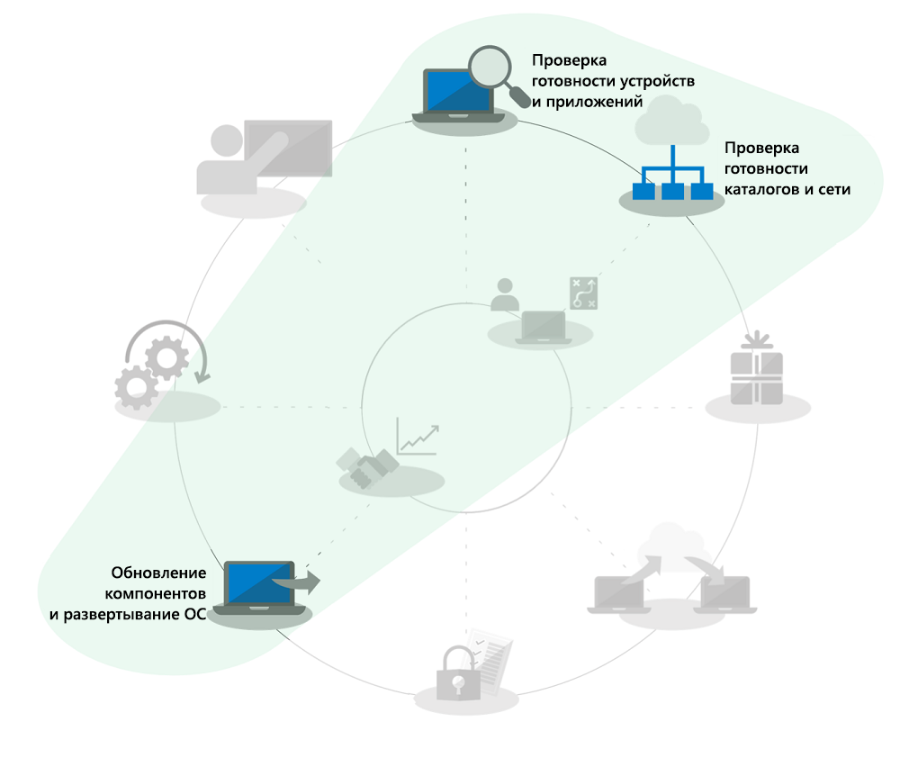
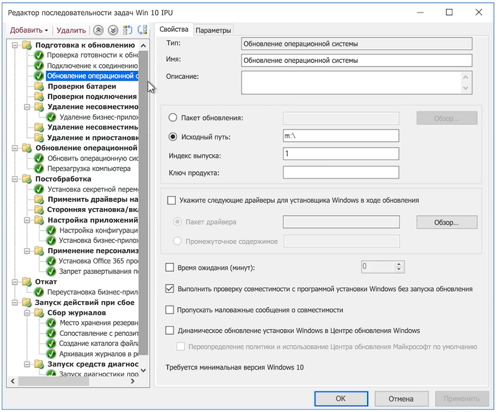

# Автоматический переход на месте с Windows 7 на Windows 10 для крупных организаций

С 14 января 2020 г. обновления для системы безопасности и поддержка компьютеров под управлением Windows 7 больше не будут предоставляться. С приближением срока для перехода с Windows 7 на Windows 10 и при наличии нескольких вариантов развертывания в ИТ-сообществе часто возникает вопрос: "Какой самый быстрый способ перехода с Windows 7 на Windows 10?". Краткий ответ — обновление на месте для существующих компьютеров. Это позволяет сосредоточиться на нескольких аспектах процесса развертывания компьютеров.

При использовании обновления на месте значительно уменьшаются несколько процессов развертывания компьютеров, в частности:

  - **Упаковка приложений** и повторная отправка обязательных бизнес-приложений — они просто переносятся из среды Windows 7

  - **Миграция файлов**и основные параметры пользователей — они также переносятся из предыдущей установки, если устройство остается у того же пользователя.

Выделенные серым задачи на круговом изображении процесса развертывания выше нельзя полностью пропустить, но чтобы сэкономить время предполагается, что вы переносите свою конфигурацию безопасности, изменяете процессы обновления программного обеспечения, а обучение пользователей работе с компонентами Windows в основном происходило на домашних системах, так как частные компьютеры с Windows, приобретенные после 2012 г., в большинстве не содержали предустановленной Windows 7, а после выпуска Windows 10 в 2015 г. домашние системы Windows 7 в основном также были обновлены до Windows 10.

## Надежность, безопасность и масштаб при обновлении на месте

Обновление на месте до Windows 10 является надежным способом для перевода существующих устройств под управлением Windows 7 или более поздней версии на Windows 10. При этом не требуется перенос файлов или повторная установка приложений. После обновления на месте файлы пользователей, параметры и доступные приложения соответствуют предыдущей установке Windows 7. Хотя вы можете воспользоваться этой возможностью для очистки существующих приложений или параметров, в реальности по мере приближения к дате окончания поддержки Windows 7 в январе 2020 г. остается все меньше времени для использования других вариантов. Обновления также поддерживаются при переходе между одинаковыми архитектурами (с 32- на 32-разрядную или с 64- на 64-разрядную) и одинаковыми выпусками Windows (с Профессиональная на Pro или с Корпоративная на Корпоративная).

В процессе обновления по умолчанию создается резервная копия предыдущей установки Windows, поэтому в случае сбоя обновления или неправильной работы устройства или приложения после обновления компьютер можно откатить к Windows 7. На обновленных компьютерах по умолчанию есть 10 дней для запуска при необходимости возврата к Windows 7 в ручном режиме.

Обновления на месте можно автоматизировать с помощью таких средств развертывания операционных систем, как [System Center Configuration Manager](https://docs.microsoft.com/sccm/osd/deploy-use/create-a-task-sequence-to-upgrade-an-operating-system) или [Microsoft Deployment Toolkit](https://docs.microsoft.com/windows/deployment/upgrade/upgrade-to-windows-10-with-the-microsoft-deployment-toolkit). В этой статье описаны автоматизированные способы и оптимизация, а также ссылки на соответствующие ресурсы для получения дополнительной помощи.

## Обновление небольшого числа компьютеров

Для одного или нескольких компьютеров обновление вручную обычно является оптимальным способом по сравнению с более автоматизированными подходами. Необходимое программное обеспечение и лицензии можно найти в магазине [Microsoft Store](https://go.microsoft.com/fwlink/p/?LinkId=808282), у других продавцов программного обеспечения или на сайте [Volume Licensing Service Center](https://www.microsoft.com/licensing/servicecenter/default.aspx), если вы используете корпоративную лицензию. Подробные инструкции по переводу одного компьютера на Windows 10, а также о вариантах восстановления после обновления см. в статье [Пошаговое руководство по переходу с Windows 7 на Windows 10 в ручном режиме](https://docs.microsoft.com/ru-RU/microsoft-365/enterprise/windows-7-to-windows-10-upgrade).

## Обновление большого числа компьютеров

Если вы управляете десятками или тысячами компьютеров, лучшим вариантом является обновление на месте с использованием последовательности задач в System Center Configuration Manager или Microsoft Deployment Toolkit. Этот процесс в большинстве случаев является очень надежным, но в зависимости от числа обновляемых компьютеров рекомендуется подготовить обязательное тестирование и средства управления, чтобы обеспечить успех при большом масштабе.

Это означает, что вы можете пропустить этап готовности каталога или задачи, связанные с отправкой и упаковкой приложений Azure Active Directory, Office и бизнес-приложений, а также перенос пользовательских файлов, так как эти аспекты относятся к процессу обновления и параметры безопасности должны быть как минимум перенесены. Со временем эти области могут быть улучшены.

Функция развертывания обновления описана в статье [Обновление компонентов и развертывание ОС](https://www.aka.ms/mdd6). Хотя вы можете легко создать решения со скриптами, автоматически запускающими установку Windows 10 с минимальным вмешательством или без вмешательства администратора, последовательность задач обеспечит более детальное управление следующими операциями:

  - выполнение проверок перед развертыванием;

  - управление состоянием шифрования дисков перед обновлением;

  - удаление перед обновлением драйверов и приложений с известными проблемами;

  - установка дополнительных драйверов и приложений после обновления;

  - управление состоянием шифрования дисков после обновления;

  - восстановление компьютера в предыдущее состояние с повторной установкой удаленных приложений или драйверов в случае сбоя обновления;

  - любые другие параметры, требующие настройки для обеспечения готовности организации.

Самые распространенные причины, по которым обновления не удается завершить или выполнить включают следующее:

  - Устаревшие драйверы устройств

  - Стороннее шифрование диска

  - Решения кода нижнего уровня, например защита от вредоносных программ, VPN или виртуализация

Шаблоны [последовательности задач обновления](https://docs.microsoft.com/sccm/osd/deploy-use/create-a-task-sequence-to-upgrade-an-operating-system) встроены в текущую ветвь System Center Configuration Manager и доступны в нескольких выпусках. В последних выпусках внесены значительные технологические улучшения в System Center Configuration Manager, повышающие эффективность процесса для определения готовности к совмещению устройств и Office, снижения сетевого трафика и настройки новых параметров, например резервного копирования OneDrive. Посмотрите эту [демонстрацию Microsoft Mechanics](https://youtu.be/CYRnAmCD7ls), чтобы узнать больше об последних обновлениях для развертывания ОС с помощью System Center Configuration Manager.

Если вы не используете System Center Configuration Manager, вы можете применить средство Microsoft Deployment Toolkit для создания и выполнения последовательностей задач по развертыванию обновления.

## Обновления с последовательностью задач предварительного кэширования

Возможность [предварительного кэширования](https://docs.microsoft.com/sccm/osd/deploy-use/create-a-task-sequence-to-upgrade-an-operating-system#configure-pre-cache-content) для последовательности задач развертывания Configuration Manager позволяет клиентам скачивать соответствующее содержимое пакетов обновления ОС перед обновлением операционной системы с помощью последовательности задач. Ранее при запуске последовательности задач начиналось скачивание содержимого пакета. Содержимое предварительного кэша также дает возможность клиенту скачать только нужный пакет обновления ОС и все прочее указанное содержимое сразу после развертывания.

Последовательности задач предварительного кэширования в сочетании с проверками совместимости

Помимо экономии времени на скачивание пакета вы можете предварительно кэшировать пакет обновления и использовать программу установки Windows, чтобы оценить вероятность успешного обновления на месте до выполнения фактического обновления Windows. Следующий синтаксис командной строки можно использовать для автоматического выполнения проверки совместимости и определения результатов оценки готовности устройства к обновлению, выполняемой программой установки Windows.

После этого журналы отправляются на указанный путь на сервере, а программа установки Windows не будет отображаться пользователю и закроется без его вмешательства.

Результаты журналов:

1.  Если программа установки не обнаруживает проблемы совместимости, а компьютер соответствует всем требованиям, возвращается результат MOSETUP\_E\_COMPAT\_SCANONLY (0xC1900210)

2.  Если программа установки обнаружит проблемы, требующие обработки, например известные несовместимые приложения, возвращается результат MOSETUP\_E\_COMPAT\_INSTALLREQ\_BLOCK (0xC1900208)

3.  Если программа установки обнаружит, что компьютер не подходит для Windows 10, возвращается результат MOSETUP\_E\_COMPAT\_SYSREQ\_BLOCK (0xC1900200)

4.  Если программа установки обнаружит, что на компьютере недостаточно свободного места для установки, возвращается результат MOSETUP\_E\_INSTALLDISKSPACE\_BLOCK (0xC190020E)

После развертывания последовательностей предварительного кэширования с проверками совместимости для большого числа компьютеров в коллекции, вы можете начать анализ файлов журнала на предмет готовности устройства. При использовании результатов, указанных выше, \#1 (0xC1900210) может быть обработан как "готово к развертыванию", а \#4 (0xC190020E) может быть обработан путем освобождения места на диске. Рекомендуется быть аккуратными с удалением файлов, а начинать следует с очистки обновлений Windows, корзины и временных файлов, что во многих случаях обеспечит достаточно места для успешного обновления. Вы можете запускать проверку совместимости любое нужное количество раз, пока компьютер не будет готов к обновлению на месте. Дополнительные сведения о параметрах командной строки программы установки Windows см. на сайте <https://aka.ms/setupswitches>

## [Центр развертывания компьютеров](https://aka.ms/howtoshift)
