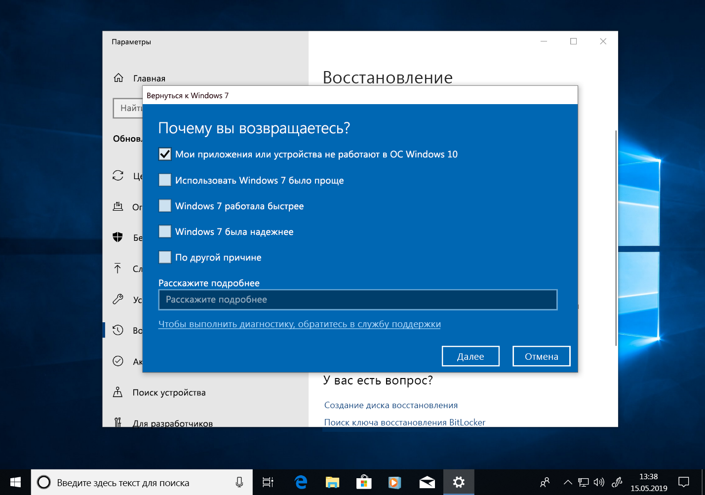

# Пошаговое руководство по переходу с Windows 7 на Windows 10 в ручном режиме

В этой статье описан процесс перехода в ручном режиме с версии Windows 7 Корпоративная для ПК на Windows 10 Корпоративная. Для других выпусков Windows 7, таких как Домашняя и Профессиональная, процесс очень похож, но у вас также есть вариант непосредственного перехода с помощью средства создания мультимедиа. Для перехода с любого выпуска Windows 7 на Windows 10 требуется действительный ключ продукта и соответствующий или более полный выпуск Windows, например Windows 7 Профессиональная можно обновить до Windows 10 Pro, но нельзя обновить до Windows 10 Домашняя. Windows 7 Максимальная требуется обновлять до Windows 10 Pro.

## Обновления до Windows 10 с помощью средства создания мультимедиа или ISO-файлов

Вы можете сразу перейти на Windows 10 с помощью [средства создания мультимедиа](https://www.microsoft.com/software-download/windows10ISO) или использовать его, чтобы скачать Windows 10 в виде ISO-файла. Нужно учитывать архитектуру текущей системы (32- или 64-разрядная), язык системы по умолчанию и выпуск Windows 7 (например, Домашняя, Профессиональная или Корпоративная). В Windows 7 эта информация находится в разделе "Панель управления" \> "Система и безопасность" \> "Система". Средство создания мультимедиа не поддерживает Windows 10 Корпоративная для обновлений, создания установочного носителя или скачивания ISO-файлов. Если вы обновляетесь с Windows 7 Корпоративная, требуется Windows 10 Корпоративная.

При переходе с Windows 7 Корпоративная на Windows 10 Корпоративная вам потребуется скачать ISO-файл для своего языка и архитектуры (32- или 64-разрядной) с сайта [Volume Licensing Service Center](https://www.microsoft.com/licensing/servicecenter/default.aspx).

Если вы планируете выполнить переход с помощью ISO-файла, потребуется извлечь файлы из формата ISO в локальную файловую систему, на съемный диск или записать ISO-файл на DVD-диск. Вы можете извлечь файлы установки из формата ISO с помощью компьютера с установленной Windows 8 или более поздней версией, а затем сохранить их на съемном USB-накопителе или использовать приложение, например [7zip](https://www.7-zip.org/), чтобы извлечь содержимое ISO-файла в папку на локальном диске в Windows 7.

После подготовки установочного носителя в Windows 7 вы можете начать обновление, запустив файл setup.exe, как показано ниже.

**Важный совет. Для обновления на месте, при котором приложения и данные переносятся в Windows 10, необходимо запустить процесс из работающего сеанса Windows 7. Загрузка на установочный носитель с DVD-диска или USB-накопителя не позволит сохранить ваши приложения и файлы, а приведет к выполнению чистой установки Windows 10.**

В процессе установки Windows 10 вам будут предложены пошаговые инструкции по установке, а на первом экране будет предоставлена возможность скачать обновления, драйверы и дополнительные компоненты. Это рекомендуется для успешного обновления

После применения обновлений программа установки Windows 10 перейдет к следующему этапу, выбору образа. Вам потребуется выбрать выпуск Windows. В этом случае, так как на компьютере установлена операционная система Windows 7 Корпоративная, вы можете выбрать Windows 10 Корпоративная.

На следующем экране программы установки Windows 10 отображаются применимые уведомления и условия лицензии. После прочтения и ознакомления с уведомлениями и условиями нажмите кнопку "Принять", чтобы продолжить, или "Отклонить", чтобы отменить процесс.

Теперь программа установки Windows 10 выполняет поиск дополнительных обновлений.

После завершения программа установки Windows 10 готова к установке и по умолчанию настроена на установку Windows 10 и сохранение личных файлов и установленных приложений. Рекомендуется использовать этот вариант. Щелкнув команду "Изменить выбранные для сохранения компоненты", вы увидите дополнительные параметры. В противном случае нажмите кнопку "Установить".

Если выбрать команду "Изменить выбранные для сохранения компоненты", отобразятся следующие варианты:

Параметр "Сохранить только мои личные файлы" не перенесет установленные приложения или настройки с Windows 7 на Windows 10. В Windows будут перенесены только ваши файлы и учетные записи пользователей. При использовании этого параметра позже потребуется переустановить приложения. Применяйте этот параметр только в том случае, если вы уверены, что сможете переустановить и настроить приложения, необходимые после установки Windows, в противном случае используйте параметр "Сохранить личные файлы и приложения".

Параметр "Ничего не сохранять" удаляет ваши файлы, приложения и настройки с выполнением чистой установки Windows. Используйте этот параметр только в том случае, если вы ранее выполнили резервное копирование данных, которые нужно сохранить, и можете переустановить приложения.

Теперь программа установки Windows 10 снова получает обновления с учетом выбора на предыдущем экране.

Теперь в течение нескольких минут будет выполняться установка Windows 10, и если вы решили сохранить личные файлы и приложения, все элементы будут находиться в тех же файловых расположениях, а ваши приложения будут доступны в Windows 10.

## 

## Восстановление в Windows 10

После установки Windows 10 параметр восстановления в Windows 10 предоставляет вам возможность в течение 10 дней вернуться к Windows 7. Это удобно, если устройство или приложение в вашей системе работает неправильно, и вам нужно вернуться к предыдущей установке Windows 7. По истечении 10 дней Windows 10 по умолчанию освобождает место на жестком диске, используемое файлами восстановления Windows 7, и удаляет файлы предыдущей установки. Хотя после этого система Windows 7 удалена, и вы не сможете вернуться к ней, ваши приложения и личные файлы останутся в Windows 10.

Чтобы запустить процесс возврата к Windows 7, перейдите в раздел "Параметры" \> "Обновление и безопасность" \> "Восстановление". В разделе "Вернуться к Windows 7" нажмите кнопку "Начать".

После этого Windows 10 спросит причину возврата. Если имеется техническая причина, рекомендуется указать ее, чтобы помочь в поиске решения и чтобы другие пользователи воспользовались вашим опытом.

Во многих случаях для вашей версии Windows 10 выпускаются обновления, которые могут устранить технические проблемы. Рекомендуется проверять обновления, а после их обнаружения и установки следует проверить, устранены ли возникшие у вас проблемы.

Если обновления не устраняют проблемы и вам нужно вернуться к предыдущей установке Windows 7, может потребоваться переустановить некоторые приложения, например любые приложения, установленные при работе с Windows 10, а некоторые настройки могут быть потеряны. Важно отметить, что файлы и документы, сохраненные локально при использовании Windows 10, сохранятся и будут доступны вам после возврата к Windows 7. 

Перед началом подготовьте локальную или доменную учетную запись с паролем от предыдущей установки Windows 7.

Теперь можно начать процесс возврата к Windows 7. Через несколько минут ваш компьютер загрузится в Windows 7 с интерфейсом, предшествовавшим переходу на Windows 10.

## Переход на Windows 10 на новом компьютере

Другой рекомендуемый вариант: переход на Windows 10 на новом компьютере. Если выбран этот вариант, вы сможете перенести файлы со старого компьютера, используя резервное копирование [OneDrive](https://support.office.com/article/b5e918be-0fd4-4095-98da-bceed57f8e0c?ocid=MoveToWindows10), [функцию резервного копирования и восстановления, встроенную в Windows](https://support.microsoft.com/help/4469209?ocid=MoveToWindows10), вручную используя [внешнее запоминающее устройство](https://support.microsoft.com/help/4465814/windows-7-move-files-off-pc-with-an-external-storage-device?ocid=MoveToWindows10) или такие средства, как [PCmover Express от Laplink](https://www.microsoft.com/windows/transfer-your-data). При использовании любого из этих вариантов по-прежнему потребуется переустановка всех необходимых приложений, не входящих в состав Windows 10. Дополнительные сведения о возможностях ручного перехода с существующего компьютера под управлением Windows 7 на новый компьютер с Windows 10 см. в статье [Переход на компьютер с Windows 10](https://support.microsoft.com/help/4229823?ocid=MoveToWindows10) в службе поддержки Windows.

## [Центр развертывания компьютеров](https://aka.ms/howtoshift)