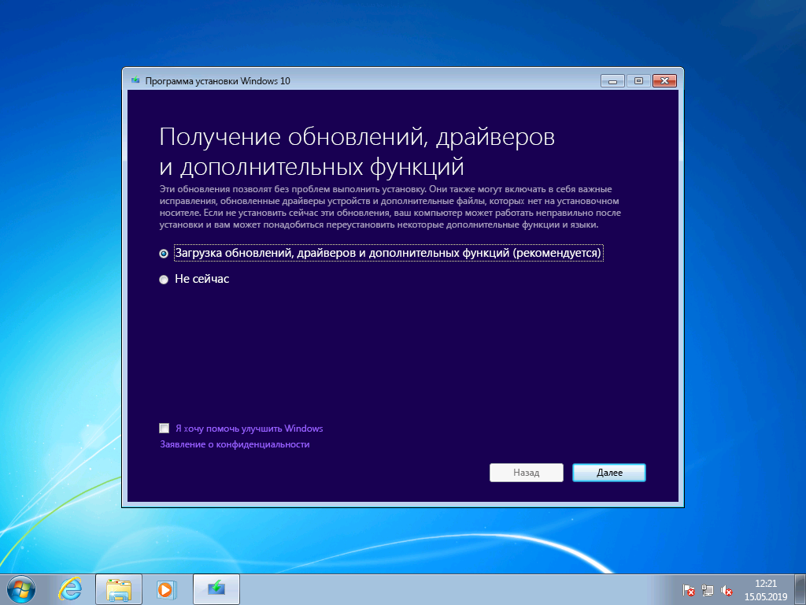
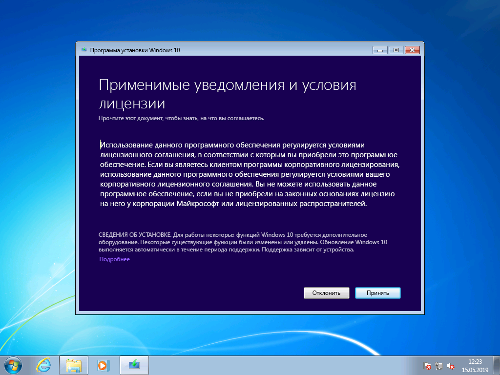
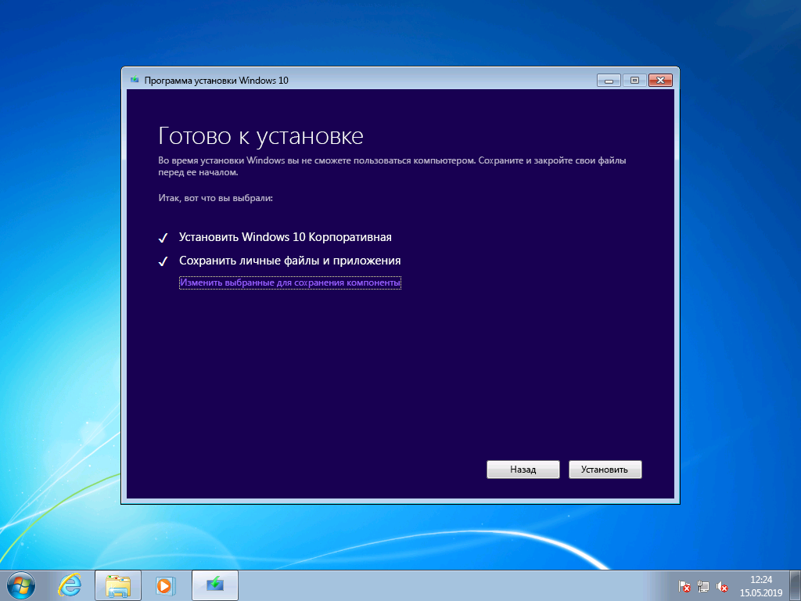
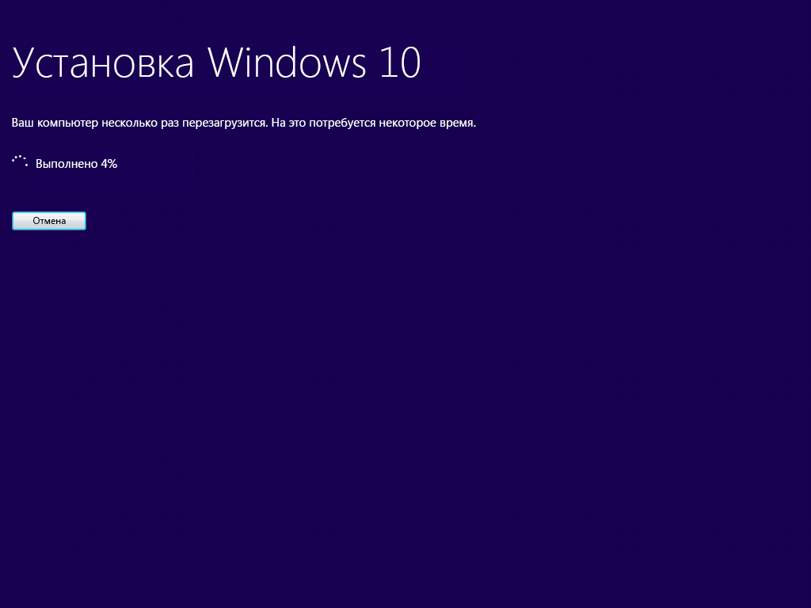
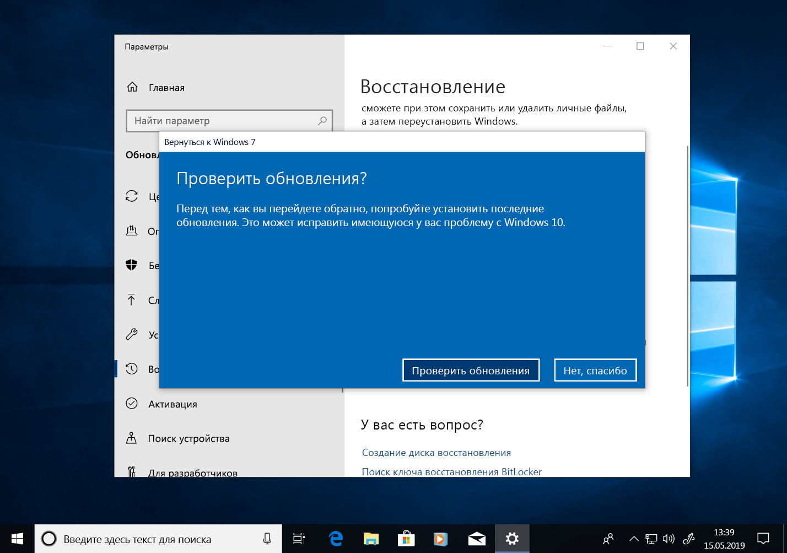

# Пошаговое руководство по переходу с Windows 7 на Windows 10 в ручном режимеWindows 7 to Windows 10 manual upgrade step-by-step guide

В этой статье описан процесс перехода в ручном режиме с версии Windows 7 Корпоративная для ПК на Windows 10 Корпоративная.This article describes the process to manually upgrade a Windows 7 Enterprise PC to Windows 10 Enterprise. Для других выпусков Windows 7, таких как Домашняя и Профессиональная, процесс очень похож, но у вас также есть вариант непосредственного перехода с помощью средства создания мультимедиа.For other Windows 7 editions, such as Home and Professional, the process is very similar, but you also have the option to upgrade directly using the media creation tool. Для перехода с любого выпуска Windows 7 на Windows 10 требуется действительный ключ продукта и соответствующий или более полный выпуск Windows, например Windows 7 Профессиональная можно обновить до Windows 10 Pro, но нельзя обновить до Windows 10 Домашняя.Upgrades for any edition of Windows 7 to Windows 10 will require a valid product key and matching or higher edition of Windows, for example Windows 7 Professional can upgrade to Windows 10 Pro, but cannot be upgraded to Windows 10 Home. Windows 7 Максимальная требуется обновлять до Windows 10 Pro.Windows 7 Ultimate will need to be upgraded to Windows 10 Pro.

## Обновления до Windows 10 с помощью средства создания мультимедиа или ISO-файловWindows 10 upgrades using the media creation tool or ISO files

Вы можете сразу перейти на Windows 10 с помощью [средства создания мультимедиа](https://www.microsoft.com/en-us/software-download/windows10ISO) или использовать его, чтобы скачать Windows 10 в виде ISO-файла.You can upgrade to Windows 10 directly using the [media creation tool](https://www.microsoft.com/en-us/software-download/windows10ISO) or use the it to download Windows 10 as an ISO file. Нужно учитывать архитектуру текущей системы (32- или 64-разрядная), язык системы по умолчанию и выпуск Windows 7 (например, Домашняя, Профессиональная или Корпоративная).You’ll need to note whether your current system is 32 or 64-bit, your system’s default language and edition of Windows 7 (e.g. Home, Professional, or Enterprise). В Windows 7 эта информация находится в разделе "Панель управления" \> "Система и безопасность" \> "Система".In Windows 7, this information is located in the Control Panel \> System and Security \> System. Средство создания мультимедиа не поддерживает Windows 10 Корпоративная для обновлений, создания установочного носителя или скачивания ISO-файлов.The media creation tool does not support Windows 10 Enterprise for upgrades, creating installation media or downloading ISO files. Если вы обновляетесь с Windows 7 Корпоративная, требуется Windows 10 Корпоративная.Windows 10 Enterprise is required if you are upgrading from Windows 7 Enterprise.

> Параметры средства создания мультимедиа Windows 10Windows 10 media creation tool options

При переходе с Windows 7 Корпоративная на Windows 10 Корпоративная вам потребуется скачать ISO-файл для своего языка и архитектуры (32- или 64-разрядной) с сайта [Volume Licensing Service Center](https://www.microsoft.com/licensing/servicecenter/default.aspx).When upgrading from Windows 7 Enterprise to Windows 10 Enterprise, you’ll need to download the ISO file for your language and architecture (32-bit or 64-bit) from the [Volume Licensing Service Center](https://www.microsoft.com/licensing/servicecenter/default.aspx).

Если вы планируете выполнить переход с помощью ISO-файла, потребуется извлечь файлы из формата ISO в локальную файловую систему, на съемный диск или записать ISO-файл на DVD-диск.If you plan to perform the upgrade using an ISO file, you will need to extract the files within the ISO to either your local file system, to a removable drive, or you can burn the ISO file to a DVD. Вы можете извлечь файлы установки из формата ISO с помощью компьютера с установленной Windows 8 или более поздней версией, а затем сохранить их на съемном USB-накопителе или использовать приложение, например [7zip](https://www.7-zip.org/), чтобы извлечь содержимое ISO-файла в папку на локальном диске в Windows 7.You can extract the installation files within the ISO using a Windows 8 or newer PC and save these files to removable USB storage or use an application such as [7zip](https://www.7-zip.org/) to extract the contents of your ISO file to a folder on your local drive within Windows 7.

После подготовки установочного носителя в Windows 7 вы можете начать обновление, запустив файл setup.exe, как показано ниже.Once you have the install media available in Windows 7, you can initiate the upgrade by running setup.exe as shown below.

**Важный совет. Для обновления на месте, при котором приложения и данные переносятся в Windows 10, необходимо запустить процесс из работающего сеанса Windows 7. Загрузка на установочный носитель с DVD-диска или USB-накопителя не позволит сохранить ваши приложения и файлы, а приведет к выполнению чистой установки Windows 10.****Important tip: For an in-place upgrade where applications and your data are migrated to Window 10, you’ll need to initiate the process from within a running Windows 7 session. Booting to install media from a DVD or USB drive will not give you the option to keep your apps and files, instead it will perform a clean install of Windows 10.**

> Файлы, извлеченные из ISO-образа 32-разрядной версии Windows 10 КорпоративнаяExtracted files from a Windows 10 Enterprise 32-bit ISO

В процессе установки Windows 10 вам будут предложены пошаговые инструкции по установке, а на первом экране будет предоставлена возможность скачать обновления, драйверы и дополнительные компоненты.Within Windows 10 Setup, you will be guided through the installation process and the first screen provides an option to download updates, drivers and optional features. Это рекомендуется для успешного обновленияThis is recommended to help ensure success with the upgrade

> Начальное окно программы установки Windows 10Initial Windows 10 Setup screen

После применения обновлений программа установки Windows 10 перейдет к следующему этапу, выбору образа.Once updates have been applied, Windows 10 Setup will move to the next phase, Select Image. Вам потребуется выбрать выпуск Windows.Here, you will need to select your edition of Windows. В этом случае, так как на компьютере установлена операционная система Windows 7 Корпоративная, вы можете выбрать Windows 10 Корпоративная.In this case, since the PC has Windows 7 Enterprise installed, you would select Windows 10 Enterprise.

> Экран выбора 32-разрядного образа Windows 10 КорпоративнаяWindows 10 Enterprise 32-bit image selection screen

На следующем экране программы установки Windows 10 отображаются применимые уведомления и условия лицензии.In the next screen in Windows 10 Setup, you’re presented with applicable notices and license terms. После прочтения и ознакомления с уведомлениями и условиями нажмите кнопку "Принять", чтобы продолжить, или "Отклонить", чтобы отменить процесс.Once you have read and understand the notices and terms, click “Accept” to continue or “Decline” to cancel.

*Применимые уведомления и условия лицензии для Windows 10**Windows 10 Applicable notices and license terms*

Теперь программа установки Windows 10 выполняет поиск дополнительных обновлений.Now Windows 10 Setup will look for additional updates.

*Получение обновлений программой установки Windows 10**Windows 10 Setup getting updates*

После завершения программа установки Windows 10 готова к установке и по умолчанию настроена на установку Windows 10 и сохранение личных файлов и установленных приложений.Once complete, Windows 10 Setup is ready to install and by default is configured to install Windows 10 and keep your personal files and apps installed. Рекомендуется использовать этот вариант.This is the recommended option. Щелкнув команду "Изменить выбранные для сохранения компоненты", вы увидите дополнительные параметры.By clicking, “Change what to keep,” you’ll find additional options. В противном случае нажмите кнопку "Установить".Otherwise, click “Install.”

*Параметр обновления по умолчанию в программе установки Windows 10**Windows 10 Setup upgrade option default*

Если выбрать команду "Изменить выбранные для сохранения компоненты", отобразятся следующие варианты:If you select “Change what to keep”, you’ll be presented with these options:

Параметр "Сохранить только мои личные файлы" не перенесет установленные приложения или настройки с Windows 7 на Windows 10.“Keep personal files only” will not move your installed apps or settings from Windows 7 to Windows 10. В Windows будут перенесены только ваши файлы и учетные записи пользователей.Instead it will only move your files and user accounts to Windows. При использовании этого параметра позже потребуется переустановить приложения.Apps will need to be reinstalled later with this option. Применяйте этот параметр только в том случае, если вы уверены, что сможете переустановить и настроить приложения, необходимые после установки Windows, в противном случае используйте параметр "Сохранить личные файлы и приложения".Only use this option if you are confident you can reinstall and configure the apps you will need after Windows is installed, otherwise stick with the default “Keep personal files and apps” option.

Параметр "Ничего не сохранять" удаляет ваши файлы, приложения и настройки с выполнением чистой установки Windows.“Nothing” will delete your files, apps and settings and perform a clean install of Windows. Используйте этот параметр только в том случае, если вы ранее выполнили резервное копирование данных, которые нужно сохранить, и можете переустановить приложения.Use this option only if you have previously backed up the data you want to keep and you are able to reinstall your apps.

*Варианты установки Windows 10**Windows 10 Setup installation options*

Теперь программа установки Windows 10 снова получает обновления с учетом выбора на предыдущем экране.Now Windows 10 Setup will get updates again based on what you selected in the previous screen.

*Получение обновлений программой установки Windows 10**Windows 10 Setup getting updates*

Теперь в течение нескольких минут будет выполняться установка Windows 10, и если вы решили сохранить личные файлы и приложения, все элементы будут находиться в тех же файловых расположениях, а ваши приложения будут доступны в Windows 10.Now Windows 10 will install for several minutes and if you chose to keep your personal files and apps, everything will be in the same file locations and your apps will now be available in Windows 10.

*Ход установки Windows 10**Windows 10 installation progress*

## 

## Восстановление в Windows 10Recovery in Windows 10

После установки Windows 10 параметр восстановления в Windows 10 предоставляет вам возможность в течение 10 дней вернуться к Windows 7.After Windows 10 is installed, the Recovery option in Windows 10 gives you up to 10 days to go back to Windows 7. Это удобно, если устройство или приложение в вашей системе работает неправильно, и вам нужно вернуться к предыдущей установке Windows 7.This is useful if a device or app on your system does not function properly and you need to go back to your previous Windows 7 installation. По истечении 10 дней Windows 10 по умолчанию освобождает место на жестком диске, используемое файлами восстановления Windows 7, и удаляет файлы предыдущей установки.After 10 days, by default Windows 10 will free up the space consumed by your Windows 7 recovery files on your hard drive and delete files from the previous installation. Хотя после этого система Windows 7 удалена, и вы не сможете вернуться к ней, ваши приложения и личные файлы останутся в Windows 10.Although Windows 7 after this time is deleted and you won’t be able to revert Windows 7, your apps and personal files will remain in Windows 10.

Чтобы запустить процесс возврата к Windows 7, перейдите в раздел "Параметры" \> "Обновление и безопасность" \> "Восстановление".To start the Go back to Windows 7 process, navigate to Settings \> Update & Security \> Recovery. В разделе "Вернуться к Windows 7" нажмите кнопку "Начать".Under Go back to Windows 7, select “Get started.”

*Параметры восстановления в Windows 10**Windows 10 Recovery options*

После этого Windows 10 спросит причину возврата.Now, Windows 10 will ask why you are going back. Если имеется техническая причина, рекомендуется указать ее, чтобы помочь в поиске решения и чтобы другие пользователи воспользовались вашим опытом.If there is a technical reason, this is useful to fill out in order to help drive resolution and ensure others can benefit from your experience.

*Вопрос в Windows 10 о причине возврата к Windows 7**Windows 10 asking why you are going back to Windows 7*

Во многих случаях для вашей версии Windows 10 выпускаются обновления, которые могут устранить технические проблемы.In many cases, your version of Windows 10 will have had updates issued, which may resolve technical issues. Рекомендуется проверять обновления, а после их обнаружения и установки следует проверить, устранены ли возникшие у вас проблемы.It is encouraged that you check for updates and if found and installed, then check if that fixes the problems you have experienced.

*Проверка наличия обновлений при восстановлении в Windows 10**Windows 10 Recovery check for updates*

Если обновления не устраняют проблемы и вам нужно вернуться к предыдущей установке Windows 7, может потребоваться переустановить некоторые приложения, например любые приложения, установленные при работе с Windows 10, а некоторые настройки могут быть потеряны.If the updates do not resolve issues and you do need to revert to your previous installation of Windows 7, there is a chance that some apps will need to be reinstalled – such as any app that installed during the time you were running Windows 10 – and some settings may be lost. Важно отметить, что файлы и документы, сохраненные локально при использовании Windows 10, сохранятся и будут доступны вам после возврата к Windows 7.Importantly, files and docs you’ve saved locally while using Windows 10 will remain and be available for you once you’re back in Windows 7. 

*Восстановление в Windows 10: необходимые сведения**Windows 10 Recovery: What you need to know*

Перед началом подготовьте локальную или доменную учетную запись с паролем от предыдущей установки Windows 7.Before you get started, make sure you have a local or domain account and password ready from the previous Windows 7 installation.

*Проверка наличия учетных данных для входа от предыдущей установки при восстановлении в Windows 10**Windows 10 Recovery ensuring you have logon credentials from the previous installation*

Теперь можно начать процесс возврата к Windows 7.From here you can initiate the process to go back to Windows 7. Через несколько минут ваш компьютер загрузится в Windows 7 с интерфейсом, предшествовавшим переходу на Windows 10.After a few minutes, your PC will boot back into Windows 7 with the same experience prior to upgrading to Windows 10.

*Конечный экран восстановления в Windows 10 перед возвратом к Windows 7**Windows 10 Recovery final screen before going back to Windows 7*

## Переход на Windows 10 на новом компьютереMoving to Windows 10 on a new PC

Другой рекомендуемый вариант: переход на Windows 10 на новом компьютере.Another recommended option is to move to Windows 10 on a new PC. Если выбран этот вариант, вы сможете перенести файлы со старого компьютера, используя резервное копирование [OneDrive](https://support.office.com/article/b5e918be-0fd4-4095-98da-bceed57f8e0c?ocid=MoveToWindows10), [функцию резервного копирования и восстановления, встроенную в Windows](https://support.microsoft.com/help/4469209?ocid=MoveToWindows10), вручную используя [внешнее запоминающее устройство](https://support.microsoft.com/ru-RU/help/4465814/windows-7-move-files-off-pc-with-an-external-storage-device?ocid=MoveToWindows10) или такие средства, как [PCmover Express от Laplink](https://www.microsoft.com/en-us/windows/transfer-your-data).If this is your preference, you can transfer your files from your old computer using [OneDrive](https://support.office.com/article/b5e918be-0fd4-4095-98da-bceed57f8e0c?ocid=MoveToWindows10) backup, [Backup and Restore built into Windows](https://support.microsoft.com/help/4469209?ocid=MoveToWindows10), manually using an [external storage device](https://support.microsoft.com/en-us/help/4465814/windows-7-move-files-off-pc-with-an-external-storage-device?ocid=MoveToWindows10), or tools like [Laplink’s PCmover Express](https://www.microsoft.com/en-us/windows/transfer-your-data). При использовании любого из этих вариантов по-прежнему потребуется переустановка всех необходимых приложений, не входящих в состав Windows 10.With any of these options, you will still need to re-install any required applications not included with Windows 10. Дополнительные сведения о возможностях ручного перехода с существующего компьютера под управлением Windows 7 на новый компьютер с Windows 10 см. в статье [Переход на компьютер с Windows 10](https://support.microsoft.com/ru-RU/help/4229823?ocid=MoveToWindows10) в службе поддержки Windows.To learn more about your options for manually moving from an existing PC running Windows 7 to a new PC with Windows 10, see [Moving to a Windows 10 PC](https://support.microsoft.com/en-us/help/4229823?ocid=MoveToWindows10) in Windows Support.

## [Центр развертывания компьютеровDesktop Deployment Center](https://aka.ms/howtoshift)