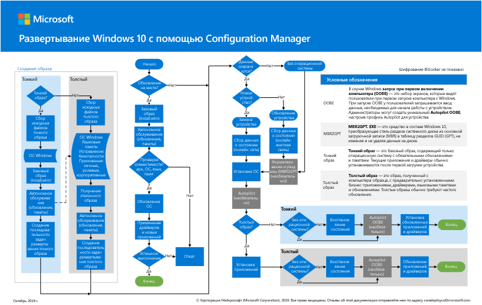

# Шаг 2: развертывание Windows 10 Корпоративная для существующих устройств в качестве обновления на месте

*Эта статья относится как к корпоративным, так и к версиям Microsoft 365 для Microsoft*

Самый простой путь обновления компьютеров под управлением Windows 7 или Windows 8,1 до Windows 10 заключается в обновлении на месте. Для полной автоматизации процесса можно использовать последовательность задач диспетчера конфигураций (Configuration Manager). 

Если у вас есть компьютеры под управлением Windows 7 или Windows 8,1, рекомендуем этот путь, если ваша организация развертывает Windows 10. При этом будет использоваться программа установки Windows (Setup. exe) для выполнения обновления на месте, которое автоматически сохраняет все данные, параметры, приложения и драйверы из существующей версии операционной системы. Это требует наименьшей ИТ-силы, так как нет необходимости в сложной инфраструктуре развертывания.

Выполните следующие действия, чтобы настроить и развернуть образ Windows 10 Корпоративная с помощью диспетчера конфигураций конечных точек Майкрософт в качестве обновления на месте.

## Плакат "Развертывание Windows 10 с помощью Configuration Manager"

Афиша диспетчера конфигураций — одна страница в альбомном режиме (17x11). Щелкните изображение ниже, чтобы просмотреть документ PDF в браузере. 

Вы также можете скачать этот плакат в формате [PDF](https://github.com/MicrosoftDocs/windows-itpro-docs/raw/public/windows/deployment/media/Windows10DeploymentConfigManager.pdf) или [Visio](https://github.com/MicrosoftDocs/windows-itpro-docs/raw/public/windows/deployment/media/Windows10DeploymentConfigManager.vsdx).

## Часть 1: Проверка готовности к обновлению Windows

Для начала используйте функцию готовности к обновлению Windows Analytics, чтобы предоставить эффективные сведения и рекомендации о компьютерах, приложениях и драйверах в Организации, без дополнительных затрат и без дополнительных требований к инфраструктуре. Эта новая служба предоставляет вам возможности по обновлению и обновлению функций с помощью рабочих процессов, основанных на рекомендуемых рекомендациях корпорации Майкрософт. Актуальные данные инвентаризации позволяют сбалансировать затраты и риски в проектах обновления.

Ознакомьтесь с разработкой [обновлений Windows, готовой к обновлению](https://docs.microsoft.com/windows/deployment/upgrade/manage-windows-upgrades-with-upgrade-readiness) , для получения дополнительных сведений, начала работы, использования и устранения неполадок готовности к обновлению.

Далее следуйте указаниям по использованию диспетчера конфигураций (Текущая ветвь) для обновления операционной системы Windows 7 или более поздней до Windows 10. Как и в случае с развертыванием с высоким уровнем риска, мы рекомендуем создать резервную копию пользовательских данных перед тем, как продолжить. Облачное хранилище OneDrive готово к использованию лицензированным пользователям Microsoft 365 и может использоваться для безопасного хранения файлов. Дополнительные сведения можно найти в [кратком руководстве по началу OneDrive](https://aka.ms/ODfBquickstartguide). Для доступа к этой странице необходимо войти в систему как администратор клиента или глобальный администратор в клиенте Office 365 или Microsoft 365.

Список версий Configuration Manager и соответствующих поддерживаемых версий клиентов Windows 10 можно узнать в статье [Поддержка Windows 10 для Configuration Manager](https://docs.microsoft.com/configmgr/core/plan-design/configs/support-for-windows-10).

**Проверка готовности к обновлению Windows**

Прежде чем приступать к развертыванию Windows 10, изучите указанные ниже требования.

- В **выпусках Windows, подходящих для обновления** , на ваших устройствах должны быть установлены выпуски Windows 7 или Windows 8,1, которые можно использовать для обновления до Windows 10 Корпоративная. Список поддерживаемых выпусков приведен в статье [варианты обновления Windows 10](https://aka.ms/win10upgradepaths). 
- **Поддерживаемые устройства** — большинство компьютеров, совместимых с Windows 8,1, будут совместимы с Windows 10. Для правильной работы устройств может потребоваться установить обновленные драйверы в Windows 10. Более подробную информацию вы найдете в статье [спецификации Windows 10](https://aka.ms/windows10specifications) .
- **Подготовка к развертыванию** прежде чем приступить к настройке развертывания, убедитесь, что у вас есть следующее:
    - Установочный носитель Windows 10 — установочный носитель должен находиться на отдельном диске с уже установленным ISO-образом. Вы можете получить ISO-файл из центра [загрузки для подписчиков MSDN](https://aka.ms/msdn-subscriber-downloads) или из [центра обслуживания корпоративного лицензирования](https://aka.ms/mvlsc).
    - Резервные копии пользовательских данных, хотя пользовательские данные будут перенесены при обновлении, рекомендуется настроить сценарий резервного копирования. Например, экспортируйте все пользовательские данные в учетную запись OneDrive, с помощью BitLocker на зашифрованное USB-устройство флэш-памяти или сетевой файловый сервер. Более подробную информацию можно узнать [в статье резервное копирование или передача данных в Windows](https://aka.ms/backuptransferdatawindows).
- **Подготовка среды** . для подготовки к развертыванию операционной системы вы будете использовать существующую структуру сервера Configuration Manager. В среде Configuration Manager в дополнение к базовой настройке необходимо внести следующие конфигурации:
    1. [Расширьте схему Active Directory](https://aka.ms/extendadschema) и [создайте контейнер управления системой](https://aka.ms/createsysmancontainer).
    2. Включение обнаружения лесов Active Directory и обнаружения системы Active Directory. Дополнительные сведения см. в разделе [Configure Discovery Methods for Configuration Manager](https://aka.ms/configurediscoverymethods).
    3. Создание границ диапазонов IP-адресов и группы границ для контента и назначения сайта. Дополнительную информацию можно узнать в статье [Определение границ сайтов и групп границ для диспетчера конфигураций](https://aka.ms/definesiteboundaries).
    4. Добавление и Настройка роли точки служб отчетов Configuration Manager. Дополнительные сведения см в разделе [Настройка отчетов в Configuration Manager](https://aka.ms/configurereporting).
    5. Создайте структуру папок файловой системы для пакетов.
    6. Создайте структуру папок консоли Configuration Manager для пакетов.
    7. Установите обновления Configuration Manager (текущей ветви) и все дополнительные необходимые компоненты для Windows 10.

## Часть 2: Добавление образа Windows 10 OS с помощью диспетчера конфигураций
Теперь вам потребуется создать пакет обновления операционной системы, содержащий полный установочный носитель с Windows 10. Выполните следующие действия, чтобы создать пакет обновления для Windows 10 Корпоративная x64 с помощью Configuration Manager.

**Добавление образа Windows 10 OS с помощью диспетчера конфигураций**

1. С помощью консоли диспетчера конфигураций в рабочей области " **Библиотека программного обеспечения** " щелкните правой кнопкой мыши узел **пакеты обновления операционной системы** , а затем выберите команду **Добавить пакет обновления операционной системы**.
2. На странице **источник данных** укажите UNC-путь к носителю Windows 10 Корпоративная, а затем нажмите кнопку **Далее**.
3. На странице " **Общие** " укажите **Windows 10 корпоративное обновление x64**, а затем нажмите кнопку **Далее**. 
4. На странице **Сводка** нажмите кнопку **Далее**, а затем нажмите кнопку **Закрыть**. 
5. Щелкните правой кнопкой мыши созданный пакет **обновления Windows 10 Корпоративная x64** , а затем выберите пункт **распространение контента**. 
6. Выберите точку распространения.

## Часть 3: Настройка параметров развертывания
На этом этапе вы настроите последовательность задач обновления, содержащую параметры обновления до Windows 10. Затем определите устройства для обновления, а затем разверните последовательность задач для этих устройств.

### Создание последовательности задач
Чтобы создать последовательность задач обновления, выполните следующие действия:
  
1. В рабочей области " **Библиотека программного обеспечения** " консоли диспетчера конфигураций разверните узел **операционные системы**. 
2. Щелкните узел " **последовательности задач** " правой кнопкой мыши и выберите команду **создать последовательность задач**.
3. На странице **Создание новой последовательности задач** выберите **обновление операционной системы из пакета обновления**, а затем нажмите кнопку **Далее**.
4. На странице **сведения о последовательности задач** укажите **Обновление Windows 10 Корпоративная с архитектурой x64**, а затем нажмите кнопку **Далее**.
5. На странице **обновление операционной системы Windows** нажмите кнопку **Обзор** и выберите **пакет обновления операционной системы для Windows 10 Корпоративная, обновление операционной системы x64**, нажмите кнопку **ОК**, а затем нажмите кнопку **Далее**.
6. Перейдите к оставшимся страницам мастера и нажмите кнопку **Закрыть**.

### Создание коллекции устройств
После создания последовательности задач обновления необходимо создать коллекцию, содержащую устройства, которые будут обновлены.

> [!NOTE]
> Используйте следующие параметры для тестирования развертывания на отдельном устройстве. Вы можете использовать различные правила членства, чтобы включить группы устройств, которые будут готовы к работе. Для получения дополнительных сведений Узнайте, [как создавать коллекции в Configuration Manager](https://docs.microsoft.com/configmgr/core/clients/manage/collections/create-collections).

1. В консоли диспетчера конфигураций в рабочей области " **ресурсы и соответствие требованиям** " щелкните правой кнопкой мыши пункт **коллекции устройств**и выберите команду **создать коллекцию устройств**. 
2. В мастере создания коллекции устройств на странице **Общие** введите следующие параметры, а затем нажмите кнопку **Далее**.
    - Name: обновление Windows 10 Корпоративная с архитектурой x64
    - Ограничение коллекции: все системы
3. На странице " **правила членства** " выберите **Добавить** > **правило** правила для запуска мастера создания правила прямого членства.
4. На странице **приветствия** мастера создания правила прямого членства нажмите кнопку **Далее**.
5. На странице " **Поиск ресурсов** " введите следующие параметры, заменив текст **значения** заполнителя на имя обновляемого устройства: 
    - Класс ресурса: системный ресурс
    - Имя атрибута: Name
    - Значение: *PC0003*
6. На странице **Выбор ресурсов** выберите устройство и нажмите кнопку **Далее**.
7. Заполните мастер создания правила прямого членства и мастер создания коллекции устройств.  
8. Просмотрите семейство Windows 10 Корпоративная с обновлением x64. Не продолжайте, пока не увидите компьютеры, добавленные в коллекцию.

### Создание развертывания операционной системы
Выполните следующие действия, чтобы создать развертывание для последовательности задач.

1. В рабочей области " **Библиотека программного обеспечения** " консоли диспетчера конфигураций щелкните правой кнопкой мыши последовательность задач, созданную на предыдущем шаге, а затем выберите команду **развернуть**.
2. На странице " **Общие** " выберите семейство **Windows 10 Корпоративная для обновления x64** , а затем нажмите кнопку **Далее**.
3. На странице **содержимое** нажмите кнопку **Далее**.
4. На странице **Параметры развертывания** выберите следующие параметры, а затем нажмите кнопку **Далее**.

    > [!NOTE]
    > Для данного тестового развертывания вы настроили назначение как **Доступные**, которое требует вмешательства пользователя для запуска развертывания. В рабочей среде можно автоматизировать развертывание с использованием необходимой цели, которая включает в себя настройку дополнительных параметров, таких как планирование при запуске развертывания. 

    - Действие: install
    - Цель: доступна

5. На странице **планирования** примите параметры по умолчанию, а затем нажмите кнопку **Далее**.
6. На странице **взаимодействие с пользователем** примите параметры по умолчанию, а затем нажмите кнопку **Далее**.
7. На странице **оповещения** примите параметры по умолчанию, а затем нажмите кнопку **Далее**.
8. На странице **Сводка** нажмите кнопку **Далее**, а затем нажмите кнопку **Закрыть**.

## Часть 4: запуск последовательности задач обновления Windows 10
Выполните следующие действия, чтобы запустить последовательность задач обновления Windows 10 на устройстве, которое вы обновляете.
 
1. Войдите на компьютер с Windows и запустите **центр программного обеспечения**.
2. Выберите последовательность задач, созданную на предыдущем шаге, а затем нажмите кнопку **установить**.
3. После начала последовательности задач она автоматически инициирует процесс обновления на месте, вызывая программу установки Windows (Setup. exe) с необходимыми параметрами командной строки для выполнения автоматического обновления, сохраняющего все данные, параметры, приложения и версий.
4. После успешного завершения последовательности задач компьютер будет полностью обновлен до Windows 10.

Если у вас возникли проблемы при использовании Windows 10 в корпоративной среде, вы можете обратиться к наиболее [распространенным решениям по поддержке корпорации Майкрософт](https://docs.microsoft.com/windows/client-management/windows-10-support-solutions). Эти ресурсы включают статьи базы знаний, обновления и статьи библиотеки.

При развертывании обновлений в Организации используйте возможность обновления соответствия требованиям Windows Analytics, чтобы обеспечить целостное представление о соответствии обновления ОС, процессе развертывания обновления и устранение неполадок при неисправности для устройств с Windows 10. Эта новая служба использует диагностические данные, в том числе сведения о ходе установки, конфигурации центра обновления Windows и другие сведения, которые обеспечивают такие сведения, без дополнительных затрат и без дополнительных требований к инфраструктуре. Независимо от того, используется ли центр обновления Windows для бизнеса или другие средства управления, вы можете быть уверены, что ваши устройства обновлены правильно.

Просмотрите раздел [мониторинг обновлений Windows и антивирусной программы "Защитник Windows"](https://docs.microsoft.com/windows/deployment/update/update-compliance-monitor) , чтобы узнать больше об этом, приступите к работе и используйте обновление соответствия требованиям.

Прежде чем перейти к следующему шагу, проверьте [условия](windows10-exit-criteria.md#crit-windows10-step2), при выполнении которых можно считать данный шаг завершенным.

## Следующий шаг

|||
|:-------|:-----|
|| [Развертывание Windows 10 Корпоративная для новых устройств с помощью Windows автопилот](windows10-deploy-autopilot.md) |
