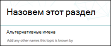

# Создание новой темы в Microsoft Viva TopicsCreate a new topic in Microsoft Viva Topics

В Viva Topics можно создать новую тему, если ее не обнаружить с помощью индексации или если технология ИИ не обнаружила достаточных доказательств, чтобы установить ее в качестве темы.In Viva Topics, you can create a new topic if one is not discovered through indexing or if the AI technology did not find enough evidence to establish it as a topic.

> [!Note] 
> Хотя сведения в теме, собираемой ИИ, обрезаются, обратите внимание, что описание темы и сведения о пользователях в созданной вручную теме видны всем пользователям, у которых есть разрешения на просмотр этой темы.While information in a topic that is gathered by AI is [security trimmed](topic-experiences-security-trimming.md), note that topic description and people information in a manually created topic is visible to all users who have permissions to view the topic. 

## RequirementsRequirements

Чтобы создать новую тему, необходимо:To create a new topic, you need to:
- Лицензия Viva Topics.Have a Viva Topics license.
- Есть разрешения для [**тех, кто может создавать или изменять темы.**](./topic-experiences-user-permissions.md)Have permissions to [**Who can create or edit topics**](./topic-experiences-user-permissions.md). Администраторы знаний могут предоставить пользователям это разрешение в настройках разрешений темы Viva Topics.Knowledge admins can give users this permission in the Viva Topics topic permissions settings. 

> [!Note] 
> Пользователи, у которых есть разрешение на управление темами в центре тем (менеджеры знаний), уже имеют разрешения на создание и редактирование тем.Users who have permission to manage topics in the topic center (knowledge managers) already have permissions to create and edit topics.

## Создание темыTo create a topic

Вы можете создать новую тему из двух местоположений:You can create a new topic from two locations:

- Главная страница центра темы. Любой лицензированный пользователь с разрешением who can create or **edit topics** (contributors) может создать новую тему из центра темы, выбрав новое меню и выберите страницу **Тема**. Topic center home page: Any licensed user with the **Who can create or edit topics** permission (contributors) can create a new topic from the topic center by selecting the **New** menu and select **Topic page**. 

      

- Управление страницей тем. Любой  лицензированный пользователь, который может управлять разрешениями на темы (менеджеры знаний), может создать новую тему на странице Управление темами в Центре тем, выбрав новую страницу **темы**.Manage topics page:  Any licensed user who has **Who can manage topics** permission (knowledge managers) can create a new topic from the Manage topics page in the Topic Center by selecting **New topic page**. 

      

### Создание новой темы:To create a new topic:

1. Выберите вариант создания новой страницы темы из ленты на странице Управление темами.Select the option to create a new Topic Page from the ribbon on the Manage Topics page.

2.  В разделе **Имя этой темы** введите имя новой темы.In the **Name this topic** section, type the name of the new topic.

      

3. В разделе **Альтернативные имена** введите любые другие имена, на которые может быть передана тема.In the **Alternate Names** section, type any other names that the topic might be referred to. 

      

4. В разделе **Описание** введите несколько предложений, описывая тему.In the **Description** section, type a couple of sentences that describe the topic. 

    

4. В разделе **Pinned people** можно "прикрепить" человека, чтобы показать его как подключенного к теме (например, владельца подключенного ресурса).In the **Pinned people** section, you can "pin" a person to show them as having a connection to the topic (for example, an owner of a connected resource). Начните с ввода их имени  или адреса электронной почты в добавлении нового пользовательского окна, а затем выберите пользователя, которого вы хотите добавить из результатов поиска.Begin by typing their name or email address in the **add a new user** box, and then select the user you want to add from the search results. Их можно также "открепить", выбрав значок **Remove from list** на карточке пользователя.You can also "unpin" them by selecting the **Remove from list** icon on the user card. Вы также можете перетаскивать человека в другое место в списке.You can also drag the person to another place in the list.
 
    

5. В разделе **Pinned files and pages** можно добавить или "закрепить" файл или страницу сайта SharePoint, связанную с этой темой.In the **Pinned files and pages** section, you can add or "pin" a file or SharePoint site page that is associated to the topic.

   
 
    Чтобы добавить новый файл, выберите **Добавить,** выберите сайт SharePoint на своих сайтах Frequent или Followed, а затем выберите файл из библиотеки документов сайта.To add a new file, select **Add**, select the SharePoint site from your Frequent or Followed sites, and then select the file from the site's document library.

    Вы также можете использовать параметр **"Из** ссылки", чтобы добавить файл или страницу, предоставив URL-адрес.You can also use the **From a link** option to add a file or page by providing the URL. 

    > [!Note] 
    > Файлы и страницы, которые вы добавляете, должны располагаться в одном клиенте Microsoft 365.Files and pages that you add must be located within the same Microsoft 365 tenant. Если вы хотите добавить ссылку на внешний ресурс в этой теме, вы можете добавить ее через значок холста в шаге 8.If you want to add a link to an external resource in the topic, you can add it through the canvas icon in step 8.

6.  В **разделе Связанные сайты** показаны сайты, на которые есть сведения по этой теме.The **Related sites** section shows sites that have information about the topic. 

    

    Вы можете добавить соответствующий сайт, выбрав **Добавить,** а затем либо поискать сайт, либо выбрать его из списка частых или недавних сайтов.You can add a related site by selecting **Add** and then either searching for the site, or selecting it from your list of Frequent or Recent sites.
    
    

7. В **разделе Связанные темы** показаны подключения, которые существуют между темами.The **Related topics** section shows connections that exist between topics. Вы можете добавить подключение к другой теме, выбрав кнопку **Подключение** к связанной теме, а затем введя имя связанной темы и выбрав ее из результатов поиска.You can add a connection to a different topic by selecting the **Connect to a related topic** button, and then typing the name of the related topic, and selecting it from the search results. 

     

    Затем можно дать описание того, как связаны темы, и выбрать **обновление.**You can then give a description of how the topics are related, and select **Update**.

    

   Добавленная вами связанная тема будет отображаться в качестве связанной темы.The related topic you added will display as a connected topic.

    

   Чтобы удалить связанную тему, выберите раздел, который необходимо удалить, а затем выберите значок **Удалить тему.**To remove a related topic, select the topic you want to remove, then select the **Remove topic** icon.
 
     

   Затем выберите **Удалить**.Then select **Remove**.

    

8. Кроме того, можно добавить на страницу статические элементы (например, текст, изображения или ссылки), выбрав значок холста, который можно найти ниже краткого описания.You can also add static items to the page (such as text, images, or links) by selecting the canvas icon, which you can find below the short description. При его выборе откроется ящик инструментов SharePoint, из которого можно выбрать элемент, который необходимо добавить на страницу.Selecting it will open the SharePoint toolbox from which you can choose the item you want to add to the page.

    

9. Выберите **Публикацию,** чтобы сохранить изменения.Select **Publish** to save your changes. 

После публикации страницы имя темы, альтернативное имя, описание и закрепленные пользователи будут отображаться всем лицензированным пользователям, которые просматривают эту тему.After you publish the page, the topic name, alternate name, description, and pinned people will display to all licensed users who view the topic. Конкретные файлы, страницы и сайты будут отображаться на странице темы только в том случае, если у зрителя есть разрешения office 365 на элемент.Specific files, pages, and sites will only appear on the topic page if the viewer has Office 365 permissions to the item. 

## См. такжеSee also

