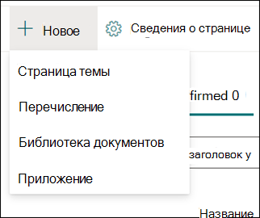
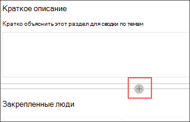

# Создание нового раздела (предварительная версия)

> [!Note] 
> Содержимое этой статьи для Project Cortex Private Preview. [Узнайте больше о работе с Project Cortex](https://aka.ms/projectcortex).

В разделе "Возможности" можно создать новый раздел, если он не был обнаружен посредством индексации или если технология ИИ не обнаружила достаточных свидетельств для его создания в качестве темы.

## Требования

Чтобы создать новый раздел, необходимо:
- Лицензия "Опыт работы с разделами".
- Разрешения на создание и [**редактирование**](https://docs.microsoft.com/microsoft-365/knowledge/topic-experiences-user-permissions)разделов. Администраторы знаний могут предоставить пользователям это разрешение в параметрах разрешений раздела "Сеть знаний". 

> [!Note] 
> Пользователи, у которых есть разрешения на управление темами в Центре тем (менеджеры по знаниям), уже имеют разрешения на создание и редактирование тем.

## Чтобы создать новый раздел:

1. On the Topic center page, select **New**, then select **Topic Page**. Если вы не можете  увидеть параметр "Новый" в центре тем, у вас могут не быть необходимых разрешений.

    

2. На странице нового раздела можно ввести сведения о новом шаблоне темы:

    - В разделе **"Имя"** введите имя нового раздела.
    
    - В разделе **"Альтернативные имена"** введите имена или акронимы, которые также используются для ссылки на раздел.
    
    - В разделе **"Краткое** описание" введите описание статьи с одним или двумя предложениями. Этот текст будет использоваться для связанной карточки темы.
    
    - В разделе **"Люди"** введите имена экспертов по теме. Люди, которых вы вручную добавили в раздел, будут отображаться на странице темы как **закрепленные люди.**
    
    - В разделе  **"Файлы и страницы" выберите** "Добавить", а затем на следующей странице можно выбрать связанные файлы OneDrive или страницы SharePoint Online.
    
    - В разделе **"Сайты"** выберите **"Добавить".** На  **отображаемой** области "Сайты" выберите сайты, связанные с темой.

    
    
3. Если вам нужно добавить на страницу другие компоненты, такие как текст, изображения, веб-части, ссылки и т. д., выберите значок холста в середине страницы, чтобы найти и добавить их.

    

4. После этого выберите **"Опубликовать",** чтобы опубликовать страницу темы. Страницы опубликованных разделов отображаются на **вкладке "Страницы".**

После публикации статьи имя темы, альтернативное имя, описание и закрепленные пользователи будут отображаться для всех лицензированных пользователей, просматривавших статью. Файлы, страницы и сайты отображаются на странице темы, только если у просматриваемой папки есть разрешения на доступ к элементу в Office 365. 

Страница нового раздела состоит из веб-частей, которые имеют знания *о сети.* Это означает, что по мере сбора дополнительных сведений по этой теме информация в этих веб-частях будет обновляться с помощью предложений, чтобы сделать страницу более полезной для пользователей.

## См. также

  

