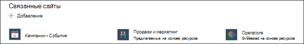

# Создание новой темы в Microsoft Viva Topics

В Viva Topics можно создать новую тему, если ее не обнаружить с помощью индексации или если технология ИИ не обнаружила достаточных доказательств, чтобы установить ее в качестве темы.

> [!Note] 
> Хотя сведения в теме, собираемой ИИ, обрезаются, обратите внимание, что описание темы и сведения о пользователях в созданной вручную теме видны всем пользователям, у которых есть разрешения на просмотр этой темы. 

## Requirements

Чтобы создать новую тему, необходимо:
- Лицензия Viva Topics.
- Есть разрешения для [**тех, кто может создавать или изменять темы.**](./topic-experiences-user-permissions.md) Администраторы знаний могут предоставить пользователям это разрешение в настройках разрешений темы Viva Topics. 

> [!Note] 
> Пользователи, у которых есть разрешение на управление темами в центре тем (менеджеры знаний), уже имеют разрешения на создание и редактирование тем.

## Создание темы

Вы можете создать новую тему из двух местоположений:

- Главная страница центра темы. Любой лицензированный пользователь с разрешением who can create or **edit topics** (contributors) может создать новую тему из центра темы, выбрав новое меню и выберите страницу **Тема**.  

      

- Управление страницей тем. Любой  лицензированный пользователь, который может управлять разрешениями на темы (менеджеры знаний), может создать новую тему на странице Управление темами в Центре тем, выбрав новую страницу **темы**. 

      

### Создание новой темы:

1. Выберите вариант создания новой страницы темы из ленты на странице Управление темами.

2.  В разделе **Имя этой темы** введите имя новой темы.

      

3. В разделе **Альтернативные имена** введите любые другие имена, на которые может быть передана тема. 

      

4. В разделе **Описание** введите несколько предложений, описывая тему. 

    

4. В разделе **Pinned people** можно "прикрепить" человека, чтобы показать его как подключенного к теме (например, владельца подключенного ресурса). Начните с ввода их имени  или адреса электронной почты в добавлении нового пользовательского окна, а затем выберите пользователя, которого вы хотите добавить из результатов поиска. Их можно также "открепить", выбрав значок **Remove from list** на карточке пользователя. Вы также можете перетаскивать человека в другое место в списке.
 
    

5. В разделе **Pinned files and pages** можно добавить или "закрепить" файл или страницу сайта SharePoint, связанную с этой темой.

   
 
    Чтобы добавить новый файл, выберите **Добавить,** выберите сайт SharePoint на своих сайтах Frequent или Followed, а затем выберите файл из библиотеки документов сайта.

    Вы также можете использовать параметр **"Из** ссылки", чтобы добавить файл или страницу, предоставив URL-адрес. 

    > [!Note] 
    > Файлы и страницы, которые вы добавляете, должны располагаться в одном клиенте Microsoft 365. Если вы хотите добавить ссылку на внешний ресурс в этой теме, вы можете добавить ее через значок холста в шаге 8.

6.  В **разделе Связанные сайты** показаны сайты, на которые есть сведения по этой теме. 

    

    Вы можете добавить соответствующий сайт, выбрав **Добавить,** а затем либо поискать сайт, либо выбрать его из списка частых или недавних сайтов.
    
    

7. В **разделе Связанные темы** показаны подключения, которые существуют между темами. Вы можете добавить подключение к другой теме, выбрав кнопку **Подключение** к связанной теме, а затем введя имя связанной темы и выбрав ее из результатов поиска. 

     

    Затем можно дать описание того, как связаны темы, и выбрать **обновление.**

    

   Добавленная вами связанная тема будет отображаться в качестве связанной темы.

    

   Чтобы удалить связанную тему, выберите раздел, который необходимо удалить, а затем выберите значок **Удалить тему.**
 
     

   Затем выберите **Удалить**.

    

8. Кроме того, можно добавить на страницу статические элементы (например, текст, изображения или ссылки), выбрав значок холста, который можно найти ниже краткого описания. При его выборе откроется ящик инструментов SharePoint, из которого можно выбрать элемент, который необходимо добавить на страницу.

    

9. Выберите **Публикацию,** чтобы сохранить изменения. 

После публикации страницы имя темы, альтернативное имя, описание и закрепленные пользователи будут отображаться всем лицензированным пользователям, которые просматривают эту тему. Конкретные файлы, страницы и сайты будут отображаться на странице темы только в том случае, если у зрителя есть разрешения office 365 на элемент. 

## См. также

