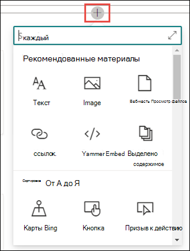

# Создание темыCreate a new topic 

В темах Viva можно создать новый раздел, если он не обнаружен посредством индексации или если технология ИИ не обнаружила достаточных свидетельств, чтобы установить его в качестве темы.In Viva Topics, you can create a new topic if one is not discovered through indexing or if the AI technology did not find enough evidence to establish it as a topic.

> [!Note] 
> Хотя сведения в теме, собираемой ИИ, урезаны по [безопасности,](topic-experiences-security-trimming.md)обратите внимание, что описание темы и сведения о пользователях в созданном вручную разделе видны всем пользователям, у которых есть разрешения на просмотр этой темы.While information in a topic that is gathered by AI is [security trimmed](topic-experiences-security-trimming.md), note that topic description and people information in a manually created topic is visible to all users who have permissions to view the topic. 

## ТребованияRequirements

Чтобы создать новый раздел, необходимо:To create a new topic, you need to:
- Лицензия На Viva Topics.Have a Viva Topics license.
- Разрешения на создание и редактирование тем для [**who.**](https://docs.microsoft.com/microsoft-365/knowledge/topic-experiences-user-permissions)Have permissions to [**Who can create or edit topics**](https://docs.microsoft.com/microsoft-365/knowledge/topic-experiences-user-permissions). Администраторы знаний могут предоставить пользователям это разрешение в параметрах разрешений раздела Viva Topics.Knowledge admins can give users this permission in the Viva Topics topic permissions settings. 

> [!Note] 
> Пользователи, у которых есть разрешения на управление темами в центре тем (менеджеры по знаниям), уже имеют разрешения на создание и редактирование тем.Users who have permission to manage topics in the topic center (knowledge managers) already have permissions to create and edit topics.

## Создание темыTo create a topic

Новый раздел можно создать из двух мест:You can create a new topic from two locations:

- Домашняя страница Центра тем:  любой лицензированный пользователь с разрешением "Кто может создавать или редактировать <b></b> разделы" может создать новый раздел в центре тем, выбрав меню "Создать" и выбрав страницу <b>"Тема".</b>Topic center home page: Any licensed user with the **Who can create or edit topics** permission (contributors) can create a new topic from the topic center by selecting the <b>New</b> menu and select <b>Topic page</b>.  

       

- Страница "Управление разделами":  любой лицензированный пользователь с разрешениями "Кто может управлять темами" (менеджеры по знаниям) может создать новый раздел на странице "Управление темами" в Центре тем, выбрав страницу "Создать <b>раздел".</b>Manage topics page:  Any licensed user who has **Who can manage topics** permission (knowledge managers) can create a new topic from the Manage topics page in the Topic Center by selecting <b>New topic page</b>.  

       

### Чтобы создать новый раздел:To create a new topic:

1. В разделе **"Имя"** введите имя нового раздела.In the **Name this topic** section, type the name of the new topic.

       

2. В разделе <b>"Альтернативные</b> имена" введите любые другие имена, на которые можно ссылается тема.In the <b>Alternate Names</b> section, type any other names that the topic might be referred to. 

       
3. В разделе <b>"Описание"</b> введите несколько предложений, описывая тему.In the <b>Description</b> section, type a couple of sentences that describe the topic. 

     

4. В разделе <b>"Закрепленные</b> люди" можно "закрепить" человека, чтобы показать его в качестве эксперта по теме.In the <b>Pinned people</b> section, you can "pin" a person to show them as a subject matter expert on the topic. Начните с ввода имени или <b></b> адреса электронной почты в поле добавления нового пользователя, а затем выберите пользователя, которого вы хотите добавить в результатах поиска.Begin by typing their name or email address in the <b>add a new user</b> box, and then select the user you want to add from the search results. Вы также можете "открепить" <b></b> их, написав значок "Удалить из списка" на карточке пользователя.You can also "unpin" them by selecting the <b>Remove from list</b> icon on the user card. Вы также можете перетащить человека, чтобы изменить порядок появления списка людей.You can also drag the person to change the order that the list of people appear.
 
     

5. В разделе <b>"Закрепленные</b> файлы и страницы" можно добавить или закрепить файл или страницу сайта SharePoint, связанную с темой.In the <b>Pinned files and pages</b> section, you can add or "pin" a file or SharePoint site page that is associated to the topic.

    
 
    Чтобы добавить новый файл, выберите <b>"Добавить",</b>выберите сайт SharePoint на часто используемых или посещаемых сайтах, а затем выберите файл в библиотеке документов сайта.To add a new file, select <b>Add</b>, select the SharePoint site from your Frequent or Followed sites, and then select the file from the site's document library.

    Вы также можете использовать параметр <b>"Из</b> ссылки", чтобы добавить файл или страницу, предоставив URL-адрес.You can also use the <b>From a link</b> option to add a file or page by providing the URL. 

    > [!Note] 
    > Файлы и страницы, которые вы добавляете, должны располагаться в одном клиенте Microsoft 365.Files and pages that you add must be located within the same Microsoft 365 tenant. Если вы хотите добавить ссылку на внешний ресурс в этом разделе, вы можете добавить ее с помощью значка холста на шаге 8.If you want to add a link to an external resource in the topic, you can add it through the canvas icon in step 8.

6.  В <b>разделе "Связанные сайты"</b> показаны сайты с информацией об этой теме.The <b>Related sites</b> section shows sites that have information about the topic. 

     

    Вы можете добавить связанный <b></b> сайт, выбрав "Добавить", а затем либо выявив его, либо выбрав его в списке часто используемых или недавних сайтов.You can add a related site by selecting <b>Add</b> and then either searching for the site, or selecting it from your list of Frequent or Recent sites. 
    
     

7. В <b>разделе "Связанные</b> разделы" показаны связи между разделами.The <b>Related topics</b> section shows connections that exist between topics. Вы можете добавить подключение к другому <b></b> разделу, настроив кнопку "Подключиться к связанному разделу", а затем введя имя связанного раздела и выбрав его в результатах поиска.You can add a connection to a different topic by selecting the <b>Connect to a related topic</b> button, and then typing the name of the related topic, and selecting it from the search results. 

      

    Затем можно дать описание связи между темами и выбрать <b>"Обновить".</b>You can then give a description of how the topics are related, and select <b>Update</b>. 

     

   Добавленный раздел будет отображаться как связанный раздел.The related topic you added will display as a connected topic.

     

   Чтобы удалить связанный раздел, выберите раздел, который нужно удалить, а затем выберите значок "Удалить <b>тему".</b>To remove a related topic, select the topic you want to remove, then select the <b>Remove topic</b> icon. 
 
      

   Затем выберите <b>"Удалить".</b>Then select <b>Remove</b>. 

     
     
 

8. Вы также можете добавить на страницу статические элементы (например, текст, изображения или ссылки), выбрав значок холста, который можно найти под кратким описанием.You can also add static items to the page (such as text, images, or links) by selecting the canvas icon, which you can find below the short description. Если выбрать его, откроется инструментарий SharePoint, на котором можно выбрать элемент, который нужно добавить на страницу.Selecting it will open the SharePoint toolbox from which you can choose the item you want to add to the page.

     

9. Выберите **"Опубликовать",** чтобы сохранить изменения.Select **Publish** to save your changes. 

После публикации страницы имя темы, альтернативное имя, описание и закрепленные пользователи будут отображаться для всех лицензированных пользователей, просматривавших тему.After you publish the page, the topic name, alternate name, description, and pinned people will display to all licensed users who view the topic. Определенные файлы, страницы и сайты отображаются на странице темы, только если у просматриваемой папки есть разрешения office 365 на элемент.Specific files, pages, and sites will only appear on the topic page if the viewer has Office 365 permissions to the item. 

## См. такжеSee also

  

