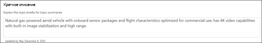

# Создание темы 

В темах Viva можно создать новый раздел, если он не обнаружен посредством индексации или если технология ИИ не обнаружила достаточных свидетельств, чтобы установить его в качестве темы.

> [!Note] 
> Хотя сведения в теме, собираемой ИИ, урезаны по [безопасности,](topic-experiences-security-trimming.md)обратите внимание, что описание темы и сведения о пользователях в созданном вручную разделе видны всем пользователям, у которых есть разрешения на просмотр этой темы. 

## Требования

Чтобы создать новый раздел, необходимо:
- Лицензия На Viva Topics.
- Разрешения на создание и редактирование тем для [**who.**](https://docs.microsoft.com/microsoft-365/knowledge/topic-experiences-user-permissions) Администраторы знаний могут предоставить пользователям это разрешение в параметрах разрешений раздела Viva Topics. 

> [!Note] 
> Пользователи, у которых есть разрешения на управление темами в центре тем (менеджеры по знаниям), уже имеют разрешения на создание и редактирование тем.

## Создание темы

Новый раздел можно создать из двух мест:

- Домашняя страница Центра тем:  любой лицензированный пользователь с разрешением "Кто может создавать или редактировать <b></b> разделы" может создать новый раздел в центре тем, выбрав меню "Создать" и выбрав страницу <b>"Тема".</b>  

       

- Страница "Управление разделами":  любой лицензированный пользователь с разрешениями "Кто может управлять темами" (менеджеры по знаниям) может создать новый раздел на странице "Управление темами" в Центре тем, выбрав страницу "Создать <b>раздел".</b>  

       

### Чтобы создать новый раздел:

1. В разделе **"Имя"** введите имя нового раздела.

       

2. В разделе <b>"Альтернативные</b> имена" введите любые другие имена, на которые можно ссылается тема. 

       
3. В разделе <b>"Описание"</b> введите несколько предложений, описывая тему. 

     

4. В разделе <b>"Закрепленные</b> люди" можно "закрепить" человека, чтобы показать его в качестве эксперта по теме. Начните с ввода имени или <b></b> адреса электронной почты в поле добавления нового пользователя, а затем выберите пользователя, которого вы хотите добавить в результатах поиска. Вы также можете "открепить" <b></b> их, написав значок "Удалить из списка" на карточке пользователя. Вы также можете перетащить человека, чтобы изменить порядок появления списка людей.
 
     

5. В разделе <b>"Закрепленные</b> файлы и страницы" можно добавить или закрепить файл или страницу сайта SharePoint, связанную с темой.

    
 
    Чтобы добавить новый файл, выберите <b>"Добавить",</b>выберите сайт SharePoint на часто используемых или посещаемых сайтах, а затем выберите файл в библиотеке документов сайта.

    Вы также можете использовать параметр <b>"Из</b> ссылки", чтобы добавить файл или страницу, предоставив URL-адрес. 

    > [!Note] 
    > Файлы и страницы, которые вы добавляете, должны располагаться в одном клиенте Microsoft 365. Если вы хотите добавить ссылку на внешний ресурс в этом разделе, вы можете добавить ее с помощью значка холста на шаге 8.

6.  В <b>разделе "Связанные сайты"</b> показаны сайты с информацией об этой теме. 

     

    Вы можете добавить связанный <b></b> сайт, выбрав "Добавить", а затем либо выявив его, либо выбрав его в списке часто используемых или недавних сайтов. 
    
     

7. В <b>разделе "Связанные</b> разделы" показаны связи между разделами. Вы можете добавить подключение к другому <b></b> разделу, настроив кнопку "Подключиться к связанному разделу", а затем введя имя связанного раздела и выбрав его в результатах поиска. 

      

    Затем можно дать описание связи между темами и выбрать <b>"Обновить".</b> 

     

   Добавленный раздел будет отображаться как связанный раздел.

     

   Чтобы удалить связанный раздел, выберите раздел, который нужно удалить, а затем выберите значок "Удалить <b>тему".</b> 
 
      

   Затем выберите <b>"Удалить".</b> 

     
     
 

8. Вы также можете добавить на страницу статические элементы (например, текст, изображения или ссылки), выбрав значок холста, который можно найти под кратким описанием. Если выбрать его, откроется инструментарий SharePoint, на котором можно выбрать элемент, который нужно добавить на страницу.

     

9. Выберите **"Опубликовать",** чтобы сохранить изменения. 

После публикации страницы имя темы, альтернативное имя, описание и закрепленные пользователи будут отображаться для всех лицензированных пользователей, просматривавших тему. Определенные файлы, страницы и сайты отображаются на странице темы, только если у просматриваемой папки есть разрешения office 365 на элемент. 

## См. также

  

