# Изменение существующей темы в Microsoft Viva TopicsEdit an existing topic in Microsoft Viva Topics 

 

> [!VIDEO https://www.microsoft.com/videoplayer/embed/RE4LA4n]  

 

В Viva Topics можно изменить существующую тему.In Viva Topics, you can edit an existing topic. Это может потребоваться для исправления или добавления дополнительных сведений на существующую страницу темы.You might need to do this if you want to correct or add additional information to an existing topic page. 

> [!Note] 
> Хотя сведения в теме, собираемой ИИ, обрезаются, описание темы и сведения о пользователях, которые вы добавляете вручную при редактировании существующей темы, видны всем пользователям, у которых есть разрешения на просмотр тем.While information in a topic that is gathered by AI is [security trimmed](topic-experiences-security-trimming.md), the topic description and people information that you manually add when editing an existing topic is visible to all users who have permissions to view topics. 

## RequirementsRequirements

Чтобы изменить существующую тему, необходимо:To edit an existing topic, you need to:
- лицензия на Viva Темы;Have a Viva Topics license.
- Есть разрешения на [создание или редактирование тем.](./topic-experiences-user-permissions.md)Have permissions to [create or edit topics](./topic-experiences-user-permissions.md). Администраторы баз знаний могут предоставлять пользователям такие разрешения в разделе параметров разрешений Viva Темы.Knowledge admins can give users this permission in the Viva Topics topic permissions settings. 

> [!Note] 
> Пользователи, у которых есть разрешение на управление темами в центре тем (менеджеры знаний), уже имеют разрешения на создание и редактирование тем.Users who have permission to manage topics in the topic center (knowledge managers) already have permissions to create and edit topics.

## Редактирование страницы темыHow to edit a topic page

Пользователи, Кто  могут создавать или редактировать темы, могут изменить тему, открыв страницу темы  из выделенной темы, а затем выбрав кнопку Изменить в правом верхнем справа от страницы темы.Users who have the *Who can create or edit topics* permission can edit a topic by opening the topic page from a topic highlight, and then selecting the **Edit** button on the top right of the topic page. Страница темы также может быть открыта на домашней странице центра тем, на которой можно найти все темы, к которые вы подключены.The topic page can also be opened from the topic center home page where you can find all the topics that you have a connection to.

   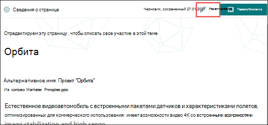   

Менеджеры знаний также могут редактировать разделы непосредственно со страницы **Управление** темами, выбрав тему, а затем выбрав **изменить** в панели инструментов.Knowledge managers can also edit topics directly from the **Manage topics** page by selecting the topic, and then selecting **Edit** in the toolbar.

   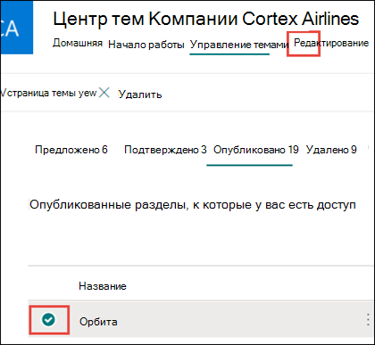

### Изменение страницы темыTo edit a topic page

1. На странице темы выберите **Изменить**.On the topic page, select **Edit**. Это позволяет при необходимости вносить изменения на странице темы.This lets you make changes as needed to the topic page.

     

2. В разделе **Альтернативные имена** введите любые другие имена, на которые может быть передана тема.In the **Alternate names** section, type any other names that the topic might be referred to. 

    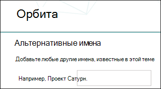

3. В разделе **Описание** введите несколько предложений, описывающих тему.In the **Description** section, type a couple of sentences that describes the topic. Если описание уже существует, при необходимости обновите его.Or if a description already exists, update it if needed.

    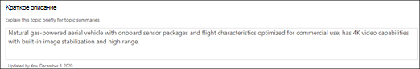 

4. В разделе **Закрепленные пользователи** можно закрепить пользователя, чтобы показать, что пользователь связан с темой (например, это владелец связанного ресурса).In the **Pinned people** section, you can "pin" a person to show them as having a connection the topic (for example, an owner of a connected resource). Начните с ввода имени или адреса электронной почты в поле **Добавление** нового пользовательского окна, а затем выберите пользователя, которого вы хотите добавить из результатов поиска.Begin by typing their name or email address in the **Add a new user** box, and then selecting the user you want to add from the search results. Их можно также "открепить", выбрав значок **Remove from list** на карточке пользователя.You can also "unpin" them by selecting the **Remove from list** icon on the user card.
 
     

    В **Рекомендуемые пользователи** показаны пользователи, которые, по мнению ИИ, могут быть связаны с темой, судя по их связи с ресурсами по этой теме.The **Suggested people** section shows users that AI thinks might be connected to the topic from their connection to resources about the topic. Вы можете изменить их состояние с Рекомендуемые на Закрепленные, выбрав значок закрепления на карточке пользователя.You can change their status from Suggested to Pinned by selecting the pin icon on the user card.

   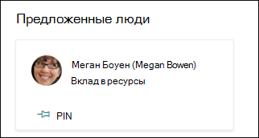

5. В разделе **Закрепленные файлы и страницы** вы можете добавить или "закрепить" файл либо страницу сайта SharePoint, связанного с темой.In the **Pinned files and pages** section, you can add or "pin" a file or SharePoint site page that is associated to the topic.

   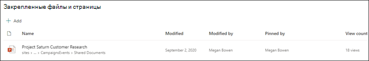
 
    Чтобы добавить новый файл, выберите **Добавить,** выберите SharePoint с сайтов Frequent или Followed, а затем выберите файл из библиотеки документов сайта.To add a new file, select **Add**, select the SharePoint site from your Frequent or Followed sites, and then select the file from the site's document library.

    Вы также можете добавить файл или страницу с помощью параметра **На основе ссылки**, указав URL-адрес.You can also use the **From a link** option to add a file or page by providing the URL. 

   > [!Note] 
   > Файлы и страницы, которые вы добавляете, должны располагаться в одном Microsoft 365 клиенте.Files and pages that you add must be located within the same Microsoft 365 tenant. Если вы хотите добавить ссылку на внешний ресурс в этой теме, вы можете добавить ее через значок холста на шаге 9.If you want to add a link to an external resource in the topic, you can add it through the canvas icon in step 9.

6. В **разделе Рекомендуемые файлы** и страницы показаны файлы и страницы, которые ИИ предлагает связывать с этой темой.The **Suggested files and pages** section shows files and pages that AI suggests to be associated to the topic.

   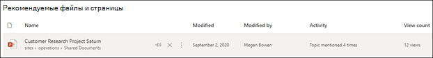

    Вы можете изменить рекомендуемый файл или страницу на закрепленный файл или страницу, выбрав значок закрепленного элемента.You can change a suggested file or page to a pinned file or page by selecting the pinned icon.

7.  В разделе **Закрепленные сайты** можно добавить или "закрепить" сайт, связанный с этой темой.In the **Pinned sites** section, you can add or “pin” a site that is associated to the topic. 

    

    Чтобы добавить новый сайт, выберите **Добавить,** а затем либо поискать сайт, или выбрать его из списка частых или недавних сайтов.To add a new site, select **Add** and then either search for the site, or select it from your list of Frequent or Recent sites.
    
    

8. В **разделе Рекомендуемые сайты** показаны сайты, которые ИИ предлагает быть связанными с этой темой.The **Suggested sites** section shows the sites that AI suggests to be associated to the topic. 

   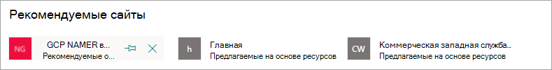  

    Вы можете изменить предложенный сайт на закрепленный сайт, выбрав закрепленный значок.You can change a suggested site to a pinned site by selecting the pinned icon.

<!---

7.  The <b>Related sites</b> section shows sites that have information about the topic. 

    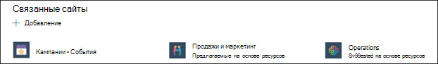 

    You can add a related site by selecting <b>Add</b> and then either searching for the site, or selecting it from your list of Frequent or Recent sites. 
    
    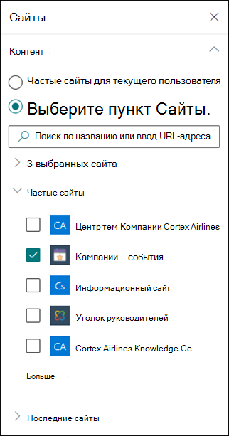 

8. The <b>Related topics</b> section shows connections that exists between topics. You can add a connection to a different topic by selecting the <b>Connect to a related topic</b> button, and then typing the name of the related topic, and selecting it from the search results. 

      

    You can then give a description of how the topics are related, and select <b>Update</b>. 

   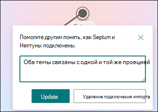  

   The related topic you added will display as a connected topic.

   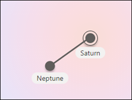  

   To remove a related topic, select the topic you want to remove, then select the <b>Remove topic</b> icon. 
 
      

   Then select <b>Remove</b>. 

   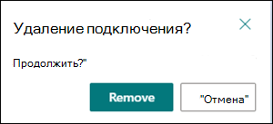  

--->

9. Вы также можете добавить на страницу статические элементы, например текст, изображения или ссылки, щелкнув значок холста под кратким описанием.You can also add static items to the page — such as text, images, or links - by selecting the canvas icon, which you can find below the short description. Выбор этого элемента откроет SharePoint, из которого можно выбрать элемент, который необходимо добавить на страницу.Selecting it will open the SharePoint toolbox from which you can choose the item you want to add to the page.

   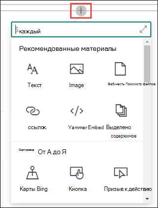

10. Нажмите кнопку **Опубликовать** или **Повторно опубликовать**, чтобы сохранить изменения.Select **Publish** or **Republish** to save your changes. **Переопубликовка** будет вашим доступным вариантом, если тема была опубликована ранее.**Republish** will be your available option if the topic has been published previously.

