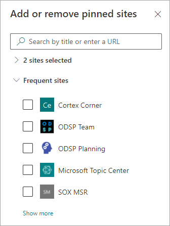

# Изменение существующей темы в Microsoft Viva Topics 

 

> [!VIDEO https://www.microsoft.com/videoplayer/embed/RE4LA4n]  

 

В Viva Topics можно изменить существующую тему. Это может потребоваться для исправления или добавления дополнительных сведений на существующую страницу темы. 

> [!Note] 
> Хотя сведения в теме, собираемой ИИ, обрезаются, описание темы и сведения о пользователях, которые вы добавляете вручную при редактировании существующей темы, видны всем пользователям, у которых есть разрешения на просмотр тем. 

## Requirements

Чтобы изменить существующую тему, необходимо:
- лицензия на Viva Темы;
- Есть разрешения на [создание или редактирование тем.](./topic-experiences-user-permissions.md) Администраторы баз знаний могут предоставлять пользователям такие разрешения в разделе параметров разрешений Viva Темы. 

> [!Note] 
> Пользователи, у которых есть разрешение на управление темами в центре тем (менеджеры знаний), уже имеют разрешения на создание и редактирование тем.

## Редактирование страницы темы

Пользователи, Кто  могут создавать или редактировать темы, могут изменить тему, открыв страницу темы  из выделенной темы, а затем выбрав кнопку Изменить в правом верхнем справа от страницы темы. Страница темы также может быть открыта на домашней странице центра тем, на которой можно найти все темы, к которые вы подключены.

      

Менеджеры знаний также могут редактировать разделы непосредственно со страницы **Управление** темами, выбрав тему, а затем выбрав **изменить** в панели инструментов.

   

### Изменение страницы темы

1. На странице темы выберите **Изменить**. Это позволяет при необходимости вносить изменения на странице темы.

     

2. В разделе **Альтернативные имена** введите любые другие имена, на которые может быть передана тема. 

    

3. В разделе **Описание** введите несколько предложений, описывающих тему. Если описание уже существует, при необходимости обновите его.

     

4. В разделе **Закрепленные пользователи** можно закрепить пользователя, чтобы показать, что пользователь связан с темой (например, это владелец связанного ресурса). Начните с ввода имени или адреса электронной почты в поле **Добавление** нового пользовательского окна, а затем выберите пользователя, которого вы хотите добавить из результатов поиска. Их можно также "открепить", выбрав значок **Remove from list** на карточке пользователя.
 
     

    В **Рекомендуемые пользователи** показаны пользователи, которые, по мнению ИИ, могут быть связаны с темой, судя по их связи с ресурсами по этой теме. Вы можете изменить их состояние с Рекомендуемые на Закрепленные, выбрав значок закрепления на карточке пользователя.

   

5. В разделе **Закрепленные файлы и страницы** вы можете добавить или "закрепить" файл либо страницу сайта SharePoint, связанного с темой.

   
 
    Чтобы добавить новый файл, выберите **Добавить,** выберите SharePoint с сайтов Frequent или Followed, а затем выберите файл из библиотеки документов сайта.

    Вы также можете добавить файл или страницу с помощью параметра **На основе ссылки**, указав URL-адрес. 

   > [!Note] 
   > Файлы и страницы, которые вы добавляете, должны располагаться в одном Microsoft 365 клиенте. Если вы хотите добавить ссылку на внешний ресурс в этой теме, вы можете добавить ее через значок холста на шаге 9.

6. В **разделе Рекомендуемые файлы** и страницы показаны файлы и страницы, которые ИИ предлагает связывать с этой темой.

   

    Вы можете изменить рекомендуемый файл или страницу на закрепленный файл или страницу, выбрав значок закрепленного элемента.

7.  В разделе **Закрепленные сайты** можно добавить или "закрепить" сайт, связанный с этой темой. 

    

    Чтобы добавить новый сайт, выберите **Добавить,** а затем либо поискать сайт, или выбрать его из списка частых или недавних сайтов.
    
    

8. В **разделе Рекомендуемые сайты** показаны сайты, которые ИИ предлагает быть связанными с этой темой. 

     

    Вы можете изменить предложенный сайт на закрепленный сайт, выбрав закрепленный значок.

<!---

7.  The <b>Related sites</b> section shows sites that have information about the topic. 

     

    You can add a related site by selecting <b>Add</b> and then either searching for the site, or selecting it from your list of Frequent or Recent sites. 
    
     

8. The <b>Related topics</b> section shows connections that exists between topics. You can add a connection to a different topic by selecting the <b>Connect to a related topic</b> button, and then typing the name of the related topic, and selecting it from the search results. 

      

    You can then give a description of how the topics are related, and select <b>Update</b>. 

     

   The related topic you added will display as a connected topic.

     

   To remove a related topic, select the topic you want to remove, then select the <b>Remove topic</b> icon. 
 
      

   Then select <b>Remove</b>. 

     

--->

9. Вы также можете добавить на страницу статические элементы, например текст, изображения или ссылки, щелкнув значок холста под кратким описанием. Выбор этого элемента откроет SharePoint, из которого можно выбрать элемент, который необходимо добавить на страницу.

   

10. Нажмите кнопку **Опубликовать** или **Повторно опубликовать**, чтобы сохранить изменения. **Переопубликовка** будет вашим доступным вариантом, если тема была опубликована ранее.

